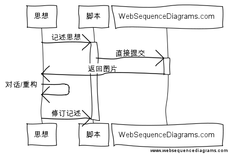
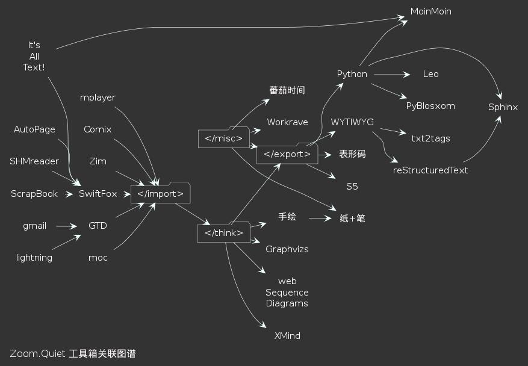

.. include:: <s5defs.txt>

==================================================================
我的工具箱
==================================================================

～持续的效率进化之旅 (powered by rst2S5)

:Authors: `Zoom.Quiet <zoomquiet+sns@gmai.com>`__
:Date:    `2010-09-18 <http://wiki.szlug.org/w/Software_Freedom_Day_2010>`__
:URL:    http://zoomquiet.org/res/s5/100918-MyTools/rst2s5/

.. This document has been placed in the CC domain.
.. _Docutils: http://docutils.sourceforge.net/
.. _reStructuredText: http://docutils.sourceforge.net/rst.html
.. _S5: http://meyerweb.com/eric/tools/s5/
.. _Firefox: http://www.mozilla.com/firefox/

.. _Zoom.Quiet:
    http://code.google.com/p/openbookproject/wiki/ZoomQuiet
.. _(CC)by-nc-sa:
    http://creativecommons.org/licenses/by-nc-sa/2.5/cn/
.. _FireFox:
    http://www.mozilla.com/firefox/
.. _S5介绍:
    http://zoomquiet.org/res/s5/100826-PyTDD/s5.html
.. _WYTIWYG:
    http://wiki.woodpecker.org.cn/moin/WyTiWyG

.. 图片定义区
.. |bullet| unicode:: U+02022
.. |mode| unicode:: U+00D8 .. capital o with stroke

.. |S5icon| image:: pix/S5icon.GIF
    :align: top
    :scale: 100 %
    :target: http://www.meyerweb.com/eric/tools/s5/
.. |LeoProse| image:: pix/LeoProse.gif
    :align: top
    :scale: 100 %
    :target: http://wiki.woodpecker.org.cn/moin/LeoEnvironment
.. |cc-byncsa31| image:: i/icon/cc-byncnd-88x31.png
   :alt: (CC)by-nc-sa 许可证
   :target: http://creativecommons.org/licenses/by-nc-sa/2.5/cn/
.. |cc-byncsa15| image:: i/icon/cc-byncnd-80x15.png
   :alt: (CC)by-nc-sa 许可证
   :target: http://creativecommons.org/licenses/by-nc-sa/2.5/cn/
.. |zqeye| image:: i/id/zoomquiet_1-1_outline.png
   :alt: 是也乎;-)
   :target: http://wiki.woodpecker.org.cn/moin/ZoomQuiet

.. |lr_s5| image:: i/levelradar_s5.png
    :scale: 100 %

.. footer:: 
   .. class:: borderless

   =============  ====================================
   `Zoom.Quiet`_  |cc-byncsa15|
   -------------  ------------------------------------
   v10.09.16      推荐用 `FireFox`_ 获得最佳游览效果
   =============  ====================================

<免责/>
=========

.. container:: handout

   山寨的，非业界公认的，个人体验为基础!
   |zqeye|

.. class:: takahashi1

    参考所有同好行为总结而得

    .. class:: incremental

    - 一切资料来自网络互动挖掘
    - 一切想法来自日常学习工作
    - 一切体悟来自各种沟通交流
    - 一切知识来自社区分享印证
    - 一切经验来自个人失败体验

高橋流!
=========

.. container:: handout

   `Takahashi-method 幻灯风格 <http://blog.derjohng.com/2006/04/12/takahashi-method-%E7%B0%A1%E5%A0%B1/>`__ 
   源自 Ruby 创始人高橋征義(Masayoshi Takahashi)

.. class:: center

    .. image:: pix/Takahashi-method.jpg
        :scale: 150 %
        :alt: 高橋流
        :align: center
        :target: http://blog.derjohng.com/2006/04/12/takahashi-method-%E7%B0%A1%E5%A0%B1/

文字
=========

.. container:: handout

   `Takahashi-method 幻灯风格 <http://blog.derjohng.com/2006/04/12/takahashi-method-%E7%B0%A1%E5%A0%B1/>`__ 
   源自 Ruby 创始人高橋征義(Masayoshi Takahashi)

.. class:: center takahashi9

    巨大

幻灯
=========

.. container:: handout

   `Takahashi-method 幻灯风格 <http://blog.derjohng.com/2006/04/12/takahashi-method-%E7%B0%A1%E5%A0%B1/>`__ 
   源自 Ruby 创始人高橋征義(Masayoshi Takahashi)

.. class:: center takahashi9

    很多

播放
=========

.. container:: handout

   `Takahashi-method 幻灯风格 <http://blog.derjohng.com/2006/04/12/takahashi-method-%E7%B0%A1%E5%A0%B1/>`__ 
   源自 Ruby 创始人高橋征義(Masayoshi Takahashi)

.. class:: center takahashi9

    快!

播放
=========

.. container:: handout

   `Takahashi-method 幻灯风格 <http://blog.derjohng.com/2006/04/12/takahashi-method-%E7%B0%A1%E5%A0%B1/>`__ 
   源自 Ruby 创始人高橋征義(Masayoshi Takahashi)

.. class:: center takahashi8

    很快!

播放
=========

.. container:: handout

   `Takahashi-method 幻灯风格 <http://blog.derjohng.com/2006/04/12/takahashi-method-%E7%B0%A1%E5%A0%B1/>`__ 
   源自 Ruby 创始人高橋征義(Masayoshi Takahashi)

.. class:: center takahashi7

    非常快!

所以:
=========

.. container:: handout

   `Takahashi-method 幻灯风格 <http://blog.derjohng.com/2006/04/12/takahashi-method-%E7%B0%A1%E5%A0%B1/>`__ 
   源自 Ruby 创始人高橋征義(Masayoshi Takahashi)

.. class:: center takahashi10

    :orange:`听`

<brief/>
=========

.. container:: handout

   俺->工具->持续完善 |zqeye|

.. class:: takahashi

    - :orange:`5' 有关ZQ`
    - :silver:`45' 效能工具箱`
    - :silver:`10'自由沟通`

<Zoom.Quiet>
==================

.. container:: handout

   |zqeye|

.. class:: takahashi

    .. image:: i/id/100514-zq-eye.png
        :align: center
        :scale: 80 %
        :alt: 是也乎,是也乎

    .. image:: i/map/50ren-ZoomQuiet-s5-v800.png
        :align: center
        :scale: 100 %
        :alt: Zoom.Quiet
        :target: http://zoomquiet.org

本命年
==================

.. container:: handout

   |zqeye|

.. class:: takahashi8

    36

广告@常州
==================

.. container:: handout

   大学时代入错行，浪费两年;-{ |zqeye|

.. class:: takahashi8

    1999

开发@上海
==================

.. container:: handout

   战上海:HTML->JS->PHP->XSL->Py |zqeye|

.. class:: takahashi8

    ~2004

PI@北京
==================

.. container:: handout

   混北京:SINA->CPyUG->SLL |zqeye|

.. class:: takahashi8

    ~2007

`2003:CZUG.org <http://czug.org/>`__
======================================================

.. container:: handout

   learnning Zope/Plone... |zqeye|

.. class:: takahashi1

    - **C** hina
    - **Z** ope
    - **U** ser
    - **G** roup

    .. image:: i/logo/logo-czug.png
        :align: center
        :scale: 100 %
        :alt: http://czug.org

`2004:啄木鸟 <http://www.woodpecker.org.cn/>`__
=================================================

.. container:: handout

   admin. MoinMoin 1.2.4... |zqeye|

.. class:: center

    .. image:: i/logo/logo-wpwww_banner.png
        :align: center
        :scale: 100 %
        :alt: http://www.woodpecker.org.cn

    - |logo_wpwiki_banner| \ :sup:`MoinMoin 1.4.*`\    
    - |wiki_banner| \ :sup:`MoinMoin 1.7.*`\    
    - |wp_zoomq_scrot| \ :sup:`MoinMoin 1.9.*`\

.. |logo_wpwiki_banner| image:: i/logo/logo_wpwiki_banner.gif
    :align: bottom
    :scale: 100 %
    :alt: http://www.woodpecker.org.cn

.. |wiki_banner| image:: i/logo/logo_wp-wiki_banner.png
    :align: bottom
    :scale: 100 %
    :alt: http://wiki.woodpecker.org.cn

.. |wp_zoomq_scrot| image:: i/logo/logo_wiki-wp_zoomq_scrot.png
    :align: bottom
    :scale: 100 %
    :alt: http://wiki,woodpecker.org.cn

2005:`CPyUG`__-> BPyUG
======================================================

__ http://wiki.woodpecker.org.cn/moin/BPUG/2005-07-30
.. container:: handout

   working with Python,in SINA.com |zqeye|

.. class:: takahashi1

    .. image:: i/logo/CPUGlogo.png
        :align: center
        :scale: 100 %
        :alt: CPyUG
        :target: http://wiki.woodpecker.org.cn/moin/CPUG

2007:`ZPyUG`__
======================================================

__ http://wiki.woodpecker.org.cn/moin/ZPyUG

.. container:: handout

    - 在北京,主持完成了25次技术分享
    - 进入金山,使用Python 进行了各种平台的构建~ `KTRAC`__
    - spreading Python everywhere to everyone... 

__ http://py.kingsoft.net/ktrac

.. class:: takahashi1

    - **珠** 三角
    - **P** ython
    - **U** ser
    - **G** roup

    .. image:: i/logo/logo_163_game.gif
        :align: center
    .. image:: i/logo/logo_sina_home.gif
        :align: center
    .. image:: i/logo/logo-ks.jpg
        :align: center

`ECUG.org`__
======================================================

__ http://ecug.org/
.. container:: handout

   spreading Python everywhere to everyone... |zqeye|

.. class:: takahashi1

    .. image:: i/logo/ecug-logo_67bw.jpg
        :align: center
        :scale: 100 %
        :alt: ECUG
        :target: http://code.google.com/p/ecug/wiki/FrontPage

2008:|SLL.org| "SLL.org"
======================================================

.. container:: handout

   spreading Pythonic everywhere to everyone... |zqeye|

.. class:: takahashi7

    教育大

    发现

.. class:: takahashi2 center

    http://sociallearnlab.org/

.. |SLL.org| image:: i/logo/2018-gz-sll.png
    :scale: 100 %
    :alt: SLL
    :target: http://sociallearnlab.org/wiki/index.php?title=EduAnn2018&variant=zh-cn

2009-09-01 出版
======================================================

.. container:: handout

   - 将多年的体验,集中到一本入门图书 "可爱的Python"
   - 并主持ZPyUG 近10次技术分享  |zqeye|

.. class:: takahashi1

    .. image:: i/090902-lovpy.jpg
        :align: center
        :scale: 100 %
        :alt: 可愛的Python
        :target: http://book.douban.com/subject/3884108/

2010~
======================================================

.. container:: handout

   社区在不断发展... |zqeye|

.. class:: takahashi1

    .. image:: i/snap/cpug-ml-zoomq-2010-06-04-111017_628x701_scrot.png
        :align: center
        :scale: 100 %
        :alt: python-cn@googlegroups.com
        :target: http://groups-beta.google.com/group/python-cn

综上...
==================

.. container:: handout

   基调是分享交流;-} |zqeye|

.. class:: takahashi

    俺就一

    `社区大妈`__

__ http://wiki.woodpecker.org.cn/moin/ZoomQuiet

帮吼！
==================

.. container:: handout

   基调练习... |zqeye|

.. class:: takahashi

    大妈！

    你错了！

</Zoom.Quiet>
==================

.. container:: handout

    - 纯种Pythoner，自由软件原教旨主义者 
    - 关注社会化教育及知识管理；喜爱SF和摄影。 
    - 尝试使用Pythonic体验感化国人主动进入自由软件世界体验/学习/再创作

.. class:: takahashi8

   (^.^)

<brief/>
=========

.. container:: handout

   俺->工具->持续完善 |zqeye|

.. class:: takahashi

    - :gray:`5' 有关ZQ`
    - :orange:`45' 效能工具箱`
    - :silver:`10'自由沟通`

<MyToolBox>
==================

.. container:: handout

   持续改进才有效果！ |zqeye|

.. class:: takahashi7

    ~14年

评估雷达
========================================================================

.. container:: handout

   - 专注度~没有意外功能..
   - 易用性度~学习成本
   - CIL可自动化性
   - 扩展度 ~ 数据是否标准
   - 社区活跃度

.. class:: takahashi7

    .. image:: i/levelradar_demo.png
        :align: center
        :scale: 100 %
        :alt: 雷达图
        :target: #

有关输入...
==================

.. container:: handout

   持续改进才有效果！ |zqeye|

.. class:: takahashi

    <import>

`ScrapBook <https://addons.mozilla.org/firefox/addon/427>`__
========================================================================

.. container:: handout

    易用离线网页抓取管理插件 |lr_scrapbook| 

.. class:: takahashi7

    .. image:: i/snap/zqtool_scrapbook_716x332_scrot.png
        :align: center
        :scale: 100 %
        :alt: ScrapBook
        :target: https://addons.mozilla.org/firefox/addon/427

.. |lr_scrapbook| image:: i/levelradar_scrapbook.png
    :align: middle
    :scale: 100 %

|logo-zim| `Zim <http://zim-wiki.org/>`__
========================================================================

.. container:: handout

   桌面维基,perl 实现,易用信息速记平台... |lr_zim|

.. |lr_zim| image:: i/levelradar_zim.png
    :align: middle
    :scale: 100 %

.. class:: takahashi7

    .. image:: i/snap/zqtool-zim_1065x398_scrot.png
        :align: center
        :scale: 100 %
        :alt: Zim
        :target: #

.. |logo-zim| image:: i/logo/logo-zim-h90.gif
    :align: top
    :scale: 100 %
    :alt: Zim
    :target: http://zim-wiki.org/

`SwiftFox <http://getswiftfox.org/>`__
========================================================================

.. container:: handout

   Linux 平台专用加速火狐!... |lr_swiftfox| 

.. |lr_swiftfox| image:: i/levelradar_swiftfox.png
    :align: middle
    :scale: 100 %

.. class:: takahashi7

    .. image:: i/snap/zqtool-swiftfox_986x483_scrot.png
        :align: center
        :scale: 100 %
        :alt: 敏捷狐
        :target: #

|logo-autopager| `AutoPage <https://addons.mozilla.org/en-US/firefox/addon/4925/>`__
==============================================================================================

.. |logo-autopager| image:: i/logo/logo-autopager.png
    :align: top
    :scale: 100 %
    :alt: Zim
    :target: http://zim-wiki.org/

.. container:: handout

   省时杀器~自动翻页机!... |lr_autopage|

.. |lr_autopage| image:: i/levelradar_autopage.png
    :align: middle
    :scale: 100 %

.. class:: takahashi7

    .. image:: i/snap/zqtool-autopager_1027x406_scrot.png
        :align: center
        :scale: 100 %
        :target: #

`CHM Reader <https://sourceforge.net/projects/chmreader/>`__
==============================================================================================

.. container:: handout

   .chm帮助查阅最爱插件!... |lr_chmreader|

.. |lr_chmreader| image:: i/levelradar_chmreader.png
    :align: middle
    :scale: 100 %

.. class:: takahashi7

    .. image:: i/snap/zqtool-chmreader_973x433_scrot.png
        :align: center
        :scale: 100 %
        :target: #

|logo-gmail|
==============================================================================================

.. |logo-gmail| image:: i/logo/logo-gmail.gif
    :align: top
    :scale: 100 %
    :target: http://mail.google.com/support/?hl=cn

.. container:: handout

    核心的核心沟通平台! |lr_gmail|

.. |lr_gmail| image:: i/levelradar_gmail.png
    :align: middle
    :scale: 100 %

.. class:: takahashi7

    .. image:: i/snap/zqtool-gmail_1014x497_scrot.png
        :align: center
        :scale: 100 %
        :target: #

面对复杂
==============================================================================================

.. container:: handout

    要形成靠谱的反射性的应对... |zqeye|

.. class:: takahashi7

    `GTD <http://www.gtdstudy.com/?p=828>`__

GTD总流程
==============================================================================================

.. container:: handout

    Get Things Done 是种生活态度... |zqeye|

.. class:: takahashi7

    .. image:: i/map/GTD_v2CN.JPG
        :align: center
        :scale: 80 %
        :target: http://bit.ly/cA0jBu

工作邮件态度:收件箱...
==============================================================================================

.. container:: handout

    GTD分类配合定期处置／回顾，以及固化的处理行为！... |zqeye|

.. class:: takahashi7

    .. class:: borderless

    =====  ====
     空!   |tb|
    =====  ====

.. |tb| image:: i/snap/zqtool-thunderbird_583x444_scrot.png
    :align: top
    :scale: 100 %
    :target: #

2010-09-17-lighting_scrot.png

`Lightning <http://www.mozilla.org/projects/calendar/releases/lightning1.0b2.html>`__
==============================================================================================

.. container:: handout

    独立的日历/事务/行程 综合管理中心! |lr_lightning|

.. |lr_lightning| image:: i/levelradar_lightning.png
    :align: middle
    :scale: 100 %

.. class:: takahashi7

    .. image:: i/snap/2010-09-17-lighting_scrot.png
        :align: center
        :scale: 90 %
        :target: #

`moc <http://moc.daper.net/>`__
==============================================================================================

.. container:: handout

    命令行中的音乐播放器 |lr_moc|

.. |lr_moc| image:: i/levelradar_moc.png
    :align: middle
    :scale: 100 %

.. class:: takahashi7

    .. image:: i/snap/zqtool-moc_931x489_scrot.png
        :align: center
        :scale: 100 %
        :target: #

`mplayer <http://www.mplayerhq.hu/>`__
==============================================================================================

.. container:: handout

    无敌强力播放平台! |lr_mplayer|

.. |lr_mplayer| image:: i/levelradar_mplayer.png
    :align: middle
    :scale: 100 %

.. class:: takahashi7

    .. image:: i/snap/zqtool-mplayer-xgl-compiz-01.jpg
        :align: center
        :scale: 100 %
        :target: #

`Comix <http://comix.sourceforge.net/>`__
==============================================================================================

.. container:: handout

    越用越好的轻便漫画浏览器! |lr_comix|

.. |lr_comix| image:: i/levelradar_comix.png
    :align: middle
    :scale: 100 %

.. class:: takahashi7

    .. image:: i/snap/zqtool-comix_809x419_scrot.png
        :align: center
        :scale: 100 %
        :target: #

有关输入...
==================

.. container:: handout

   9+ 输入加速 只要愿意任何一个常用行为,都有可提升效率的工具来支持! |zqeye|

.. class:: takahashi

    </import>

有关思考...
==================

.. container:: handout

   持续改进才有效果！... |zqeye|

.. class:: takahashi

    <think>

`思维导图 <http://book.douban.com/subject/3691437/>`__
========================================================================

.. container:: handout

   TONY.BUZAN发明的思維工具,极靠谱的风行全球...... |zqeye|

.. class:: takahashi

    `Mind map <http://en.wikipedia.org/wiki/Mind_map>`__

|logo-xmind|
==============================================================================================

.. |logo-xmind| image:: i/logo/logo-xmind.png
    :align: top
    :scale: 100 %
    :target: http://www.xmind.net

.. container:: handout

    最新开源跨平台思維导图工具,支持快速分享空间!! |lr_xmind|

.. |lr_xmind| image:: i/levelradar_xmind.png
    :scale: 100 %

.. class:: takahashi7

    .. image:: i/snap/zqtool-xmind_809x494_scrot.png
        :align: center
        :scale: 100 %
        :target: http://www.xmind.net/share/zoomquiet/

`Graphviz <http://www.graphviz.org/About.php>`__
==============================================================================================

.. container:: handout

    来自AT&T 的绝佳图形脚本工具! |lr_graphviz|

.. |lr_graphviz| image:: i/levelradar_graphviz.png
    :scale: 100 %

.. class:: takahashi7

    .. image:: i/snap/zqtool-dot-moin_761x433_scrot.png
        :align: center
        :scale: 100 %
        :target: #

|logo-doxygen|
==============================================================================================

.. |logo-doxygen| image:: i/logo/logo-doxygen.png
    :align: top
    :scale: 100 %
    :target: http://www.doxygen.org

.. container:: handout

    通用文档化注释工具... |zqeye|

.. class:: takahashi7

    .. image:: i/snap/dot_8c__incl.png
        :align: center
        :scale: 80 %
        :target: http://www.graphviz.org/pub/graphviz/development/doxygen/html/dot_8c.html

`WebSequenceDiagrams.com`__
==============================================================================================

__ http://www.websequencediagrams.com/

.. container:: handout

    云端序列图谱生成服务... |zqeye|

.. code-block:: python

    # wsd_flow.txt
        participant "思想" as mind
        participant "脚本" as txt
        participant "WebSequenceDiagrams.com" as WSD

        mind->txt: 记述思想
        activate txt
        txt->WSD: 直接提交
        activate WSD
        WSD->mind: 返回图片
        deactivate WSD
        mind->mind: 对话/重构
        deactivate mind
        mind->txt: 修订记述

`WebSequenceDiagrams.com`__ 默认风格
==============================================================================================

__ http://www.websequencediagrams.com/

.. container:: handout

    云端序列图谱生成服务... |zqeye|

.. image:: i/wsd_flow-default.png
    :align: center
    :scale: 120 %
    :target: http://www.websequencediagrams.com/

`WebSequenceDiagrams.com`__ 风格:qsd
==============================================================================================

__ http://www.websequencediagrams.com/

.. container:: handout

    云端序列图谱生成服务... |zqeye|

.. image:: i/wsd_flow-qsd.png
    :align: center
    :scale: 120 %
    :target: http://www.websequencediagrams.com/

`WebSequenceDiagrams.com`__ 风格:modern-blue
==============================================================================================

__ http://www.websequencediagrams.com/

.. container:: handout

    云端序列图谱生成服务... |zqeye|

.. image:: i/wsd_flow-modern-blue.png
    :align: center
    :scale: 120 %
    :target: http://www.websequencediagrams.com/

`WebSequenceDiagrams.com`__ 风格:omegapple
==============================================================================================

__ http://www.websequencediagrams.com/

.. container:: handout

    云端序列图谱生成服务... |zqeye|

.. image:: i/wsd_flow-omegapple.png
    :align: center
    :scale: 120 %
    :target: http://www.websequencediagrams.com/

`WebSequenceDiagrams.com`__ 风格:napkin
==============================================================================================

__ http://www.websequencediagrams.com/

.. container:: handout

    云端序列图谱生成服务... |lr_WSD|

手绘
==============================================================================================

.. container:: handout

    直觉的记录思維!... |lr_handraw|

.. |lr_handraw| image:: i/levelradar_handraw.png
    :scale: 100 %

.. class:: takahashi7

    .. image:: i/handarw-mindmap.gif
        :align: center
        :scale: 80 %
        :target: http://wiki.woodpecker.org.cn/moin/ZoomqMindMapping

有关思考...
==================

.. container:: handout

   在任何情况下坚持使用思维导图才能积累出分析型思維... |zqeye|

.. class:: takahashi

    </think>

有关输出...
==================

.. container:: handout

   输出相关成果,具效率最应该打磨...... |zqeye|

.. class:: takahashi

    <export>

|logo-bxm| **表形码**
==============================================================================================

.. |logo-bxm| image:: i/logo/logo_bxm.gif
    :align: top
    :scale: 100 %
    :target: http://zh.wikipedia.org/zh/%E8%A1%A8%E5%BD%A2%E7%A0%81

.. container:: handout

    消失在历史中的优秀输入法!... |lr_bxm| 

.. |lr_bxm| image:: i/levelradar_bxm.png
    :scale: 100 %

.. class:: borderless

   =========  =======
   |denobxm|  |zqbxm|
   =========  =======

.. |denobxm| image:: i/snap/bxm-3.gif
    :align: top
    :scale: 90 %
    :target: #
.. |zqbxm| image:: i/snap/zqtool-bxm-selfdesine_463x380_scrot.png
    :align: top
    :scale: 100 %
    :target: http://blog.zoomquiet.org/pyblosxom/Zen/Chinese/winbx-IMEstory-2006-05-15-12-00.html

`WYSIWYG`_
==============================================================================================

.. container:: handout

    单纯的角色才有助于卓越的成果生产!任何所见即所得的撰写环境都是扯!... |zqeye|

.. class:: takahashi7

    `所想`__

    `即所得`__

__ http://wiki.woodpecker.org.cn/moin/WyTiWyG
__ http://wiki.woodpecker.org.cn/moin/WyTiWyG

`txt2tags <http://txt2tags.sourceforge.net/>`__
==============================================================================================

.. container:: handout

    撰写一次,任意格式输出的轻快结构化文本单脚本工具!... |lr_t2t| 

.. |lr_t2t| image:: i/levelradar_t2t.png
    :scale: 100 %

.. class:: takahashi7

    .. image:: i/snap/zqtool-t2t-octus.gif
        :align: center
        :scale: 100 %
        :target: http://txt2tags.sourceforge.net/

|logo-rst|
==============================================================================================

.. |logo-rst| image:: i/logo/rst.png
    :align: top
    :scale: 100 %
    :target: http://docutils.sourceforge.net/rst.html

.. container:: handout

    最标准和强大的结构化文本协议!... |lr_rst|

.. |lr_rst| image:: i/levelradar_rst.png
    :scale: 100 %

.. class:: takahashi7

    .. image:: i/snap/zqtool-rst_853x423_scrot.png
        :align: center
        :scale: 100 %
        :target: #

|logo_rst2a|
==============================================================================================

.. |logo_rst2a| image:: i/logo/rst2a.gif
    :align: top
    :scale: 100 %
    :target: http://rst2a.com/api/

.. container:: handout

    最标准和强大的结构化文本协议!... |zqeye|

.. class:: takahashi7

    在线

    转换

`S5 <http://www.meyerweb.com/eric/tools/s5/>`__
==============================================================================================

.. container:: handout

    纯HTML 幻灯撰写框架!... |lr_s5| 

- S\ :sup:`5`\ == a :orange:`S` imple :orange:`S` tandards-Based :orange:`S` lide :orange:`S` how :orange:`S` ystem 

 - 仅仅依靠 CSS+JS 的HTML格式幻灯演示框架

- 我的编辑环境: |LeoProse| ~ `文学化编辑器 <http://en.wikipedia.org/wiki/Literate_programming>`__

.. image:: pix/2010-01-18-230729_605x421_leo.png
    :align: center
    :scale: 100 %
    :target: http://wiki.woodpecker.org.cn/moin/LeoEnvironment

手工 |S5icon|
==============================================================================================

.. container:: handout

    简洁的幻灯解决方案... |zqeye|

.. class:: takahashi7

    .. image:: i/snap/zq_s5html_scrot.png
        :align: center
        :scale: 100 %
        :target: #

|logo-rst| 之 `rst2s5 <http://docutils.sourceforge.net/docs/user/slide-shows.html>`__
==============================================================================================

.. container:: handout

    禅样的幻灯解决方案... |zqeye|

.. class:: takahashi7

    .. image:: i/snap/zq_s5rst_scrot.png
        :align: center
        :scale: 100 %
        :target: #

|logo_sphinx|
==============================================================================================

.. |logo_sphinx| image:: i/logo/sphinx_barnner.png
    :align: top
    :scale: 100 %
    :target: http://sphinx.pocoo.org

.. container:: handout

    图书/帮助/网站，rST组织/管理/发布工具集... |lr_sphinx|

.. |lr_sphinx| image:: i/levelradar_sphinx.png
    :scale: 100 %

.. class:: takahashi7

    .. image:: i/snap/zqtool-sphinx_942x520_scrot.png
        :align: center
        :scale: 100 %
        :target: http://zoomquiet.org/w2py_manual_zh/

|pysuper|
==============================================================================================

.. |pysuper| image:: i/Py-super-black-v0.9.1-h90.png
    :align: top
    :scale: 100 %
    :target: http://docutils.sourceforge.net/rst.html

.. container:: handout

    高级通用脚本语言...随身的军刀!... |lr_px|

.. |lr_px| image:: i/levelradar_py.png
    :scale: 100 %

.. class:: takahashi7

    .. image:: i/snap/zqtool-pythonic_647x184_scrot.png
        :align: center
        :scale: 100 %
        :target: http://python.org
    .. image:: i/logo/python-logo_200x700.png
        :align: center
        :scale: 100 %
        :target: http://python.org

`Leo`_ 
============================================================================================================

.. _Leo:
    http://webpages.charter.net/edreamleo/front.html

.. container:: handout

    - **L** iterate **e** ditor with **o** utlines |lr_leo|
    - 奇异的文学化编辑环境，释放编程思维的自在! 

.. |lr_leo| image:: i/levelradar_leo.png
    :scale: 100 %

.. class:: takahashi0

    - |knuthzh| `Literate programming <http://en.wikipedia.org/wiki/Literate_programming>`__
    - |knuth| |leoeditor| 

.. |leoeditor| image:: i/snap/zqtool-leo_890x237_scrot.png
    :align: top
    :scale: 100 %
    :target: http://wiki.woodpecker.org.cn/moin/LeoEnvironment

.. |knuth| image:: i/foto/head-knuth-don.gif
    :align: top
    :scale: 100 %
    :target: http://www-cs-faculty.stanford.edu/~knuth/index.html

.. |TAOCP| image:: img/s4093193-TAOCP.jpg
    :align: top
    :scale: 80 %
    :target: http://book.douban.com/subject/1130500/

|moin| `MoinMoin <http://moinmoin.in>`__
============================================================================================================

.. |moin| image:: i/logo/logo-moinmoin.png
    :align: top
    :scale: 100 %
    :target: http://moinmoin.in

.. container:: handout

    主流维基引擎，无DB，纯Py 扩展丰富... |lr_moin|

.. |lr_moin| image:: i/levelradar_moin.png
    :scale: 100 %

.. class:: takahashi7

    .. image:: i/snap/zqtool-moinmoin_930x404_scrot.png
        :align: center
        :scale: 100 %
        :target: http://wiki.s.kingsoft.net/moin

`It's All Text! <http://addons.mozilla.org/firefox/4125>`__
============================================================================================================

.. container:: handout

    超给力的FF编辑辅助插件..... |lr_italltxt|

.. |lr_italltxt| image:: i/levelradar_italltxt.png
    :scale: 100 %

.. class:: takahashi7

    .. image:: i/snap/zqtool-isalltext_953x507_scrot.png
        :align: center
        :scale: 100 %
        :target: #

|pyb|
============================================================================================================

.. container:: handout

    纯geek 的blogging 系統.. |lr_pyb|

.. |lr_pyb| image:: i/levelradar_pyb.png
    :scale: 100 %

.. class:: takahashi7

    .. image:: i/snap/zqtool-t2t_1114x533_scrot.png
        :align: center
        :scale: 100 %
        :target: http://blog.zoomquiet.org/pyblosxom/

有关输出...
==================

.. container:: handout

   +8 输出工具 持续改进才有效果！ |zqeye|

.. class:: takahashi

    </export>

其它...
==================

.. container:: handout

   持续改进才有效果！ |zqeye|

.. class:: takahashi7

    <misc>

|workrave|
==============================================================================================

.. |workrave| image:: i/logo/logo-workrave.png
    :align: top
    :scale: 100 %
    :target: http://www.workrave.org/

.. container:: handout

    预防::重复性压力伤害 (Repetitive Strain Injury RSI) ... |lr_workrave|

.. class:: takahashi7

    .. image:: i/snap/workrave-exercises.gif
        :align: center
        :scale: 100 %
        :target: http://www.workrave.org/

|pomodoro|
==============================================================================================

.. |pomodoro| image:: i/logo/PomodoroTimer.png
    :align: top
    :scale: 100 %
    :target: http://www.infoq.com/cn/articles/pomodoro-practices

.. container:: handout

    转变时间使用观点和习惯... |zqeye|

.. class:: takahashi7

    .. image:: i/snap/zqtool-pomodorotechnique_665x540_scrot.png
        :align: center
        :scale: 100 %
        :target: http://www.pomodorotechnique.com/

|pomodoro|
==============================================================================================

.. container:: handout

    挤出来的时间怎么用?... |zqeye|

.. class:: takahashi7

    小时间?

|pomodoro|
==============================================================================================

.. container:: handout

    小时间发现后,怎么产出?... |zqeye|

.. class:: takahashi8

    精神

    集中

纸+笔
==============================================================================================

.. container:: handout

    永远无法替代的记录工具！... |lr_pen|

.. |lr_pen| image:: i/levelradar_pen.png
    :scale: 100 %

.. class:: takahashi8

    .. image:: i/snap/Moleskine_barnner.jpg
        :align: center
        :scale: 100 %
        :target: http://www.moleskineasia.com/

其它...
==================

.. container:: handout

   持续改进才有效果！ |zqeye|

.. class:: takahashi7

    </misc>

原则: **面向肌肉的操作**
====================================

.. container:: handout

   持续改进才有效果！ |zqeye|

.. class:: takahashi4

    -  **M** uscle
    -  **O** riented
    -  **O** perating

</MyToolBox>
==================

.. container:: handout

   持续改进才有效果！ |zqeye|

<Hope>
==================

.. container:: handout

   持续改进才有效果！ |zqeye|

.. class:: takahashi7

    持续

    改进

个人知识管理!
==================

.. container:: handout

   从尊重自个儿掌握的知识开始! |zqeye|

.. class:: takahashi7

    `PKM <http://sociallearnlab.org/wiki/index.php?title=PKM&variant=zh-cn>`__

SNS学习原理:0
=======================

.. container:: handout

   小时的我... |zqeye|

.. class:: takahashi7

    .. image:: i/_know-me.gif
        :align: center
        :scale: 150 %
        :alt: ScrapBook
        :target: http://wiki.woodpecker.org.cn/moin/WeKnow

SNS学习原理:1
=======================

.. container:: handout

   成长的我... |zqeye|

.. class:: takahashi7

    .. image:: i/_know-me1.gif
        :align: center
        :scale: 150 %
        :alt: ScrapBook
        :target: http://wiki.woodpecker.org.cn/moin/WeKnow

SNS学习原理:2
=======================

.. container:: handout

   成为一体的大家... |zqeye|

.. class:: takahashi7

    .. image:: i/_know-we.gif
        :align: center
        :scale: 150 %
        :alt: ScrapBook
        :target: http://wiki.woodpecker.org.cn/moin/WeKnow

SNS学习原理:反証
=======================

.. container:: handout

   向反方向... |zqeye|

.. class:: takahashi7

    .. image:: i/_know-dot.gif
        :align: center
        :scale: 150 %
        :alt: ScrapBook
        :target: http://wiki.woodpecker.org.cn/moin/WeKnow

`SECI模型`__
=======================

__ http://www.12manage.com/methods_nonaka_seci_zh.html

.. container:: handout

   - 知识只有流动才有价值...
   - 野中郁次郎（Ikujiro Nonaka）和竹内弘高（Hirotaka Takeuchi）认为...

.. class:: takahashi7

    .. image:: i/KMsys-Seci20m1.jpg
        :align: center
        :scale: 100 %
        :alt: ScrapBook
        :target: http://sociallearnlab.org/wiki/index.php?title=PKM&variant=zh-cn

知识之轮
=======================

.. container:: handout

    知识是种动态的流动状态! |zqeye|

.. class:: takahashi7

    .. image:: i/kmtranfer2.gif
        :align: center
        :scale: 120 %
        :alt: ScrapBook

EKM
=======================

.. container:: handout

    企业知识管理

    # 技术学派: KM是对信息的管理;

    # 行为学派: KM是对人的管理;

    # 综合学派: KM是将信息处理能力和人的创造力结合,增强组织对环境的适应能力; 

.. class:: takahashi7

    .. image:: i/kmzl2.jpg
        :align: center
        :scale: 100 %
        :alt: ScrapBook

Blogging 吧!
==================

.. container:: handout

   - A:练习表述;B:进入知识圈
   - `[编程杂谈]写写Blog吧-limodou的学习记录 <http://blog.donews.com/limodou/archive/2004/12/14/202590.aspx>`__

.. class:: takahashi7

    入圏

`OTAKU`__ 些什么吧!
====================================

__ http://zh.wikipedia.org/wiki/%E5%BE%A1%E5%AE%85%E6%97%8F

.. container:: handout

   功夫在诗外！拓展有益的社会关系，有利于... |zqeye|

.. class:: takahashi10

    宅

</Hope>
==================

.. container:: handout

   持续改进才有效果！ |zqeye|

- `提问的智慧 <http://wiki.woodpecker.org.cn/moin/AskForHelp>`__
- `邮件列表的规范和礼节 <http://www.woodpecker.org.cn/share/classes/050730-CPUG/usMaillist/>`__
- `WYTIWYG <http://wiki.woodpecker.org.cn/moin/WyTiWyG>`__
- `Wiki导览 +从入门到享用MoinMoin <http://www.woodpecker.org.cn/share/doc/SKSIG/DriveIntoMoinPub/>`__
- `"假学习"和"真学习" <http://www.zreading.cn/archives/1629.html>`__
- `我也有话要说 <http://www.lixiaolai.com/index.php/archives/9568.html>`__ \ :sup:`笑来系列`\
- `褪墨 <http://www.mifengtd.cn/about>`_  \ :sup:`专注GTD`\
- `如何进行人脉管理 <http://hi.baidu.com/wikicc/blog/item/388012f398f2efca0a46e0ac.html>`__
- ...

<brief/>
=========

.. container:: handout

   俺->工具->持续完善 |zqeye|

.. class:: takahashi

    - :gray:`5' 有关ZQ`
    - :gray:`45' 效能工具箱`
    - :orange:`10'自由沟通`

总之
=========

.. container:: handout

   期望可以记住的~单位时间可以记住的只有7+-2 个 |zqeye|

.. class:: incremental takahashi

    * 工具关乎人生态度 ;-}
    * 邮件管理改进最易获益;
    * 坚持 `WYTIWYG`_ 终身受益!
    * 纸笔永不过时...
    * 用各种渠道分享吧!

<discuss/>
==========

.. container:: handout

   |zqeye|

.. class:: takahashi8

    Q&A

.. class:: takahashi0

    http://zoomquiet.org/res/s5/100918-MyTools/rst2s5/

最后...
==================

.. container:: handout

   好书推荐... |zqeye|

.. class:: takahashi

    .. image:: i/s3958139-itbird.jpg
        :align: center
        :scale: 100 %
        :alt: IT小小鸟
        :target: http://book.douban.com/subject/4006425/

最后的最后...
==================

.. container:: handout

   好书推荐... |zqeye|

.. class:: takahashi

    .. image:: i/s4279952-zen4talk.jpg
        :align: center
        :scale: 100 %
        :alt: 讲演之禅
        :target: http://book.douban.com/subject/4760725/

<版本/>
=========

.. container:: handout

   |zqeye|

- 101005 根据盛大讲演现场反馈修订错误!
- 100926 增补EKM/工具关联图谱
- 100918 根据SFD2010深圳讲演现场反馈修订!
- 100917 增补软件评估雷图示
- 100915 迁移为 rST2S5 格式
- 100817 为SFD2010zs 重构... 
- 100728 增补髙桥流以及蕃茄时间说明 
- 100724 为金山新人培训重构 
- 100331 为珠三角技术沙龙创建

:反馈:
    Zoom.Quiet@gmail.com
:查阅:
    http://zoomquiet.org/res/s5/100918-MyTools/rst2s5/

`S5 <http://www.meyerweb.com/eric/tools/s5/>`__
==============================================================================================

.. container:: handout

    纯HTML 幻灯撰写框架!... |lr_s5| 

- S\ :sup:`5`\ == a :orange:`S` imple :orange:`S` tandards-Based :orange:`S` lide :orange:`S` how :orange:`S` ystem 

 - 仅仅依靠 CSS+JS 的HTML格式幻灯演示框架

- 我的编辑环境: |LeoProse| ~ `文学化编辑器 <http://en.wikipedia.org/wiki/Literate_programming>`__

.. image:: pix/2010-01-18-230729_605x421_leo.png
    :align: center
    :scale: 100 %
    :target: http://wiki.woodpecker.org.cn/moin/LeoEnvironment

