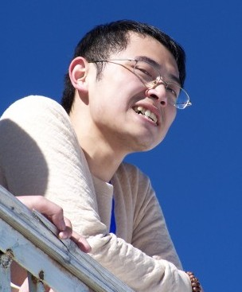
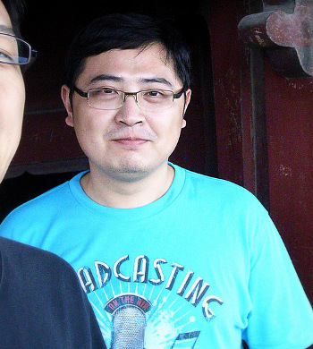

.. include:: <s5defs.txt>

==================================================================
图书;-)创造
==================================================================

～如何分享快乐成一本图书?

:作者: `周琦 <zoomquiet+sns@gmai.com>`__ (Zoom.Quiet)
:URL:   http://zoomquiet.org/res/s5/101121-TEDx1Kg/

.. This document has been placed in the CC domain.
.. _Docutils: http://docutils.sourceforge.net/
.. _reStructuredText: http://docutils.sourceforge.net/rst.html
.. _S5: http://meyerweb.com/eric/tools/s5/
.. _Firefox: http://www.mozilla.com/firefox/

.. _Zoom.Quiet:
    http://code.google.com/p/openbookproject/wiki/ZoomQuiet
.. _(CC)by-nc-sa:
    http://creativecommons.org/licenses/by-nc-sa/2.5/cn/
.. _FireFox:
    http://www.mozilla.com/firefox/
.. _S5介绍:
    http://zoomquiet.org/res/s5/100826-PyTDD/s5.html
.. _WYTIWYG:
    http://wiki.woodpecker.org.cn/moin/WyTiWyG

.. 图片定义区
.. |bullet| unicode:: U+02022
.. |mode| unicode:: U+00D8 .. capital o with stroke

.. |S5icon| image:: pix/S5icon.GIF
    :align: top
    :scale: 100 %
    :target: http://www.meyerweb.com/eric/tools/s5/
.. |LeoProse| image:: pix/LeoProse.gif
    :align: top
    :scale: 100 %
    :target: http://wiki.woodpecker.org.cn/moin/LeoEnvironment
.. |cc-byncsa31| image:: i/icon/cc-byncnd-88x31.png
   :alt: (CC)by-nc-sa 许可证
   :target: http://creativecommons.org/licenses/by-nc-sa/2.5/cn/
.. |cc-byncsa15| image:: i/icon/cc-byncnd-80x15.png
   :alt: (CC)by-nc-sa 许可证
   :target: http://creativecommons.org/licenses/by-nc-sa/2.5/cn/
.. |zqeye| image:: i/id/zoomquiet_1-1_outline.png
   :alt: 是也乎;-)
   :target: http://wiki.woodpecker.org.cn/moin/ZoomQuiet

.. footer:: 

   `Zoom.Quiet`_ v10.11.18 |cc-byncsa15| 推荐用 `FireFox`_ 获得最佳游览效果

<进度/>
=========

.. container:: handout

   俺->成书->使劲交流 |zqeye|

.. class:: takahashi3

    - :gray:`1' 我`
    - :orange:`11' 创书`

<Zoom.Quiet>
==================

.. container:: handout

   全家;-)

.. class:: takahashi7

    .. image:: i/foto/20100710-niuniu-all-38.jpg
        :align: center
        :scale: 100 %
        :alt: Zoom.Quiet
        :target: http://blog.sina.com.cn/momokobb

.. container:: notes

   - 我的女儿刚刚一岁半,非常牛,,,脾气牛,头脑牛,虽然不会说话,但是已经能指挥我们干活了...

今年是我
==================

.. container:: handout

   |zqeye|

.. class:: takahashi7

    本命年

.. container:: notes

   - 刚刚过了生日,应该说已经37岁了
   - 已经工作了12年

来自珠海
==================

.. container:: handout

    |zqeye|

.. class:: takahashi8

    .. image:: i/snap/101110-105937_ge-zh-sc_scrot.png
        :scale: 100 %
        :alt: Google Earth
        :align: center
        :target: #

.. container:: notes

   - 我来自中国南方的广东省,珠海市
   - 距离大家有 1300公里以上

家乡兰州
==================

.. container:: handout

    |zqeye|

.. class:: takahashi8

    .. image:: i/snap/101110-110534_ge-lz-zh_scrot.png
        :scale: 100 %
        :alt: Google Earth
        :align: center
        :target: #

.. container:: notes

   - 我出生的地方,在北边甘肃省兰州市
   - 距离工作的地方有 1800公里以上

</Zoom.Quiet>
==================

.. container:: handout

    高兴/紧张;分享创造的体验!/想知道大家的梦想 |zqeye|

.. class:: takahashi8

   (^.^)

.. container:: notes

   - 这次可以和大家见面,并高兴的聊天非常高兴!
   - 不仅高兴可以和大家分享我认为很好玩的事儿,
   - 更加高兴可以从大家这儿听到从前的自个儿可能都没有想到的事儿

可愛的Python
==================

.. container:: handout

   2009-09-02出版,

.. class:: takahashi

    .. image:: i/090902-lovpy.jpg
        :align: center
        :scale: 120 %
        :alt: 封面
        :target: http://www.china-pub.com/195771

.. container:: notes

   - 这本书,是有关开发语言 Python 的,
   - 不过,今天说的和内容无关,是和怎么写出这样一本挺厚的书相关的
   - 写成一本书,真的不是难事儿...

最大的特点
==================

.. container:: handout

    人多力量大!   

.. class:: takahashi9

    14

.. container:: notes

   - 这个是有别其它图书的最大特色了
   - 当然也有专门更多的人编写的百科全书
   - 我是说,同类型的图书中,我们这本的作者是最多的;-)

作者.0
==================

.. container:: handout

   创始人,Guido van Rossum,现在google |zqeye|

.. class:: takahashi

    .. image:: i/id/guido.png
        :align: center
        :scale: 100 %
        :target: http://blog.csdn.net/gvanrossum

.. container:: notes

   - 大我近20岁,是Python 语言的创造人,现在美国,Google 公司工作

催生婆们
==================

.. container:: handout

    编辑;杨绣国/怀孕间校对/几乎同时出生

.. class:: takahashi9

    7

.. container:: notes

   - 专业／耐心／认真的编辑是个宝！
   - 杨姐在怀孕期间完成了校对
   - 这书几乎是和宝宝一齐出生的

成书小传
====================================

.. container:: handout

   1500天...

.. class:: takahashi7

    :orange:`四年`

.. container:: notes

   - 前后其实用了1500天左右的时间才印刷出来的

成书小传::KDay 故事
====================================

.. container:: handout

   只是先自个儿记录心得

.. class:: takahashi

    2005-12

.. container:: notes

   - 源于在SINA中的真实工作实例...
   - 同时"Python源码剖析"开始连载
   - http://blog.donews.com/lemur/archive/2005/12/17/660973.aspx

成书小传::杨福川出现
====================================

.. container:: handout

   博文出版社/一个偶然的机会->MySQL

.. class:: takahashi

    06.12.29

.. container:: notes

   - 本来是讨论MySQL 相关的图书...
   - 结果我提及了Python 的现状,就鼓励我可以写本书来介绍

成书小传::小白心声
====================================

.. container:: handout

   是群众的需要激发了大家的欲望

.. class:: takahashi

    `07.02.01 <http://wiki.woodpecker.org.cn/moin/ObpBroadview/2007-02-01>`__

.. container:: notes

   - "建议给python新手指个明路..."
   - http://groups.google.com/group/CPyUG/browse_thread/thread/db96d586ad263a82
   - 小白的心声，激发了俺 Mind Hacking 的欲望!
   - http://wiki.woodpecker.org.cn/moin/ObpBroadview

成书小传::开始波折...
====================================

.. container:: handout

   出版不是简单的事儿....

.. class:: takahashi

    .. image:: i/snap/hopes_456x224_scrot.png
        :align: center
        :scale: 150 %
        :target: http://wiki.woodpecker.org.cn/moin/ObpLovelyPyEditorRule

.. container:: notes

   - 不断的调整图书内容结构，深深体会生产的滋味...

成书小传::压缩内容
====================================

.. container:: handout

   内容也不是越多越好...

.. class:: takahashi7

    592
    ~462

.. container:: notes

   - 图书是得有个中心选题,不是什么都讲才好的

成书小传:: 交付版本
====================================

.. container:: handout

   出版不是简单的事儿....

.. class:: takahashi

    `08.12.14 <http://code.google.com/p/openbookproject/wiki/LovPyRush>`__

.. container:: notes

   - r2062 http://code.google.com/p/openbookproject/source/detail?r=2064
   - 因为封面以及其它...继续折腾...

成书小传:: 成了!
==================

.. container:: handout

   2009-09-02

.. class:: takahashi

    .. image:: i/snap/lovpy-cover-girl.jpg
        :align: center
        :scale: 120 %
        :alt: 封面
        :target: http://www.china-pub.com/195771

.. container:: notes

   - 拿到图书时,非常高兴,因为这不是我一个人的图书
   - 在印刷出来之前,就已经成为大家共有的图书了,

成书小传:: 其实
==================

.. container:: handout

   有另外的设计的..

.. class:: takahashi

    .. image:: i/snap/lovpy-cover-boy.jpg
        :align: center
        :scale: 120 %
        :alt: 封面
        :target: http://www.china-pub.com/195771

.. container:: notes

   - 都是一个意思,,,象游戏一样,历险!快乐!

如何?
==================

.. container:: handout

    什么是图书?写书很复杂嘛?...

.. class:: takahashi8

    图书?

.. container:: notes

   - 什么是图书?
   - 写本图书很累嘛?

目标
==================

.. container:: handout

    "裤"!有趣并有用

.. class:: takahashi8

    COOL

.. container:: notes

   - 这个单词念 裤!
   - 意思就是与众不同,非常独特,令人骄傲

聚集
==================

.. container:: handout

    自然的/成为朋友/凝聚到一起...

.. class:: takahashi8

    朋友

.. container:: notes

   - 是得,只有认同目标的人,才可能共同在一起坚持付出,直到成功,
   - 这时,就已经是朋友了,

困难?
==================

.. container:: handout

    唯一的/不能急/象庄稼...

.. class:: takahashi8

    坚持

.. container:: notes

   - 不论简单还是困难,任何事儿,都是有终点的,但是不坚持永远到达不了

解决!
==================

.. container:: handout

    也要坚持/动力/保持成就感...

.. class:: takahashi8

    感激

.. container:: notes

   - 只有怀着感谢之心,才可能坚持,才可能協調起大家,
   - 因为都是为了共同的目标,任何误解,偏差都不是故意的,都有原因的,只要解决了就过去了
   - 任何一点进展,都是值得感谢的,因为我们在创造从来没有过的事物

秘决;-)
==================

.. container:: handout

    同样要坚持/什么是?怎么?什么?...

.. class:: takahashi9

    :orange:`分享`

.. container:: notes

   - 什么是分享?
   - 怎么分享?
   - 分享什么?
   - 最重要的是要快乐的分享,分享不应该成为束缚/要求,只有自然的分享,才能够有效的分享...

为什么分享?
==================

.. container:: handout

   知识管理的简单原理:

.. class:: takahashi

    .. image:: i/know-me0.gif
        :align: center
        :scale: 150 %
        :alt: 开始

.. container:: notes

   - 我们的知识领域开始很小

为什么分享?
==================

.. container:: handout

   随着学习...

.. class:: takahashi

    .. image:: i/know-me1.gif
        :align: center
        :scale: 150 %
        :alt: 然后

.. container:: notes

   - 我们知道的越多，意识着，我们不知道的也越多

为什么分享?
==================

.. container:: handout

   最高效的学习就是分享！

.. class:: takahashi

    .. image:: i/know-we.gif
        :align: center
        :scale: 150 %
        :alt: 分享并联合

.. container:: notes

   - 快速到达我们永远无法积累到的高度！

那么...
==================

.. container:: handout

    就会发现/创造的状态/自然积累/质变(鸡毛...)

.. class:: takahashi8

    创造 :orange:`?`

.. container:: notes

   - 图书的内容是自然积累而成的,每个人其实花费的时间不多,
   - 对我来说,平均那4年,每天用在图书上的时间不超过9分钟;
   - 而且近一半的时间写的信/说的话,并不是在图书上,而是沟通/协调

真正的!
==================

.. container:: handout

    就会发现/不受外物限制/发自内心的...

.. class:: takahashi8

    = :orange:`快乐`

.. container:: notes

   - 但是,这种无中生有,从我们的知识/经验中组合结出的成果,是真正的快乐呢
   - 因为,这种快乐不会被任何外部条件所限制,产生自我们的内心!

最后...
==================

.. container:: handout

   无意间进入这一片天空的

.. class:: takahashi5

    感谢一切

    .. image:: i/logo/tedx1kg_logo.gif
        :align: center
        :scale: 100 %
        :alt: TEDx1Kg
        :target: http://www.tedx1kg.com/

    .. image:: i/logo/logo-ks.jpg
        :align: center
        :scale: 150 %
        :alt: kingsoft.com
        :target: http://kingsoft.com

.. container:: notes

   - ...

作者们
==================

.. container:: handout

    那些生出好蛋的...

.. class:: takahashi8

    样子

.. container:: notes

   - 这个是有别其它图书的最大特色了
   - 当然也有专门更多的人编写的百科全书
   - 我是说,同类型的图书中,我们这本的作者是最多的;-)

作者.1~清风
==================

.. container:: handout

   小8岁/北京/豆瓣

.. class:: takahashi

    .. image:: i/id/qingfeng.jpg
        :align: center
        :scale: 200 %
        :target: #

.. container:: notes

   - 比我小8岁,现在北京,豆瓣公司

作者.2~xyb
==================

.. container:: handout

   小5岁/北京/豆瓣公司

.. class:: takahashi

    .. image:: i/foto/xyb-42qu_300x300.jpg
        :align: center
        :scale: 120%
        :target: http://42qu.com/-10001291

.. container:: notes

   - 比我小5岁,现在北京,豆瓣公司

作者.3~张沈鹏
==================

.. container:: handout

   小10岁以上/上海/独立创业

.. class:: takahashi

    .. image:: i/id/zsp.png
        :align: center
        :scale: 200 %
        :target: http://zsp.javaeye.com/blog/activities

.. container:: notes

   - 比我小10岁以上,现在上海,曾经在豆瓣公司

作者.4~盛艳
==================

.. container:: handout

   小11岁/杭州/淘宝

.. class:: takahashi

    .. image:: i/foto/100327-SL730437.JPG
        :align: center
        :scale: 150 %
        :target: http://www.zeuux.com/friend/user/lizzie/

.. container:: notes

   - 比我小11岁,现在杭州,淘宝公司

作者.5~刘鑫
==================

.. container:: handout

   小4岁/3岁的儿子/金山软件

.. class:: takahashi

    .. image:: i/id/lx.png
        :align: center
        :scale: 100 %
        :target: http://blog.csdn.net/ccat

.. container:: notes

   - 比我小4岁,但是有个3岁的儿子了,现在珠海和我同在金山软件

作者.6~黄毅
==================

.. container:: handout

   小10岁以上/深圳

.. class:: takahashi

    .. image:: i/id/huangyi.jpg
        :align: center
        :scale: 150 %
        :target: #

.. container:: notes

   - 比我小10岁以上,现在深圳工作

作者.7~洪强宁
==================

.. container:: handout

   小3岁/北京/豆瓣CTO/女儿快2岁

.. class:: takahashi

    .. image:: i/id/hongqn_mask.jpg
        :align: center
        :scale: 120 %
        :target: #

.. container:: notes

   - 比我小3岁,现在北京豆瓣,女儿也快2岁了

作者.8~Limodou
==================

.. container:: handout

   大一岁/北京/女儿都上小学了...

.. class:: takahashi

    .. image:: i/id/limodou.png
        :align: center
        :scale: 100 %
        :target: http://hi.baidu.com/limodou

.. container:: notes

   - 比我大一岁,现在北京某银行工作,女儿都上小学了...

作者.9~潘俊勇
==================

.. container:: handout

   小2岁/广州/润普公司

.. class:: takahashi

    .. image:: i/id/panjy.png
        :align: center
        :scale: 100 %
        :target: http://www.czug.org/blog/panjy

.. container:: notes

   - 比我小2岁,虽然看着老,现在广州,润普公司创始人

作者.10~沈崴
==================

.. container:: handout

   小7岁/女儿比牛妞大一个月/用艺术照

.. class:: takahashi

    .. image:: i/id/shen-0.png
        :align: center
        :scale: 100 %
        :target: http://eishn.blog.163.com/blog/

.. container:: notes

   - 比我小7岁,可是女儿有比牛妞大一个月! 照片是多年前結婚时的艺术照

作者.10~真像
==================

.. container:: handout

   一直自称是90后 |zqeye|

.. class:: takahashi1

   .. class:: borderless

   =============  ==============
   |wileishnage|  |wileishnow|
   -------------  --------------
   5年前          现在
   =============  ==============

.. container:: notes

   - 现在上海,样子完全不同的...吸烟不好,他现在很听话,已经不吸了 ;-)
   - 而且一直自称是90后

    .. image:: i/id/shen-1.png
        :align: center
        :scale: 100 %
        :target: http://eishn.blog.163.com/blog/

作者.11~徐继哲
==================

.. container:: handout

   小5岁/北京/哲思社区创始人

.. class:: takahashi

    .. image:: i/id/billxu.png
        :align: center
        :scale: 120 %
        :target: http://www.zeuux.com/friend/user/billxu/

.. container:: notes

   - 小我5岁,现居北京,哲思社区创始人

作者.12~孔建军
==================

.. container:: handout

   小13岁/北京/RedHat 公司

.. class:: takahashi

    .. image:: i/id/1-kongjianjun.jpg
        :align: center
        :scale: 100 %
        :target: #

.. container:: notes

   - 比我小13岁,刚刚毕业,现在北京,RedHat 公司

作者.13~高辉
==================

.. container:: handout

   小12岁/深圳

.. class:: takahashi

    .. image:: i/id/2-gaohui.jpg
        :align: center
        :scale: 150 %
        :target: #

.. container:: notes

   - 是孔建军的同学比他大一岁,现在深圳工作

作者.0和我们
==================

.. container:: handout

   2007GDT 合影 |zqeye|

.. class:: takahashi

    .. image:: i/foto/GDD07-beijing-allwithGuido.jpg
        :align: center
        :scale: 100 %
        :target: http://wiki.woodpecker.org.cn/moin/BPUG/2007-05-31

.. container:: notes

   - 大我近20岁,是Python 语言的创造人,现在美国,Google 公司工作

Pythonic服饰
==================

.. container:: handout

   哲思设计;-) |zqeye|

.. class:: takahashi

    .. image:: i/foto/beginning-1-zeuux-fashion-guido.jpg
        :align: center
        :scale: 100 %

.. container:: notes

   - 

T裇设计人
==================

.. container:: handout

   2007在北京时 |zqeye|

.. class:: takahashi

    .. image:: i/foto/070808-lifeshort-zq-sina.jpg
        :align: center
        :scale: 100 %
        :target: http://www.zeuux.com/shop/

.. container:: notes

   - 出于这样一个认识,自个儿的身体是自个儿最大的广告位!

<版本/>
=========

.. container:: handout

   |zqeye|

- 101121 根据"说故事的力量"增补细节
- 101118 根据试讲，重构精简幻灯
- 101112 获得授权,修订相关照片
- 101110 增补讲演提示样式,填充主要内容
- 101109 设计讲演时间结构
- 101108 为TEDx1Kg 讲演定制高桥流白样式

:反馈:
    `Zoom.Quiet@gmail.com <zoomquiet+sns@gmai.com>`__
:查阅:
    http://zoomquiet.org/res/s5/101121-TEDx1Kg/

