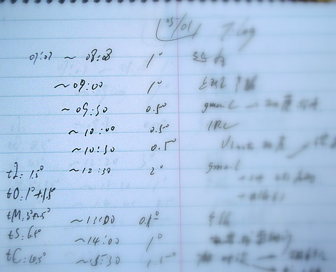

.. include:: <s5defs.txt>

==================================================================
时间管理杂谈
==================================================================

～持续的效率进化之旅 (powered by rst2S5)

:Authors: `Zoom.Quiet <zoomquiet+sns@gmail.com>`__
:URL:    http://zoomquiet.org/res/s5/101217-TimeMana

.. This document has been placed in the CC domain.
.. _Docutils: http://docutils.sourceforge.net/
.. _reStructuredText: http://docutils.sourceforge.net/rst.html
.. _S5: http://meyerweb.com/eric/tools/s5/
.. _Firefox: http://www.mozilla.com/firefox/

.. _Zoom.Quiet:
    http://code.google.com/p/openbookproject/wiki/ZoomQuiet
.. _(CC)by-nc-sa:
    http://creativecommons.org/licenses/by-nc-sa/2.5/cn/
.. _FireFox:
    http://www.mozilla.com/firefox/
.. _S5介绍:
    http://zoomquiet.org/res/s5/100826-PyTDD/s5.html
.. _WYTIWYG:
    http://wiki.woodpecker.org.cn/moin/WyTiWyG

.. 图片定义区
.. |bullet| unicode:: U+02022
.. |mode| unicode:: U+00D8 .. capital o with stroke

.. |KTRAC| image:: i/logo/trac-log-s5-h70.png
    :scale: 100 %
    :target: http://trac-hacks.org/wiki/KTRAC

.. |LeoProse| image:: pix/LeoProse.gif
    :align: top
    :scale: 100 %
    :target: http://wiki.woodpecker.org.cn/moin/LeoEnvironment
.. |cc-byncsa31| image:: i/icon/cc-byncnd-88x31.png
   :alt: (CC)by-nc-sa 许可证
   :target: http://creativecommons.org/licenses/by-nc-sa/2.5/cn/
.. |cc-byncsa15| image:: i/icon/cc-byncnd-80x15.png
   :alt: (CC)by-nc-sa 许可证
   :target: http://creativecommons.org/licenses/by-nc-sa/2.5/cn/
.. |zqeye| image:: i/id/zoomquiet_1-1_outline.png
   :alt: 是也乎;-)
   :target: http://wiki.woodpecker.org.cn/moin/ZoomQuiet

.. footer:: 

    `Zoom.Quiet`_ v10.12.13 |cc-byncsa15| 推荐用 `FireFox`_ 获得最佳翻阅效果

录像背景
==================

.. container:: handout

    - 人工智能专家，終身不懈追求高效生活的牛人...

.. class:: takahashi

   </Randy>

.. container:: notes

    - 2007年十二月 維吉尼亞大學
    - 1997 同樣内容有讲
    - 1998 維吉尼亞大學拿到終身聘，隨後跳槽到卡內基美隆大學，充滿了希望與衝勁的學術界的新星

<免责/>
=========

.. container:: handout

   山寨的，非业界公认的，个人体验为基础!
   |zqeye|

.. class:: takahashi1

    参考所有同好行为总结而得

    .. class:: incremental

    - 一切资料来自网络互动挖掘
    - 一切想法来自日常学习工作
    - 一切体悟来自各种沟通交流
    - 一切知识来自社区分享印证
    - 一切经验来自个人失败体验

高橋流!
=========

.. container:: handout

   `Takahashi-method 幻灯风格 <http://blog.derjohng.com/2006/04/12/takahashi-method-%E7%B0%A1%E5%A0%B1/>`__ 
   源自 Ruby 创始人高橋征義(Masayoshi Takahashi)

.. class:: center

    .. image:: pix/Takahashi-method.jpg
        :scale: 150 %
        :alt: 高橋流
        :align: center
        :target: http://blog.derjohng.com/2006/04/12/takahashi-method-%E7%B0%A1%E5%A0%B1/

文字
=========

.. container:: handout

   `Takahashi-method 幻灯风格 <http://blog.derjohng.com/2006/04/12/takahashi-method-%E7%B0%A1%E5%A0%B1/>`__ 
   源自 Ruby 创始人高橋征義(Masayoshi Takahashi)

.. class:: center takahashi9

    巨大

幻灯
=========

.. container:: handout

   `Takahashi-method 幻灯风格 <http://blog.derjohng.com/2006/04/12/takahashi-method-%E7%B0%A1%E5%A0%B1/>`__ 
   源自 Ruby 创始人高橋征義(Masayoshi Takahashi)

.. class:: center takahashi9

    很多

播放
=========

.. container:: handout

   `Takahashi-method 幻灯风格 <http://blog.derjohng.com/2006/04/12/takahashi-method-%E7%B0%A1%E5%A0%B1/>`__ 
   源自 Ruby 创始人高橋征義(Masayoshi Takahashi)

.. class:: center takahashi9

    快!

播放
=========

.. container:: handout

   `Takahashi-method 幻灯风格 <http://blog.derjohng.com/2006/04/12/takahashi-method-%E7%B0%A1%E5%A0%B1/>`__ 
   源自 Ruby 创始人高橋征義(Masayoshi Takahashi)

.. class:: center takahashi8

    很快!

播放
=========

.. container:: handout

   `Takahashi-method 幻灯风格 <http://blog.derjohng.com/2006/04/12/takahashi-method-%E7%B0%A1%E5%A0%B1/>`__ 
   源自 Ruby 创始人高橋征義(Masayoshi Takahashi)

.. class:: center takahashi7

    非常快!

所以:
=========

.. container:: handout

   `Takahashi-method 幻灯风格 <http://blog.derjohng.com/2006/04/12/takahashi-method-%E7%B0%A1%E5%A0%B1/>`__ 
   源自 Ruby 创始人高橋征義(Masayoshi Takahashi)

.. class:: center takahashi10

    :orange:`听`

<brief/>
=========

.. container:: handout

   俺->工具->持续完善 |zqeye|

.. class:: takahashi

    - :gray:`60' Randy Pausch`
    - :orange:`3' 有关ZQ`
    - :silver:`42' 追求时间管理`
    - :silver:`13'自由沟通`

.. container:: notes

   - 刚刚过了生日,应该说已经37岁了
   - 已经工作了12年

<Zoom.Quiet>
==================

.. container:: handout

   |zqeye|

.. class:: takahashi

    .. image:: i/id/100514-zq-eye.png
        :align: center
        :scale: 80 %
        :alt: 是也乎,是也乎

    .. image:: i/map/50ren-ZoomQuiet-s5-v800.png
        :align: center
        :scale: 100 %
        :alt: Zoom.Quiet
        :target: http://zoomquiet.org

.. container:: notes

   - 刚刚过了生日,应该说已经37岁了
   - 已经工作了12年

年龄
==================

.. container:: handout

   |zqeye|

.. class:: takahashi7

    本命年

.. container:: notes

   - 刚刚过了生日,应该说已经37岁了
   - 已经工作了12年

牛妞
==================

.. container:: handout

   \\ (^o^) / 564d

.. image:: i/foto/faces-niuniu.jpg
    :align: center
    :scale: 85 %
    :alt: 表情牛妞

.. container:: notes

   - 我的女儿刚刚一岁半,非常牛,,,脾气牛,头脑牛,虽然不会说话,但是已经能指挥我们干活了...

广告@常州
==================

.. container:: handout

   大学时代入错行，浪费两年;-{ |zqeye|

.. class:: takahashi8

    1999

开发@上海
==================

.. container:: handout

   战上海:HTML->JS->PHP->XSL->Py |zqeye|

.. class:: takahashi8

    ~2004

PI@北京
==================

.. container:: handout

   混北京:SINA->CPyUG->SLL |zqeye|

.. class:: takahashi8

    ~2007

`2003:CZUG.org <http://czug.org/>`__
======================================================

.. container:: handout

   learnning Zope/Plone... |zqeye|

.. class:: takahashi1

    - **C** hina
    - **Z** ope
    - **U** ser
    - **G** roup

    .. image:: i/logo/logo-czug.png
        :align: center
        :scale: 100 %
        :alt: http://czug.org

`2004:啄木鸟 <http://www.woodpecker.org.cn/>`__
=================================================

.. container:: handout

   admin. MoinMoin 1.2.4... |zqeye|

.. class:: center

    .. image:: i/logo/logo-wpwww_banner.png
        :align: center
        :scale: 100 %
        :alt: http://www.woodpecker.org.cn

    - |logo_wpwiki_banner| \ :sup:`MoinMoin 1.4.*`\    
    - |wiki_banner| \ :sup:`MoinMoin 1.7.*`\    
    - |wp_zoomq_scrot| \ :sup:`MoinMoin 1.9.*`\

.. |logo_wpwiki_banner| image:: i/logo/logo_wpwiki_banner.gif
    :align: bottom
    :scale: 100 %
    :alt: http://www.woodpecker.org.cn

.. |wiki_banner| image:: i/logo/logo_wp-wiki_banner.png
    :align: bottom
    :scale: 100 %
    :alt: http://wiki.woodpecker.org.cn

.. |wp_zoomq_scrot| image:: i/logo/logo_wiki-wp_zoomq_scrot.png
    :align: bottom
    :scale: 100 %
    :alt: http://wiki,woodpecker.org.cn

2005:`CPyUG`__-> BPyUG
======================================================

__ http://wiki.woodpecker.org.cn/moin/BPUG/2005-07-30
.. container:: handout

   working with Python,in SINA.com |zqeye|

.. class:: takahashi1

    .. image:: i/logo/CPUGlogo.png
        :align: center
        :scale: 100 %
        :alt: CPyUG
        :target: http://wiki.woodpecker.org.cn/moin/CPUG

2007:`ZPyUG`__
======================================================

__ http://wiki.woodpecker.org.cn/moin/ZPyUG

.. container:: handout

    - 在北京,主持完成了25次技术分享
    - 进入金山,使用Python 进行了各种平台的构建~ `KTRAC`__
    - spreading Python everywhere to everyone... 

__ http://py.kingsoft.net/ktrac

.. class:: takahashi1

    - **珠** 三角
    - **P** ython
    - **U** ser
    - **G** roup

    .. image:: i/logo/logo_163_game.gif
        :align: center
    .. image:: i/logo/logo_sina_home.gif
        :align: center
    .. image:: i/logo/logo-ks.jpg
        :align: center

`ECUG.org`__
======================================================

__ http://ecug.org/
.. container:: handout

   spreading Python everywhere to everyone... |zqeye|

.. class:: takahashi1

    .. image:: i/logo/ecug-logo_67bw.jpg
        :align: center
        :scale: 100 %
        :alt: ECUG
        :target: http://code.google.com/p/ecug/wiki/FrontPage

2008:|SLL.org| "SLL.org"
======================================================

.. container:: handout

   spreading Pythonic everywhere to everyone... |zqeye|

.. class:: takahashi7

    教育大

    发现

.. class:: takahashi2 center

    http://sociallearnlab.org/

.. |SLL.org| image:: i/logo/2018-gz-sll.png
    :scale: 100 %
    :alt: SLL
    :target: http://sociallearnlab.org/wiki/index.php?title=EduAnn2018&variant=zh-cn

2009-09-01 出版
======================================================

.. container:: handout

   - 将多年的体验,集中到一本入门图书 "可爱的Python"
   - 并主持ZPyUG 近10次技术分享  |zqeye|

.. class:: takahashi1

    .. image:: i/090902-lovpy.jpg
        :align: center
        :scale: 100 %
        :alt: 可愛的Python
        :target: http://book.douban.com/subject/3884108/

2010~
======================================================

.. container:: handout

   社区在不断发展... |zqeye|

.. class:: takahashi1

    .. image:: i/snap/cpug-ml-zoomq-2010-06-04-111017_628x701_scrot.png
        :align: center
        :scale: 100 %
        :alt: python-cn@googlegroups.com
        :target: http://groups-beta.google.com/group/python-cn

综上...
==================

.. container:: handout

   基调是分享交流;-} |zqeye|

.. class:: takahashi

    俺就一

    `社区大妈`__

__ http://wiki.woodpecker.org.cn/moin/ZoomQuiet

帮吼！
==================

.. container:: handout

   基调练习... |zqeye|

.. class:: takahashi

    大妈！

    你错了！

</Zoom.Quiet>
==================

.. container:: handout

    - 纯种Pythoner，自由软件原教旨主义者 
    - 关注社会化教育及知识管理；喜爱SF和摄影。 
    - 尝试使用Pythonic体验感化国人主动进入自由软件世界体验/学习/再创作

.. class:: takahashi8

   (^.^)

<brief/>
=========

.. container:: handout

   俺->工具->持续完善 |zqeye|

.. class:: takahashi

    - :gray:`60' Randy Pausch`
    - :gray:`3' 有关ZQ`
    - :orange:`42' 追求时间管理`
    - :silver:`13'自由沟通`

< init.Time Management>
====================================

.. container:: handout

   只能用生命来实证的时生活状态...  |zqeye|

.. class:: takahashi

    时间管理?

.. container:: notes

   - ...

什么是时间？
====================================

.. container:: handout

   从1915之后，时间已经失去了所有意义...  |zqeye|

.. class:: takahashi7

    幻觉!

.. container:: notes

   - ...

什么是时间？
====================================

.. container:: handout

   从我看来...  |zqeye|

.. class:: takahashi9

    时刻

.. container:: notes

   - ...

什么是时间？
====================================

.. container:: handout

   行为而已...  |zqeye|

.. class:: takahashi9

    间隔

.. container:: notes

   - ...

什么是管理?
====================================

.. container:: handout

   对内外的信息管道和整理控制...  |zqeye|

.. class:: takahashi9

    管道

.. container:: notes

   - ...

什么是管理?
====================================

.. container:: handout

   对内外的信息管道和整理控制...  |zqeye|

.. class:: takahashi9

    梳理

.. container:: notes

   - ...

</init.Time Management>
====================================

.. container:: handout

   心灵和智慧的力量外在表现...  |zqeye|

.. class:: takahashi7

    关乎

    心智

.. container:: notes

   - ...

<Why Time Management>
====================================

.. container:: handout

   为什么以及怎么...  |zqeye|

.. class:: takahashi9

    不靠谱

.. container:: notes

   - ...

为什么要...
====================================

.. container:: handout

   为嘛这么讲？！  |zqeye|

.. class:: takahashi7

    点解?!

.. container:: notes

   - ...

学生本质
====================================

.. container:: handout

   就职以前的生活状态...  |zqeye|

.. class:: takahashi9

    消费者

.. container:: notes

   - ...

职员本质
====================================

.. container:: handout

   在企業,一切以赢利为目标导向，一切都成本化了...  |zqeye|

.. class:: takahashi9

    销售者

.. container:: notes

   - ...

BOSS视角..
====================================

.. container:: handout

   时间是必须计算的.....  |zqeye|

.. class:: takahashi

    365天

.. container:: notes

   - ...

每周休2天
====================================

.. container:: handout

   - 104天! 时间是必须计算的.....  |zqeye|

.. class:: takahashi

    261天

.. container:: notes

   - ...

每日工作8小时
====================================

.. container:: handout

   - 104天! 时间是必须计算的.....  |zqeye|

.. class:: takahashi

    71天

.. container:: notes

   - ...

－每日上网0.5小时
====================================

.. container:: handout

   0.5*261/8 = 16天!  时间是必须计算的.....  |zqeye|

.. class:: takahashi

    261天

.. container:: notes

   - ...

－每日午饭1小时
====================================

.. container:: handout

   1*261/8 = 32天!时间是必须计算的.....  |zqeye|

.. class:: takahashi

    39天

.. container:: notes

   - ...

－年度病休
====================================

.. container:: handout

   - 2天! 时间是必须计算的.....  |zqeye|

.. class:: takahashi

    37天

.. container:: notes

   - ...

－年度法定假期
====================================

.. container:: handout

   - 10天! 时间是必须计算的.....  |zqeye|

.. class:: takahashi

    27天

.. container:: notes

   - ...

－公司年假
====================================

.. container:: handout

   - 10天! 时间是必须计算的.....  |zqeye|

.. class:: takahashi

    17天

.. container:: notes

   - ...

一切要有个交待
====================================

.. container:: handout

   时间作为沉没成本必须高度经营.....  |zqeye|

.. class:: takahashi

    回报率!

.. container:: notes

   - ...

悲惨工作三征兆!
====================================

.. container:: handout

   `The Three Signs of a Miserable Job <http://www.amazon.cn/dp/enbk612613>`__  |zqeye|

.. class:: takahashi4

    .. class:: incremental

    - 无闻性
    - 不可测
    - 无关性

.. container:: notes

   - ... http://wiki.woodpecker.org.cn/moin/5W1H

对策
====================================

.. container:: handout

   任意时刻,不背黑锅,就得！必须明确的工程元素!在第一时间!  |zqeye|

.. class:: takahashi7

    `5W1H <http://wiki.woodpecker.org.cn/moin/5W1H>`__

.. container:: notes

   - ... 

任意任务须知:
====================================

.. container:: handout

   Who...  |KTRAC|

.. class:: takahashi10

    谁

.. container:: notes

   - ... 

任意任务须知:
====================================

.. container:: handout

   When...任务限期  |KTRAC|

.. class:: takahashi10

    何时

.. container:: notes

   - ... 

任意任务须知:
====================================

.. container:: handout

   What...问题集  |KTRAC|

.. class:: takahashi9

    什么

.. container:: notes

   - ... 

任意任务须知:
====================================

.. container:: handout

   Where...环境/背景  |KTRAC|

.. class:: takahashi9

    哪?

.. container:: notes

   - ... 

任意任务须知:
====================================

.. container:: handout

   What...指标  |KTRAC|

.. class:: takahashi9

    咋算

.. container:: notes

   - ... 

任意任务须知:
====================================

.. container:: handout

   How...过程  |KTRAC|

.. class:: takahashi9

    咋作

.. container:: notes

   - ... 

否则!
====================================

.. container:: handout

   你的宿命必须是...  |zqeye|

.. class:: takahashi9

    :red:`烈士`

.. container:: notes

   - ... 

工作的层级
====================================

.. container:: handout

   出自 `从员工到总经理的成长笔记：自慢 <http://vip.book.sina.com.cn/book/index_72252.html>`__  |zqeye|

.. class:: takahashi

    .. class:: incremental

    - 做了
    - 做完
    - 做对
    - 做好
    - 能,帮他人做好!

.. container:: notes

   - ...

管理对象:0
====================================

.. container:: handout

   时间的价值真的不同,,,  |zqeye|

.. class:: takahashi9

    自己

.. container:: notes

   - ...

管理对象:1
====================================

.. container:: handout

   管理领导的时间就是为领导服务,,,  |zqeye|

.. class:: takahashi9

    领导

.. container:: notes

   - ...

管理对象:2
====================================

.. container:: handout

   协调同事的时间,就是协同,,,  |zqeye|

.. class:: takahashi9

    同事

.. container:: notes

   - ...

管理对象:3
====================================

.. container:: handout

   追踪下属的时间,就是团队,,,  |zqeye|

.. class:: takahashi9

    下属

.. container:: notes

   - ...

</Why Time Management>
====================================

.. container:: handout

   心灵和智慧的力量外在表现...  |zqeye|

.. class:: takahashi7

    时间管理！

.. container:: notes

   - ...

<Time Management Base Usage>
====================================

.. container:: handout

   只有适合自己的方法／工具，没有银弹式的方法／工具!  |zqeye|

.. class:: takahashi8

    冇最好

.. container:: notes

   - ...

图书推荐!
====================================

.. container:: handout

   李笑来的真心分享...己再版4次了..  |zqeye|

.. class:: takahashi

    .. image:: i/s3778613-friendtime.jpg
        :align: center
        :scale: 100 %
        :alt: 李笑来
        :target: http://book.douban.com/subject/3609132

.. container:: notes

   - ...

时间效率矩阵
====================================

.. container:: handout

   最基础工具..  |zqeye|

.. class:: takahashi

    .. image:: i/PrioritizationMatrix.png
        :align: center
        :scale: 100 %
        :target: http://en.wikipedia.org/wiki/Seven_Management_and_Planning_Tools#Prioritization_Matrix

.. container:: notes

   - ...

最神奇工具
====================================

.. container:: handout

   坚持才有效果！  |zqeye|

.. class:: takahashi8

    时间账单

.. container:: notes

   - ...

时间账单妙处:0
====================================

.. container:: handout

   唤醒原有的宝物...自动的工作节拍器  |zqeye|

.. class:: takahashi7

    生体节拍

.. container:: notes

   - ...

时间账单妙处:1
====================================

.. container:: handout

   人的记忆是最不靠谱的东西,只有数据才是可分析的  |zqeye|

.. class:: takahashi7

    发觉黑洞

.. container:: notes

   - ...

时间账单妙处:2
====================================

.. container:: handout

   自身工作/学习/生活... 时间经验的积累和复用!  |zqeye|

.. class:: takahashi7

    效能经验

.. container:: notes

   - ...

奇特的一生
====================================

.. container:: handout

   亚力山大.亚力山德罗维奇.柳比歇夫...分析学,生物分类学,昆虫学的非天才一生...  |zqeye|

.. class:: takahashi

    .. image:: i/s1093496-stronglife.jpg
        :align: center
        :scale: 100 %
        :target: http://book.douban.com/subject/1115353

.. container:: notes

   - ...

`俺的时间账单数据分析 9.02 <http://wiki.s.kingsoft.net/moin/ZoomQuiet/2009-01-08>`__
=============================================================================================

.. container:: handout

   美式速记薄......  |zqeye|

.. class:: takahashi

   .. class:: borderless

    ========  ========
    |tilog|   |talog|
    ========  ========

.. |talog| image:: i/snap/zq-talog.jpg
    :scale: 100 %

.. container:: notes

   - ...

`俺的时间账单数据分析 9.02 <http://wiki.s.kingsoft.net/moin/ZoomQuiet/2009-01-08>`__
=============================================================================================

.. container:: handout

   简单分析后就可以获得一些效率改进点...  |zqeye|

.. class:: takahashi

   .. class:: borderless

    ========  ========
    |tlpie|   |tlradar|
    ========  ========

.. |tlpie| image:: i/snap/zq-ti-month-pie-0902.png
    :scale: 100 %
.. |tlradar| image:: i/snap/zq-ti-month-radar-0902.png
    :scale: 100 %

.. container:: notes

   - ...

GMail
====================================

.. container:: handout

   核心的核心沟通平台!..  |zqeye|

.. class:: takahashi

    .. image:: i/snap/zqtool-gmail_1014x497_scrot.png
        :align: center
        :scale: 100 %
        :target: #

.. container:: notes

   - ...

面对复杂
====================================

.. container:: handout

   要形成靠谱的反射性的应对.....  |zqeye|

.. class:: takahashi9

    `GTD <http://www.gtdstudy.com/?p=828>`__

.. container:: notes

   - ...

GTD总流程
====================================

.. container:: handout

   get things done 是种生活态度.....  |zqeye|

.. class:: takahashi

    .. image:: i/map/GTD_v2CN.JPG
        :align: center
        :scale: 80 %
        :target: #

.. container:: notes

   - ...

工作邮件态度:收件箱...
====================================

.. container:: handout

   GTD分类配合定期处置／回顾，以及固化的处理行为！..  |zqeye|

.. class:: takahashi

    .. image:: i/snap/zqtool-thunderbird_583x444_scrot.png
        :align: center
        :scale: 100 %
        :target: #

.. container:: notes

   - ...

</Time Management Base Usage>
====================================

.. container:: handout

   只有适合自己的方法／工具，没有银弹式的方法／工具!  |zqeye|

.. class:: takahashi7

    合适才好

.. container:: notes

   - ...

<Hope>
==================

.. container:: handout

   持续改进才有效果！ |zqeye|

.. class:: takahashi7

    持续

    改进

个人知识管理!
==================

.. container:: handout

   从尊重自个儿掌握的知识开始! |zqeye|

.. class:: takahashi7

    `PKM <http://sociallearnlab.org/wiki/index.php?title=PKM&variant=zh-cn>`__

SNS学习原理:0
=======================

.. container:: handout

   小时的我... |zqeye|

.. class:: takahashi7

    .. image:: i/know-me0.gif
        :align: center
        :scale: 150 %
        :alt: ScrapBook
        :target: http://wiki.woodpecker.org.cn/moin/WeKnow

SNS学习原理:1
=======================

.. container:: handout

   成长的我... |zqeye|

.. class:: takahashi7

    .. image:: i/know-me1.gif
        :align: center
        :scale: 150 %
        :alt: ScrapBook
        :target: http://wiki.woodpecker.org.cn/moin/WeKnow

SNS学习原理:2
=======================

.. container:: handout

   成为一体的大家... |zqeye|

.. class:: takahashi7

    .. image:: i/know-we.gif
        :align: center
        :scale: 150 %
        :alt: ScrapBook
        :target: http://wiki.woodpecker.org.cn/moin/WeKnow

SNS学习原理:反証
=======================

.. container:: handout

   向反方向... |zqeye|

.. class:: takahashi7

    .. image:: i/know-dot.gif
        :align: center
        :scale: 150 %
        :alt: ScrapBook
        :target: http://wiki.woodpecker.org.cn/moin/WeKnow

Blogging 吧!
==================

.. container:: handout

   - A:练习表述;B:进入知识圈
   - `[编程杂谈]写写Blog吧-limodou的学习记录 <http://blog.donews.com/limodou/archive/2004/12/14/202590.aspx>`__

.. class:: takahashi7

    入圏

`OTAKU`__ 些什么吧!
====================================

__ http://zh.wikipedia.org/wiki/%E5%BE%A1%E5%AE%85%E6%97%8F

.. container:: handout

   功夫在诗外！拓展有益的社会关系，有利于... |zqeye|

.. class:: takahashi10

    宅

</Hope>
==================

.. container:: handout

   持续改进才有效果！ |zqeye|

- `提问的智慧 <http://wiki.woodpecker.org.cn/moin/AskForHelp>`__
- `邮件列表的规范和礼节 <http://www.woodpecker.org.cn/share/classes/050730-CPUG/usMaillist/>`__
- `WYTIWYG <http://wiki.woodpecker.org.cn/moin/WyTiWyG>`__
- `Wiki导览 +从入门到享用MoinMoin <http://www.woodpecker.org.cn/share/doc/SKSIG/DriveIntoMoinPub/>`__
- `"假学习"和"真学习" <http://www.zreading.cn/archives/1629.html>`__
- `我也有话要说 <http://www.lixiaolai.com/index.php/archives/9568.html>`__ \ :sup:`笑来系列`\
- `褪墨 <http://www.mifengtd.cn/about>`_  \ :sup:`专注GTD`\
- `如何进行人脉管理 <http://hi.baidu.com/wikicc/blog/item/388012f398f2efca0a46e0ac.html>`__
- ...

<brief/>
=========

.. container:: handout

   俺->工具->持续完善 |zqeye|

.. class:: takahashi

    - :gray:`60' Randy Pausch`
    - :gray:`3' 有关ZQ`
    - :gray:`42' 追求时间管理`
    - :orange:`13'自由沟通`

总之
=========

.. container:: handout

   期望可以记住的~单位时间可以记住的只有7+-2 个 |zqeye|

.. class:: incremental takahashi

    * 时间管理关乎心智成长 ;-}
    * 邮件管理改进最快获益
    * 纸笔永不过时...
    * 用各种渠道分享吧!

<discuss/>
==========

.. container:: handout

   |zqeye|

.. class:: takahashi8

    Q&A

最后...
==================

.. container:: handout

   好书推荐... |zqeye|

.. class:: takahashi

    .. image:: i/s3958139-itbird.jpg
        :align: center
        :scale: 100 %
        :alt: IT小小鸟
        :target: http://book.douban.com/subject/4006425/

最后的最后...
==================

.. container:: handout

   好书推荐... |zqeye|

.. class:: takahashi

    .. image:: i/s4279952-zen4talk.jpg
        :align: center
        :scale: 100 %
        :alt: 讲演之禅
        :target: http://book.douban.com/subject/4760725/

<版本/>
=========

.. container:: handout

   |zqeye|

- 101213 为金山内部培训重构
- 101005 根据盛大讲演现场反馈修订错误!
- 100918 根据SFD2010深圳讲演现场反馈修订!
- 100915 迁移为 rST2S5 格式
- 100817 为SFD2010zs 重构... 
- 100728 增补髙桥流以及蕃茄时间说明 
- 100724 为金山新人培训重构 
- 100331 为珠三角技术沙龙创建

:反馈:
    Zoom.Quiet@gmail.com
:查阅:
    http://zoomquiet.org/res/s5/101217-TimeMana

`S5 <http://www.meyerweb.com/eric/tools/s5/>`__
==============================================================================================

.. container:: handout

    纯HTML 幻灯撰写框架!... |S5icon|

- S\ :sup:`5`\ == a :orange:`S` imple :orange:`S` tandards-Based :orange:`S` lide :orange:`S` how :orange:`S` ystem 

 - 仅仅依靠 CSS+JS 的HTML格式幻灯演示框架

- 我的编辑环境: |LeoProse| ~ `文学化编辑器 <http://en.wikipedia.org/wiki/Literate_programming>`__

.. image:: pix/2010-01-18-230729_605x421_leo.png
    :align: center
    :scale: 100 %
    :target: http://wiki.woodpecker.org.cn/moin/LeoEnvironment

