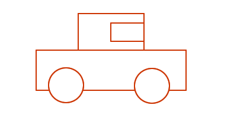
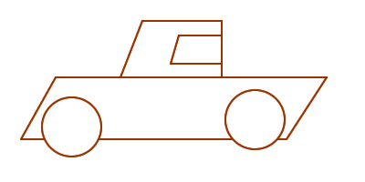
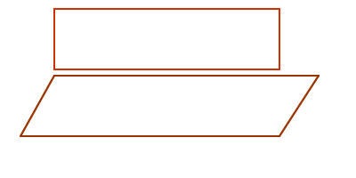
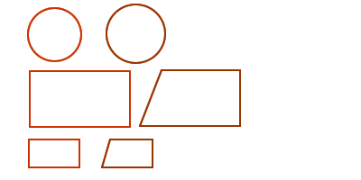

.. include:: <s5defs.txt>

==================================================================
 :orange:`Kavass` 用Hg
==================================================================

～开发者平台详解 之 DVCS体验

:讲者: `Zoom.Quiet <zoomquiet+knoss@gmai.com>`__
:URL:   http://code.ijinshan.com/res/s5/110110-YY-DVCS

.. This document has been placed in the CC domain.
.. _Docutils: http://docutils.sourceforge.net/
.. _reStructuredText: http://docutils.sourceforge.net/rst.html
.. _S5: http://meyerweb.com/eric/tools/s5/
.. _Firefox: http://www.mozilla.com/firefox/

.. _Zoom.Quiet:
    http://code.google.com/p/openbookproject/wiki/ZoomQuiet
.. _(CC)by-nc-sa:
    http://creativecommons.org/licenses/by-nc-sa/2.5/cn/
.. _FireFox:
    http://www.mozilla.com/firefox/
.. _S5介绍:
    http://zoomquiet.org/res/s5/100826-PyTDD/s5.html
.. _WYTIWYG:
    http://wiki.woodpecker.org.cn/moin/WyTiWyG

.. 图片定义区
.. |bullet| unicode:: U+02022
.. |mode| unicode:: U+00D8 .. capital o with stroke

.. |S5icon| image:: pix/S5icon.GIF
    :align: top
    :scale: 100 %
    :target: http://www.meyerweb.com/eric/tools/s5/
.. |LeoProse| image:: pix/LeoProse.gif
    :align: top
    :scale: 100 %
    :target: http://wiki.woodpecker.org.cn/moin/LeoEnvironment
.. |cc-byncsa31| image:: i/icon/cc-byncnd-88x31.png
   :alt: (CC)by-nc-sa 许可证
   :target: http://creativecommons.org/licenses/by-nc-sa/2.5/cn/
.. |cc-byncsa15| image:: i/icon/cc-byncnd-80x15.png
   :alt: (CC)by-nc-sa 许可证
   :target: http://creativecommons.org/licenses/by-nc-sa/2.5/cn/
.. |zqeye| image:: i/id/zoomquiet_1-1_outline.png
   :alt: 是也乎;-)
   :target: http://wiki.woodpecker.org.cn/moin/ZoomQuiet

.. footer:: 

   `Zoom.Quiet`_ v11.01.07 |cc-byncsa15| 推荐用 `FireFox`_ 获得最佳翻阅效果

<免责/>
=========

.. container:: handout

   非业界公认的，个人体验为基础的
   |knoss|

.. class:: takahashi1

    参考所有同好成果总结而得

    - 一切资料来自网络互动挖掘
    - 一切想法来自日常学习工作
    - 一切体悟来自各种沟通交流
    - 一切知识来自社区分享印证
    - 一切经验来自个人失败体验

<brief/>
=========

.. container:: handout

   俺->前述->Hg |zqeye|

.. class:: takahashi

    - :orange:`3' 有关ZQ`
    - :silver:`5' 上次YY`
    - :silver:`22'DVCS`
    - :silver:`30'Q&A`

.. container:: notes

   - 刚刚过了生日,应该说已经37岁了
   - 已经工作了12年

<Zoom.Quiet>
==================

.. container:: handout

   |zqeye|

.. class:: takahashi7

    本命年

.. container:: notes

   - 刚刚过了生日,应该说已经37岁了
   - 已经工作了12年

牛妞
==================

.. container:: handout

   \\ (^o^) / 601d

.. image:: i/foto/niuniu110105.jpeg
    :align: center
    :scale: 110 %
    :alt: 表情牛妞

.. container:: notes

   - 我的女儿刚刚一岁半,非常牛,,,脾气牛,头脑牛,虽然不会说话,但是已经能指挥我们干活了...

</Zoom.Quiet>
==================

.. container:: handout

    高兴/紧张... 分享云安全的个人思考 |zqeye|

.. class:: takahashi8

   (^.^)

.. container:: notes

   - 这次可以和大家见面,并高兴的聊天非常高兴!
   - 不仅高兴可以和大家分享我认为很好玩的事儿,
   - 更加高兴可以从大家这儿听到从前的自个儿可能都没有想到的事儿

<brief/>
=========

.. container:: handout

   俺->前述->Hg |zqeye|

.. class:: takahashi

    - :gray:`3' 有关ZQ`
    - :orange:`5' 上次YY`
    - :silver:`22'DVCS`
    - :silver:`30'Q&A`

.. container:: notes

    - ...

"云"安全
==================

.. container:: handout

   前世,今生,来生... |knoss|

.. class:: takahashi7

    .. image:: i/snap/av-industry.png
        :align: center
        :scale: 100 %
        :alt: 形势逼人

.. container:: notes

   - 历史
   - 杀毒
   - 查毒
   - 防毒
   - 云安全能力:

    - 每日可承载文件安全查询30亿次以上,可同时并发接受200万个文件的安全查询;平均每文件完成鉴定<0.2秒;任意新增病毒样本将在一分钟之内完成鉴定,使全体用户获得免疫!
    - 每日可承载网址安全查询10亿次,可同时并发接受20万个可疑网址的查询;平均每网页分析完成<0.03秒;任意新增恶意网址能在90秒之内完成分析,使全体用户获得免疫!

   - 开源后,任何人可以:

    - 自动化同步金山云安全各类特征库,在客户端本地通过黑+白特征库,实时识别98%以上的常见/热点病毒;
    - 自动化向金山云安全平台提交查询,进一步在黑+白特征全库中,及时确认最新病毒/恶意网址;
    - 自动化上报最新可疑文件/网址,在金山云安全平台完成自动化鉴定,实时发布,从而形成一人发现全体免疫的全网实时病毒监察的云安全态势!

金山卫士开源计划
==================

.. container:: handout

   未来... |knoss|

.. class:: takahashi

    .. image:: i/map/system_arch_pic.gif
        :align: center
        :scale: 100 %
        :alt: 开源范畴
        :target: http://code.ijinshan.com

.. container:: notes

   - 扶助开源,共同成长!
   - 

金山卫士开源计划
==================

.. container:: handout

   培育/催生/追求... |knoss|

.. class:: takahashi9

    社区

.. container:: notes

   - 在学习如何培育，同赢！
   - 

OpenKavass
==================

.. container:: handout

   - 英文名: OpenKavass
   - 英全名: Open King AntiVirus as Service
   - 中全名: 开源王级反病毒服务
   - 社区名: 开源卫士社区 / Kavass社区

.. class:: takahashi7

    :orange:`Kavass`

.. container:: notes

   - 更名为了表明立场!

<brief/>
=========

.. container:: handout

   俺->前述->Hg |zqeye|

.. class:: takahashi

    - :gray:`3' 有关ZQ`
    - :gray:`5' 上次YY`
    - :orange:`22'DVCS`
    - :silver:`30'Q&A`

.. container:: notes

    - ...

"版"?!
==================

.. container:: handout

   - 《说文解字》: 判也，从片，反声 
   -  说文通训定声》: 判木为片，名之为版 

.. class:: takahashi7

    .. image:: i/b_zgtsbbx.jpg
        :align: center
        :scale: 200 %
        :alt: 中国图书版本学
        :target: http://book.douban.com/subject/1619598/

.. container:: notes

   - 最早是动词，后来变迁为文字载体的通称，在纸发明前，文字是记载在各种各样材质的“版”上的

"本"?!
==================

.. container:: handout

   -《太平御览》: 定以杀青，可缮写，上素为定本 ... 

.. class:: takahashi7

    书之原本

.. container:: notes

   - 一部书在内容形式上的表现形式
   - 

"版本"?!
==================

.. container:: handout

   - 合称在宋朝;专指雕版印本，即：刻本 
   - 1979年版《辞海》:“版本”~ 书经过传写或是印刷而形成的各种不同本子

.. class:: takahashi7

    书的版本

.. container:: notes

   - 用雕刻好的文字的木版印刷而成的图书本子
   - 在出版业，“版本”就是指一部图书的具体表现形式

PS:"版本学"
==================

.. container:: handout

   - 是一门以图书版本为研究对象
   - 目的和任务是探究版本变迁的特色和规律，总结版本鉴定的经验和方法;以准确揭示和正确鉴别版本，满足人们有关图书版本的各种需要;

.. class:: takahashi7

    应用学科

.. container:: notes

   - 如果软件行业的“版本”混乱状态一直不能改进，极有可能产生出“软件版本学”——这将是杯具!

软件工程:"版"
==================

.. container:: handout

   - 印刷术是中国发明的，出版机制中的原理也自然的引用在软件工程中
   - 《韦氏英语词典》“版” --（原物的）变体，变种，型式

.. class:: takahashi7

    version

.. container:: notes

   - 如果软件行业的“版本”混乱状态一直不能改进，极有可能产生出“软件版本学”——这将是杯具!

软件工程:"版本"
==================

.. container:: handout

   - 《韦氏英语词典》“版本” -- 经过修改的“版”

.. class:: takahashi7

    :orange:`revision`

.. container:: notes

   - 如果软件行业的“版本”混乱状态一直不能改进，极有可能产生出“软件版本学”——这将是杯具!

用户眼里的"版本"
==================

.. container:: handout

   可用的一个整体    |knoss|

.. class:: takahashi0

   .. class:: borderless

   =============  ============
   版本1型车       版本2型车
   -------------  ------------
   |VMcarV1|       |VMcarV2|
   =============  ============

.. container:: notes

    -

码农眼里的"版本"
==================

.. container:: handout

   零散的组件    |knoss|

.. class:: takahashi0

   .. class:: borderless

   =============  ========================
   模块1关注的     其它各模块开发关注的
   -------------  ------------------------
   |VMcarE1|       |VMcarE2|
   =============  ========================

.. container:: notes

    -

QA眼中的"版本"
==================

.. container:: handout

   配置管理/发布管理关注“基线”    |knoss|

.. class:: takahashi7

    .. image:: i/baseline.png
        :align: center
        :scale: 120 %
        :alt: 基线

.. container:: notes

    - 顾名思义，是基准线，是项目组是下阶工作的起点
    - Label--“版本标签” 其实就是基线的实际体现形式 

基线的意义...
==================

.. container:: handout

   记载成果    |knoss|

.. class:: takahashi7

    重现性

.. container:: notes

    - 基线是项目过程中每个工件版本在特定时期的一个“快照”。它提供一个正式标准，随后的工作基于此标准，并且只有经过授权后才能变更这个标准
    - 建立一个初始基线后，以后每次对其进行的变更都将记录为一个差值，直到建成下一个基线。

基线的意义...
==================

.. container:: handout

   追踪所有细节    |knoss|

.. class:: takahashi7

    可追踪

.. container:: notes

    - 基线是项目过程中每个工件版本在特定时期的一个“快照”。它提供一个正式标准，随后的工作基于此标准，并且只有经过授权后才能变更这个标准
    - 建立一个初始基线后，以后每次对其进行的变更都将记录为一个差值，直到建成下一个基线。

基线的意义...
==================

.. container:: handout

   反馈各种工程度量    |knoss|

.. class:: takahashi7

    差异报告

.. container:: notes

    - 基线是项目过程中每个工件版本在特定时期的一个“快照”。它提供一个正式标准，随后的工作基于此标准，并且只有经过授权后才能变更这个标准
    - 建立一个初始基线后，以后每次对其进行的变更都将记录为一个差值，直到建成下一个基线。

版本大观
==================

.. container:: handout

   杯具的中文,在工程中有太多"版本"    |knoss|

.. class:: takahashi7

    .. image:: i/prdversions_v2.1.png
        :align: center
        :scale: 120 %
        :alt: 各种版本

.. container:: notes

    - 也正是这些版本,确保了团队所有成员的协同!

版本管理下的协同
==================

.. container:: handout

   - 团队協作的中的基本礼节!
   - 团队仓库
   - 本地工作复本
   - 检出/入
   - 冲突解决

.. class:: takahashi7

    .. image:: i/commitloop.gif
        :align: center
        :scale: 150 %
        :alt: 礼貌的協同流程!

.. container:: notes

    - 也正是这些版本,确保了团队所有成员的协同!

中央式版本管理系统
====================================

.. container:: handout

   |knoss|

.. class:: takahashi7

    .. image:: i/map/cscm.gif
        :align: center
        :scale: 120 %
        :alt: 杯具了

.. container:: notes

    - 严格!

分布式版本管理系统
====================================

.. container:: handout

   `ThoughtWorks开发人员最喜爱的分布式版本控制系统 <http://www.infoq.com/cn/news/2010/04/Review-Version-Control-Systems>`_ |knoss|

.. class:: takahashi7

    .. image:: i/map/dscm.gif
        :align: center
        :scale: 80 %
        :alt: 活跃中

.. container:: notes

    - 自在!

水银
====================================

.. container:: handout

   	Choosing a distributed VCS for the Python project `pep-0374 <http://www.python.org/dev/peps/pep-0374/>`_ |knoss|

.. class:: takahashi7

    .. image:: i/logo/logo-mercurial-200.png
        :align: center
        :scale: 100 %
        :alt: 水银
        :target: http://mercurial.selenic.com/

    .. image:: i/logo/logo-tortoisehg.png
        :align: center
        :scale: 100 %
        :alt: 乌亀水银
        :target: https://bitbucket.org/tortoisehg/stable/wiki/Home

.. container:: notes

    - 稳定
    - 兼容
    - GUI

社区仓库关系
====================================

.. container:: handout

   	|hg|

.. class:: takahashi7

    .. image:: i/map/ijinshan-code-flow.png
        :align: center
        :scale: 100 %
        :alt: 关系
        :target: http://code.ijinshan.com/trac/wiki/KsOssContribute

.. container:: notes

    - 各自为政
    - 拉而不推

掺合流程:-6
====================================

.. container:: handout

   	|hg|

.. class:: takahashi7

    .. image:: i/map/OpenKavass-flow-6_wsd-napkin.png
        :align: center
        :scale: 200 %
        :alt: 流程
        :target: http://code.ijinshan.com/trac/wiki/KsOssContribute

.. container:: notes

    - 各自为政
    - 拉而不推

掺合流程:-5
====================================

.. container:: handout

   	|hg|

.. class:: takahashi7

    .. image:: i/map/OpenKavass-flow-5_wsd-napkin.png
        :align: center
        :scale: 180 %
        :alt: 流程
        :target: http://code.ijinshan.com/trac/wiki/KsOssContribute

.. container:: notes

    - 各自为政
    - 拉而不推

掺合流程:-4
====================================

.. container:: handout

   	|hg|

.. class:: takahashi7

    .. image:: i/map/OpenKavass-flow-4_wsd-napkin.png
        :align: center
        :scale: 150 %
        :alt: 流程
        :target: http://code.ijinshan.com/trac/wiki/KsOssContribute

.. container:: notes

    - 各自为政
    - 拉而不推

掺合流程:-3
====================================

.. container:: handout

   	|hg|

.. class:: takahashi7

    .. image:: i/map/OpenKavass-flow-3_wsd-napkin.png
        :align: center
        :scale: 120 %
        :alt: 流程
        :target: http://code.ijinshan.com/trac/wiki/KsOssContribute

.. container:: notes

    - 各自为政
    - 拉而不推

掺合流程:-2
====================================

.. container:: handout

   	|hg|

.. class:: takahashi7

    .. image:: i/map/OpenKavass-flow-2_wsd-napkin.png
        :align: center
        :scale: 110 %
        :alt: 流程
        :target: http://code.ijinshan.com/trac/wiki/KsOssContribute

.. container:: notes

    - 各自为政
    - 拉而不推

掺合流程:-1
====================================

.. container:: handout

   	|hg|

.. class:: takahashi7

    .. image:: i/map/OpenKavass-flow-1_wsd-napkin.png
        :align: center
        :scale: 105 %
        :alt: 流程
        :target: http://code.ijinshan.com/trac/wiki/KsOssContribute

.. container:: notes

    - 各自为政
    - 拉而不推

掺合流程:0
====================================

.. container:: handout

   	|hg|

.. class:: takahashi7

    .. image:: i/map/OpenKavass-flow-0_wsd-napkin.png
        :align: center
        :scale: 100 %
        :alt: 流程
        :target: http://code.ijinshan.com/trac/wiki/KsOssContribute

.. container:: notes

    - 各自为政
    - 拉而不推

掺合流程 全景
====================================

.. container:: handout

   	|hg|

.. class:: takahashi7

    .. image:: i/map/OpenKavass-flow-all_wsd-napkin.png
        :align: center
        :scale: 90 %
        :alt: 流程
        :target: http://code.ijinshan.com/trac/wiki/KsOssContribute

.. container:: notes

    - 各自为政
    - 拉而不推

Hg
====================================

.. container:: handout

   	|hg|

.. class:: takahashi9

    自在

.. container:: notes

    - 稳定
    - 兼容
    - GUI

社区仓库关系
====================================

.. container:: handout

   	|hg|

.. class:: takahashi7

    .. image:: i/map/ijinshan-code-flow.png
        :align: center
        :scale: 100 %
        :alt: 关系
        :target: http://code.ijinshan.com/trac/wiki/KsOssContribute

.. container:: notes

    - 各自为政
    - 拉而不推

总之
=========

.. container:: handout

   期望可以记住的 |knoss|

.. class:: incremental takahashi

    * 开源计划引发Kavass社区
    * Kavass 只是个开始
    * 彻底的开源就要分享权力!
    * 什么是版本?
    * DVCS体验非凡!
    * Hg,你值得拥有

.. container:: notes

   - ~单位时间可以记住的只有7+-2 个

最后:感谢一切!
==================

.. container:: handout

   |knoss|

.. class:: takahashi7

    Q&A

.. container:: notes

   - ...

最后...
==================

.. container:: handout

   好书推荐... |zqeye|

.. class:: takahashi

    .. image:: i/snap/s3958139-itbird.jpg
        :align: center
        :scale: 100 %
        :alt: IT小小鸟
        :target: http://book.douban.com/subject/4006425/

最后的最后...
==================

.. container:: handout

   好书推荐... |zqeye|

.. class:: takahashi

    .. image:: i/snap/s4279952-zen4talk.jpg
        :align: center
        :scale: 100 %
        :alt: 讲演之禅
        :target: http://book.douban.com/subject/4760725/

`S5 <http://www.meyerweb.com/eric/tools/s5/>`__
==============================================================================================

.. container:: handout

    纯HTML 幻灯撰写框架!... |zqeye|

- S\ :sup:`5`\ == a :orange:`S` imple :orange:`S` tandards-based :orange:`S` lide :orange:`S` how :orange:`S` ystem 
- 仅用 CSS+JS 实现的HTML格式幻灯演示工具~ `本地介绍 <s5.html>`__
- 我的编辑工具: |LeoProse| ~ `文学化编辑环境 <http://en.wikipedia.org/wiki/Literate_programming>`__

.. image:: pix/2010-01-18-230729_605x421_leo.png
    :align: center
    :scale: 100 %
    :target: http://wiki.woodpecker.org.cn/moin/LeoEnvironment

<版本/>
=========

.. container:: handout

   |knoss|

- 110107 增补图谱
- 110105 调整内容次序
- 101230 起草

:反馈:
    `Zoom.Quiet@gmail.com <zoomquiet+sns@gmai.com>`__
:查阅:
    http://code.ijinshan.com/res/s5/110110-YY-DVCS

