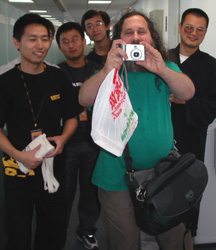
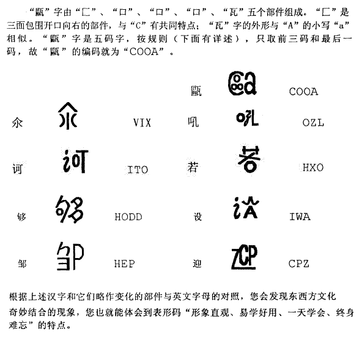
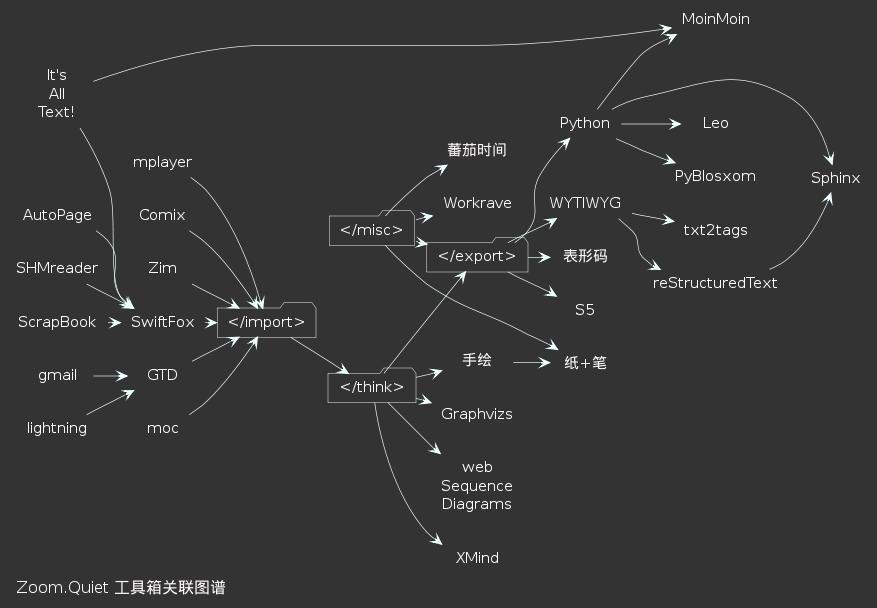

.. include:: <s5defs.txt>

==================================================================
入迷Ubuntu
==================================================================

～俺的自由之旅 (powered by rst2S5)

:Authors: `Zoom.Quiet <zoomquiet+sns@gmai.com>`__
:URL:    http://zoomquiet.org/res/s5/110514-gz-ubuntu-release-party/

.. This document has been placed in the CC domain.
.. _Docutils: http://docutils.sourceforge.net/
.. _reStructuredText: http://docutils.sourceforge.net/rst.html
.. _S5: http://meyerweb.com/eric/tools/s5/
.. _Firefox: http://www.mozilla.com/firefox/

.. _Zoom.Quiet:
    http://code.google.com/p/openbookproject/wiki/ZoomQuiet
.. _(CC)by-nc-sa:
    http://creativecommons.org/licenses/by-nc-sa/2.5/cn/
.. _FireFox:
    http://www.mozilla.com/firefox/
.. _S5介绍:
    http://zoomquiet.org/res/s5/100826-PyTDD/s5.html
.. _WYTIWYG:
    http://wiki.woodpecker.org.cn/moin/WyTiWyG
.. _提问的智慧:
    http://wiki.woodpecker.org.cn/moin/AskForHelp

.. 图片定义区
.. |bullet| unicode:: U+02022
.. |mode| unicode:: U+00D8 .. capital o with stroke

.. |S5icon| image:: pix/S5icon.GIF
    :align: top
    :scale: 100 %
    :target: http://www.meyerweb.com/eric/tools/s5/
.. |LeoProse| image:: pix/LeoProse.gif
    :align: top
    :scale: 100 %
    :target: http://wiki.woodpecker.org.cn/moin/LeoEnvironment

.. |cc-byncsa31| image:: i/icon/cc-byncnd-88x31.png
    :alt: (CC)by-nc-sa 许可证
    :target: http://creativecommons.org/licenses/by-nc-sa/2.5/cn/

.. |zqeye| image:: i/id/zoomquiet_1-1_outline.png
    :alt: 是也乎;-)
    :target: http://wiki.woodpecker.org.cn/moin/ZoomQuiet

.. footer:: 

   `Zoom.Quiet`_ v11.03.20 |cc-byncsa15| 推荐用 `FireFox`_ 获得最佳游览效果

<俺>
==================

.. container:: handout

   37,有娃没车,长年大妈 |zqeye|

.. class:: takahashi

    .. image:: i/id/100514-zq-eye.png
        :align: center
        :scale: 80 %
        :alt: 是也乎,是也乎

    .. image:: i/map/50ren-ZoomQuiet-s5-v800.png
        :align: center
        :scale: 100 %
        :target: http://zoomquiet.org

.. container:: notes

   - 刚刚过了生日,应该说已经37岁了
   - 已经工作了12年

牛妞
==================

.. container:: handout

    \\ (^o^) / +725d  |zqeye|

.. class:: takahashi

    .. image:: i/foto/niuniu-110316.jpeg
        :align: center
        :scale: 100 %
        :alt: 是也乎,是也乎

.. container:: notes

   - 我的女儿刚刚一岁半,非常牛,,,脾气牛,头脑牛,虽然不会说话,但是已经能指挥我们干活了...

</俺>
==================

.. container:: handout

    高兴/紧张... 分享学习的个人思考 |zqeye|

.. class:: takahashi8

   (^.^)

.. container:: notes

   - 这次可以和大家见面,并高兴的聊天非常高兴!
   - 不仅高兴可以和大家分享我认为很好玩的事儿,
   - 更加高兴可以从大家这儿听到从前的自个儿可能都没有想到的事儿

<免责/>
=========

.. container:: handout

   山寨的，非业界公认的，个人体验为基础!
   |zqeye|

.. class:: takahashi1

    参考所有同好行为总结而得

    .. class:: incremental

    - 一切资料来自网络互动挖掘
    - 一切想法来自日常学习工作
    - 一切体悟来自各种沟通交流
    - 一切知识来自社区分享印证
    - 一切经验来自个人失败体验

.. container:: notes

   - 免责是必须的，分享是无理由的！

高橋流!
=========

.. container:: handout

   `Takahashi-method 幻灯风格 <http://blog.derjohng.com/2006/04/12/takahashi-method-%E7%B0%A1%E5%A0%B1/>`__ 
   源自 Ruby 创始人高橋征義(Masayoshi Takahashi)

.. class:: center

    .. image:: pix/Takahashi-method.jpg
        :scale: 150 %
        :alt: 高橋流
        :align: center
        :target: http://blog.derjohng.com/2006/04/12/takahashi-method-%E7%B0%A1%E5%A0%B1/

文字
=========

.. container:: handout

   `Takahashi-method 幻灯风格 <http://blog.derjohng.com/2006/04/12/takahashi-method-%E7%B0%A1%E5%A0%B1/>`__ 
   源自 Ruby 创始人高橋征義(Masayoshi Takahashi)

.. class:: center takahashi9

    巨大

幻灯
=========

.. container:: handout

   `Takahashi-method 幻灯风格 <http://blog.derjohng.com/2006/04/12/takahashi-method-%E7%B0%A1%E5%A0%B1/>`__ 
   源自 Ruby 创始人高橋征義(Masayoshi Takahashi)

.. class:: center takahashi9

    很多

播放
=========

.. container:: handout

   `Takahashi-method 幻灯风格 <http://blog.derjohng.com/2006/04/12/takahashi-method-%E7%B0%A1%E5%A0%B1/>`__ 
   源自 Ruby 创始人高橋征義(Masayoshi Takahashi)

.. class:: center takahashi9

    快!

播放
=========

.. container:: handout

   `Takahashi-method 幻灯风格 <http://blog.derjohng.com/2006/04/12/takahashi-method-%E7%B0%A1%E5%A0%B1/>`__ 
   源自 Ruby 创始人高橋征義(Masayoshi Takahashi)

.. class:: center takahashi8

    很快!

播放
=========

.. container:: handout

   `Takahashi-method 幻灯风格 <http://blog.derjohng.com/2006/04/12/takahashi-method-%E7%B0%A1%E5%A0%B1/>`__ 
   源自 Ruby 创始人高橋征義(Masayoshi Takahashi)

.. class:: center takahashi7

    非常快!

所以:
=========

.. container:: handout

   `Takahashi-method 幻灯风格 <http://blog.derjohng.com/2006/04/12/takahashi-method-%E7%B0%A1%E5%A0%B1/>`__ 
   源自 Ruby 创始人高橋征義(Masayoshi Takahashi)

.. class:: center takahashi10

    :orange:`听`

<brief/>
=========

.. container:: handout

   简单想,简单试,简单用... |zqeye|

.. class:: takahashi

    - :orange:`5' 回顾`
    - :silver:`10' 门槛`
    - :silver:`5'小经验`

.. container:: notes

   - 

何时知道Linux?
==================

.. container:: handout

   大一时,好早哈! |zqeye|

.. class:: takahashi8

    1994

.. container:: notes

   - 

首次用
==================

.. container:: handout

   RedHat4.2 96元! |zqeye|

.. class:: takahashi8

    1999

.. container:: notes

   - 

首次发布
==================

.. container:: handout

   moinmoin1.2 |zqeye|

.. class:: takahashi8

    2004

.. container:: notes

   - http://220.248.2.35:7080
   - apache 反向代理
   - 内部 ftp/smb/cvs

|RMS| RMS
========================

.. container:: handout

    2005.9.18 `SINA访谈 <http://wiki.woodpecker.org.cn/moin/SaintRMS>`_ |zqeye|

.. class:: takahashi8

    |RMSsina| |RMSfans| 

.. container:: notes

   - 见活人和见文章感觉真的不一样!
   - IM
   - 网银
   - mov

正式跃迁Dapper Drake
================================================================================

.. container:: handout

    6.06 精悍雄鸭 LTS |zqeye|

.. class:: takahashi7

    060918

.. container:: notes

   - 安装用了3天
   - 数据库迁移用了3月

`Mark Shuttleworth <http://blog.zoomquiet.org/pyblosxom/2006/11/>`_ 
================================================================================

.. container:: handout

    `6.10Release Party <http://floss.zoomquiet.org/data/20061027152019/index.html>`_ |zqeye|

.. class:: takahashi8

    .. image:: i/foto/061102-mark-R0027734.JPG
        :align: center
        :scale: 100 %
        :alt: with amy

.. container:: notes

   - IME

Feisty Fawn
================================================================================

.. container:: handout

    6.06直升 活泼小鹿 |zqeye|

.. class:: takahashi8

    7.04

.. container:: notes

   - 软件管理!

Hardy Heron
================================================================================

.. container:: handout

    7.10->8.04 强壮苍鹭 LTS 连升 |zqeye|

.. class:: takahashi8

    8.04

.. container:: notes

   - 伟大的 apt

Lucid Lynx
================================================================================

.. container:: handout

    清澄猞猁 LTS 重装 |zqeye|

.. class:: takahashi8

    10.04

.. container:: notes

   - 不迷信

<brief/>
=========

.. container:: handout

   简单想,简单试,简单用... |zqeye|

.. class:: takahashi

    - :gray:`5' 回顾`
    - :orange:`10' 门槛`
    - :silver:`5'小经验`

.. container:: notes

   - 

IME
========================

.. container:: handout

    |zqeye|

.. class:: takahashi8

    输入法

.. container:: notes

   - IME
   - OOo
   - Mail
   - IM
   - 网银
   - mov

|logo-bxm| **表形码**
==============================================================================================

.. |logo-bxm| image:: i/logo/logo_bxm.gif
    :align: top
    :scale: 100 %
    :target: http://zh.wikipedia.org/zh/%E8%A1%A8%E5%BD%A2%E7%A0%81

.. container:: handout

    消失在历史中的优秀输入法!... |zqeye|

.. class:: borderless

   =========  =======
   |denobxm|  |zqbxm|
   =========  =======

.. |zqbxm| image:: i/snap/zqtool-bxm-selfdesine_463x380_scrot.png
    :align: top
    :scale: 100 %
    :target: http://blog.zoomquiet.org/pyblosxom/Zen/Chinese/winbx-IMEstory-2006-05-15-12-00.html

.. container:: notes

   - IME

感谢可定制的...
========================

.. container:: handout

    苏哲 大仙！ |zqeye|

.. class:: takahashi8

    `SCIM <http://floss.zoomquiet.org/data/20060723153716/index.html>`_

.. container:: notes

   - IME
   - OOo
   - Mail
   - IM
   - 网银

`mplayer <http://www.mplayerhq.hu/>`__
==============================================================================================

.. container:: handout

    M$ 平台中就一直在用 |zqeye|

.. class:: takahashi7

    .. image:: i/snap/zqtool-mplayer-xgl-compiz-01.jpg
        :align: center
        :scale: 100 %
        :target: #

.. container:: notes

   - IME

`moc <http://moc.daper.net/>`__
==============================================================================================

.. container:: handout

    命令行中的音乐播放器 |zqeye|

.. class:: takahashi7

    .. image:: i/snap/zqtool-moc_931x489_scrot.png
        :align: center
        :scale: 100 %
        :target: #

.. container:: notes

   - IME

`囧rz... <http://openbanks.info/>`_
================================================

.. container:: handout

    05年开始... `linuxbanks.cn->openbanks.info <http://www.zeuux.org/pipermail/zeuux-universe/2010-May/006110.html>`_  |zqeye|

.. class:: takahashi8

    网银

.. container:: notes

   - IME
   - OOo zh_openoffice_wel.png
   - Mail
   - IM
   - 网银
   - mov

办公软件
================================================

.. container:: handout

    基本没戏...  |zqeye|

.. class:: takahashi8

    .. image:: i/logo/zh_openoffice_wel.png
        :align: center
        :scale: 100 %
        :alt: 中国特色...
        :target: http://zh.openoffice.org/new/index.html

.. container:: notes

   - IME
   - OOo zh_openoffice_wel.png
   - Mail
   - IM
   - 网银
   - mov

IM
================================================

.. container:: handout

    当然的是 `曾经的Gaim <http://linuxtoy.org/archives/gaim-changes-name-to-pidgin.html>`_  |zqeye|

.. class:: takahashi

    `pidgin <http://www.pidgin.im/>`_

.. container:: notes

   - IME
   - OOo zh_openoffice_wel.png
   - Mail
   - IM
   - 网银
   - mov

`WYSIWYG`_
==============================================================================================

.. container:: handout

    单纯的角色才有助于卓越的成果生产!任何所见即所得的撰写环境都是扯!... |zqeye|

.. class:: takahashi5

    `所想`__

    `即所得`__

__ http://wiki.woodpecker.org.cn/moin/WyTiWyG
__ http://wiki.woodpecker.org.cn/moin/WyTiWyG

.. container:: notes

   - IME
   - OOo zh_openoffice_wel.png
   - Mail
   - IM
   - 网银
   - mov

`txt2tags <http://txt2tags.sourceforge.net/>`__
==============================================================================================

.. container:: handout

    撰写一次,任意格式输出的轻快结构化文本单脚本工具!... |zqeye|

.. class:: takahashi7

    .. image:: i/snap/zqtool-t2t-octus.gif
        :align: center
        :scale: 100 %
        :target: http://txt2tags.sourceforge.net/

.. container:: notes

   - IME
   - OOo zh_openoffice_wel.png
   - Mail
   - IM
   - 网银
   - mov

|logo-rst|
==============================================================================================

.. |logo-rst| image:: i/logo/rst.png
    :align: top
    :scale: 100 %
    :target: http://docutils.sourceforge.net/rst.html

.. container:: handout

    最标准和强大的结构化文本协议!... |zqeye|

.. class:: takahashi7

    .. image:: i/snap/zqtool-rst_853x423_scrot.png
        :align: center
        :scale: 100 %
        :target: #

.. container:: notes

   - IME

|logo_sphinx|
==============================================================================================

.. |logo_sphinx| image:: i/logo/sphinx_barnner.png
    :align: top
    :scale: 100 %
    :target: http://sphinx.pocoo.org

.. container:: handout

    图书/帮助/网站，rST组织/管理/发布工具集... |zqeye|

.. class:: takahashi7

    .. image:: i/snap/zqtool-sphinx_942x520_scrot.png
        :align: center
        :scale: 100 %
        :target: http://zoomquiet.org/w2py_manual_zh/

.. container:: notes

   - IME

|logo_rst2a|
==============================================================================================

.. container:: handout

    最标准和强大的结构化文本协议!... |zqeye|

.. class:: takahashi

    在线转换

.. container:: notes

   - IME

`S5 <http://www.meyerweb.com/eric/tools/s5/>`__
==============================================================================================

.. container:: handout

    纯HTML 幻灯撰写框架!... |S5icon|

- S\ :sup:`5`\ == a :orange:`S` imple :orange:`S` tandards-Based :orange:`S` lide :orange:`S` how :orange:`S` ystem 

 - 仅仅依靠 CSS+JS 的HTML格式幻灯演示框架

- 我的编辑环境: |LeoProse| ~ `文学化编辑器 <http://en.wikipedia.org/wiki/Literate_programming>`__

.. image:: pix/2010-01-18-230729_605x421_leo.png
    :align: center
    :scale: 100 %
    :target: http://wiki.woodpecker.org.cn/moin/LeoEnvironment

.. container:: notes

   - 虽然有很多其它替代方案，至今用得最爽的还是 S5
   - 最好也是最不好的，就是S5 需要专用的http 空间发布，无法直接分享到 slidshare.com 之类SNS空间中

手工 |S5icon|
==============================================================================================

.. container:: handout

    简洁的幻灯解决方案... |zqeye|

.. class:: takahashi7

    .. image:: i/snap/zq_s5html_scrot.png
        :align: center
        :scale: 100 %
        :target: #

.. container:: notes

   - IME

|logo-rst| 之 `rst2s5 <http://docutils.sourceforge.net/docs/user/slide-shows.html>`__
==============================================================================================

.. container:: handout

    禅样的幻灯解决方案... |zqeye|

.. class:: takahashi7

    .. image:: i/snap/zq_s5rst_scrot.png
        :align: center
        :scale: 100 %
        :target: #

.. container:: notes

   - IME

`Lightning <http://www.mozilla.org/projects/calendar/releases/lightning1.0b2.html>`__
==============================================================================================

.. container:: handout

    独立的日历/事务/行程 综合管理中心! |zqeye|

.. class:: takahashi7

    .. image:: i/snap/2010-09-17-lighting_scrot.png
        :align: center
        :scale: 90 %
        :target: #

.. container:: notes

   - IME

`俺的工具箱 <http://zoomquiet.org/s5/100918-MyTools/rst2s5/index.html>`_
=============================================================================

.. container:: handout

   持续改进才有效果！程序员1107 |zqeye|

.. container:: notes

   - IME

原则: **面向肌肉的操作**
====================================

.. container:: handout

   持续改进才有效果！ |zqeye|

.. class:: takahashi3

    -  **M** uscle
    -  **O** riented
    -  **O** perating

.. container:: notes

   - IME

<brief/>
=========

.. container:: handout

   简单想,简单试,简单用... |zqeye|

.. class:: takahashi

    - :gray:`5' 回顾`
    - :gray:`10' 门槛`
    - :orange:`5'小经验`

.. container:: notes

   - feh -FZd -D 3 ./*

个人知识管理!
==================

.. container:: handout

   从尊重自个儿掌握的知识开始! |zqeye|

.. class:: takahashi7

    `PKM <http://sociallearnlab.org/wiki/index.php?title=PKM&variant=zh-cn>`__

.. container:: notes

   - IME

SNS学习原理:0
=======================

.. container:: handout

   小时的我... |zqeye|

.. class:: takahashi7

    .. image:: i/_know-me.gif
        :align: center
        :scale: 150 %
        :alt: ScrapBook
        :target: http://wiki.woodpecker.org.cn/moin/WeKnow

.. container:: notes

   - IME

SNS学习原理:1
=======================

.. container:: handout

   成长的我... |zqeye|

.. class:: takahashi7

    .. image:: i/_know-me1.gif
        :align: center
        :scale: 150 %
        :alt: ScrapBook
        :target: http://wiki.woodpecker.org.cn/moin/WeKnow

.. container:: notes

   - IME

SNS学习原理:2
=======================

.. container:: handout

   成为一体的大家... |zqeye|

.. class:: takahashi7

    .. image:: i/_know-we.gif
        :align: center
        :scale: 150 %
        :alt: ScrapBook
        :target: http://wiki.woodpecker.org.cn/moin/WeKnow

.. container:: notes

   - IME

SNS学习原理:反証
=======================

.. container:: handout

   向反方向... |zqeye|

.. class:: takahashi7

    .. image:: i/_know-dot.gif
        :align: center
        :scale: 150 %
        :alt: ScrapBook
        :target: http://wiki.woodpecker.org.cn/moin/WeKnow

.. container:: notes

   - IME

Blogging 吧!
==================

.. container:: handout

   - A:练习表述;B:进入知识圈
   - `[编程杂谈]写写Blog吧-limodou的学习记录 <http://blog.donews.com/limodou/archive/2004/12/14/202590.aspx>`__
   - `"施比受更有福" <http://sociallearnlab.org/wiki/index.php?title=Autonomouslearning06&variant=zh-cn>`_

.. class:: takahashi7

    入圏

.. container:: notes

   - IME

`OTAKU`__ 些什么吧!
====================================

__ http://zh.wikipedia.org/wiki/%E5%BE%A1%E5%AE%85%E6%97%8F

.. container:: handout

   功夫在诗外！拓展有益的社会关系，有利于... |zqeye|

.. class:: takahashi10

    宅

.. container:: notes

   - IME

推荐
==================

.. container:: handout

   持续享受才有所得... |zqeye|

- `提问的智慧 <http://wiki.woodpecker.org.cn/moin/AskForHelp>`__
- `邮件列表的规范和礼节 <http://www.woodpecker.org.cn/share/classes/050730-CPUG/usMaillist/>`__
- `WYTIWYG <http://wiki.woodpecker.org.cn/moin/WyTiWyG>`__
- `Wiki导览 +从入门到享用MoinMoin <http://www.woodpecker.org.cn/share/doc/SKSIG/DriveIntoMoinPub/>`__
- `"假学习"和"真学习" <http://www.zreading.cn/archives/1629.html>`__
- `我也有话要说 <http://www.lixiaolai.com/index.php/archives/9568.html>`__ \ :sup:`笑来系列`\
- `褪墨 <http://www.mifengtd.cn/about>`_  \ :sup:`专注GTD`\
- `如何进行人脉管理 <http://hi.baidu.com/wikicc/blog/item/388012f398f2efca0a46e0ac.html>`__
- ...

.. container:: notes

   - IME

总之
=========

.. container:: handout

   期望记住的~单位时间能记住的只有7+-2 个 |zqeye|

.. class:: incremental takahashi

    - 慢慢来,比较快
    - 坚持每天用
    - 训练自个儿
    - `提问的智慧`_ !
    - 表强行推广

.. container:: notes

   - http://fosschef.com/2011/04/one-funny-wallpaper-of-why-linux/

不要争论!
==================

.. container:: handout

   因为... |zqeye|

.. class:: takahashi

    .. image:: i/canot-fight-sability.jpg
        :align: center
        :scale: 90 %
        :target: http://www.70man.com/?p=7462

.. container:: notes

   - 

<discuss/>
==========

.. container:: handout

   |zqeye|

.. class:: takahashi8

    Q&A

.. container:: notes

   - 

最后的最后...
==================

.. container:: handout

   好书推荐... |zqeye|

.. class:: takahashi

    .. image:: i/s4279952-zen4talk.jpg
        :align: center
        :scale: 100 %
        :alt: 讲演之禅
        :target: http://book.douban.com/subject/4760725/

.. container:: notes

   - 

<版本/>
=========

.. container:: handout

   |zqeye|

- 110508 找回历史照片
- 110507 為中大Ubuntu Release Party 创建

:反馈:
    `Zoom.Quiet <zoomquiet+sns@gmai.com>`__
:查阅:
    http://zoomquiet.org/res/s5/110320-mq-first-taste/

`S5 <http://www.meyerweb.com/eric/tools/s5/>`__
==============================================================================================

.. container:: handout

    纯HTML 幻灯撰写框架!... |S5icon|

- S\ :sup:`5`\ == a :orange:`S` imple :orange:`S` tandards-Based :orange:`S` lide :orange:`S` how :orange:`S` ystem 

 - 仅仅依靠 CSS+JS 的HTML格式幻灯演示框架

- 我的编辑环境: |LeoProse| ~ `文学化编辑器 <http://en.wikipedia.org/wiki/Literate_programming>`__

.. image:: pix/2010-01-18-230729_605x421_leo.png
    :align: center
    :scale: 100 %
    :target: http://wiki.woodpecker.org.cn/moin/LeoEnvironment

.. container:: notes

   - 虽然有很多其它替代方案，至今用得最爽的还是 S5
   - 最好也是最不好的，就是S5 需要专用的http 空间发布，无法直接分享到 slidshare.com 之类SNS空间中

