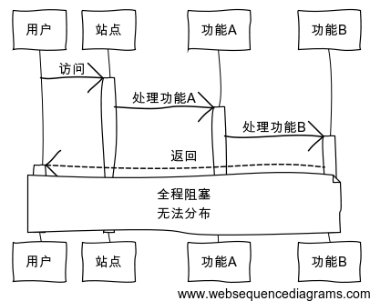
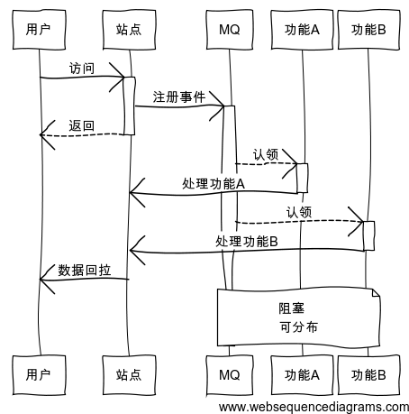
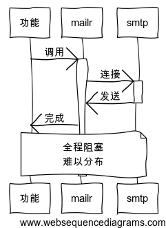
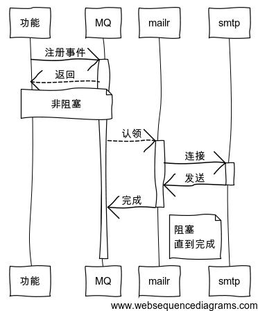
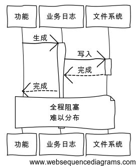
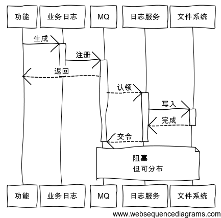
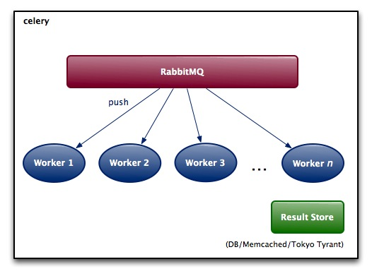
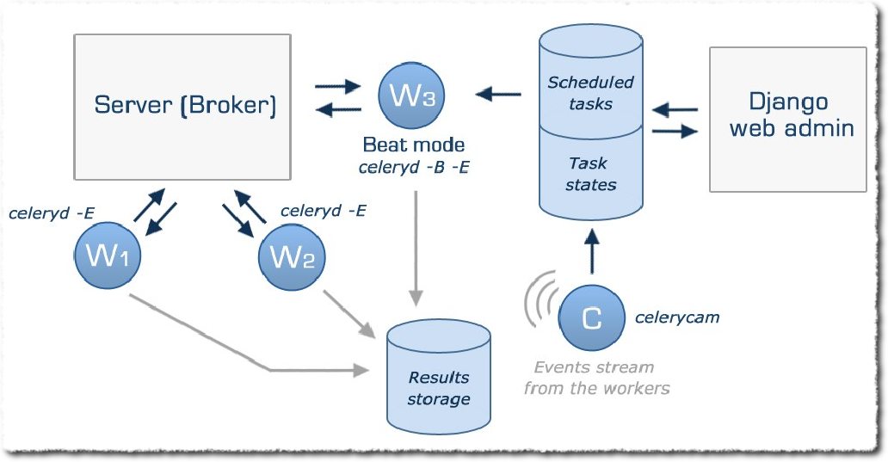
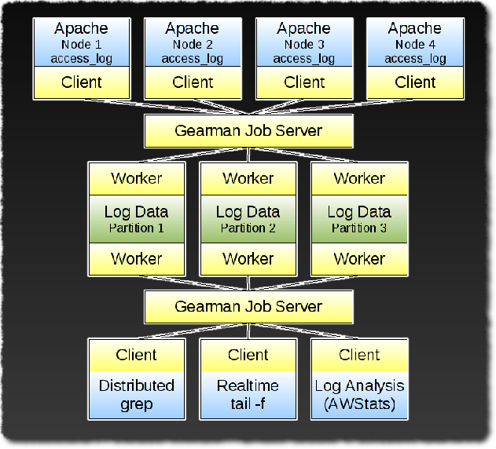

.. include:: <s5defs.txt>

==================================================================
MQ解耦应用
==================================================================

～ 为偷懒而艰苦思考ing (powered by rst2S5)

:Authors: `Zoom.Quiet <zoomquiet+sns@gmai.com>`__
:URL:    http://zoomquiet.org/res/s5/111111-pyconchina-mq-taste

.. This document has been placed in the CC domain.
.. _Docutils: http://docutils.sourceforge.net/
.. _reStructuredText: http://docutils.sourceforge.net/rst.html
.. _S5: http://meyerweb.com/eric/tools/s5/
.. _Firefox: http://www.mozilla.com/firefox/

.. _Zoom.Quiet:
    http://code.google.com/p/openbookproject/wiki/ZoomQuiet
.. _(CC)by-nc-sa:
    http://creativecommons.org/licenses/by-nc-sa/2.5/cn/
.. _FireFox:
    http://www.mozilla.com/firefox/
.. _S5介绍:
    http://zoomquiet.org/res/s5/100826-PyTDD/s5.html
.. _WYTIWYG:
    http://wiki.woodpecker.org.cn/moin/WyTiWyG
.. _提问的智慧:
    http://wiki.woodpecker.org.cn/moin/AskForHelp

.. 图片定义区
.. |bullet| unicode:: U+02022
.. |mode| unicode:: U+00D8 .. capital o with stroke

.. |S5icon| image:: pix/S5icon.GIF
    :align: top
    :scale: 100 %
    :target: http://www.meyerweb.com/eric/tools/s5/
.. |LeoProse| image:: pix/LeoProse.gif
    :align: top
    :scale: 100 %
    :target: http://wiki.woodpecker.org.cn/moin/LeoEnvironment

.. |cc-byncsa31| image:: i/icon/cc-byncnd-88x31.png
    :alt: (CC)by-nc-sa 许可证
    :target: http://creativecommons.org/licenses/by-nc-sa/2.5/cn/
.. |cc-byncsa15| image:: i/icon/cc-byncnd-80x15.png
    :alt: (CC)by-nc-sa 许可证
    :target: http://creativecommons.org/licenses/by-nc-sa/2.5/cn/
.. |zqeye| image:: i/id/zoomquiet_1-1_outline.png
    :alt: 是也乎;-)
    :target: http://wiki.woodpecker.org.cn/moin/ZoomQuiet
.. |lovpy| image:: i/logo/110409-book-logo-h90.png
    :alt: 可爱的Python
    :scale: 100 %
    :target: http://lovelypython.zoomquiet.org/

.. footer:: 

   `Zoom.Quiet`_ v11.11.11 |cc-byncsa15| 推荐用 `FireFox`_ 获得最佳游览效果

<免责/>
=========

.. container:: handout

   山寨的，非业界公认的，个人体验为基础!
   |zqeye|

.. class:: takahashi1

    参考所有同好行为总结而得

    - 一切资料来自网络互动挖掘
    - 一切想法来自日常学习工作
    - 一切体悟来自各种沟通交流
    - 一切知识来自社区分享印证
    - 一切经验来自个人失败体验

.. container:: notes

   - 免责是必须的，分享是无理由的！

牛妞
==================

.. container:: handout

   \\ (^o^) / 928d

.. container:: notes

   - 我的女儿刚刚一岁半,非常牛,,,脾气牛,头脑牛,虽然不会说话,但是已经能指挥我们干活了...

<brief/>
=========

.. container:: handout

   简单想,简单试,简单用... |zqeye|

.. class:: takahashi

    - :orange:`05' 起因`
    - :silver:`15' 对策`
    - :silver:`15' 实现`
    - :silver:`05'沟通`

.. container:: notes

   - 

起因
==================

.. container:: handout

   各种杯具的根源 |zqeye|

.. class:: takahashi8

    复杂

.. container:: notes

   - 是也乎?

根源在哪儿?!
==================

.. container:: handout

   多变/前后依赖/矛盾的业务 |zqeye|

.. class:: takahashi8

    业务

.. container:: notes

   - 变化的发动者总是业务

为毛有乱来的业务?
======================================================

.. container:: handout

   是共军太狡猾 |zqeye|

.. class:: takahashi8

    设计

.. container:: notes

   - 业务总是变化,是必然的,而且随着互联的发展越来越快

为毛要乱实现业务?
======================================================

.. container:: handout

   - 没空宏观规划 |zqeye|
   - 没空回顾整理
   - 没心情...

.. class:: takahashi8

    :orange:`被` 开发

.. container:: notes

   - 可是落实到一个即使很稳定的系统中,也将引发无数问题
   - 因为原先并没有考虑这么多变化
   - 代码/框架/系统,根本没有到可以随机应变的状态

真正的原因?
======================================================

.. container:: handout

   经验不足吧 |zqeye|

.. class:: takahashi8

    :orange:`被` 耦合

.. container:: notes

   - 耦合的代码都是人为引入的!

依赖是种心理反应
======================================================

.. container:: handout

   不受控制的功能/代码叠加 |zqeye|

.. class:: takahashi8

    蔓生

.. container:: notes

   - 在思想/态度/情绪失控后的乱来

<brief/>
=========

.. container:: handout

   简单想,简单试,简单用... |zqeye|

.. class:: takahashi

    - :gray:`05' 起因`
    - :orange:`15' 对策`
    - :silver:`15' 实现`
    - :silver:`05'沟通`

.. container:: notes

   - 

对策
==================

.. container:: handout

   简单的保持需要更加简单的设计 |zqeye|

.. class:: takahashi8

    :orange:`K` ISS

.. container:: notes

   - 那么从根儿上尝试解决!

复杂的标志性表现
====================================

.. container:: handout

   牵一发动全身 |zqeye|

.. class:: takahashi8

    乱入

.. container:: notes

   - 不乱入,就得从一开始,任何一个组件都有一个统一的简单的可行的鲁棒性 结构

功能代码的模块化不解决问
====================================

.. container:: handout

   业务的纠结是根源 |zqeye|

.. class:: takahashi8

    概念

.. container:: notes

   - 整理各种概念

Business?!
====================================

.. container:: handout

   - 此"业务"非彼"业务" |zqeye|
   

.. class:: takahashi8

    `业务`

.. container:: notes

   - 代码要解决实际问题
   - 实际问题以用户故事描述
   - 应对方案就是业务定义

Application
====================================

.. container:: handout

   方案的实现应用 |zqeye|

.. class:: takahashi8

    应用

.. container:: notes

   - 对业务的支持是映射到各个应用中

Entities
====================================

.. container:: handout

   组成应用的实体 |zqeye|

.. class:: takahashi8

    实体

.. container:: notes

   - 应用一系列 代码/数据 集合构成
   
       - 实体代表了分离的数据系列(disjoint sets of data)
       - 每个数据项(datum)只位于一个实体中
       - 实体中的数据决不与其它实体的数据交叉(overlap)

    - 考虑实体的:
    
        - 分离的序列化范围 Disjoint Scopes of Serializability
        - 唯一标识的实体 Uniquely Keyed Entities
        - 重分区和实体 Repartitioning and Entities
        - 原子事务和实体 Atomic Transactions and Entities

    - 应用程序底层将确保每个实体键值(和实体)位于单一的机器(或群集)上，而不同实体则可能分布在任何地方
    - 实体是操作原子性的边界标志

Transactions
====================================

.. container:: handout

   实体完成的行动是事务 |zqeye|

.. class:: takahashi8

    事务

.. container:: notes

   - 对实体的操作是事务

ACTIVITIES
====================================

.. container:: handout

   事务的具体执行 |zqeye|

.. class:: takahashi8

    活动

.. container:: notes

   - 对事务的控制/调用/流传 就是活动
   - 活动包含了实体的状态集合

Robustness 
====================================

.. container:: handout

   - Almost-Infinite Scaling of Applications |zqeye|
   - 考虑无限伸缩应用 

.. class:: takahashi9

    :orange:`鲁棒`

.. container:: notes

   - 稳健性~鲁棒性原是统计学中的一个专门术语
   - 控制论中:是指控制系统在一定（结构，大小）的参数摄动下，维持某些性能的特性

对策基于以下理论
====================================

.. container:: handout

   `[翻译] 超越分布式事务的方法 - 一个叛逆者的观点 - riccc - 博客园 <http://www.cnblogs.com/RicCC/archive/2008/03/30/life-beyond-distributed-transactions.html>`_ |zqeye|
   

.. class:: takahashi8

    假设

.. container:: notes

   - 是也乎?

伸缩性与应用的分层无关
====================================

.. container:: handout

   `[翻译] 超越分布式事务的方法 - 一个叛逆者的观点 - riccc - 博客园 <http://www.cnblogs.com/RicCC/archive/2008/03/30/life-beyond-distributed-transactions.html>`_ |zqeye|
   

.. class:: takahashi9

    分层

.. container:: notes

   - 底层是伸缩相关(scale-aware)的即它们了解这个映射关系
   - 我们假设底层为上层提供了一个伸缩无关的(scale-agnostic)编程抽象
   - 使用它编写应用程序上层代码时无需考虑伸缩问题

事务序列化范畴与伸缩性有关
====================================

.. container:: handout

   `[翻译] 超越分布式事务的方法 - 一个叛逆者的观点 - riccc - 博客园 <http://www.cnblogs.com/RicCC/archive/2008/03/30/life-beyond-distributed-transactions.html>`_ |zqeye|
   

.. class:: takahashi9

    范畴

.. container:: notes

   - 全局事务序列化(global transactional serializability)
   
       - 2PC(两阶段提交)在某节点不可用时容易阻塞
       - 协议例如Paxos算法，在节点失败时不会阻塞
    
    - 现在考虑的是非全局事务
    - 多个分离的事务序列化范围(multiple disjoint scopes of transactional serializability)

大部分应用使用"至少一次"的消息方式
========================================================================

.. container:: handout

   - At-Least-Once 模式 |zqeye|
   

.. class:: takahashi10

    1+

.. container:: notes

   - 问题产生的原因是消息分发与持久化数据的更新不是直接结合在一起

综上
====================================

.. container:: handout

   |zqeye|
   

.. class:: takahashi8

    原则

.. container:: notes

   - 开发系统的首选原则

Idempotence
====================================

.. container:: handout

   只包含单一安全事务|zqeye|
   
   

.. class:: takahashi8

    幂等

.. container:: notes

    - 识别出所有实体后
    - 明确各级原子性的事务来:
    
        - 安全且幂等:        读取
        - 安全不幂等:        查询/修订
        - 幂等不安全:        创建
        - 不安全幂等:    删除
    
    - 避免: 消息重试(retry)和重新订阅(reorder)
        

用消息来协调
====================================

.. container:: handout

   |zqeye|
   
   

.. class:: takahashi8

    消息

.. container:: notes

   - 隔离实体
   - 转移事务
   - 记录/协调/分发活动

Message-oriented programming
====================================

.. container:: handout

   面向消息的编程 |zqeye|
   
   

.. class:: takahashi8

    :orange:`MOP`

.. container:: notes

   - 这是 OOP 之后无数 XOP 的又一次概念冷饭
   - 之前体验到的 面向数据编程,在分布式后,推导成了 MOP
   - 当然还有 MOO ~ 面向肌肉的操作

通常系统
====================================

.. container:: handout

   |zqeye|
   
   

.. class:: takahashi8

.. container:: notes

   - 是也乎?

MOP系统
====================================

.. container:: handout

   |zqeye|
   
   

.. class:: takahashi8

.. container:: notes

   - 是也乎?

常见邮件提醒
====================================

.. container:: handout

   |zqeye|
   
   

.. class:: takahashi8

.. container:: notes

   - 是也乎?

MOP邮件提醒
====================================

.. container:: handout

   |zqeye|
   
   

.. class:: takahashi8

.. container:: notes

   - 是也乎?

通常业务日志
====================================

.. container:: handout

   |zqeye|
   
   

.. class:: takahashi8

.. container:: notes

   - 是也乎?

MOP业务日志
====================================

.. container:: handout

   |zqeye|
   
   

.. class:: takahashi8

.. container:: notes

   - 是也乎?

加层
====================================

.. container:: handout

   这次是通用的 |zqeye|

.. class:: takahashi8

    :orange:`1` 板斧

.. container:: notes

   - 面对复杂问题永远可以通过增加一个抽象层来解决
   - MOP 之下,永远只多一层!

<brief/>
=========

.. container:: handout

   简单想,简单试,简单用... |zqeye|

.. class:: takahashi

    - :gray:`05' 起因`
    - :gray:`15' 对策`
    - :orange:`15' 实现`
    - :silver:`05'沟通`

.. container:: notes

   - 

业务原子化
==================

.. container:: handout

   内部全部 RESTful 接口化 |zqeye|

.. class:: takahashi8

    前提

.. container:: notes

   - eat yself dog food!
   - 好处是每个原子操作都非常非常简单

分级
==================

.. container:: handout

   可RESTful 的... |zqeye|

.. class:: incremental takahashi

    - 安全且幂等: 读取
    - 安全不幂等: 查询/修订
    - 幂等不安全: 创建
    - 不安全幂等: 删除

.. container:: notes

   - eat yself dog food!
   - 好处是每个原子操作都非常非常简单

支撑核心
==================

.. container:: handout

   尽可能异步化一切 |zqeye|

.. class:: takahashi8

    MQ

.. container:: notes

   - 是也乎?

Message
==================

.. container:: handout

   无状态事务的实体键 |zqeye|

.. class:: takahashi8

    :orange:`M` Q

.. container:: notes

   - 消息可以是任何东西:
   
    - 数据片段
    - 代码片段
    - 状态
    - 指令
    - ...

Queue
==================

.. container:: handout

   FIFO的管道 |zqeye|

.. class:: takahashi8

    M :orange:`Q`

.. container:: notes

   - 一个健壮的,基于 http的拥有多种数据结构的栈

Queue的能力
==================

.. container:: handout

   分支式请求可耐受 |zqeye|

.. class:: takahashi8

    迸发

.. container:: notes

   - 即,能自动对缓存进行优化的

Queue的内容
==================

.. container:: handout

   - Atomic Transactions |zqeye|

.. class:: takahashi8

    原子性

.. container:: notes

   - 对操作能进行原子保证的

Queue的监测
==================

.. container:: handout

   有方法将意外的任务回收 |zqeye|

.. class:: takahashi8

    可回收

.. container:: notes

   - 这个要求不太,一般可以自制

`芹菜 <http://celeryproject.org/>`_
========================================================================

.. container:: handout

   高档MQ选择... |zqeye|

.. class:: takahashi

    - 纯Py
    - 多后端选择(DB/NoSQL/MQ)
    - 多框架结合
    - 多线程动力(gevent/Eventlet)
    - ... 

.. container:: notes

   - 复杂

Celery
====================================

.. container:: handout

   分布式任务/工作 队列 |zqeye|
   
   

.. class:: takahashi8

.. container:: notes

   - 

Djnago-celery
====================================

.. container:: handout

   有Django扩展 |zqeye|
   
   

.. class:: takahashi8

.. container:: notes

   - 

|gearman|
====================================

.. container:: handout

   类似的知名作品 |zqeye|
   
   

.. class:: takahashi8

.. container:: notes

   - 基于 Perl/RPC...

面向文档(document-oriented)的NoSQL 数据库
======================================================

.. container:: handout

   10gen 团队的魔幻作品! |zqeye|

.. class:: takahashi8

    
    

.. container:: notes

   - 这个词是从humongous中截取出来的，其野心不言而明，直指海量数据存储

内存映射机制
==================

.. container:: handout

   天然自动化缓存调度 |zqeye|

.. class:: takahashi8

    mmap

.. container:: notes

   - 内置分布式集群控制,迸发影响可用   

capped collection
====================================

.. container:: handout

   天然高速队列配合 `Tailable Cursors <http://blog.nosqlfan.com/html/1986.html>`_ |zqeye|

.. class:: takahashi8

    定长集

.. container:: notes

   - 不用计算空间的定长队列

文档级的原子操作
====================================

.. container:: handout

   $findAndModify;相当于表安全 |zqeye|

.. class:: takahashi7

    upset

.. container:: notes

   - $upset 也是

使用时间差
====================================

.. container:: handout

   时间戳查询 |zqeye|

.. code-block:: python

    now = datetime.datetime.now()
    difference = datetime.timedelta(seconds=10)
    timeout = now - difference
    
    queue.find({'inProg' : True, 'start' : {'$lte' : timeout} })
    
.. container:: notes

   - 山寨,但是好用

`Karait <https://github.com/bcoe/karait>`_
========================================================================

.. container:: handout

   轻便MQ选择... |zqeye|

.. class:: takahashi

    - 纯Py
    - 跨语言接口
    - MongoDB 后端!

.. container:: notes

   - 简陋,但是,作为开始很好用

Python 入Q
========================================================================

.. container:: handout

   示例代码 |zqeye|

.. code-block:: python

    from karait import Message, Queue
    queue = Queue(
        database='karait',
        queue='messages',
    )    
    queue.write({
        'name': 'Benjamin',
        'action': 'Rock'
        }
        ,routing_key='foobar'
        )#, expire=3.0
        

.. container:: notes

   - 是也乎?

Python 出Q
========================================================================

.. container:: handout

   示例代码 |zqeye|

.. code-block:: python

    from karait import Message, Queue
    queue = Queue()
    
    message = queue.read()[0]
    print "%s" % (message.name)
    
    message.delete()

.. container:: notes

   - 是也乎?

node.js 出Q
========================================================================

.. container:: handout

   示例代码 |zqeye|

.. code-block:: js

    var puts = require('sys').puts,
        Queue = require('karait').Queue;
    new Queue(function(err, queue) {
        (function readMessages() {
            queue.read({routingKey: 'foobar'}, function(err, messages) {
                for (var i = 0, message; (message = messages[i]) != null; i++) {
                //...
                }
                queue.deleteMessages(messages, function() {
                    readMessages();
                });
            })();
        });

.. container:: notes

   - 是也乎?

Ruby 出Q
========================================================================

.. container:: handout

   示例代码 |zqeye|

.. code-block:: ruby

    require 'karait'
    
    queue = Karait::Queue.new
    message = queue.read().first
    print "#{message.name}"
    
    message.delete
    
.. container:: notes

   - 是也乎?

原子保证
========================================================================

.. container:: handout

   visibility_timeout 设定超时秒数 |zqeye|

.. code-block:: python

    from karait import Message, Queue
    queue = Queue()

    message = queue.read(routing_key='foobar', 
        visibility_timeout=3.0)[0]
    print "%s" % (message.name)
    
    message.delete
        
.. container:: notes

   - 是也乎?

未尽的
==================

.. container:: handout

   各种没现成的功能 |zqeye|

.. class:: takahashi8

    ToDo

.. container:: notes

   - MOP 从思想到框架缺少的...

工作状态
==================

.. container:: handout

   是否超时/死亡/僵尸... |zqeye|

.. class:: takahashi7

    进程
    
    监控

.. container:: notes

    - ip:port:start_time:pid 为组合,对进程进行标识:
    
        - pid   确保唯一性
        - gpid  生成成本低
        - gpid  有生产意义
        - gpid  有历史意义
   

数据传递
==================

.. container:: handout

   当事务有前后顺序时? |zqeye|

.. class:: takahashi7

    活动
    
    序列

.. container:: notes

   - 再设计,通过多段提交,去顺序化

灾难响应
==================

.. container:: handout

   能否安全的迁移所有末尽事务? |zqeye|

.. class:: takahashi7

    灾难
    
    迁移
    

.. container:: notes

   - MongoDB 的能力了!

业务状态
==================

.. container:: handout

   合理化业务整体进展的汇报 |zqeye|

.. class:: takahashi7

    实时
    
    统计

.. container:: notes

   - 分布式业务日志内置!

对策
==================

.. container:: handout

   简单的保持需要更加简单的设计 |zqeye|

.. class:: takahashi8

    KI :orange:`SS`

.. container:: notes

   - 那么从根儿上尝试解决!

KISS
====================================

.. container:: handout

   山寨才V5 |zqeye|

.. class:: incremental takahashi

    - 选择最 **土** 的方案
    - 成对维护 :sup:`(生产和消费者)`
    - 内置测试
    - 守往master
    - 时常重构 :sup:`沈游侠军规`
    - ...

.. container:: notes

    - 1、code review 的必须很快,代码排版到能够扫一眼文件就知道有没有 bug 和设计问题
    - 2、当无法起出一个PP的变量名时，已经有设计问题了

<brief/>
=========

.. container:: handout

   简单想,简单试,简单用... |zqeye|

.. class:: takahashi

    - :gray:`05' 起因`
    - :gray:`15' 对策`
    - :gray:`15' 实现`
    - :orange:`05'沟通`

.. container:: notes

   - 

总之:任何好想法
====================================

.. container:: handout

   期望记住的~单位时间能记住的只有7+-2 个 |zqeye|

.. class:: incremental takahashi

    - 复杂事关态度
    - 耦合的根源在业务
    - 异步业务靠设计
    - MQ我选MongoDB
    - `MOP` 尚未成功

.. container:: notes

    - Doing now! don't thinking!

<discuss/>
==========

.. container:: handout

   |zqeye|

.. class:: takahashi8

    Q&A

.. container:: notes

   - 

<版本/>
=========

.. container:: handout

   |zqeye|

- 111201 增补ToDo 和牛妞照片
- 111122 增补图谱
- 111114 增补叙述
- 111112 调整结构
- 111111 创建幻灯

:反馈:
    `Zoom.Quiet <zoomquiet+sns@gmai.com>`__

http://zoomquiet.org/res/s5/111111-pyconchina-mq-taste

`S5 <http://www.meyerweb.com/eric/tools/s5/>`__
==============================================================================================

.. container:: handout

    纯HTML 幻灯撰写框架!... |S5icon|

- S\ :sup:`5`\ == a :orange:`S` imple :orange:`S` tandards-Based :orange:`S` lide :orange:`S` how :orange:`S` ystem 

 - 仅仅依靠 CSS+JS 的HTML格式幻灯演示框架

- 我的编辑环境: |LeoProse| ~ `文学化编辑器 <http://en.wikipedia.org/wiki/Literate_programming>`__

.. image:: pix/2010-01-18-230729_605x421_leo.png
    :align: center
    :scale: 100 %
    :target: http://wiki.woodpecker.org.cn/moin/LeoEnvironment

.. container:: notes

   - 虽然有很多其它替代方案，至今用得最爽的还是 S5
   - 最好也是最不好的，就是S5 需要专用的http 空间发布，无法直接分享到 slidshare.com 之类SNS空间中

