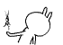
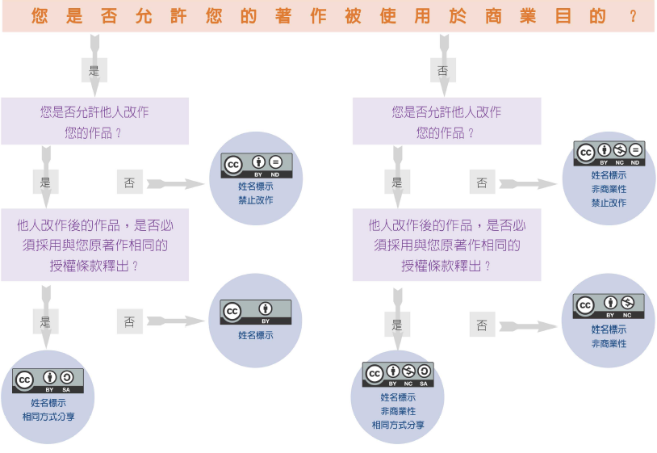
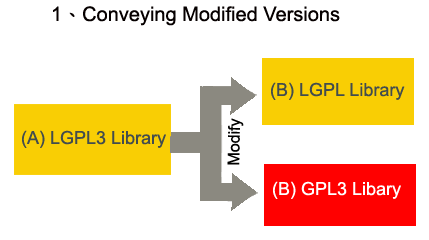
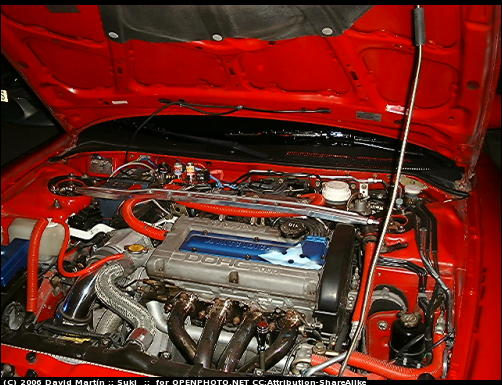
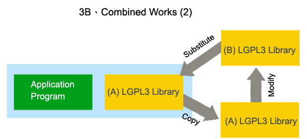

.. include:: <s5defs.txt>
.. This document has been placed in the CC domain.
.. _Docutils: http://docutils.sourceforge.net/
.. _reStructuredText: http://docutils.sourceforge.net/rst.html
.. _S5: http://meyerweb.com/eric/tools/s5/
.. _Firefox: http://www.mozilla.com/firefox/

.. _Zoom.Quiet:
    http://code.google.com/p/openbookproject/wiki/ZoomQuiet
.. _(CC)by-nc-sa:
    http://creativecommons.org/licenses/by-nc-sa/2.5/cn/
.. _FireFox:
    http://www.mozilla.com/firefox/
.. _S5介绍:
    http://zoomquiet.org/res/s5/100826-PyTDD/s5.html
.. _WYTIWYG:
    http://wiki.woodpecker.org.cn/moin/WyTiWyG

.. 图片定义区
.. |bullet| unicode:: U+02022
.. |mode| unicode:: U+00D8 .. capital o with stroke

.. |S5icon| image:: pix/S5icon.GIF
    :align: top
    :scale: 100 %
    :target: http://www.meyerweb.com/eric/tools/s5/
.. |LeoProse| image:: pix/LeoProse.gif
    :align: top
    :scale: 100 %
    :target: http://wiki.woodpecker.org.cn/moin/LeoEnvironment
.. |cc-byncsa31| image:: i/icon/cc-byncnd-88x31.png
   :alt: (CC)by-nc-sa 许可证
   :target: http://creativecommons.org/licenses/by-nc-sa/2.5/cn/
.. |cc-byncsa15| image:: i/icon/cc-byncnd-80x15.png
   :alt: (CC)by-nc-sa 许可证
   :target: http://creativecommons.org/licenses/by-nc-sa/2.5/cn/
.. |zqeye| image:: i/id/zoomquiet_1-1_outline.png
   :alt: 是也乎;-)
   :target: http://wiki.woodpecker.org.cn/moin/ZoomQuiet

.. |lr_s5| image:: pix/levelradar_s5.png
    :scale: 100 %

==================================================================
FLOSS授权
==================================================================

～軟體授權法制與自由軟體授權模式介紹

:Authors: `林誠夏 <lucien@iis.sinica.edu.tw>`__
:Authors: `Zoom.Quiet <zoomquiet+floss@gmai.com>`__
:URL:    http://zoomquiet.org/res/s5/120501-ossf-freedom/

.. footer:: 

   `Zoom.Quiet`_ v12.05.1 |cc-byncsa15| 推荐用 `FireFox`_ 获得最佳游览效果

<免责/>
=========

.. container:: handout

   山寨的，非业界公认的，个人体验为基础!
   |zqeye|

.. class:: takahashi1

    参考所有同好行为总结而得
        - 一切资料来自网络互动挖掘
        - 一切想法来自日常学习工作
        - 一切体悟来自各种沟通交流
        - 一切知识来自社区分享印证
        - 一切经验来自个人失败体验
    

<brief/>
=========

.. container:: handout

    |zqeye|

.. class:: takahashi

    - :orange:`5' 有关`
    - :silver:`' 概念`
    - :silver:`' 分类`
    - :silver:`'选择`
    - :silver:`'资源`

lucien@iis.sinica.edu.tw
==========================================

.. container:: handout

    02-27883799 ext.1474 |zqeye|

.. class:: takahashi8
    
    `林誠夏 <http://www.openfoundry.org/tw/activities/details/4>`_

.. container:: notes

   - 

自由軟體鑄造場
==========================================

.. container:: handout

     |zqeye|

.. class:: takahashi
    
    `中研院．資訊所  <http://www.openfoundry.org>`_

.. container:: notes

   - 

中文名稱
==========================================

.. container:: handout

     |zqeye|

.. class:: takahashi
    
    自由軟體鑄造場

.. container:: notes

   - 

英文名稱
==========================================

.. container:: handout

    簡稱OSSF |zqeye|

.. class:: takahashi3
    
    :orange:`O` pen
    
    :orange:`S` ource
    
    :orange:`S` oftware
    
    :orange:`F` oundry
    

.. container:: notes

   - 

鑄造創意與分享創意的場域
==========================================

.. container:: handout

    中文、簡稱、鑄造場 |zqeye|

.. class:: takahashi

    .. image:: i/forgelogo.jpg
        :align: center
        :scale: 50%
        :alt: 自由軟體鑄造場-logo

.. container:: notes

   - ...
   - ..

.. |goodguy| image:: i/goodguy.png 
.. |sharealike| image:: i/sharealike.png 
.. |kisskiss| image:: i/kisskiss.png 
.. |copyright| image:: i/copyright.png 
.. |monkeysmile| image:: i/monkeysmile.png 
.. |cc| image:: i/cc.png 
.. |tg| image:: i/tg.png 
.. |petrifaction| image:: i/petrifaction.png 
.. |dl| image:: i/dl.png 

.. |gpl-apart| image:: i/gpl-apart.png 
.. |cc-commons-deed| image:: i/cc-commons-deed.png 
.. |cc-digital-code| image:: i/cc-digital-code.png 
.. |ghostbusters| image:: i/ghostbusters.png 

.. |rms-bw| image:: i/rms-bw.png 
.. |batman-kiss| image:: i/batman-kiss.jpg 
.. |software-restraint-chart| image:: i/software-restraint-chart.png 
.. |tuzki-scratch| image:: i/tuzki-scratch.png 
.. |PetitPrince| image:: i/PetitPrince.png 
.. |lw2| image:: i/lw2.png 
.. |nastynice| image:: i/nastynice.png 

.. |catfire| image:: i/catfire.png 
.. |ocw3| image:: i/ocw3.png 

.. |cc-legal-code| image:: i/cc-legal-code.png 
.. |kakaka| image:: i/kakaka.png 
.. |software-restraint-chart-mpl| image:: i/software-restraint-chart-mpl.png 
.. |wikipedia| image:: i/wikipedia.png 
.. |copyleft| image:: i/copyleft.png 
.. |tuzki-books| image:: i/tuzki-books.png 
.. |piggy| image:: i/piggy.png 

.. |gpl-nc| image:: i/gpl-nc.png 
.. |tuzki-release| image:: i/tuzki-release.png 
.. |lgpl3-2| image:: i/lgpl3-2.png 

.. |lgpl3-4| image:: i/lgpl3-4.png 
.. |cc-by-nc-sa| image:: i/cc-by-nc-sa.png 
.. |baldness01| image:: i/baldness01.png 
.. |baldness02| image:: i/baldness02.png 
.. |tuzki-unlawful| image:: i/tuzki-unlawful.png 

.. |ou| image:: i/ou.png 
.. |xixixi| image:: i/xixixi.png 
.. |software-restraint-chart-gpl| image:: i/software-restraint-chart-gpl.png 
.. |love| image:: i/love.png 
.. |wall| image:: i/wall.png 

.. |tuzki-crying| image:: i/tuzki-crying.png 
.. |lgpl3-3a| image:: i/lgpl3-3a.png 
.. |car02| image:: i/car02.png 
.. |car01| image:: i/car01.png 
.. |bingo| image:: i/bingo.png 

.. |license-breakdown| image:: i/license-breakdown.png 
.. |software-restraint-chart-bsd| image:: i/software-restraint-chart-bsd.png 
.. |tuzki-orz| image:: i/tuzki-orz.png 
.. |creativecommons| image:: i/creativecommons.png 

.. |gnu| image:: i/gnu.png 
.. |tuzki-no-risk| image:: i/tuzki-no-risk.png 
.. |lw3| image:: i/lw3.png 
.. |system-architecture| image:: i/system-architecture.jpg 
.. |Bertramliger| image:: i/Bertramliger.png 

.. |talktalk| image:: i/talktalk.png 

.. |warning| image:: i/warning.png 
.. |dual| image:: i/dual.png 
.. |deed| image:: i/deed.png 
.. |nocommercial| image:: i/nocommercial.png 

.. |nd| image:: i/nd.png 
.. |tuzki-web-steal| image:: i/tuzki-web-steal.png 
.. |google_logo_plain| image:: i/google_logo_plain.png 
.. |dance18| image:: i/dance18.png 
.. |wheel| image:: i/wheel.png 
.. |copyright-to-copyleft| image:: i/copyright-to-copyleft.png 
.. |sutra| image:: i/sutra.png 
.. |red-hat| image:: i/red-hat.png 
.. |moun| image:: i/moun.jpg 
.. |tuzki-websurfing| image:: i/tuzki-websurfing.png 
.. |google-phone-os-android| image:: i/google-phone-os-android.png 
.. |3c6f0843| image:: i/3c6f0843.png 
.. |friends| image:: i/friends.png 
.. |attrib| image:: i/attrib.png 

.. |tuzki-not-fair-use| image:: i/tuzki-not-fair-use.png 
.. |cover| image:: i/cover.png 
.. |bottle| image:: i/bottle.png 

嗯嗯嗯
==============================================================================

.. container:: handout

     |zqeye|

.. class:: takahashi
    
    ...    

.. container:: notes

    - 

Email: lucien@iis.sinica.edu.tw
==============================================================================

.. container:: handout

    Tel: 02-27883799 ext.1474 |zqeye|

.. class:: takahashi
    
    林誠夏    

.. container:: notes

    - 

==============================================================================

.. container:: handout

     |zqeye|

.. class:: takahashi
    
    中研院．資訊所．自由軟體鑄造場    

.. container:: notes

    - 

單位中文名稱
==============================================================================

.. container:: handout

     |zqeye|

.. class:: takahashi
    
    自由軟體鑄造場    

.. container:: notes

    - 

英文名稱
==============================================================================

.. container:: handout

    簡稱OSSF |zqeye|

.. class:: takahashi
    
    Open Source Software Foundry,  :orange:`OSSF`     

.. container:: notes

    - 

鑄造創意與分享創意的場域
==============================================================================

.. container:: handout

    中文、簡稱、鑄造場 |zqeye|

.. class:: takahashi
    
    [[image src="/images/forgelogo.jpg" width="800" height="530"]]    

.. container:: notes

    - 

鑄造場的三大工作要項分為
==============================================================================

.. container:: handout

    技術支援部門、營運推廣部門、法政諮詢部門 |zqeye|

.. class:: takahashi
    
    1、技術；2、營運；3、 :orange:`法政`     

.. container:: notes

    - 

來自、法政諮詢部門
==============================================================================

.. container:: handout

    自由軟體法律授權條款分析與軟體授權策略研擬 |zqeye|

.. class:: takahashi
    
    法政組    

.. container:: notes

    - 

鑄造場法政組常態進行的工作
==============================================================================

.. container:: handout

     |zqeye|

.. class:: takahashi
    
     - 研讀自由軟體授權條款 - 彙整各國自由軟體推行政策 - 追蹤自由軟體訴訟案例 - 分析自由軟體商業授權模式………………………    

.. container:: notes

    - 

嗯嗯嗯
==============================================================================

.. container:: handout

    歡迎點閱了解 |zqeye|

.. class:: takahashi
    
     - [[法律小辭典|http://www.openfoundry.org/Law-and-Policy/Glossary/]] - [[自由軟體授權常見問答集|http://www.openfoundry.org/Law-and-Policy/FAQ/]] - [[自由軟體訴訟案件分析彙整|http://www.openfoundry.org/Law-and-Policy/Case-Study/]] - [[法律政策發問討論區|http://whoswho.openfoundry.org/index.php?option=com_fireboard]] - [[自由軟體授權條款介紹|http://www.openfoundry.org/Law-and-Policy/Licenses/]] - [[自由軟體授權導引精靈v2.2|http://swan.iis.sinica.edu.tw/LicenseWizard2/LicenseWizard.cgi]] - [[自由軟體授權導引精靈v3.2|http://swan.iis.sinica.edu.tw/LicenseWizard/index.htm]]………………………    

.. container:: notes

    - 
    - 嗯嗯嗯

課程主軸
==============================================================================

.. container:: handout

    這是一種不同於傳統的另類軟體授權模式 |zqeye|

.. class:: takahashi
    
    自由軟體授權條款    

.. container:: notes

    - 

分下列幾個重點來講述
==============================================================================

.. container:: handout

    對各位日後參與自由軟體專案的各方面皆有所幫助 |zqeye|

.. class:: takahashi
    
     - 軟體授權的 :orange:`概念`  - 公眾授權條款的 :orange:`分類`  - 公眾授權條款的 :orange:`選擇方式`  - 如何利用鑄造場的 :orange:`現有資源`     

.. container:: notes

    - 

嗯嗯嗯
==============================================================================

.. container:: handout

     |zqeye|

.. class:: takahashi
    
    跳頁很快    

.. container:: notes

    - 
    - 嗯嗯嗯

每一節的簡報皆逾百頁
==============================================================================

.. container:: handout

     |zqeye|

.. class:: takahashi
    
    快    

.. container:: notes

    - 

部份頁面不超過三秒
==============================================================================

.. container:: handout

     |zqeye|

.. class:: takahashi
    
    很快    

.. container:: notes

    - 

是很意識流的導引模式
==============================================================================

.. container:: handout

     |zqeye|

.. class:: takahashi
    
    非常快    

.. container:: notes

    - 

嗯嗯嗯
==============================================================================

.. container:: handout

    有問題可於課後討論 |zqeye|

.. class:: takahashi
    
    聚精會神    

.. container:: notes

    - 
    - 嗯嗯嗯

==============================================================================

.. container:: handout

     |zqeye|

.. class:: takahashi
    
    第一章、智慧財產權法的基本概念與 :orange:`自由文化`     

.. container:: notes

    -  第一節-智財權的基本概念

智慧財產權的英文原文
==============================================================================

.. container:: handout

    簡稱IPR |zqeye|

.. class:: takahashi
    
    智慧財產權( :orange:`IPR` )INTELLECTUAL PROPERTY RIGHTS    

.. container:: notes

    - 

它是一種
==============================================================================

.. container:: handout

     |zqeye|

.. class:: takahashi
    
    財產權    

.. container:: notes

    - 

嗯嗯嗯
==============================================================================

.. container:: handout

    等等權利(使用它、利用它來得到利益、賣斷或是毀壞它、禁此他人使用這個權利) |zqeye|

.. class:: takahashi
    
    使用 收益處分 排他    

.. container:: notes

    - 
    - 嗯嗯嗯

嗯嗯嗯
==============================================================================

.. container:: handout

     |zqeye|

.. class:: takahashi
    
     :orange:`＄`     

.. container:: notes

    - 
    - 嗯嗯嗯

嗯嗯嗯
==============================================================================

.. container:: handout

    「準」這個字代表不是真的，只是很像，準夫婿、準男友…，所以智財權並不是物權，它只是性質很像 |zqeye|

.. class:: takahashi
    
     :orange:`準` 物權    

.. container:: notes

    - 
    - 嗯嗯嗯

嗯嗯嗯
==============================================================================

.. container:: handout

    智財權沒有實體卻可為權利人帶來很多的經濟利益，所以運作的方式與傳統物權相比複雜許多 |zqeye|

.. class:: takahashi
    
     :orange:`無體`     

.. container:: notes

    - 
    - 嗯嗯嗯

嗯嗯嗯
==============================================================================

.. container:: handout

     |zqeye|

.. class:: takahashi
    
     :orange:`著作` 權法  :orange:`專利` 法  :orange:`商標` 法營業秘密保護法 植物種苗法光碟管理條例 積體電路電路布局保護法………………………………    

.. container:: notes

    - 
    - 嗯嗯嗯

嗯嗯嗯
==============================================================================

.. container:: handout

    這三個主要的智慧財產權利，以下會就這三者為各位做簡明的介紹 |zqeye|

.. class:: takahashi
    
     :orange:`著作` 權  :orange:`專利` 權  :orange:`商標` 權    

.. container:: notes

    - 
    - 嗯嗯嗯

第一、所謂
==============================================================================

.. container:: handout

    是業者利用「商標」表彰自我商品來源或服務的形象的權利 |zqeye|

.. class:: takahashi
    
    一、 :orange:`商標` 權    

.. container:: notes

    - 

Trade-交易
==============================================================================

.. container:: handout

    Mark-印記 |zqeye|

.. class:: takahashi
    
    Trade :orange:`Mark`     

.. container:: notes

    - 

Trademark就是用
==============================================================================

.. container:: handout

    種種手段來表彰商品是誰做出來的 |zqeye|

.. class:: takahashi
    
    文字   :orange:`圖形` 記號   :orange:`顏色` 聲音  立體形狀    

.. container:: notes

    - 

==============================================================================

.. container:: handout

     |zqeye|

.. class:: takahashi
    
    [[image src="/images/mcdonalds.jpg" width="600" height="485"]]    

.. container:: notes

    - 

簡單來說商標權需要
==============================================================================

.. container:: handout

    繳交一筆行政規費 |zqeye|

.. class:: takahashi
    
    申請註冊    

.. container:: notes

    - 

商標權行使期間為
==============================================================================

.. container:: handout

    得延展 |zqeye|

.. class:: takahashi
    
    十年    

.. container:: notes

    - 

第二、
==============================================================================

.. container:: handout

     |zqeye|

.. class:: takahashi
    
    二、 :orange:`專利` 權    

.. container:: notes

    - 

嗯嗯嗯
==============================================================================

.. container:: handout

     |zqeye|

.. class:: takahashi
    
     :orange:`專]]門營[[EM:利` 權    

.. container:: notes

    - 
    - 嗯嗯嗯

嗯嗯嗯
==============================================================================

.. container:: handout

    在通過審核後 |zqeye|

.. class:: takahashi
    
    產業利用性  :orange:`＄`  :orange:`新` 穎性  :orange:`進步` 性    

.. container:: notes

    - 
    - 嗯嗯嗯

就可以得到權責機關核准
==============================================================================

.. container:: handout

    不等的專門營利權行使期間 |zqeye|

.. class:: takahashi
    
    20年 10年 12年    

.. container:: notes

    - 

所以專利的英文是
==============================================================================

.. container:: handout

    這個字原來就有「明顯、顯著、易於分別的意思」，顧名思義可以申請專利的技術應該是「明顯的、顯著的、易於與其他技術分別」的東西 |zqeye|

.. class:: takahashi
    
    PATENT    

.. container:: notes

    - 

嗯嗯嗯
==============================================================================

.. container:: handout

    在這段期間只有專利權人有機會利用這個專利技術來賺錢 |zqeye|

.. class:: takahashi
    
    商用專營權    

.. container:: notes

    - 
    - 嗯嗯嗯

嗯嗯嗯
==============================================================================

.. container:: handout

    的關卡才能得到這個權利，並繳交逐年的行政規費 |zqeye|

.. class:: takahashi
    
    申請註冊    

.. container:: notes

    - 
    - 嗯嗯嗯

嗯嗯嗯
==============================================================================

.. container:: handout

    不等 |zqeye|

.. class:: takahashi
    
    20年 10年 12年    

.. container:: notes

    - 
    - 嗯嗯嗯

嗯嗯嗯
==============================================================================

.. container:: handout

     |zqeye|

.. class:: takahashi
    
    三、 :orange:`著作` 權    

.. container:: notes

    - 
    - 嗯嗯嗯

==============================================================================

.. container:: handout

    the right to copy |zqeye|

.. class:: takahashi
    
    COPY :orange:`RIGHT`     

.. container:: notes

    - 

在早期活字印刷的那個年代
==============================================================================

.. container:: handout

    狹義的製版權-the right to copy something，但後來著作權的觀念在近代被大為擴張 |zqeye|

.. class:: takahashi
    
    製版權    

.. container:: notes

    - 

嗯嗯嗯
==============================================================================

.. container:: handout

    的時候、它指的是範圍很大的東西。以下簡單用二個概念來解釋著作權-動畫原作者王卯卯著作權宣示：使用於個人用途或論壇,但請勿用於商業用途 |zqeye|

.. class:: takahashi
    
    著作 |tuzki-books| 權    

.. container:: notes

    - 
    - 嗯嗯嗯

第一個概念、著作權指的是
==============================================================================

.. container:: handout

    的無體財產權 |zqeye|

.. class:: takahashi
    
    人類 :orange:`精神創作`     

.. container:: notes

    - 

嗯嗯嗯
==============================================================================

.. container:: handout

     |zqeye|

.. class:: takahashi
    
    文學 科學藝術  :orange:`其他`     

.. container:: notes

    - 
    - 嗯嗯嗯

只要這個作品具有
==============================================================================

.. container:: handout

    寫出來的作品「與眾不同」 |zqeye|

.. class:: takahashi
    
    1、 :orange:`原創性`     

.. container:: notes

    - 

及
==============================================================================

.. container:: handout

    作品的創作過程是由著作人獨立撰寫並未抄襲 |zqeye|

.. class:: takahashi
    
    2、 :orange:`獨立性`     

.. container:: notes

    - 

嗯嗯嗯
==============================================================================

.. container:: handout

    都是著作權法列舉保護的範圍 |zqeye|

.. class:: takahashi
    
    語文 音樂 戲劇 舞蹈美術 攝影 圖形 視聽錄音 建築  :orange:`電腦程式`  :orange:`其他` 類型的著作    

.. container:: notes

    - 
    - 嗯嗯嗯

嗯嗯嗯
==============================================================================

.. container:: handout

    著作權法的保護客體實在非常的多 |zqeye|

.. class:: takahashi
    
     :orange:`廣`     

.. container:: notes

    - 
    - 嗯嗯嗯

嗯嗯嗯
==============================================================================

.. container:: handout

    這也是著作權與之前談到的商標及專利之間最大的不同。 |zqeye|

.. class:: takahashi
    
    創作保護主義    

.. container:: notes

    - 
    - 嗯嗯嗯

嗯嗯嗯
==============================================================================

.. container:: handout

    著作權人不需要向任何機構聲明他的著作權利，也不需要向權責機構註冊登記後才能夠獲得這個著作權。 |zqeye|

.. class:: takahashi
    
    自動保障．毋須登記    

.. container:: notes

    - 
    - 嗯嗯嗯

當你完成一個精神創作後
==============================================================================

.. container:: handout

    這個作品就自動享有法律完全的著作權保護 |zqeye|

.. class:: takahashi
    
    完成著作→自動享有    

.. container:: notes

    - 

嗯嗯嗯
==============================================================================

.. container:: handout

     |zqeye|

.. class:: takahashi
    
    不待主張．毋須標識    

.. container:: notes

    - 
    - 嗯嗯嗯

例如你的個人
==============================================================================

.. container:: handout

    寫好了不給別人看，但只要內容是個人獨立的精神創作，它一樣受到著作權法的保護 |zqeye|

.. class:: takahashi
    
    日記    

.. container:: notes

    - 

嗯嗯嗯
==============================================================================

.. container:: handout

    這個符號表示著作的權利人保有其所有著作權利，任何人沒有問過他的意思皆不得擅自利用他的作品 |zqeye|

.. class:: takahashi
    
     |copyright|     

.. container:: notes

    - 
    - 嗯嗯嗯

嗯嗯嗯
==============================================================================

.. container:: handout

     |zqeye|

.. class:: takahashi
    
    一、人類 :orange:`精神創作` 二、 :orange:`創作保護` 主義    

.. container:: notes

    - 
    - 嗯嗯嗯

嗯嗯嗯
==============================================================================

.. container:: handout

     |zqeye|

.. class:: takahashi
    
    商標 :orange:`+]]專利[[EM:+` 著作    

.. container:: notes

    - 
    - 嗯嗯嗯

其初始設立的立意雖佳
==============================================================================

.. container:: handout

    大抵是獎勵這些商號、創意、及文學藝術發明人的智慧心血結晶 |zqeye|

.. class:: takahashi
    
    立意雖佳    

.. container:: notes

    - 

嗯嗯嗯
==============================================================================

.. container:: handout

    法律規定卻在很多地方和一般人的現實生活產生若干脫節 |zqeye|

.. class:: takahashi
    
    脫節    

.. container:: notes

    - 
    - 嗯嗯嗯

首先來回顧一下
==============================================================================

.. container:: handout

    業者利用「商標」表彰自我商品來源或服務的形象的權利 |zqeye|

.. class:: takahashi
    
    一、 :orange:`商標` 權    

.. container:: notes

    - 

這是一種代表「商譽」的印記
==============================================================================

.. container:: handout

    它的立意是非常好的 |zqeye|

.. class:: takahashi
    
    Trade :orange:`Mark`     

.. container:: notes

    - 

嗯嗯嗯
==============================================================================

.. container:: handout

    先佔先贏的恐懼感 |zqeye|

.. class:: takahashi
    
    杯弓蛇影    

.. container:: notes

    - 
    - 嗯嗯嗯

嗯嗯嗯
==============================================================================

.. container:: handout

    事件，就引發了很大的討論和爭議 |zqeye|

.. class:: takahashi
    
    囧rz    

.. container:: notes

    - 
    - 嗯嗯嗯

簡單來說城邦公司把
==============================================================================

.. container:: handout

    這些多人發明網友慣用的網路用語登記成其旗下產品的商標 |zqeye|

.. class:: takahashi
    
    好人卡  :orange:`囧` rz去死去死團    

.. container:: notes

    - 

==============================================================================

.. container:: handout

     |zqeye|

.. class:: takahashi
    
     |goodguy|     

.. container:: notes

    - 

嗯嗯嗯
==============================================================================

.. container:: handout

    所以後續發展引發了很多網友的批評及反感-原作者王卯卯著作權宣示：使用於個人用途或論壇,但請勿用於商業用途 |zqeye|

.. class:: takahashi
    
     |talktalk|     

.. container:: notes

    - 
    - 嗯嗯嗯

嗯嗯嗯
==============================================================================

.. container:: handout

    如果將來台灣茶真的用這些名字賣到大陸，都觸犯了當地的商標法，除了訴訟之外只能認賠花大錢把當地已經註冊了的商標再「頂回來」。 |zqeye|

.. class:: takahashi
    
    溪頭、杉林溪、 :orange:`阿里山` 、玉山    

.. container:: notes

    - 
    - 嗯嗯嗯

嗯嗯嗯
==============================================================================

.. container:: handout

    也是有很多難以解決、不盡合理的弊病。 |zqeye|

.. class:: takahashi
    
    合理嗎?    

.. container:: notes

    - 
    - 嗯嗯嗯

接著檢視一下
==============================================================================

.. container:: handout

    的問題，這個國家許可的一定期間專門營利權 |zqeye|

.. class:: takahashi
    
    二、 :orange:`專利` 權    

.. container:: notes

    - 

嗯嗯嗯
==============================================================================

.. container:: handout

    國家只是保障專利權人一定期間的專門營利權，這段期間經過後，這個技術就歸全民所共享，每個人都可以拿來實作或是營利。 |zqeye|

.. class:: takahashi
    
    交換制度    

.. container:: notes

    - 
    - 嗯嗯嗯

嗯嗯嗯
==============================================================================

.. container:: handout

     |zqeye|

.. class:: takahashi
    
    技術公開 :orange:`→` 專門營利權    

.. container:: notes

    - 
    - 嗯嗯嗯

嗯嗯嗯
==============================================================================

.. container:: handout

    所以說這是一個交換制度，專利權保護的原始立意也是非常的好，但是。 |zqeye|

.. class:: takahashi
    
    公開技術 :orange:`←` 專門營利權    

.. container:: notes

    - 
    - 嗯嗯嗯

嗯嗯嗯
==============================================================================

.. container:: handout

    核可出來的專利，有時也是讓人哭笑不得，甚至會壓迫到一般人正常的社會生活。 |zqeye|

.. class:: takahashi
    
    脫節    

.. container:: notes

    - 
    - 嗯嗯嗯

像下面這個例子
==============================================================================

.. container:: handout

    On-line Game其實已經被申請為專利了，那是誰申請走了? |zqeye|

.. class:: takahashi
    
    專利類型： :orange:`發明` (20年)公告/公開號：I245660 專利名稱：用於提供 :orange:`線上遊戲` 之方法及裝置 公告/公開日期：2005/12/21     

.. container:: notes

    - 

韓國人
==============================================================================

.. container:: handout

     |zqeye|

.. class:: takahashi
    
    發明人：金澤振 TAEK-JIN KIM申請人：恩西股份有限公司 NCSOFT CORP.國家： :orange:`韓國` 專利代理人： :orange:`陳長文`     

.. container:: notes

    - 

==============================================================================

.. container:: handout

     |zqeye|

.. class:: takahashi
    
    合理嗎?    

.. container:: notes

    - 

嗯嗯嗯
==============================================================================

.. container:: handout

    的例子 |zqeye|

.. class:: takahashi
    
     :orange:`4,022,227`     

.. container:: notes

    - 
    - 嗯嗯嗯

專利登記名稱是
==============================================================================

.. container:: handout

    消除部份禿頭區域的技術方法 |zqeye|

.. class:: takahashi
    
    Method of concealing partial baldness     

.. container:: notes

    - 

專利的描述內容是
==============================================================================

.. container:: handout

    透過頭髮塑形的方法，引導部份的頭髮遮住其他禿頭的部份；這個方法是將頭髮分布的區域大分為三部份，小心翼翼的把有頭髮的那部份覆蓋到沒頭髮的那部份。這到底是什麼東西? |zqeye|

.. class:: takahashi
    
    A method of styling hair to coverpartial baldness using only the hairon a person's head. The hair stylingrequires dividing a person's hair intothree sections and carefully foldingone section over another.    

.. container:: notes

    - 

其實就是俗稱的
==============================================================================

.. container:: handout

    下面這個連結可以直接點到美國專利商標局的檢索網站，有興趣的朋友可以輸入4022227的證號自行搜索看它的內容 |zqeye|

.. class:: takahashi
    
    [[條碼頭|http://www.uspto.gov/patft/index.html]]    

.. container:: notes

    - 

嗯嗯嗯
==============================================================================

.. container:: handout

     |zqeye|

.. class:: takahashi
    
     |baldness01|     

.. container:: notes

    - 
    - 嗯嗯嗯

嗯嗯嗯
==============================================================================

.. container:: handout

     |zqeye|

.. class:: takahashi
    
     |baldness02|     

.. container:: notes

    - 
    - 嗯嗯嗯

你覺得這一切真的那麼合理嗎?
==============================================================================

.. container:: handout

     |zqeye|

.. class:: takahashi
    
    合理嗎?    

.. container:: notes

    - 

嗯嗯嗯
==============================================================================

.. container:: handout

     |zqeye|

.. class:: takahashi
    
    三、 :orange:`著作` 權    

.. container:: notes

    - 
    - 嗯嗯嗯

嗯嗯嗯
==============================================================================

.. container:: handout

    作品一經完成即產生法律的自動保護，著作權人毋須登記、也不用對任何人聲明這個權利。 |zqeye|

.. class:: takahashi
    
    一、人類 :orange:`精神創作` 二、 :orange:`創作保護` 主義    

.. container:: notes

    - 
    - 嗯嗯嗯

嗯嗯嗯
==============================================================================

.. container:: handout

     |zqeye|

.. class:: takahashi
    
    優點 :orange:`→` 自動保障    

.. container:: notes

    - 
    - 嗯嗯嗯

嗯嗯嗯
==============================================================================

.. container:: handout

    在創作保護主義的預設下，對他人作品的任何使用方式一律得問過當事人意見，但有時候使用者根本就很難連絡到原作者。 |zqeye|

.. class:: takahashi
    
    缺點 :orange:`→` 拘束僵化    

.. container:: notes

    - 
    - 嗯嗯嗯

嗯嗯嗯
==============================================================================

.. container:: handout

    人類創意的互相流通-原作者王卯卯著作權宣示：使用於個人用途或論壇,但請勿用於商業用途 |zqeye|

.. class:: takahashi
    
    阻礙 |tuzki-not-fair-use|     

.. container:: notes

    - 
    - 嗯嗯嗯

嗯嗯嗯
==============================================================================

.. container:: handout

     |zqeye|

.. class:: takahashi
    
    無人把關    

.. container:: notes

    - 
    - 嗯嗯嗯

嗯嗯嗯
==============================================================================

.. container:: handout

     |zqeye|

.. class:: takahashi
    
     :orange:`很長`     

.. container:: notes

    - 
    - 嗯嗯嗯

==============================================================================

.. container:: handout

     |zqeye|

.. class:: takahashi
    
     :orange:`非常長`     

.. container:: notes

    - 

==============================================================================

.. container:: handout

     |zqeye|

.. class:: takahashi
    
     :orange:`愈來愈長`     

.. container:: notes

    - 

嗯嗯嗯
==============================================================================

.. container:: handout

     |zqeye|

.. class:: takahashi
    
    1710    

.. container:: notes

    - 
    - 嗯嗯嗯

當時著作權的有效保護期間是
==============================================================================

.. container:: handout

     |zqeye|

.. class:: takahashi
    
     :orange:`14` 年    

.. container:: notes

    - 

西元1790年時、變成兩倍
==============================================================================

.. container:: handout

     |zqeye|

.. class:: takahashi
    
     :orange:`28` 年    

.. container:: notes

    - 

西元1831年時、變成
==============================================================================

.. container:: handout

     |zqeye|

.. class:: takahashi
    
     :orange:`42` 年    

.. container:: notes

    - 

西元1909年時、變成
==============================================================================

.. container:: handout

     |zqeye|

.. class:: takahashi
    
     :orange:`56` 年    

.. container:: notes

    - 

==============================================================================

.. container:: handout

     |zqeye|

.. class:: takahashi
    
    THEN?    

.. container:: notes

    - 

西元1962年
==============================================================================

.. container:: handout

     |zqeye|

.. class:: takahashi
    
     :orange:`59` 年    

.. container:: notes

    - 

西元1965年
==============================================================================

.. container:: handout

     |zqeye|

.. class:: takahashi
    
     :orange:`61` 年    

.. container:: notes

    - 

西元1967年
==============================================================================

.. container:: handout

     |zqeye|

.. class:: takahashi
    
     :orange:`63` 年    

.. container:: notes

    - 

西元1968年
==============================================================================

.. container:: handout

     |zqeye|

.. class:: takahashi
    
     :orange:`64` 年    

.. container:: notes

    - 

西元1969年
==============================================================================

.. container:: handout

     |zqeye|

.. class:: takahashi
    
     :orange:`65` 年    

.. container:: notes

    - 

西元1970年
==============================================================================

.. container:: handout

     |zqeye|

.. class:: takahashi
    
     :orange:`66` 年    

.. container:: notes

    - 

西元1971年
==============================================================================

.. container:: handout

     |zqeye|

.. class:: takahashi
    
     :orange:`67` 年    

.. container:: notes

    - 

西元1972年
==============================================================================

.. container:: handout

     |zqeye|

.. class:: takahashi
    
     :orange:`68` 年    

.. container:: notes

    - 

西元1974年
==============================================================================

.. container:: handout

     |zqeye|

.. class:: takahashi
    
     :orange:`70` 年    

.. container:: notes

    - 

西元1976年
==============================================================================

.. container:: handout

     |zqeye|

.. class:: takahashi
    
     :orange:`75` 年    

.. container:: notes

    - 

西元1998年
==============================================================================

.. container:: handout

    這樣一直增加下去到底有完沒完呢? |zqeye|

.. class:: takahashi
    
     :orange:`95` 年    

.. container:: notes

    - 

嗯嗯嗯
==============================================================================

.. container:: handout

     |zqeye|

.. class:: takahashi
    
    逐年增加．幾無止境    

.. container:: notes

    - 
    - 嗯嗯嗯

嗯嗯嗯
==============================================================================

.. container:: handout

     |zqeye|

.. class:: takahashi
    
    很多. 很長    

.. container:: notes

    - 
    - 嗯嗯嗯

嗯嗯嗯
==============================================================================

.. container:: handout

     |zqeye|

.. class:: takahashi
    
    日新月異 vs 傳統閉鎖    

.. container:: notes

    - 
    - 嗯嗯嗯

嗯嗯嗯
==============================================================================

.. container:: handout

    援引我國著作權法第52條及65條主張為學術推廣而合理使用 |zqeye|

.. class:: takahashi
    
     |catfire|     

.. container:: notes

    - 
    - 嗯嗯嗯

嗯嗯嗯
==============================================================================

.. container:: handout

    援引我國著作權法第52條及65條主張為學術推廣而合理使用 |zqeye|

.. class:: takahashi
    
     |piggy|     

.. container:: notes

    - 
    - 嗯嗯嗯

嗯嗯嗯
==============================================================================

.. container:: handout

    動畫原作者王卯卯著作權宣示：使用於個人用途或論壇,但請勿用於商業用途 |zqeye|

.. class:: takahashi
    
    ぼく.おいしよ!( |tuzki-crying| …)    

.. container:: notes

    - 
    - 嗯嗯嗯

嗯嗯嗯
==============================================================================

.. container:: handout

    動畫原作者王卯卯著作權宣示：使用於個人用途或論壇,但請勿用於商業用途 |zqeye|

.. class:: takahashi
    
    我、很好吃喔！( |tuzki-crying| …)    

.. container:: notes

    - 
    - 嗯嗯嗯

嗯嗯嗯
==============================================================================

.. container:: handout

    ぼく.おいしよ-援引我國著作權法第52條及65條主張為學術推廣而合理使用 |zqeye|

.. class:: takahashi
    
     |piggy|     

.. container:: notes

    - 
    - 嗯嗯嗯

嗯嗯嗯
==============================================================================

.. container:: handout

     |zqeye|

.. class:: takahashi
    
    花錢宣傳.包裝廣告    

.. container:: notes

    - 
    - 嗯嗯嗯

嗯嗯嗯
==============================================================================

.. container:: handout

    的下場-動畫原作者王卯卯著作權宣示：使用於個人用途或論壇,但請勿用於商業用途 |zqeye|

.. class:: takahashi
    
    為人作 :orange:`嫁`  |tuzki-crying|     

.. container:: notes

    - 
    - 嗯嗯嗯

嗯嗯嗯
==============================================================================

.. container:: handout

    動畫原作者王卯卯著作權宣示：使用於個人用途或論壇,但請勿用於商業用途 |zqeye|

.. class:: takahashi
    
     :orange:`盜版` 猖獗 |tuzki-web-steal|     

.. container:: notes

    - 
    - 嗯嗯嗯

嗯嗯嗯
==============================================================================

.. container:: handout

    動畫原作者王卯卯著作權宣示：使用於個人用途或論壇,但請勿用於商業用途 |zqeye|

.. class:: takahashi
    
     :orange:`網路`  |tuzki-scratch| 下載    

.. container:: notes

    - 
    - 嗯嗯嗯

嗯嗯嗯
==============================================================================

.. container:: handout

    援引我國著作權法第52條及65條主張為學術推廣而合理使用 |zqeye|

.. class:: takahashi
    
     |piggy|     

.. container:: notes

    - 
    - 嗯嗯嗯

嗯嗯嗯
==============================================================================

.. container:: handout

     |zqeye|

.. class:: takahashi
    
    WHY?    

.. container:: notes

    - 
    - 嗯嗯嗯

因為在
==============================================================================

.. container:: handout

     |zqeye|

.. class:: takahashi
    
    資訊時代    

.. container:: notes

    - 

嗯嗯嗯
==============================================================================

.. container:: handout

    智慧財產權的東西本來就不具形體，它可以輕易的被重製、散布-動畫原作者王卯卯著作權宣示：使用於個人用途或論壇,但請勿用於商業用途 |zqeye|

.. class:: takahashi
    
     :orange:`好捉`  |tuzki-scratch|     

.. container:: notes

    - 
    - 嗯嗯嗯

嗯嗯嗯
==============================================================================

.. container:: handout

    動畫原作者王卯卯著作權宣示：使用於個人用途或論壇,但請勿用於商業用途 |zqeye|

.. class:: takahashi
    
     |tuzki-scratch|  |tuzki-scratch|  |tuzki-scratch|  |tuzki-scratch|  |tuzki-scratch|  |tuzki-scratch|  |tuzki-scratch|  |tuzki-scratch|  |tuzki-scratch|  |tuzki-scratch|     

.. container:: notes

    - 
    - 嗯嗯嗯

嗯嗯嗯
==============================================================================

.. container:: handout

     |zqeye|

.. class:: takahashi
    
    創作保護主義    

.. container:: notes

    - 
    - 嗯嗯嗯

任何作品在作者完成它時
==============================================================================

.. container:: handout

    創作人便自動享有完全的著作權利保護 |zqeye|

.. class:: takahashi
    
    作品完成 :orange:`→` 自動享有    

.. container:: notes

    - 

嗯嗯嗯
==============================================================================

.. container:: handout

     |zqeye|

.. class:: takahashi
    
    不待主張. 毋須標識    

.. container:: notes

    - 
    - 嗯嗯嗯

嗯嗯嗯
==============================================================================

.. container:: handout

    當然很容易就違背了著作權法「創作保護主義」的預設，進而侵害到原著作權利人的權利-動畫原作者王卯卯著作權宣示：使用於個人用途或論壇,但請勿用於商業用途 |zqeye|

.. class:: takahashi
    
    不告而取→ :orange:`違法`  |tuzki-unlawful|     

.. container:: notes

    - 
    - 嗯嗯嗯

嗯嗯嗯
==============================================================================

.. container:: handout

    難道法律就不能律定一個比較合理、大家都能取得共識的方式嗎? |zqeye|

.. class:: takahashi
    
    大家都是這樣做!    

.. container:: notes

    - 
    - 嗯嗯嗯

嗯嗯嗯
==============================================================================

.. container:: handout

     |zqeye|

.. class:: takahashi
    
    保護強度 :orange:`↑↑↑`     

.. container:: notes

    - 
    - 嗯嗯嗯

嗯嗯嗯
==============================================================================

.. container:: handout

     |zqeye|

.. class:: takahashi
    
    侵權難度 :orange:`↓↓↓`     

.. container:: notes

    - 
    - 嗯嗯嗯

嗯嗯嗯
==============================================================================

.. container:: handout

     |zqeye|

.. class:: takahashi
    
    生活→ :orange:`變` 了    

.. container:: notes

    - 
    - 嗯嗯嗯

嗯嗯嗯
==============================================================================

.. container:: handout

     |zqeye|

.. class:: takahashi
    
     法律→ :orange:`沒變`     

.. container:: notes

    - 
    - 嗯嗯嗯

數位時代、人們擁有更多自由
==============================================================================

.. container:: handout

     |zqeye|

.. class:: takahashi
    
    擁有→更多 :orange:`自由`     

.. container:: notes

    - 

嗯嗯嗯
==============================================================================

.. container:: handout

     |zqeye|

.. class:: takahashi
    
    觸犯→更多 :orange:`法律`     

.. container:: notes

    - 
    - 嗯嗯嗯

嗯嗯嗯
==============================================================================

.. container:: handout

     |zqeye|

.. class:: takahashi
    
     :orange:`○` 排爭解紛    

.. container:: notes

    - 
    - 嗯嗯嗯

嗯嗯嗯
==============================================================================

.. container:: handout

     |zqeye|

.. class:: takahashi
    
     :orange:`×` 製造問題    

.. container:: notes

    - 
    - 嗯嗯嗯

那麼是不是該視情況修改法律
==============================================================================

.. container:: handout

    找到一個普遍多數人都能受益卻也不至於剝奪少數人核心價值的調和點 |zqeye|

.. class:: takahashi
    
    修改法律?    

.. container:: notes

    - 

==============================================================================

.. container:: handout

    因為整個已經被國際化的智慧財產權體制，不是弱國說了就算 |zqeye|

.. class:: takahashi
    
    NO WAY!    

.. container:: notes

    - 

==============================================================================

.. container:: handout

    著作權體制牽涉的國際經濟利益太大 |zqeye|

.. class:: takahashi
    
     :orange:`美` 帝  :orange:`歐` 王 :orange:`日本` 天皇    

.. container:: notes

    - 

嗯嗯嗯
==============================================================================

.. container:: handout

     |zqeye|

.. class:: takahashi
    
    入超    

.. container:: notes

    - 
    - 嗯嗯嗯

嗯嗯嗯
==============================================================================

.. container:: handout

     |zqeye|

.. class:: takahashi
    
     :orange:`Ideas`  Selling    

.. container:: notes

    - 
    - 嗯嗯嗯

即淨賺
==============================================================================

.. container:: handout

    美金、且逐年倍數式的增加 |zqeye|

.. class:: takahashi
    
     :orange:`126` 億    

.. container:: notes

    - 

近年更是透過其
==============================================================================

.. container:: handout

    ，利用貿易制裁的手段壓迫其他國家，讓智財權居於弱勢的開發中國家沒有辦法扭轉劣勢 |zqeye|

.. class:: takahashi
    
    特別 :orange:`301` 條款    

.. container:: notes

    - 

像我們樣的小國除了
==============================================================================

.. container:: handout

    之外，還能有別的方法擺脫束縛力爭上游嗎? |zqeye|

.. class:: takahashi
    
    囧    

.. container:: notes

    - 

嗯嗯嗯
==============================================================================

.. container:: handout

    透過一個俗稱自由文化的理念，把彈性活用智財權的觀念帶出來 |zqeye|

.. class:: takahashi
    
    [[EM:FREE CULTURE]]    

.. container:: notes

    -  第二節-Free Culture

    - 嗯嗯嗯

嗯嗯嗯
==============================================================================

.. container:: handout

    這對整體人類文明的發展並非好事，自由文化和人們相關的數位權利應當在新千禧年得到更大程度的保障。 |zqeye|

.. class:: takahashi
    
    Lawrence Lessig    

.. container:: notes

    - 
    - 嗯嗯嗯

嗯嗯嗯
==============================================================================

.. container:: handout

     |zqeye|

.. class:: takahashi
    
    批判思維    

.. container:: notes

    - 
    - 嗯嗯嗯

嗯嗯嗯
==============================================================================

.. container:: handout

    在法治國家的框架下人民不是應該以守法為依歸嗎? |zqeye|

.. class:: takahashi
    
    不滿?    

.. container:: notes

    - 
    - 嗯嗯嗯

嗯嗯嗯
==============================================================================

.. container:: handout

    但是其實法律並非死板永遠不會異動的制度，讓我們看看下面幾個簡單的例子 |zqeye|

.. class:: takahashi
    
    法律會 :orange:`變`     

.. container:: notes

    - 
    - 嗯嗯嗯

第一例子、談
==============================================================================

.. container:: handout

    過去的帝王很喜歡鼓吹君權神授的概念，誇大其統治的合理性來自於神靈神祇。 |zqeye|

.. class:: takahashi
    
    君權神授    

.. container:: notes

    - 

嗯嗯嗯
==============================================================================

.. container:: handout

     |zqeye|

.. class:: takahashi
    
    君權合法    

.. container:: notes

    - 
    - 嗯嗯嗯

嗯嗯嗯
==============================================================================

.. container:: handout

     |zqeye|

.. class:: takahashi
    
    對抗君權 :orange:`不合法`     

.. container:: notes

    - 
    - 嗯嗯嗯

嗯嗯嗯
==============================================================================

.. container:: handout

    可以說其實已經廖廖可數 |zqeye|

.. class:: takahashi
    
    寥寥可數    

.. container:: notes

    - 
    - 嗯嗯嗯

嗯嗯嗯
==============================================================================

.. container:: handout

     |zqeye|

.. class:: takahashi
    
    婦女無投票權    

.. container:: notes

    - 
    - 嗯嗯嗯

嗯嗯嗯
==============================================================================

.. container:: handout

     |zqeye|

.. class:: takahashi
    
    婦女投票權 :orange:`不合法`     

.. container:: notes

    - 
    - 嗯嗯嗯

嗯嗯嗯
==============================================================================

.. container:: handout

     |zqeye|

.. class:: takahashi
    
    男女平權    

.. container:: notes

    - 
    - 嗯嗯嗯

嗯嗯嗯
==============================================================================

.. container:: handout

    不代表它永遠都是合理的 |zqeye|

.. class:: takahashi
    
    曾經對的 :orange:`不永遠對`     

.. container:: notes

    - 
    - 嗯嗯嗯

嗯嗯嗯
==============================================================================

.. container:: handout

     |zqeye|

.. class:: takahashi
    
    曾經錯的 :orange:`不永遠錯`     

.. container:: notes

    - 
    - 嗯嗯嗯

嗯嗯嗯
==============================================================================

.. container:: handout

     |zqeye|

.. class:: takahashi
    
    曾經合法 :orange:`不永遠合法`     

.. container:: notes

    - 
    - 嗯嗯嗯

嗯嗯嗯
==============================================================================

.. container:: handout

     |zqeye|

.. class:: takahashi
    
    曾經是不合法 :orange:`不永遠不合法`     

.. container:: notes

    - 
    - 嗯嗯嗯

嗯嗯嗯
==============================================================================

.. container:: handout

    其實不盡然，很多時候現實環境改了，法律卻不能跟著更改。舉一個歷史公案來說， |zqeye|

.. class:: takahashi
    
    社會變遷 vs. 法律沿革    

.. container:: notes

    - 
    - 嗯嗯嗯

嗯嗯嗯
==============================================================================

.. container:: handout

    在部份伊斯蘭國家如土耳其，其衣著是非常嚴肅的事情，甚至編寫到法典裡當作成文的法律規定 |zqeye|

.. class:: takahashi
    
    回教衣著    

.. container:: notes

    - 
    - 嗯嗯嗯

嗯嗯嗯
==============================================================================

.. container:: handout

    因為在伊斯蘭帝國四處征戰擴張領土時，用的都是年輕勇猛的戰士，死刑禁止不了，穆罕默德。 |zqeye|

.. class:: takahashi
    
    婦女安全    

.. container:: notes

    - 
    - 嗯嗯嗯

嗯嗯嗯
==============================================================================

.. container:: handout

    但衣著的律法已經因循成為一種習慣法而改不回來，最後還被國家用法典來確立。 |zqeye|

.. class:: takahashi
    
    因循成習    

.. container:: notes

    - 
    - 嗯嗯嗯

現行的智慧財產權體系亦然
==============================================================================

.. container:: handout

    其實大部份人的生活習慣已經和現行法律體系的預設有很多的衝突和落差 |zqeye|

.. class:: takahashi
    
    智慧財產權體系    

.. container:: notes

    - 

嗯嗯嗯
==============================================================================

.. container:: handout

    因為整個智財權體系牽涉到的既得利益真的太大 |zqeye|

.. class:: takahashi
    
     :orange:`美` 帝  :orange:`歐` 王 :orange:`日本` 天皇    

.. container:: notes

    - 
    - 嗯嗯嗯

嗯嗯嗯
==============================================================================

.. container:: handout

    但事實上常常是代表財團利益、大國利益的代議士主動去做修法的事 |zqeye|

.. class:: takahashi
    
    NO WAY!    

.. container:: notes

    - 
    - 嗯嗯嗯

嗯嗯嗯
==============================================================================

.. container:: handout

    當代的自由文化創意者，開始試著自力救濟。 |zqeye|

.. class:: takahashi
    
    自力救濟    

.. container:: notes

    - 
    - 嗯嗯嗯

嗯嗯嗯
==============================================================================

.. container:: handout

     |zqeye|

.. class:: takahashi
    
    以私濟公    

.. container:: notes

    - 
    - 嗯嗯嗯

嗯嗯嗯
==============================================================================

.. container:: handout

    所謂「公眾授權」，就是權利人透過對公眾聲明，將自己權利的利用方式，用宣告的方式傳遞給有需要的人 |zqeye|

.. class:: takahashi
    
    公眾授權條款    

.. container:: notes

    - 
    - 嗯嗯嗯

==============================================================================

.. container:: handout

    的意涵是「對大家」、法律用語是「對不特定多數人」 |zqeye|

.. class:: takahashi
    
    (1) :orange:`公眾`     

.. container:: notes

    - 

==============================================================================

.. container:: handout

    是「把東西丟出去」、法律用語是「授與特定權利」 |zqeye|

.. class:: takahashi
    
    (2) :orange:`授權`     

.. container:: notes

    - 

==============================================================================

.. container:: handout

    就是「一堆字、說了很多話」、法律用語是「約制權利義務關係的法律文件」 |zqeye|

.. class:: takahashi
    
    (3) :orange:`條款`     

.. container:: notes

    - 

嗯嗯嗯
==============================================================================

.. container:: handout

    原作者輔大猴採用Creative Commons「姓名標示-非商業性-禁止改作台灣2.5版」授權條款 |zqeye|

.. class:: takahashi
    
     :orange:`放話條款`  |monkeysmile|     

.. container:: notes

    - 
    - 嗯嗯嗯

嗯嗯嗯
==============================================================================

.. container:: handout

    原作者輔大猴採用Creative Commons「姓名標示-非商業性-禁止改作台灣2.5版」授權條款 |zqeye|

.. class:: takahashi
    
    放話 |monkeysmile|     

.. container:: notes

    - 
    - 嗯嗯嗯

想用東西的人可以
==============================================================================

.. container:: handout

     |zqeye|

.. class:: takahashi
    
    拿去用    

.. container:: notes

    - 

但是要遵守預定的
==============================================================================

.. container:: handout

     |zqeye|

.. class:: takahashi
    
    遊戲規則    

.. container:: notes

    - 

所以正式的來講
==============================================================================

.. container:: handout

     |zqeye|

.. class:: takahashi
    
    公眾授權條款    

.. container:: notes

    - 

就是原權利人以
==============================================================================

.. container:: handout

    的方式 |zqeye|

.. class:: takahashi
    
    事先律定    

.. container:: notes

    - 

==============================================================================

.. container:: handout

     |zqeye|

.. class:: takahashi
    
    編寫公告    

.. container:: notes

    - 

嗯嗯嗯
==============================================================================

.. container:: handout

    關係 |zqeye|

.. class:: takahashi
    
    權利義務    

.. container:: notes

    - 
    - 嗯嗯嗯

的
==============================================================================

.. container:: handout

     |zqeye|

.. class:: takahashi
    
    法律文件    

.. container:: notes

    - 

只要使用者
==============================================================================

.. container:: handout

    權利人授權的範圍 |zqeye|

.. class:: takahashi
    
    (1)不要誤解    

.. container:: notes

    - 

以及
==============================================================================

.. container:: handout

    權利人授權的內容 |zqeye|

.. class:: takahashi
    
    (2)不要搞混    

.. container:: notes

    - 

嗯嗯嗯
==============================================================================

.. container:: handout

    原作者王卯卯著作權宣示：使用於個人用途或論壇,但請勿用於商業用途 |zqeye|

.. class:: takahashi
    
    都合法! |tuzki-no-risk|     

.. container:: notes

    - 
    - 嗯嗯嗯

嗯嗯嗯
==============================================================================

.. container:: handout

    出去-原作者王卯卯著作權宣示：使用於個人用途或論壇,但請勿用於商業用途 |zqeye|

.. class:: takahashi
    
    釋放 |tuzki-release|     

.. container:: notes

    - 
    - 嗯嗯嗯

嗯嗯嗯
==============================================================================

.. container:: handout

    就可以安心使用條款授與的權利 |zqeye|

.. class:: takahashi
    
    遊戲規則    

.. container:: notes

    - 
    - 嗯嗯嗯

嗯嗯嗯
==============================================================================

.. container:: handout

    像是紅樓夢、西遊記、莎士比亞劇本這些流傳已久的著作 |zqeye|

.. class:: takahashi
    
    (1)期間經過    

.. container:: notes

    - 
    - 嗯嗯嗯

或是透過著作權利人
==============================================================================

.. container:: handout

    轉而進入PUBLIC DOMAIN的領域 |zqeye|

.. class:: takahashi
    
    (2)明示拋棄    

.. container:: notes

    - 

嗯嗯嗯
==============================================================================

.. container:: handout

     |zqeye|

.. class:: takahashi
    
     |sutra|     

.. container:: notes

    - 
    - 嗯嗯嗯

嗯嗯嗯
==============================================================================

.. container:: handout

    這表示任何人都可以不受拘束的任意取用這類著作 |zqeye|

.. class:: takahashi
    
    PUBLIC DOMAIN    

.. container:: notes

    - 
    - 嗯嗯嗯

嗯嗯嗯
==============================================================================

.. container:: handout

    著作權利原則上要等著作權人死後再加五十年，才會變成PUBLIC DOMAIN-原作者王卯卯著作權宣示：使用於個人用途或論壇,但請勿用於商業用途 |zqeye|

.. class:: takahashi
    
     :orange:`消極`  |tuzki-orz|     

.. container:: notes

    - 
    - 嗯嗯嗯

但新時代的「創意共用」思維
==============================================================================

.. container:: handout

     |zqeye|

.. class:: takahashi
    
     :orange:`COMMONS`     

.. container:: notes

    - 

嗯嗯嗯
==============================================================================

.. container:: handout

    權利人可以盡早把自己的著作權利「有條件的」積極釋出給他人使用-原作者王卯卯著作權宣示：使用於個人用途或論壇,但請勿用於商業用途 |zqeye|

.. class:: takahashi
    
     :orange:`積極`  |tuzki-websurfing|     

.. container:: notes

    - 
    - 嗯嗯嗯

嗯嗯嗯
==============================================================================

.. container:: handout

     |zqeye|

.. class:: takahashi
    
    以濟時弊    

.. container:: notes

    - 
    - 嗯嗯嗯

嗯嗯嗯
==============================================================================

.. container:: handout

    不待國家修法，自力救濟式的修正目前著作權法的弊病 |zqeye|

.. class:: takahashi
    
    自力救濟    

.. container:: notes

    - 
    - 嗯嗯嗯

嗯嗯嗯
==============================================================================

.. container:: handout

    要約者與承諾者意思表示一致者、契約即為成立。 |zqeye|

.. class:: takahashi
    
    §153 :orange:`契約自由` 主義    

.. container:: notes

    - 
    - 嗯嗯嗯

嗯嗯嗯
==============================================================================

.. container:: handout

    則不論多光怪陸離的契約都可以成立 |zqeye|

.. class:: takahashi
    
    §71違反 :orange:`強制或禁止` 規定§72違背 :orange:`公序良俗` §73不依 :orange:`法定方式` ……    

.. container:: notes

    - 
    - 嗯嗯嗯

嗯嗯嗯
==============================================================================

.. container:: handout

    第4條、死後為之，第8條、5親等血親或配偶為限-原作者王卯卯著作權宣示：使用於個人用途或論壇,但請勿用於商業用途 |zqeye|

.. class:: takahashi
    
    人體 :orange:`器官`  :orange:`移植` 條例 |tuzki-web-steal|     

.. container:: notes

    - 
    - 嗯嗯嗯

嗯嗯嗯
==============================================================================

.. container:: handout

    1週做3次、一次抵債5萬元-原作者王卯卯著作權宣示：使用於個人用途或論壇,但請勿用於商業用途 |zqeye|

.. class:: takahashi
    
     :orange:`性愛` 契約 |kisskiss|     

.. container:: notes

    - 
    - 嗯嗯嗯

嗯嗯嗯
==============================================================================

.. container:: handout

    §166-1條：契約以負擔不動產物權之移轉、設定或變更之義務為標的者，應由公證人作成公證書-原作者王卯卯著作權宣示：使用於個人用途或論壇,但請勿用於商業用途 |zqeye|

.. class:: takahashi
    
     :orange:`不動產` 買賣 |deed|     

.. container:: notes

    - 
    - 嗯嗯嗯

嗯嗯嗯
==============================================================================

.. container:: handout

    結婚，應有公開儀式及二人以上之證人-原作者王卯卯著作權宣示：使用於個人用途或論壇,但請勿用於商業用途 |zqeye|

.. class:: takahashi
    
     :orange:`婚姻` 關係 |wedding|  |wedding|     

.. container:: notes

    - 
    - 嗯嗯嗯

嗯嗯嗯
==============================================================================

.. container:: handout

    只要契約雙方同意皆可成立-原作者王卯卯著作權宣示：使用於個人用途或論壇,但請勿用於商業用途 |zqeye|

.. class:: takahashi
    
     :orange:``  |dance18| → |wall|     

.. container:: notes

    - 
    - 嗯嗯嗯

==============================================================================

.. container:: handout

     |zqeye|

.. class:: takahashi
    
     :orange:`？`  |dance18| → |crash|     

.. container:: notes

    - 

==============================================================================

.. container:: handout

     |zqeye|

.. class:: takahashi
    
     :orange:`×`  |dance18| → |bottle|     

.. container:: notes

    - 

嗯嗯嗯
==============================================================================

.. container:: handout

     |zqeye|

.. class:: takahashi
    
    一、自由軟體授權條款    

.. container:: notes

    - 
    - 嗯嗯嗯

嗯嗯嗯
==============================================================================

.. container:: handout

     |zqeye|

.. class:: takahashi
    
    [[EM:OPEN SOURCE]] CODES    

.. container:: notes

    - 
    - 嗯嗯嗯

比較著名耳熟能詳的像是
==============================================================================

.. container:: handout

    等自由軟體授權條款 |zqeye|

.. class:: takahashi
    
    GPL, LGPL, BSD, MIT,APACHE, MPL, CPL, CDDL    

.. container:: notes

    - 

繼之而起的，有
==============================================================================

.. container:: handout

     |zqeye|

.. class:: takahashi
    
    二、開放內容授權條款    

.. container:: notes

    - 

嗯嗯嗯
==============================================================================

.. container:: handout

     |zqeye|

.. class:: takahashi
    
    [[EM:OPEN CONTENT]] MATERIALS    

.. container:: notes

    - 
    - 嗯嗯嗯

嗯嗯嗯
==============================================================================

.. container:: handout

     |zqeye|

.. class:: takahashi
    
    GFDL, Creative Commons    

.. container:: notes

    - 
    - 嗯嗯嗯

那麼、什麼是
==============================================================================

.. container:: handout

     |zqeye|

.. class:: takahashi
    
    [[EM:OPEN SOURCE]] CODES?    

.. container:: notes

    - 

一般來說、讓軟體的使用者有
==============================================================================

.. container:: handout

    自由的程式碼，就是Open Source Codes |zqeye|

.. class:: takahashi
    
    執行 研究改良 重製散布    

.. container:: notes

    - 

這就是一般俗稱的
==============================================================================

.. container:: handout

    讓使用者有這四大自由的程式，就可以說是自由軟體的程式碼 |zqeye|

.. class:: takahashi
    
     :orange:`四大自由`     

.. container:: notes

    - 

那麼、什麼是
==============================================================================

.. container:: handout

     |zqeye|

.. class:: takahashi
    
    [[EM:OPEN CONTENT]] MATERIALS?    

.. container:: notes

    - 

嗯嗯嗯
==============================================================================

.. container:: handout

    自由的著作物，就是Open Content Materials，特別要注意一下，有許多的Open Content Material並不允許使用者直接改作，但基本上不會剝奪使用者研究學習的自由。 |zqeye|

.. class:: takahashi
    
    閱讀 播放重製 散布    

.. container:: notes

    - 
    - 嗯嗯嗯

接下來要切入課程的主軸
==============================================================================

.. container:: handout

    介紹自由軟體授權條款的核心觀念 |zqeye|

.. class:: takahashi
    
    自由軟體授權條款 :orange:`/` 共通特性篇    

.. container:: notes

    - 第二章-自由軟體授權條款及其共通特性

不可免俗的還是要先行簡述
==============================================================================

.. container:: handout

    究竟是什麼東西 |zqeye|

.. class:: takahashi
    
     :orange:`自由軟體`     

.. container:: notes

    - 

所謂自由、文義上來說就是
==============================================================================

.. container:: handout

    自由軟體顧名思義就是使用上及修改上較傳統私有軟體更具自由度的程式 |zqeye|

.. class:: takahashi
    
    不受限制不受拘束    

.. container:: notes

    - 

傳統的一般市售軟體
==============================================================================

.. container:: handout

    對使用者帶有許多拘束，它禁止被修改、禁止被重製、也禁止被散布 |zqeye|

.. class:: takahashi
    
    傳統軟體    

.. container:: notes

    - 

但是
==============================================================================

.. container:: handout

     |zqeye|

.. class:: takahashi
    
    自由軟體    

.. container:: notes

    - 

它讓軟體的使用者有
==============================================================================

.. container:: handout

    的自由 |zqeye|

.. class:: takahashi
    
    執行 研究改良 重製散布    

.. container:: notes

    - 

這就是一般俗稱的
==============================================================================

.. container:: handout

     |zqeye|

.. class:: takahashi
    
     :orange:`四大自由`     

.. container:: notes

    - 

嗯嗯嗯
==============================================================================

.. container:: handout

    他是GPL各版本條款的主要撰寫人 |zqeye|

.. class:: takahashi
    
     |rms-bw|     

.. container:: notes

    - 
    - 嗯嗯嗯

自由軟體基金會的創建者
==============================================================================

.. container:: handout

    FREE SOFTWARE FOUNDATION |zqeye|

.. class:: takahashi
    
     :orange:`FSF`     

.. container:: notes

    - 

嗯嗯嗯
==============================================================================

.. container:: handout

    SOFTWARE FREEDOM LAW CENTER |zqeye|

.. class:: takahashi
    
     :orange:`SFLC`     

.. container:: notes

    - 
    - 嗯嗯嗯

嗯嗯嗯
==============================================================================

.. container:: handout

    原作者Ethan著作權宣示：歡迎使用於個人用途或論壇,但請勿自行加工修改或用於商業用途 |zqeye|

.. class:: takahashi
    
     :orange:`公開` 共享 |bingo|     

.. container:: notes

    - 
    - 嗯嗯嗯

其實軟體程式一直到
==============================================================================

.. container:: handout

    才被納入美國的著作權保護客體，我國是在1985年跟進，在這之前、軟體程式的原始碼多是公開共享的 |zqeye|

.. class:: takahashi
    
     :orange:`1980` 年    

.. container:: notes

    - 

嗯嗯嗯
==============================================================================

.. container:: handout

    原作者cwwany著作權宣示：不得自行加工修改或用於商業用途 |zqeye|

.. class:: takahashi
    
     :orange:`閉門` 造車 |waddling01|     

.. container:: notes

    - 
    - 嗯嗯嗯

後來的程式設計
==============================================================================

.. container:: handout

    就像研發一部新車一樣 |zqeye|

.. class:: takahashi
    
     |car01|     

.. container:: notes

    - 

你得要重新設計輪子
==============================================================================

.. container:: handout

     |zqeye|

.. class:: takahashi
    
     |wheel|     

.. container:: notes

    - 

重新設計引擎
==============================================================================

.. container:: handout

     |zqeye|

.. class:: takahashi
    
     |engine|     

.. container:: notes

    - 

最後、甚至重新設計整部車子
==============================================================================

.. container:: handout

     |zqeye|

.. class:: takahashi
    
     |car02|     

.. container:: notes

    - 

嗯嗯嗯
==============================================================================

.. container:: handout

     |zqeye|

.. class:: takahashi
    
    合理嗎？    

.. container:: notes

    - 
    - 嗯嗯嗯

嗯嗯嗯
==============================================================================

.. container:: handout

    才能透過網路社群群策群力的方式，將軟體科技研發的更臻完滿 |zqeye|

.. class:: takahashi
    
    回歸過往 :orange:`群]]策[[EM:群` 力    

.. container:: notes

    - 
    - 嗯嗯嗯

另外要特別說明的是
==============================================================================

.. container:: handout

    自由軟體並不等於免費軟體 |zqeye|

.. class:: takahashi
    
     :orange:`自由]]軟體≠[[EM:免費` 軟體    

.. container:: notes

    -  第一節-自由軟體的分類及名詞辨異

OSSF Support Software Freedom
==============================================================================

.. container:: handout

     |zqeye|

.. class:: takahashi
    
    Free Software→ :orange:`自由` 軟體Freeware→ :orange:`免費` 軟體    

.. container:: notes

    - 

嗯嗯嗯
==============================================================================

.. container:: handout

    自由軟體提倡的重點在於軟體的自由不是價格，當別人提到Free Software的Free時，你應該先聯想到「言論自由」這個字，而不是「言論免費」。 |zqeye|

.. class:: takahashi
    
    Free software is a matter of  :orange:`liberty`  not price.You should think of "free" as in "[[EM:free speech]]".    

.. container:: notes

    - 
    - 嗯嗯嗯

嗯嗯嗯
==============================================================================

.. container:: handout

     |zqeye|

.. class:: takahashi
    
     :orange:`` 言論自由 :orange:`×` 言論免費    

.. container:: notes

    - 
    - 嗯嗯嗯

就像這位小姐
==============================================================================

.. container:: handout

     |zqeye|

.. class:: takahashi
    
     |statueofliberty|     

.. container:: notes

    - 

嗯嗯嗯
==============================================================================

.. container:: handout

     |zqeye|

.. class:: takahashi
    
     :orange:`` 自由女神 :orange:`×` 免費女神    

.. container:: notes

    - 
    - 嗯嗯嗯

嗯嗯嗯
==============================================================================

.. container:: handout

     |zqeye|

.. class:: takahashi
    
     :orange:`` 自由軟體 :orange:`×` 免費軟體    

.. container:: notes

    - 
    - 嗯嗯嗯

嗯嗯嗯
==============================================================================

.. container:: handout

     |zqeye|

.. class:: takahashi
    
    別名    

.. container:: notes

    - 
    - 嗯嗯嗯

嗯嗯嗯
==============================================================================

.. container:: handout

     |zqeye|

.. class:: takahashi
    
    FREE SOFTWARE→ :orange:`自由` 軟體    

.. container:: notes

    - 
    - 嗯嗯嗯

嗯嗯嗯
==============================================================================

.. container:: handout

     |zqeye|

.. class:: takahashi
    
    OPEN SOURCE SOFTWARE, OSS→開放 :orange:`源碼` 軟體OPEN SOURCE SOFTWARE, OSS→開放程式 :orange:`原始碼` 軟體    

.. container:: notes

    - 
    - 嗯嗯嗯

嗯嗯嗯
==============================================================================

.. container:: handout

    所以轉而用Open Source這個最大特色來形容這類軟體 |zqeye|

.. class:: takahashi
    
    BRUCE PERENS    

.. container:: notes

    - 
    - 嗯嗯嗯

嗯嗯嗯
==============================================================================

.. container:: handout

     |zqeye|

.. class:: takahashi
    
     :orange:`METHOD` OLOGY    

.. container:: notes

    - 
    - 嗯嗯嗯

嗯嗯嗯
==============================================================================

.. container:: handout

    而將此類軟體稱為Open Source Software,就是前述的開源軟體、開放原始碼軟體 |zqeye|

.. class:: takahashi
    
    方法論    

.. container:: notes

    - 
    - 嗯嗯嗯

嗯嗯嗯
==============================================================================

.. container:: handout

     |zqeye|

.. class:: takahashi
    
    FREE/OPEN SOURCE SOFTWARE,  :orange:`FOSS`     

.. container:: notes

    - 
    - 嗯嗯嗯

嗯嗯嗯
==============================================================================

.. container:: handout

     |zqeye|

.. class:: takahashi
    
     :orange:`LIBRE`     

.. container:: notes

    - 
    - 嗯嗯嗯

嗯嗯嗯
==============================================================================

.. container:: handout

     |zqeye|

.. class:: takahashi
    
    FREE/ :orange:`LIBRE` /OPEN SOURCE SOFTWARE,  :orange:`FLOSS`     

.. container:: notes

    - 
    - 嗯嗯嗯

嗯嗯嗯
==============================================================================

.. container:: handout

    因為中文裡並沒有Free讓人產生誤解為免費的困擾 |zqeye|

.. class:: takahashi
    
    自由軟體    

.. container:: notes

    - 
    - 嗯嗯嗯

嗯嗯嗯
==============================================================================

.. container:: handout

    免得徒生爭議和批評 |zqeye|

.. class:: takahashi
    
    自由 :orange:`/` 開源軟體自由 :orange:`/` 開放原始碼軟體    

.. container:: notes

    - 
    - 嗯嗯嗯

嗯嗯嗯
==============================================================================

.. container:: handout

     |zqeye|

.. class:: takahashi
    
     :orange:`FREE` →哲學思考    

.. container:: notes

    - 
    - 嗯嗯嗯

嗯嗯嗯
==============================================================================

.. container:: handout

     |zqeye|

.. class:: takahashi
    
    OPEN SOURCE→ :orange:`特點` 描述    

.. container:: notes

    - 
    - 嗯嗯嗯

就像
==============================================================================

.. container:: handout

    每個人摸到的地方不一樣 |zqeye|

.. class:: takahashi
    
    盲人摸 :orange:`象`     

.. container:: notes

    - 

嗯嗯嗯
==============================================================================

.. container:: handout

    都可能被中譯為「自由軟體」 |zqeye|

.. class:: takahashi
    
    Free Software〈自由軟體〉Open Source Software,  :orange:`OSS` 〈開放源碼軟體/開放原始碼軟體〉Free/Open Source Software,  :orange:`FOSS` Free/ :orange:`Libre` /Open Source Software,  :orange:`FLOSS`     

.. container:: notes

    - 
    - 嗯嗯嗯

嗯嗯嗯
==============================================================================

.. container:: handout

    有時候也是因為它們或多或少具有相同的授權特性 |zqeye|

.. class:: takahashi
    
    共通特性    

.. container:: notes

    -  第二節-自由軟體授權條款的共通特性

    - 嗯嗯嗯

嗯嗯嗯
==============================================================================

.. container:: handout

    原權利人把東西丟出去給大家使用，但同時透過事先放話，要求利用軟體的人遵守事先劃定的遊戲規則-原作者輔大猴採用Creative Commons「姓名標示-非商業性-禁止改作台灣2.5版」授權條款 |zqeye|

.. class:: takahashi
    
     :orange:`放話` 條款 |monkeysmile|     

.. container:: notes

    - 
    - 嗯嗯嗯

嗯嗯嗯
==============================================================================

.. container:: handout

    指通常狀態、非放諸四海而皆準 |zqeye|

.. class:: takahashi
    
     :orange:`放]]六句[[EM:話`  |monkeysmile|     

.. container:: notes

    - 
    - 嗯嗯嗯

==============================================================================

.. container:: handout

     |zqeye|

.. class:: takahashi
    
    一、開放程式 :orange:`原始碼` 二、 :orange:`不特定]]授權[[EM:對象` 三、 :orange:`不限制]]使用[[EM:地域` 四、不收取 :orange:`授權金` 五、不附隨 :orange:`擔保` 六、釋放 :orange:`四大自由` 予後手    

.. container:: notes

    - 

第一、
==============================================================================

.. container:: handout

    這是自由軟體最基本的要求、若是軟體不開放原始碼，則後手幾無研究使用程式的自由，那自然不能稱為自由軟體 |zqeye|

.. class:: takahashi
    
    一、開放程式 :orange:`原始碼`     

.. container:: notes

    - 

嗯嗯嗯
==============================================================================

.. container:: handout

     |zqeye|

.. class:: takahashi
    
    原始碼→[[EM:SOURCE CODE]]    

.. container:: notes

    - 
    - 嗯嗯嗯

嗯嗯嗯
==============================================================================

.. container:: handout

    就是程式原始碼 |zqeye|

.. class:: takahashi
    
    ( :orange:`1]]+[[EM:1]]) - [[EM:3]]-[[EM:5]]=[[EM:1`     

.. container:: notes

    - 
    - 嗯嗯嗯

==============================================================================

.. container:: handout

    可解讀的電腦程式碼、可理解的程式語言 |zqeye|

.. class:: takahashi
    
     :orange:`人類`     

.. container:: notes

    - 

就是程式
==============================================================================

.. container:: handout

     |zqeye|

.. class:: takahashi
    
     :orange:`原始碼`     

.. container:: notes

    - 

相對於此、這個
==============================================================================

.. container:: handout

     |zqeye|

.. class:: takahashi
    
     :orange:`0]]1[[EM:0]]1[[EM:0]]1[[EM:0]]1[[EM:0]]1[[EM:0]]1[[EM:0]]1[[EM:0` 1 :orange:`0]]1[[EM:0]]1[[EM:0]]1[[EM:0]]1[[EM:0]]1[[EM:0]]1[[EM:0]]1[[EM:0` 1 :orange:`0]]1[[EM:0]]1[[EM:0]]1[[EM:0]]1[[EM:0]]1[[EM:0]]1[[EM:0]]1[[EM:0` 1 :orange:`0]]1[[EM:0]]1[[EM:0]]1[[EM:0]]1[[EM:0]]1[[EM:0]]1[[EM:0]]1[[EM:0` 1 :orange:`0]]1[[EM:0]]1[[EM:0]]1[[EM:0]]1[[EM:0]]1[[EM:0]]1[[EM:0]]1[[EM:0` 1 :orange:`0]]1[[EM:0]]1[[EM:0]]1[[EM:0]]1[[EM:0]]1[[EM:0]]1[[EM:0]]1[[EM:0` 1    

.. container:: notes

    - 

或是這個
==============================================================================

.. container:: handout

    人看不懂、也很難透過邏輯推衍出運行法則的 |zqeye|

.. class:: takahashi
    
    00000960h: FF 53 8D 4D 48 FF 15 14 11 00 01 3B C3 89 45 6C ; SH.....;?El00000970h: 74 4B 6A 28 8D 4D 90 51 53 53 53 53 53 50 FF 15 ; tKj(SSSSSP.00000980h: 04 10 00 01 85 C0 74 2C 6A FF 8D 45 90 50 8D 4D ; ....t,j00000990h: 30 FF 15 00 11 00 01 84 C0 74 19 FF 75 F0 FF 75 ; 0.....t.u?u000009a0h: 38 FF 15 54 10 00 01 85 C0 59 59 75 07 C7 45 7C ; 8.T...YYu.|    

.. container:: notes

    - 

只能夠透過
==============================================================================

.. container:: handout

    來讀 |zqeye|

.. class:: takahashi
    
     :orange:`機器`     

.. container:: notes

    - 

就稱為
==============================================================================

.. container:: handout

    機械碼 |zqeye|

.. class:: takahashi
    
     :orange:`MACHINE`  CODE    

.. container:: notes

    - 

或是
==============================================================================

.. container:: handout

    目的碼 |zqeye|

.. class:: takahashi
    
     :orange:`OBJECT`  CODE    

.. container:: notes

    - 

原則上包括安裝資訊
==============================================================================

.. container:: handout

     |zqeye|

.. class:: takahashi
    
    INSTALL INFORMATION    

.. container:: notes

    - 

以及編譯腳本
==============================================================================

.. container:: handout

     |zqeye|

.. class:: takahashi
    
    COMPILING SCRIPT    

.. container:: notes

    - 

所有讓後續使用者能夠簡便
==============================================================================

.. container:: handout

    程式架構及編寫邏輯的資料，都算得上是程式原始碼的內容 |zqeye|

.. class:: takahashi
    
    看懂    

.. container:: notes

    - 

嗯嗯嗯
==============================================================================

.. container:: handout

    使用者也才有研究、改良這個程式的機會 |zqeye|

.. class:: takahashi
    
    研究. 改良    

.. container:: notes

    - 
    - 嗯嗯嗯

嗯嗯嗯
==============================================================================

.. container:: handout

    這二個特點的理由相近 |zqeye|

.. class:: takahashi
    
    二、 :orange:`不特定]]授權[[EM:對象` 三、 :orange:`不限制]]使用[[EM:地域`     

.. container:: notes

    - 
    - 嗯嗯嗯

嗯嗯嗯
==============================================================================

.. container:: handout

    原作者王卯卯著作權宣示：使用於個人用途或論壇,但請勿用於商業用途 |zqeye|

.. class:: takahashi
    
     :orange:`愛`  |love|     

.. container:: notes

    - 
    - 嗯嗯嗯

嗯嗯嗯
==============================================================================

.. container:: handout

    原作者想把程式盡量提供給「最多人」使用-原作者王卯卯著作權宣示：使用於個人用途或論壇,但請勿用於商業用途 |zqeye|

.. class:: takahashi
    
     :orange:`大愛`  |love|     

.. container:: notes

    - 
    - 嗯嗯嗯

至於
==============================================================================

.. container:: handout

    大抵就是為了鬆脫程式前手對後手授權金的束縳，進而達到方便網路散布、促進市場佔有的目的 |zqeye|

.. class:: takahashi
    
    四、不收取 :orange:`授權金`     

.. container:: notes

    - 

嗯嗯嗯
==============================================================================

.. container:: handout

     |zqeye|

.. class:: takahashi
    
    自由軟體 :orange:`→` 不徵授權金    

.. container:: notes

    - 
    - 嗯嗯嗯

但是
==============================================================================

.. container:: handout

    「通常」不是「等於」 |zqeye|

.. class:: takahashi
    
     :orange:`→`  ≠  :orange:`=`     

.. container:: notes

    - 

嗯嗯嗯
==============================================================================

.. container:: handout

     |zqeye|

.. class:: takahashi
    
    授權金 :orange:`≠` 所有收費名目    

.. container:: notes

    - 
    - 嗯嗯嗯

嗯嗯嗯
==============================================================================

.. container:: handout

    以FREE為字首、但仍然常態性的可以有收費的動作 |zqeye|

.. class:: takahashi
    
     :orange:`FREE` WAY    

.. container:: notes

    - 
    - 嗯嗯嗯

嗯嗯嗯
==============================================================================

.. container:: handout

    還要避開這個授權金的名稱另外想辦法巧立名目? |zqeye|

.. class:: takahashi
    
    WHY?    

.. container:: notes

    - 
    - 嗯嗯嗯

嗯嗯嗯
==============================================================================

.. container:: handout

    可以逐年逐次收取，而一再拘束被授權人使其不得自由 |zqeye|

.. class:: takahashi
    
    賦稅. 濫用    

.. container:: notes

    - 
    - 嗯嗯嗯

嗯嗯嗯
==============================================================================

.. container:: handout

     |zqeye|

.. class:: takahashi
    
    TAXES?    

.. container:: notes

    - 
    - 嗯嗯嗯

嗯嗯嗯
==============================================================================

.. container:: handout

     |zqeye|

.. class:: takahashi
    
     :orange:`DEATH`  and  :orange:`TAXES`     

.. container:: notes

    - 
    - 嗯嗯嗯

嗯嗯嗯
==============================================================================

.. container:: handout

    所以死亡和賦稅一樣是人 |zqeye|

.. class:: takahashi
    
    "'In this world nothing can be said to be certain,except [[EM:death and taxes]]."    

.. container:: notes

    - 
    - 嗯嗯嗯

==============================================================================

.. container:: handout

    的責任和下場 |zqeye|

.. class:: takahashi
    
    無法逃避    

.. container:: notes

    - 

嗯嗯嗯
==============================================================================

.. container:: handout

     |zqeye|

.. class:: takahashi
    
    難以逃避的 :orange:`拘束力`     

.. container:: notes

    - 
    - 嗯嗯嗯

嗯嗯嗯
==============================================================================

.. container:: handout

     |zqeye|

.. class:: takahashi
    
    WINDOWS :orange:`95`  WINDOWS :orange:`98` WINDOWS :orange:`XP`  WINDOWS :orange:`VISTA`     

.. container:: notes

    - 
    - 嗯嗯嗯

嗯嗯嗯
==============================================================================

.. container:: handout

    被授權人得逐年計次繳費，甚至付費升級，更別想會有什麼深入的研究、修改、重製、散布的自由 |zqeye|

.. class:: takahashi
    
    牛環. 馬轡    

.. container:: notes

    - 
    - 嗯嗯嗯

嗯嗯嗯
==============================================================================

.. container:: handout

    鬆脫掉軟體授權金賦稅式的拘束力 |zqeye|

.. class:: takahashi
    
    鬆脫束縛    

.. container:: notes

    - 
    - 嗯嗯嗯

嗯嗯嗯
==============================================================================

.. container:: handout

    因為這樣一來B公司並沒有充份的自由去利用這個軟體，設想若是隔年B公司不再付授權金費用給A公司，那它就不能將這個前年已經得到的軟體繼續做成產品販售給C |zqeye|

.. class:: takahashi
    
     :orange:`×`  A公司→B公司(＄99萬 :orange:`授權金` /year) :orange:`×`  A公司→B公司→C消費者(隔年)    

.. container:: notes

    - 
    - 嗯嗯嗯

嗯嗯嗯
==============================================================================

.. container:: handout

    因為這種收費模式並不妨礙隔年後B公司繼續用此軟體製成產品販售出去，A雖然一樣向B收費，但兩者之間的拘束性並沒有那麼強 |zqeye|

.. class:: takahashi
    
     :orange:`○`  A公司→B公司(＄99萬 :orange:`服務費` /year) :orange:`○`  A公司→B公司→C消費者(隔年)    

.. container:: notes

    - 
    - 嗯嗯嗯

嗯嗯嗯
==============================================================================

.. container:: handout

    從這個例子就可以清楚看到，為什麼多數的自由軟體皆主張授權者不得收求授權金名目的費用，因為就是要把自由散布的理念真正的落實下去 |zqeye|

.. class:: takahashi
    
    [A]公司→B公司→C消費者(＄ :orange:`99` 萬服務費/year)[D]公司→B公司→C消費者(＄ :orange:`80` 萬服務費/year)[A]公司→B公司→C消費者(＄ :orange:`90` 萬服務費/year)[E]公司→B公司→C消費者(＄ :orange:`60` 萬服務費/year)    

.. container:: notes

    - 
    - 嗯嗯嗯

嗯嗯嗯
==============================================================================

.. container:: handout

    白話就是「無受利益、不負擔保」的意思 |zqeye|

.. class:: takahashi
    
    五、不附隨 :orange:`擔保`     

.. container:: notes

    - 
    - 嗯嗯嗯

嗯嗯嗯
==============================================================================

.. container:: handout

    無償通常導致可得卸責–原作者輔大猴採用Creative Commons「姓名標示-非商業性-禁止改作台灣2.5版」授權條款 |zqeye|

.. class:: takahashi
    
     :orange:`無償]]→[[EM:卸責`  |kakaka|     

.. container:: notes

    - 
    - 嗯嗯嗯

嗯嗯嗯
==============================================================================

.. container:: handout

    因為它是用送的…-原作者Ethan著作權宣示：歡迎使用於個人用途或論壇,但請勿自行加工修改或用於商業用途 |zqeye|

.. class:: takahashi
    
     :orange:`豬血` 湯裡沒 :orange:`豬血`  |hopeless|     

.. container:: notes

    - 
    - 嗯嗯嗯

嗯嗯嗯
==============================================================================

.. container:: handout

    所以免責條款的意思就是，請無償得到此一程式的後手，若軟體使用上出了什麼事請不要歸咎到原作者身上 |zqeye|

.. class:: takahashi
    
    自由軟體→ :orange:`無償` 釋出                 ↓ :orange:`卸責` ←免責條款    

.. container:: notes

    - 
    - 嗯嗯嗯

嗯嗯嗯
==============================================================================

.. container:: handout

    給得到程式的後手 |zqeye|

.. class:: takahashi
    
    六、 :orange:`四大自由`     

.. container:: notes

    - 
    - 嗯嗯嗯

四大自由就是
==============================================================================

.. container:: handout

    程式的自由 |zqeye|

.. class:: takahashi
    
     :orange:`執行`      :orange:`研究`  :orange:`改良`    :orange:`重製散布`     

.. container:: notes

    - 

目的是為了讓後人站在
==============================================================================

.. container:: handout

    才能把軟體科技研發的更臻完滿 |zqeye|

.. class:: takahashi
    
     :orange:`前人` 的肩膀    

.. container:: notes

    - 

當代除了軟體程式碼的
==============================================================================

.. container:: handout

    用自由軟體授權條款來釋出外，還有很多其他的著作權客體也用相近的遊戲規則在運作著 |zqeye|

.. class:: takahashi
    
    SOURCE CODE    

.. container:: notes

    - 第三章-其它授權客體的公眾授權條款

嗯嗯嗯
==============================================================================

.. container:: handout

    也有OPEN給一般公眾的需求 |zqeye|

.. class:: takahashi
    
    CONTENT MATERIAL    

.. container:: notes

    - 
    - 嗯嗯嗯

像是GNU自由文件授權條款
==============================================================================

.. container:: handout

     |zqeye|

.. class:: takahashi
    
    GNU Free Documentation License,  :orange:`GFDL`     

.. container:: notes

    - 

嗯嗯嗯
==============================================================================

.. container:: handout

     |zqeye|

.. class:: takahashi
    
    Creative Commons,  :orange:`CC`     

.. container:: notes

    - 
    - 嗯嗯嗯

嗯嗯嗯
==============================================================================

.. container:: handout

    原作者輔大猴採用Creative Commons「姓名標示-非商業性-禁止改作台灣2.5版」授權條款 |zqeye|

.. class:: takahashi
    
     :orange:`放話條款`  |monkeysmile|     

.. container:: notes

    - 
    - 嗯嗯嗯

嗯嗯嗯
==============================================================================

.. container:: handout

    原作者輔大猴採用Creative Commons「姓名標示-非商業性-禁止改作台灣2.5版」授權條款 |zqeye|

.. class:: takahashi
    
    放話 |monkeysmile|     

.. container:: notes

    - 
    - 嗯嗯嗯

想用東西的人可以
==============================================================================

.. container:: handout

     |zqeye|

.. class:: takahashi
    
    拿去用    

.. container:: notes

    - 

但是要遵守預定的
==============================================================================

.. container:: handout

     |zqeye|

.. class:: takahashi
    
    遊戲規則    

.. container:: notes

    - 

嗯嗯嗯
==============================================================================

.. container:: handout

    因為Freeware及Shareware並不容許使用者修改，所以也沒有衍生作品或是軟體再授權的問題 |zqeye|

.. class:: takahashi
    
    中國象棋v.1.0    

.. container:: notes

    - 
    - 嗯嗯嗯

嗯嗯嗯
==============================================================================

.. container:: handout

    就是加入了一個唱反調的COPYLEFT反動概念 |zqeye|

.. class:: takahashi
    
    COPY :orange:`LEFT`     

.. container:: notes

    - 
    - 嗯嗯嗯

COPYLEFT目前譯名仍未統一
==============================================================================

.. container:: handout

     |zqeye|

.. class:: takahashi
    
    公共版權 反版權版權無 版權向 :orange:`左`     

.. container:: notes

    - 

不中譯，若強要中譯會翻成
==============================================================================

.. container:: handout

    這是我的前同事廖漢騰先生比較創意的翻法 |zqeye|

.. class:: takahashi
    
     :orange:`著佐權`     

.. container:: notes

    - 

嗯嗯嗯
==============================================================================

.. container:: handout

    其創立的目的並非瓦解現行的著作權體制，而是帶種一種輔弼輔佐的修正態度 |zqeye|

.. class:: takahashi
    
     :orange:`著` 作權下輔弼輔 :orange:`佐`     

.. container:: notes

    - 
    - 嗯嗯嗯

嗯嗯嗯
==============================================================================

.. container:: handout

     |zqeye|

.. class:: takahashi
    
     |copyright|     

.. container:: notes

    - 
    - 嗯嗯嗯

嗯嗯嗯
==============================================================================

.. container:: handout

     |zqeye|

.. class:: takahashi
    
     |copyleft|     

.. container:: notes

    - 
    - 嗯嗯嗯

嗯嗯嗯
==============================================================================

.. container:: handout

    其權利人本擁有著作物的所有運用權利，卻預先釋出部份權利，並且要求收受程式的後手和他奉行同樣的遊戲規則 |zqeye|

.. class:: takahashi
    
     :orange:`SOME`  RIGHTS RESERVED    

.. container:: notes

    - 
    - 嗯嗯嗯

嗯嗯嗯
==============================================================================

.. container:: handout

    特性-原作者王卯卯著作權宣示：使用於個人用途或論壇,但請勿用於商業用途 |zqeye|

.. class:: takahashi
    
    向後拘束 |friends|     

.. container:: notes

    - 
    - 嗯嗯嗯

嗯嗯嗯
==============================================================================

.. container:: handout

    來拘束被授權的後手使用作品的態樣與限制 |zqeye|

.. class:: takahashi
    
    預設規則    

.. container:: notes

    - 
    - 嗯嗯嗯

嗯嗯嗯
==============================================================================

.. container:: handout

    下去拘束收受作品的後手、後後手、後後後手等 |zqeye|

.. class:: takahashi
    
    不斷傳散    

.. container:: notes

    - 
    - 嗯嗯嗯

就像小朋友的
==============================================================================

.. container:: handout

    一樣 |zqeye|

.. class:: takahashi
    
    帶動唱    

.. container:: notes

    - 

嗯嗯嗯
==============================================================================

.. container:: handout

    原作者王卯卯著作權宣示：使用於個人用途或論壇,但請勿用於商業用途 |zqeye|

.. class:: takahashi
    
    請你和我這樣 :orange:`說`  |tg|     

.. container:: notes

    - 
    - 嗯嗯嗯

嗯嗯嗯
==============================================================================

.. container:: handout

    原作者王卯卯著作權宣示：使用於個人用途或論壇,但請勿用於商業用途 |zqeye|

.. class:: takahashi
    
    請你和我這樣 :orange:`做`  |tg|     

.. container:: notes

    - 
    - 嗯嗯嗯

嗯嗯嗯
==============================================================================

.. container:: handout

    原作者波採用Creative Commons「姓名標示-非商業性-禁止改作台灣2.5版」授權條款 |zqeye|

.. class:: takahashi
    
     :orange:`耳語`  |xixixi|     

.. container:: notes

    - 
    - 嗯嗯嗯

嗯嗯嗯
==============================================================================

.. container:: handout

    原作者王卯卯著作權宣示：使用於個人用途或論壇,但請勿用於商業用途 |zqeye|

.. class:: takahashi
    
    我的秘密和 :orange:`你` 講你 :orange:`不要]]和[[EM:別人` 講 |friends|     

.. container:: notes

    - 
    - 嗯嗯嗯

嗯嗯嗯
==============================================================================

.. container:: handout

    原作者王卯卯著作權宣示：使用於個人用途或論壇,但請勿用於商業用途 |zqeye|

.. class:: takahashi
    
     :orange:`我]]的作業借[[EM:你` 抄你 :orange:`可以]]借給[[EM:小狗` 抄但 :orange:`不能]]借給[[EM:小貓` 抄 |friends|     

.. container:: notes

    - 
    - 嗯嗯嗯

這是一種比較
==============================================================================

.. container:: handout

    的著作權行使模式 |zqeye|

.. class:: takahashi
    
    另類    

.. container:: notes

    - 

嗯嗯嗯
==============================================================================

.. container:: handout

    意思是原權利人以這種方式將權利授權出去，嗣後不能恣意撤回。 |zqeye|

.. class:: takahashi
    
     :orange:`IR` REVOCABLE    

.. container:: notes

    - 
    - 嗯嗯嗯

嗯嗯嗯
==============================================================================

.. container:: handout

    不然原來的授權人不能任意把授權出去的權利要回來，但是可以用不同的條件重新授權 |zqeye|

.. class:: takahashi
    
    逝者己矣．覆水難收    

.. container:: notes

    - 
    - 嗯嗯嗯

嗯嗯嗯
==============================================================================

.. container:: handout

     |zqeye|

.. class:: takahashi
    
    COPY :orange:`LEFT`     

.. container:: notes

    - 
    - 嗯嗯嗯

嗯嗯嗯
==============================================================================

.. container:: handout

     |zqeye|

.. class:: takahashi
    
    (1)  :orange:`ALL`  RIGHTS RESERVED    

.. container:: notes

    - 
    - 嗯嗯嗯

嗯嗯嗯
==============================================================================

.. container:: handout

     |zqeye|

.. class:: takahashi
    
    (2)  :orange:`SOME`  RIGHTS RESERVED    

.. container:: notes

    - 
    - 嗯嗯嗯

嗯嗯嗯
==============================================================================

.. container:: handout

     |zqeye|

.. class:: takahashi
    
    (3) DO AS WHAT [[EM:I TOLD]]    

.. container:: notes

    - 
    - 嗯嗯嗯

嗯嗯嗯
==============================================================================

.. container:: handout

    從ALL到SOME，然後事先說明被授權人哪些事能做、哪些事不能做 |zqeye|

.. class:: takahashi
    
     |copyright-to-copyleft|     

.. container:: notes

    - 
    - 嗯嗯嗯

嗯嗯嗯
==============================================================================

.. container:: handout

    愈來愈受重用的Creative Commons創意公用授權條款 |zqeye|

.. class:: takahashi
    
     :orange:`C` reative  :orange:`C` ommons創意公用授權條款    

.. container:: notes

    -  第一節-Creative Commons創意公用授權條款

    - 嗯嗯嗯

嗯嗯嗯
==============================================================================

.. container:: handout

     |zqeye|

.. class:: takahashi
    
     |cc|     

.. container:: notes

    - 
    - 嗯嗯嗯

所謂的創用CC
==============================================================================

.. container:: handout

     |zqeye|

.. class:: takahashi
    
     |creativecommons|     

.. container:: notes

    - 

簡單來說是透過幾個
==============================================================================

.. container:: handout

     |zqeye|

.. class:: takahashi
    
    標章組合    

.. container:: notes

    - 

嗯嗯嗯
==============================================================================

.. container:: handout

     |zqeye|

.. class:: takahashi
    
     |copyleft|     

.. container:: notes

    - 
    - 嗯嗯嗯

CC以四個標章來表示下列
==============================================================================

.. container:: handout

     |zqeye|

.. class:: takahashi
    
    四個要素    

.. container:: notes

    - 

==============================================================================

.. container:: handout

     |zqeye|

.. class:: takahashi
    
     |attrib|    |nocommercial|    |sharealike|    |nd|     

.. container:: notes

    - 

這四個標章排列組合成
==============================================================================

.. container:: handout

     |zqeye|

.. class:: takahashi
    
    六種條款    

.. container:: notes

    - 

==============================================================================

.. container:: handout

     |zqeye|

.. class:: takahashi
    
     |icon_by|    |icon_by-nc|  |icon_by-nc-sa|    |icon_by-nc-nd|  |icon_by-sa|    |icon_by-nd|     

.. container:: notes

    - 

嗯嗯嗯
==============================================================================

.. container:: handout

     |zqeye|

.. class:: takahashi
    
    授權公告    

.. container:: notes

    - 
    - 嗯嗯嗯

嗯嗯嗯
==============================================================================

.. container:: handout

    原作者輔大猴採用Creative Commons「姓名標示-非商業性-禁止改作台灣2.5版」授權條款 |zqeye|

.. class:: takahashi
    
     :orange:`放話條款`  |monkeysmile|     

.. container:: notes

    - 
    - 嗯嗯嗯

想用東西的人可以
==============================================================================

.. container:: handout

     |zqeye|

.. class:: takahashi
    
    拿去用    

.. container:: notes

    - 

嗯嗯嗯
==============================================================================

.. container:: handout

     |zqeye|

.. class:: takahashi
    
    遊戲規則    

.. container:: notes

    - 
    - 嗯嗯嗯

CC並以
==============================================================================

.. container:: handout

    來表現這些公眾放話條款的內容 |zqeye|

.. class:: takahashi
    
    三種形式    

.. container:: notes

    - 

第一種、
==============================================================================

.. container:: handout

    讓一般人簡明易懂、一目了然的知道CC授權的著作物能被如何的利用 |zqeye|

.. class:: takahashi
    
     :orange:`(1)` 授權標章（[[EM:Commons Deed]])    

.. container:: notes

    - 

==============================================================================

.. container:: handout

     |zqeye|

.. class:: takahashi
    
     |cc-commons-deed|     

.. container:: notes

    - 

第二種、
==============================================================================

.. container:: handout

    這是著作物的利用方式未來有所爭議時，在進行法律爭訴時據以為準的詳細法律文字 |zqeye|

.. class:: takahashi
    
     :orange:`(2)` 法律條款([[EM:Legal Code]])    

.. container:: notes

    - 

==============================================================================

.. container:: handout

     |zqeye|

.. class:: takahashi
    
     |cc-legal-code|     

.. container:: notes

    - 

第三種、
==============================================================================

.. container:: handout

    供給機器辨讀的數位後設資料metadata，讓CC授權的作品更容易讓別人搜尋查找，進而加值共工利用 |zqeye|

.. class:: takahashi
    
     :orange:`(3)` 數位標籤([[EM:Digital Code]])    

.. container:: notes

    - 

==============================================================================

.. container:: handout

     |zqeye|

.. class:: takahashi
    
     |cc-digital-code|     

.. container:: notes

    - 

嗯嗯嗯
==============================================================================

.. container:: handout

     |zqeye|

.. class:: takahashi
    
    簡單解說    

.. container:: notes

    - 
    - 嗯嗯嗯

嗯嗯嗯
==============================================================================

.. container:: handout

     |zqeye|

.. class:: takahashi
    
     |attrib| 姓名標示( :orange:`Attribution` )    

.. container:: notes

    - 
    - 嗯嗯嗯

嗯嗯嗯
==============================================================================

.. container:: handout

     |zqeye|

.. class:: takahashi
    
    創作人允許他人對其受著作權保護的著作及衍生著作進行重製、散布、展示及演出等利用行為，但前提是對方必須 :orange:`保留創作人的姓名標示` 。    

.. container:: notes

    - 
    - 嗯嗯嗯

嗯嗯嗯
==============================================================================

.. container:: handout

    「姓名標示」這個標章就是一種愛現的顯名主義，這個標章是CC授權的預設值，六種組合裡都有姓名標示的基本值-援引我國著作權法第52條及65條主張為學術推廣而合理使用 |zqeye|

.. class:: takahashi
    
     |moun|     

.. container:: notes

    - 
    - 嗯嗯嗯

第二個標章，這是非商業性
==============================================================================

.. container:: handout

     |zqeye|

.. class:: takahashi
    
     |nocommercial| 非商業性( :orange:`Non-Commercial` )    

.. container:: notes

    - 

嗯嗯嗯
==============================================================================

.. container:: handout

     |zqeye|

.. class:: takahashi
    
    創作人允許他人對其著作及衍生著作進行重製、散布、展示及演出等利用行為，但僅 :orange:`限於非商業性目的` 。    

.. container:: notes

    - 
    - 嗯嗯嗯

嗯嗯嗯
==============================================================================

.. container:: handout

    援引我國著作權法第52條及65條主張為學術推廣而合理使用 |zqeye|

.. class:: takahashi
    
     |ghostbusters|     

.. container:: notes

    - 
    - 嗯嗯嗯

第三個標章，這是禁止改作
==============================================================================

.. container:: handout

     |zqeye|

.. class:: takahashi
    
     |nd| 禁止改作([[EM:No Derivative Works]])    

.. container:: notes

    - 

嗯嗯嗯
==============================================================================

.. container:: handout

     |zqeye|

.. class:: takahashi
    
    創作人允許他人原封不動地對其著作進行重製、散布、展示及演出等利用行為，但 :orange:`不得產生衍生著作` 。    

.. container:: notes

    - 
    - 嗯嗯嗯

嗯嗯嗯
==============================================================================

.. container:: handout

    援引我國著作權法第52條及65條主張為學術推廣而合理使用 |zqeye|

.. class:: takahashi
    
     |batman-kiss|     

.. container:: notes

    - 
    - 嗯嗯嗯

嗯嗯嗯
==============================================================================

.. container:: handout

     |zqeye|

.. class:: takahashi
    
     |sharealike| 相同方式分享([[EM:Share Alike]])    

.. container:: notes

    - 
    - 嗯嗯嗯

嗯嗯嗯
==============================================================================

.. container:: handout

     |zqeye|

.. class:: takahashi
    
    只有當他人將衍生著作 :orange:`採用` 與創作人的 :orange:`原著作相同或相容之授權條款` 時，創作人才允許他人散布其衍生著作。    

.. container:: notes

    - 
    - 嗯嗯嗯

嗯嗯嗯
==============================================================================

.. container:: handout

    原作者王卯卯著作權宣示：使用於個人用途或論壇,但請勿用於商業用途 |zqeye|

.. class:: takahashi
    
     |tg|  |tg|  |tg|  |tg|  |tg|  |tg|     

.. container:: notes

    - 
    - 嗯嗯嗯

嗯嗯嗯
==============================================================================

.. container:: handout

    互斥 |zqeye|

.. class:: takahashi
    
     |nd|   :orange:`VS` .  |sharealike|     

.. container:: notes

    - 
    - 嗯嗯嗯

嗯嗯嗯
==============================================================================

.. container:: handout

     |zqeye|

.. class:: takahashi
    
     |icon_by|    |icon_by-nc|  |icon_by-nc-sa|    |icon_by-nc-nd|  |icon_by-sa|    |icon_by-nd|     

.. container:: notes

    - 
    - 嗯嗯嗯

第一種、姓名標示
==============================================================================

.. container:: handout

    利用人只要依照著作人指定的方式標示姓名，就可以自由利用、自由分享著作，這是對利用人而言最自由的授權條款。 |zqeye|

.. class:: takahashi
    
     |icon_by|     

.. container:: notes

    - 

嗯嗯嗯
==============================================================================

.. container:: handout

    的授權方式，原作者想把作品盡量提供給最多人使用-原作者王卯卯著作權宣示：使用於個人用途或論壇,但請勿用於商業用途 |zqeye|

.. class:: takahashi
    
     :orange:`大愛`  |love|     

.. container:: notes

    - 
    - 嗯嗯嗯

第二種、姓名標示-非商業性
==============================================================================

.. container:: handout

    利用人只要依照著作人指定的方式標示姓名，且在非商業性用途下，就能自由使用、自由分享或改作原著作。 |zqeye|

.. class:: takahashi
    
     |icon_by-nc|     

.. container:: notes

    - 

嗯嗯嗯
==============================================================================

.. container:: handout

    就能自由使用、自由分享或改作原著作，但改作後的衍生著作，必須採用與原著作相同或相容的創用CC授權條款。 |zqeye|

.. class:: takahashi
    
     |icon_by-nc-sa|     

.. container:: notes

    - 
    - 嗯嗯嗯

嗯嗯嗯
==============================================================================

.. container:: handout

    所以也為國外多數的大專院校開放式課程講義所選用 |zqeye|

.. class:: takahashi
    
     |ocw3|     

.. container:: notes

    - 
    - 嗯嗯嗯

嗯嗯嗯
==============================================================================

.. container:: handout

    利用人只要依照著作人指定的方式標示姓名，且在非商業性用途下，就能自由使用、自由分享原著作，但不可以改作。 |zqeye|

.. class:: takahashi
    
     |icon_by-nc-nd|     

.. container:: notes

    - 
    - 嗯嗯嗯

嗯嗯嗯
==============================================================================

.. container:: handout

    但若將此著作改作成衍生著作，必須採用與原著作相同或相容的創用CC授權條款 |zqeye|

.. class:: takahashi
    
     |icon_by-sa|     

.. container:: notes

    - 
    - 嗯嗯嗯

第六種、姓名標示-禁止改作
==============================================================================

.. container:: handout

    利用人只要依著作人指定的方式標示姓名，就可以自由利用、自由分享該著作，但是利用人不可以改作原著作。 |zqeye|

.. class:: takahashi
    
     |icon_by-nd|     

.. container:: notes

    - 

嗯嗯嗯
==============================================================================

.. container:: handout

     |zqeye|

.. class:: takahashi
    
    如何下手?    

.. container:: notes

    - 
    - 嗯嗯嗯

嗯嗯嗯
==============================================================================

.. container:: handout

     |zqeye|

.. class:: takahashi
    
    CC授權指引圖    

.. container:: notes

    - 
    - 嗯嗯嗯

嗯嗯嗯
==============================================================================

.. container:: handout

    上列圖片採用 創用cc「姓名標示-相同方式分享2.5台灣」授權條款釋出 |zqeye|

.. class:: takahashi
    
     |cc-wizard|     

.. container:: notes

    - 
    - 嗯嗯嗯

嗯嗯嗯
==============================================================================

.. container:: handout

    自己的作品是以CC授權的方式釋出呢？ |zqeye|

.. class:: takahashi
    
    如何 :orange:`標識` ?    

.. container:: notes

    - 
    - 嗯嗯嗯

很簡單、就是
==============================================================================

.. container:: handout

     |zqeye|

.. class:: takahashi
    
     :orange:`(1)` 說清楚 :orange:`(2)` 講明白    

.. container:: notes

    - 

在
==============================================================================

.. container:: handout

    方面 |zqeye|

.. class:: takahashi
    
     :orange:`(1)` 說清楚    

.. container:: notes

    - 

嗯嗯嗯
==============================================================================

.. container:: handout

    此份講義採用Creative Commons「姓名標示–非商業性–相同方式分享台灣2.5版」授權條款-動畫原作者王卯卯著作權宣示：使用於個人用途或論壇,但請勿用於商業用途 |zqeye|

.. class:: takahashi
    
     |cover|     

.. container:: notes

    - 
    - 嗯嗯嗯

而在
==============================================================================

.. container:: handout

    方面 |zqeye|

.. class:: takahashi
    
     :orange:`(2)` 講明白    

.. container:: notes

    - 

嗯嗯嗯
==============================================================================

.. container:: handout

    讓作品的使用者可資查找這是哪一類的CC授權模式，不致誤解了個別作品的授權內容 |zqeye|

.. class:: takahashi
    
    [[內嵌連結|http://creativecommons.org/licenses/by-nc-sa/2.5/tw/]]    

.. container:: notes

    - 
    - 嗯嗯嗯

==============================================================================

.. container:: handout

     |zqeye|

.. class:: takahashi
    
     |cc-by-nc-sa|     

.. container:: notes

    - 

嗯嗯嗯
==============================================================================

.. container:: handout

    下面的部份要利用CC的授權概念來介紹GNU計畫用來出版軟體說明文件的GFDL |zqeye|

.. class:: takahashi
    
    GFDL    

.. container:: notes

    -  第二節-GNU自由文件授權條款

    - 嗯嗯嗯

嗯嗯嗯
==============================================================================

.. container:: handout

    因為這些文件無法直接適用GPL授權條款來適出，所以重新寫了一個GFDL來做文獻釋出。 |zqeye|

.. class:: takahashi
    
    系出名門    

.. container:: notes

    - 
    - 嗯嗯嗯

嗯嗯嗯
==============================================================================

.. container:: handout

     |zqeye|

.. class:: takahashi
    
     |gnu|     

.. container:: notes

    - 
    - 嗯嗯嗯

所以認識GFDL有以下
==============================================================================

.. container:: handout

     |zqeye|

.. class:: takahashi
    
    幾個重點    

.. container:: notes

    - 

嗯嗯嗯
==============================================================================

.. container:: handout

    則使用者可以自由地修改、散布這個作品，甚至進行商業營利，但重製或是修改後的作品，一定還是得用GFDL來進行授權。 |zqeye|

.. class:: takahashi
    
     |icon_by-sa|     

.. container:: notes

    - 
    - 嗯嗯嗯

嗯嗯嗯
==============================================================================

.. container:: handout

    第一、使用GFDL來授權的作品是可以被使用者修改、改作成新的衍生作品的 |zqeye|

.. class:: takahashi
    
     1.可以修改    

.. container:: notes

    - 
    - 嗯嗯嗯

嗯嗯嗯
==============================================================================

.. container:: handout

    或者說，不論是未經修改的原作或是被改作後的衍生作品，都可以被使用者自由地重製散布給其他人。 |zqeye|

.. class:: takahashi
    
     2.自由散布    

.. container:: notes

    - 
    - 嗯嗯嗯

嗯嗯嗯
==============================================================================

.. container:: handout

    但是仍然不允許使用者收取軟體授權金費用 |zqeye|

.. class:: takahashi
    
     3.商業營利    

.. container:: notes

    - 
    - 嗯嗯嗯

嗯嗯嗯
==============================================================================

.. container:: handout

    以FREE為字首、但仍然常態性的可以有收費的動作 |zqeye|

.. class:: takahashi
    
     :orange:`FREE` WAY    

.. container:: notes

    - 
    - 嗯嗯嗯

嗯嗯嗯
==============================================================================

.. container:: handout

    鬆脫掉著作權授權金賦稅式的拘束力 |zqeye|

.. class:: takahashi
    
    鬆脫束縛    

.. container:: notes

    - 
    - 嗯嗯嗯

嗯嗯嗯
==============================================================================

.. container:: handout

     |zqeye|

.. class:: takahashi
    
     :orange:`自由]]軟體≠[[EM:免費` 軟體    

.. container:: notes

    - 
    - 嗯嗯嗯

嗯嗯嗯
==============================================================================

.. container:: handout

    只是這個收費名目不能是強質拘束力的著作權授權金 |zqeye|

.. class:: takahashi
    
    軟體授權金 :orange:`≠` 所有收費名目    

.. container:: notes

    - 
    - 嗯嗯嗯

嗯嗯嗯
==============================================================================

.. container:: handout

    就是它也有非常強質性的COPYLEFT性質，美國國防部稱此為授權攫取性。 |zqeye|

.. class:: takahashi
    
     4.授權攫取    

.. container:: notes

    - 
    - 嗯嗯嗯

嗯嗯嗯
==============================================================================

.. container:: handout

    改作之人後續再散布改作物時，只能選用原來的授權條款。 |zqeye|

.. class:: takahashi
    
    LICENSE CAPTURE    

.. container:: notes

    - 
    - 嗯嗯嗯

嗯嗯嗯
==============================================================================

.. container:: handout

    雖然未來新版的GFDL已針對音樂、錄影、多媒體等著作物在規劃更合適的條款，不過目前的版本主要是適合文字著作的授權釋出。 |zqeye|

.. class:: takahashi
    
    二、文字著作    

.. container:: notes

    - 
    - 嗯嗯嗯

嗯嗯嗯
==============================================================================

.. container:: handout

     |zqeye|

.. class:: takahashi
    
    WIKIPEDIA    

.. container:: notes

    - 
    - 嗯嗯嗯

著名的網路維基百科全書
==============================================================================

.. container:: handout

     |zqeye|

.. class:: takahashi
    
     |wikipedia|     

.. container:: notes

    - 

嗯嗯嗯
==============================================================================

.. container:: handout

     |zqeye|

.. class:: takahashi
    
    三、排版/出版規定    

.. container:: notes

    - 
    - 嗯嗯嗯

排版方面，GFDL將文字內容分為
==============================================================================

.. container:: handout

     |zqeye|

.. class:: takahashi
    
    1.文件本文2.次要章節3.恒常章節    

.. container:: notes

    - 

==============================================================================

.. container:: handout

    指的就是文字著作的主要內容 |zqeye|

.. class:: takahashi
    
    1.文件本文( :orange:`Text` )    

.. container:: notes

    - 

嗯嗯嗯
==============================================================================

.. container:: handout

     |zqeye|

.. class:: takahashi
    
    2.次要章節([[EM:Secondary Section]])    

.. container:: notes

    - 
    - 嗯嗯嗯

嗯嗯嗯
==============================================================================

.. container:: handout

    被指定為恆常章節的文字不可被原作者外的使用者修改或刪除。 |zqeye|

.. class:: takahashi
    
    3.恒常章節([[EM:Invariant Section]])    

.. container:: notes

    - 
    - 嗯嗯嗯

嗯嗯嗯
==============================================================================

.. container:: handout

    前封面文字的長度不得逾5字，後封面文字的長度不得逾越25字，並且每一次散布GFDL文件本文，都要夾附一份GFDL授權條款全文給收受作品的人。 |zqeye|

.. class:: takahashi
    
    1.前封面文字(Front- :orange:`Cover`  Text)2.後封面文字(Back- :orange:`Cover`  Text)    

.. container:: notes

    - 
    - 嗯嗯嗯

嗯嗯嗯
==============================================================================

.. container:: handout

    要求文件的格式透明化相當於自由軟體中的程式原始碼，這個概念是為了確保文件可以易於被他人修改，其實創用CC裡也有相類的概念。 |zqeye|

.. class:: takahashi
    
    四、透明格式( :orange:`Transparent` )    

.. container:: notes

    - 
    - 嗯嗯嗯

lucien@iis.sinica.edu.tw
==============================================================================

.. container:: handout

    886-2-27883799 EXT.1474 |zqeye|

.. class:: takahashi
    
    More Details    

.. container:: notes

    - 

嗯嗯嗯
==============================================================================

.. container:: handout

    由左而右代表拘束力由弱到強，接下來會用這張圖來解釋自由軟體授權條款的三大分類 |zqeye|

.. class:: takahashi
    
     |software-restraint-chart|     

.. container:: notes

    - 第四章-自由軟體授權條款三大分類

    - 嗯嗯嗯

嗯嗯嗯
==============================================================================

.. container:: handout

     |zqeye|

.. class:: takahashi
    
    1、GPL類2、BSD類3、其他類(MPL/CDDL)    

.. container:: notes

    - 
    - 嗯嗯嗯

嗯嗯嗯
==============================================================================

.. container:: handout

     |zqeye|

.. class:: takahashi
    
    1、大家的自由2、無拘無束的自由3、有點自由又不會太自由    

.. container:: notes

    - 
    - 嗯嗯嗯

嗯嗯嗯
==============================================================================

.. container:: handout

    這類的條款要將研究、改寫軟體的自由不被阻斷的一直傳散下去 |zqeye|

.. class:: takahashi
    
    1、大家→ :orange:`GPL` 類    

.. container:: notes

    - 
    - 嗯嗯嗯

嗯嗯嗯
==============================================================================

.. container:: handout

    這類的條款對使用者的要求非常的少，少到幾乎使用者可以拿軟體來進行任何方面的利用 |zqeye|

.. class:: takahashi
    
    2、無拘無束→ :orange:`BSD` 類    

.. container:: notes

    - 
    - 嗯嗯嗯

嗯嗯嗯
==============================================================================

.. container:: handout

    如MPL、CDDL算是由預留商業利用空間的基金會或是商業公司所編寫，他們想在GPL與BSD之間找到一條折衷的第三條路 |zqeye|

.. class:: takahashi
    
    3、折衷→ :orange:`其它類`     

.. container:: notes

    - 
    - 嗯嗯嗯

嗯嗯嗯
==============================================================================

.. container:: handout

    GPL類的授權條款，GNU GENERAL PUBLIC LICENSE |zqeye|

.. class:: takahashi
    
     |software-restraint-chart-gpl|     

.. container:: notes

    -  第一節-GPL類別授權條款

    - 嗯嗯嗯

==============================================================================

.. container:: handout

    別的授權條款，其對使用者的拘束性非常的強，但其在自由軟體程式裡的運用比例非常的高 |zqeye|

.. class:: takahashi
    
     :orange:`GPL` 類    

.. container:: notes

    - 

嗯嗯嗯
==============================================================================

.. container:: handout

     |zqeye|

.. class:: takahashi
    
    [[65％|http://freshmeat.net/stats/#license]]    

.. container:: notes

    - 
    - 嗯嗯嗯

==============================================================================

.. container:: handout

     |zqeye|

.. class:: takahashi
    
     |license-breakdown|     

.. container:: notes

    - 

嗯嗯嗯
==============================================================================

.. container:: handout

     |zqeye|

.. class:: takahashi
    
     |copyright|     

.. container:: notes

    - 
    - 嗯嗯嗯

嗯嗯嗯
==============================================================================

.. container:: handout

     |zqeye|

.. class:: takahashi
    
     |copyleft|     

.. container:: notes

    - 
    - 嗯嗯嗯

嗯嗯嗯
==============================================================================

.. container:: handout

    權利人保留部份權利的概念 |zqeye|

.. class:: takahashi
    
     :orange:`SOME`  RIGHTS RESERVED    

.. container:: notes

    - 
    - 嗯嗯嗯

嗯嗯嗯
==============================================================================

.. container:: handout

     |zqeye|

.. class:: takahashi
    
    遊戲規則    

.. container:: notes

    - 
    - 嗯嗯嗯

就像
==============================================================================

.. container:: handout

    一樣 |zqeye|

.. class:: takahashi
    
    帶動唱    

.. container:: notes

    - 

嗯嗯嗯
==============================================================================

.. container:: handout

    原作者王卯卯著作權宣示：使用於個人用途或論壇,但請勿用於商業用途 |zqeye|

.. class:: takahashi
    
    請你和我這樣 :orange:`說`  |tg|     

.. container:: notes

    - 
    - 嗯嗯嗯

嗯嗯嗯
==============================================================================

.. container:: handout

    原作者王卯卯著作權宣示：使用於個人用途或論壇,但請勿用於商業用途 |zqeye|

.. class:: takahashi
    
    請你和我這樣 :orange:`做`  |tg|     

.. container:: notes

    - 
    - 嗯嗯嗯

嗯嗯嗯
==============================================================================

.. container:: handout

    然後事先律定被授權人哪些事是能做的、還有哪些事情是不能做的。 |zqeye|

.. class:: takahashi
    
     |copyright-to-copyleft|     

.. container:: notes

    - 
    - 嗯嗯嗯

嗯嗯嗯
==============================================================================

.. container:: handout

    這是一個對GPL類程式所具有的COPYLEFT特性較偏負面的用語，但是言簡易賅、很好理解 |zqeye|

.. class:: takahashi
    
     :orange:`VIRAL`     

.. container:: notes

    - 
    - 嗯嗯嗯

viral、中文常翻為
==============================================================================

.. container:: handout

     |zqeye|

.. class:: takahashi
    
    病毒、授權 :orange:`感染性`     

.. container:: notes

    - 

嗯嗯嗯
==============================================================================

.. container:: handout

    授權攫取性 |zqeye|

.. class:: takahashi
    
    LICENSE CAPTURE    

.. container:: notes

    - 
    - 嗯嗯嗯

舉例來說、就像電影
==============================================================================

.. container:: handout

    裡 |zqeye|

.. class:: takahashi
    
    惡靈古堡    

.. container:: notes

    - 

僵屍與活人之間、會產生近似
==============================================================================

.. container:: handout

    的效應 |zqeye|

.. class:: takahashi
    
    病毒感染    

.. container:: notes

    - 

嗯嗯嗯
==============================================================================

.. container:: handout

    頭、頸、手、胸、腳趾頭或身體的任何一個部位 |zqeye|

.. class:: takahashi
    
    頭、頸、手、胸、腳趾頭或其它……    

.. container:: notes

    - 
    - 嗯嗯嗯

只要這口咬得夠大口
==============================================================================

.. container:: handout

    這個程式就會被GPL化，再散布時就要受到GPL授權條款的拘束。 |zqeye|

.. class:: takahashi
    
    GPL :orange:`ed`     

.. container:: notes

    - 

嗯嗯嗯
==============================================================================

.. container:: handout

    現在暫且打住，後續的課程會分析的更清楚一點-援引我國著作權法第52條及65條主張為學術推廣而合理使用 |zqeye|

.. class:: takahashi
    
     |ou|     

.. container:: notes

    - 
    - 嗯嗯嗯

嗯嗯嗯
==============================================================================

.. container:: handout

    就是以BSD類型授權條款釋出的軟體 |zqeye|

.. class:: takahashi
    
     |software-restraint-chart-bsd|     

.. container:: notes

    -  第二節-BSD類別授權條款

    - 嗯嗯嗯

嗯嗯嗯
==============================================================================

.. container:: handout

    但從實而論、已幾近是無拘無束 |zqeye|

.. class:: takahashi
    
     :orange:`BSD` 類    

.. container:: notes

    - 
    - 嗯嗯嗯

嗯嗯嗯
==============================================================================

.. container:: handout

    CD兩項義務性要求 |zqeye|

.. class:: takahashi
    
     :orange:`C`  +  :orange:`D`     

.. container:: notes

    - 
    - 嗯嗯嗯

C就是「著作權聲明」
==============================================================================

.. container:: handout

     |zqeye|

.. class:: takahashi
    
     :orange:`C` OPYRIGHT NOTICE    

.. container:: notes

    - 

使用者只要註明
==============================================================================

.. container:: handout

    (1)寫作年份、(2)著作人是誰，就是一個完整的著作權聲明 |zqeye|

.. class:: takahashi
    
    COPYRIGHT  |copyright|  YEAR COPYRIGHT HOLDER    

.. container:: notes

    - 

簡單來說就像這樣
==============================================================================

.. container:: handout

    就是一個完整的著作權聲明 |zqeye|

.. class:: takahashi
    
    COPYRIGHT  |copyright|  2008 林誠夏    

.. container:: notes

    - 

而D就是「免責條款」
==============================================================================

.. container:: handout

     |zqeye|

.. class:: takahashi
    
     :orange:`D` ISCLAIMER    

.. container:: notes

    - 

免責條款就是
==============================================================================

.. container:: handout

    的意思；意即編寫自由軟體之人並未收受使用者實質的金錢好處，所以出了事請別找他 |zqeye|

.. class:: takahashi
    
    無受利益不負擔保    

.. container:: notes

    - 

嗯嗯嗯
==============================================================================

.. container:: handout

    免費的豬血湯沒有豬血請不要和老闆要，因為那就是免費的-原作者Ethan著作權宣示：歡迎使用於個人用途或論壇,但請勿自行加工修改或用於商業用途 |zqeye|

.. class:: takahashi
    
     :orange:`豬血` 湯裡沒 :orange:`豬血`  |hopeless|     

.. container:: notes

    - 
    - 嗯嗯嗯

嗯嗯嗯
==============================================================================

.. container:: handout

    改了BSD程式後你要將程式原始碼封閉起來也行，BSD授權條款給予後手的是 |zqeye|

.. class:: takahashi
    
     :orange:`ALMOST`  EVERYTHING    

.. container:: notes

    - 
    - 嗯嗯嗯

幾近
==============================================================================

.. container:: handout

    的使用自由 |zqeye|

.. class:: takahashi
    
    無拘無束    

.. container:: notes

    - 

嗯嗯嗯
==============================================================================

.. container:: handout

    的自由不同，GPL類型的軟體是要讓大家都有一樣等價的改作自由 |zqeye|

.. class:: takahashi
    
    推己及人    

.. container:: notes

    - 
    - 嗯嗯嗯

嗯嗯嗯
==============================================================================

.. container:: handout

    的寬容態度 |zqeye|

.. class:: takahashi
    
    願者上鉤    

.. container:: notes

    - 
    - 嗯嗯嗯

嗯嗯嗯
==============================================================================

.. container:: handout

    這是GPL類型的精神號召，口白取自電影「盧貝松之聖女貞德」 |zqeye|

.. class:: takahashi
    
    "[[EM: Follow Me]] if you Love Me！"～聖女貞德(1412～1431)     

.. container:: notes

    - 
    - 嗯嗯嗯

嗯嗯嗯
==============================================================================

.. container:: handout

    這是BSD類型的寬容態度，取自著名英美歌手Sting的歌名 |zqeye|

.. class:: takahashi
    
    "If You Love Somebody [[EM:Set Them Free]]"～Sting(1951～)    

.. container:: notes

    - 
    - 嗯嗯嗯

嗯嗯嗯
==============================================================================

.. container:: handout

    還有許多走中間路線的調和類型座落其中 |zqeye|

.. class:: takahashi
    
     |software-restraint-chart-mpl|     

.. container:: notes

    -  第三節-其它類別授權條款

    - 嗯嗯嗯

嗯嗯嗯
==============================================================================

.. container:: handout

    這類的自由軟體部份特性偏向於GPL、部份特性偏向於BSD，可以說不列入前二類者都算是其他類型 |zqeye|

.. class:: takahashi
    
    MPL、CDDL    

.. container:: notes

    - 
    - 嗯嗯嗯

嗯嗯嗯
==============================================================================

.. container:: handout

    GPL加上LGPL所佔的軟體佔自由軟體世界近七成之譜 |zqeye|

.. class:: takahashi
    
    [[70％|http://freshmeat.net/stats/#license]]    

.. container:: notes

    - 第五章-GNU計畫授權條款深化篇

    - 嗯嗯嗯

嗯嗯嗯
==============================================================================

.. container:: handout

    所以以下開闢特章來講解這部份的問題 |zqeye|

.. class:: takahashi
    
     :orange:`GNU` 特章    

.. container:: notes

    - 
    - 嗯嗯嗯

嗯嗯嗯
==============================================================================

.. container:: handout

     |zqeye|

.. class:: takahashi
    
    人、事    

.. container:: notes

    - 
    - 嗯嗯嗯

人、是RICHARD STALLMAN
==============================================================================

.. container:: handout

    GPL各版本條款的主要撰寫人，自由軟體基金會的創建者，軟體自由法律中心的主要催生成員 |zqeye|

.. class:: takahashi
    
     |rms-bw|     

.. container:: notes

    - 

嗯嗯嗯
==============================================================================

.. container:: handout

    的-原作者Ethan著作權宣示：歡迎使用於個人用途或論壇,但請勿自行加工修改或用於商業用途 |zqeye|

.. class:: takahashi
    
    公開共享 |bingo|     

.. container:: notes

    - 
    - 嗯嗯嗯

這是因為早期的資訊產業是以
==============================================================================

.. container:: handout

    為主，軟體通常僅被視為附隨物 |zqeye|

.. class:: takahashi
    
    硬體販售    

.. container:: notes

    - 

後來因為軟體授權金
==============================================================================

.. container:: handout

    營收的關係 |zqeye|

.. class:: takahashi
    
    ROYALTY    

.. container:: notes

    - 

嗯嗯嗯
==============================================================================

.. container:: handout

    原作者cwwany著作權宣示：不得自行加工修改或用於商業用途 |zqeye|

.. class:: takahashi
    
    閉門造車 |waddling01|     

.. container:: notes

    - 
    - 嗯嗯嗯

嗯嗯嗯
==============================================================================

.. container:: handout

    因為本來都能看得到的程式原始碼，漸漸變得看不到了 |zqeye|

.. class:: takahashi
    
    囧    

.. container:: notes

    - 
    - 嗯嗯嗯

嗯嗯嗯
==============================================================================

.. container:: handout

    引發下列的印表機事件 |zqeye|

.. class:: takahashi
    
    擦槍 :orange:`走火`     

.. container:: notes

    - 
    - 嗯嗯嗯

嗯嗯嗯
==============================================================================

.. container:: handout

     |zqeye|

.. class:: takahashi
    
    麻省理工學院人工智慧實驗室    

.. container:: notes

    - 
    - 嗯嗯嗯

當時Xerox–全錄公司
==============================================================================

.. container:: handout

    贈送了一台新式雷射印表機給實驗室，卻沒有給驅動程式原始碼，而這台印表機的批次列印及排序等候常有問題 |zqeye|

.. class:: takahashi
    
    XEROX-全錄    

.. container:: notes

    - 

嗯嗯嗯
==============================================================================

.. container:: handout

     |zqeye|

.. class:: takahashi
    
    無力改善    

.. container:: notes

    - 
    - 嗯嗯嗯

嗯嗯嗯
==============================================================================

.. container:: handout

    原作者王卯卯著作權宣示：使用於個人用途或論壇,但請勿用於商業用途 |zqeye|

.. class:: takahashi
    
     |talktalk|     

.. container:: notes

    - 
    - 嗯嗯嗯

嗯嗯嗯
==============================================================================

.. container:: handout

     |zqeye|

.. class:: takahashi
    
    o(╬￣皿￣)=○    

.. container:: notes

    - 
    - 嗯嗯嗯

RMS開始提倡
==============================================================================

.. container:: handout

     |zqeye|

.. class:: takahashi
    
    四大自由    

.. container:: notes

    - 

嗯嗯嗯
==============================================================================

.. container:: handout

    四個方面的權利和自由 |zqeye|

.. class:: takahashi
    
    研究 修改重製 散布    

.. container:: notes

    - 
    - 嗯嗯嗯

嗯嗯嗯
==============================================================================

.. container:: handout

     |zqeye|

.. class:: takahashi
    
    重型兵器    

.. container:: notes

    - 
    - 嗯嗯嗯

GPL的英文全名是
==============================================================================

.. container:: handout

    所以簡稱GPL，它是GNU計畫所主力推廣適用的「公眾授權條款」，授權適用對象是軟體程式碼 |zqeye|

.. class:: takahashi
    
    GNU  :orange:`G` ENERAL  :orange:`P` UBLIC  :orange:`L` ICENSE    

.. container:: notes

    - 

之前談到
==============================================================================

.. container:: handout

    就是寫了很多事、說了很多話，GPL授權條款裡面規定了很多的權利義務關係 |zqeye|

.. class:: takahashi
    
    條款    

.. container:: notes

    - 

嗯嗯嗯
==============================================================================

.. container:: handout

    下面會用最深入淺出的方式來介紹GPL授權條款 |zqeye|

.. class:: takahashi
    
    化繁為簡    

.. container:: notes

    - 
    - 嗯嗯嗯

嗯嗯嗯
==============================================================================

.. container:: handout

     |zqeye|

.. class:: takahashi
    
    二個要點    

.. container:: notes

    - 
    - 嗯嗯嗯

嗯嗯嗯
==============================================================================

.. container:: handout

     |zqeye|

.. class:: takahashi
    
    得到[目的碼] :orange:`→` 得到[原始碼]    

.. container:: notes

    - 
    - 嗯嗯嗯

嗯嗯嗯
==============================================================================

.. container:: handout

     |zqeye|

.. class:: takahashi
    
    [OBJECT CODE] :orange:`→` [SOURCE CODE]    

.. container:: notes

    - 
    - 嗯嗯嗯

嗯嗯嗯
==============================================================================

.. container:: handout

     |zqeye|

.. class:: takahashi
    
    核心    

.. container:: notes

    - 
    - 嗯嗯嗯

嗯嗯嗯
==============================================================================

.. container:: handout

    這個事件解釋了RMS推動自由軟體運動的初衷 |zqeye|

.. class:: takahashi
    
    XEROX-全錄    

.. container:: notes

    - 
    - 嗯嗯嗯

嗯嗯嗯
==============================================================================

.. container:: handout

    就RMS的觀點來看，軟體若是只能使用而無法修改，是羞辱了使用者的智慧和自由，而修改程式的大前提、就是得得到程式的source code |zqeye|

.. class:: takahashi
    
    想改卻 :orange:`不能改`     

.. container:: notes

    - 
    - 嗯嗯嗯

嗯嗯嗯
==============================================================================

.. container:: handout

     |zqeye|

.. class:: takahashi
    
    OBJECT CODE :orange:`→` [SOURCE CODE]    

.. container:: notes

    - 
    - 嗯嗯嗯

嗯嗯嗯
==============================================================================

.. container:: handout

     |zqeye|

.. class:: takahashi
    
    SOURCE CODE :orange:`→` [FREEDOM]    

.. container:: notes

    - 
    - 嗯嗯嗯

嗯嗯嗯
==============================================================================

.. container:: handout

     |zqeye|

.. class:: takahashi
    
    GPLed :orange:`→]][原始碼][[EM:→` [軟體自由]    

.. container:: notes

    - 
    - 嗯嗯嗯

嗯嗯嗯
==============================================================================

.. container:: handout

     |zqeye|

.. class:: takahashi
    
    GPLed :orange:`→` [軟體自由]    

.. container:: notes

    - 
    - 嗯嗯嗯

嗯嗯嗯
==============================================================================

.. container:: handout

     |zqeye|

.. class:: takahashi
    
    [MORE] GPLed :orange:`→` [MORE] FREEDOM    

.. container:: notes

    - 
    - 嗯嗯嗯

嗯嗯嗯
==============================================================================

.. container:: handout

    RMS認為只要讓更多程式是以GPL來授權的，就更能落實軟體自由的理念 |zqeye|

.. class:: takahashi
    
    擴散機制 :orange:`/` 感染性    

.. container:: notes

    - 
    - 嗯嗯嗯

嗯嗯嗯
==============================================================================

.. container:: handout

     |zqeye|

.. class:: takahashi
    
     :orange:`感染性]]原則[[EM:/` 例外    

.. container:: notes

    - 
    - 嗯嗯嗯

嗯嗯嗯
==============================================================================

.. container:: handout

    援引我國著作權法第52條及65條主張為學術推廣而合理使用 |zqeye|

.. class:: takahashi
    
     |mao|     

.. container:: notes

    - 
    - 嗯嗯嗯

嗯嗯嗯
==============================================================================

.. container:: handout

     |zqeye|

.. class:: takahashi
    
    遊戲規則    

.. container:: notes

    - 
    - 嗯嗯嗯

就像是要所有程式都穿上相同
==============================================================================

.. container:: handout

    唱一樣樣版戲的感覺 |zqeye|

.. class:: takahashi
    
    制服    

.. container:: notes

    - 

嗯嗯嗯
==============================================================================

.. container:: handout

    援引我國著作權法第52條及65條主張為學術推廣而合理使用 |zqeye|

.. class:: takahashi
    
     :orange:`感染性`  |ou|     

.. container:: notes

    - 
    - 嗯嗯嗯

之前提到就像
==============================================================================

.. container:: handout

    一樣 |zqeye|

.. class:: takahashi
    
    惡靈古堡    

.. container:: notes

    - 

要是被GPL僵屍咬到
==============================================================================

.. container:: handout

    這個程式就會被GPL化，再散布時就要受到GPL授權條款的拘束。 |zqeye|

.. class:: takahashi
    
    GPL :orange:`ed`     

.. container:: notes

    - 

==============================================================================

.. container:: handout

     |zqeye|

.. class:: takahashi
    
    其實    

.. container:: notes

    - 

嗯嗯嗯
==============================================================================

.. container:: handout

    GPL授權條款的內容有說明什麼樣的程式碼利用方式要被它所拘束、什麼程度之下是不用被拘束的 |zqeye|

.. class:: takahashi
    
    原則 :orange:`/` 例外    

.. container:: notes

    - 
    - 嗯嗯嗯

嗯嗯嗯
==============================================================================

.. container:: handout

     |zqeye|

.. class:: takahashi
    
    原則    

.. container:: notes

    - 
    - 嗯嗯嗯

嗯嗯嗯
==============================================================================

.. container:: handout

    a work containing the Program or a portion of it |zqeye|

.. class:: takahashi
    
     :orange:`PORTION`     

.. container:: notes

    - 
    - 嗯嗯嗯

的
==============================================================================

.. container:: handout

    程式碼 |zqeye|

.. class:: takahashi
    
     :orange:`CODE`     

.. container:: notes

    - 

這個程式就被GPL化了
==============================================================================

.. container:: handout

    往後再行散布時，就只能夠以GPL為再散布時的授權條款 |zqeye|

.. class:: takahashi
    
    GPL :orange:`ed`     

.. container:: notes

    - 

這樣感染的方式又可再分成
==============================================================================

.. container:: handout

     |zqeye|

.. class:: takahashi
    
    三種    

.. container:: notes

    - 

一是修改感染
==============================================================================

.. container:: handout

     |zqeye|

.. class:: takahashi
    
    1、 :orange:`修改`     

.. container:: notes

    - 

嗯嗯嗯
==============================================================================

.. container:: handout

     |zqeye|

.. class:: takahashi
    
    A( :orange:`GPLed]])→A°([[EM:GPLed` )    

.. container:: notes

    - 
    - 嗯嗯嗯

二是取用感染
==============================================================================

.. container:: handout

     |zqeye|

.. class:: takahashi
    
    2、 :orange:`取用`     

.. container:: notes

    - 

嗯嗯嗯
==============================================================================

.. container:: handout

     |zqeye|

.. class:: takahashi
    
    A+B-portion( :orange:`GPLed]])→A°([[EM:GPLed` )    

.. container:: notes

    - 
    - 嗯嗯嗯

三是結合感染
==============================================================================

.. container:: handout

     |zqeye|

.. class:: takahashi
    
    3、 :orange:`結合`     

.. container:: notes

    - 

嗯嗯嗯
==============================================================================

.. container:: handout

     |zqeye|

.. class:: takahashi
    
    A+B( :orange:`GPLed]])→C([[EM:GPLed` )    

.. container:: notes

    - 
    - 嗯嗯嗯

結合的形式包括
==============================================================================

.. container:: handout

     |zqeye|

.. class:: takahashi
    
    LINK    

.. container:: notes

    - 

==============================================================================

.. container:: handout

     |zqeye|

.. class:: takahashi
    
    MERGE    

.. container:: notes

    - 

==============================================================================

.. container:: handout

    三種形式 |zqeye|

.. class:: takahashi
    
    COMBINE    

.. container:: notes

    - 

嗯嗯嗯
==============================================================================

.. container:: handout

    把整個軟體專案加入相當份量的GPL程式碼，則整個軟體專案就受到GPL授權條款的拘束 |zqeye|

.. class:: takahashi
    
     :orange:`一顆` 老鼠屎壞了 :orange:`一鍋` 粥    

.. container:: notes

    - 
    - 嗯嗯嗯

但是、有原則當然就有例外
==============================================================================

.. container:: handout

     |zqeye|

.. class:: takahashi
    
    例外    

.. container:: notes

    - 

嗯嗯嗯
==============================================================================

.. container:: handout

     |zqeye|

.. class:: takahashi
    
    獨立性    

.. container:: notes

    - 
    - 嗯嗯嗯

嗯嗯嗯
==============================================================================

.. container:: handout

    就可以主張不受到GPL授權條款的拘束 |zqeye|

.. class:: takahashi
    
     :orange:`INDEPENDENT`  and  :orange:`SEPARATE`  WORKS    

.. container:: notes

    - 
    - 嗯嗯嗯

嗯嗯嗯
==============================================================================

.. container:: handout

     |zqeye|

.. class:: takahashi
    
    How?    

.. container:: notes

    - 
    - 嗯嗯嗯

嗯嗯嗯
==============================================================================

.. container:: handout

     |zqeye|

.. class:: takahashi
    
    自力營生    

.. container:: notes

    - 
    - 嗯嗯嗯

嗯嗯嗯
==============================================================================

.. container:: handout

     |zqeye|

.. class:: takahashi
    
    LIVE on IT'S OWN    

.. container:: notes

    - 
    - 嗯嗯嗯

嗯嗯嗯
==============================================================================

.. container:: handout

     |zqeye|

.. class:: takahashi
    
    1、並未過量    

.. container:: notes

    - 
    - 嗯嗯嗯

嗯嗯嗯
==============================================================================

.. container:: handout

     |zqeye|

.. class:: takahashi
    
    2、容許拆解    

.. container:: notes

    - 
    - 嗯嗯嗯

嗯嗯嗯
==============================================================================

.. container:: handout

    這裡用的詞是「盡量」，其實合併散布的例子也有，但是爭議性會比較大 |zqeye|

.. class:: takahashi
    
    3、分開散布    

.. container:: notes

    - 
    - 嗯嗯嗯

嗯嗯嗯
==============================================================================

.. container:: handout

     |zqeye|

.. class:: takahashi
    
    獨立程式    

.. container:: notes

    - 
    - 嗯嗯嗯

用以上的標準來看
==============================================================================

.. container:: handout

    程式與GPL程式間若是靜態連結的關係、往往就過不了獨立性的檢測 |zqeye|

.. class:: takahashi
    
     :orange:`×`  STATIC LINK    

.. container:: notes

    - 

嗯嗯嗯
==============================================================================

.. container:: handout

    當然、這只是一個原則、通說，仍然有些複雜的結合關係不可一概而言 |zqeye|

.. class:: takahashi
    
     :orange:`○`  DYNAMIC LINK    

.. container:: notes

    - 
    - 嗯嗯嗯

嗯嗯嗯
==============================================================================

.. container:: handout

     |zqeye|

.. class:: takahashi
    
    謬誤    

.. container:: notes

    - 
    - 嗯嗯嗯

嗯嗯嗯
==============================================================================

.. container:: handout

     |zqeye|

.. class:: takahashi
    
    GPL :orange:`ed`  ≠  :orange:`公開` 程式原始碼    

.. container:: notes

    - 
    - 嗯嗯嗯

嗯嗯嗯
==============================================================================

.. container:: handout

    程式原始碼 |zqeye|

.. class:: takahashi
    
    提供 :orange:`≠` 公開    

.. container:: notes

    - 
    - 嗯嗯嗯

GPL授權條款要求的只是
==============================================================================

.. container:: handout

    讓取得程式目的碼之人有權取得程式原始碼，並非向一般不特定多數人皆須公開程式原始碼 |zqeye|

.. class:: takahashi
    
    目的碼 :orange:`→` 原始碼    

.. container:: notes

    - 

嗯嗯嗯
==============================================================================

.. container:: handout

    開始、並非持有GPL程式的人即負提供義務；基本上、只要使用者不散布程式，那根本也不用提供程式原始碼。 |zqeye|

.. class:: takahashi
    
     :orange:`散布`     

.. container:: notes

    - 
    - 嗯嗯嗯

嗯嗯嗯
==============================================================================

.. container:: handout

    進一步剖析GPL授權條款的實質內容 |zqeye|

.. class:: takahashi
    
     :orange:`FAQ`     

.. container:: notes

    - 
    - 嗯嗯嗯

GPL的FAQ問題1
==============================================================================

.. container:: handout

     |zqeye|

.. class:: takahashi
    
    原始碼提供義務的各項規定    

.. container:: notes

    -  第一節-原始碼提供義務的各項規定

這裡分人時地事何來簡單說明
==============================================================================

.. container:: handout

     |zqeye|

.. class:: takahashi
    
    人 時 地 事 何    

.. container:: notes

    - 

==============================================================================

.. container:: handout

    就是 |zqeye|

.. class:: takahashi
    
    人    

.. container:: notes

    - 

應該對誰提供程式原始碼
==============================================================================

.. container:: handout

     |zqeye|

.. class:: takahashi
    
    一、 :orange:`Whom`  to Open?    

.. container:: notes

    - 

嗯嗯嗯
==============================================================================

.. container:: handout

    換言之、如果對方連程式目的碼也沒有，根本沒有資格依GPL授權條款規定索取程式原始碼 |zqeye|

.. class:: takahashi
    
    得到者    

.. container:: notes

    - 
    - 嗯嗯嗯

==============================================================================

.. container:: handout

     |zqeye|

.. class:: takahashi
    
    時    

.. container:: notes

    - 

嗯嗯嗯
==============================================================================

.. container:: handout

     |zqeye|

.. class:: takahashi
    
    二、 :orange:`When`  to Open?    

.. container:: notes

    - 
    - 嗯嗯嗯

是程式
==============================================================================

.. container:: handout

     |zqeye|

.. class:: takahashi
    
    開發中?    

.. container:: notes

    - 

程式
==============================================================================

.. container:: handout

     |zqeye|

.. class:: takahashi
    
    完成時?    

.. container:: notes

    - 

被人用警告信
==============================================================================

.. container:: handout

     |zqeye|

.. class:: takahashi
    
    舉發時?    

.. container:: notes

    - 

或乾脆拖到
==============================================================================

.. container:: handout

     |zqeye|

.. class:: takahashi
    
    被告時?    

.. container:: notes

    - 

A：原則上依GPL授權條款解釋
==============================================================================

.. container:: handout

    前手散布程式目的碼之時，即負散布程式原始碼之責 |zqeye|

.. class:: takahashi
    
    散布時    

.. container:: notes

    - 

嗯嗯嗯
==============================================================================

.. container:: handout

     |zqeye|

.. class:: takahashi
    
    Monta Vista    

.. container:: notes

    - 
    - 嗯嗯嗯

嗯嗯嗯
==============================================================================

.. container:: handout

    來維護自己一定期間的商業利益 |zqeye|

.. class:: takahashi
    
     :orange:`Out-of-date`  Source Code    

.. container:: notes

    - 
    - 嗯嗯嗯

只要拖延的時間分寸拿捏得當
==============================================================================

.. container:: handout

    就不至於引起太大的批評和爭議 |zqeye|

.. class:: takahashi
    
    分寸得當    

.. container:: notes

    - 

==============================================================================

.. container:: handout

     |zqeye|

.. class:: takahashi
    
    地    

.. container:: notes

    - 

==============================================================================

.. container:: handout

    GPL程式散布的地域有否限制? |zqeye|

.. class:: takahashi
    
    三、 :orange:`Where`  to Open?    

.. container:: notes

    - 

嗯嗯嗯
==============================================================================

.. container:: handout

     |zqeye|

.. class:: takahashi
    
    全球散布    

.. container:: notes

    - 
    - 嗯嗯嗯

但有時也可以主張例外的規定
==============================================================================

.. container:: handout

     |zqeye|

.. class:: takahashi
    
    例外    

.. container:: notes

    - 

嗯嗯嗯
==============================================================================

.. container:: handout

    或是在司法判決裡，被這些國家的司法機構調整了過多事項的話 |zqeye|

.. class:: takahashi
    
    不被承認    

.. container:: notes

    - 
    - 嗯嗯嗯

嗯嗯嗯
==============================================================================

.. container:: handout

     |zqeye|

.. class:: takahashi
    
    排除    

.. container:: notes

    - 
    - 嗯嗯嗯

==============================================================================

.. container:: handout

     |zqeye|

.. class:: takahashi
    
    事    

.. container:: notes

    - 

嗯嗯嗯
==============================================================================

.. container:: handout

     |zqeye|

.. class:: takahashi
    
    四、 :orange:`What`  to Open?    

.. container:: notes

    - 
    - 嗯嗯嗯

嗯嗯嗯
==============================================================================

.. container:: handout

     |zqeye|

.. class:: takahashi
    
    五種方式    

.. container:: notes

    - 
    - 嗯嗯嗯

用順口遛的方式來說，就是
==============================================================================

.. container:: handout

     |zqeye|

.. class:: takahashi
    
     :orange:`燒]]出去、[[EM:寫` 下來 :orange:`傳]]出去、[[EM:放` 下來 :orange:`丟` 出去    

.. container:: notes

    - 

第一種
==============================================================================

.. container:: handout

     |zqeye|

.. class:: takahashi
    
     :orange:`燒` 出去    

.. container:: notes

    - 

嗯嗯嗯
==============================================================================

.. container:: handout

    像是賣wireless router，包裝裡的空碟裡同時就有驅動程式目的碼與原始碼 |zqeye|

.. class:: takahashi
    
    1、併同釋出    

.. container:: notes

    - 
    - 嗯嗯嗯

第二種
==============================================================================

.. container:: handout

     |zqeye|

.. class:: takahashi
    
     :orange:`寫` 下來    

.. container:: notes

    - 

提供一紙有效的成文
==============================================================================

.. container:: handout

    隨產品併同釋出，有此文件之人、就可據此向原散布者程式者要求提供程式原始碼 |zqeye|

.. class:: takahashi
    
    2、法律文件    

.. container:: notes

    - 

嗯嗯嗯
==============================================================================

.. container:: handout

    因為散布者可以只把程式原始碼提供給得到產品目的碼的人，而不是向所有人都要公開程式原始碼 |zqeye|

.. class:: takahashi
    
    產品序號    

.. container:: notes

    - 
    - 嗯嗯嗯

第三種
==============================================================================

.. container:: handout

     |zqeye|

.. class:: takahashi
    
     :orange:`傳` 出去    

.. container:: notes

    - 

非商業散布時，可僅將
==============================================================================

.. container:: handout

    向後傳，有此文件之人、可向前追溯到最近的商業散布程式者，要求其提供程式原始碼 |zqeye|

.. class:: takahashi
    
    3、授權文件    

.. container:: notes

    - 

須注意此為
==============================================================================

.. container:: handout

    才可使用此法，若散布行為有收取價金則這個方法就不適用 |zqeye|

.. class:: takahashi
    
     :orange:`非商業` 散布    

.. container:: notes

    - 

嗯嗯嗯
==============================================================================

.. container:: handout

    所以不收取費用的散布行為通常可以主張免負擔保責任 |zqeye|

.. class:: takahashi
    
    無償 :orange:`→` 免責    

.. container:: notes

    - 
    - 嗯嗯嗯

嗯嗯嗯
==============================================================================

.. container:: handout

    自然就要擔負比無償散布時更高的擔保責任 |zqeye|

.. class:: takahashi
    
    收取價金 :orange:`=` 責任升高    

.. container:: notes

    - 
    - 嗯嗯嗯

在自由軟體的世界裡
==============================================================================

.. container:: handout

    商業散布與無償散布所擔負的責任有所分別 |zqeye|

.. class:: takahashi
    
    商業散布 vs. 無償散布    

.. container:: notes

    - 

嗯嗯嗯
==============================================================================

.. container:: handout

    有時候就算非直接散布，商業散布GPL程式的公司也要提供程式原始碼給合法得到程式目的碼的使用者 |zqeye|

.. class:: takahashi
    
    商業公司 :orange:`→` 使用者A→使用者B  :orange:`↓`                            :orange:`↑`     :orange:`→→→→→→→`     

.. container:: notes

    - 
    - 嗯嗯嗯

第四種程式原始碼的提供方式
==============================================================================

.. container:: handout

     |zqeye|

.. class:: takahashi
    
     :orange:`放` 下來    

.. container:: notes

    - 

嗯嗯嗯
==============================================================================

.. container:: handout

    供人下載 |zqeye|

.. class:: takahashi
    
    網路節點    

.. container:: notes

    - 
    - 嗯嗯嗯

下載程式目的碼的人，得以
==============================================================================

.. container:: handout

    他要不要同時下載到程式原始碼 |zqeye|

.. class:: takahashi
    
    自行決定    

.. container:: notes

    - 

第五種
==============================================================================

.. container:: handout

     |zqeye|

.. class:: takahashi
    
     :orange:`丟` 出去    

.. container:: notes

    - 

嗯嗯嗯
==============================================================================

.. container:: handout

     |zqeye|

.. class:: takahashi
    
     :orange:`P2P`     

.. container:: notes

    - 
    - 嗯嗯嗯

讓得到TORRENT的人、也可以
==============================================================================

.. container:: handout

    要不要透過P2P傳輸同時得到程式原始碼 |zqeye|

.. class:: takahashi
    
    自行決定    

.. container:: notes

    - 

最後在何的方面
==============================================================================

.. container:: handout

     |zqeye|

.. class:: takahashi
    
    何    

.. container:: notes

    - 

嗯嗯嗯
==============================================================================

.. container:: handout

     |zqeye|

.. class:: takahashi
    
    五、 :orange:`How`  to Open?    

.. container:: notes

    - 
    - 嗯嗯嗯

嗯嗯嗯
==============================================================================

.. container:: handout

       |zqeye|

.. class:: takahashi
    
    優    

.. container:: notes

    - 
    - 嗯嗯嗯

嗯嗯嗯
==============================================================================

.. container:: handout

    這個最適合拿來修改程式的版本就是軟體程式原始碼。 |zqeye|

.. class:: takahashi
    
    The source code for a work meansthe [[EM:preferred form]] of the workfor [[EM:making modifications]] to it.    

.. container:: notes

    - 
    - 嗯嗯嗯

這包括
==============================================================================

.. container:: handout

    安裝資訊 |zqeye|

.. class:: takahashi
    
    INSTALL INFORMATION    

.. container:: notes

    - 

以及
==============================================================================

.. container:: handout

    編譯腳本 |zqeye|

.. class:: takahashi
    
    COMPILING SCRIPT    

.. container:: notes

    - 

所有讓程式使用者更簡易
==============================================================================

.. container:: handout

    程式架構及編寫邏輯的資料，都算得上是GPL程式原始碼的內容 |zqeye|

.. class:: takahashi
    
    看懂    

.. container:: notes

    - 

==============================================================================

.. container:: handout

     |zqeye|

.. class:: takahashi
    
    但是    

.. container:: notes

    - 

嗯嗯嗯
==============================================================================

.. container:: handout

     |zqeye|

.. class:: takahashi
    
    只是原則    

.. container:: notes

    - 
    - 嗯嗯嗯

嗯嗯嗯
==============================================================================

.. container:: handout

     |zqeye|

.. class:: takahashi
    
    有點懂又不會太懂    

.. container:: notes

    - 
    - 嗯嗯嗯

嗯嗯嗯
==============================================================================

.. container:: handout

    有時候就會在所提供程式原始碼的詳細度上面進行故意精簡化的布局，這種作法的好處和壞處仍有討論的空間 |zqeye|

.. class:: takahashi
    
    有點清楚又不會太清楚    

.. container:: notes

    - 
    - 嗯嗯嗯

只能說、這是程式原始碼
==============================================================================

.. container:: handout

     |zqeye|

.. class:: takahashi
    
    ( :orange:`1]]+[[EM:1]]) - [[EM:3]]-[[EM:5]]=[[EM:1`     

.. container:: notes

    - 

嗯嗯嗯
==============================================================================

.. container:: handout

     |zqeye|

.. class:: takahashi
    
    ( :orange:`A]]+[[EM:A]]) - [[EM:δ]]-[[EM:ω]]=[[EM:A`     

.. container:: notes

    - 
    - 嗯嗯嗯

嗯嗯嗯
==============================================================================

.. container:: handout

     |zqeye|

.. class:: takahashi
    
    留條活路給人走    

.. container:: notes

    - 
    - 嗯嗯嗯

有時候也就拗的過去
==============================================================================

.. container:: handout

    所以實際上原始碼的資訊要給到什麼程度，要看散布者怎麼衡量利益和拿捏分寸 |zqeye|

.. class:: takahashi
    
    拗過去    

.. container:: notes

    - 

嗯嗯嗯
==============================================================================

.. container:: handout

    GPL授權條款的感染性? |zqeye|

.. class:: takahashi
    
    GPL的感染性規避    

.. container:: notes

    -  第二節-授權攫取性/互惠性/承繼性的規避問題

    - 嗯嗯嗯

==============================================================================

.. container:: handout

     |zqeye|

.. class:: takahashi
    
    有    

.. container:: notes

    - 

嗯嗯嗯
==============================================================================

.. container:: handout

    (不過當然惡意規避的方式也是有) |zqeye|

.. class:: takahashi
    
    規避    

.. container:: notes

    - 
    - 嗯嗯嗯

嗯嗯嗯
==============================================================================

.. container:: handout

    常常是公說公有理、婆說婆有理 |zqeye|

.. class:: takahashi
    
    爭議性    

.. container:: notes

    - 
    - 嗯嗯嗯

可以說是一個GPL授權條款
==============================================================================

.. container:: handout

    各自解讀，至於為什麼會這樣 |zqeye|

.. class:: takahashi
    
     一個 :orange:`GPL`  各自解讀    

.. container:: notes

    - 

嗯嗯嗯
==============================================================================

.. container:: handout

     |zqeye|

.. class:: takahashi
    
    切入角度不同    

.. container:: notes

    - 
    - 嗯嗯嗯

嗯嗯嗯
==============================================================================

.. container:: handout

    這個稱號 |zqeye|

.. class:: takahashi
    
    FREE SOFTWARE    

.. container:: notes

    - 
    - 嗯嗯嗯

強調的是新一代軟體
==============================================================================

.. container:: handout

    的使用態度，這是比較理念派的切入立場 |zqeye|

.. class:: takahashi
    
    四大自由    

.. container:: notes

    - 

嗯嗯嗯
==============================================================================

.. container:: handout

    這個稱號 |zqeye|

.. class:: takahashi
    
    OPEN SOURCE SOFTWARE    

.. container:: notes

    - 
    - 嗯嗯嗯

嗯嗯嗯
==============================================================================

.. container:: handout

    他們認為開放程式碼這個觀念能讓軟體愈來愈好，是一種貼近現實的衡量角度 |zqeye|

.. class:: takahashi
    
    方法論、功能論者    

.. container:: notes

    - 
    - 嗯嗯嗯

嗯嗯嗯
==============================================================================

.. container:: handout

    現實的作法如果能把這三者的程式碼都套弄在一起，商業公司就會盡量把它們套弄在一起 |zqeye|

.. class:: takahashi
    
    FREE/OPEN/UNOPEN SOFTWARE    

.. container:: notes

    - 
    - 嗯嗯嗯

嗯嗯嗯
==============================================================================

.. container:: handout

    所以實際的立場就更複雜難明 |zqeye|

.. class:: takahashi
    
    怎樣有利怎麼解釋    

.. container:: notes

    - 
    - 嗯嗯嗯

至於哪一派的解釋是最
==============================================================================

.. container:: handout

    徵而可信的 |zqeye|

.. class:: takahashi
    
    哪一派最合理?    

.. container:: notes

    - 

嗯嗯嗯
==============================================================================

.. container:: handout

     |zqeye|

.. class:: takahashi
    
    見人見智    

.. container:: notes

    - 
    - 嗯嗯嗯

嗯嗯嗯
==============================================================================

.. container:: handout

     |zqeye|

.. class:: takahashi
    
    神父、法官→證婚    

.. container:: notes

    - 
    - 嗯嗯嗯

嗯嗯嗯
==============================================================================

.. container:: handout

    GPL授權條款的解讀也是如此，當你的立場不同，對某些議題的解釋就會有很大的差異 |zqeye|

.. class:: takahashi
    
     |warning|     

.. container:: notes

    - 
    - 嗯嗯嗯

嗯嗯嗯
==============================================================================

.. container:: handout

    實際案例的曖昧狀況，是要照個例再來判定的 |zqeye|

.. class:: takahashi
    
     :orange:`DIS` CLAIMER    

.. container:: notes

    - 
    - 嗯嗯嗯

嗯嗯嗯
==============================================================================

.. container:: handout

     |zqeye|

.. class:: takahashi
    
    五種    

.. container:: notes

    - 
    - 嗯嗯嗯

==============================================================================

.. container:: handout

    規避GPL的方法就是 |zqeye|

.. class:: takahashi
    
    第一種    

.. container:: notes

    - 

嗯嗯嗯
==============================================================================

.. container:: handout

    自始至終不要去碰這些GPL授權的程式碼-原作者Ethan著作權宣示：歡迎使用於個人用途或論壇,但請勿自行加工修改或用於商業用途 |zqeye|

.. class:: takahashi
    
     1、不要用  |petrifaction|     

.. container:: notes

    - 
    - 嗯嗯嗯

嗯嗯嗯
==============================================================================

.. container:: handout

    或是根本不了解自由軟體的授權遊戲規則，還在這個階段的話，公司基本上應該先清查開發中軟體專案的純粹性，再來討論GPL程式碼的取用與否 |zqeye|

.. class:: takahashi
    
     輕忽、疏漏    

.. container:: notes

    - 
    - 嗯嗯嗯

嗯嗯嗯
==============================================================================

.. container:: handout

    國內也有二家代理商，問題：並不提供任何擔保。 |zqeye|

.. class:: takahashi
    
    [[BLACKDUCK|http://www.blackducksoftware.com/]]    

.. container:: notes

    - 
    - 嗯嗯嗯

或是
==============================================================================

.. container:: handout

    與OSRM(Open Source Risk Management)合作，二階段收費、保單避險。 |zqeye|

.. class:: takahashi
    
    [[PALAMIDA|http://www.palamida.com/]]    

.. container:: notes

    - 

最後是HP釋出的
==============================================================================

.. container:: handout

    專案，SourceForge上的自由軟體專案。 |zqeye|

.. class:: takahashi
    
    [[FOSSOLOGY|http://fossology.org/]]    

.. container:: notes

    - 

嗯嗯嗯
==============================================================================

.. container:: handout

    做好程式碼授權問題控管的工作，重點是事前檢測重於事後代換。 |zqeye|

.. class:: takahashi
    
    檢了再用    

.. container:: notes

    - 
    - 嗯嗯嗯

嗯嗯嗯
==============================================================================

.. container:: handout

     |zqeye|

.. class:: takahashi
    
    辦不到?    

.. container:: notes

    - 
    - 嗯嗯嗯

嗯嗯嗯
==============================================================================

.. container:: handout

    或是已經用的很深無法與自身程式做區隔或代換的時候怎麼辦? |zqeye|

.. class:: takahashi
    
    TIME TO MARKET    

.. container:: notes

    - 
    - 嗯嗯嗯

那、
==============================================================================

.. container:: handout

    GPL授權條款裡面已經預設的規避方法 |zqeye|

.. class:: takahashi
    
    第二種    

.. container:: notes

    - 

嗯嗯嗯
==============================================================================

.. container:: handout

     |zqeye|

.. class:: takahashi
    
    2、獨立性抗辯    

.. container:: notes

    - 
    - 嗯嗯嗯

嗯嗯嗯
==============================================================================

.. container:: handout

     |zqeye|

.. class:: takahashi
    
    (1)沒有過量    

.. container:: notes

    - 
    - 嗯嗯嗯

嗯嗯嗯
==============================================================================

.. container:: handout

     |zqeye|

.. class:: takahashi
    
    (2)容許拆解    

.. container:: notes

    - 
    - 嗯嗯嗯

嗯嗯嗯
==============================================================================

.. container:: handout

    譬如把整個結合作品弄成一個可執行檔案就很清楚不能主張獨立性(do not apply to those sections when you distribute them as separate works) |zqeye|

.. class:: takahashi
    
    (3)分開散布    

.. container:: notes

    - 
    - 嗯嗯嗯

少用靜態連結
==============================================================================

.. container:: handout

     |zqeye|

.. class:: takahashi
    
     :orange:`×`  STATIC LINK    

.. container:: notes

    - 

嗯嗯嗯
==============================================================================

.. container:: handout

     |zqeye|

.. class:: takahashi
    
     :orange:`○`  DYNAMIC LINK    

.. container:: notes

    - 
    - 嗯嗯嗯

嗯嗯嗯
==============================================================================

.. container:: handout

     |zqeye|

.. class:: takahashi
    
    區隔機制    

.. container:: notes

    - 
    - 嗯嗯嗯

嗯嗯嗯
==============================================================================

.. container:: handout

     |zqeye|

.. class:: takahashi
    
    以杜天下人悠悠之口    

.. container:: notes

    - 
    - 嗯嗯嗯

嗯嗯嗯
==============================================================================

.. container:: handout

    在可攜嵌入式裝置上做這種緊密的結合卻聲明獨立性，這不是完全沒有爭議，但是GOOGLE挾其實力現在就是這樣大張旗鼓的做了 |zqeye|

.. class:: takahashi
    
     |system-architecture|     

.. container:: notes

    - 
    - 嗯嗯嗯

嗯嗯嗯
==============================================================================

.. container:: handout

     |zqeye|

.. class:: takahashi
    
    感染性DOWN :orange:`↓`     

.. container:: notes

    - 
    - 嗯嗯嗯

但是就像前面說的，這種作法
==============================================================================

.. container:: handout

    不是沒有，但是GOOGLE挾其實力已經這樣做了，未來如何發展就是見人見智，也許GOOGLE開設這個先例後，它就成為定例了。 |zqeye|

.. class:: takahashi
    
    爭議性    

.. container:: notes

    - 

嗯嗯嗯
==============================================================================

.. container:: handout

    比較迂迴的規避方法 |zqeye|

.. class:: takahashi
    
    第三種    

.. container:: notes

    - 
    - 嗯嗯嗯

套用下面這
==============================================================================

.. container:: handout

     |zqeye|

.. class:: takahashi
    
    八字箴言    

.. container:: notes

    - 

嗯嗯嗯
==============================================================================

.. container:: handout

    把提供GPL程式原始碼的義務轉嫁給個別的End-user |zqeye|

.. class:: takahashi
    
    3、分開散布 :orange:`/` 轉嫁責任    

.. container:: notes

    - 
    - 嗯嗯嗯

所謂的
==============================================================================

.. container:: handout

     |zqeye|

.. class:: takahashi
    
    分開散布    

.. container:: notes

    - 

嗯嗯嗯
==============================================================================

.. container:: handout

    然後採用兩部份個別散布的方式，一定程度內可以規避掉GPL授權程式碼的感染性 |zqeye|

.. class:: takahashi
    
    基本元件 :orange:`+` 附加元件    

.. container:: notes

    - 
    - 嗯嗯嗯

嗯嗯嗯
==============================================================================

.. container:: handout

     |zqeye|

.. class:: takahashi
    
    責任轉嫁    

.. container:: notes

    - 
    - 嗯嗯嗯

==============================================================================

.. container:: handout

     |zqeye|

.. class:: takahashi
    
    HOW?    

.. container:: notes

    - 

嗯嗯嗯
==============================================================================

.. container:: handout

    因為原始散布者並未將主附元件結合釋出，是以GPL感染性在散布之分不及於附加元件 |zqeye|

.. class:: takahashi
    
     |gpl-apart|     

.. container:: notes

    - 
    - 嗯嗯嗯

嗯嗯嗯
==============================================================================

.. container:: handout

     |zqeye|

.. class:: takahashi
    
    MAIN→ :orange:`OPEN`     

.. container:: notes

    - 
    - 嗯嗯嗯

嗯嗯嗯
==============================================================================

.. container:: handout

    它通常是程式的主軸架構或是根本就是一個作業平台、像LINUX KERNEL |zqeye|

.. class:: takahashi
    
    MAIN→ :orange:`GPL`     

.. container:: notes

    - 
    - 嗯嗯嗯

嗯嗯嗯
==============================================================================

.. container:: handout

    在編寫上並未直接抄襲主元件以GPL釋出的程式碼，最多是用到一點HEADER FILE或是USER INTERFACE方面的資訊內容 |zqeye|

.. class:: takahashi
    
    Add-on→ :orange:`UN` OPEN    

.. container:: notes

    - 
    - 嗯嗯嗯

嗯嗯嗯
==============================================================================

.. container:: handout

     |zqeye|

.. class:: takahashi
    
    Add-on→ :orange:`XYZ`  LICENSE    

.. container:: notes

    - 
    - 嗯嗯嗯

嗯嗯嗯
==============================================================================

.. container:: handout

    換句話來說、整個程式都要用GPL授權條款來進行散布 |zqeye|

.. class:: takahashi
    
    MAIN :orange:`+]]Add-on[[EM:→]]GPL[[EM:→` OPEN    

.. container:: notes

    - 
    - 嗯嗯嗯

GPL授權條款裡的用語是
==============================================================================

.. container:: handout

    全部的元件都會被視為一個整體 |zqeye|

.. class:: takahashi
    
    As a  :orange:`Whole`     

.. container:: notes

    - 

==============================================================================

.. container:: handout

     |zqeye|

.. class:: takahashi
    
    但是    

.. container:: notes

    - 

嗯嗯嗯
==============================================================================

.. container:: handout

    是由End-user在充份的選擇自由下所做的決定 |zqeye|

.. class:: takahashi
    
    結合 by End-user    

.. container:: notes

    - 
    - 嗯嗯嗯

嗯嗯嗯
==============================================================================

.. container:: handout

     |zqeye|

.. class:: takahashi
    
    責任轉嫁    

.. container:: notes

    - 
    - 嗯嗯嗯

怎麼說呢?
==============================================================================

.. container:: handout

     |zqeye|

.. class:: takahashi
    
    WHY?    

.. container:: notes

    - 

嗯嗯嗯
==============================================================================

.. container:: handout

    在這個結合的時間點之後，附加元件確實也是會被GPL授權條款所拘束，但是之前也說過 |zqeye|

.. class:: takahashi
    
     |gpl-apart|     

.. container:: notes

    - 
    - 嗯嗯嗯

嗯嗯嗯
==============================================================================

.. container:: handout

    所以此時End-user單純的持有GPL授權的程式，只要不要散布，那也就沒有提供程式原始碼給別人的義務 |zqeye|

.. class:: takahashi
    
    提供 :orange:`≠` 公開    

.. container:: notes

    - 
    - 嗯嗯嗯

嗯嗯嗯
==============================================================================

.. container:: handout

    這樣也就沒有任何一方違反了GPL授權條款提供程式原始碼的義務性規定 |zqeye|

.. class:: takahashi
    
    不再散布    

.. container:: notes

    - 
    - 嗯嗯嗯

嗯嗯嗯
==============================================================================

.. container:: handout

     |zqeye|

.. class:: takahashi
    
    爭議性    

.. container:: notes

    - 
    - 嗯嗯嗯

嗯嗯嗯
==============================================================================

.. container:: handout

    或是礙於國家法令沒辦法提供所有的程式碼讓人修改，但到底什麼樣的理由才能說是迫不得己，則還是見人見智 |zqeye|

.. class:: takahashi
    
    迫不得己    

.. container:: notes

    - 
    - 嗯嗯嗯

GPL授權感染性規避方法的
==============================================================================

.. container:: handout

    是GPL第3版開始才產生討論的作法 |zqeye|

.. class:: takahashi
    
    第四種    

.. container:: notes

    - 

簡單來說就是把軟體變成硬體
==============================================================================

.. container:: handout

     |zqeye|

.. class:: takahashi
    
    4、軟體 :orange:`→` 硬體    

.. container:: notes

    - 

嗯嗯嗯
==============================================================================

.. container:: handout

     |zqeye|

.. class:: takahashi
    
    軟體 :orange:`→` ROM    

.. container:: notes

    - 
    - 嗯嗯嗯

嗯嗯嗯
==============================================================================

.. container:: handout

    那麼這時候這個唯讀記憶體就有可能被解釋為是不具修改性的硬體，是硬體的話自然不受「自由軟體」授權條款諸般義務性規定的拘束 |zqeye|

.. class:: takahashi
    
    ROM :orange:`→` 硬體    

.. container:: notes

    - 
    - 嗯嗯嗯

嗯嗯嗯
==============================================================================

.. container:: handout

    連產品製造者本身都沒有辦法修改這個唯讀記憶體的內容，就可以不用提供後手程式碼相關的安裝資訊 |zqeye|

.. class:: takahashi
    
    But this requirement does not apply if neither you[[EM:nor any third party retains the ability to install]][[EM:modified object code on the User Product]](for example, the work has been installed in  :orange:`ROM` ).    

.. container:: notes

    - 
    - 嗯嗯嗯

嗯嗯嗯
==============================================================================

.. container:: handout

     |zqeye|

.. class:: takahashi
    
    INSTALL INFORMATION    

.. container:: notes

    - 
    - 嗯嗯嗯

至於SOURCE CODE要不要給?
==============================================================================

.. container:: handout

     |zqeye|

.. class:: takahashi
    
    SOURCE CODE?    

.. container:: notes

    - 

則爭議性又來了
==============================================================================

.. container:: handout

    還是有見人見智的問題 |zqeye|

.. class:: takahashi
    
    爭議性    

.. container:: notes

    - 

嗯嗯嗯
==============================================================================

.. container:: handout

     |zqeye|

.. class:: takahashi
    
    文義解釋    

.. container:: notes

    - 
    - 嗯嗯嗯

嗯嗯嗯
==============================================================================

.. container:: handout

     |zqeye|

.. class:: takahashi
    
    The “[[EM:Corresponding Source]]” for a work in object codeform means all the source code needed to  :orange:`generate` , :orange:`install` , and (for an executable work)  :orange:`run`  the object codeand to  :orange:`modify`  the work, including  :orange:`scripts`  to control those activities.    

.. container:: notes

    - 
    - 嗯嗯嗯

嗯嗯嗯
==============================================================================

.. container:: handout

    也就是說，GPL3這條把code寫死在rom裡的作法，只說了可以不用提供install information，不包括狹義讓人有研究自由的source code也不用給 |zqeye|

.. class:: takahashi
    
    SOURCE CODEINSTALL INFORMATIONCOMPILING SCRIPT    

.. container:: notes

    - 
    - 嗯嗯嗯

但是也有人這樣質疑
==============================================================================

.. container:: handout

    軟硬體之間的份際到底在哪?一般來說軟體就是可以被修改的code，硬體則可能是這些邏輯概念實體化、無法修改的實物 |zqeye|

.. class:: takahashi
    
    軟體vs.硬體    

.. container:: notes

    - 

嗯嗯嗯
==============================================================================

.. container:: handout

     |zqeye|

.. class:: takahashi
    
    心中有佛它就是佛    

.. container:: notes

    - 
    - 嗯嗯嗯

嗯嗯嗯
==============================================================================

.. container:: handout

    那解釋上有人認為它其實某種程度已經與硬體沒有兩樣 |zqeye|

.. class:: takahashi
    
     將軟體搞硬 它就是硬體    

.. container:: notes

    - 
    - 嗯嗯嗯

嗯嗯嗯
==============================================================================

.. container:: handout

     |zqeye|

.. class:: takahashi
    
    感染性DOWN :orange:`!`     

.. container:: notes

    - 
    - 嗯嗯嗯

但是二種見解的爭議性還是在
==============================================================================

.. container:: handout

    目前這仍舊是一個見人見智的問題 |zqeye|

.. class:: takahashi
    
    見人見智    

.. container:: notes

    - 

嗯嗯嗯
==============================================================================

.. container:: handout

     |zqeye|

.. class:: takahashi
    
    辦不到?    

.. container:: notes

    - 
    - 嗯嗯嗯

嗯嗯嗯
==============================================================================

.. container:: handout

     |zqeye|

.. class:: takahashi
    
    第五種    

.. container:: notes

    - 
    - 嗯嗯嗯

==============================================================================

.. container:: handout

    的方法 |zqeye|

.. class:: takahashi
    
    5、賴皮硬拗    

.. container:: notes

    - 

像是
==============================================================================

.. container:: handout

     |zqeye|

.. class:: takahashi
    
    MONTA VISTA    

.. container:: notes

    - 

嗯嗯嗯
==============================================================================

.. container:: handout

     |zqeye|

.. class:: takahashi
    
     :orange:`OUT-OF-DATE`  SOURCE CODE    

.. container:: notes

    - 
    - 嗯嗯嗯

因為
==============================================================================

.. container:: handout

    的期程 |zqeye|

.. class:: takahashi
    
    司法訴訟    

.. container:: notes

    - 

嗯嗯嗯
==============================================================================

.. container:: handout

     |zqeye|

.. class:: takahashi
    
    曠日費時    

.. container:: notes

    - 
    - 嗯嗯嗯

嗯嗯嗯
==============================================================================

.. container:: handout

     |zqeye|

.. class:: takahashi
    
    分寸得當    

.. container:: notes

    - 
    - 嗯嗯嗯

就可能沒事過關
==============================================================================

.. container:: handout

     |zqeye|

.. class:: takahashi
    
    過關    

.. container:: notes

    - 

嗯嗯嗯
==============================================================================

.. container:: handout

    只是要拖到商品週期過了才會完整提供，用拖延戰術來維護公司本身的商業利益。 |zqeye|

.. class:: takahashi
    
    商品週期    

.. container:: notes

    - 
    - 嗯嗯嗯

嗯嗯嗯
==============================================================================

.. container:: handout

    手段 |zqeye|

.. class:: takahashi
    
    障眼法    

.. container:: notes

    - 
    - 嗯嗯嗯

嗯嗯嗯
==============================================================================

.. container:: handout

     |zqeye|

.. class:: takahashi
    
    湮滅證據    

.. container:: notes

    - 
    - 嗯嗯嗯

譬如以
==============================================================================

.. container:: handout

    重新產生比較複雜的程式碼 |zqeye|

.. class:: takahashi
    
    GENERATOR    

.. container:: notes

    - 

或是用
==============================================================================

.. container:: handout

    的手法，將層級架構錯置 |zqeye|

.. class:: takahashi
    
    LAYERING    

.. container:: notes

    - 

嗯嗯嗯
==============================================================================

.. container:: handout

     |zqeye|

.. class:: takahashi
    
    OBFUSCATOR    

.. container:: notes

    - 
    - 嗯嗯嗯

嗯嗯嗯
==============================================================================

.. container:: handout

    看不出來 |zqeye|

.. class:: takahashi
    
    面目全非    

.. container:: notes

    - 
    - 嗯嗯嗯

嗯嗯嗯
==============================================================================

.. container:: handout

     |zqeye|

.. class:: takahashi
    
    風險    

.. container:: notes

    - 
    - 嗯嗯嗯

嗯嗯嗯
==============================================================================

.. container:: handout

    原作者Ethan著作權宣示：歡迎使用於個人用途或論壇,但請勿自行加工修改或用於商業用途 |zqeye|

.. class:: takahashi
    
    被逮 |petrifaction|     

.. container:: notes

    - 
    - 嗯嗯嗯

嗯嗯嗯
==============================================================================

.. container:: handout

     |zqeye|

.. class:: takahashi
    
    美 2003年3月    SCO vs. IBM(截定暫停)美 2003年8月    Red Hat vs. SCO美 2003年9月    IBM vs. SCO(反訴)美 2004年1月    SCO vs. Novell(裁定Novell擁有著作權)美 2004年3月    SCO vs. AutoZone美 2004年3月    SCO vs. DaimlerCrysler德 2004年5月     :orange:`Welte`  vs. Sitecom(假處份裁定)德 2005年4月     :orange:`Welte`  vs. Fortinet(假處份裁定)美 2005年7月    Novell vs. SCO(反訴）    

.. container:: notes

    - 
    - 嗯嗯嗯

還有這些
==============================================================================

.. container:: handout

     |zqeye|

.. class:: takahashi
    
    德 2006年9月     :orange:`Welte`  vs. D-Link(一審定讞)德 2007年7月     :orange:`Welte`  vs. Skype(一審定讞)美 2007年8月    Jacobsen vs. Katzer(裁定Artistic非授權)美 2007年10月   BusyBox vs. Monsoon(和解)美 2007年11月   BusyBox vs. Xterasys(和解)美 2007年11月   BusyBox vs. High-Gain Antennas(和解) :orange:`法` 2007年11月    :orange:`Welte`  vs Iliad美 2007年12月   BusyBox vs Verizon(和解)美 2008年1月    Trend vs Barracuda(軟體專利)    

.. container:: notes

    - 

叫做
==============================================================================

.. container:: handout

    留待後話 |zqeye|

.. class:: takahashi
    
    司法訴訟    

.. container:: notes

    - 

嗯嗯嗯
==============================================================================

.. container:: handout

    LGPL授權條款 |zqeye|

.. class:: takahashi
    
     :orange:`LGPL` 篇    

.. container:: notes

    -  第三節-LGPL特別篇

    - 嗯嗯嗯

嗯嗯嗯
==============================================================================

.. container:: handout

    是什麼？ |zqeye|

.. class:: takahashi
    
    適用對象    

.. container:: notes

    - 
    - 嗯嗯嗯

是
==============================================================================

.. container:: handout

    任何程式要以LGPL授權條款來授權，其本身必須要是函式庫才行 |zqeye|

.. class:: takahashi
    
     :orange:`函式庫`     

.. container:: notes

    - 

函式庫
==============================================================================

.. container:: handout

    是一種會被不同程式連結存取來獲得數據的程式類型 |zqeye|

.. class:: takahashi
    
     :orange:`Library`     

.. container:: notes

    - 

嗯嗯嗯
==============================================================================

.. container:: handout

     |zqeye|

.. class:: takahashi
    
     :orange:`感染性`     

.. container:: notes

    - 
    - 嗯嗯嗯

嗯嗯嗯
==============================================================================

.. container:: handout

     |zqeye|

.. class:: takahashi
    
    無人敢用    

.. container:: notes

    - 
    - 嗯嗯嗯

所以LGPL授權條款的
==============================================================================

.. container:: handout

    在於 |zqeye|

.. class:: takahashi
    
    存在意義    

.. container:: notes

    - 

嗯嗯嗯
==============================================================================

.. container:: handout

    原作者Ethan著作權宣示：歡迎使用於個人用途或論壇,但請勿自行加工修改或用於商業用途 |zqeye|

.. class:: takahashi
    
    1、 :orange:`調弱`  |nastynice| 感染性    

.. container:: notes

    - 
    - 嗯嗯嗯

嗯嗯嗯
==============================================================================

.. container:: handout

    著作權人：Aurélio A. Heckert，本圖依Free Art license 1.1進行公眾授權 |zqeye|

.. class:: takahashi
    
    2、 :orange:`擴大`  |gnu| 市佔率    

.. container:: notes

    - 
    - 嗯嗯嗯

是以LGPL與GPL相比、其
==============================================================================

.. container:: handout

    就是 |zqeye|

.. class:: takahashi
    
    最大特色    

.. container:: notes

    - 

Lesser指的是較弱/較低/較寬鬆
==============================================================================

.. container:: handout

    所以這個條款才會叫作LGPL，因為它是Lesser化的GPL |zqeye|

.. class:: takahashi
    
    Lesser    

.. container:: notes

    - 

LGPL的Lesser指的是
==============================================================================

.. container:: handout

    代表它有較低的授權感染性 |zqeye|

.. class:: takahashi
    
    Lesser Bound    

.. container:: notes

    - 

但同時這個字也代表了
==============================================================================

.. container:: handout

    LGPL算是在自由理念方面有較少堅持，這代表後手透過LGPL得到的軟體自由也是較為薄弱的 |zqeye|

.. class:: takahashi
    
    Lesser Freedom    

.. container:: notes

    - 

嗯嗯嗯
==============================================================================

.. container:: handout

     |zqeye|

.. class:: takahashi
    
    LGPL vs GPL    

.. container:: notes

    - 
    - 嗯嗯嗯

嗯嗯嗯
==============================================================================

.. container:: handout

     |zqeye|

.. class:: takahashi
    
    方向相同    

.. container:: notes

    - 
    - 嗯嗯嗯

嗯嗯嗯
==============================================================================

.. container:: handout

     |zqeye|

.. class:: takahashi
    
    CODE    

.. container:: notes

    - 
    - 嗯嗯嗯

嗯嗯嗯
==============================================================================

.. container:: handout

     |zqeye|

.. class:: takahashi
    
    比較弱    

.. container:: notes

    - 
    - 嗯嗯嗯

嗯嗯嗯
==============================================================================

.. container:: handout

     |zqeye|

.. class:: takahashi
    
    三種    

.. container:: notes

    - 
    - 嗯嗯嗯

在修改感染方面
==============================================================================

.. container:: handout

     |zqeye|

.. class:: takahashi
    
    1、 :orange:`修改`     

.. container:: notes

    - 

嗯嗯嗯
==============================================================================

.. container:: handout

     |zqeye|

.. class:: takahashi
    
    LGPL Library :orange:`→` LGPL Library    

.. container:: notes

    - 
    - 嗯嗯嗯

或者是修改完後改用GPL來授權
==============================================================================

.. container:: handout

     |zqeye|

.. class:: takahashi
    
    LGPL Library :orange:`→]][[EM:GPL`  Library    

.. container:: notes

    - 

嗯嗯嗯
==============================================================================

.. container:: handout

     |zqeye|

.. class:: takahashi
    
    授權轉換    

.. container:: notes

    - 
    - 嗯嗯嗯

但只能夠由
==============================================================================

.. container:: handout

     |zqeye|

.. class:: takahashi
    
    由奢入簡    

.. container:: notes

    - 

==============================================================================

.. container:: handout

     |zqeye|

.. class:: takahashi
    
    由鬆到嚴    

.. container:: notes

    - 

由LGPL授權改為GPL授權
==============================================================================

.. container:: handout

     |zqeye|

.. class:: takahashi
    
    LGPL :orange:`→` GPL    

.. container:: notes

    - 

嗯嗯嗯
==============================================================================

.. container:: handout

     |zqeye|

.. class:: takahashi
    
    不可逆    

.. container:: notes

    - 
    - 嗯嗯嗯

嗯嗯嗯
==============================================================================

.. container:: handout

     |zqeye|

.. class:: takahashi
    
    LGPL vs GPL    

.. container:: notes

    - 
    - 嗯嗯嗯

相去不遠
==============================================================================

.. container:: handout

     |zqeye|

.. class:: takahashi
    
    差不多    

.. container:: notes

    - 

而在取用感染方面
==============================================================================

.. container:: handout

    如果取用LGPL授權函式庫一部份的程式碼，加到自己的函式庫或程式，這樣一來最後的成果也只能用LGPL或是GPL授權條款來散布 |zqeye|

.. class:: takahashi
    
    2、 :orange:`取用`     

.. container:: notes

    - 

嗯嗯嗯
==============================================================================

.. container:: handout

     |zqeye|

.. class:: takahashi
    
    LGPL Library Code + Library :orange:`→` LGPL Library    

.. container:: notes

    - 
    - 嗯嗯嗯

嗯嗯嗯
==============================================================================

.. container:: handout

     |zqeye|

.. class:: takahashi
    
    LGPL Library Code + Library :orange:`→]][[EM:GPL`  Library    

.. container:: notes

    - 
    - 嗯嗯嗯

嗯嗯嗯
==============================================================================

.. container:: handout

    因為LGPL的授權方式只能適用在對象是函式庫的時候 |zqeye|

.. class:: takahashi
    
    LGPL Library Code + Program :orange:`→]][[EM:GPL`  Program    

.. container:: notes

    - 
    - 嗯嗯嗯

嗯嗯嗯
==============================================================================

.. container:: handout

     |zqeye|

.. class:: takahashi
    
    LGPL vs GPL    

.. container:: notes

    - 
    - 嗯嗯嗯

其實還是有那麼一點差
==============================================================================

.. container:: handout

     |zqeye|

.. class:: takahashi
    
    差一點    

.. container:: notes

    - 

LGPL從2.0版本時期，就有一個
==============================================================================

.. container:: handout

    不受感染的概念，就是CODE的取用量很少的話則不受LGPL授權條款的拘束 |zqeye|

.. class:: takahashi
    
    微量取用    

.. container:: notes

    - 

嗯嗯嗯
==============================================================================

.. container:: handout

    數字參數、資料結構層級、小巨集、十行之內小型的內嵌功能程式碼，不會引發感染機制。 |zqeye|

.. class:: takahashi
    
    Numerical Parameters、Data Structure layouts and accessors、Small macros、Ten lines or less in length small inline functions.    

.. container:: notes

    - 
    - 嗯嗯嗯

嗯嗯嗯
==============================================================================

.. container:: handout

    這一點在GPL2.0的時期是沒有的，但是其實GPL3已經承認合理使用，留待後話。 |zqeye|

.. class:: takahashi
    
    自行舉證    

.. container:: notes

    - 
    - 嗯嗯嗯

嗯嗯嗯
==============================================================================

.. container:: handout

     |zqeye|

.. class:: takahashi
    
    3、 :orange:`結合`     

.. container:: notes

    - 
    - 嗯嗯嗯

這時候整個結合成果
==============================================================================

.. container:: handout

    受到LGPL授權條款的拘束 |zqeye|

.. class:: takahashi
    
     :orange:`不必然`     

.. container:: notes

    - 

嗯嗯嗯
==============================================================================

.. container:: handout

    原作者波採用Creative Commons「姓名標示-非商業性-禁止改作台灣2.5版」授權條款 |zqeye|

.. class:: takahashi
    
     |3c6f0843|     

.. container:: notes

    - 
    - 嗯嗯嗯

前面也提過、函式庫
==============================================================================

.. container:: handout

    是一種會被不同程式連結存取來獲得數據的程式類型 |zqeye|

.. class:: takahashi
    
     :orange:`Library`     

.. container:: notes

    - 

所以函式庫與其他程式
==============================================================================

.. container:: handout

    結合在一起運作 |zqeye|

.. class:: takahashi
    
    結合運作    

.. container:: notes

    - 

是非常普通常見的事情
==============================================================================

.. container:: handout

     |zqeye|

.. class:: takahashi
    
    非常常見    

.. container:: notes

    - 

嗯嗯嗯
==============================================================================

.. container:: handout

     |zqeye|

.. class:: takahashi
    
    堅持感染    

.. container:: notes

    - 
    - 嗯嗯嗯

恐怕就真的會造成迴避效應
==============================================================================

.. container:: handout

    最後根本沒人敢用LGPL授權的函式庫 |zqeye|

.. class:: takahashi
    
    無人敢用    

.. container:: notes

    - 

嗯嗯嗯
==============================================================================

.. container:: handout

    程式與函式庫結合的運作關係，原則上是不會引發感染，這個預設和GPL大為不同。 |zqeye|

.. class:: takahashi
    
    結合 :orange:`≠` 感染    

.. container:: notes

    - 
    - 嗯嗯嗯

嗯嗯嗯
==============================================================================

.. container:: handout

     |zqeye|

.. class:: takahashi
    
    1、 :orange:`修改`     

.. container:: notes

    - 
    - 嗯嗯嗯

嗯嗯嗯
==============================================================================

.. container:: handout

     |zqeye|

.. class:: takahashi
    
    A( :orange:`LGPLed]])→A°([[EM:LGPLed` )    

.. container:: notes

    - 
    - 嗯嗯嗯

或是改用GPL來授權
==============================================================================

.. container:: handout

     |zqeye|

.. class:: takahashi
    
    A( :orange:`LGPLed]])→A°([[EM:GPLed` )    

.. container:: notes

    - 

LGPL在取用感染部份
==============================================================================

.. container:: handout

     |zqeye|

.. class:: takahashi
    
    2、 :orange:`取用`     

.. container:: notes

    - 

嗯嗯嗯
==============================================================================

.. container:: handout

     |zqeye|

.. class:: takahashi
    
    A+B-portion( :orange:`LGPLed]])→A°([[EM:LGPLed` )    

.. container:: notes

    - 
    - 嗯嗯嗯

嗯嗯嗯
==============================================================================

.. container:: handout

     |zqeye|

.. class:: takahashi
    
    A+B-portion( :orange:`LGPLed]])→A°([[EM:GPLed` )    

.. container:: notes

    - 
    - 嗯嗯嗯

LGPL在結合感染部份
==============================================================================

.. container:: handout

     |zqeye|

.. class:: takahashi
    
    3、 :orange:`結合`     

.. container:: notes

    - 

嗯嗯嗯
==============================================================================

.. container:: handout

     |zqeye|

.. class:: takahashi
    
    A+B( :orange:`LGPLed]])→A+B([[EM:LGPLed` )    

.. container:: notes

    - 
    - 嗯嗯嗯

==============================================================================

.. container:: handout

     |zqeye|

.. class:: takahashi
    
    不被拘束    

.. container:: notes

    - 

嗯嗯嗯
==============================================================================

.. container:: handout

     |zqeye|

.. class:: takahashi
    
    例外規定    

.. container:: notes

    - 
    - 嗯嗯嗯

嗯嗯嗯
==============================================================================

.. container:: handout

    方式的結合 |zqeye|

.. class:: takahashi
    
    (1)可執行檔    

.. container:: notes

    - 
    - 嗯嗯嗯

嗯嗯嗯
==============================================================================

.. container:: handout

    則整個程式視為一體，全部都會被LGPL授權條款所拘束 |zqeye|

.. class:: takahashi
    
    (1)Executable File    

.. container:: notes

    - 
    - 嗯嗯嗯

因為執行檔的結合被視為
==============================================================================

.. container:: handout

    的結合方式，故而例外的開啟LGPL2的感染性機制 |zqeye|

.. class:: takahashi
    
    密不可分    

.. container:: notes

    - 

第二個例外規定，則是
==============================================================================

.. container:: handout

    方面的規定 |zqeye|

.. class:: takahashi
    
    (2)包裹式散布    

.. container:: notes

    - 

嗯嗯嗯
==============================================================================

.. container:: handout

    類型的堆疊方式，程式與LGPL函式庫雖併同散布，但兩者仍有一定的可拆解分辨性，並不如同整個執行檔般緊密結合 |zqeye|

.. class:: takahashi
    
    (2)Package    

.. container:: notes

    - 
    - 嗯嗯嗯

嗯嗯嗯
==============================================================================

.. container:: handout

    這時候LGPL函式庫的授權方式並不會干擾光碟片裡的主程式或其它程式 |zqeye|

.. class:: takahashi
    
     配套式安裝    

.. container:: notes

    - 
    - 嗯嗯嗯

嗯嗯嗯
==============================================================================

.. container:: handout

    這算是把LGPL2函式庫拿來做結合利用時，使用者所要付出的最低代價 |zqeye|

.. class:: takahashi
    
    容許還原    

.. container:: notes

    - 
    - 嗯嗯嗯

那麼到了
==============================================================================

.. container:: handout

    這個感染性規定的原則與例外、又做了一些改變 |zqeye|

.. class:: takahashi
    
    LGPL :orange:`3`     

.. container:: notes

    - 

其實LGPL2.0版本有許多講得
==============================================================================

.. container:: handout

    的地方 |zqeye|

.. class:: takahashi
    
    不清不楚    

.. container:: notes

    - 

所以LGPL3條款的內容改用
==============================================================================

.. container:: handout

    的方式以釐清爭議 |zqeye|

.. class:: takahashi
    
    實例講解    

.. container:: notes

    - 

LGPL3用
==============================================================================

.. container:: handout

    來介紹LGPL的相關義務性規定 |zqeye|

.. class:: takahashi
    
    四個範例    

.. container:: notes

    - 

第一個範例是最基本的
==============================================================================

.. container:: handout

    感染 |zqeye|

.. class:: takahashi
    
    1、 :orange:`修改`     

.. container:: notes

    - 

這方面LGPL3版與2版
==============================================================================

.. container:: handout

     |zqeye|

.. class:: takahashi
    
    大致相同    

.. container:: notes

    - 

==============================================================================

.. container:: handout

     |zqeye|

.. class:: takahashi
    
     |lgpl3-1|     

.. container:: notes

    - 

原則上、LGPL3的函式庫程式
==============================================================================

.. container:: handout

    修改後還是以LGPL3為其散布時的授權條款 |zqeye|

.. class:: takahashi
    
     :orange:`L]]GPL3→[[EM:L` GPL3    

.. container:: notes

    - 

嗯嗯嗯
==============================================================================

.. container:: handout

    前面說過了，LGPL和GPL向來有授權轉換的關係，LGPL可以單行道式的轉換成GPL |zqeye|

.. class:: takahashi
    
     :orange:`L` GPL3→GPL3    

.. container:: notes

    - 
    - 嗯嗯嗯

嗯嗯嗯
==============================================================================

.. container:: handout

    自願把修改過的LGPL3函式庫改以GPL3來授權 |zqeye|

.. class:: takahashi
    
     (1)心甘情願    

.. container:: notes

    - 
    - 嗯嗯嗯

嗯嗯嗯
==============================================================================

.. container:: handout

     |zqeye|

.. class:: takahashi
    
     (2)為勢所逼    

.. container:: notes

    - 
    - 嗯嗯嗯

嗯嗯嗯
==============================================================================

.. container:: handout

    有沒有留一手設下獨有的函式庫功能呼叫方式 |zqeye|

.. class:: takahashi
    
    獨門暗器    

.. container:: notes

    - 
    - 嗯嗯嗯

嗯嗯嗯
==============================================================================

.. container:: handout

     |zqeye|

.. class:: takahashi
    
    ( :orange:` - ` )AP + ( :orange:` - ` )LGPL3 Library-modified    

.. container:: notes

    - 
    - 嗯嗯嗯

這樣是不行的
==============================================================================

.. container:: handout

     |zqeye|

.. class:: takahashi
    
     :orange:`X`     

.. container:: notes

    - 

嗯嗯嗯
==============================================================================

.. container:: handout

    上面設置的特別功能還是只能讓特定的AP來呼叫，等於是在自由的函式庫上設置了不自由的區域，這樣一來便違背了軟體自由的精神 |zqeye|

.. class:: takahashi
    
    能改、受限    

.. container:: notes

    - 
    - 嗯嗯嗯

嗯嗯嗯
==============================================================================

.. container:: handout

    最後連相結合的AP也會被迫開放本身的程式原始碼 |zqeye|

.. class:: takahashi
    
    ( :orange:` - ` )AP + ( :orange:` - ` )LGPL3 Library-modified↓( :orange:` - ]])[[EM:AP`  + ( :orange:` - ]])[[EM:GPL3`  Library-modified    

.. container:: notes

    - 
    - 嗯嗯嗯

接下來第二個範例
==============================================================================

.. container:: handout

    感染的部份 |zqeye|

.. class:: takahashi
    
    2、 :orange:`取用`     

.. container:: notes

    - 

這方面LGPL3版與2版也是
==============================================================================

.. container:: handout

    取用LGPL3程式碼原則上就會開啟授權攫取性 |zqeye|

.. class:: takahashi
    
    大致相同    

.. container:: notes

    - 

嗯嗯嗯
==============================================================================

.. container:: handout

    因為3版裡已經明示肯定「合理使用(FAIR USE)」的法理概念，就不用再贅談微量取用的相關標準 |zqeye|

.. class:: takahashi
    
    合理使用    

.. container:: notes

    - 
    - 嗯嗯嗯

嗯嗯嗯
==============================================================================

.. container:: handout

     |zqeye|

.. class:: takahashi
    
    HEADER FILES    

.. container:: notes

    - 
    - 嗯嗯嗯

嗯嗯嗯
==============================================================================

.. container:: handout

     |zqeye|

.. class:: takahashi
    
    HEADER OKAY    

.. container:: notes

    - 
    - 嗯嗯嗯

==============================================================================

.. container:: handout

    這代表LGPL2微量取用不受感染的精神仍舊存在 |zqeye|

.. class:: takahashi
    
     |lgpl3-2|     

.. container:: notes

    - 

最後是LGPL3的結合範例
==============================================================================

.. container:: handout

    這部份是GPL與LGPL遊戲規則的最大不同處 |zqeye|

.. class:: takahashi
    
     3+4、 :orange:`結合`     

.. container:: notes

    - 

嗯嗯嗯
==============================================================================

.. container:: handout

    3版把結合的狀態分成兩種 |zqeye|

.. class:: takahashi
    
    有所不同    

.. container:: notes

    - 
    - 嗯嗯嗯

嗯嗯嗯
==============================================================================

.. container:: handout

     |zqeye|

.. class:: takahashi
    
    3、程式 :orange:`+` LGPL3函式庫    

.. container:: notes

    - 
    - 嗯嗯嗯

嗯嗯嗯
==============================================================================

.. container:: handout

     |zqeye|

.. class:: takahashi
    
    4、函式庫 :orange:`+` LGPL3函式庫    

.. container:: notes

    - 
    - 嗯嗯嗯

嗯嗯嗯
==============================================================================

.. container:: handout

    指的是將LGPL3函式庫與其他應用程式結合後進行利用 |zqeye|

.. class:: takahashi
    
    3、程式 :orange:`+` LGPL3函式庫    

.. container:: notes

    - 
    - 嗯嗯嗯

嗯嗯嗯
==============================================================================

.. container:: handout

    為原則 |zqeye|

.. class:: takahashi
    
    不感染    

.. container:: notes

    - 
    - 嗯嗯嗯

但LGPL3多了一些
==============================================================================

.. container:: handout

    要求使用者遵守，這個額外要求的配合方式有二種 |zqeye|

.. class:: takahashi
    
    額外規定    

.. container:: notes

    - 

嗯嗯嗯
==============================================================================

.. container:: handout

    所謂的「應用程式對應碼」，指的是能夠讓AP與函式庫之間連結運作的必要資訊，可以說是AP裡的一小部份、與其他程式接軌的SOURCE CODE |zqeye|

.. class:: takahashi
    
     |lgpl3-3a|     

.. container:: notes

    - 
    - 嗯嗯嗯

嗯嗯嗯
==============================================================================

.. container:: handout

    則他就有義務建構一套「適宜的函式庫共享機制(Suitable Shared Library Mechanism for Linking with the Library)」出來 |zqeye|

.. class:: takahashi
    
     |lgpl3-3b|     

.. container:: notes

    - 
    - 嗯嗯嗯

為什麼要這樣規定?
==============================================================================

.. container:: handout

    解釋起來其實也可以很簡單，就是為了現實考量 |zqeye|

.. class:: takahashi
    
    WHY?    

.. container:: notes

    - 

讓LGPL3的函式庫在被修改過後
==============================================================================

.. container:: handout

    還是可以簡易的和改版前的應用程式重啟連結關係 |zqeye|

.. class:: takahashi
    
    能改、能用    

.. container:: notes

    - 

嗯嗯嗯
==============================================================================

.. container:: handout

     |zqeye|

.. class:: takahashi
    
    AP  :orange:`+`  LGPL3 Library    

.. container:: notes

    - 
    - 嗯嗯嗯

嗯嗯嗯
==============================================================================

.. container:: handout

    一旦舊有的LGPL3函式庫被修改過，則除了AP作者的其他人，都不知道怎麼樣能讓原來的AP和升級過後的LGPL3函式庫再重啟連結 |zqeye|

.. class:: takahashi
    
    AP  :orange:`×`  LGPL3 Library- :orange:`modified`     

.. container:: notes

    - 
    - 嗯嗯嗯

嗯嗯嗯
==============================================================================

.. container:: handout

    但是改過後並無實益，因為與原來的AP都不能重新結合運作，如此一來可以說LGPL3函式庫的修改自由度，實質受限於UNOPEN的AP |zqeye|

.. class:: takahashi
    
    能改、受限    

.. container:: notes

    - 
    - 嗯嗯嗯

嗯嗯嗯
==============================================================================

.. container:: handout

    如此一來、他人方可藉此將修改後的LGPL3函式庫與原有的應用程式重啟結合關係 |zqeye|

.. class:: takahashi
    
    Corresponding Application Code    

.. container:: notes

    - 
    - 嗯嗯嗯

就像這樣
==============================================================================

.. container:: handout

     |zqeye|

.. class:: takahashi
    
     |lgpl3-3a|     

.. container:: notes

    - 

還有這樣
==============================================================================

.. container:: handout

    「適宜的函式庫共享機制(Suitable Shared Library Mechanism for Linking with the Library)」 |zqeye|

.. class:: takahashi
    
     |lgpl3-3b|     

.. container:: notes

    - 

嗯嗯嗯
==============================================================================

.. container:: handout

     |zqeye|

.. class:: takahashi
    
    4、函式庫 :orange:`+` LGPL3函式庫    

.. container:: notes

    - 
    - 嗯嗯嗯

嗯嗯嗯
==============================================================================

.. container:: handout

     |zqeye|

.. class:: takahashi
    
    不感染    

.. container:: notes

    - 
    - 嗯嗯嗯

嗯嗯嗯
==============================================================================

.. container:: handout

     |zqeye|

.. class:: takahashi
    
    廣告宣傳    

.. container:: notes

    - 
    - 嗯嗯嗯

嗯嗯嗯
==============================================================================

.. container:: handout

    而且還要多附一份乾淨版本給拿到函式庫結合作品的人(重製推銷) |zqeye|

.. class:: takahashi
    
     |lgpl3-4|     

.. container:: notes

    - 
    - 嗯嗯嗯

嗯嗯嗯
==============================================================================

.. container:: handout

    著作權人：Aurélio A. Heckert，本圖依Free Art license 1.1進行公眾授權 |zqeye|

.. class:: takahashi
    
     :orange:`擴大`  |gnu| 市佔率    

.. container:: notes

    - 
    - 嗯嗯嗯

嗯嗯嗯
==============================================================================

.. container:: handout

    v.1→極少用；v.2→非常重要，Linux Kernel，1989；v.3→2007年末、軟體專利的反制條款，主要是2版和3版差異的討論 |zqeye|

.. class:: takahashi
    
    GPL v.1 v.2 v.3    

.. container:: notes

    -  第四節-GNU計畫授權條款的版本差異

    - 嗯嗯嗯

嗯嗯嗯
==============================================================================

.. container:: handout

    GPL3版與2版相比，它有一些擴張GPL拘束效力的地方，但也有一些自行限縮的地方 |zqeye|

.. class:: takahashi
    
    大同小異久懸未解    

.. container:: notes

    - 
    - 嗯嗯嗯

以下先介紹GPL3擴張的部份
==============================================================================

.. container:: handout

     |zqeye|

.. class:: takahashi
    
    擴張    

.. container:: notes

    - 

嗯嗯嗯
==============================================================================

.. container:: handout

    GPL3採用更為通俗而口語化的方式來編寫，這樣可以避免各國法院因名詞解釋的不同而產生不同見解的裁判 |zqeye|

.. class:: takahashi
    
    1、用字 :orange:`通俗化`     

.. container:: notes

    - 
    - 嗯嗯嗯

嗯嗯嗯
==============================================================================

.. container:: handout

    只要不是法律明文禁止的行為，則不管多光怪陸離的契約都可以成立生效 |zqeye|

.. class:: takahashi
    
    契約自由主義    

.. container:: notes

    - 
    - 嗯嗯嗯

嗯嗯嗯
==============================================================================

.. container:: handout

     |zqeye|

.. class:: takahashi
    
    預設包袱    

.. container:: notes

    - 
    - 嗯嗯嗯

嗯嗯嗯
==============================================================================

.. container:: handout

     |zqeye|

.. class:: takahashi
    
    擴大影響    

.. container:: notes

    - 
    - 嗯嗯嗯

嗯嗯嗯
==============================================================================

.. container:: handout

     |zqeye|

.. class:: takahashi
    
     :orange:`×`  專業用語    

.. container:: notes

    - 
    - 嗯嗯嗯

嗯嗯嗯
==============================================================================

.. container:: handout

     |zqeye|

.. class:: takahashi
    
     :orange:`○` 白話內容    

.. container:: notes

    - 
    - 嗯嗯嗯

GPL3擴張的第二個面向、就是
==============================================================================

.. container:: handout

     |zqeye|

.. class:: takahashi
    
    2、 :orange:`TiVo` 化的反制條款    

.. container:: notes

    - 

==============================================================================

.. container:: handout

    是一種「數位電視節目定時預錄」的裝置，近幾年的銷售成績很好 |zqeye|

.. class:: takahashi
    
    TiVo    

.. container:: notes

    - 

嗯嗯嗯
==============================================================================

.. container:: handout

     |zqeye|

.. class:: takahashi
    
    能改    

.. container:: notes

    - 
    - 嗯嗯嗯

嗯嗯嗯
==============================================================================

.. container:: handout

     |zqeye|

.. class:: takahashi
    
    當機    

.. container:: notes

    - 
    - 嗯嗯嗯

嗯嗯嗯
==============================================================================

.. container:: handout

    使用者只有研究的自由，剩下的三大自由都沒有辦法得到落實。 |zqeye|

.. class:: takahashi
    
     :orange:`研究`  修改重製 散布    

.. container:: notes

    - 
    - 嗯嗯嗯

嗯嗯嗯
==============================================================================

.. container:: handout

    TiVo化的軟體表面上並不禁止使用者修改，但實質上使用者修改後一點實益也沒有。 |zqeye|

.. class:: takahashi
    
    \("▔□▔)/    

.. container:: notes

    - 
    - 嗯嗯嗯

嗯嗯嗯
==============================================================================

.. container:: handout

    如果XEROX當初給了RMS印表機驅動程式的原始碼，但一旦改了以後機器就死當，你認為RMS能夠接受嗎? |zqeye|

.. class:: takahashi
    
    全錄-XEROX    

.. container:: notes

    - 
    - 嗯嗯嗯

所以GPL3(RMS)的結論是
==============================================================================

.. container:: handout

    這類對GPL軟體自由理念的惡意規避，是需要被明文禁止的 |zqeye|

.. class:: takahashi
    
     :orange:`×`  TiVo    

.. container:: notes

    - 

嗯嗯嗯
==============================================================================

.. container:: handout

    條款的加入 |zqeye|

.. class:: takahashi
    
    3、專利授權    

.. container:: notes

    - 
    - 嗯嗯嗯

嗯嗯嗯
==============================================================================

.. container:: handout

    因為純軟體性質的發明並不能申請專利 |zqeye|

.. class:: takahashi
    
    著作權    

.. container:: notes

    - 
    - 嗯嗯嗯

但是隨著美國核發
==============================================================================

.. container:: handout

    SOFTWARE PATENT，許多GPL2版時期沒有辦法預測的專利爭議也隨之而起 |zqeye|

.. class:: takahashi
    
    軟體專利    

.. container:: notes

    - 

嗯嗯嗯
==============================================================================

.. container:: handout

     |zqeye|

.. class:: takahashi
    
    (1) :orange:`最低限度` 的專利授權    

.. container:: notes

    - 
    - 嗯嗯嗯

嗯嗯嗯
==============================================================================

.. container:: handout

    的範疇內，自動將專利使用權授與依GPL3遊戲規則使用軟體程式的人 |zqeye|

.. class:: takahashi
    
     :orange:`四大自由` 的限度    

.. container:: notes

    - 
    - 嗯嗯嗯

嗯嗯嗯
==============================================================================

.. container:: handout

     |zqeye|

.. class:: takahashi
    
    (2)專利權 :orange:`行使抑制`     

.. container:: notes

    - 
    - 嗯嗯嗯

嗯嗯嗯
==============================================================================

.. container:: handout

     |zqeye|

.. class:: takahashi
    
     :orange:`訴訟施行` 的抑制    

.. container:: notes

    - 
    - 嗯嗯嗯

嗯嗯嗯
==============================================================================

.. container:: handout

     |zqeye|

.. class:: takahashi
    
    4、相容/融性    

.. container:: notes

    - 
    - 嗯嗯嗯

GPL3第7條設有Additional Terms
==============================================================================

.. container:: handout

    這是GPL這次改版非常重要的新設計 |zqeye|

.. class:: takahashi
    
    額外添附條款    

.. container:: notes

    - 

嗯嗯嗯
==============================================================================

.. container:: handout

    它要求GPL程式的授權人要嘛接受條款的全部，要嘛根本就不要用GPL來釋出他的軟體 |zqeye|

.. class:: takahashi
    
    不得增刪    

.. container:: notes

    - 
    - 嗯嗯嗯

但在GPL第3版，第7條的
==============================================================================

.. container:: handout

    提供了六個子項 |zqeye|

.. class:: takahashi
    
    Additional Terms    

.. container:: notes

    - 

嗯嗯嗯
==============================================================================

.. container:: handout

    額外的添附條款，調配後的文字視同GPL3授權條款本文的一部份 |zqeye|

.. class:: takahashi
    
    自行調配    

.. container:: notes

    - 
    - 嗯嗯嗯

嗯嗯嗯
==============================================================================

.. container:: handout

    Disclaiming warranty or limiting liability differently from the terms of sections 15 and 16 of this License; or |zqeye|

.. class:: takahashi
    
    (1)自行調升擔保責任條款    

.. container:: notes

    - 
    - 嗯嗯嗯

嗯嗯嗯
==============================================================================

.. container:: handout

    但當然、這些商業化利用的行為也是要符合GPL四大自由理念的前提下才能被認可 |zqeye|

.. class:: takahashi
    
    商業化    

.. container:: notes

    - 
    - 嗯嗯嗯

法律上的歸責邏輯
==============================================================================

.. container:: handout

    有償的買賣通常有一些擔保責任、無償的贈與通常不需要負擔保責任 |zqeye|

.. class:: takahashi
    
    有償 :orange:`→` 有責無償 :orange:`→` 無責    

.. container:: notes

    - 

嗯嗯嗯
==============================================================================

.. container:: handout

     |zqeye|

.. class:: takahashi
    
    權利 :orange:`=` 義務    

.. container:: notes

    - 
    - 嗯嗯嗯

嗯嗯嗯
==============================================================================

.. container:: handout

    當某個東西是由權利人無償贈與他人時、自然不能對贈與人要求太多-原作者Ethan著作權宣示：歡迎使用於個人用途或論壇,但請勿自行加工修改或用於商業用途 |zqeye|

.. class:: takahashi
    
     :orange:`豬血` 湯裡沒 :orange:`豬血`  |hopeless|     

.. container:: notes

    - 
    - 嗯嗯嗯

所以在自由軟體的世界裡
==============================================================================

.. container:: handout

    無償的散布通常可得主張免責 |zqeye|

.. class:: takahashi
    
    無償 :orange:`→` 免責    

.. container:: notes

    - 

嗯嗯嗯
==============================================================================

.. container:: handout

    自然就要擔負比無償散布時更高的擔保責任 |zqeye|

.. class:: takahashi
    
    收取價金 :orange:`=` 責任升高    

.. container:: notes

    - 
    - 嗯嗯嗯

嗯嗯嗯
==============================================================================

.. container:: handout

    其他能夠舉証的合理費用還是可以收取的 |zqeye|

.. class:: takahashi
    
     |gpl-nc|     

.. container:: notes

    - 
    - 嗯嗯嗯

嗯嗯嗯
==============================================================================

.. container:: handout

    合法取得GPL程式目的碼的人，再接續取得程式原始碼 |zqeye|

.. class:: takahashi
    
    不能阻礙    

.. container:: notes

    - 
    - 嗯嗯嗯

像這個簡單的例子
==============================================================================

.. container:: handout

    整體散布收求服務費→okay |zqeye|

.. class:: takahashi
    
     :orange:`○`  OBJECT + SOURCE = 1000元    

.. container:: notes

    - 

==============================================================================

.. container:: handout

    分開散布、在程式原始碼的單獨散布方面只收取「工本費用」→okay |zqeye|

.. class:: takahashi
    
     :orange:`○`  OBJECT(900元) + SOURCE(100元)    

.. container:: notes

    - 

嗯嗯嗯
==============================================================================

.. container:: handout

    以低廉的價錢讓人取得程式目的碼，嗣後再用高價兜售程式原始碼，此為吊弭行為→不okay |zqeye|

.. class:: takahashi
    
     :orange:`×`  OBJECT(10元) + SOURCE( :orange:`990` 元)    

.. container:: notes

    - 
    - 嗯嗯嗯

嗯嗯嗯
==============================================================================

.. container:: handout

    散布者只能夠收取網路傳輸或是燒錄光碟的工本費用，這是一個被明示的大原則 |zqeye|

.. class:: takahashi
    
    工本費用    

.. container:: notes

    - 
    - 嗯嗯嗯

GPL3第7條的第二個子項是
==============================================================================

.. container:: handout

    ATTRIBUTION的保留條款；Requiring preservation of specified reasonable legal notices or author attributions in that material or in the Appropriate Legal Notices displayed by works containing it; or |zqeye|

.. class:: takahashi
    
    (2)顯名聲明    

.. container:: notes

    - 

嗯嗯嗯
==============================================================================

.. container:: handout

    「著作權聲明」不完全等於「顯名聲明」 |zqeye|

.. class:: takahashi
    
    COPYRIGHT NOTICE  :orange:`≠`  ATTRIBUTION    

.. container:: notes

    - 
    - 嗯嗯嗯

嗯嗯嗯
==============================================================================

.. container:: handout

     |zqeye|

.. class:: takahashi
    
    COPYRIGHT  |copyright|  2008 林誠夏    

.. container:: notes

    - 
    - 嗯嗯嗯

嗯嗯嗯
==============================================================================

.. container:: handout

    可以零零總總編寫很多資訊上去 |zqeye|

.. class:: takahashi
    
    COPYRIGHT  |copyright|  2008 林誠夏 台灣大學法學碩士中央研究院自由軟體鑄造場　專案經理畢業論文：自由軟體產業推動之反思專長領域：自由軟體授權條款研究與產業策略運用分析網路部落格：http://lucien.cc/……………………………………………………    

.. container:: notes

    - 
    - 嗯嗯嗯

嗯嗯嗯
==============================================================================

.. container:: handout

    這也是當初舊版BSD授權條款會和GPL2.0產生相容性衝突的原因 |zqeye|

.. class:: takahashi
    
     :orange:`累贅`     

.. container:: notes

    - 
    - 嗯嗯嗯

嗯嗯嗯
==============================================================================

.. container:: handout

     |zqeye|

.. class:: takahashi
    
    不再堅持    

.. container:: notes

    - 
    - 嗯嗯嗯

嗯嗯嗯
==============================================================================

.. container:: handout

    漸漸地GPL授權條款也只能尊重這個需求，以換取授權條款與授權條款間的相容性 |zqeye|

.. class:: takahashi
    
    相容性    

.. container:: notes

    - 
    - 嗯嗯嗯

嗯嗯嗯
==============================================================================

.. container:: handout

    否則ARTISTIC LICENSE在GPL2版時期是不能夠與GPL授權條款相容的 |zqeye|

.. class:: takahashi
    
     :orange:`○` ARTISTIC2.0  :orange:`+`  GPL3    

.. container:: notes

    - 
    - 嗯嗯嗯

嗯嗯嗯
==============================================================================

.. container:: handout

    Prohibiting misrepresentation of the origin of that material, or requiring that modified versions of such material be marked in reasonable ways as different from the original version; or |zqeye|

.. class:: takahashi
    
    (3)程式版本另名條款    

.. container:: notes

    - 
    - 嗯嗯嗯

嗯嗯嗯
==============================================================================

.. container:: handout

    Limiting the use for publicity purposes of names of licensors or authors of the material; or |zqeye|

.. class:: takahashi
    
    (4)廣告背書禁止條款    

.. container:: notes

    - 
    - 嗯嗯嗯

嗯嗯嗯
==============================================================================

.. container:: handout

    Declining to grant rights under trademark law for use of some trade names, trademarks, or service marks; or |zqeye|

.. class:: takahashi
    
    (5)商標權明示保留條款    

.. container:: notes

    - 
    - 嗯嗯嗯

嗯嗯嗯
==============================================================================

.. container:: handout

    任何產品如果標示RED HAT的則須付商標費用使用，這也是在GPL授權條款約束下仍得運行的商業手法之一。 |zqeye|

.. class:: takahashi
    
     |red-hat|     

.. container:: notes

    - 
    - 嗯嗯嗯

嗯嗯嗯
==============================================================================

.. container:: handout

    這是為了把不同時段散布者的責任釐清的更清楚 |zqeye|

.. class:: takahashi
    
    (6)前手責任添加禁止條款    

.. container:: notes

    - 
    - 嗯嗯嗯

嗯嗯嗯
==============================================================================

.. container:: handout

     |zqeye|

.. class:: takahashi
    
    態度有別    

.. container:: notes

    - 
    - 嗯嗯嗯

嗯嗯嗯
==============================================================================

.. container:: handout

     |zqeye|

.. class:: takahashi
    
    5、明示使用原則    

.. container:: notes

    - 
    - 嗯嗯嗯

嗯嗯嗯
==============================================================================

.. container:: handout

    不論散布程式者判斷自己的利用方式是不是要被GPL程式所感染 |zqeye|

.. class:: takahashi
    
    不受感染仍須具名    

.. container:: notes

    - 
    - 嗯嗯嗯

嗯嗯嗯
==============================================================================

.. container:: handout

    第(1)先偷偷摸摸不要說自己有利用到GPL相關程式；(2)等被發現了再試試看辯解自己不受GPL感染性的拘束 |zqeye|

.. class:: takahashi
    
    (1)不要說明(2)努力辯解    

.. container:: notes

    - 
    - 嗯嗯嗯

嗯嗯嗯
==============================================================================

.. container:: handout

    讓試圖遮掩者連遮都不要遮了，若是連結了GPL程式而不講，就一下子被推定是違反GPL授權條款了 |zqeye|

.. class:: takahashi
    
    說清楚.講明白    

.. container:: notes

    - 
    - 嗯嗯嗯

嗯嗯嗯
==============================================================================

.. container:: handout

     |zqeye|

.. class:: takahashi
    
    打廣告    

.. container:: notes

    - 
    - 嗯嗯嗯

嗯嗯嗯
==============================================================================

.. container:: handout

    所以GPL3版之後，任何高度低度的GPL程式利用情形都得明講，使用者若是隱蔽自己的利用行為，隱匿本身就對契約條款形成違反；以上、是GPL第3版較為擴張的部份。 |zqeye|

.. class:: takahashi
    
    提高 :orange:`GPL` 程式知名度    

.. container:: notes

    - 
    - 嗯嗯嗯

嗯嗯嗯
==============================================================================

.. container:: handout

     |zqeye|

.. class:: takahashi
    
    限縮    

.. container:: notes

    - 
    - 嗯嗯嗯

第一個限縮的面向，它增設了
==============================================================================

.. container:: handout

     |zqeye|

.. class:: takahashi
    
    1、自動復權機制    

.. container:: notes

    - 

GPL2版時期的規定是
==============================================================================

.. container:: handout

    違反GPL2授權條款的義務性規定會造成散布者永久失去利用這些程式碼的權利 |zqeye|

.. class:: takahashi
    
    違反 :orange:`=` 失權    

.. container:: notes

    - 

嗯嗯嗯
==============================================================================

.. container:: handout

    除非原權利人主動再次授權，不然原則上就只能下架停止販賣 |zqeye|

.. class:: takahashi
    
    侵權物 (⊙_⊙;)    

.. container:: notes

    - 
    - 嗯嗯嗯

嗯嗯嗯
==============================================================================

.. container:: handout

     |zqeye|

.. class:: takahashi
    
    補正期間 ~(￣▽￣)~    

.. container:: notes

    - 
    - 嗯嗯嗯

其中又可以細分為
==============================================================================

.. container:: handout

     |zqeye|

.. class:: takahashi
    
     (1)自動補正    

.. container:: notes

    - 

或是
==============================================================================

.. container:: handout

    二種方式 |zqeye|

.. class:: takahashi
    
     (2)被動補正    

.. container:: notes

    - 

嗯嗯嗯
==============================================================================

.. container:: handout

     |zqeye|

.. class:: takahashi
    
    自行修正 :orange:`=` 瞬間復權    

.. container:: notes

    - 
    - 嗯嗯嗯

嗯嗯嗯
==============================================================================

.. container:: handout

    內，明示通知其惡性重大不得復權 |zqeye|

.. class:: takahashi
    
    60天    

.. container:: notes

    - 
    - 嗯嗯嗯

嗯嗯嗯
==============================================================================

.. container:: handout

    之內完成補正，則視其失權狀態終止，亦得以回復原來的授權狀態 |zqeye|

.. class:: takahashi
    
    30天    

.. container:: notes

    - 
    - 嗯嗯嗯

嗯嗯嗯
==============================================================================

.. container:: handout

    類別的遠距利用模式 |zqeye|

.. class:: takahashi
    
    2、明示容許 :orange:`ASP`     

.. container:: notes

    - 
    - 嗯嗯嗯

ASP
==============================================================================

.. container:: handout

    這是一種遠距性的軟體服務收費模式 |zqeye|

.. class:: takahashi
    
    APPLICATION SERVICE PROVIDER    

.. container:: notes

    - 

嗯嗯嗯
==============================================================================

.. container:: handout

    GPL3明白的宣示這類的應用行為並不在感染性拘束範圍之內，遠距服務的提供者並不須負提供程式原始碼的義務 |zqeye|

.. class:: takahashi
    
     |google_logo_plain|     

.. container:: notes

    - 
    - 嗯嗯嗯

嗯嗯嗯
==============================================================================

.. container:: handout

     |zqeye|

.. class:: takahashi
    
     :orange:`A` GPL3    

.. container:: notes

    - 
    - 嗯嗯嗯

==============================================================================

.. container:: handout

    在AGPL3的規定下遠距服務方式ASP是在感染性的範圍之內的!除了這點不同以外它的其他內容和GPL3完全相同。 |zqeye|

.. class:: takahashi
    
    GNU  :orange:`AFFERO`  GENERAL PUBLIC LICENSE 3.0    

.. container:: notes

    - 

嗯嗯嗯
==============================================================================

.. container:: handout

    使用者一定要認知到這個事實，真的同意了再使用AGPL3的軟體–援引我國著作權法第52條及65條主張為學術推廣而合理使用 |zqeye|

.. class:: takahashi
    
     |ou|     

.. container:: notes

    - 
    - 嗯嗯嗯

嗯嗯嗯
==============================================================================

.. container:: handout

    的法律正當性 |zqeye|

.. class:: takahashi
    
    3、肯認合理使用    

.. container:: notes

    - 
    - 嗯嗯嗯

合理使用
==============================================================================

.. container:: handout

    這是一種內設於著作權體系內的調和機制 |zqeye|

.. class:: takahashi
    
    [[EM:FAIR USE]]    

.. container:: notes

    - 

意思就是、某些形式上是
==============================================================================

.. container:: handout

    他人著作物的行為 |zqeye|

.. class:: takahashi
    
    無權使用    

.. container:: notes

    - 

嗯嗯嗯
==============================================================================

.. container:: handout

     |zqeye|

.. class:: takahashi
    
    合乎界限    

.. container:: notes

    - 
    - 嗯嗯嗯

嗯嗯嗯
==============================================================================

.. container:: handout

    合理而正當的 |zqeye|

.. class:: takahashi
    
    FAIR    

.. container:: notes

    - 
    - 嗯嗯嗯

而主張不須擔負侵權的責任
==============================================================================

.. container:: handout

     |zqeye|

.. class:: takahashi
    
    不必受罰    

.. container:: notes

    - 

嗯嗯嗯
==============================================================================

.. container:: handout

    (我國著作權法§44-63、65條及美國著作權法§107條) |zqeye|

.. class:: takahashi
    
    抗辯權    

.. container:: notes

    - 
    - 嗯嗯嗯

意思就是這類的無權利用行為
==============================================================================

.. container:: handout

     |zqeye|

.. class:: takahashi
    
    雖然不對    

.. container:: notes

    - 

但總是侵害程度輕微所以
==============================================================================

.. container:: handout

     |zqeye|

.. class:: takahashi
    
    說得過去    

.. container:: notes

    - 

嗯嗯嗯
==============================================================================

.. container:: handout

     |zqeye|

.. class:: takahashi
    
    為人垢病    

.. container:: notes

    - 
    - 嗯嗯嗯

嗯嗯嗯
==============================================================================

.. container:: handout

     |zqeye|

.. class:: takahashi
    
    欺人太甚    

.. container:: notes

    - 
    - 嗯嗯嗯

GPL3就此點算是
==============================================================================

.. container:: handout

    它聲明任何人依其行為地國家法律得以主張合理使用，則合理且少量的程式碼取用行為就不受GPL3授權攫取性的拘束 |zqeye|

.. class:: takahashi
    
    有所退讓    

.. container:: notes

    - 

從此之後、GPL授權條款不再是
==============================================================================

.. container:: handout

    回到惡靈古堡的比喻，人類不再只是被僵屍輕咬一口就被感染，從GPL3以後、這僵屍必須要咬得夠大口才會開啟感染性的擴散機制。 |zqeye|

.. class:: takahashi
    
     :orange:`×` 沾到就染    

.. container:: notes

    - 

GPL3甚至創造了
==============================================================================

.. container:: handout

    (程式系統函式庫)這個名詞 |zqeye|

.. class:: takahashi
    
    SYSTEM LIBRARY    

.. container:: notes

    - 

嗯嗯嗯
==============================================================================

.. container:: handout

     |zqeye|

.. class:: takahashi
    
    WELL DEFINED INTERFACE    

.. container:: notes

    - 
    - 嗯嗯嗯

GOOGLE的ANDROID手機共同開發平台
==============================================================================

.. container:: handout

    就企圖營建這樣的WELL DEFINED INTERFACE |zqeye|

.. class:: takahashi
    
     |google-phone-os-android|     

.. container:: notes

    - 

只要這樣的中介是
==============================================================================

.. container:: handout

    的、UNOPENED CODE「有機會」透過中介介面而不受到GPL3授權條款的拘束 |zqeye|

.. class:: takahashi
    
    合情合理    

.. container:: notes

    - 

可以說、GPL3已經主動
==============================================================================

.. container:: handout

    感染特性無止盡的全然擴張 |zqeye|

.. class:: takahashi
    
    自我抑制    

.. container:: notes

    - 

嗯嗯嗯
==============================================================================

.. container:: handout

     |zqeye|

.. class:: takahashi
    
    WHY?    

.. container:: notes

    - 
    - 嗯嗯嗯

嗯嗯嗯
==============================================================================

.. container:: handout

    若是GPL授權程式的感染性太強，造成商業營運者避之惟恐不及，恐怕也不是推廣自由軟體的原意，畢竟軟體若是沒人敢用，怎麼能算是成功? |zqeye|

.. class:: takahashi
    
    過猶不及    

.. container:: notes

    - 
    - 嗯嗯嗯

嗯嗯嗯
==============================================================================

.. container:: handout

     |zqeye|

.. class:: takahashi
    
    理念發韌    

.. container:: notes

    - 
    - 嗯嗯嗯

嗯嗯嗯
==============================================================================

.. container:: handout

    但這幾年確實已經有向商業勢力靠攏的趨勢，近年來大力推動自由軟體應用的，都是商業公司 |zqeye|

.. class:: takahashi
    
    商業接棒    

.. container:: notes

    - 

嗯嗯嗯
==============================================================================

.. container:: handout

    又有哪些成功的應用範例及彈性新穎的商業應用模式 |zqeye|

.. class:: takahashi
    
    折衷趨勢    

.. container:: notes

    - 
    - 嗯嗯嗯

嗯嗯嗯
==============================================================================

.. container:: handout

    程式開發者到底應該如何選擇呢? |zqeye|

.. class:: takahashi
    
     :orange:` - `  Academic Free License  :orange:` - `  Adaptive Public License  :orange:` - `  Apache Software License  :orange:` - `  Apache License, 2.0  :orange:` - `  Apple Public Source License :orange:` - `  Artistic license  :orange:` - `  Attribution Assurance Licenses  :orange:` - `  New BSD license  :orange:` - `  Computer Associates Trusted Open Source License 1.1 :orange:` - `  Common Development and Distribution License  :orange:` - `  Common Public License 1.0  :orange:` - `  CUA Office Public License Version 1.0 :orange:` - `  EU DataGrid Software License  :orange:` - `  Eclipse Public License  :orange:` - `  Educational Community License  :orange:` - `  Eiffel Forum License  :orange:` - `  Eiffel Forum License V2.0 :orange:` - `  Entessa Public License  :orange:` - `  Fair License  :orange:` - `  Frameworx License  :orange:` - `  GNU General Public License (GPL)  :orange:` - `  GNU Library or "Lesser" General Public License (LGPL) :orange:` - `  Historical Permission Notice and Disclaimer  :orange:` - `  IBM Public License  :orange:` - `  Intel Open Source License  :orange:` - `  Jabber Open Source License :orange:` - `  Lucent Public License (Plan9)  :orange:` - `  Lucent Public License Version 1.02  :orange:` - `  MIT license  :orange:` - `  MITRE Collaborative Virtual Workspace License (CVW License) :orange:` - `  Motosoto License  :orange:` - `  Mozilla Public License 1.0 (MPL)  :orange:` - `  Mozilla Public License 1.1 (MPL)  :orange:` - `  NASA Open Source Agreement 1.3  :orange:` - `  Naumen Public License :orange:` - `  Nethack General Public License  :orange:` - `  Nokia Open Source License  :orange:` - `  OCLC Research Public License 2.0  :orange:` - `  Open Group Test Suite License  :orange:` - `  Open Software License :orange:` - `  PHP License  :orange:` - `  Python license (CNRI Python License)  :orange:` - `  Python Software Foundation License  :orange:` - `  Qt Public License (QPL)  :orange:` - `  RealNetworks Public Source License V1.0 :orange:` - `  Reciprocal Public License  :orange:` - `  Ricoh Source Code Public License  :orange:` - `  Sleepycat License  :orange:` - `  Sun Industry Standards Source License (SISSL)  :orange:` - `  Sun Public License :orange:` - `  Sybase Open Watcom Public License 1.0  :orange:` - `  University of Illinois/NCSA Open Source License  :orange:` - `  Vovida Software License v. 1.0  :orange:` - `  W3C License :orange:` - `  wxWindows Library License  :orange:` - `  X.Net License  :orange:` - `  Zope Public License  :orange:` - `  zlib/libpng license     

.. container:: notes

    - 第六章-如何選擇合用的自由軟體授權條款/兼論授權融合性問題

    - 嗯嗯嗯

嗯嗯嗯
==============================================================================

.. container:: handout

     |zqeye|

.. class:: takahashi
    
    License Wizard    

.. container:: notes

    - 
    - 嗯嗯嗯

鑄造場挑選了
==============================================================================

.. container:: handout

    最具影響力的自由軟體授權條款進行授權分析 |zqeye|

.. class:: takahashi
    
     :orange:`18` 款    

.. container:: notes

    - 

詳如此表
==============================================================================

.. container:: handout

     |zqeye|

.. list-table:: 实例
   :widths: 30 50
   :header-rows: 1

   * - 许可证
     - 译者
   * - Academic Free License Version 3.0 (AFL)
     - 邱冠勛 Kuan-Hsun Chiu．葛冬梅 Florence T.M. Ko
   * - Apache License 1.1（Apache 1.1）
     - 賴嘉倫 Ciia Lun Lai
   * - Apache License 2.0（Apache 2.0）
     - 賴嘉倫 Ciia Lun Lai
   * - BSD License（BSD)
     - 賴嘉倫 Ciia Lun Lai
   * - Common Development and Distribution License(CDDL)
     - 葛冬梅 Florence T.M. Ko
   * - Common Public License Version 1.0 (CPL)
     - 賴嘉倫 Ciia Lun Lai
   * - GNU General Public License 2.0（GPL 2.0）
     - 葛冬梅 Florence T.M. Ko
   * - GNU General Public License 3.0（GPL 3.0）
     - 林誠夏 Lucien C.H. Lin．葛冬梅 Florence T.M. Ko
   * - GNU Lesser General Public License 2.1（LGPL 2.1）
     - 林誠夏 Lucien C.H. Lin.
   * - GNU Lesser General Public License 3.0（LGPL 3.0）
     - 林誠夏 Lucien C.H. Lin.
   * - IT License(MIT)
     - 賴嘉倫 Ciia Lun Lai
   * - Mozilla Public License 1.0(MPL)
     - 葛冬梅 Florence T.M. Ko
   * - Mozilla Public License 1.1(MPL)
     - 葛冬梅 Florence T.M. Ko
   * - Open Software License 3.0（OSL）
     - 邱冠勛 Kuan-Hsun Chiu
   * - Q Public License 1.0（QPL）
     - 林誠夏 Lucien C.H. Lin.
   * - lib/libpng License (zlib/libpng)
     - 賴嘉倫 Ciia Lun Lai

.. container:: notes

    - 

嗯嗯嗯
==============================================================================

.. container:: handout

    只要您參與的專案是「原生計畫」，尚未取用具COPYLEFT性質的自由軟體程式碼，即可使用這個授權精靈 |zqeye|

.. class:: takahashi
    
    [[授權指引 v2.2|http://swan.iis.sinica.edu.tw/LicenseWizard2/LicenseWizard.cgi]][[授權精靈 V3.2|http://swan.iis.sinica.edu.tw/LicenseWizard/index.htm]]    

.. container:: notes

    - 
    - 嗯嗯嗯

嗯嗯嗯
==============================================================================

.. container:: handout

     |zqeye|

.. class:: takahashi
    
    回答問題→找出條款    

.. container:: notes

    - 
    - 嗯嗯嗯

這是LICENSE WIZARD v2.2版的畫面
==============================================================================

.. container:: handout

     |zqeye|

.. class:: takahashi
    
     |lw2|     

.. container:: notes

    - 

這是LICENSE WIZARD v3.2版的畫面
==============================================================================

.. container:: handout

     |zqeye|

.. class:: takahashi
    
     |lw3|     

.. container:: notes

    - 

嗯嗯嗯
==============================================================================

.. container:: handout

     |zqeye|

.. class:: takahashi
    
    1.再次散布程式必須提供原始碼2.允許再授權3.授權他人使用程式中的專利4.原始程式與修改程式均必須採用相同的授權條款5.原始程式採用相同授權條款，特定程式碼可以採用授權人所限定的其他授權條款6.允許使用者自由採用其他授權條款，只要這些條款不與原有授權條款相衝突7.修改程式時必須附加修改說明文件    

.. container:: notes

    -  第一節-七大授權相關問題的自我檢測

    - 嗯嗯嗯

嗯嗯嗯
==============================================================================

.. container:: handout

     |zqeye|

.. class:: takahashi
    
    1.後手再次散布程式是否需要提供 :orange:`原始碼` ?    

.. container:: notes

    - 
    - 嗯嗯嗯

嗯嗯嗯
==============================================================================

.. container:: handout

    如果你同意後手得以再授權你的程式，這個後手就能夠以自己的名義，把這些權利再行授權出去? |zqeye|

.. class:: takahashi
    
    2.是否允許後手將程式 :orange:`再授權` ?    

.. container:: notes

    - 
    - 嗯嗯嗯

嗯嗯嗯
==============================================================================

.. container:: handout

    的意思，有時候著作權利人認為修改者改了東西以後就自行再授權自行負責，不要把這個授權關係總是導回散布程式的源頭 |zqeye|

.. class:: takahashi
    
    撇清關係、各自負責    

.. container:: notes

    - 
    - 嗯嗯嗯

嗯嗯嗯
==============================================================================

.. container:: handout

     |zqeye|

.. class:: takahashi
    
    3.是否授權他人使用程式中的 :orange:`專利` ?    

.. container:: notes

    - 
    - 嗯嗯嗯

嗯嗯嗯
==============================================================================

.. container:: handout

    要求後手修改程式後亦不得變動衍生作品的授權模式，再散布時仍然要完全遵守你所預先設立的遊戲規則 |zqeye|

.. class:: takahashi
    
    4.是否要求後手自行修改的程式，須與原始程式採用 :orange:`完全相同` 的授權條款?    

.. container:: notes

    - 
    - 嗯嗯嗯

嗯嗯嗯
==============================================================================

.. container:: handout

    但程式散布過程中，其他人添附的部份，則允許其另行選用別種授權方式 |zqeye|

.. class:: takahashi
    
    5.原始程式採用相同授權條款， :orange:`特定程式碼` 可否採用授權人所限定的其他授權條款?    

.. container:: notes

    - 
    - 嗯嗯嗯

嗯嗯嗯
==============================================================================

.. container:: handout

    1-3款，加5、6、7、8、9款 |zqeye|

.. class:: takahashi
    
    6.是否允許使用者自由採用其他授權條款，只要這些條款 :orange:`不與原有授權條款相衝突`     

.. container:: notes

    - 
    - 嗯嗯嗯

嗯嗯嗯
==============================================================================

.. container:: handout

    只要簡單回答這幾個問題後，授權精靈就可以幫你挑出符合期待的自由軟體授權條款 |zqeye|

.. class:: takahashi
    
    7.修改程式時是否需要附加 :orange:`修改說明文件` ?    

.. container:: notes

    - 
    - 嗯嗯嗯

嗯嗯嗯
==============================================================================

.. container:: handout

    大部份的自由軟體專案之所以為人喜愛，就是程式碼與程式碼之間可以自由地抄來抄去，這些程式碼的抄寫問題牽涉了很多授權相融性的問題 |zqeye|

.. class:: takahashi
    
    授權相融性    

.. container:: notes

    -  第二節-自由軟體授權條款的程式碼融合問題

    - 嗯嗯嗯

嗯嗯嗯
==============================================================================

.. container:: handout

    它涉及很多新的科技領域及一直在挑戰現行著作權法、專利權法規範的極限 |zqeye|

.. class:: takahashi
    
    大哉問    

.. container:: notes

    - 
    - 嗯嗯嗯

嗯嗯嗯
==============================================================================

.. container:: handout

    讓大家知道自由軟體授權相融方面主要的問題和態樣是哪些 |zqeye|

.. class:: takahashi
    
    梗概    

.. container:: notes

    - 
    - 嗯嗯嗯

嗯嗯嗯
==============================================================================

.. container:: handout

    的 |zqeye|

.. class:: takahashi
    
    一、水火不容    

.. container:: notes

    - 
    - 嗯嗯嗯

嗯嗯嗯
==============================================================================

.. container:: handout

     |zqeye|

.. class:: takahashi
    
     :orange:`×` A+B→？    

.. container:: notes

    - 
    - 嗯嗯嗯

嗯嗯嗯
==============================================================================

.. container:: handout

    這二個授權條款在義務性規定方面有所衝突互斥，所以它們也不能相容於同一個軟體專案 |zqeye|

.. class:: takahashi
    
     :orange:`GPL`  vs.  :orange:`QPL`     

.. container:: notes

    - 
    - 嗯嗯嗯

嗯嗯嗯
==============================================================================

.. container:: handout

     |zqeye|

.. class:: takahashi
    
    MPL、CDDL    

.. container:: notes

    - 
    - 嗯嗯嗯

但是很難，能達到的成果還是
==============================================================================

.. container:: handout

    在大的MPL或是CDDL專案裡加入了GPL的file，這個感染性還是可能會擴充到整個專案 |zqeye|

.. class:: takahashi
    
    有所侷限    

.. container:: notes

    - 

嗯嗯嗯
==============================================================================

.. container:: handout

    的類型 |zqeye|

.. class:: takahashi
    
     二、蛇吞象    

.. container:: notes

    - 
    - 嗯嗯嗯

嗯嗯嗯
==============================================================================

.. container:: handout

    某個授權條款會把其他授權方式的程式碼完全吞掉-援引我國著作權法第52條及65條主張為學術推廣而合理使用 |zqeye|

.. class:: takahashi
    
     |PetitPrince|     

.. container:: notes

    - 
    - 嗯嗯嗯

嗯嗯嗯
==============================================================================

.. container:: handout

    那以後所有的程式碼都要用A授權條款來授權釋出 |zqeye|

.. class:: takahashi
    
     :orange:`○` A+B→A    

.. container:: notes

    - 
    - 嗯嗯嗯

像是GPL和LGPL的關係
==============================================================================

.. container:: handout

    GPL程式會把LGPL授權的函式庫給吞噬掉 |zqeye|

.. class:: takahashi
    
    GPL  :orange:`+`  LGPL→ :orange:`GPL`     

.. container:: notes

    - 

GPL和BSD的關係
==============================================================================

.. container:: handout

    GPL程式會把BSD授權的程式給吞噬掉 |zqeye|

.. class:: takahashi
    
    GPL  :orange:`+`  BSD→ :orange:`GPL`     

.. container:: notes

    - 

嗯嗯嗯
==============================================================================

.. container:: handout

    的類型 |zqeye|

.. class:: takahashi
    
     三、獅虎合    

.. container:: notes

    - 
    - 嗯嗯嗯

嗯嗯嗯
==============================================================================

.. container:: handout

    JohnBurkitt grants anyone the right to use this work for any purpose, without any conditions, unless such conditions are required by law. |zqeye|

.. class:: takahashi
    
     |Bertramliger|     

.. container:: notes

    - 
    - 嗯嗯嗯

嗯嗯嗯
==============================================================================

.. container:: handout

    這個C授權條款在內容上就是A、B兩條款的整合 |zqeye|

.. class:: takahashi
    
     :orange:`○` A+B→C    

.. container:: notes

    - 
    - 嗯嗯嗯

嗯嗯嗯
==============================================================================

.. container:: handout

    隨便你要叫這個條款什麼名字，只要它的條款內容不要和APACHE2.0及BSD原來的內容有所衝突就好了 |zqeye|

.. class:: takahashi
    
    APACHE2.0+BSD→MGBBD    

.. container:: notes

    - 
    - 嗯嗯嗯

嗯嗯嗯
==============================================================================

.. container:: handout

    不會有人想要用，也不大會有人想要參與共工 |zqeye|

.. class:: takahashi
    
    沒人要用    

.. container:: notes

    - 
    - 嗯嗯嗯

為什麼呢?
==============================================================================

.. container:: handout

     |zqeye|

.. class:: takahashi
    
    WHY?    

.. container:: notes

    - 

嗯嗯嗯
==============================================================================

.. container:: handout

    如果你新寫的軟體不是有驚世駭俗的可用性，其實沒有幾個人會費心看你新創的授權條款內容是什麼 |zqeye|

.. class:: takahashi
    
     :orange:` - `  Academic Free License  :orange:` - `  Adaptive Public License  :orange:` - `  Apache Software License  :orange:` - `  Apache License, 2.0  :orange:` - `  Apple Public Source License :orange:` - `  Artistic license  :orange:` - `  Attribution Assurance Licenses  :orange:` - `  New BSD license  :orange:` - `  Computer Associates Trusted Open Source License 1.1 :orange:` - `  Common Development and Distribution License  :orange:` - `  Common Public License 1.0  :orange:` - `  CUA Office Public License Version 1.0 :orange:` - `  EU DataGrid Software License  :orange:` - `  Eclipse Public License  :orange:` - `  Educational Community License  :orange:` - `  Eiffel Forum License  :orange:` - `  Eiffel Forum License V2.0 :orange:` - `  Entessa Public License  :orange:` - `  Fair License  :orange:` - `  Frameworx License  :orange:` - `  GNU General Public License (GPL)  :orange:` - `  GNU Library or "Lesser" General Public License (LGPL) :orange:` - `  Historical Permission Notice and Disclaimer  :orange:` - `  IBM Public License  :orange:` - `  Intel Open Source License  :orange:` - `  Jabber Open Source License :orange:` - `  Lucent Public License (Plan9)  :orange:` - `  Lucent Public License Version 1.02  :orange:` - `  MIT license  :orange:` - `  MITRE Collaborative Virtual Workspace License (CVW License) :orange:` - `  Motosoto License  :orange:` - `  Mozilla Public License 1.0 (MPL)  :orange:` - `  Mozilla Public License 1.1 (MPL)  :orange:` - `  NASA Open Source Agreement 1.3  :orange:` - `  Naumen Public License :orange:` - `  Nethack General Public License  :orange:` - `  Nokia Open Source License  :orange:` - `  OCLC Research Public License 2.0  :orange:` - `  Open Group Test Suite License  :orange:` - `  Open Software License :orange:` - `  PHP License  :orange:` - `  Python license (CNRI Python License)  :orange:` - `  Python Software Foundation License  :orange:` - `  Qt Public License (QPL)  :orange:` - `  RealNetworks Public Source License V1.0 :orange:` - `  Reciprocal Public License  :orange:` - `  Ricoh Source Code Public License  :orange:` - `  Sleepycat License  :orange:` - `  Sun Industry Standards Source License (SISSL)  :orange:` - `  Sun Public License :orange:` - `  Sybase Open Watcom Public License 1.0  :orange:` - `  University of Illinois/NCSA Open Source License  :orange:` - `  Vovida Software License v. 1.0  :orange:` - `  W3C License :orange:` - `  wxWindows Library License  :orange:` - `  X.Net License  :orange:` - `  Zope Public License  :orange:` - `  zlib/libpng license     

.. container:: notes

    - 
    - 嗯嗯嗯

嗯嗯嗯
==============================================================================

.. container:: handout

     |zqeye|

.. class:: takahashi
    
    授權爭議性    

.. container:: notes

    - 第七章-自由軟體推動-理念與現實面的衝突與調和

    - 嗯嗯嗯

嗯嗯嗯
==============================================================================

.. container:: handout

    原作者Ethan著作權宣示：歡迎使用於個人用途或論壇,但請勿自行加工修改或用於商業用途 |zqeye|

.. class:: takahashi
    
    被逮 |petrifaction|     

.. container:: notes

    - 
    - 嗯嗯嗯

嗯嗯嗯
==============================================================================

.. container:: handout

    原作者王卯卯著作權宣示：使用於個人用途或論壇,但請勿用於商業用途 |zqeye|

.. class:: takahashi
    
    道德勸說 |talktalk|     

.. container:: notes

    - 
    - 嗯嗯嗯

早期以自由軟體基金會為例
==============================================================================

.. container:: handout

    Free Software Foundation |zqeye|

.. class:: takahashi
    
    FSF    

.. container:: notes

    - 

嗯嗯嗯
==============================================================================

.. container:: handout

    專門處理這類事 |zqeye|

.. class:: takahashi
    
    Compliance Lab    

.. container:: notes

    - 
    - 嗯嗯嗯

嗯嗯嗯
==============================================================================

.. container:: handout

    Software Freedom Law Center |zqeye|

.. class:: takahashi
    
    SFLC    

.. container:: notes

    - 
    - 嗯嗯嗯

嗯嗯嗯
==============================================================================

.. container:: handout

    來-原作者王卯卯著作權宣示：使用於個人用途或論壇,但請勿用於商業用途 |zqeye|

.. class:: takahashi
    
     :orange:`警告信`  |warning|     

.. container:: notes

    - 
    - 嗯嗯嗯

嗯嗯嗯
==============================================================================

.. container:: handout

     |zqeye|

.. class:: takahashi
    
    [[PRE:To whom it may concern,I am writing to you because we at FSF have someconcerns about the GNU GPL/LGPL compliance statusof the 「YOUR PRODUCT」.I hope that this is simplya misunderstanding, and that we can clear up the concerns quickly.It appears to us that the firmwarefor the 「YOUR PRODUCT」 uses GNU MP, which is aprogram copyrighted by the Free Software Foundation.Moreover, it does not appear that 「YOUR COMPANY」provides materials that are required by the software'slicense, the GNU General Public License.Could you please clarify this situation for us?]]請解釋一下為什麼取用了LGPL軟體一部份的程式碼，卻 :orange:`沒有依照LGPL授權條款的規定提供程式原始碼` ？    

.. container:: notes

    - 
    - 嗯嗯嗯

==============================================================================

.. container:: handout

     |zqeye|

.. class:: takahashi
    
    [[PRE:We do hope that this is indeed a misunderstanding and not,in fact, a violation of the GNU GPL (as it currently appears).However, in the interest of full disclosure,we would like to inform you, from the outset, how mattersmust proceed if we confirm that a violation has occurred.Under Section 4 of the GNU GPL (and Section 8 of LGPL),violators of these licenses lose their right to distributethe software in question. The copyright holder of thesoftware, of course, has the power to restore these rights.]]希望這是一個誤會，否則違約者照LGPL授權條款的規定，會 :orange:`失去本來依LGPL授權條款所得到的權利` 。    

.. container:: notes

    - 

==============================================================================

.. container:: handout

     |zqeye|

.. class:: takahashi
    
    [[PRE:We prefer to restore the rights of violators quicklyonce they come into compliance as deemed by our review andconfirmation procedure. If you are indeed in violation ofthe license, this is what we want to do. Our goal is to helpyou bring the 「YOUR PRODUCT」 into compliance with the termsof our licenses.We will, however, require your assistanceto confirm your compliance. In past situations, violatorshave almost always cooperated with us to bring their productinto compliance. We hope that the same will occur here.]] 自由軟體基金會很願意為你恢復合法的授權狀態，前提是你願意 :orange:`配合修正產品的釋出狀態` 。    

.. container:: notes

    - 

==============================================================================

.. container:: handout

     |zqeye|

.. class:: takahashi
    
    [[PRE:We employ Licensing Compliance Engineers and Attorneyswho can assist your engineers and legal team in bringing the「YOUR PRODUCT」into compliance. Our team would prefer towork with you interactively to resolve the matter. Thisfriendly approach minimizes engineering and lawyer timerequired to resolve the matter on both sides. In this case,we only require that you reimburse us for the hourly costof our work in bringing the 「YOUR PRODUCT」 into compliance.(As always, there are no licensing fees associated withthe Free Software we distribute. You would only reimburseus for the costs of our time spent working with you.This ensures that we can continue our GPL enforcement inperpetuity). If you work with us in this way, bringing your productinto compliance will take no more than 10 hours (at $265/hour).]]我們有專業的工程師與律師團隊願意協助你調整產品的釋出方式，如果你願意配合的話，這個協同作業的費用 :orange:`每小時265美元` ，最多不會超過十個小時( :orange:`8~9萬台幣` )。    

.. container:: notes

    - 

嗯嗯嗯
==============================================================================

.. container:: handout

    要看案子複雜的程度、公司的規模以及事後的配合態度 |zqeye|

.. class:: takahashi
    
     :orange:`漲價`     

.. container:: notes

    - 
    - 嗯嗯嗯

==============================================================================

.. container:: handout

    附帶一提、GPL3及LGPL3之後，已設有自動復權的相關規定 |zqeye|

.. class:: takahashi
    
    [[PRE:If you do not take advantage of our offer to work withyou to bring the 「YOUR PRODUCT」 into compliance, your continueddistribution of these products may very well be in violation ofGNU GPL. As such, we request that you immediately cease distribution.Remember, simply bringing the 「YOUR PRODUCT」into compliance onyour own will not restore your rights to distribute GNU MP andother Free Software Foundation works.]]請注意，單純的自行修正錯誤並 :orange:`不能自動恢復權利` ，只有自由軟體基金會有恢復你合法授權狀態的權利和地位，如果你不願意配合基金會的協同作業，便請你 :orange:`停止散布相關產品` 。    

.. container:: notes

    - 

==============================================================================

.. container:: handout

     |zqeye|

.. class:: takahashi
    
    [[PRE:Only we, the copyright holders, can grant you such restoration.Further, making future distributions of the「YOUR PRODUCT」incompliance with the GPL will not necessarily compensate for thedamages that existing non-compliant distributions may have alreadycaused the Free Software community. Resolving this matter requiresnegotiation about how best to serve the community's needs and interests.We would prefer to carry out these negotiations in a friendly andcooperative way. We look forward to your prompt response.Best regards]]只有自由軟體基金會能助你 :orange:`善了` 此事，請與我們連絡協商。    

.. container:: notes

    - 

嗯嗯嗯
==============================================================================

.. container:: handout

     |zqeye|

.. class:: takahashi
    
    取得共識    

.. container:: notes

    - 
    - 嗯嗯嗯

就會走向
==============================================================================

.. container:: handout

    一途、現今的自由軟體侵權爭議、多半是以和解收場 |zqeye|

.. class:: takahashi
    
    和解    

.. container:: notes

    - 

但若是說僵了
==============================================================================

.. container:: handout

     |zqeye|

.. class:: takahashi
    
    撕破臉    

.. container:: notes

    - 

就會發生這些
==============================================================================

.. container:: handout

     |zqeye|

.. class:: takahashi
    
    美 2003年3月    SCO vs. IBM(截定暫停)美 2003年8月    Red Hat vs. SCO美 2003年9月    IBM vs. SCO(反訴)美 2004年1月    SCO vs. Novell(裁定Novell擁有著作權)美 2004年3月    SCO vs. AutoZone美 2004年3月    SCO vs. DaimlerCrysler德 2004年5月     :orange:`Welte`  vs. Sitecom(假處份裁定)德 2005年4月     :orange:`Welte`  vs. Fortinet(假處份裁定)美 2005年7月    Novell vs. SCO(反訴）    

.. container:: notes

    -  第一節-自由軟體法律爭訟案例

還有這些
==============================================================================

.. container:: handout

     |zqeye|

.. class:: takahashi
    
    德 2006年9月     :orange:`Welte`  vs. D-Link(一審定讞)德 2007年7月     :orange:`Welte`  vs. Skype(一審定讞)美 2007年8月    Jacobsen vs. Katzer(裁定Artistic非授權)美 2007年10月   BusyBox vs. Monsoon(和解)美 2007年11月   BusyBox vs. Xterasys(和解)美 2007年11月   BusyBox vs. High-Gain Antennas(和解) :orange:`法` 2007年11月    :orange:`Welte`  vs Iliad美 2007年12月   BusyBox vs Verizon(和解)美 2008年1月    Trend vs Barracuda(軟體專利)    

.. container:: notes

    - 

叫做
==============================================================================

.. container:: handout

     |zqeye|

.. class:: takahashi
    
    司法訴訟    

.. container:: notes

    - 

試舉一例
==============================================================================

.. container:: handout

    德 2006年9月 Welte vs. D-Link（一審定讞） |zqeye|

.. class:: takahashi
    
     |dl|     

.. container:: notes

    - 

嗯嗯嗯
==============================================================================

.. container:: handout

    以訴訟為手段，要求授權條款的違反者遵守條款的規定提供其產品的軟體程式原始碼 |zqeye|

.. class:: takahashi
    
     :orange:`訴]]求[[EM:開放`     

.. container:: notes

    -  第二節-自由軟體的相關侵權賠償問題

    - 嗯嗯嗯

而在
==============================================================================

.. container:: handout

    方面 |zqeye|

.. class:: takahashi
    
    侵權賠償    

.. container:: notes

    - 

確切數額其實不算很多
==============================================================================

.. container:: handout

     |zqeye|

.. class:: takahashi
    
    不算很多    

.. container:: notes

    - 

因為損害賠償的法律原則乃是
==============================================================================

.. container:: handout

     |zqeye|

.. class:: takahashi
    
    回復原狀    

.. container:: notes

    - 

其中包括
==============================================================================

.. container:: handout

    因侵權行為權利人所蒙受的金錢損失 |zqeye|

.. class:: takahashi
    
     (1)所受損失    

.. container:: notes

    - 

及
==============================================================================

.. container:: handout

    因侵權行為權利人所失去的期待利益 |zqeye|

.. class:: takahashi
    
     (2)所失利益    

.. container:: notes

    - 

而自由軟體多無償釋出
==============================================================================

.. container:: handout

     |zqeye|

.. class:: takahashi
    
    無償釋出    

.. container:: notes

    - 

嗯嗯嗯
==============================================================================

.. container:: handout

    是以非常難以詳估原權利人所受到的金錢損失和失去的金錢利益 |zqeye|

.. class:: takahashi
    
    奉茶    

.. container:: notes

    - 
    - 嗯嗯嗯

嗯嗯嗯
==============================================================================

.. container:: handout

     |zqeye|

.. class:: takahashi
    
    勞務費用    

.. container:: notes

    - 
    - 嗯嗯嗯

嗯嗯嗯
==============================================================================

.. container:: handout

     |zqeye|

.. class:: takahashi
    
    律師費、行政手續費、必要支出、還原工程時間成本    

.. container:: notes

    - 
    - 嗯嗯嗯

==============================================================================

.. container:: handout

    這個求償的風向球其實有愈轉愈高的趨勢 |zqeye|

.. class:: takahashi
    
    但是    

.. container:: notes

    - 

嗯嗯嗯
==============================================================================

.. container:: handout

    這類的自由軟體它有免授權金的GPL版本、但同時也有商業授權的收費版本 |zqeye|

.. class:: takahashi
    
     |dual|     

.. container:: notes

    - 
    - 嗯嗯嗯

像是mysql及qtopia
==============================================================================

.. container:: handout

     |zqeye|

.. class:: takahashi
    
    MYSQL、QTOPIA    

.. container:: notes

    - 

嗯嗯嗯
==============================================================================

.. container:: handout

    那麼MYSQL AB及TROLLTECH自然可以向侵權者要求，轉用商業授權的版本來計算侵權賠償金 |zqeye|

.. class:: takahashi
    
    照價賠償    

.. container:: notes

    - 
    - 嗯嗯嗯

嗯嗯嗯
==============================================================================

.. container:: handout

     |zqeye|

.. class:: takahashi
    
    殺手鐧    

.. container:: notes

    - 
    - 嗯嗯嗯

嗯嗯嗯
==============================================================================

.. container:: handout

     |zqeye|

.. class:: takahashi
    
     :orange:`假處分`     

.. container:: notes

    - 
    - 嗯嗯嗯

嗯嗯嗯
==============================================================================

.. container:: handout

    這時候權利人可以提供擔保向法院聲請扣押這個疑似侵權產品不得進行販賣，而不用等到司法判決的最終決果才能阻止侵權行為的繼續進行 |zqeye|

.. class:: takahashi
    
    假處分．真效果    

.. container:: notes

    - 
    - 嗯嗯嗯

嗯嗯嗯
==============================================================================

.. container:: handout

    這些侵權產品 |zqeye|

.. class:: takahashi
    
     :orange:`停止散布`     

.. container:: notes

    - 
    - 嗯嗯嗯

而且聲明手續的
==============================================================================

.. container:: handout

     |zqeye|

.. class:: takahashi
    
    速度很快    

.. container:: notes

    - 

最極端的狀況下還可能要求
==============================================================================

.. container:: handout

     |zqeye|

.. class:: takahashi
    
    產品下架    

.. container:: notes

    - 

所以可以說是最具
==============================================================================

.. container:: handout

    的司法手段 |zqeye|

.. class:: takahashi
    
    殺傷力    

.. container:: notes

    - 

嗯嗯嗯
==============================================================================

.. container:: handout

     |zqeye|

.. class:: takahashi
    
    自由軟體商業應用    

.. container:: notes

    - 第八章-自由軟體商業應用模式

    - 嗯嗯嗯

嗯嗯嗯
==============================================================================

.. container:: handout

     |zqeye|

.. class:: takahashi
    
    自由軟體 :orange:`→` 不徵授權金    

.. container:: notes

    - 
    - 嗯嗯嗯

但是
==============================================================================

.. container:: handout

    「通常」不是「等於」 |zqeye|

.. class:: takahashi
    
     :orange:`→`  ≠  :orange:`=`     

.. container:: notes

    - 

嗯嗯嗯
==============================================================================

.. container:: handout

     |zqeye|

.. class:: takahashi
    
    授權金 :orange:`≠` 所有收費名目    

.. container:: notes

    - 
    - 嗯嗯嗯

嗯嗯嗯
==============================================================================

.. container:: handout

    以FREE為字首、但仍然常態性的可以有收費的動作 |zqeye|

.. class:: takahashi
    
     :orange:`Free` Way    

.. container:: notes

    - 
    - 嗯嗯嗯

嗯嗯嗯
==============================================================================

.. container:: handout

    兩個字 |zqeye|

.. class:: takahashi
    
    變通    

.. container:: notes

    - 
    - 嗯嗯嗯

==============================================================================

.. container:: handout

    《易經．繫辭》 |zqeye|

.. class:: takahashi
    
    易窮而變， :orange:`變` 則通， :orange:`通` 則久    

.. container:: notes

    - 

HP自由軟體部門總經理
==============================================================================

.. container:: handout

    早在2002年就寫了一本書 |zqeye|

.. class:: takahashi
    
    Martin Fink    

.. container:: notes

    -  第一節-商業模式概論

書名就是
==============================================================================

.. container:: handout

    開源軟體的商業模式與經濟學 |zqeye|

.. class:: takahashi
    
    The Business and  :orange:`Economics` of Linux and [[EM:Open Source]]    

.. container:: notes

    - 

嗯嗯嗯
==============================================================================

.. container:: handout

     |zqeye|

.. class:: takahashi
    
    [[PRE:1、Commercial software for Linux2、Services and support tied to an open source product3、Enhancing commercial products with open source software4、Open source software to enable hardware components5、Commercializing open source through dual–licensing6、Lowering the cost of end–of–life7、Building an Ecosystem]]    

.. container:: notes

    - 
    - 嗯嗯嗯

嗯嗯嗯
==============================================================================

.. container:: handout

     |zqeye|

.. class:: takahashi
    
    四大類別    

.. container:: notes

    - 
    - 嗯嗯嗯

第一種是、服務性的收費模式
==============================================================================

.. container:: handout

     |zqeye|

.. class:: takahashi
    
    1、 :orange:`服務` 收費    

.. container:: notes

    - 

嗯嗯嗯
==============================================================================

.. container:: handout

     |zqeye|

.. class:: takahashi
    
    2、 :orange:`嵌入式` 加值    

.. container:: notes

    - 
    - 嗯嗯嗯

嗯嗯嗯
==============================================================================

.. container:: handout

     |zqeye|

.. class:: takahashi
    
    3、 :orange:`商標` 授權金    

.. container:: notes

    - 
    - 嗯嗯嗯

嗯嗯嗯
==============================================================================

.. container:: handout

     |zqeye|

.. class:: takahashi
    
    4、 :orange:`雙重授權`     

.. container:: notes

    - 
    - 嗯嗯嗯

第一種是、服務性的收費模式
==============================================================================

.. container:: handout

    像是客製化或是程式DEBUG的收費服務 |zqeye|

.. class:: takahashi
    
    1、 :orange:`服務收費`     

.. container:: notes

    - 

簡單來說就如同
==============================================================================

.. container:: handout

    一般 |zqeye|

.. class:: takahashi
    
     :orange:`美語` 教學    

.. container:: notes

    - 

沒有人可以販賣美語
==============================================================================

.. container:: handout

     |zqeye|

.. class:: takahashi
    
     :orange:`×` 販賣美語    

.. container:: notes

    - 

嗯嗯嗯
==============================================================================

.. container:: handout

     |zqeye|

.. class:: takahashi
    
     :orange:`○` 販賣美語教學    

.. container:: notes

    - 
    - 嗯嗯嗯

嗯嗯嗯
==============================================================================

.. container:: handout

     |zqeye|

.. class:: takahashi
    
     :orange:`×` 出賣法律    

.. container:: notes

    - 
    - 嗯嗯嗯

嗯嗯嗯
==============================================================================

.. container:: handout

     |zqeye|

.. class:: takahashi
    
     :orange:`○` 出賣法律服務    

.. container:: notes

    - 
    - 嗯嗯嗯

嗯嗯嗯
==============================================================================

.. container:: handout

    的運用 |zqeye|

.. class:: takahashi
    
    [[EM:Embedded System]]    

.. container:: notes

    - 
    - 嗯嗯嗯

乃是將軟體內嵌於硬體產品內
==============================================================================

.. container:: handout

    合併為同一產品的銷售方式 |zqeye|

.. class:: takahashi
    
     :orange:`軟]]體+[[EM:硬` 體    

.. container:: notes

    - 

最極端的例子像是華碩的
==============================================================================

.. container:: handout

    雖然賣的是硬體不是軟體，但其賣點在於軟硬體結合後的高度易用性或高效率性 |zqeye|

.. class:: takahashi
    
    Eee PC    

.. container:: notes

    - 

嗯嗯嗯
==============================================================================

.. container:: handout

     |zqeye|

.. class:: takahashi
    
     |google-phone-os-android|     

.. container:: notes

    - 
    - 嗯嗯嗯

嗯嗯嗯
==============================================================================

.. container:: handout

     |zqeye|

.. class:: takahashi
    
     (1)節省成本    

.. container:: notes

    - 
    - 嗯嗯嗯

嗯嗯嗯
==============================================================================

.. container:: handout

     |zqeye|

.. class:: takahashi
    
    ROYALTY FREE    

.. container:: notes

    - 
    - 嗯嗯嗯

第二、
==============================================================================

.. container:: handout

     |zqeye|

.. class:: takahashi
    
     (2)增進效能    

.. container:: notes

    - 

嗯嗯嗯
==============================================================================

.. container:: handout

     |zqeye|

.. class:: takahashi
    
    CUSTOMIZE    

.. container:: notes

    - 
    - 嗯嗯嗯

第三種是
==============================================================================

.. container:: handout

    商標權授權費用 |zqeye|

.. class:: takahashi
    
    3、 :orange:`TRADEMARK`  Licensing Fee    

.. container:: notes

    - 

嗯嗯嗯
==============================================================================

.. container:: handout

    不收取軟體授權金的 |zqeye|

.. class:: takahashi
    
    ROYALTY FREE    

.. container:: notes

    - 
    - 嗯嗯嗯

嗯嗯嗯
==============================================================================

.. container:: handout

    Copyright及Patent的範圍 |zqeye|

.. class:: takahashi
    
     :orange:`×`  著作權、專利權    

.. container:: notes

    - 
    - 嗯嗯嗯

嗯嗯嗯
==============================================================================

.. container:: handout

     |zqeye|

.. class:: takahashi
    
     :orange:`○`  商標權    

.. container:: notes

    - 
    - 嗯嗯嗯

為什麼?
==============================================================================

.. container:: handout

     |zqeye|

.. class:: takahashi
    
    WHY?    

.. container:: notes

    - 

嗯嗯嗯
==============================================================================

.. container:: handout

    沒有商標授權的軟體，使用者還是可以擁有四大自由 |zqeye|

.. class:: takahashi
    
    不妨礙四大自由    

.. container:: notes

    - 
    - 嗯嗯嗯

嗯嗯嗯
==============================================================================

.. container:: handout

     |zqeye|

.. class:: takahashi
    
    商譽、形象    

.. container:: notes

    - 
    - 嗯嗯嗯

它代表了產品品質的保證
==============================================================================

.. container:: handout

     |zqeye|

.. class:: takahashi
    
    Guarantee    

.. container:: notes

    - 

嗯嗯嗯
==============================================================================

.. container:: handout

    不負任何擔保責任的，於是乎商標的概念在自由軟體的一般散布下是非必需的要素 |zqeye|

.. class:: takahashi
    
    Disclaimer    

.. container:: notes

    - 
    - 嗯嗯嗯

嗯嗯嗯
==============================================================================

.. container:: handout

    所以不收取費用的散布行為通常可以主張免負擔保責任 |zqeye|

.. class:: takahashi
    
    無償 :orange:`→` 免責    

.. container:: notes

    - 
    - 嗯嗯嗯

嗯嗯嗯
==============================================================================

.. container:: handout

    當然也可以合理的收取一定的費用 |zqeye|

.. class:: takahashi
    
    責任升高 :orange:`=` 收取價金    

.. container:: notes

    - 
    - 嗯嗯嗯

嗯嗯嗯
==============================================================================

.. container:: handout

    自然就可以收取這個軟體的商標授權金費用 |zqeye|

.. class:: takahashi
    
    商標授權 :orange:`→]]商譽保證[[EM:→` 收取價金    

.. container:: notes

    - 
    - 嗯嗯嗯

嗯嗯嗯
==============================================================================

.. container:: handout

    任何人未經原權利人允許的前提下，都不可以自行運用軟體相關的商品服務標記 |zqeye|

.. class:: takahashi
    
    (5)商標權明示保留條款    

.. container:: notes

    - 
    - 嗯嗯嗯

嗯嗯嗯
==============================================================================

.. container:: handout

    但任何主機上只要標示RED HAT為其作業系統，則須額外支付其商標權的授權費用 |zqeye|

.. class:: takahashi
    
     |red-hat|     

.. container:: notes

    - 
    - 嗯嗯嗯

還有未來GOOGLE-ANDROID手機平台
==============================================================================

.. container:: handout

    必然也會營運此種商標認證收費的模式 |zqeye|

.. class:: takahashi
    
     |google-phone-os-android|     

.. container:: notes

    - 

第四種是
==============================================================================

.. container:: handout

    雙重授權模式 |zqeye|

.. class:: takahashi
    
    4、 :orange:`Dual`  Licensing Model    

.. container:: notes

    - 

因為智慧財產權體系下
==============================================================================

.. container:: handout

    授權並不必然等同權利讓與 |zqeye|

.. class:: takahashi
    
    授權 :orange:`≠` 權利讓與    

.. container:: notes

    - 

嗯嗯嗯
==============================================================================

.. container:: handout

    可以用免徵授權金的自由軟體授權模式將程式釋出予其自由使用(通常是GPL) |zqeye|

.. class:: takahashi
    
    A、一般使用者 :orange:`→` 自由軟體授權模式    

.. container:: notes

    - 
    - 嗯嗯嗯

而對於商業公司
==============================================================================

.. container:: handout

    則可向其要求付費授權的商業授權模式，以提供後續的諮商除錯服務的方式來維繫客源。 |zqeye|

.. class:: takahashi
    
    B、商業公司 :orange:`→` 商業授權模式    

.. container:: notes

    - 

挪威TROLLTECH公司的
==============================================================================

.. container:: handout

     |zqeye|

.. class:: takahashi
    
     :orange:`Qt` opia    

.. container:: notes

    -  第二節-雙重授權模式解析

還有、瑞典MySQL AB的
==============================================================================

.. container:: handout

    都是著名的自由軟體雙重授權模式營運公司(現在皆在被收購之列) |zqeye|

.. class:: takahashi
    
     :orange:`MySQL`     

.. container:: notes

    - 

其運行雙重授權模式
==============================================================================

.. container:: handout

    已達數年之久 |zqeye|

.. class:: takahashi
    
     |dual|     

.. container:: notes

    - 

雙重授權模式對於一般
==============================================================================

.. container:: handout

    而言 |zqeye|

.. class:: takahashi
    
    A、網路社群    

.. container:: notes

    - 

使用者得到的程式完整
==============================================================================

.. container:: handout

    不同於一般FREEWARE可能只提供部份功能 |zqeye|

.. class:: takahashi
    
    完整    

.. container:: notes

    - 

並且開放程式原始碼
==============================================================================

.. container:: handout

    不同於一般SHAREWARE，使用者並不能接觸到程式原始碼 |zqeye|

.. class:: takahashi
    
    開放    

.. container:: notes

    - 

再者、免徵授權金費用
==============================================================================

.. container:: handout

     |zqeye|

.. class:: takahashi
    
    免授權金    

.. container:: notes

    - 

而對商業付費者而言
==============================================================================

.. container:: handout

     |zqeye|

.. class:: takahashi
    
    B、商業付費者    

.. container:: notes

    - 

嗯嗯嗯
==============================================================================

.. container:: handout

     |zqeye|

.. class:: takahashi
    
    付費取得    

.. container:: notes

    - 
    - 嗯嗯嗯

嗯嗯嗯
==============================================================================

.. container:: handout

    因為能有廣大的社群使用者透過自由軟體授權的管道為此軟體進行改良及錯誤回報(Debug) |zqeye|

.. class:: takahashi
    
    社群改良    

.. container:: notes

    - 
    - 嗯嗯嗯

嗯嗯嗯
==============================================================================

.. container:: handout

    至不濟它總是有個社群版本在跑，任何人拿到原始碼後都可以自行維護 |zqeye|

.. class:: takahashi
    
    不怕斷頭    

.. container:: notes

    - 
    - 嗯嗯嗯

嗯嗯嗯
==============================================================================

.. container:: handout

     |zqeye|

.. class:: takahashi
    
     :orange:`不被感染`     

.. container:: notes

    - 
    - 嗯嗯嗯

嗯嗯嗯
==============================================================================

.. container:: handout

     |zqeye|

.. class:: takahashi
    
    WHY?    

.. container:: notes

    - 
    - 嗯嗯嗯

嗯嗯嗯
==============================================================================

.. container:: handout

    自然能夠透過此種應用方式，不被COPYLEFT性質的自由軟體授權條款所拘束 |zqeye|

.. class:: takahashi
    
     |dual|     

.. container:: notes

    - 
    - 嗯嗯嗯

當然可以
==============================================================================

.. container:: handout

    COPYLEFT性質自由軟體授權條款內嵌的感染性 |zqeye|

.. class:: takahashi
    
    合法迴避    

.. container:: notes

    - 

嗯嗯嗯
==============================================================================

.. container:: handout

     |zqeye|

.. class:: takahashi
    
    全身而退    

.. container:: notes

    - 
    - 嗯嗯嗯

嗯嗯嗯
==============================================================================

.. container:: handout

     |zqeye|

.. class:: takahashi
    
    各方肯認    

.. container:: notes

    - 
    - 嗯嗯嗯

嗯嗯嗯
==============================================================================

.. container:: handout

     |zqeye|

.. class:: takahashi
    
    三面討好、各取所需    

.. container:: notes

    - 
    - 嗯嗯嗯

對於
==============================================================================

.. container:: handout

    而言、其得以透過商業授權模式收取軟體授權金維持生計 |zqeye|

.. class:: takahashi
    
    A、著作權人    

.. container:: notes

    - 

==============================================================================

.. container:: handout

     |zqeye|

.. class:: takahashi
    
     |gpl-nc|     

.. container:: notes

    - 

而對於
==============================================================================

.. container:: handout

    而言、其得到無償下載的軟體使用，並且能夠依自由軟體授權條款進行研究、修改、重製及再散布 |zqeye|

.. class:: takahashi
    
    B、一般公眾    

.. container:: notes

    - 

最後、對於
==============================================================================

.. container:: handout

    而言、其得到優質的軟體及支援服務、並且修改原程式後也不用被強迫提供衍生程式的原始碼 |zqeye|

.. class:: takahashi
    
    C、付費公司    

.. container:: notes

    - 

可以說是
==============================================================================

.. container:: handout

    是目前自由軟體世界裡非常卓著的商業營運模式 |zqeye|

.. class:: takahashi
    
    各取所需、皆大歡喜    

.. container:: notes

    - 

嗯嗯嗯
==============================================================================

.. container:: handout

     |zqeye|

.. class:: takahashi
    
    Ecosystem    

.. container:: notes

    - 
    - 嗯嗯嗯

嗯嗯嗯
==============================================================================

.. container:: handout

    可以用在教育學習上、降低數位落差及提升人類整體生活品質 |zqeye|

.. class:: takahashi
    
    免費的版本    

.. container:: notes

    - 
    - 嗯嗯嗯

就像雙重授權模式的上緣
==============================================================================

.. container:: handout

    此時軟體雖然讓人免費取得，但軟體的授權者也並非毫無所得 |zqeye|

.. class:: takahashi
    
     |dual|     

.. container:: notes

    - 

嗯嗯嗯
==============================================================================

.. container:: handout

    就算沒有程式碼的迴流，至不濟、使用者也會回報程式的瑕疵、bug，以及使用上不便的地方 |zqeye|

.. class:: takahashi
    
    CODE BACK    

.. container:: notes

    - 
    - 嗯嗯嗯

嗯嗯嗯
==============================================================================

.. container:: handout

    付費的版本或許功能的更新速度較之免費版本較為快些，重點是付費取得的商業公司得到穩固的服務支援擔保 |zqeye|

.. class:: takahashi
    
    付費的版本    

.. container:: notes

    - 
    - 嗯嗯嗯

此時是雙重授權模式的下緣
==============================================================================

.. container:: handout

    商業版本讓人付費取得，付費的公司修改後的衍生程式不需要對外提供程式原始碼 |zqeye|

.. class:: takahashi
    
     |dual|     

.. container:: notes

    - 

嗯嗯嗯
==============================================================================

.. container:: handout

    有了金流的支撐，這家軟體公司可以繼續經營下去把軟體寫的更好 |zqeye|

.. class:: takahashi
    
    MONEY BACK    

.. container:: notes

    - 
    - 嗯嗯嗯

嗯嗯嗯
==============================================================================

.. container:: handout

     |zqeye|

.. class:: takahashi
    
    THAT'S ALL    

.. container:: notes

    - 
    - 嗯嗯嗯

嗯嗯嗯
==============================================================================

.. container:: handout

    授權條款台灣2.5版進行授權 |zqeye|

.. class:: takahashi
    
     |cc|     

.. container:: notes

    - 
    - 嗯嗯嗯

只要使用者遵守
==============================================================================

.. container:: handout

     |zqeye|

.. class:: takahashi
    
     :orange:`(1)` 姓名標示 |attrib|     

.. container:: notes

    - 

==============================================================================

.. container:: handout

     |zqeye|

.. class:: takahashi
    
     :orange:`(2)` 非商業性 |nocommercial|     

.. container:: notes

    - 

==============================================================================

.. container:: handout

    這三個授權條件 |zqeye|

.. class:: takahashi
    
     :orange:`(3)` 相同方式分享 |sharealike|     

.. container:: notes

    - 

嗯嗯嗯
==============================================================================

.. container:: handout

    這篇簡報的文字內容-原作者王卯卯著作權宣示：使用於個人用途或論壇,但請勿用於商業用途 |zqeye|

.. class:: takahashi
    
    合法使用 |love|     

.. container:: notes

    - 
    - 嗯嗯嗯

嗯嗯嗯
==============================================================================

.. container:: handout

    聲明散布的動畫圖片 |zqeye|

.. class:: takahashi
    
    公眾授權    

.. container:: notes

    - 
    - 嗯嗯嗯

嗯嗯嗯
==============================================================================

.. container:: handout

    的方式利用之 |zqeye|

.. class:: takahashi
    
    遊戲規則    

.. container:: notes

    - 
    - 嗯嗯嗯

另外、簡報中聲明為
==============================================================================

.. container:: handout

    的其他動畫圖片 |zqeye|

.. class:: takahashi
    
    合理使用    

.. container:: notes

    - 

僅供本人進行
==============================================================================

.. container:: handout

    演講時方可主張合理使用 |zqeye|

.. class:: takahashi
    
    學術推廣    

.. container:: notes

    - 

嗯嗯嗯
==============================================================================

.. container:: handout

    請閱覽讀者不可更行取用，除非取用者自忖自身情形亦符合理使用的範疇，且自負相關法律責任-援引我國著作權法第52條及65條主張為學術推廣而合理使用 |zqeye|

.. class:: takahashi
    
    我不認識你但是謝謝你 |catinboots|     

.. container:: notes

    - 
    - 嗯嗯嗯

<版本/>
=========

.. container:: handout

   |zqeye|

- 120501 Zoom.Quiet S5再制 
- 081022 林誠夏,openfoundry.org XUL幻灯格式发行

:反馈:
    ZoomQuiet+floss@gmail.com
:查阅:
    http://zoomquiet.org/res/s5/120501-ossf-freedom/

`S5 <http://www.meyerweb.com/eric/tools/s5/>`__
==============================================================================================

.. container:: handout

    纯HTML 幻灯撰写框架!... |lr_s5| 

- S\ :sup:`5`\ == a :orange:`S` imple :orange:`S` tandards-Based :orange:`S` lide :orange:`S` how :orange:`S` ystem 

 - 仅仅依靠 CSS+JS 的HTML格式幻灯演示框架

- 我的编辑环境: |LeoProse| ~ `文学化编辑器 <http://en.wikipedia.org/wiki/Literate_programming>`__

.. image:: pix/2010-01-18-230729_605x421_leo.png
    :align: center
    :scale: 100 %
    :target: http://wiki.woodpecker.org.cn/moin/LeoEnvironment

.. container:: notes

   - 

