.. include:: <s5defs.txt>
.. This document has been placed in the CC domain.
.. _Docutils: http://docutils.sourceforge.net/
.. _reStructuredText: http://docutils.sourceforge.net/rst.html
.. _S5: http://meyerweb.com/eric/tools/s5/
.. _Firefox: http://www.mozilla.com/firefox/

.. _Zoom.Quiet:
    http://code.google.com/p/openbookproject/wiki/ZoomQuiet
.. _(CC)by-nc-sa:
    http://creativecommons.org/licenses/by-nc-sa/2.5/cn/
.. _FireFox:
    http://www.mozilla.com/firefox/
.. _S5介绍:
    http://zoomquiet.org/res/s5/100826-PyTDD/s5.html
.. _WYTIWYG:
    http://wiki.woodpecker.org.cn/moin/WyTiWyG

.. _License Wizard: http://www.openfoundry.org/LicenseWizard/index.htm

.. 图片定义区
.. |bullet| unicode:: U+02022
.. |mode| unicode:: U+00D8 .. capital o with stroke

.. |S5icon| image:: pix/S5icon.GIF
    :align: top
    :scale: 100 %
    :target: http://www.meyerweb.com/eric/tools/s5/
.. |LeoProse| image:: pix/LeoProse.gif
    :align: top
    :scale: 100 %
    :target: http://wiki.woodpecker.org.cn/moin/LeoEnvironment
.. |cc-byncsa31| image:: i/icon/cc-byncnd-88x31.png
   :alt: (CC)by-nc-sa 许可证
   :target: http://creativecommons.org/licenses/by-nc-sa/2.5/cn/
.. |cc-byncsa15| image:: i/icon/cc-byncnd-80x15.png
   :alt: (CC)by-nc-sa 许可证
   :target: http://creativecommons.org/licenses/by-nc-sa/2.5/cn/
.. |zqeye| image:: i/id/zoomquiet_1-1_outline.png
   :alt: 是也乎;-)
   :target: http://wiki.woodpecker.org.cn/moin/ZoomQuiet

.. |lr_s5| image:: pix/levelradar_s5.png
    :scale: 100 %

.. |goodguy| image:: i/goodguy.png 

.. |kisskiss| image:: i/kisskiss.png 
.. |monkeysmile| image:: i/monkeysmile.png 

.. |tg| image:: i/tg.png 

.. |dl| image:: i/dl.png 
.. |crash| image:: i/crash.png 
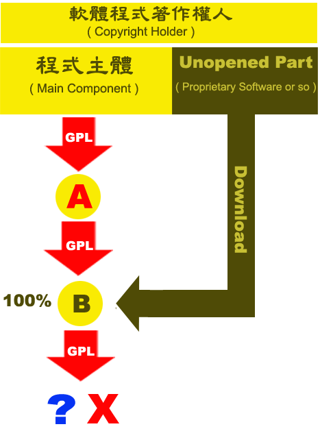
.. |cc-commons-deed| image:: i/cc-commons-deed.png 
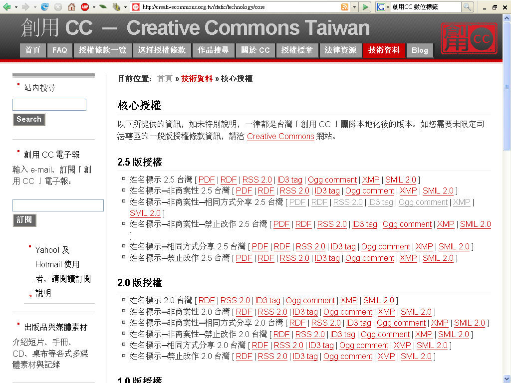

.. |wedding| image:: i/wedding.png 
.. |rms-bw| image:: i/rms-bw.png 
.. |batman-kiss| image:: i/batman-kiss.jpg 
.. |software-restraint-chart| image:: i/software-restraint-chart.png 
.. |tuzki-scratch| image:: i/tuzki-scratch.png 
.. |PetitPrince| image:: i/PetitPrince.png 
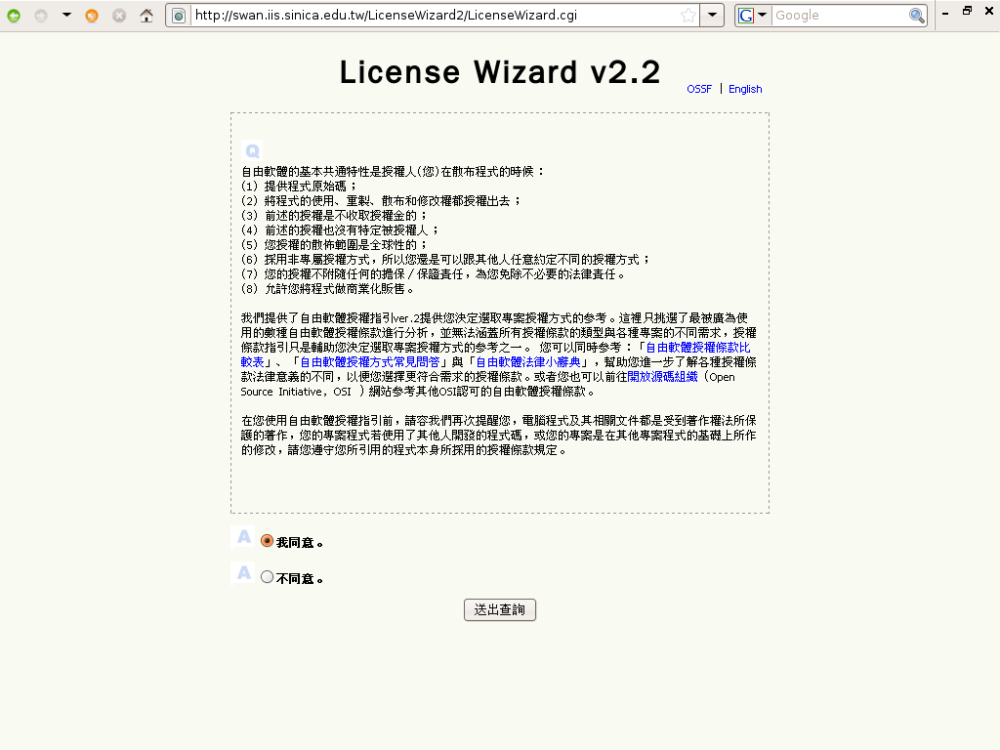
.. |nastynice| image:: i/nastynice.png 
.. |statueofliberty| image:: i/statueofliberty.png 
.. |catfire| image:: i/catfire.png 
.. |ocw3| image:: i/ocw3.png 
.. |cc-wizard| image:: i/cc-wizard.png 
.. |cc-legal-code| image:: i/cc-legal-code.png 
.. |kakaka| image:: i/kakaka.png 
.. |software-restraint-chart-mpl| image:: i/software-restraint-chart-mpl.png 
.. |wikipedia| image:: i/wikipedia.png 
.. |tuzki-books| image:: i/tuzki-books.png 
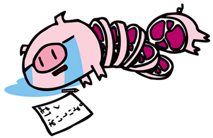
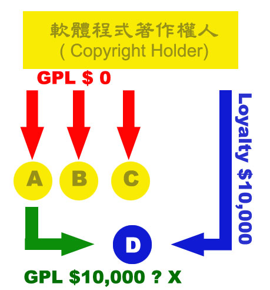
.. |tuzki-release| image:: i/tuzki-release.png 
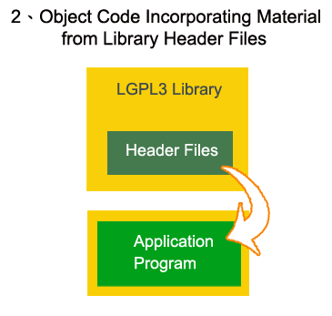
.. |lgpl3-1| image:: i/lgpl3-1.png 
.. |lgpl3-4| image:: i/lgpl3-4.png 
.. |cc-by-nc-sa| image:: i/cc-by-nc-sa.png 
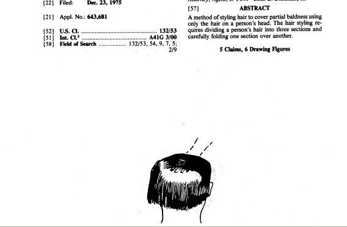
.. |baldness02| image:: i/baldness02.png 
.. |tuzki-unlawful| image:: i/tuzki-unlawful.png 
.. |hopeless| image:: i/hopeless.png 

.. |xixixi| image:: i/xixixi.png 
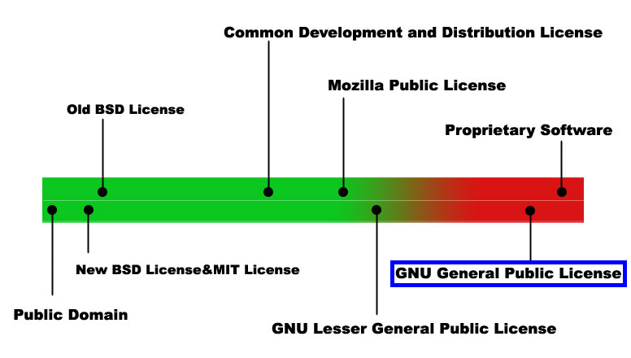
.. |love| image:: i/love.png 
.. |wall| image:: i/wall.png 
.. |waddling01| image:: i/waddling01.png 
.. |catinboots| image:: i/catinboots.png 
.. |tuzki-crying| image:: i/tuzki-crying.png 
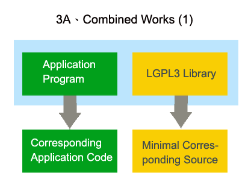

.. |car01| image:: i/car01.png 
.. |bingo| image:: i/bingo.png 
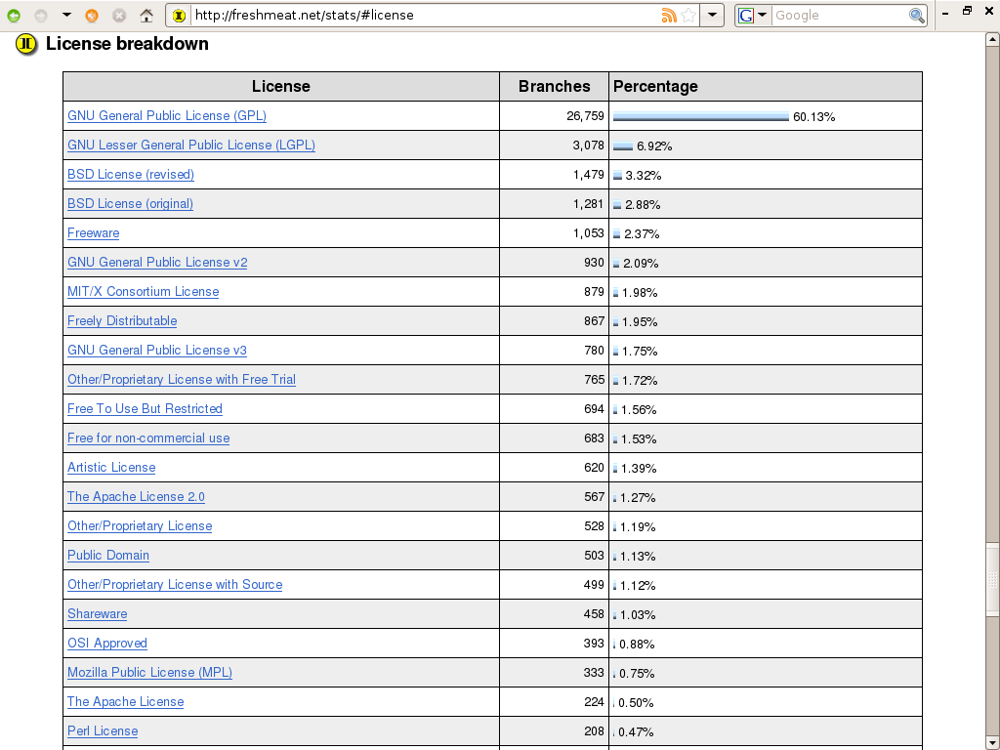
.. |software-restraint-chart-bsd| image:: i/software-restraint-chart-bsd.png 

.. |creativecommons| image:: i/creativecommons.png 
.. |engine| image:: i/engine.png 

.. |tuzki-no-risk| image:: i/tuzki-no-risk.png 
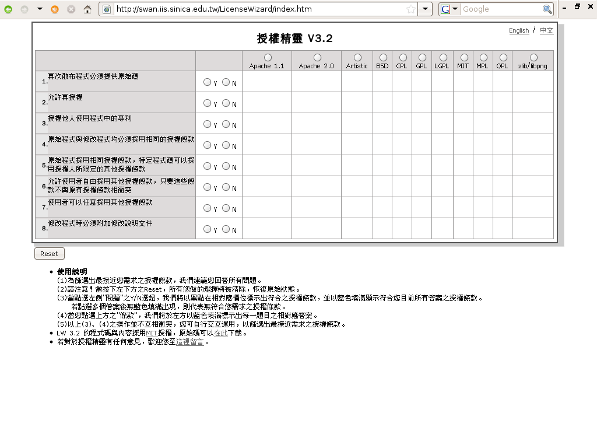
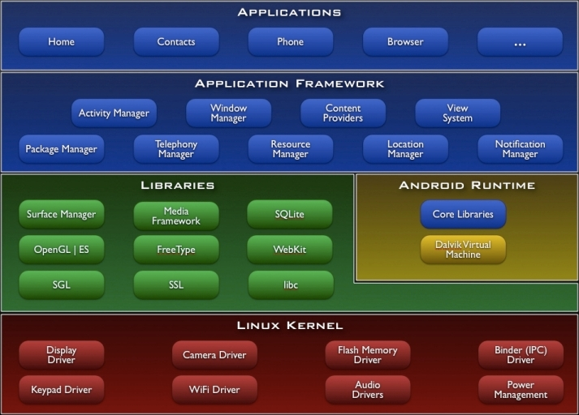
.. |Bertramliger| image:: i/Bertramliger.png 
.. |lgpl3-3b| image:: i/lgpl3-3b.png 

.. |warning| image:: i/warning.png 
.. |dual| image:: i/dual.png 
.. |deed| image:: i/deed.png 
.. |nocommercial| image:: i/nocommercial.png 

.. |nd| image:: i/nd.png 
.. |tuzki-web-steal| image:: i/tuzki-web-steal.png 
.. |google_logo_plain| image:: i/google_logo_plain.png 
.. |dance18| image:: i/dance18.png 
.. |wheel| image:: i/wheel.png 
.. |sutra| image:: i/sutra.png 
.. |red-hat| image:: i/red-hat.png 
.. |moun| image:: i/moun.jpg 
.. |tuzki-websurfing| image:: i/tuzki-websurfing.png 
.. |google-phone-os-android| image:: i/google-phone-os-android.png 
.. |3c6f0843| image:: i/3c6f0843.png 
.. |friends| image:: i/friends.png 
.. |attrib| image:: i/attrib.png 
.. |mao| image:: i/mao.png 
.. |tuzki-not-fair-use| image:: i/tuzki-not-fair-use.png 
.. |cover| image:: i/cover.png 
.. |bottle| image:: i/bottle.png 
.. |mcdonalds| image:: i/mcdonalds.jpg 

.. |gnu| image:: i/gnu.png 
   :height: 300px

.. |copyright-to-copyleft| image:: i/copyright-to-copyleft.png 
.. |copyleft| image:: i/copyleft.png 
   :height: 90px

==================================================================
FLOSS授权
==================================================================

～軟體授權法制與自由軟體授權模式介紹

:Authors: `林誠夏 <lucien@iis.sinica.edu.tw>`__
:Authors: `Zoom.Quiet <zoomquiet+floss@gmai.com>`__
:URL:    http://zoomquiet.org/res/s5/120501-ossf-freedom/

.. footer:: 

   `Zoom.Quiet`_ v12.05.1 |cc-byncsa15| 推荐用 `FireFox`_ 获得最佳游览效果

<免责/>
=========

.. container:: handout

   山寨的，非业界公认的，个人体验为基础!
   |zqeye|

.. class:: takahashi1

    参考所有同好行为总结而得
        - 一切资料来自网络互动挖掘
        - 一切想法来自日常学习工作
        - 一切体悟来自各种沟通交流
        - 一切知识来自社区分享印证
        - 一切经验来自个人失败体验
    

<brief/>
=========

.. container:: handout

    |zqeye|

.. class:: takahashi1

    - :orange:`5' 有关`
    - :silver:`10' 知识产权`
    - :silver:`10' 自由文化`
    - :silver:`10' 许可分类`
    - :silver:`10' 自由软件`
    - :silver:`10' 深入GNU`
    - :silver:`10' 协议选择`
    - :silver:`10' 现实冲突`
    - :silver:`10' 商用模式`

.. container:: notes

   - :orange:`5' 有关`
   - :gray:`5' 有关`
   - :silver:`5' 有关`

lucien@iis.sinica.edu.tw
==========================================

.. container:: handout

    02-27883799 ext.1474 |zqeye|

.. class:: takahashi8
    
    `林誠夏 <http://www.openfoundry.org/tw/activities/details/4>`_

.. container:: notes

   - 

自由軟體鑄造場
==========================================

.. container:: handout

     |zqeye|

.. class:: takahashi
    
    `中研院．資訊所  <http://www.openfoundry.org>`_

.. container:: notes

   - 

中文名稱
==========================================

.. container:: handout

     |zqeye|

.. class:: takahashi
    
    自由軟體鑄造場

.. container:: notes

   - 

英文名稱
==========================================

.. container:: handout

    簡稱OSSF |zqeye|

.. class:: takahashi3
    
    :orange:`O` pen
    
    :orange:`S` ource
    
    :orange:`S` oftware
    
    :orange:`F` oundry
    

.. container:: notes

   - 

鑄造創意與分享創意的場域
==========================================

.. container:: handout

    中文、簡稱、鑄造場 |zqeye|

.. class:: takahashi

    .. image:: i/forgelogo.jpg
        :align: center
        :scale: 50%
        :alt: 自由軟體鑄造場-logo

.. container:: notes

   - ...
   - ..

鑄造場的三大工作要項分為
==============================================================================

.. container:: handout

    技術支援部門、營運推廣部門、法政諮詢部門 |zqeye|

.. class:: takahashi
    
- 1、技術
- 2、營運
- 3、 :orange:`法政`     

.. container:: notes

    - 

來自、法政諮詢部門
==============================================================================

.. container:: handout

    自由軟體法律授權條款分析與軟體授權策略研擬 |zqeye|

.. class:: takahashi
    
    法政組 

.. container:: notes

    - 

鑄造場法政組常態進行的工作
==============================================================================

.. container:: handout

     |zqeye|

.. class:: takahashi2
    
     - 研讀自由軟體授權條款 
     - 彙整各國自由軟體推行政策 
     - 追蹤自由軟體訴訟案例 
     - 分析自由軟體商業授權模式
     - ………………………    

.. container:: notes

    - 

法政組常用/有用連結
==============================================================================

.. container:: handout

     歡迎點閱了解 |zqeye|

.. class:: takahashi2
    
     - `法律小辭典 <http://www.openfoundry.org/Law-and-Policy/Glossary/>`_ 
     - `自由軟體授權常見問答集 <http://www.openfoundry.org/Law-and-Policy/FAQ/>`_ 
     - `自由軟體訴訟案件分析彙整 <http://www.openfoundry.org/Law-and-Policy/Case-Study/>`_ 
     - `法律政策發問討論區 <http://www.openfoundry.org/index.php?option=com_fireboard>`_ 
     - `自由軟體授權條款介紹 <http://www.openfoundry.org/Law-and-Policy/Licenses/>`_ 
     - `自由軟體授權導引精靈v3.2 <http://swan.iis.sinica.edu.tw/LicenseWizard/index.htm>`_ 

.. container:: notes

    - 

課程主軸
==============================================================================

.. container:: handout

    這是一種不同於傳統的另類軟體授權模式 |zqeye|

.. class:: takahashi
    
    自由軟體授權條款    

.. container:: notes

    - 

分下列幾個重點來講述
==============================================================================

.. container:: handout

    - 對各位日後參與自由軟體專案的各方面皆有所幫助

.. class:: takahashi
    
     - 軟體授權的 :orange:`概念`  
     - 公眾授權條款的 :orange:`分類`  
     - 公眾授權條款的 :orange:`選擇方式`  
     - 如何利用鑄造場的 :orange:`現有資源`     

.. container:: notes

    - 

特別提醒
==============================================================================

.. container:: handout

    - 簡報風格

.. class:: takahashi
    
    跳頁很快    

.. container:: notes

    - 
    - 特別提醒，簡報風格跳頁非常的快

每一節的簡報皆逾百頁
==============================================================================

.. container:: handout

    - 

.. class:: takahashi
    
    快    

.. container:: notes

    - 

部份頁面不超過三秒
==============================================================================

.. container:: handout

    - 

.. class:: takahashi
    
    很快    

.. container:: notes

    - 

是很意識流的導引模式
==============================================================================

.. container:: handout

    - 

.. class:: takahashi
    
    非常快    

.. container:: notes

    - 

當故事一樣聽
==============================================================================

.. container:: handout

    - 有問題可於課後討論

.. class:: takahashi
    
    聚精會神    

.. container:: notes

    - 
    - 請各位抱著輕鬆的心情當故事一樣聽

當故事一樣聽
==============================================================================

.. container:: handout

    - 有問題可於課後討論

.. class:: takahashi
    
    聚精會神    

.. container:: notes

    - 
    - 請各位抱著輕鬆的心情當故事一樣聽

<brief/>
=========

.. container:: handout

    |zqeye|

.. class:: takahashi1

    - :gray:`5' 有关`
    - :orange:`10' 知识产权`
    - :silver:`10' 自由文化`
    - :silver:`10' 许可分类`
    - :silver:`10' 自由软件`
    - :silver:`10' 深入GNU`
    - :silver:`10' 协议选择`
    - :silver:`10' 现实冲突`
    - :silver:`10' 商用模式`

.. container:: notes

   - :orange:`5' 有关`
   - :gray:`5' 有关`
   - :silver:`5' 有关`

智財權
==============================================================================

.. container:: handout

    - 智財權的基本概念

.. class:: takahashi2
    
    第一章、
    
    智慧財產權法的基本概念
    
    與 :orange:`自由文化`     

.. container:: notes

    -  第一節-智財權的基本概念

智慧財產權的英文原文
==============================================================================

.. container:: handout

    - 簡稱IPR

.. class:: takahashi2
    
    智慧財產權( :orange:`IPR` )
    
    - INTELLECTUAL 
    - PROPERTY 
    - RIGHTS    

.. container:: notes

    - 

它是一種
==============================================================================

.. container:: handout

    - 

.. class:: takahashi
    
    財產權    

.. container:: notes

    - 

權利人對它擁有
==============================================================================

.. container:: handout

    - 所謂財產權，就是權利人對它擁有
    - 等等權利(使用它、利用它來得到利益、賣斷或是毀壞它、禁此他人使用這個權利)

.. class:: takahashi4
    
    使用 
    
    收益處分 
    
    排他    

.. container:: notes

    - 
    - 所謂財產權，就是權利人對它擁有

簡單來說
==============================================================================

.. container:: handout

    - 財產權就是可以拿來生財的東西

.. class:: takahashi8
    
     :orange:`＄`     

.. container:: notes

    - 
    - 簡單來說、財產權就是可以拿來生財的東西

與傳統物權有很大的差別
==============================================================================

.. container:: handout

    - 「準」這個字代表不是真的，只是很像，
    - 準夫婿、準男友…，所以智財權並不是物權，它只是性質很像

.. class:: takahashi
    
     :orange:`準` 物權    

.. container:: notes

    - 
    - 但智財權與傳統物權有很大的差別，它被稱為
    

智財權沒有實體
==============================================================================

.. container:: handout

    - 不像物權一般可見可聞可以觸摸
    - 智財權沒有實體卻可為權利人帶來很多的經濟利益，所以運作的方式與傳統物權相比複雜許多

.. class:: takahashi
    
     :orange:`無实體`     

.. container:: notes

    - 
    - 最大的差別、智財權沒有實體，不像物權一般可見可聞可以觸摸

「廣義」智財權
==============================================================================

.. container:: handout

    - 以下這些法律都被歸類為「廣義」智財權體系的一環

.. class:: takahashi3
    
     :orange:`著作` 權法/  :orange:`專利` 法/  :orange:`商標` 法/營業秘密保護法/ 植物種苗法/光碟管理條例/ 積體電路電路布局保護法...

.. container:: notes

    - 
    - 以下這些法律都被歸類為「廣義」智財權體系的一環

最重要的
==============================================================================

.. container:: handout

    - 這三個主要的智慧財產權利，以下會就這三者為各位做簡明的介紹

.. class:: takahashi5
    
      :orange:`著作` 權  
      :orange:`專利` 權  
      :orange:`商標` 權    

.. container:: notes

    - 
    - 其中最重要、影響一般人生活最多的，就是
    

第一
==============================================================================

.. container:: handout

    - 是業者利用「商標」表彰自我商品來源或服務的形象的權利

.. class:: takahashi
    
    :orange:`商標` 權    
    
    
.. container:: notes

    - 
    - 其中最重要、影響一般人生活最多的，就是
    

Trade-交易
==============================================================================

.. container:: handout

    - Mark-印記

.. class:: takahashi
    
    Trade :orange:`Mark`     

.. container:: notes

    - 
    - 其中最重要、影響一般人生活最多的，就是
    

Trademark就是用
==============================================================================

.. container:: handout

    - 種種手段來表彰商品是誰做出來的

.. class:: takahashi4
    
    文字   :orange:`圖形` 記號   :orange:`顏色` 聲音  立體形狀    

.. container:: notes

    - 

e.g.
==============================================================================

.. container:: handout

    - 種種手段來表彰商品是誰做出來的

.. class:: takahashi
    
    |mcdonalds|   

.. container:: notes

    - 

單來說商標權需要
==============================================================================

.. container:: handout

    - 繳交一筆行政規費

.. class:: takahashi
    
    申請註冊    

.. container:: notes

    - 

商標權行使期間為
==============================================================================

.. container:: handout

    - 得延展

.. class:: takahashi
    
    十年    

.. container:: notes

    - 

第二、
==============================================================================

.. container:: handout

    - 

.. class:: takahashi
    
    :orange:`專利` 權    

    
.. container:: notes

    - 

所謂專利權
==============================================================================

.. container:: handout

    - 顧名思義就是特定技術經過國家認証後給予申請者的

.. class:: takahashi
    
    :orange:`專` 門營 :orange:`利` 權    

.. container:: notes

    - 
    - 其中最重要、影響一般人生活最多的，就是
    

向權責機關證明
==============================================================================

.. container:: handout

    - 只要申請者能夠向權責機關證明申請技術的
    - 在通過審核後

.. class:: takahashi4
    
    產業利用性  :orange:`＄`  :orange:`新` 穎性  :orange:`進步` 性    

.. container:: notes

    - 
    - 只要申請者能夠向權責機關證明申請技術的
    

就可以得到權責機關核准
==============================================================================

.. container:: handout

    - 不等的專門營利權行使期間

.. class:: takahashi
    
    20年 10年 12年    

.. container:: notes

    - 

所以專利的英文是
==============================================================================

.. container:: handout

    - 這個字原來就有「明顯、顯著、易於分別的意思」
    - 顧名思義可以申請專利的技術應該是「明顯的、顯著的、易於與其他技術分別」的東西

.. class:: takahashi
    
    PATENT

.. container:: notes

    - 

白話來說
==============================================================================

.. container:: handout

    - 專利權就是國家核可一定期間的
    - 在這段期間只有專利權人有機會利用這個專利技術來賺錢

.. class:: takahashi
    
    商用專營權    

.. container:: notes

    - 
    - 所以白話來說，專利權就是國家核可一定期間的

專利權就像商標權一樣
==============================================================================

.. container:: handout

    - 權利人需要經過對權責機關
    - 的關卡才能得到這個權利，並繳交逐年的行政規費

.. class:: takahashi
    
    申請註冊    

.. container:: notes

    - 
    - 專利權就像商標權一樣，權利人需要經過對權責機關

專利權行使期
==============================================================================

.. container:: handout

    - 因技術能力及新穎性深淺的不同而分為

.. class:: takahashi
    
    20年 10年 12年    

.. container:: notes

    - 
    - 專利權的行使期間也因技術能力及新穎性深淺的不同而分為

最後一個:
==============================================================================

.. container:: handout

    - 影響一般人生活的層面最廣的是

.. class:: takahashi
    
   :orange:`著作` 權      

.. container:: notes

    - 
    - 專利權的行使期間也因技術能力及新穎性深淺的不同而分為

!
==============================================================================

.. container:: handout

    - the right to copy

.. class:: takahashi
    
    COPY :orange:`RIGHT`     

.. container:: notes

    - 

在早期活字印刷的那個年代
==============================================================================

.. container:: handout

    - 狹義的製版權
    - the right to copy something，但後來著作權的觀念在近代被大為擴張

.. class:: takahashi
    
    製版權    

.. container:: notes

    - 

現在
==============================================================================

.. container:: handout

    - 一般提到 `王卯卯的BLOG <http://blog.sina.com.cn/m/wangmomo>`_ 
    - 的時候、它指的是範圍很大的東西。
    - 以下簡單用二個概念來解釋著作權
    - 動畫原作者王卯卯著作權宣示：使用於個人用途或論壇,但請勿用於商業用途

.. class:: takahashi
    
    著作 |tuzki-books| 權    

.. container:: notes

    - 
    - 現在一般提到 `王卯卯的BLOG <http://blog.sina.com.cn/m/wangmomo>`_ 

第一個概念、著作權指的是
==============================================================================

.. container:: handout

    - 的無體財產權

.. class:: takahashi
    
    人類 :orange:`精神創作`     

.. container:: notes

    - 

人類精神創作
==============================================================================

.. container:: handout

    - 類似的人類精神創作，都是著作權法所要保護的標的

.. class:: takahashi
    
    文學 科學藝術  :orange:`其他`     

.. container:: notes

    - 
    - 舉凡文學、科學、藝術及其他類似的人類精神創作，都是著作權法所要保護的標的

只要這個作品具有
==============================================================================

.. container:: handout

    - 寫出來的作品「與眾不同」

.. class:: takahashi
    
    1、 :orange:`原創性`     

.. container:: notes

    - 

及
==============================================================================

.. container:: handout

    - 作品的創作過程是由著作人獨立撰寫並未抄襲

.. class:: takahashi
    
    2、 :orange:`獨立性`     

.. container:: notes

    - 

受到著作權法的保護
==============================================================================

.. container:: handout

    - 包括下列這些分類
    - 都是著作權法列舉保護的範圍

.. class:: takahashi3
    
    語文 音樂 戲劇 舞蹈美術 攝影 圖形 視聽錄音 建築  :orange:`電腦程式`  :orange:`其他` 類型的著作    

.. container:: notes

    - 
    - 那著作就可以受到著作權法的保護，包括下列這些分類

著作權的牽涉範圍非常的廣
==============================================================================

.. container:: handout

    - 著作權法的保護客體實在非常的多

.. class:: takahashi8
    
     :orange:`廣`     

.. container:: notes

    - 
    - 從這裡可以看得出來，著作權的牽涉範圍非常的廣

著作權內設的主义
==============================================================================

.. container:: handout

    - 這也是著作權與之前談到的商標及專利之間最大的不同。

.. class:: takahashi4
    
    創作保護主義    

.. container:: notes

    - 
    - 著作權的第二個重要概念就是它內設的

自動的保護
==============================================================================

.. container:: handout

    - 所謂的創作保護主義就是
    - 著作權人不需要向任何機構聲明他的著作權利，也不需要向權責機構註冊登記後才能夠獲得這個著作權。

.. class:: takahashi
    
    自動保障．毋須登記    

.. container:: notes

    - 
    - 所謂的創作保護主義就是，著作一經創作完成即獲得法律自動的保護，

當你完成一個精神創作後
==============================================================================

.. container:: handout

    - 這個作品就自動享有法律完全的著作權保護

.. class:: takahashi
    
    完成著作→自動享有    

.. container:: notes

    - 

嗯嗯嗯
==============================================================================

.. container:: handout

    - 這個權利的保護，你不需要向任何人主張，也不用特別標示出來

.. class:: takahashi
    
    不待主張．毋須標識    

.. container:: notes

    - 
    - 這個權利的保護，你不需要向任何人主張，也不用特別標示出來。

例如你的個人
==============================================================================

.. container:: handout

    - 寫好了不給別人看，但只要內容是個人獨立的精神創作，它一樣受到著作權法的保護

.. class:: takahashi7
    
    日記    

.. container:: notes

    - 

「創作保護主義」
==============================================================================

.. container:: handout

    - 以符號來表現的話，就是一般日常生活常常看到的這個大C加一圈
    - 這個符號表示著作的權利人保有其所有著作權利，任何人沒有問過他的意思皆不得擅自利用他的作品

.. class:: takahashi
    
     |copyright|     

.. container:: notes

    - 
    - 以符號來表現的話，「創作保護主義」就是一般日常生活常常看到的這個大C加一圈

核心概念
==============================================================================

.. container:: handout

    - 這二個概念，
    - 形成了近代著作權的核心概念

.. class:: takahashi3
    
    一、人類 :orange:`精神創作` 
    
    二、 :orange:`創作保護` 主義    

.. container:: notes

    - 
    - 一是只要是人類精神創作都保護、
    - 二是作品只要一經創作即受到保護，
    - 

問題是
==============================================================================

.. container:: handout

    - 上面提到的這三個主要的智慧財產權利

.. class:: takahashi
    
    商標 :orange:`+` 專利 :orange:`+` 著作    

.. container:: notes

    - 
    - 問題是、上面提到的這三個主要的智慧財產權利
    

其初始設立的立意雖佳
==============================================================================

.. container:: handout

    - 大抵是獎勵這些商號、創意、及文學藝術發明人的智慧心血結晶

.. class:: takahashi
    
    立意雖佳    

.. container:: notes

    - 

~資訊時代
==============================================================================

.. container:: handout

    - 法律規定卻在很多地方和一般人的現實生活產生若干脫節

.. class:: takahashi7
    
    脫節!

.. container:: notes

    - 
    - 但到了現在這個日新月異的資訊時代

首先來回顧一下
==============================================================================

.. container:: handout

    - 業者利用「商標」表彰自我商品來源或服務的形象的權利

.. class:: takahashi
    
    一、 :orange:`商標` 權    

.. container:: notes

    - 

這是一種代表「商譽」的印記
==============================================================================

.. container:: handout

    - 它的立意是非常好的

.. class:: takahashi
    
    Trade :orange:`Mark`     

.. container:: notes

    - 

當代商標的劣質競爭
==============================================================================

.. container:: handout

    - 卻常常讓人有:先佔先贏的恐懼感

.. class:: takahashi
    
    杯弓蛇影    

.. container:: notes

    - 
    - 但是當代商標的劣質競爭，卻常常讓人有

城邦文化
==============================================================================

.. container:: handout

    -  像是城邦文化事業股份有限公司的
    - 事件，就引發了很大的討論和爭議

.. class:: takahashi
    
    囧rz    

.. container:: notes

    - 
    - 像是城邦文化事業股份有限公司的

簡單來說城邦公司把
==============================================================================

.. container:: handout

    - 這些多人發明網友慣用的網路用語登記成其旗下產品的商標

.. class:: takahashi4
    
    - 好人卡 
    - :orange:`囧` rz
    - 去死去死團    

.. container:: notes

    - 

好人卡
==============================================================================

.. container:: handout

    - 

.. class:: takahashi
    
     |goodguy|     

.. container:: notes

    - 

網路慣用語
==============================================================================

.. container:: handout
    
    - 而這些網路慣用語其實都是網路上的多人共工，並非城邦所發明或是獨有的用語 `王卯卯的BLOG <http://blog.sina.com.cn/m/wangmomo>`_ 
    - 所以後續發展引發了很多網友的批評及反感
    - 原作者王卯卯著作權宣示：使用於個人用途或論壇,但請勿用於商業用途

.. class:: takahashi
    
     |talktalk|     

.. container:: notes

    - 
    - 

茶產地的地區名稱
==============================================================================

.. container:: handout

    - 另外、台灣的這些著名茶產地的地區名稱，都已經被大陸的茶商註冊成當地的商標
    - 如果將來台灣茶真的用這些名字賣到大陸，都觸犯了當地的商標法，除了訴訟之外只能認賠花大錢把當地已經註冊了的商標再「頂回來」。

.. class:: takahashi4
    
    溪頭、杉林溪、 :orange:`阿里山` 、玉山    

.. container:: notes

    - 
    - 另外、台灣的這些著名茶產地的地區名稱，都已經被大陸的茶商註冊成當地的商標

如果是主管單位把關不嚴的話
==============================================================================

.. container:: handout

    - 從這兩個例子，多少已經看出來商標權這個制度如果是主管單位把關不嚴的話
    - 也是有很多難以解決、不盡合理的弊病。

.. class:: takahashi
    
    合理嗎?    

.. container:: notes

    - 
    - 從這兩個例子，多少已經看出來商標權這個制度如果是主管單位把關不嚴的話，

接著檢視一下
==============================================================================

.. container:: handout

    - 的問題，這個國家許可的一定期間專門營利權

.. class:: takahashi
    
    二、 :orange:`專利` 權    

.. container:: notes

    - 

基於:
==============================================================================

.. container:: handout

    - 其實專利權的法理意義奠基於交換制度，任何提交專利申請的技術，它的技術內容都是要公開共享的，
    - 國家只是保障專利權人一定期間的專門營利權，這段期間經過後，這個技術就歸全民所共享，每個人都可以拿來實作或是營利。

.. class:: takahashi
    
    交換制度    

.. container:: notes

    - 
    - 

公開->保護
==============================================================================

.. container:: handout

    - 技術發明人要公開它的技術內容才能申請到國家專利權的保護

.. class:: takahashi
    
    技術公開 :orange:`→` 專門營利權    

.. container:: notes

    - 
    - 

動機或誘弭
==============================================================================

.. container:: handout

    - 反過來說、國家也用這個專利權的保護為動機或誘弭，來鼓勵技術發明人可以公開它的技術
    - 所以說這是一個交換制度，專利權保護的原始立意也是非常的好，但是。

.. class:: takahashi
    
    公開技術 :orange:`←` 專門營利權    

.. container:: notes

    - 
    - 

如果技術審查的能力..
==============================================================================

.. container:: handout

    - 專利審查核可的單位，在我國是智財局，如果技術審查的能力不是那麼好的話
    - 核可出來的專利，有時也是讓人哭笑不得，甚至會壓迫到一般人正常的社會生活。

.. class:: takahashi
    
    脫節    

.. container:: notes

    - 
    - 

像下面這個例子
==============================================================================

.. container:: handout

    - On-line Game其實已經被申請為專利了，那是誰申請走了?

.. class:: takahashi2
    
    - 專利類型： :orange:`發明` 
    - (20年)公告/公開號：I245660 
    - 專利名稱：用於提供 :orange:`線上遊戲` 之方法及裝置 
    - 公告/公開日期：2005/12/21     

.. container:: notes

    - 

韓國人
==============================================================================

.. container:: handout

    - 

.. class:: takahashi2
    
    - 發明人：金澤振 TAEK-JIN KIM
    - 申請人：恩西股份有限公司 NCSOFT CORP.
    - 國家： :orange:`韓國` 
    - 專利代理人： :orange:`陳長文`     

.. container:: notes

    - 

?!
==============================================================================

.. container:: handout

    - 

.. class:: takahashi
    
    合理嗎?    

.. container:: notes

    - 

嗯嗯嗯
==============================================================================

.. container:: handout

    - 的例子

.. class:: takahashi
    
     :orange:`4,022,227`     

.. container:: notes

    - 
    - 再看另一個發生在美國的例子，美國專利證號

專利登記名稱是
==============================================================================

.. container:: handout

    - 消除部份禿頭區域的技術方法

.. class:: takahashi4
    
    Method of concealing partial baldness     

.. container:: notes

    - 

其實就是俗稱的
==============================================================================

.. container:: handout

    - 下面這個連結可以直接點到美國專利商標局的檢索網站，
    - 有興趣的朋友可以輸入4022227的證號自行搜索看它的內容

.. class:: takahashi
    
    `條碼頭 <http://www.uspto.gov/patft/index.html>`_   

.. container:: notes

    - 

條碼頭
==============================================================================

.. container:: handout

    - 下面把專利公告的兩張圖附出來

.. class:: takahashi
    
     |baldness01|     

.. container:: notes

    - 
    - 

理髮師在美國
==============================================================================

.. container:: handout

    - 所以理髮師在美國幫人家理條碼頭，其實得額外支付一筆專利授權金給這個條碼頭的專利權人

.. class:: takahashi
    
     |baldness02|     

.. container:: notes

    - 
    - 

你覺得這一切真的那麼合理嗎?
==============================================================================

.. container:: handout

    - 

.. class:: takahashi
    
    合理嗎?    

.. container:: notes

    - 

最後
==============================================================================

.. container:: handout

    - 講到、影響一般人生活的層面最廣的

.. class:: takahashi
    
    三、 :orange:`著作` 權    

.. container:: notes

    - 
    - 最後講到、影響一般人生活的層面最廣的

核心概念
==============================================================================

.. container:: handout

    - 作品一經完成即產生法律的自動保護，著作權人毋須登記、也不用對任何人聲明這個權利。

.. class:: takahashi3
    
    - 一、人類 :orange:`精神創作` 
    - 二、 :orange:`創作保護` 主義    

.. container:: notes

    - 
    - 前面提到，近代著作權的核心概念第一就是它是人類精神創作的保護，第二是它依循創作保護主義

優點
==============================================================================

.. container:: handout

    - 創作保護主義的優點在於，法律自動保障創作者的創意表現。

.. class:: takahashi
    
    優點 :orange:`→` 自動保障    

.. container:: notes

    - 
    - 創作保護主義的優點在於，法律自動保障創作者的創意表現。

拘束僵化
==============================================================================

.. container:: handout

    - 有時太過拘束僵化
    - 在創作保護主義的預設下，對他人作品的任何使用方式一律得問過當事人意見，
    - 但有時候使用者根本就很難連絡到原作者。

.. class:: takahashi
    
    缺點 :orange:`→` 拘束僵化    

.. container:: notes

    - 
    - 但是、它也帶來了若干的不便利，就是有時太過拘束僵化，

最嚴重的
==============================================================================

.. container:: handout

    - 最嚴重的、創作保護主義的制度拖久確實會人類創意的互相流通
    - `王卯卯的BLOG <http://blog.sina.com.cn/m/wangmomo>`_
    - 原作者王卯卯著作權宣示：使用於個人用途或論壇,但請勿用於商業用途

.. class:: takahashi
    
    阻礙 |tuzki-not-fair-use|     

.. container:: notes

    - 
    - 

「創作保護主義」
==============================================================================

.. container:: handout

    - 阻礙創意流通的第一點原因是，
    - 著作權的保障與專利及商標不同，
    - 著作權利人並不需要向任何機構登記他的權利內容，也可以說著作權利的核可幾近

.. class:: takahashi
    
    無人把關    

.. container:: notes

    - 
    -  

行使保護期間很長
==============================================================================

.. container:: handout

    - 而「創作保護主義」阻礙創意流通的第二點原因是、現行法律對於著作權利的行使保護期間很長

.. class:: takahashi
    
     :orange:`很長`     

.. container:: notes

    - 
    - 

!
==============================================================================

.. container:: handout

    - 

.. class:: takahashi
    
     :orange:`非常長`     

.. container:: notes

    - 

!!
==============================================================================

.. container:: handout

    - 

.. class:: takahashi
    
     :orange:`愈來愈長`     

.. container:: notes

    - 

早的著作權保護法律
==============================================================================

.. container:: handout

    - 

.. class:: takahashi
    
    1710    

.. container:: notes

    - 
    - 中外歷史上最早的著作權保護法律是西元1710年英國的安妮女王法

當時著作權的有效保護期間是
==============================================================================

.. container:: handout

    - 

.. class:: takahashi
    
     :orange:`14` 年    

.. container:: notes

    - 

西元1790年時、變成兩倍
==============================================================================

.. container:: handout

    - 

.. class:: takahashi
    
     :orange:`28` 年    

.. container:: notes

    - 

西元1831年時、變成
==============================================================================

.. container:: handout

    - 

.. class:: takahashi
    
     :orange:`42` 年    

.. container:: notes

    - 

西元1909年時、變成
==============================================================================

.. container:: handout

    - 

.. class:: takahashi
    
     :orange:`56` 年    

.. container:: notes

    - 

?!
==============================================================================

.. container:: handout

    - 

.. class:: takahashi
    
    THEN?    

.. container:: notes

    - 

西元1962年
==============================================================================

.. container:: handout

    - 

.. class:: takahashi
    
     :orange:`59` 年    

.. container:: notes

    - 

西元1965年
==============================================================================

.. container:: handout

    - 

.. class:: takahashi
    
     :orange:`61` 年    

.. container:: notes

    - 

西元1967年
==============================================================================

.. container:: handout

    - 

.. class:: takahashi
    
     :orange:`63` 年    

.. container:: notes

    - 

西元1968年
==============================================================================

.. container:: handout

    - 

.. class:: takahashi
    
     :orange:`64` 年    

.. container:: notes

    - 

西元1969年
==============================================================================

.. container:: handout

    - 

.. class:: takahashi
    
     :orange:`65` 年    

.. container:: notes

    - 

西元1970年
==============================================================================

.. container:: handout

    - 

.. class:: takahashi
    
     :orange:`66` 年    

.. container:: notes

    - 

西元1971年
==============================================================================

.. container:: handout

    - 

.. class:: takahashi
    
     :orange:`67` 年    

.. container:: notes

    - 

西元1972年
==============================================================================

.. container:: handout

    - 

.. class:: takahashi
    
     :orange:`68` 年    

.. container:: notes

    - 

西元1974年
==============================================================================

.. container:: handout

    - 

.. class:: takahashi
    
     :orange:`70` 年    

.. container:: notes

    - 

西元1976年
==============================================================================

.. container:: handout

    - 

.. class:: takahashi
    
     :orange:`75` 年    

.. container:: notes

    - 

西元1998年
==============================================================================

.. container:: handout

    - 這樣一直增加下去到底有完沒完呢?

.. class:: takahashi
    
     :orange:`95` 年    

.. container:: notes

    - 

幾乎看不到盡頭在哪裡
==============================================================================

.. container:: handout

    - 近年來著作權的行使保護期間逐年不斷的被增加
    - 而且幾乎看不到盡頭在哪裡

.. class:: takahashi5
    
    逐年增加
    
    幾無止境    

.. container:: notes

    - 
    - 近年來著作權的行使保護期間逐年不斷的被增加，而且幾乎看不到盡頭在哪裡。
    
    
    

著作權法保護
==============================================================================

.. container:: handout

    -  那麼、我們知道著作權法保護的東西很多、保障的期間又那麼長

.. class:: takahashi
    
    很多. 很長    

.. container:: notes

    - 
    -

新月異的網路資訊時代
==============================================================================

.. container:: handout

    - 到了今日這個日新月異的網路資訊時代，難免會碰到訂立之初始料未及的

.. class:: takahashi5
    
    日新月異 vs 傳統閉鎖    

.. container:: notes

    - 
    - 

質疑與挑戰
==============================================================================

.. container:: handout

    - 援引我國著作權法第52條及65條主張為學術推廣而合理使用
    - 此圖片取用於網際網路

.. class:: takahashi
    
     |catfire|     

.. container:: notes

    - 
    - 質疑與挑戰

質疑與挑戰
==============================================================================

.. container:: handout

    - 所謂的質疑與挑戰就像這張圖片
    - 此圖片取用於網際網路
    - 援引我國著作權法第52條及65條主張為學術推廣而合理使用

.. class:: takahashi
    
     |piggy|     

.. container:: notes

    - 
    -

這隻豬說的是日文
==============================================================================

.. container:: handout

    - `王卯卯的BLOG <http://blog.sina.com.cn/m/wangmomo>`_ 
    - 動畫原作者王卯卯著作權宣示：使用於個人用途或論壇,但請勿用於商業用途

.. class:: takahashi
    
    ぼく.おいしよ!( |tuzki-crying| …)    

.. container:: notes

    - 
    -  

中譯就是
==============================================================================

.. container:: handout

    - `王卯卯的BLOG <http://blog.sina.com.cn/m/wangmomo>`_ 
    - 動畫原作者王卯卯著作權宣示：使用於個人用途或論壇,但請勿用於商業用途

.. class:: takahashi
    
    我、很好吃喔！( |tuzki-crying| …)    

.. container:: notes

    - 
    - 

共同面對的困境和心聲
==============================================================================

.. container:: handout

    - 這是當代許多的商業化媒體及出版公司，所共同面對的困境和心聲
    - 此圖片取用於網際網路
    - ぼく.おいしよ
    - 援引我國著作權法第52條及65條主張為學術推廣而合理使用

.. class:: takahashi
    
     |piggy|     

.. container:: notes

    - 
    - 

因為
==============================================================================

.. container:: handout

    - 唱片公司發行唱片，圖書出版業者出版小說，這些商品都要經過商業包裝及花錢宣傳

.. class:: takahashi
    
    花錢宣傳.包裝廣告    

.. container:: notes

    - 
    - 

但卻是
==============================================================================

.. container:: handout

    - 常常落得...的下場
    - 動畫原作者王卯卯著作權宣示：使用於個人用途或論壇,但請勿用於商業用途

.. class:: takahashi
    
    為人作 :orange:`嫁`  |tuzki-crying|     

.. container:: notes

    - 
    -  `王卯卯的BLOG <http://blog.sina.com.cn/m/wangmomo>`_ 

因為現在...
==============================================================================

.. container:: handout

    - 盜版活動非常猖獗!
    - 動畫原作者王卯卯著作權宣示：使用於個人用途或論壇,但請勿用於商業用途

.. class:: takahashi
    
     :orange:`盜版` 猖獗 |tuzki-web-steal|     

.. container:: notes

    - 
    -  `王卯卯的BLOG <http://blog.sina.com.cn/m/wangmomo>`_ 

網路下載的風氣
==============================================================================

.. container:: handout

    - 並且網路下載的風氣也非常興盛，這些都狠狠地瓜分掉唱片業者的預期利潤
    - 動畫原作者王卯卯著作權宣示：使用於個人用途或論壇,但請勿用於商業用途

.. class:: takahashi
    
     :orange:`網路`  |tuzki-scratch| 下載    

.. container:: notes

    - 
    -  `王卯卯的BLOG <http://blog.sina.com.cn/m/wangmomo>`_ 

所以...
==============================================================================

.. container:: handout

    - 音樂製作、書籍出版業者就像這隻豬一樣，被宰了還是只能誇讚自己的肉好吃
    - 此圖片取用於網際網路
    - 援引我國著作權法第52條及65條主張為學術推廣而合理使用

.. class:: takahashi
    
     |piggy|     

.. container:: notes

    - 
    - 

但是為什麼?
==============================================================================

.. container:: handout

    - 為什麼法律規定與現實面會發生這麼大的齷齬與落差?

.. class:: takahashi
    
    WHY?    

.. container:: notes

    - 
    - 

因為在
==============================================================================

.. container:: handout

    - 

.. class:: takahashi
    
    資訊時代    

.. container:: notes

    - 

一切資料都是這麼的
==============================================================================

.. container:: handout

    - 智慧財產權的東西本來就不具形體，
    - 它可以輕易的被重製、散布
    - 動畫原作者王卯卯著作權宣示：使用於個人用途或論壇,但請勿用於商業用途

.. class:: takahashi
    
     :orange:`好捉`  |tuzki-scratch|     

.. container:: notes

    - 
    - `王卯卯的BLOG <http://blog.sina.com.cn/m/wangmomo>`_ 

網際網路
==============================================================================

.. container:: handout

    - 大量的資料在網際網路上被傳來傳去，只要有心幾乎可以捉取到所有想要的東西
    - 動畫原作者王卯卯著作權宣示：使用於個人用途或論壇,但請勿用於商業用途

.. class:: takahashi
    
     |tuzki-scratch|  |tuzki-scratch|  |tuzki-scratch|  |tuzki-scratch|  |tuzki-scratch| 
     
     |tuzki-scratch|  |tuzki-scratch|  |tuzki-scratch|  |tuzki-scratch|  |tuzki-scratch|  

.. container:: notes

    - 
    -  `王卯卯的BLOG <http://blog.sina.com.cn/m/wangmomo>`_ 

著作權法
==============================================================================

.. container:: handout

    - 然而前面也說過，著作權法採行

.. class:: takahashi
    
    創作保護主義    

.. container:: notes

    - 
    - 

任何作品在作者完成它時
==============================================================================

.. container:: handout

    - 創作人便自動享有完全的著作權利保護

.. class:: takahashi
    
    作品完成 :orange:`→` 自動享有    

.. container:: notes

    - 

自動給他完全的保護
==============================================================================

.. container:: handout

    -  創作者不需要特別寫個佈告聲明著作權

.. class:: takahashi
    
    不待主張. 毋須標識    

.. container:: notes

    - 
    - 創作者不需要特別寫個佈告聲明著作權，法律就自動給他完全的保護

網路下載
==============================================================================

.. container:: handout

    - 所以網路下載如果是沒有通知原作者
    - 當然很容易就違背了著作權法「創作保護主義」的預設，進而侵害到原著作權利人的權利
    - 動畫原作者王卯卯著作權宣示：使用於個人用途或論壇,但請勿用於商業用途

.. class:: takahashi
    
    不告而取
    
    → :orange:`違法`  |tuzki-unlawful|     

.. container:: notes

    - 
    - : `王卯卯的BLOG <http://blog.sina.com.cn/m/wangmomo>`_ 

網路下載
==============================================================================

.. container:: handout

    - 但是一般人網路下載的行為那麼多、那麼頻繁
    - 難道法律就不能律定一個比較合理、大家都能取得共識的方式嗎?

.. class:: takahashi5
    
    大家都是這樣做!    

.. container:: notes

    - 
    - 

近年來著作權...
==============================================================================

.. container:: handout

    - 問題是，近年來著作權保護的強度，不管是保護期間及保護範圍都一再被法律加強

.. class:: takahashi
    
    保護強度 :orange:`↑↑↑`     

.. container:: notes

    - 
    - 

現實生活
==============================================================================

.. container:: handout

    - 但是現實生活上侵犯它的難度卻日漸降低

.. class:: takahashi
    
    侵權難度 :orange:`↓↓↓`     

.. container:: notes

    - 
    - 

數位時代
==============================================================================

.. container:: handout

    - 在新的數位時代，人類的生活因為網際網路及新的通訊科技而變得愈來愈寬廣

.. class:: takahashi
    
    生活→ :orange:`變` 了    

.. container:: notes

    - 
    - 

傳統的法律制度
==============================================================================

.. container:: handout

    - 卻因為利益團體的干預等等因素而無法被改變

.. class:: takahashi
    
     法律→ :orange:`沒變`     

.. container:: notes

    - 
    - 但是傳統的法律制度，卻因為利益團體的干預等等因素而無法被改變

數位時代、人們擁有更多自由
==============================================================================

.. container:: handout

    - 

.. class:: takahashi
    
    擁有→更多 :orange:`自由`     

.. container:: notes

    - 

觸犯了更多法律
==============================================================================

.. container:: handout

    - 卻也在有意無意間觸犯了更多法律

.. class:: takahashi
    
    觸犯→更多 :orange:`法律`     

.. container:: notes

    - 
    - 

法律的內設功能
==============================================================================

.. container:: handout

    - 其實法律的內設功能之一本來應該是為社會生活排解糾紛

.. class:: takahashi
    
     :orange:`○` 排爭解紛    

.. container:: notes

    - 
    - 

現行的著作權法
==============================================================================

.. container:: handout

    - 現行的著作權法卻好像一直在製造很多法院也不知道該怎麼處理才兼顧到公平正義的問題

.. class:: takahashi
    
     :orange:`×` 製造問題    

.. container:: notes

    - 
    - 

那麼是不是該視情況修改法律
==============================================================================

.. container:: handout

    - 找到一個普遍多數人都能受益卻也不至於剝奪少數人核心價值的調和點

.. class:: takahashi
    
    修改法律?    

.. container:: notes

    - 

没门!
==============================================================================

.. container:: handout

    - 因為整個已經被國際化的智慧財產權體制，不是弱國說了就算

.. class:: takahashi
    
    NO WAY!    

.. container:: notes

    - 

没门!
==============================================================================

.. container:: handout

    - 著作權體制牽涉的國際經濟利益太大

.. class:: takahashi5
    
     :orange:`美` 帝  :orange:`歐` 王 :orange:`日本` 天皇    

.. container:: notes

    - 

美國自1980年
==============================================================================

.. container:: handout

    - 舉例來說、美國自1980年即在實體貨物進出口即已陷入嚴重的

.. class:: takahashi
    
    入超    

.. container:: notes

    - 
    - 

權利金
==============================================================================

.. container:: handout

    - 但其於1990一年單靠著作權授權的權利金

.. class:: takahashi
    
     :orange:`Ideas`  Selling    

.. container:: notes

    - 
    - 

即淨賺
==============================================================================

.. container:: handout

    - 美金、且逐年倍數式的增加

.. class:: takahashi
    
     :orange:`126` 億    

.. container:: notes

    - 

近年更是透過其
==============================================================================

.. container:: handout

    - ，利用貿易制裁的手段壓迫其他國家，讓智財權居於弱勢的開發中國家沒有辦法扭轉劣勢

.. class:: takahashi
    
    特別 :orange:`301` 條款    

.. container:: notes

    - 

像我們樣的(小國)除了
==============================================================================

.. container:: handout

    - 之外，還能有別的方法擺脫束縛力爭上游嗎?

.. class:: takahashi
    
    囧    

.. container:: notes

    - 

<brief/>
=========

.. container:: handout

    |zqeye|

.. class:: takahashi1

    - :gray:`5' 有关`
    - :gray:`10' 知识产权`
    - :orange:`10' 自由文化`
    - :silver:`10' 许可分类`
    - :silver:`10' 自由软件`
    - :silver:`10' 深入GNU`
    - :silver:`10' 协议选择`
    - :silver:`10' 现实冲突`
    - :silver:`10' 商用模式`

.. container:: notes

   - :orange:`5' 有关`
   - :gray:`5' 有关`
   - :silver:`5' 有关`

.. 第二節-Free Culture
..  第二章-自由軟體授權條款及其共通特性
..      第一節-自由軟體的分類及名詞辨異
..      第二節-自由軟體授權條款的共通特性

自由文化
==============================================================================

.. container:: handout

    - 有的、可是不是直接透過政府的公權力來解決，而是由民間發動的草根式運動
    - 透過一個俗稱自由文化的理念，把彈性活用智財權的觀念帶出來

.. class:: takahashi5
    
    :orange:`FREE CULTURE` 

.. container:: notes

    -  第二節-Free Culture

法律态度
==============================================================================

.. container:: handout

    - 自由文化的支持者認為當代財團透過操縱法律與技術壟斷禁錮了文化，並壓制了創新，
    - 這對整體人類文明的發展並非好事，自由文化和人們相關的數位權利應當在新千禧年得到更大程度的保障。

.. class:: takahashi
    
    Lawrence Lessig    

.. container:: notes

    - 

現行法律制度不滿
==============================================================================

.. container:: handout

    - 這是一種對現行法律制度不滿所帶來的

.. class:: takahashi
    
    批判思維    

.. container:: notes

    - 

為什麼
==============================================================================

.. container:: handout

    - 那為什麼法律制度對讓人生活難過或是心生不滿?
    - 在法治國家的框架下人民不是應該以守法為依歸嗎?

.. class:: takahashi
    
    不滿?    

.. container:: notes

    - 

成文法的固有问题
==============================================================================

.. container:: handout

    - 其實不盡然，現行的成文法律當然每個社會的組成份子都應該去遵守，否則會被裁罰。
    - 但是其實法律並非死板永遠不會異動的制度，讓我們看看下面幾個簡單的例子

.. class:: takahashi
    
    法律會 :orange:`變`     

.. container:: notes

    - 
    

e.g
==============================================================================

.. container:: handout

    - 過去的帝王很喜歡鼓吹君權神授的概念，誇大其統治的合理性來自於神靈神祇。

.. class:: takahashi
    
    君權神授    

.. container:: notes

    - 

合理性渲染
==============================================================================

.. container:: handout

    - 在這種概念的渲染之下，君權是合法的。

.. class:: takahashi
    
    君權合法    

.. container:: notes

    - 

嗯嗯嗯
==============================================================================

.. container:: handout

    - 可以說在二百年前反對君主統治的各種行為都是不合法的

.. class:: takahashi
    
    對抗君權 :orange:`不合法`     

.. container:: notes

    - 

現在呢?
==============================================================================

.. container:: handout

    - 但是現在呢?現在合法又有實質統治權力的君主全世界還剩下幾個?
    - 可以說其實已經廖廖可數

.. class:: takahashi
    
    寥寥可數    

.. container:: notes

    - 

全球的婦女
==============================================================================

.. container:: handout

    - 那再想想在第一次世界大戰前，全球的婦女是沒有政治參與權的

.. class:: takahashi
    
    婦女無投票權    

.. container:: notes

    - 

婦女投票權
==============================================================================

.. container:: handout

    - 可以說在當時婦女投票權是不合法的概念

.. class:: takahashi
    
    婦女投票權 :orange:`不合法`     

.. container:: notes

    - 

現在呢?
==============================================================================

.. container:: handout

    - 但是現在呢?大部份的國家都同意男女平權是憲法保障的基本原則。

.. class:: takahashi
    
    男女平權    

.. container:: notes

    - 

合法不是永远的
==============================================================================

.. container:: handout

    - 從上面的例子我們看到，現實面曾經合理的事物
    - 不代表它永遠都是合理的

.. class:: takahashi
    
    曾經對的 :orange:`不永遠對`     

.. container:: notes

    - 

環境改變後
==============================================================================

.. container:: handout

    - 曾經是不合理的事物，在環境改變後也可能變成合理的

.. class:: takahashi
    
    曾經錯的 :orange:`不永遠錯`     

.. container:: notes

    - 

國家成文法也..
==============================================================================

.. container:: handout

    - 就算是國家成文的法律，曾經被認為是合法的，也不能保証永遠合法

.. class:: takahashi
    
    曾經合法 :orange:`不永遠合法`     

.. container:: notes

    - 

曾經不合法的
==============================================================================

.. container:: handout

    - 換句話來說、曾經不合法的事物，也可能會有合理合法的一天

.. class:: takahashi
    
    曾經是不合法 :orange:`不永遠不合法`     

.. container:: notes

    - 

法律就會自动修改?
==============================================================================

.. container:: handout

    - 但是真的社會環境改變後法律就會跟著修改嗎?
    - 其實不盡然，很多時候現實環境改了，法律卻不能跟著更改。舉一個歷史公案來說，

.. class:: takahashi
    
    社會變遷 vs. 法律沿革    

.. container:: notes

    - 

伊斯蘭國家..
==============================================================================

.. container:: handout

    - 您知道伊斯蘭婦女為何出外衣著要蒙紗把全身裹的密不透風嗎？
    - 在部份伊斯蘭國家如土耳其，其衣著是非常嚴肅的事情，甚至編寫到法典裡當作成文的法律規定

.. class:: takahashi
    
    回教衣著    

.. container:: notes

    - 

其實一開始...
==============================================================================

.. container:: handout

    - 這件事其實一開始只是為了婦女的安全
    - 因為在伊斯蘭帝國四處征戰擴張領土時，用的都是年輕勇猛的戰士，死刑禁止不了，穆罕默德。

.. class:: takahashi
    
    婦女安全    

.. container:: notes

    - 

衣著的律法
==============================================================================

.. container:: handout

    - 如今伊斯蘭國家的時空背景已經不同，
    - 但衣著的律法已經因循成為一種習慣法而改不回來，最後還被國家用法典來確立。

.. class:: takahashi
    
    因循成習    

.. container:: notes

    - 

現行的智慧財產權體系亦然
==============================================================================

.. container:: handout

    - 其實大部份人的生活習慣已經和現行法律體系的預設有很多的衝突和落差

.. class:: takahashi
    
    智慧財產權體系    

.. container:: notes

    - 

國家會主動修法?
==============================================================================

.. container:: handout

    - 可是你也無法期待國家會主動修法來修正這些不合理的現象
    - 因為整個智財權體系牽涉到的既得利益真的太大

.. class:: takahashi
    
     :orange:`美` 帝  :orange:`歐` 王 :orange:`日本` 天皇    

.. container:: notes

    - 

没门!
==============================================================================

.. container:: handout

    - 所以真的沒有辦法期待表現上說自己是代表全民利益，
    - 但事實上常常是代表財團利益、大國利益的代議士主動去做修法的事

.. class:: takahashi
    
    NO WAY!    

.. container:: notes

    - 

對於現時
==============================================================================

.. container:: handout

    - 對於現時智財權體系的僵化、過時，與大國壓迫下的無可奈何
    - 當代的自由文化創意者，開始試著自力救濟。

.. class:: takahashi
    
    自力救濟    

.. container:: notes

    - 

..

私人間契約
==============================================================================

.. container:: handout

    - 他們透過私人與私人間訂立契約，事先律定大家都能接受的遊戲規則，來為這個僵化的智財權環境進行解套。

.. class:: takahashi
    
    以私濟公    

.. container:: notes

    - 

新模式!
==============================================================================

.. container:: handout

    - 這種以私人契約自力救濟公眾利益的模式，廣義上稱為「公眾授權條款」的模式
    - 所謂「公眾授權」，就是權利人透過對公眾聲明，將自己權利的利用方式，用宣告的方式傳遞給有需要的人

.. class:: takahashi
    
    公眾授權條款    

.. container:: notes

    - 

公眾的意涵
==============================================================================

.. container:: handout

    - 的意涵是「對大家」、法律用語是「對不特定多數人」

.. class:: takahashi
    
    (1) :orange:`公眾`     

.. container:: notes

    - 

授權的含义
==============================================================================

.. container:: handout

    - 是「把東西丟出去」、法律用語是「授與特定權利」

.. class:: takahashi
    
    (2) :orange:`授權`     

.. container:: notes

    - 

條款的含义
==============================================================================

.. container:: handout

    - 就是「一堆字、說了很多話」、法律用語是「約制權利義務關係的法律文件」

.. class:: takahashi
    
    (3) :orange:`條款`     

.. container:: notes

    - 

條款是一種...
==============================================================================

.. container:: handout

    - 所以公眾授權條款是一種 
    - 原作者 `輔大猴 <http://www.wretch.cc/blog/fjumonkey>`_  
    - 採用Creative Commons「姓名標示-非商業性-禁止改作台灣2.5版」授權條款

.. class:: takahashi
    
     :orange:`放話條款`  |monkeysmile|     

.. container:: notes

    - 

權利人向大家公開放話
==============================================================================

.. container:: handout

    - 原來的權利人向大家公開放話
    - `輔大猴 <http://www.wretch.cc/blog/fjumonkey>`_ 
    - 原作者輔大猴採用Creative Commons「姓名標示-非商業性-禁止改作台灣2.5版」授權條款

.. class:: takahashi
    
    放話 |monkeysmile|     

.. container:: notes

    - 

想用東西的人可以
==============================================================================

.. container:: handout

    - 

.. class:: takahashi
    
    拿去用    

.. container:: notes

    - 

但是要遵守預定的
==============================================================================

.. container:: handout

    - 

.. class:: takahashi
    
    遊戲規則    

.. container:: notes

    - 

所以正式的來講
==============================================================================

.. container:: handout

    - 

.. class:: takahashi
    
    公眾授權條款    

.. container:: notes

    - 

就是原權利人以
==============================================================================

.. container:: handout

    - 的方式

.. class:: takahashi
    
    事先律定    

.. container:: notes

    - 

編寫
==============================================================================

.. container:: handout

    - 

.. class:: takahashi
    
    編寫公告    

.. container:: notes

    - 

用來約制
==============================================================================

.. container:: handout

    - 約制授權人、被授權人之間關係

.. class:: takahashi
    
    權利義務    

.. container:: notes

    - 

的
==============================================================================

.. container:: handout

    - 

.. class:: takahashi
    
    法律文件    

.. container:: notes

    - 

只要使用者
==============================================================================

.. container:: handout

    - 權利人授權的範圍

.. class:: takahashi
    
    (1)不誤解    

.. container:: notes

    - 

以及
==============================================================================

.. container:: handout

    - 權利人授權的內容

.. class:: takahashi
    
    (2)不搞混    

.. container:: notes

    - 

各式利用..
==============================================================================

.. container:: handout

    - 在正確授權幅度裡所進行的各式利用，就都是合法的! 
    - `王卯卯的BLOG <http://blog.sina.com.cn/m/wangmomo>`_ 
    - 原作者王卯卯著作權宣示：使用於個人用途或論壇,但請勿用於商業用途

.. class:: takahashi
    
    都合法! |tuzki-no-risk|     

.. container:: notes

    - 

更快速的分享
==============================================================================

.. container:: handout

    - 透過這種放話條款，著作權利可以更快速的分享出去
    - 原作者 `王卯卯的BLOG <http://blog.sina.com.cn/m/wangmomo>`_  
    - 著作權宣示：使用於個人用途或論壇,但請勿用於商業用途

.. class:: takahashi
    
    釋放 |tuzki-release|     

.. container:: notes

    - 

安心使用
==============================================================================

.. container:: handout

    - 被授權人只要依足這些公眾授權條款規定的
    - 就可以安心使用條款授與的權利

.. class:: takahashi
    
    遊戲規則    

.. container:: notes

    - 

PUBLIC DOMAIN
==============================================================================

.. container:: handout

    - 其實所有的著作權客體都可能因為期間經過的關係成為PUBLIC DOMAIN，就是俗稱的公共財
    - 像是紅樓夢、西遊記、莎士比亞劇本這些流傳已久的著作

.. class:: takahashi
    
    (1)期間經過    

.. container:: notes

    - 

或是透過著作權利人
==============================================================================

.. container:: handout

    - 轉而進入PUBLIC DOMAIN的領域

.. class:: takahashi
    
    (2)明示拋棄    

.. container:: notes

    - 

e.g
==============================================================================

.. container:: handout

    - 像是佛書助印常常註明「版權沒有．歡迎助印」就是常見的著作權拋棄例子

.. class:: takahashi
    
     |sutra|     

.. container:: notes

    - 

公共域
==============================================================================

.. container:: handout

    - PUBLIC DOMAIN指的是無人可主張權利的公共財
    - 這表示任何人都可以不受拘束的任意取用這類著作

.. class:: takahashi
    
    PUBLIC DOMAIN    

.. container:: notes

    - 

但是太消極
==============================================================================

.. container:: handout

    - 但是這是一種消極的等待 
    - 著作權利原則上要等著作權人死後再加五十年，才會變成PUBLIC DOMAIN
    - 原作者 `王卯卯的BLOG <http://blog.sina.com.cn/m/wangmomo>`_  著作權宣示：使用於個人用途或論壇,但請勿用於商業用途

.. class:: takahashi
    
     :orange:`消極`  |tuzki-orz|     

.. container:: notes

    - 

但新時代的「創意共用」思維
==============================================================================

.. container:: handout

    - 

.. class:: takahashi
    
     :orange:`COMMONS`     

.. container:: notes

    - 

分享及共用需及時
==============================================================================

.. container:: handout

    - 強調的是權利的分享及共用需及時
    - 權利人可以盡早把自己的著作權利「有條件的」積極釋出給他人使用
    - 原作者  `王卯卯的BLOG <http://blog.sina.com.cn/m/wangmomo>`_  著作權宣示：使用於個人用途或論壇,但請勿用於商業用途

.. class:: takahashi
    
     :orange:`積極`  |tuzki-websurfing|     

.. container:: notes

    - 

应对保護期間過長
==============================================================================

.. container:: handout

    - 以救濟現時著作權保護期間過長，知識和創意為財團把持無法共享的弊病

.. class:: takahashi
    
    以濟時弊    

.. container:: notes

    - 

私人間的契約謀合
==============================================================================

.. container:: handout

    - 這類的公眾授權條款，是透過私人與私人間契約謀合的方式
    - 不待國家修法，自力救濟式的修正目前著作權法的弊病

.. class:: takahashi
    
    自力救濟    

.. container:: notes

    - 

法源..
==============================================================================

.. container:: handout

    - 這種私人與私人間透過契約謀和來樹立共通性遊戲規則的法源，在於民法裡規定的
    - 要約者與承諾者意思表示一致者、契約即為成立。

.. class:: takahashi
    
    §153 :orange:`契約自由` 主義    

.. container:: notes

    - 

只要不...
==============================================================================

.. container:: handout

    - 只要不違背法律預設的禁止行為(僅為例舉)
    - 則不論多光怪陸離的契約都可以成立

.. class:: takahashi3
    
    - §71違反 :orange:`強制或禁止` 規定
    - §72違背 :orange:`公序良俗` 
    - §73不依 :orange:`法定方式` 
    - ……    

.. container:: notes

    - 

§71
==============================================================================

.. container:: handout

    - §71違反強制或禁止之規定 
    - 第4條、死後為之，第8條、5親等血親或配偶為限
    - 原作者 `王卯卯的BLOG <http://blog.sina.com.cn/m/wangmomo>`_  著作權宣示：使用於個人用途或論壇,但請勿用於商業用途

.. class:: takahashi
    
    人體 :orange:`器官`  :orange:`移植` 條例 |tuzki-web-steal|     

.. container:: notes

    - 

§72
==============================================================================

.. container:: handout

    - §72違背公序良俗 
    - 1週做3次、一次抵債5萬元
    - 原作者 `王卯卯的BLOG <http://blog.sina.com.cn/m/wangmomo>`_ 著作權宣示：使用於個人用途或論壇,但請勿用於商業用途

.. class:: takahashi
    
     :orange:`性愛` 契約 |kisskiss|     

.. container:: notes

    - 

§73
==============================================================================

.. container:: handout

    - §73不依法定方式 
    - §166-1條：契約以負擔不動產物權之移轉、設定或變更之義務為標的者，應由公證人作成公證書
    - 原作者 `王卯卯的BLOG <http://blog.sina.com.cn/m/wangmomo>`_ 著作權宣示：使用於個人用途或論壇,但請勿用於商業用途

.. class:: takahashi
    
     :orange:`不動產` 買賣 |deed|     

.. container:: notes

    - 

§73
==============================================================================

.. container:: handout

    - §73不依法定方式  
    - 結婚，應有公開儀式及二人以上之證人
    - 原作者 `王卯卯的BLOG <http://blog.sina.com.cn/m/wangmomo>`_ 著作權宣示：使用於個人用途或論壇,但請勿用於商業用途

.. class:: takahashi
    
     :orange:`婚姻` 關係 |wedding|  |wedding|     

.. container:: notes

    - 

皆可成立
==============================================================================

.. container:: handout

    - 除此之外，不管多光怪陸離的契約內容 
    - 只要契約雙方同意皆可成立
    - 原作者 `王卯卯的BLOG <http://blog.sina.com.cn/m/wangmomo>`_  著作權宣示：使用於個人用途或論壇,但請勿用於商業用途

.. class:: takahashi
    
     :orange:``  |dance18| → |wall|     

.. container:: notes

    - 

?
==============================================================================

.. container:: handout

    - 

.. class:: takahashi
    
     :orange:`？`  |dance18| → |crash|     

.. container:: notes

    - 

!
==============================================================================

.. container:: handout

    - 

.. class:: takahashi
    
     :orange:`×`  |dance18| → |bottle|     

.. container:: notes

    - 

最早也最有影響力的就是
==============================================================================

.. container:: handout

    - 此種透過私人間契約謀合將著作權利授權出去的方式

.. class:: takahashi
    
    一、自由軟體授權條款    

.. container:: notes

    - 

原始碼的公眾授權
==============================================================================

.. container:: handout

    - 這類的公眾授權條款主要是處理軟體程式原始碼的公眾授權問題

.. class:: takahashi
    
    :orange:`OPEN SOURCE` CODES    

.. container:: notes

    - 

比較著名耳熟能詳的像是
==============================================================================

.. container:: handout

    - 等自由軟體授權條款

.. class:: takahashi4
    
    GPL, LGPL, BSD, MIT,APACHE, MPL, CPL, CDDL    

.. container:: notes

    - 

繼之而起的，有
==============================================================================

.. container:: handout

    - 

.. class:: takahashi
    
    開放內容授權條款    

.. container:: notes

    - 

處理文件、音樂、多媒體客體..
==============================================================================

.. container:: handout

    - 這類的公眾授權條款主要是處理文件、音樂、多媒體客體的公眾授權問題

.. class:: takahashi4
    
    :orange:`OPEN CONTENT` MATERIALS    

.. container:: notes

    - 

e.g
==============================================================================

.. container:: handout

    - 像是偏重文件出版規定的GFDL和多元化配對的創用CC授權條款

.. class:: takahashi4
    
    GFDL, Creative Commons    

.. container:: notes

    - 

那麼、什麼是
==============================================================================

.. container:: handout

    - 

.. class:: takahashi4
    
    :orange:`OPEN SOURCE` CODES?    

.. container:: notes

    - 

一般來說、讓軟體的使用者有
==============================================================================

.. container:: handout

    - 自由的程式碼，就是Open Source Codes

.. class:: takahashi
    
    執行/研究/改良/重製散布    

.. container:: notes

    - 

這就是一般俗稱的
==============================================================================

.. container:: handout

    - 讓使用者有這四大自由的程式，就可以說是自由軟體的程式碼

.. class:: takahashi
    
     :orange:`四大自由`     

.. container:: notes

    - 

那麼、什麼是
==============================================================================

.. container:: handout

    - 

.. class:: takahashi4
    
    :orange:`OPEN CONTENT` MATERIALS?    

.. container:: notes

    - 

嗯嗯嗯
==============================================================================

.. container:: handout

    - 簡單來說、讓文字、音樂、多媒體作品的使用者有
    - 自由的著作物，就是Open Content Materials，
    - 特別要注意一下，有許多的Open Content Material並不允許使用者直接改作，
    - 但基本上不會剝奪使用者研究學習的自由。

.. class:: takahashi
    
    閱讀 播放 重製 散布    

.. container:: notes

    - 

接下來要切入課程的主軸
==============================================================================

.. container:: handout

    - 第二章-自由軟體授權條款及其共通特性
    - 介紹自由軟體授權條款的核心觀念

.. class:: takahashi4
    
    自由軟體授權條款 
    
    :orange:`/` 共通特性篇    

.. container:: notes

    - ...

不可免俗的還是要先行簡述
==============================================================================

.. container:: handout

    - 究竟是什麼東西

.. class:: takahashi
    
     :orange:`自由軟體`     

.. container:: notes

    - 

所謂自由、文義上來說就是
==============================================================================

.. container:: handout

    - 自由軟體顧名思義就是使用上及修改上較傳統私有軟體更具自由度的程式

.. class:: takahashi
    
    不受限制不受拘束    

.. container:: notes

    - 

傳統的一般市售軟體
==============================================================================

.. container:: handout

    - 對使用者帶有許多拘束，它禁止被修改、禁止被重製、也禁止被散布

.. class:: takahashi
    
    傳統軟體    

.. container:: notes

    - 

但是
==============================================================================

.. container:: handout

    - 

.. class:: takahashi
    
    自由軟體    

.. container:: notes

    - 

它讓軟體的使用者有
==============================================================================

.. container:: handout

    - 的自由

.. class:: takahashi
    
    執行 研究 改良 再发布    

.. container:: notes

    - 

這就是一般俗稱的
==============================================================================

.. container:: handout

    - 

.. class:: takahashi
    
     :orange:`四大自由`     

.. container:: notes

    - 

RMS
==============================================================================

.. container:: handout

    - 始作俑者、最開始提倡四大自由理念的是Richard M. Stallman
    - 他是GPL各版本條款的主要撰寫人

.. class:: takahashi
    
     |rms-bw|     

.. container:: notes

    - 

自由軟體基金會的創建者
==============================================================================

.. container:: handout

    - FREE SOFTWARE FOUNDATION

.. class:: takahashi
    
     :orange:`FSF`     

.. container:: notes

    - 

軟體自由法律中心
==============================================================================

.. container:: handout

    - 也是軟體自由法律中心的主要催生成員之一
    - SOFTWARE FREEDOM LAW CENTER

.. class:: takahashi
    
     :orange:`SFLC`     

.. container:: notes

    - 

程式設計之初
==============================================================================

.. container:: handout

    - 其認為程式設計之初、程式原始碼本來就是公開共享的  
    - 原作者 Ethan (`洋蔥酷樂部 <http://blog.roodo.com/onion_club>`_ )著作權宣示：歡迎使用於個人用途或論壇,但請勿自行加工修改或用於商業用途

.. class:: takahashi
    
     :orange:`公開` 共享 |bingo|     

.. container:: notes

    - 

其實軟體程式...
==============================================================================

.. container:: handout

    - 才被納入美國的著作權保護客體
    - 台湾是在1985年跟進，在這之前、軟體程式的原始碼多是公開共享的

.. class:: takahashi
    
     :orange:`1980` 年    

.. container:: notes

    - 

成為著作權保護客體
==============================================================================

.. container:: handout

    - 軟體成為著作權保護客體之後，
    - 便可以開始收取軟體授權金，此後商業化軟體漸漸沒有人願意開放自己程式的原始碼 
    - 原作者  `彎彎 <http://www.wretch.cc/blog/cwwany>`_  著作權宣示：不得自行加工修改或用於商業用途

.. class:: takahashi
    
     :orange:`閉門` 造車 |waddling01|     

.. container:: notes

    - 

後來的程式設計
==============================================================================

.. container:: handout

    - 就像研發一部新車一樣

.. class:: takahashi
    
     |car01|     

.. container:: notes

    - 

你得要重新設計輪子
==============================================================================

.. container:: handout

    - 

.. class:: takahashi
    
     |wheel|     

.. container:: notes

    - 

重新設計引擎
==============================================================================

.. container:: handout

    - 

.. class:: takahashi
    
     |engine|     

.. container:: notes

    - 

最後、甚至重新設計整部車子
==============================================================================

.. container:: handout

    - 

.. class:: takahashi
    
     |car02|     

.. container:: notes

    - 

從全人類的立場?!
==============================================================================

.. container:: handout

    - 若是從全人類共同福祉的立場來看，這樣的現狀真的合理嗎?

.. class:: takahashi
    
    合理嗎？    

.. container:: notes

    - 

所以RMS提倡
==============================================================================

.. container:: handout

    - 所以RMS提倡的是回歸過往，將軟體程式原始碼公開共享
    - 才能透過網路社群群策群力的方式，將軟體科技研發的更臻完滿

.. class:: takahashi
    
    回歸過往 
    
    :orange:`群` 策 :orange:`群` 力    

.. container:: notes

    - 

另外要特別說明的是
==============================================================================

.. container:: handout

    - 自由軟體並不等於免費軟體

.. class:: takahashi
    
     :orange:`自由` 軟體≠ :orange:`免費` 軟體    

.. container:: notes

    -  第一節-自由軟體的分類及名詞辨異

OSSF Support Software Freedom
==============================================================================

.. container:: handout

    - 

.. class:: takahashi3
    
    Free Software
    
    → :orange:`自由` 軟體
    
    Freeware
    
    → :orange:`免費` 軟體    

.. container:: notes

    - 

as「言論自由」
==============================================================================

.. container:: handout

    - 舉一段自由軟體基金會的話來說明
    - 自由軟體提倡的重點在於軟體的自由不是價格，
    - 當別人提到Free Software的Free時，
    - 你應該先聯想到「言論自由」這個字，而不是「言論免費」。

.. class:: takahashi3
    
    Free software is a matter of  :orange:`liberty`  not price.You should think of "free" as in ":orange:`free speech` ".    

.. container:: notes

    - 

!=「言論免費」
==============================================================================

.. container:: handout

    - 當我們談到FREE SPEECH的FREE時，我們指的是「言論自由」而非「言論免費」

.. class:: takahashi
    
     :orange:`` 言論自由 :orange:`×` 言論免費    

.. container:: notes

    - 

就像這位小姐
==============================================================================

.. container:: handout

    - 

.. class:: takahashi
    
     |statueofliberty|     

.. container:: notes

    - 

自由女神
==============================================================================

.. container:: handout

    - Statue of Liberty，我們會叫她「自由女神」，而不是「免費女神」

.. class:: takahashi
    
     :orange:`` 自由女神 :orange:`×` 免費女神    

.. container:: notes

    - 

Free Software
==============================================================================

.. container:: handout

    - 所以請務必記得，Free Software指的是自由軟體，而不是免費軟體

.. class:: takahashi
    
     :orange:`` 自由軟體 :orange:`×` 免費軟體    

.. container:: notes

    - 

因為理念、觀點不同
==============================================================================

.. container:: handout

    - 但是自由軟體因為理念、觀點不同，它也擁有許多別名

.. class:: takahashi
    
    別名    

.. container:: notes

    - 

翻成自由軟體
==============================================================================

.. container:: handout

    - 一般提到FREE SOFTWARE，會把它翻成自由軟體

.. class:: takahashi4
    
    FREE SOFTWARE
    
    → :orange:`自由` 軟體    

.. container:: notes

    - 

OSS
==============================================================================

.. container:: handout

    - 談到OPEN SOURCE SOFTWARE時，會翻成「開發源碼軟體」或是「開放程式原始碼軟體」

.. class:: takahashi2
    
    OPEN SOURCE SOFTWARE
    
    OSS→開放 :orange:`源碼` 軟體
    
    OPEN SOURCE SOFTWARE
    
    OSS→開放程式 :orange:`原始碼` 軟體    

.. container:: notes

    - 

認為Free常給人免費的誤解
==============================================================================

.. container:: handout

    - 這是因為有些自由軟體的推行者，認為Free常給人免費的誤解
    - 所以轉而用Open Source這個最大特色來形容這類軟體

.. class:: takahashi5
    
    BRUCE PERENS    

.. container:: notes

    - 

「開放原始碼」
==============================================================================

.. container:: handout

    - 他們認為「開放原始碼」是一種對軟體程式開發更有利的

.. class:: takahashi
    
     :orange:`METHOD` OLOGY    

.. container:: notes

    - 

可以拿來營利
==============================================================================

.. container:: handout

    - 這派的支持者認為OPEN、可以讓程式寫的更好，也可以拿來營利，所以刻意減淡了Free這個字的理念意義
    - 而將此類軟體稱為Open Source Software,就是前述的開源軟體、開放原始碼軟體

.. class:: takahashi
    
    方法論    

.. container:: notes

    - 

FOSS
==============================================================================

.. container:: handout

    - 後來有人把Free和Open做結合，變成FOSS這個複合字

.. class:: takahashi3
    
    - :orange:`F` REE/
    - :orange:`O` PEN 
    - :orange:`S` OURCE 
    - :orange:`S` OFTWARE  
    

.. container:: notes

    - 

FLOSS
==============================================================================

.. container:: handout

    - 歐洲那邊的推動團體，喜歡在中間再加上LIBRE這個代表自由的法文字

.. class:: takahashi
    
     :orange:`LIBRE`     

.. container:: notes

    - 

FLOSS
==============================================================================

.. container:: handout

    - 所以FOSS中間又屬加一個L，唸成FLOSS

.. class:: takahashi4
    
    FREE/ :orange:`LIBRE` /OPEN SOURCE SOFTWARE

.. container:: notes

    - 

口語上
==============================================================================

.. container:: handout

    - 我個人口語上還是偏好直接稱這類軟體為
    - 因為中文裡並沒有Free讓人產生誤解為免費的困擾

.. class:: takahashi
    
    自由軟體    

.. container:: notes

    - 

撰寫學術文章
==============================================================================

.. container:: handout

    - 但在撰寫學術文章時，會比較謹慎把它翻成
    - 免得徒生爭議和批評

.. class:: takahashi3
    
    自由 :orange:`/` 開源軟體
    
    自由 :orange:`/` 開放原始碼軟體    

.. container:: notes

    - 

其實FREE這個字
==============================================================================

.. container:: handout

    - 其實FREE這個字強調「軟體自由」的理念，是一種哲學思考

.. class:: takahashi
    
     :orange:`FREE` 
     
     →哲學思考    

.. container:: notes

    - 

開放原始碼!
==============================================================================

.. container:: handout

    - 而開放原始碼OPEN SOURCE這個字，則是對這類軟體的最大特色進行描述

.. class:: takahashi4
    
    OPEN SOURCE
    
    → :orange:`特點` 描述    

.. container:: notes

    - 

就像
==============================================================================

.. container:: handout

    - 每個人摸到的地方不一樣

.. class:: takahashi
    
    盲人摸 :orange:`象`     

.. container:: notes

    - 

廣義解釋
==============================================================================

.. container:: handout

    - 廣義解釋，不管是FREE SOFTWARE, OPEN SOURCE SOFTWARE, FOSS, FLOSS
    - 都可能被中譯為「自由軟體」

.. class:: takahashi1
    
    Free Software〈自由軟體〉
    
    Open Source Software,  
    
    :orange:`OSS` 〈開放源碼軟體/開放原始碼軟體〉
    
    Free/Open Source Software,  
    
    :orange:`FOSS` 
    
    Free/ :orange:`Libre` /Open Source Software,  
    
    :orange:`FLOSS`     

.. container:: notes

    - 

相同的授權特性
==============================================================================

.. container:: handout

    - 將自由軟體及開放源碼軟體混為一談，除了研究、利用上的兼容並蓄外
    - 有時候也是因為它們或多或少具有相同的授權特性

.. class:: takahashi
    
    共通特性    

.. container:: notes

    -  第二節-自由軟體授權條款的共通特性

遊戲規則
==============================================================================

.. container:: handout

    - 之前提到自由軟體授權條款，
    - 其實是一種:原權利人把東西丟出去給大家使用，
    - 但同時透過事先放話，要求利用軟體的人遵守事先劃定的遊戲規則
    - 原作者 `輔大猴 <http://www.wretch.cc/blog/fjumonkey>`_ 採用:
        
        - Creative Commons「姓名標示-非商業性-禁止改作台灣2.5版」授權條款

.. class:: takahashi
    
     :orange:`放話` 條款 |monkeysmile|     

.. container:: notes

    - 

會放六句話
==============================================================================

.. container:: handout

    - 而所謂的「自由軟體」或「開放原始碼軟體」，通常會放六句話
    - 指通常狀態、非放諸四海而皆準

.. class:: takahashi
    
     :orange:`放` 六句 :orange:`話`  |monkeysmile|     

.. container:: notes

    - 

...
==============================================================================

.. container:: handout

    - 

.. class:: takahashi2
    
    - 一、開放程式 :orange:`原始碼` 
    - 二、 :orange:`不特定` 授權 :orange:`對象` 
    - 三、 :orange:`不限制` 使用 :orange:`地域` 
    - 四、不收取 :orange:`授權金` 
    - 五、不附隨 :orange:`擔保` 
    - 六、釋放 :orange:`四大自由` 予後手    

.. container:: notes

    - 

第一、
==============================================================================

.. container:: handout

    - 這是自由軟體最基本的要求、若是軟體不開放原始碼，則後手幾無研究使用程式的自由，那自然不能稱為自由軟體

.. class:: takahashi
    
    一、開放程式 :orange:`原始碼`     

.. container:: notes

    - 

e.g
==============================================================================

.. container:: handout

    - 舉例來說、像這樣具邏輯性的算式或是程式語言
    - 就是程式原始碼

.. class:: takahashi3
    
    ( :orange:`1` + :orange:`1` ) - :orange:`3` - :orange:`5` = :orange:`1`     

.. container:: notes

    - 

对人...
==============================================================================

.. container:: handout

    - 可解讀的電腦程式碼、可理解的程式語言

.. class:: takahashi
    
     :orange:`人類`     

.. container:: notes

    - 

「源碼」
==============================================================================

.. container:: handout

    - 原始碼，英文是SOURCE CODE，有人中譯直接稱為「源碼」

.. class:: takahashi4
    
    原始碼
    → :orange:`SOURCE CODE`

.. container:: notes

    - 

就是程式
==============================================================================

.. container:: handout

    - 

.. class:: takahashi
    
     :orange:`原始碼`     

.. container:: notes

    - 

相對於此、這個
==============================================================================

.. container:: handout

    - 

.. class:: takahashi

::

    010101010101011101010101
    010101010101010101010101
    010101010101110101010101
    010101010101011101010101
    010101110101010101010101
    010101000101010101010101
    010101010101011101010101

.. container:: notes

    - 

或是這個
==============================================================================

.. container:: handout

    - 人看不懂、也很難透過邏輯推衍出運行法則的

.. class:: tiny

::

    0002ffe0  d1 b3 d0 07 5a ca fe fe  1b 42 6b 5a 56 93 25 7a  |....Z....BkZV.%z|
    00069990  8f 5a 29 6a b7 f0 e6 0e  71 9f 30 05 ca fe 59 99  |.Z)j....q.0...Y.|
    0006e510  69 fa 85 71 9a ca fe 59  cc f1 af bd ab 75 04 b3  |i..q...Y.....u..|
    000a4460  6f 0d ca fe 57 ea c6 d4  c0 f9 00 a5 f4 27 0f 89  |o...W........'..|
    000dc920  ba 34 ca fe 29 99 5d 02  a7 f4 24 20 64 d4 06 05  |.4..).]...$ d...|
    000dca20  fa 04 b3 2d ea 6e 37 ea  ca fe ae 89 fa 8d 47 e9  |...-.n7.......G.|
    000fb6d0  94 7c 63 e1 ba f2 3d 38  a0 e7 04 53 ca fe ca 88  |.|c...=8...S....|
    0010bb60  b9 4b e6 ca fe dd 73 30  d3 07 92 50 0a 9f 30 97  |.K....s0...P..0.|
    0010e750  70 2a 58 a8 97 7d 4f 2d  4d 2d 2f ca fe 97 09 89  |p*X..}O-M-/.....|
    00124a60  36 80 48 de 9f 17 a8 69  46 06 0a ca fe db 47 d0  |6.H....iF.....G.|
    00143f00  45 c5 7a ca fe f7 27 48  b9 96 63 d0 f8 e9 c2 a5  |E.z...'H..c.....|
    00146a20  22 1e 11 24 8c d8 71 14  f0 3c a9 09 ca fe 95 55  |"..$..q..<.....U|
    001624d0  26 ca fe 11 c5 b7 09 7d  28 cf 65 e2 da f4 8f e6  |&......}(.e.....|
    00163850  ce ec 1d bf 46 98 e4 83  1d d4 d2 ca fe 88 ab 6b  |....F..........k|
    0016e260  03 ca fe 71 d2 fb 46 07  5c 1f 87 8f d1 96 7a 86  |...q..F.\.....z.|
    00188de0  8f 2f 46 01 a9 6b 32 8a  a9 57 ca fe 81 c7 05 91  |./F..k2..W......|
    00188e90  39 e7 52 48 89 ca fe da  ba 73 ff 46 d4 0b 28 a4  |9.RH.....s.F..(.|
    00197950  07 d1 0a a5 45 df a0 57  de ca fe 29 f8 ac c0 5c  |....E..W...)...\|
    0019c620  af 76 e8 07 c3 98 b2 12  22 af 0c 63 ca fe cf e2  |.v......"..c....|
    001b3e50  ca fe de 97 e4 2f 5b dc  29 b2 36 d7 31 36 b1 22  |...../[.).6.16."|
    001e7120  8e e2 25 5a ca fe 5a 0d  e7 77 c3 24 4f 37 5a 63  |..%Z..Z..w.$O7Zc|
    001f44c0  50 7a ca fe 69 f5 12 8c  99 c2 ea 48 40 e0 6e 88  |Pz..i......H@.n.|
    001f8ff0  36 7b 09 a2 7b 42 59 0e  be 65 c0 ca fe 20 00 39  |6{..{BY..e... .9|
    

.. container:: notes

    - 

只能夠透過
==============================================================================

.. container:: handout

    - 來讀

.. class:: takahashi
    
     :orange:`機器`     

.. container:: notes

    - 

就稱為
==============================================================================

.. container:: handout

    - 機械碼

.. class:: takahashi
    
     :orange:`MACHINE`  CODE    

.. container:: notes

    - 

或是
==============================================================================

.. container:: handout

    - 目的碼

.. class:: takahashi
    
     :orange:`OBJECT`  CODE    

.. container:: notes

    - 

原則上包括安裝資訊
==============================================================================

.. container:: handout

    - 

.. class:: takahashi3
    
    INSTALL INFORMATION    

.. container:: notes

    - 

以及編譯腳本
==============================================================================

.. container:: handout

    - 

.. class:: takahashi4
    
    COMPILING SCRIPT    

.. container:: notes

    - 

所有讓後續使用者能夠簡便
==============================================================================

.. container:: handout

    - 程式架構及編寫邏輯的資料，都算得上是程式原始碼的內容

.. class:: takahashi
    
    看懂    

.. container:: notes

    - 

基础权益
==============================================================================

.. container:: handout

    - 因為透過程式原始碼才能讓使用者有機會看懂程式的運作邏輯
    - 使用者也才有研究、改良這個程式的機會

.. class:: takahashi
    
    研究. 改良    

.. container:: notes

    - 

第二/三:共通
==============================================================================

.. container:: handout

    - 自由軟體第二、三個共通特點是
    - 這二個特點的理由相近

.. class:: takahashi3
    
    - 二、 :orange:`不特定` 授權 :orange:`對象` 
    - 三、 :orange:`不限制` 使用 :orange:`地域`     

.. container:: notes

    - 

那是因為...
==============================================================================

.. container:: handout

    - `王卯卯的BLOG <http://blog.sina.com.cn/m/wangmomo>`_ 
    - 原作者王卯卯著作權宣示：使用於個人用途或論壇,但請勿用於商業用途

.. class:: takahashi
    
     :orange:`愛`  |love|     

.. container:: notes

    - 

烏托邦式的
==============================================================================

.. container:: handout

    - 原作者想把程式盡量提供給「最多人」使用
    - 原作者 `王卯卯的BLOG <http://blog.sina.com.cn/m/wangmomo>`_  著作權宣示：使用於個人用途或論壇,但請勿用於商業用途

.. class:: takahashi
    
     :orange:`大愛`  |love|     

.. container:: notes

    - 

至於
==============================================================================

.. container:: handout

    - 大抵就是為了鬆脫程式前手對後手授權金的束縳，進而達到方便網路散布、促進市場佔有的目的

.. class:: takahashi
    
    四、不收取 :orange:`授權金`     

.. container:: notes

    - 

自由軟體
==============================================================================

.. container:: handout

    - 自由軟體的授權與散布往往是不徵收軟體授權金

.. class:: takahashi5
    
    自由軟體 
    
    :orange:`→` 不徵授權金    

.. container:: notes

    - 

但是
==============================================================================

.. container:: handout

    - 「通常」不是「等於」

.. class:: takahashi
    
     :orange:`→`  ≠  :orange:`=`     

.. container:: notes

    - 

不表示...
==============================================================================

.. container:: handout

    - 不收取軟體授權金，不表示所有名目的金錢營收都沒辦法

.. class:: takahashi4
    
    授權金 
    
    :orange:`≠` 
    
    所有收費名目    

.. container:: notes

    - 

像是高速公路
==============================================================================

.. container:: handout

    - 其實自由軟體像是高速公路一樣
    - 以FREE為字首、但仍然常態性的可以有收費的動作

.. class:: takahashi
    
     :orange:`FREE` WAY    

.. container:: notes

    - 

嗯嗯嗯
==============================================================================

.. container:: handout

    - 那既然如此、幹嘛不名正言順的收授權金就好了???
    - 還要避開這個授權金的名稱另外想辦法巧立名目?

.. class:: takahashi
    
    WHY?    

.. container:: notes

    - 

收取制度!
==============================================================================

.. container:: handout

    - 那是因為當代的授權金收取制度，被傳統商業軟體公司運用的淋漓盡致，像賦稅制度一樣
    - 可以逐年逐次收取，而一再拘束被授權人使其不得自由

.. class:: takahashi
    
    賦稅. 濫用    

.. container:: notes

    - 

像賦稅制度時..
==============================================================================

.. container:: handout

    - 當權利金這個收費方式被變相利用的像賦稅制度時有多可怕?

.. class:: takahashi
    
    TAXES?    

.. container:: notes

    - 

諺語
==============================================================================

.. container:: handout

    - 看這個、西方的諺語常常把DEATH和TAXES當相近的二件事來作描述

.. class:: takahashi5
    
     :orange:`DEATH`  and  :orange:`TAXES`     

.. container:: notes

    - 

確然無疑的...
==============================================================================

.. container:: handout

    - 在這世上沒有什麼事是確然無疑的，除了死亡和賦稅。

.. class:: takahashi3
    
    "'In this world nothing can be said to be certain,except :orange:`death and taxes` ."    

.. container:: notes

    - 

所有人...
==============================================================================

.. container:: handout

    - 的責任和下場

.. class:: takahashi
    
    無法逃避    

.. container:: notes

    - 

像賦稅制度!
==============================================================================

.. container:: handout

    - 權利金若是被軟體授權者使用的像賦稅制度一樣，就會造成使用者

.. class:: takahashi
    
    難以逃避的 :orange:`拘束力`     

.. container:: notes

    - 

e.g.
==============================================================================

.. container:: handout

    - 最經典的範例就像是以下的W系列軟體

.. class:: takahashi3
    
    WINDOWS :orange:`95`  WINDOWS :orange:`98` WINDOWS :orange:`XP`  WINDOWS :orange:`VISTA`     

.. container:: notes

    - 

逐年計次繳費..
==============================================================================

.. container:: handout

    - 這類型的授權金利用方式就像是牛環、馬轡一般，
    - 被授權人得逐年計次繳費，甚至付費升級，更別想會有什麼深入的研究、修改、重製、散布的自由

.. class:: takahashi
    
    牛環. 馬轡    

.. container:: notes

    - 

一直強調!
==============================================================================

.. container:: handout

    - 所以自由軟體為什麼一直強調不能收求授權費用?原則上就是為了替使用者
    - 鬆脫掉軟體授權金賦稅式的拘束力

.. class:: takahashi
    
    鬆脫束縛    

.. container:: notes

    - 

e.g
==============================================================================

.. container:: handout

    - 舉例來說，A公司將自由軟體散布給B公司，約定授權費用每年為100萬元，這是不被自由軟體授權通則所允許的
    - 因為這樣一來B公司並沒有充份的自由去利用這個軟體，
    - 設想若是隔年B公司不再付授權金費用給A公司，那它就不能將這個前年已經得到的軟體繼續做成產品販售給C

.. class:: takahashi2
    
     :orange:`×`  A公司→B公司
     
     (＄99萬 :orange:`授權金` /year) 
     
     :orange:`×`  A公司→B公司→C消費者
     
     (隔年)    

.. container:: notes

    - 

;-)
==============================================================================

.. container:: handout

    - 但是如果這個收費名目是「服務費用」，那就符合自由軟體的自由散布原則
    - 因為這種收費模式並不妨礙隔年後B公司繼續用此軟體製成產品販售出去，A雖然一樣向B收費，但兩者之間的拘束性並沒有那麼強

.. class:: takahashi2
    
     :orange:`○`  A公司→B公司
     
     (＄99萬 :orange:`服務費` /year) 
     
     :orange:`○`  A公司→B公司→C消費者
     
     (隔年)    

.. container:: notes

    - 

嗯嗯嗯
==============================================================================

.. container:: handout

    - 甚至B公司還可以彈性逐年選擇不同的合作對象
    - 從這個例子就可以清楚看到，
    - 為什麼多數的自由軟體皆主張授權者不得收求授權金名目的費用，因為就是要把自由散布的理念真正的落實下去

.. class:: takahashi2
    
    [A]公司→B公司→C消費者
    
    (＄ :orange:`99` 萬服務費/year)
    
    [D]公司→B公司→C消費者
    
    (＄ :orange:`80` 萬服務費/year)
    
    [A]公司→B公司→C消費者
    
    (＄ :orange:`90` 萬服務費/year)
    
    [E]公司→B公司→C消費者
    
    (＄ :orange:`60` 萬服務費/year)    

.. container:: notes

    - 

不負擔保!
==============================================================================

.. container:: handout

    - 自由軟體的第五個共通特性，是
    - 白話就是「無受利益、不負擔保」的意思

.. class:: takahashi
    
    五、不附隨 :orange:`擔保`     

.. container:: notes

    - 

無償導致...
==============================================================================

.. container:: handout

    - 因為法律條款上無償通常導致可得卸責
    - 原作者  `輔大猴 <http://www.wretch.cc/blog/fjumonkey>`_  採用Creative Commons「姓名標示-非商業性-禁止改作台灣2.5版」授權條款

.. class:: takahashi5
    
     :orange:`無償` → :orange:`卸責`  |kakaka|     

.. container:: notes

    - 

e.g
==============================================================================

.. container:: handout

    - 就像學生自助餐廳裡，免費的因為它是用送的…
    - 原作者 `洋蔥酷樂部 <http://blog.roodo.com/onion_club>`_  著作權宣示：歡迎使用於個人用途或論壇,但請勿自行加工修改或用於商業用途

.. class:: takahashi4
    
     :orange:`豬血` 湯裡沒 :orange:`豬血`  |hopeless|     

.. container:: notes

    - 

无金錢好處
==============================================================================

.. container:: handout

    - 大部份的自由軟體授權者都沒有透過授權行為得到直接的金錢好處
    - 所以免責條款的意思就是:
    
        - 請無償得到此一程式的後手，若軟體使用上出了什麼事請不要歸咎到原作者身上

.. class:: takahashi4
    
    自由軟體→ :orange:`無償` 釋出                 
    
    ↓ :orange:`卸責` ←免責條款    

.. container:: notes

    - 

再釋放
==============================================================================

.. container:: handout

    - 自由軟體最後一個共通特性、就是釋放
    - 給得到程式的後手

.. class:: takahashi4
    
    六、 :orange:`四大自由`     

.. container:: notes

    - 

四大自由就是
==============================================================================

.. container:: handout

    - 程式的自由

.. class:: takahashi5
    
     :orange:`執行`      :orange:`研究`  
     
     :orange:`改良`    :orange:`再发布`     

.. container:: notes

    - 

目的是為了讓後人站在
==============================================================================

.. container:: handout

    - 才能把軟體科技研發的更臻完滿

.. class:: takahashi
    
     :orange:`前人` 的肩膀    

.. container:: notes

    - 

當代除了軟體程式碼的
==============================================================================

.. container:: handout

    - 用自由軟體授權條款來釋出外，還有很多其他的著作權客體也用相近的遊戲規則在運作著

.. class:: takahashi
    
    SOURCE CODE    

.. container:: notes

    - 第三章-其它授權客體的公眾授權條款

<brief/>
=========

.. container:: handout

    |zqeye|

.. class:: takahashi1

    - :gray:`5' 有关`
    - :gray:`10' 知识产权`
    - :gray:`10' 自由文化`
    - :orange:`10' 许可分类`
    - :silver:`10' 自由软件`
    - :silver:`10' 深入GNU`
    - :silver:`10' 协议选择`
    - :silver:`10' 现实冲突`
    - :silver:`10' 商用模式`

.. container:: notes

   - :orange:`5' 有关`
   - :gray:`5' 有关`
   - :silver:`5' 有关`

.. 第三章-其它授權客體的公眾授權條款
..      第一節-Creative Commons創意公用授權條款
..      第二節-GNU自由文件授權條款

其它客体
==============================================================================

.. container:: handout

    - 這些客體包括文學著作、照片圖畫、音樂媒體、影像檔案等等
    - 也有OPEN給一般公眾的需求

.. class:: takahashi4
    
    CONTENT MATERIAL    

.. container:: notes

    - 

像是GNU自由文件授權條款
==============================================================================

.. container:: handout

    - 

.. class:: takahashi4
    
    GNU Free Documentation License,  
    
    :orange:`GFDL`     

.. container:: notes

    - 

矯矯者
==============================================================================

.. container:: handout

    - 以及創用CC授權條款，便是其中取用者非常多的矯矯者

.. class:: takahashi
    
    Creative Commons,  :orange:`CC`     

.. container:: notes

    - 

都是
==============================================================================

.. container:: handout

    - 前面提到這類的公眾授權條款都是
    - 原作者 `輔大猴 <http://www.wretch.cc/blog/fjumonkey>`_ 採用Creative Commons「姓名標示-非商業性-禁止改作台灣2.5版」授權條款

.. class:: takahashi
    
     :orange:`放話條款`  |monkeysmile|     

.. container:: notes

    - 

權利人
==============================================================================

.. container:: handout

    - 原來的權利人向大家公開放話 
    - 原作者  `輔大猴 <http://www.wretch.cc/blog/fjumonkey>`_ 採用Creative Commons「姓名標示-非商業性-禁止改作台灣2.5版」授權條款

.. class:: takahashi
    
    放話 |monkeysmile|     

.. container:: notes

    - 

想用東西的人可以
==============================================================================

.. container:: handout

    - 

.. class:: takahashi
    
    拿去用    

.. container:: notes

    - 

但是要遵守預定的
==============================================================================

.. container:: handout

    - 

.. class:: takahashi
    
    遊戲規則    

.. container:: notes

    - 

e.g
==============================================================================

.. container:: handout

    - 這種放話條款其實早在10年便行之有年，
    - 但當時多還停留在Freeware(免費軟體)或是Shareware(共享軟體)的層次，
    - 相關的軟體授權法律關係還不算複雜
    - 因為Freeware及Shareware並不容許使用者修改，所以也沒有衍生作品或是軟體再授權的問題

.. class:: takahashi
    
    中國象棋v.1.0    

.. container:: notes

    - 

當代的公眾授權
==============================================================================

.. container:: handout

    - 而當代的公眾授權條款與前最不同者
    - 就是加入了一個唱反調的COPYLEFT反動概念

.. class:: takahashi5
    
    COPY :orange:`LEFT`     

.. container:: notes

    - 

COPYLEFT目前譯名仍未統一
==============================================================================

.. container:: handout

    - 

.. class:: takahashi4
    
    公共版權 
    
    反版權版權無 
    
    版權向 :orange:`左`     

.. container:: notes

    - 

不中譯，若強要中譯會翻成
==============================================================================

.. container:: handout

    - 這是我的前同事廖漢騰先生比較創意的翻法

.. class:: takahashi
    
     :orange:`著佐權`     

.. container:: notes

    - 

因為
==============================================================================

.. container:: handout

    - 因為COPYLEFT其實奠基在COPYRIGHT的制度之下
    - 其創立的目的並非瓦解現行的著作權體制，而是帶種一種輔弼輔佐的修正態度

.. class:: takahashi5
    
     :orange:`著` 作權下
     
     輔弼輔 :orange:`佐`     

.. container:: notes

    - 

COPYLEFT理念
==============================================================================

.. container:: handout

    - 支持者仍然主張原著作權人擁有作品的COPYRIGHT

.. class:: takahashi
    
     |copyright|     

.. container:: notes

    - 

與傳統模式..
==============================================================================

.. container:: handout

    - 但運用的方式與傳統模式大異其趣，是較另類的著作權運用模式

.. class:: takahashi
    
     |copyleft|     

.. container:: notes

    - 

COPYLEFT強調
==============================================================================

.. container:: handout

    - 簡單來說、COPYLEFT強調的是權利人保留部份權利的概念
    - 其權利人本擁有著作物的所有運用權利，
    - 卻預先釋出部份權利，並且要求收受程式的後手和他奉行同樣的遊戲規則

.. class:: takahashi4
    
     :orange:`SOME`  RIGHTS RESERVED    

.. container:: notes

    - 

COPYLEFT效果
==============================================================================

.. container:: handout

    - 而COPYLEFT的效果表現在，作品著作權人對於收受作品後手的特性
    - 原作者 `王卯卯的BLOG <http://blog.sina.com.cn/m/wangmomo>`_  著作權宣示：使用於個人用途或論壇,但請勿用於商業用途

.. class:: takahashi
    
    向後拘束 |friends|     

.. container:: notes

    - 

原始權利人..
==============================================================================

.. container:: handout

    - 亦即程式的原始權利人，設立一些
    - 來拘束被授權的後手使用作品的態樣與限制

.. class:: takahashi
    
    預設規則    

.. container:: notes

    - 

不斷再改变
==============================================================================

.. container:: handout

    - 並透過授權條款，讓這些預設規則
    - 下去拘束收受作品的後手、後後手、後後後手等

.. class:: takahashi
    
    不斷傳散    

.. container:: notes

    - 

就像小朋友的
==============================================================================

.. container:: handout

    - "丢手绢" 一樣

.. class:: takahashi
    
    帶動唱    

.. container:: notes

    - 

向收受人要求  
==============================================================================

.. container:: handout

    - 作品的原始著作權人，向收受程式的後手要求  
    - 原作者 `王卯卯的BLOG <http://blog.sina.com.cn/m/wangmomo>`_ 著作權宣示：使用於個人用途或論壇,但請勿用於商業用途

.. class:: takahashi
    
    請你和我
    
    這樣 :orange:`說`  |tg|     

.. container:: notes

    - 

請你和我..
==============================================================================

.. container:: handout

    - 原作者 `王卯卯的BLOG <http://blog.sina.com.cn/m/wangmomo>`_ 著作權宣示：使用於個人用途或論壇,但請勿用於商業用途

.. class:: takahashi
    
    請你和我
    
    這樣 :orange:`做`  |tg|     

.. container:: notes

    - 

悄悄話..
==============================================================================

.. container:: handout

    - 這也像是小朋友的悄悄話一樣 
    - 原作者 `波蘿麵包，免費試吃中 <http://blog.roodo.com/comin_popo>`_  著作權宣示：使用於個人用途或論壇,但請勿用於商業用途

.. class:: takahashi
    
     :orange:`耳語`  |xixixi|     

.. container:: notes

    - 

我的秘密...
==============================================================================

.. container:: handout

    - 原作者 `王卯卯的BLOG <http://blog.sina.com.cn/m/wangmomo>`_ 著作權宣示：使用於個人用途或論壇,但請勿用於商業用途

.. class:: takahashi4
    
    我的秘密和 :orange:`你` 講
    
    你 :orange:`不要` 和 :orange:`別人` 講 |friends|     

.. container:: notes

    - 

我的作業
==============================================================================

.. container:: handout

    - 原作者 `王卯卯的BLOG <http://blog.sina.com.cn/m/wangmomo>`_ 著作權宣示：使用於個人用途或論壇,但請勿用於商業用途

.. class:: takahashi3
    
     :orange:`我` 的作業借 :orange:`你` 抄
     
     你 :orange:`可以` 借給 :orange:`小狗` 抄
     
     但 :orange:`不能` 借給 :orange:`小貓` 抄 |friends|     

.. container:: notes

    - 

這是一種比較
==============================================================================

.. container:: handout

    - 的著作權行使模式

.. class:: takahashi
    
    另類    

.. container:: notes

    - 

「不可撤回」
==============================================================================

.. container:: handout

    - 特別要提醒的是，當代具有COPYLEFT性質的公眾授權條款，也多具有「不可撤回」的特性
    - 意思是原權利人以這種方式將權利授權出去，嗣後不能恣意撤回。

.. class:: takahashi4
    
     :orange:`IR` REVOCABLE    

.. container:: notes

    - 

違反即失去
==============================================================================

.. container:: handout

    - 可以說已經丟出去給人用的東西，除非別人違反授權條款的規定而失去權利
    - 不然原來的授權人不能任意把授權出去的權利要回來，但是可以用不同的條件重新授權

.. class:: takahashi
    
    逝者己矣．覆水難收    

.. container:: notes

    - 

COPYLEFT的涵意
==============================================================================

.. container:: handout

    - COPYLEFT的涵意簡單來說就是三點

.. class:: takahashi
    
    COPY :orange:`LEFT`     

.. container:: notes

    - 

著作權人
==============================================================================

.. container:: handout

    - 第1、著作權人仍然保有其著作權利

.. class:: takahashi3
    
    (1)  :orange:`ALL`  RIGHTS RESERVED    

.. container:: notes

    - 

與傳統相悖
==============================================================================

.. container:: handout

    - 第2、但其運用方式與傳統權利人保留所有權利的方式相悖

.. class:: takahashi3
    
    (2)  :orange:`SOME`  RIGHTS RESERVED    

.. container:: notes

    - 

传递不变
==============================================================================

.. container:: handout

    - 第3、後續運用作品之人皆須遵守權利人預設的遊戲規則

.. class:: takahashi3
    
    (3) DO AS WHAT 
    
    :orange:`I TOLD`

.. container:: notes

    - 

運作邏輯
==============================================================================

.. container:: handout

    - 所以運作邏輯簡單來說就如下圖
    - 從ALL到SOME，然後事先說明被授權人哪些事能做、哪些事不能做

.. class:: takahashi
    
     |copyright-to-copyleft|     

.. container:: notes

    - 

期刊/論文/音樂/影像/圖片分享方面
==============================================================================

.. container:: handout

    - 愈來愈受重用的Creative Commons創意公用授權條款

.. class:: takahashi3
    
     :orange:`C` reative  :orange:`C` ommons
     
     創意公用授權條款    

.. container:: notes

    -  第一節-Creative Commons創意公用授權條款
    - 說完核心COPYLEFT的觀念後，下面的部份要介紹近年在期刊論文、音樂媒體、影像圖片分享方面，

「創用CC」
==============================================================================

.. container:: handout

    - 我们的官方譯名是「創用CC」，我們創造、我們利用、我們嘻嘻哈哈

.. class:: takahashi
    
     |cc|     

.. container:: notes

    - 

所謂的創用CC
==============================================================================

.. container:: handout

    - 

.. class:: takahashi
    
     |creativecommons|     

.. container:: notes

    - 

簡單來說是透過幾個
==============================================================================

.. container:: handout

    - 

.. class:: takahashi
    
    標章組合    

.. container:: notes

    - 

CC
==============================================================================

.. container:: handout

    - 讓文件、音樂、影片媒體的著作權人把權利下放，並透過標章的方式讓使用者更簡便的了解到這些作品的遊戲規則

.. class:: takahashi
    
     |copyleft|     

.. container:: notes

    - 

CC以四個標章來表示下列
==============================================================================

.. container:: handout

    - 

.. class:: takahashi
    
    四個要素    

.. container:: notes

    - 

图标
==============================================================================

.. container:: handout

    - 

.. class:: takahashi
    
     |attrib|    |nocommercial|    |sharealike|    |nd|     

.. container:: notes

    - 

這四個標章排列組合成
==============================================================================

.. container:: handout

    - 

.. class:: takahashi
    
    六種條款    

.. container:: notes

    - 

六種图标
==============================================================================

.. container:: handout

    - 

.. class:: takahashi
    
     |icon_by|    |icon_by-nc|  |icon_by-nc-sa|    |icon_by-nc-nd|  |icon_by-sa|    |icon_by-nd|     

.. container:: notes

    - 

六種公告
==============================================================================

.. container:: handout

    - 此六種條款即形成一種授權的公告聲明

.. class:: takahashi
    
    授權公告    

.. container:: notes

    - 

都是
==============================================================================

.. container:: handout

    - 前面提到這類的公眾授權條款都是
    - 原作者 `輔大猴 <http://www.wretch.cc/blog/fjumonkey>`_ 採用Creative Commons「姓名標示-非商業性-禁止改作台灣2.5版」授權條款

.. class:: takahashi
    
     :orange:`放話條款`  |monkeysmile|     

.. container:: notes

    - 

權利人
==============================================================================

.. container:: handout

    - 原來的權利人向大家公開放話 
    - 原作者  `輔大猴 <http://www.wretch.cc/blog/fjumonkey>`_ 採用Creative Commons「姓名標示-非商業性-禁止改作台灣2.5版」授權條款

.. class:: takahashi
    
    放話 |monkeysmile|     

.. container:: notes

    - 

想用東西的人可以
==============================================================================

.. container:: handout

    - 

.. class:: takahashi
    
    拿去用    

.. container:: notes

    - 

但是要遵守預定的
==============================================================================

.. container:: handout

    - 

.. class:: takahashi
    
    遊戲規則    

.. container:: notes

    - 

CC並以
==============================================================================

.. container:: handout

    - 來表現這些公眾放話條款的內容

.. class:: takahashi
    
    三種形式    

.. container:: notes

    - 

第一種、
==============================================================================

.. container:: handout

    - 讓一般人簡明易懂、一目了然的知道CC授權的著作物能被如何的利用

.. class:: takahashi4
    
     :orange:`(1)` 授權標章
     
     ( :orange:`Commons Deed` )

.. container:: notes

    - 

授權標章
==============================================================================

.. container:: handout

    - 

.. class:: takahashi
    
     |cc-commons-deed|     

.. container:: notes

    - 

第二種、
==============================================================================

.. container:: handout

    - 這是著作物的利用方式未來有所爭議時，在進行法律爭訴時據以為準的詳細法律文字

.. class:: takahashi4
    
     :orange:`(2)` 法律條款
     
     ( :orange:`Legal Code` )    

.. container:: notes

    - 

法律條款
==============================================================================

.. container:: handout

    - 

.. class:: takahashi
    
     |cc-legal-code|     

.. container:: notes

    - 

第三種、
==============================================================================

.. container:: handout

    - 供給機器辨讀的數位後設資料metadata，讓CC授權的作品更容易讓別人搜尋查找，進而加值共工利用

.. class:: takahashi4
    
     :orange:`(3)` 數位標籤
     
     ( :orange:`Digital Code` )    

.. container:: notes

    - 

數位標籤
==============================================================================

.. container:: handout

    - 

.. class:: takahashi
    
     |cc-digital-code|     

.. container:: notes

    - 

CC流程
==============================================================================

.. container:: handout

    - 以下即就CC授權的運作流程，做一個描述性的

.. class:: takahashi
    
    簡單解說    

.. container:: notes

    - 6810

四大標章的第一個
==============================================================================

.. container:: handout

    - 四大標章的第一個，這是姓名標示，圖形是一個人很自負的站在那裡

.. class:: takahashi4
    
     |attrib| 姓名標示
     
     ( :orange:`Attribution` )    

.. container:: notes

    - 

含义
==============================================================================

.. container:: handout

    - 姓名標示-這個標章代表著作權利人希望收受作品的後手，日後使用或再散布作品時須保留其姓名標示

.. class:: takahashi1
    
    創作人允許他人對其受著作權保護的著作及衍生著作進行:
    
    - 重製、散布、展示及演出等利用行為，
    - 但前提是對方必須 :orange:`保留創作人的姓名標示` 。    

.. container:: notes

    - 

預設值
==============================================================================

.. container:: handout

    - 譬如電影「海角七號」中很愛現的「茂伯欸」-此圖片取用於網際網路
    - 「姓名標示」這個標章就是一種愛現的顯名主義，這個標章是CC授權的預設值，
    - 六種組合裡都有姓名標示的基本值-援引台湾著作權法第52條及65條主張為學術推廣而合理使用

.. class:: takahashi
    
     |moun|     

.. container:: notes

    - 

第二個標章，這是非商業性
==============================================================================

.. container:: handout

    - 

.. class:: takahashi4
    
     |nocommercial| 非商業性
     
     ( :orange:`Non-Commercial` )    

.. container:: notes

    - 

含义
==============================================================================

.. container:: handout

    - 這個標章任何人得到此一作品皆有權利利用它，但前提是此一利用範圍限於非商業性目的的使用方式

.. class:: takahashi1
    
    創作人允許他人對其著作及衍生著作進行:
    
    - 重製、散布、展示及演出等利用行為，
    - 但僅 :orange:`限於非商業性目的` 。    

.. container:: notes

    - 

非商業性
==============================================================================

.. container:: handout

    - 把錢關在禁止標誌裡不能動，就像電影「魔鬼剋星」把幽魂關在禁止標誌裡一樣-此圖片取用於網際網路
    - 援引台湾著作權法第52條及65條主張為學術推廣而合理使用

.. class:: takahashi
    
     |ghostbusters|     

.. container:: notes

    - 

第三個標章，這是禁止改作
==============================================================================

.. container:: handout

    - 

.. class:: takahashi4
    
     |nd| 禁止改作
     
     ( :orange:`No Derivative Works` )    

.. container:: notes

    - 

含义
==============================================================================

.. container:: handout

    - 這個標章表示任何人得到此一作品皆有權利利用及再散布它，唯前提是不得改作產生衍生著作

.. class:: takahashi1
    
    創作人允許他人原封不動地對其著作進行:
    
    - 重製、散布、展示及演出等利用行為，
    - 但 :orange:`不得產生衍生著作` 。    

.. container:: notes

    - 

禁止改作
==============================================================================

.. container:: handout

    - 因為有時你釋出作品是希望別人不要去修改它的，
    - 就像蝙輻俠的作者應該不會希望蝙輻俠與羅賓被修改成一對戀人
    - 此圖片取用於網際網路
    - 援引台湾著作權法第52條及65條主張為學術推廣而合理使用

.. class:: takahashi
    
     |batman-kiss|     

.. container:: notes

    - 

第四個標章
==============================================================================

.. container:: handout

    - 這是相同方式分享

.. class:: takahashi4
    
     |sharealike| 相同方式分享
     
     ( :orange:`Share Alike` )    

.. container:: notes

    - 

含义
==============================================================================

.. container:: handout

    - 這個標章原則上就是COPYLEFT的意思，
    - 但多一個倒勾更強調生生不習的互惠循環，利用此一作品者，須採用與原著作相同或相容之授權條款

.. class:: takahashi1
    
    只有當他人將衍生著作 :orange:`採用` 與創作人的
    
    -  :orange:`原著作相同或相容之授權條款` 時，
    - 創作人才允許他人散布其衍生著作。    

.. container:: notes

    - 

相同方式
==============================================================================

.. container:: handout

    - 相同方式分享，也就是前面說的「帶動唱」，大家都被律令跳著一樣的舞步 
    - 原作者 `王卯卯的BLOG <http://blog.sina.com.cn/m/wangmomo>`_  著作權宣示：使用於個人用途或論壇,但請勿用於商業用途

.. class:: takahashi
    
     |tg|  |tg|  |tg|  |tg|  |tg|  |tg|     

     |tg|  |tg|  |tg|  |tg|  |tg|  |tg|     

     |tg|  |tg|  |tg|  |tg|  |tg|  |tg|     

.. container:: notes

    - 

概念互斥
==============================================================================

.. container:: handout

    - 那麼、因為「禁止改作」與「相同方式分享」這兩個概念互斥

.. class:: takahashi
    
     |nd|   :orange:`VS`   |sharealike|     

.. container:: notes

    - 

六種條款
==============================================================================

.. container:: handout

    - 所以排列組合下、四個標章僅形成以下六種條款

.. class:: takahashi
    
     |icon_by|    |icon_by-nc|  |icon_by-nc-sa|    |icon_by-nc-nd|  |icon_by-sa|    |icon_by-nd|     

.. container:: notes

    - 

第一種、姓名標示
==============================================================================

.. container:: handout

    - 利用人只要依照著作人指定的方式標示姓名，
    - 就可以自由利用、自由分享著作，這是對利用人而言最自由的授權條款。

.. class:: takahashi
    
     |icon_by|     

.. container:: notes

    - 

烏托邦式
==============================================================================

.. container:: handout

    - 所以、這也是一種烏托邦式
    - 的授權方式，原作者想把作品盡量提供給最多人使用
    - 原作者  `王卯卯的BLOG <http://blog.sina.com.cn/m/wangmomo>`_  著作權宣示：使用於個人用途或論壇,但請勿用於商業用途

.. class:: takahashi
    
     :orange:`大愛`  |love|     

.. container:: notes

    - 

第二種、姓名標示-非商業性
==============================================================================

.. container:: handout

    - 利用人只要依照著作人指定的方式標示姓名，
    - 且在非商業性用途下，
    - 就能自由使用、自由分享或改作原著作。

.. class:: takahashi
    
     |icon_by-nc|     

.. container:: notes

    - 

第三種、
==============================================================================

.. container:: handout

    - 姓名標示-非商業性-相同方式分享
    - 利用人只要依照著作人指定的方式標示姓名，且在非商業性用途下，
    - 就能自由使用、自由分享或改作原著作，
    - 但改作後的衍生著作，必須採用與原著作相同或相容的創用CC授權條款。

.. class:: takahashi
    
     |icon_by-nc-sa|     

.. container:: notes

    - 

術分享
==============================================================================

.. container:: handout

    - 附帶一提、這三個標章的組合，有很強的學術分享習氣
    - 所以也為國外多數的大專院校開放式課程講義所選用

.. class:: takahashi
    
     |ocw3|     

.. container:: notes

    - 

第四種、姓名標示-非商業性-禁止改作
==============================================================================

.. container:: handout

    - 利用人只要依照著作人指定的方式標示姓名，
    - 且在非商業性用途下，
    - 就能自由使用、自由分享原著作，但不可以改作。

.. class:: takahashi
    
     |icon_by-nc-nd|     

.. container:: notes

    - 

第五種、姓名標示-相同方式分享
==============================================================================

.. container:: handout

    - 利用人只要依照著作人指定的方式標示姓名，
    - 就可以自由利用、自由分享著作，
    - 但若將此著作改作成衍生著作，
    - 必須採用與原著作相同或相容的創用CC授權條款

.. class:: takahashi
    
     |icon_by-sa|     

.. container:: notes

    - 
    - 第五種、姓名標示-相同方式分享；
    

第六種、姓名標示-禁止改作
==============================================================================

.. container:: handout

    - 利用人只要依著作人指定的方式標示姓名，
    - 就可以自由利用、自由分享該著作，但是利用人不可以改作原著作。

.. class:: takahashi
    
     |icon_by-nd|     

.. container:: notes

    - 

用CC授權
==============================================================================

.. container:: handout

    - 如果您的作品想要用CC授權，卻一開始不知道

.. class:: takahashi
    
    如何下手?    

.. container:: notes

    - 

嗯嗯嗯
==============================================================================

.. container:: handout

    - 可以簡易參照引自教育部電算中心所製作的

.. class:: takahashi
    
    CC授權指引圖    

.. container:: notes

    - 

手冊...
==============================================================================

.. container:: handout

    - 手冊網址：http://creativecommons.org.tw/static/handbook/2007
    - 上列圖片採用 創用cc「姓名標示-相同方式分享2.5台灣」授權條款釋出

.. class:: takahashi
    
     |cc-wizard|     

.. container:: notes

    - 呂靜雯、黃泰然、魏瑀嫻、王佩儀、陳奕全(編)，
    - 《創作分享．快樂使用：簡介創用CC授權》。
    - 台灣「創用CC」計畫製作。
    - 教育部電子計算機中心及中央研究院資訊科學研究所發行。
    - 2007年11月。

決定授權方式之後
==============================================================================

.. container:: handout

    - 那麼決定授權方式之後、著作人要
    - 自己的作品是以CC授權的方式釋出呢？

.. class:: takahashi5
    
    如何 :orange:`標識` ?    

.. container:: notes

    - 

很簡單、就是
==============================================================================

.. container:: handout

    - 

.. class:: takahashi4
    
     - :orange:`(1)` 說清楚 
     - :orange:`(2)` 講明白    

.. container:: notes

    - 

在
==============================================================================

.. container:: handout

    - 方面

.. class:: takahashi5
    
     :orange:`(1)` 說清楚    

.. container:: notes

    - 

e.g
==============================================================================

.. container:: handout

    - 就像這份簡報、一開始的封面右下角就表明是以CC某個條款進行授權，
    - 這就是開宗明義的「說清楚」
    - 此份講義採用Creative Commons
    - 「姓名標示–非商業性–相同方式分享台灣2.5版」授權條款
    - 動畫原作者  `王卯卯的BLOG <http://blog.sina.com.cn/m/wangmomo>`_  著作權宣示：使用於個人用途或論壇,但請勿用於商業用途

.. class:: takahashi
    
     |cover|     

.. container:: notes

    - 

而在
==============================================================================

.. container:: handout

    - 方面

.. class:: takahashi5
    
     :orange:`(2)` 講明白    

.. container:: notes

    - 

內嵌
==============================================================================

.. container:: handout

    - 如果條件許可，
    - 可以在作品內嵌入CC授權條款的授權標章或法律條款
    - 讓作品的使用者可資查找這是哪一類的CC授權模式，
    - 不致誤解了個別作品的授權內容

.. class:: takahashi
    
    `內嵌連結 <http://creativecommons.org/licenses/by-nc-sa/2.5/tw/>`_

.. container:: notes

    - 

e.g
==============================================================================

.. container:: handout

    - 

.. class:: takahashi
    
     |cc-by-nc-sa|     

.. container:: notes

    - 

GNU自由文件授權條款
==============================================================================

.. container:: handout

    - 簡介完Creative Commons的組合方式後
    - 下面的部份要利用CC的授權概念來
    - 介紹GNU計畫用來出版軟體說明文件的GFDL

.. class:: takahashi
    
    GFDL    

.. container:: notes

    -  第二節-GNU自由文件授權條款

以GNU為頭
==============================================================================

.. container:: handout

    - GFDL其實就是一般文件檔案裡的GPL授權條款
    - 因為這些文件無法直接適用GPL授權條款來適出，
    - 所以重新寫了一個GFDL來做文獻釋出。

.. class:: takahashi
    
    系出名門    

.. container:: notes

    - 

著作權客體
==============================================================================

.. container:: handout

    - GFDL針對的是GNU計畫裡無法用GPL釋出的其他著作權客體，
    - 其中大部份是書籍資料，軟體操作說明書等。

.. class:: takahashi
    
     |gnu|     

.. container:: notes

    - 

所以認識GFDL有以下
==============================================================================

.. container:: handout

    - 

.. class:: takahashi
    
    幾個重點    

.. container:: notes

    - 

第一個重點
==============================================================================

.. container:: handout

    - GFDL近似於創用CC授權條款裡的「姓名標示-相同方式分享」：
    - 意思就是取用GFDL的作品，只要保留原作者的顯名聲明，
    - 則使用者可以自由地修改、散布這個作品，甚至進行商業營利，
    - 但重製或是修改後的作品，一定還是得用GFDL來進行授權。

.. class:: takahashi
    
     |icon_by-sa|     

.. container:: notes

    - 

四個子項
==============================================================================

.. container:: handout

    - 所以GFDL的第一個重點就包含了四個子項
    - 第一、使用GFDL來授權的作品是可以被使用者修改、改作成新的衍生作品的

.. class:: takahashi
    
     1.可修改    

.. container:: notes

    - 

四個子項
==============================================================================

.. container:: handout

    - 第二、使用GFDL來授權的作品可以被使用者自由地重製、散布，無論這個作品有沒有經過改作
    - 或者說，不論是未經修改的原作或是被改作後的衍生作品，都可以被使用者自由地重製散布給其他人。

.. class:: takahashi
    
     2.可散布    

.. container:: notes

    - 

四個子項
==============================================================================

.. container:: handout

    - 第三、使用GFDL來授權的作品可以被使用者拿來進行商業牟利
    - 但是仍然不允許使用者收取軟體授權金費用

.. class:: takahashi
    
     3.可商業    

.. container:: notes

    - 

目的
==============================================================================

.. container:: handout

    - 之所以一再強調不能收求授權金費用?只是為了替使用者
    - 鬆脫掉著作權授權金賦稅式的拘束力

.. class:: takahashi
    
    鬆脫束縛    

.. container:: notes

    - 

!==免費軟體
==============================================================================

.. container:: handout

    - 實質上自由軟體就是不等於免費軟體，
    - 這個概念一直從GPL延申到GFDL

.. class:: takahashi3
    
     :orange:`自由` 軟體≠ :orange:`免費` 軟體    

.. container:: notes

    - 

收費名目
==============================================================================

.. container:: handout

    - 所以GFDL釋出的作品還是可以拿來進行商業利用
    - 只是這個收費名目不能是強質拘束力的著作權授權金

.. class:: takahashi3
    
    軟體授權金 :orange:`≠` 所有收費名目    

.. container:: notes

    - 

可收費 
==============================================================================

.. container:: handout

    - 前面提到、GNU計畫下的自由軟體其實像是高速公路一樣
    - 以FREE為字首、但仍然常態性的可以有收費的動作

.. class:: takahashi4
    
     :orange:`FREE` WAY    

.. container:: notes

    - 

四個子項
==============================================================================

.. container:: handout

    - 而第四、GFDL類比創用CC-BY-SHAREALIKE的最大特點
    - 就是它也有非常強質性的COPYLEFT性質，美國國防部稱此為授權攫取性。

.. class:: takahashi
    
     4.可传染 

.. container:: notes

    - 

传染性
==============================================================================

.. container:: handout

    - LICENSE CAPTURE描述的是，
    - 一旦用到GPL程式的CODE，或是拿GFDL授權的作品來改作，
    - 其後的作品在授權方面的選擇自由就被「捉住了」，
    - 改作之人後續再散布改作物時，只能選用原來的授權條款。

.. class:: takahashi
    
    LICENSE CAPTURE    

.. container:: notes

    - 

適用對象
==============================================================================

.. container:: handout

    - 而認識GFDL的第二個重點、就是它的適用對象目前主要是對「文字著作」，
    - 包括軟體使用手冊、教科書、參考資料、及各式操作指南等文字作品，
    - 雖然未來新版的GFDL已針對音樂、錄影、多媒體等著作物在規劃更合適的條款，
    - 不過目前的版本主要是適合文字著作的授權釋出。

.. class:: takahashi
    
    文字著作    

.. container:: notes

    - 

e.g
==============================================================================

.. container:: handout

    - 使用GFDL授權釋出的最顯明例子就是

.. class:: takahashi5
    
    WIKIPEDIA    

.. container:: notes

    - 

著名的網路維基百科全書
==============================================================================

.. container:: handout

    - 

.. class:: takahashi
    
     |wikipedia|     

.. container:: notes

    - 

排版和印刷
==============================================================================

.. container:: handout

    - 認識GFDL的第三個重點、在於它對於書籍排版和印刷出版方面有比較細節的規定

.. class:: takahashi4
    
    排版/出版規定    

.. container:: notes

    - 

排版方面，GFDL將文字內容分為
==============================================================================

.. container:: handout

    - 

.. class:: takahashi4
    
    - 1.文件本文
    - 2.次要章節
    - 3.恒常章節    

.. container:: notes

    - 

正文
==============================================================================

.. container:: handout

    - 指的就是文字著作的主要內容

.. class:: takahashi5
    
    1.文件本文
    
    ( :orange:`Text` )    

.. container:: notes

    - 

附文
==============================================================================

.. container:: handout

    - 次要章節指的是描述作者與文件主題關係的其他附錄，但不可包含文件本文的相關內容。

.. class:: takahashi4
    
    2.次要章節
    
    ( :orange:`Secondary Section` )    

.. container:: notes

    - 

固化附文
==============================================================================

.. container:: handout

    - 至於「恆常章節」就是被原作者指定不得增刪修改的「次要章節」，
    - 被指定為恆常章節的文字不可被原作者外的使用者修改或刪除。

.. class:: takahashi4
    
    3.恒常章節
    
    ( :orange:`Invariant Section` )    

.. container:: notes

    - 

封面
==============================================================================

.. container:: handout

    - 出版印刷方面，GFDL要求封面上須直接聲明作品是以GFDL授權釋出
    - 前封面文字的長度不得逾5字，後封面文字的長度不得逾越25字，
    - 並且每一次散布GFDL文件本文，都要夾附一份GFDL授權條款全文給收受作品的人。

.. class:: takahashi3
    
    - 1.前封面文字(Front- :orange:`Cover`  Text)
    - 2.後封面文字(Back- :orange:`Cover`  Text)    

.. container:: notes

    - 

散布格式
==============================================================================

.. container:: handout

    - GFDL的第四個重點: 就是它要求文件的散布格式必須是Transparent的透明格式，簡單來說就是文件的格式必須一般常見軟體都可以編輯

.. class:: takahashi4
    
    格式透明
    
    ( :orange:`Transparent` )    

.. container:: notes

    - 要求文件的格式透明化相當於自由軟體中的程式原始碼，
    - 這個概念是為了確保文件可以易於被他人修改，其實創用CC裡也有相類的概念。

lucien@iis.sinica.edu.tw
==============================================================================

.. container:: handout

    - 886-2-27883799 EXT.1474

.. class:: takahashi
    
    More Details    

.. container:: notes

    - 

第四章
==============================================================================

.. container:: handout

    - 接下來將主題回歸到自由軟體授權條款，
    - 關於自由軟體授權狀態的梗概，可益參考下列這張「軟體授權拘束線性圖」
    - 由左而右代表拘束力由弱到強，
    - 接下來會用這張圖來解釋自由軟體授權條款的三大分類

.. class:: takahashi
    
     |software-restraint-chart|     

.. container:: notes

    - 第四章-自由軟體授權條款三大分類

<brief/>
=========

.. container:: handout

    |zqeye|

.. class:: takahashi1

    - :gray:`5' 有关`
    - :gray:`10' 知识产权`
    - :gray:`10' 自由文化`
    - :gray:`10' 许可分类`
    - :orange:`10' 自由软件`
    - :silver:`10' 深入GNU`
    - :silver:`10' 协议选择`
    - :silver:`10' 现实冲突`
    - :silver:`10' 商用模式`

.. container:: notes

   - :orange:`5' 有关`
   - :gray:`5' 有关`
   - :silver:`5' 有关`

.. 第四章-自由軟體授權條款三大分類
..    第一節-GPL類別授權條款
..    第二節-BSD類別授權條款
..    第三節-其它類別授權條款

分类
==============================================================================

.. container:: handout

    - 一般常見有人將自由軟體授權條款分為GPL類、BSD類及其他類別

.. class:: takahashi3
    
    - 1、GPL類
    - 2、BSD類
    - 3、其他類(MPL/CDDL)    

.. container:: notes

    - 

三種態度
==============================================================================

.. container:: handout

    - 用比較直覺式的說法，這其實代表了軟體使用上的三種態度

.. class:: takahashi3
    
    - 1、大家的自由
    - 2、無拘無束的自由
    - 3、有點自由又不會太自由    

.. container:: notes

    - 

大家的自由
==============================================================================

.. container:: handout

    - 大家的自由指的是GPL類的自由軟體授權條款
    - 這類的條款要將研究、改寫軟體的自由不被阻斷的一直傳散下去

.. class:: takahashi5
    
    1、大家
    
    → :orange:`GPL` 類    

.. container:: notes

    - 

無拘無束
==============================================================================

.. container:: handout

    - 無拘無束的自由指的是BSD類的自由軟體授權條款
    - 這類的條款對使用者的要求非常的少，少到幾乎使用者可以拿軟體來進行任何方面的利用

.. class:: takahashi4
    
    2、無拘無束
    
    → :orange:`BSD` 類    

.. container:: notes

    - 

折衷
==============================================================================

.. container:: handout

    - 有點自由又不會太自由，指的是不入上列二門的其它類型自由軟體授權條款，這類的授權規則編寫多是有一些目的性
    - 如MPL、CDDL算是由預留商業利用空間的基金會或是商業公司所編寫，他們想在GPL與BSD之間找到一條折衷的第三條路

.. class:: takahashi5
    
    3、折衷
    
    → :orange:`其它類`     

.. container:: notes

    - 

GPL類
==============================================================================

.. container:: handout

    - 三分法的第一類，由圖的右邊數來第二位、拘束性非常強的是
    - GPL類的授權條款，GNU GENERAL PUBLIC LICENSE

.. class:: takahashi
    
     |software-restraint-chart-gpl|     

.. container:: notes

    -  第一節-GPL類別授權條款

比例非常高
==============================================================================

.. container:: handout

    - 別的授權條款，其對使用者的拘束性非常的強，但其在自由軟體程式裡的運用比例非常的高

.. class:: takahashi
    
     :orange:`GPL` 類    

.. container:: notes

    - 

鮮肉網統計
==============================================================================

.. container:: handout

    - 根據鮮肉網-freshmeat網站的統計和分析，光GPL本身的市佔比率就接近六成五

.. class:: takahashi
    
    `65％ <http://freshmeat.net/stats/#license>`_

.. container:: notes

    - 

!
==============================================================================

.. container:: handout

    - 

.. class:: takahashi
    
     |license-breakdown|     

.. container:: notes

    - 

GPL類
==============================================================================

.. container:: handout

    - GPL類的軟體雖仍主張原著作權人的COPYRIGHT

.. class:: takahashi
    
     |copyright|     

.. container:: notes

    - 

COPYLEFT
==============================================================================

.. container:: handout

    - 但運用的方式與傳統模式大異其趣，是屬於唱反調方式的 COPYLEFT

.. class:: takahashi
    
     |copyleft|     

.. container:: notes

    - 

COPYLEFT
==============================================================================

.. container:: handout

    - 之前談到，COPYLEFT性質的公眾授權條款強調的是
    - 權利人保留部份權利的概念

.. class:: takahashi4
    
     :orange:`SOME`  RIGHTS RESERVED    

.. container:: notes

    - 

強調
==============================================================================

.. container:: handout

    權利人本來擁有著作物的所有運用權利，卻預先釋出部份權利，並且要求收受程式的後手和他奉行同樣的

.. class:: takahashi
    
    遊戲規則    

.. container:: notes

    - 

就像
==============================================================================

.. container:: handout

    - 一樣

.. class:: takahashi
    
    帶動唱    

.. container:: notes

    - 

請你和我
==============================================================================

.. container:: handout

    - 程式的原始著作權人，向收受程式的後手要求
    - 原作者  `王卯卯的BLOG <http://blog.sina.com.cn/m/wangmomo>`_  著作權宣示：使用於個人用途或論壇,但請勿用於商業用途

.. class:: takahashi3
    
    請你和我這樣 :orange:`說`  |tg|     

.. container:: notes

    - 

嗯嗯嗯
==============================================================================

.. container:: handout

    - 原作者王卯卯著作權宣示：使用於個人用途或論壇,但請勿用於商業用途

.. class:: takahashi3
    
    請你和我這樣 :orange:`做`  |tg|     

.. container:: notes

    - 
    - ::王卯卯的BLOG <http://blog.sina.com.cn/m/wangmomo>`_ 

思考流程
==============================================================================

.. container:: handout

    - 所以它的思考流程簡單來說就是，從「權利人保留全部權利」推廣到「權利人保留部份權利」，
    - 然後事先律定被授權人哪些事是能做的、還有哪些事情是不能做的。

.. class:: takahashi
    
     |copyright-to-copyleft|     

.. container:: notes

    - 

嚴格!
==============================================================================

.. container:: handout

    - 而GPL類型軟體運用COPYLEFT的方式非常嚴格，在GPL並不允許使用者增刪條款本文任何一字，所以常被戲稱為
    - 這是一個對GPL類程式所具有的COPYLEFT特性較偏負面的用語，但是言簡易賅、很好理解

.. class:: takahashi
    
     :orange:`VIRAL`     

.. container:: notes

    - 

viral、中文常翻為
==============================================================================

.. container:: handout

    - 

.. class:: takahashi4
    
    病毒、授權 
    
    :orange:`感染性`     

.. container:: notes

    - 

授權攫取
==============================================================================

.. container:: handout

    - 美國防部(委託MITRE公司所作)的報告稱此為
    - 授權攫取性

.. class:: takahashi4
    
    LICENSE CAPTURE    

.. container:: notes

    - 

舉例來說、就像電影
==============================================================================

.. container:: handout

    - 裡

.. class:: takahashi
    
    惡靈古堡    

.. container:: notes

    - 

僵屍與活人之間、會產生近似
==============================================================================

.. container:: handout

    - 的效應

.. class:: takahashi
    
    病毒感染    

.. container:: notes

    - 

GPL僵屍
==============================================================================

.. container:: handout

    - 一般程式只要被GPL僵屍噬咬了一口，無論咬在
    - 頭、頸、手、胸、腳趾頭或身體的任何一個部位

.. class:: takahashi4
    
    頭、頸、手、胸、腳趾頭或其它……    

.. container:: notes

    - 

只要這口咬得夠大口
==============================================================================

.. container:: handout

    - 這個程式就會被GPL化，再散布時就要受到GPL授權條款的拘束。

.. class:: takahashi
    
    GPL :orange:`ed`     

.. container:: notes

    - 

嗯嗯嗯!?
==============================================================================

.. container:: handout

    - 是不是真有這麼可怕?
    - 現在暫且打住，後續的課程會分析的更清楚一點
    - 援引台湾著作權法第52條及65條主張為學術推廣而合理使用
    - 此圖片取用於網際網路

.. class:: takahashi
    
     |ou|     

.. container:: notes

    - 

BSD類
==============================================================================

.. container:: handout

    - 而三分法的第二類，圖表落點最左邊稍微向右移一點
    - 就是以BSD類型授權條款釋出的軟體

.. class:: takahashi
    
     |software-restraint-chart-bsd|     

.. container:: notes

    -  第二節-BSD類別授權條款

BSD/MIT類
==============================================================================

.. container:: handout

    - BSD/MIT類型的軟體、其著作權人仍然保有作品的著作權利，
    - 軟體的使用者雖不至於真正無拘無束但從實而論、已幾近是無拘無束

.. class:: takahashi
    
     :orange:`BSD` 類    

.. container:: notes

    - 

二句型BSD
==============================================================================

.. container:: handout

    - 舉例來說、二條款類型的BSD條款只規定使用者
    - CD兩項義務性要求

.. class:: takahashi
    
     :orange:`C`  +  :orange:`D`     

.. container:: notes

    - 

C就是「著作權聲明」
==============================================================================

.. container:: handout

    - 

.. class:: takahashi3
    
     :orange:`C` OPYRIGHT NOTICE    

.. container:: notes

    - 

使用者只要註明
==============================================================================

.. container:: handout

    - (1)寫作年份、(2)著作人是誰，就是一個完整的著作權聲明

.. class:: takahashi2

    
    COPYRIGHT  |copyright|  YEAR COPYRIGHT HOLDER    

.. container:: notes

    - 

簡單來說就像這樣
==============================================================================

.. container:: handout

    - 就是一個完整的著作權聲明

.. class:: takahashi3
    
    COPYRIGHT  |copyright|  2008 林誠夏    

.. container:: notes

    - 

而D就是「免責條款」
==============================================================================

.. container:: handout

    - 

.. class:: takahashi5
    
     :orange:`D` ISCLAIMER    

.. container:: notes

    - 

免責條款就是
==============================================================================

.. container:: handout

    - 的意思；意即編寫自由軟體之人並未收受使用者實質的金錢好處，所以出了事請別找他

.. class:: takahashi4
    
    無受利益
    
    不負擔保    

.. container:: notes

    - 

嗯嗯嗯
==============================================================================

.. container:: handout

    - 就是之前一直說的、免費的豬血湯裡通常不會有豬血  
    - 免費的豬血湯沒有豬血請不要和老闆要，因為那就是免費的-原作者Ethan著作權宣示：
    - 歡迎使用於個人用途或論壇,但請勿自行加工修改或用於商業用途

.. class:: takahashi4
    
     :orange:`豬血` 湯裡沒 :orange:`豬血`  |hopeless|     

.. container:: notes

    - `洋蔥酷樂部 <http://blog.roodo.com/onion_club>`_

除此之外
==============================================================================

.. container:: handout

    - 除了這二項規定之外、BSD類軟體的使用者幾乎可以對程式進行任何方式的利用
    - 改了BSD程式後你要將程式原始碼封閉起來也行，BSD授權條款給予後手的是

.. class:: takahashi4
    
     :orange:`ALMOST`  EVERYTHING    

.. container:: notes

    - 

幾近
==============================================================================

.. container:: handout

    - 的使用自由

.. class:: takahashi
    
    無拘無束    

.. container:: notes

    - 

相對於此V
==============================================================================

.. container:: handout

    - 相對於此，就能了解它與GPL類型
    - 的自由不同，GPL類型的軟體是要讓大家都有一樣等價的改作自由

.. class:: takahashi
    
    推己及人    

.. container:: notes

    - 

姜太公釣魚
==============================================================================

.. container:: handout

    - 而BSD類型的卻是一種姜太公釣魚的寬容態度

.. class:: takahashi
    
    願者上鉤    

.. container:: notes

    - 

如果認同
==============================================================================

.. container:: handout

    - 如果你認同我的想法，就請跟隨我。
    - 這是GPL類型的精神號召，口白取自電影「盧貝松之聖女貞德」

.. class:: takahashi3
    
    ":orange:`Follow Me` if you Love Me！"
    
    ～聖女貞德(1412～1431)     

.. container:: notes

    - 

真愛
==============================================================================

.. container:: handout

    - 如果你真心的喜愛某些人事物，就應該讓他們有不受拘束、自由發展的機會，那才是真愛。
    - 這是BSD類型的寬容態度，取自著名英美歌手Sting的歌名

.. class:: takahashi3
    
    "If You Love Somebody :orange:`Set Them Free` "
    
    ～Sting(1951～)    

.. container:: notes

    - 

其它類別
==============================================================================

.. container:: handout

    - 而自由軟體除了這二大類型之外
    - 還有許多走中間路線的調和類型座落其中

.. class:: takahashi
    
     |software-restraint-chart-mpl|     

.. container:: notes

    -  第三節-其它類別授權條款

Mozilla / Sun 
==============================================================================

.. container:: handout

    - 像Mozilla Public License和昇陽寫的CDDL
    - 這類的自由軟體部份特性偏向於GPL、部份特性偏向於BSD，可以說不列入前二類者都算是其他類型

.. class:: takahashi5
    
    MPL/
    
    CDDL    

.. container:: notes

    - 

GPL加上LGPL
==============================================================================

.. container:: handout

    - 而鑑於GNU計畫下授權條款傾斜式的高市佔率
    - GPL加上LGPL所佔的軟體佔自由軟體世界近七成之譜

.. class:: takahashi
    
    `70％ <http://freshmeat.net/stats/#license>`_

.. container:: notes

    - 第五章-GNU計畫授權條款深化篇

其實就是
==============================================================================

.. container:: handout

    - 很多人對於自由軟體運用上的諸多疑問，其實就是GPL和LGPL條款如何運用的問題
    - 所以以下開闢特章來講解這部份的問題

.. class:: takahashi
    
     :orange:`GNU` 特章    

.. container:: notes

    - 

<brief/>
=========

.. container:: handout

    |zqeye|

.. class:: takahashi1

    - :gray:`5' 有关`
    - :gray:`10' 知识产权`
    - :gray:`10' 自由文化`
    - :gray:`10' 许可分类`
    - :gray:`10' 自由软件`
    - :orange:`10' 深入GNU`
    - :silver:`10' 协议选择`
    - :silver:`10' 现实冲突`
    - :silver:`10' 商用模式`

.. container:: notes

   - :orange:`5' 有关`
   - :gray:`5' 有关`
   - :silver:`5' 有关`

.. 第五章-GNU計畫授權條款深化篇
..    第一節-原始碼提供義務的各項規定
..    第二節-授權攫取性/互惠性/承繼性的規避問題
..    第三節-LGPL特別篇
..    第四節-GNU計畫授權條款的版本差異

深遠影響
==============================================================================

.. container:: handout

    - 關於GNU計畫的緣起和設立目的
    - 影響最深遠的就是下列這個重要的人和擦槍走火的這件事

.. class:: takahashi
    
    人/事    

.. container:: notes

    - 

人、是RICHARD STALLMAN
==============================================================================

.. container:: handout

    - GPL各版本條款的主要撰寫人，
    - 自由軟體基金會的創建者，
    - 軟體自由法律中心的主要催生成員

.. class:: takahashi
    
     |rms-bw|     

.. container:: notes

    - 

少年時期
==============================================================================

.. container:: handout

    - 在RMS的少年時期，軟體程式原始碼原則上都是的
    - 原作者 `洋蔥酷樂部 <http://blog.roodo.com/onion_club>`_ 著作權宣示：歡迎使用於個人用途或論壇,但請勿自行加工修改或用於商業用途

.. class:: takahashi
    
    公開共享 |bingo|     

.. container:: notes

    - 

這是因為早期的資訊產業是以
==============================================================================

.. container:: handout

    - 為主，軟體通常僅被視為附隨物

.. class:: takahashi
    
    硬體販售    

.. container:: notes

    - 

後來因為軟體授權金
==============================================================================

.. container:: handout

    - 營收的關係

.. class:: takahashi5
    
    ROYALTY    

.. container:: notes

    - 

不提供原碼
==============================================================================

.. container:: handout

    - 慢慢的許多軟體廠商開始不提供程式原始碼 
    - 原作者 `彎彎 <http://www.wretch.cc/blog/cwwany>`_  著作權宣示：不得自行加工修改或用於商業用途

.. class:: takahashi
    
    閉門造車 |waddling01|     

.. container:: notes

    - 

HACKER
==============================================================================

.. container:: handout

    - 而這樣的演變對於RMS這類的HACKER產生一定程度的衝擊
    - 因為本來都能看得到的程式原始碼，漸漸變得看不到了

.. class:: takahashi
    
    囧    

.. container:: notes

    - 

印表機事件
==============================================================================

.. container:: handout

    - 在這種原有權利漸被剝奪的感觸下，最後終於
    - 引發下列的印表機事件

.. class:: takahashi
    
    擦槍 :orange:`走火`     

.. container:: notes

    - 

嗯嗯嗯
==============================================================================

.. container:: handout

    - RMS曾經是MIT的人工智慧實驗室開發社群的一員

.. class:: takahashi4
    
    麻省理工學院
    
    人工智慧實驗室    

.. container:: notes

    - 

當時Xerox–全錄公司
==============================================================================

.. container:: handout

    - 贈送了一台新式雷射印表機給實驗室，
    - 卻沒有給驅動程式原始碼，而這台印表機的批次列印及排序等候常有問題

.. class:: takahashi
    
    XEROX    

.. container:: notes

    - 

HACKER
==============================================================================

.. container:: handout

    - 但因為缺乏驅動程式原始碼之故
    - 即使RMS本身是軟體HACKER也無法自行改善這個窘境

.. class:: takahashi
    
    無力改善    

.. container:: notes

    - 

RMS
==============================================================================

.. container:: handout

    - 並且要了以後XEROX還是不給這個驅動程式原始碼 
    - 原作者  `王卯卯的BLOG <http://blog.sina.com.cn/m/wangmomo>`_ 著作權宣示：使用於個人用途或論壇,但請勿用於商業用途

.. class:: takahashi
    
     |talktalk|     

.. container:: notes

    - 

RMS怒了!
==============================================================================

.. container:: handout

    - 從此開始、RMS終於翻臉走上了提倡軟體自由理念的不歸路

.. class:: takahashi5

    ``o(╬￣皿￣)=○``

.. container:: notes

    - 

RMS開始提倡
==============================================================================

.. container:: handout

    - 

.. class:: takahashi
    
    四大自由    

.. container:: notes

    - 

RMS
==============================================================================

.. container:: handout

    - 他認為得到軟體之人，不論得到的是目的碼格式或是原始碼格式，都應該對其擁有
    - 四個方面的權利和自由

.. class:: takahashi
    
    研究 修改 重製 散布    

.. container:: notes

    - 

GPL
==============================================================================

.. container:: handout

    - 而GPL授權條款就是他實現這個理念的

.. class:: takahashi
    
    重型兵器    

.. container:: notes

    - 

GPL的英文全名是
==============================================================================

.. container:: handout

    - 所以簡稱GPL，它是GNU計畫所主力推廣適用的「公眾授權條款」，授權適用對象是軟體程式碼

.. class:: takahashi3
    
    - GNU  
    - :orange:`G` ENERAL  
    - :orange:`P` UBLIC  
    - :orange:`L` ICENSE    

.. container:: notes

    - 

之前談到
==============================================================================

.. container:: handout

    - 就是寫了很多事、說了很多話，GPL授權條款裡面規定了很多的權利義務關係

.. class:: takahashi
    
    條款    

.. container:: notes

    - 

提綱挈領
==============================================================================

.. container:: handout

    - 為了幫助提綱挈領簡單了解GPL的授權內容
    - 下面會用最深入淺出的方式來介紹GPL授權條款

.. class:: takahashi
    
    化繁為簡    

.. container:: notes

    - 

濃縮成
==============================================================================

.. container:: handout

    - 其實從理念觀點出發，GPL授權條款可以很簡單的濃縮成

.. class:: takahashi
    
    二個要點    

.. container:: notes

    - 

第一個要點
==============================================================================

.. container:: handout

    - 得到GPL程式目的碼的人、就有資格得到程式原始碼

.. class:: takahashi4
    
    得到[目的碼] 
    
    :orange:`→` 得到[原始碼]    

.. container:: notes

    - 

有資格
==============================================================================

.. container:: handout

    - 得到GPL程式OBJECT CODE的人、就有資格得到程式的SOURCE CODE

.. class:: takahashi3
    
    [OBJECT CODE] 
    
    :orange:`→` [SOURCE CODE]    

.. container:: notes

    - 

嗯嗯嗯
==============================================================================

.. container:: handout

    得到GPL程式目的碼的人、就有資格得到程式原始碼這句話，可以說就是GPL授權條款的根本核心價值

.. class:: takahashi8
    
    核心    

.. container:: notes

    - 

e.g
==============================================================================

.. container:: handout

    - 回到讓RMS怒上梁山的全錄印表機事件
    - 這個事件解釋了RMS推動自由軟體運動的初衷

.. class:: takahashi
    
    XEROX

.. container:: notes

    - 

羞辱
==============================================================================

.. container:: handout

    - 簡單來說就是因為HACKER想要修改印表機的驅動程式
    - 就RMS的觀點來看，軟體若是只能使用而無法修改，
    - 是羞辱了使用者的智慧和自由，而修改程式的大前提、就是得得到程式的source code

.. class:: takahashi4
    
    想改卻 :orange:`不能改`     

.. container:: notes

    - 

一再強調
==============================================================================

.. container:: handout

    - 所以GPL授權條款一再強調，得到程式目的碼的人就有資格取得程式原始碼

.. class:: takahashi3
    
    OBJECT CODE 
    
    :orange:`→` [SOURCE CODE]    

.. container:: notes

    - 

有原碼才有機會
==============================================================================

.. container:: handout

    - 而得到原始碼的人，才有機會得到深化運用程式的四大自由

.. class:: takahashi3
    
    SOURCE CODE 
    
    :orange:`→` [FREEDOM]    

.. container:: notes

    - 

原則
==============================================================================

.. container:: handout

    - 在這個原則之下，只要得到GPL程式，就可以得到它的程式原始碼，進而得到使用、研究、修改、再散布程式的自由

.. class:: takahashi3
    
    GPLed 
    
    :orange:`→` [原始碼] 
    
    :orange:`→` [軟體自由]    

.. container:: notes

    - 

軟體自由
==============================================================================

.. container:: handout

    - GPL程式漸漸和軟體自由這個理念劃上等號

.. class:: takahashi5
    
    GPLed 
    
    :orange:`→` [軟體自由]    

.. container:: notes

    - 

進一步推論
==============================================================================

.. container:: handout

    - 愈多的GPL程式，就代表更多使用者有機會得到軟體自由

.. class:: takahashi3
    
    [MORE] GPLed 
    
    :orange:`→` [MORE] FREEDOM    

.. container:: notes

    - 

設計擴散機制
==============================================================================

.. container:: handout

    - 所以、RMS也為GPL授權程式設計了擴散機制，或是被俗稱為感染性的機制
    - RMS認為只要讓更多程式是以GPL來授權的，就更能落實軟體自由的理念

.. class:: takahashi4
    
    擴散機制 
    
    :orange:`/` 感染性    

.. container:: notes

    - 

第二要點
==============================================================================

.. container:: handout

    - 所以GPL授權條款內含最重要的第二要點，可說就是感染性的原則與例外

.. class:: takahashi
    
     :orange:`感染性` 
     
     原則 :orange:`/` 例外    

.. container:: notes

    - 

共產主義
==============================================================================

.. container:: handout

    - GPL授權條款、常常有人戲稱它是共產主義
    - 此圖片取用於網際網路
    - 援引台湾著作權法第52條及65條主張為學術推廣而合理使用

.. class:: takahashi
    
     |mao|     

.. container:: notes

    - 

強迫
==============================================================================

.. container:: handout

    - 因為它強迫使用GPL程式碼的其它軟體都得遵守同樣的

.. class:: takahashi
    
    遊戲規則    

.. container:: notes

    - 

就像是要所有程式都穿上相同
==============================================================================

.. container:: handout

    - 唱一樣樣版戲的感覺

.. class:: takahashi
    
    制服    

.. container:: notes

    - 

感染性
==============================================================================

.. container:: handout

    - 援引台湾著作權法第52條及65條主張為學術推廣而合理使用
    - 這個所謂的-此圖片取用於網際網路

.. class:: takahashi
    
     :orange:`感染性`  |ou|     

.. container:: notes

    - 

之前提到就像
==============================================================================

.. container:: handout

    - 一樣

.. class:: takahashi
    
    惡靈古堡    

.. container:: notes

    - 

要是被GPL僵屍咬到
==============================================================================

.. container:: handout

    - 這個程式就會被GPL化，再散布時就要受到GPL授權條款的拘束。

.. class:: takahashi
    
    GPL :orange:`ed`     

.. container:: notes

    - 

...
==============================================================================

.. container:: handout

    - 

.. class:: takahashi
    
    其實    

.. container:: notes

    - 

授權攫取性
==============================================================================

.. container:: handout

    - GPL的授權攫取性，也是有它的原則和例外的
    - GPL授權條款的內容有說明什麼樣的程式碼利用方式要被它所拘束、什麼程度之下是不用被拘束的

.. class:: takahashi
    
    原則 :orange:`/` 例外    

.. container:: notes

    - 

「感染性」
==============================================================================

.. container:: handout

    - 首先談談這個俗稱「感染性」的

.. class:: takahashi
    
    原則    

.. container:: notes

    - 

取用
==============================================================================

.. container:: handout

    - 原則就是只要其他程式取用GPL程式一部份
    - a work containing the Program or a portion of it

.. class:: takahashi5
    
     :orange:`PORTION`     

.. container:: notes

    - 

的
==============================================================================

.. container:: handout

    - 程式碼

.. class:: takahashi
    
     :orange:`CODE`     

.. container:: notes

    - 

這個程式就被GPL了
==============================================================================

.. container:: handout

    - 往後再行散布時，就只能夠以GPL為再散布時的授權條款

.. class:: takahashi
    
    GPL :orange:`ed`     

.. container:: notes

    - 

這樣感染的方式又可再分成
==============================================================================

.. container:: handout

    - 

.. class:: takahashi
    
    三種    

.. container:: notes

    - 

一是修改感染
==============================================================================

.. container:: handout

    - 

.. class:: takahashi
    
    1、 :orange:`修改`     

.. container:: notes

    - 

后果
==============================================================================

.. container:: handout

    - 修改原本是GPL授權的程式，修改完的成果當然還是得用GPL來授權

.. class:: takahashi3
    
    A( :orange:`GPLed` )
    
    →A°( :orange:`GPLed` )    

.. container:: notes

    - 

二是取用感染
==============================================================================

.. container:: handout

    - 

.. class:: takahashi
    
    2、 :orange:`取用`     

.. container:: notes

    - 

加入
==============================================================================

.. container:: handout

    指的是取用GPL授權程式一部份的程式碼，加到自己的軟體裡，這樣一來最後的成果也只能用GPL授權條款來散布

.. class:: takahashi3
    
    A+B-portion
    
    ( :orange:`GPLed` )→A°( :orange:`GPLed` )    

.. container:: notes

    - 

三是結合感染
==============================================================================

.. container:: handout

    - 

.. class:: takahashi
    
    3、 :orange:`結合`     

.. container:: notes

    - 

后果
==============================================================================

.. container:: handout

    把自己寫的軟體和GPL授權程式結合在一起運作，彼此密不可分，這時候整個結合成果視為一體受到GPL授權條款的拘束

.. class:: takahashi2
    
    A+B
    
    ( :orange:`GPLed` )→C( :orange:`GPLed` )    

.. container:: notes

    - 

結合的形式包括
==============================================================================

.. container:: handout

    - 

.. class:: takahashi
    
    LINK    

.. container:: notes

    - 

合并
==============================================================================

.. container:: handout

    - 

.. class:: takahashi5
    
    MERGE    

.. container:: notes

    - 

联合
==============================================================================

.. container:: handout

    - 三種形式

.. class:: takahashi
    
    COMBINE    

.. container:: notes

    - 

相當份量
==============================================================================

.. container:: handout

    - 簡單用一句話來解釋這種感染性，就是
    - 把整個軟體專案加入相當份量的GPL程式碼，
    - 則整個軟體專案就受到GPL授權條款的拘束

.. class:: takahashi4
    
     :orange:`一顆` 老鼠屎壞了 :orange:`一鍋` 粥    

.. container:: notes

    - 

但是、有原則當然就有例外
==============================================================================

.. container:: handout

    - 

.. class:: takahashi
    
    例外    

.. container:: notes

    - 

明文!
==============================================================================

.. container:: handout

    GPL授權條款也明文、與GPL程式結合的其他程式如果能夠主張自身的

.. class:: takahashi
    
    獨立性    

.. container:: notes

    - 

只要
==============================================================================

.. container:: handout

    - 聲明自己是獨立而可以拆解開的原生程式
    - 就可以主張不受到GPL授權條款的拘束

.. class:: takahashi3
    
     :orange:`INDEPENDENT`  and  
     
     :orange:`SEPARATE`  WORKS    

.. container:: notes

    - 

獨立?
==============================================================================

.. container:: handout

    - 所以問題就是、什麼樣的程式才算獨立?

.. class:: takahashi
    
    How?    

.. container:: notes

    - 

嗯嗯嗯
==============================================================================

.. container:: handout

    - 這個細節有很多討論的空間，但原則上非GPL授權軟體得要

.. class:: takahashi
    
    自力營生    

.. container:: notes

    - 

能活?!
==============================================================================

.. container:: handout

    - 不需要GPL程式的支援也能夠活得下去

.. class:: takahashi3
    
    LIVE on IT'S OWN    

.. container:: notes

    - 

嗯嗯嗯
==============================================================================

.. container:: handout

    - 只要相結合的程式若未取用過量的GPL程式碼

.. class:: takahashi4
    
    1、並未過量    

.. container:: notes

    - 

可以自行運作基本的功能
==============================================================================

.. container:: handout

    而除去所結合的GPL程式，這個自行編寫的程式仍然可以自行運作基本的功能，或者能在其他作業平台上運作

.. class:: takahashi4
    
    2、容許拆解    

.. container:: notes

    - 

不結合散布
==============================================================================

.. container:: handout

    - 且「盡量」不要和GPL程式結合後合併散布的話
    - 這裡用的詞是「盡量」，其實合併散布的例子也有，但是爭議性會比較大

.. class:: takahashi
    
    3、分開散布    

.. container:: notes

    - 

三個標準
==============================================================================

.. container:: handout

    - 滿足上面三個標準，就可以主張這個程式是獨立程式，而不用受到GPL授權條款的拘束

.. class:: takahashi
    
    獨立程式    

.. container:: notes

    - 

用以上的標準來看
==============================================================================

.. container:: handout

    - 程式與GPL程式間若是靜態連結的關係、往往就過不了獨立性的檢測

.. class:: takahashi4
    
     :orange:`×`  STATIC LINK    

.. container:: notes

    - 

動態連結
==============================================================================

.. container:: handout

    - 而若是改用動態連結的方式、則常常能被接受是不用被GPL程式所感染的
    - 當然、這只是一個原則、通說，仍然有些複雜的結合關係不可一概而言

.. class:: takahashi4
    
     :orange:`○`  DYNAMIC LINK    

.. container:: notes

    - 

特別要說明
==============================================================================

.. container:: handout

    - 一般人對於GPL授權條款的了解往往存在一個被過度擴張的謬誤

.. class:: takahashi
    
    謬誤    

.. container:: notes

    - 

「公開程式原始碼」
==============================================================================

.. container:: handout

    - 那就是GPL授權的程式，並不代表程式的持有者必然有主動「公開程式原始碼」的義務

.. class:: takahashi4
    
    GPL :orange:`ed`  
    
    ≠  :orange:`公開` 程式原碼    

.. container:: notes

    - 

提供?!
==============================================================================

.. container:: handout

    - 「提供程式原始碼」不等於「公開程式原始碼」

.. class:: takahashi4
    
    提供 :orange:`≠` 公開    

.. container:: notes

    - 

GPL授權條款要求的只是
==============================================================================

.. container:: handout

    讓取得程式目的碼之人有權取得程式原始碼，並非向一般不特定多數人皆須公開程式原始碼

.. class:: takahashi4
    
    目的碼 
    
    :orange:`→` 原始碼    

.. container:: notes

    - 

義務...
==============================================================================

.. container:: handout

    - GPL程式散布者提供程式原始碼給後手的義務，
    - 是從開始、並非持有GPL程式的人即負提供義務；
    - 基本上、只要使用者不散布程式，那根本也不用提供程式原始碼

.. class:: takahashi
    
     :orange:`散布`     

.. container:: notes

    - 

嗯嗯嗯
==============================================================================

.. container:: handout

    - 那麼、以下提出幾個關於GPL常見的問題和解答
    - 進一步剖析GPL授權條款的實質內容

.. class:: takahashi
    
     :orange:`FAQ`     

.. container:: notes

    - 

GPL的FAQ問題1
==============================================================================

.. container:: handout

    -  第一節-原始碼提供義務的各項規定

.. class:: takahashi4
    
    原始碼提供義務的各項規定    

.. container:: notes

    - ...

這裡分人時地事何來簡單說明
==============================================================================

.. container:: handout

    - 

.. class:: takahashi5
    
    人 時 地 事 何    

.. container:: notes

    - 

Who
==============================================================================

.. container:: handout

    - 就是

.. class:: takahashi9
    
    人    

.. container:: notes

    - 

應該對誰提供程式原始碼
==============================================================================

.. container:: handout

    - 

.. class:: takahashi4
    
    :orange:`Whom`  to Open?    

.. container:: notes

    - 

合法的...
==============================================================================

.. container:: handout

    - 答案是、向合法得到程式目的碼的人
    - 換言之、如果對方連程式目的碼也沒有
    - 根本沒有資格依GPL授權條款規定索取程式原始碼

.. class:: takahashi
    
    得到者    

.. container:: notes

    - 

When
==============================================================================

.. container:: handout

    - 

.. class:: takahashi9
    
    時    

.. container:: notes

    - 

時間點?
==============================================================================

.. container:: handout

    - 散布GPL程式者，要從哪個時間點開始提供程式原始碼?

.. class:: takahashi4
    
    :orange:`When`  to Open?    

.. container:: notes

    - 

是程式
==============================================================================

.. container:: handout

    - 

.. class:: takahashi
    
    開發中?    

.. container:: notes

    - 

程式
==============================================================================

.. container:: handout

    - 

.. class:: takahashi
    
    完成時?    

.. container:: notes

    - 

被人用警告信
==============================================================================

.. container:: handout

    - 

.. class:: takahashi
    
    舉發時?    

.. container:: notes

    - 

或乾脆拖到
==============================================================================

.. container:: handout

    - 

.. class:: takahashi
    
    被告時?    

.. container:: notes

    - 

A：原則上依GPL授權條款解釋
==============================================================================

.. container:: handout

    - 前手散布程式目的碼之時，即負散布程式原始碼之責

.. class:: takahashi
    
    散布時    

.. container:: notes

    - 

技術性拖延
==============================================================================

.. container:: handout

    - 但也有一些技術性拖延的例子、像是

.. class:: takahashi4
    
    `MontaVista <http://en.wikipedia.org/wiki/MontaVista>`_      

.. container:: notes

    - 

「稍微過期」
==============================================================================

.. container:: handout

    - 總是給人「稍微過期」的軟體程式原始碼
    - 來維護自己一定期間的商業利益

.. class:: takahashi3
    
     :orange:`Out-of-date`  
     
     Source Code    

.. container:: notes

    - 

只要拖延的時間分寸拿捏得當
==============================================================================

.. container:: handout

    - 就不至於引起太大的批評和爭議

.. class:: takahashi
    
    分寸得當    

.. container:: notes

    - 

Where
==============================================================================

.. container:: handout

    - 

.. class:: takahashi9
    
    地    

.. container:: notes

    - 

地域?
==============================================================================

.. container:: handout

    - GPL程式散布的地域有否限制?

.. class:: takahashi3
    
    :orange:`Where`  to Open?    

.. container:: notes

    - 

不能限制
==============================================================================

.. container:: handout

    - A：原則上GPL授權程式是不能限制散布的區域的

.. class:: takahashi
    
    全球散布    

.. container:: notes

    - 

但有時也可以主張例外的規定
==============================================================================

.. container:: handout

    - 

.. class:: takahashi
    
    例外    

.. container:: notes

    - 

司法
==============================================================================

.. container:: handout

    - 如果GPL授權條款不被某些國家的司法機關所承認的話
    - 或是在司法判決裡，被這些國家的司法機構調整了過多事項的話

.. class:: takahashi
    
    不被承認    

.. container:: notes

    - 

事先聲明
==============================================================================

.. container:: handout

    - 那麼程式的原始著作權人可以事先在條款內聲明，把這些國家排除在散布範圍之外

.. class:: takahashi
    
    排除    

.. container:: notes

    - 

What
==============================================================================

.. container:: handout

    - 

.. class:: takahashi9
    
    事    

.. container:: notes

    - 

提供什么?
==============================================================================

.. container:: handout

    - Q：依GPL授權條款的規定，哪些是要提供給後手的程式原始碼?

.. class:: takahashi3
    
    :orange:`What`  to Open?    

.. container:: notes

    - 

GPL條文
==============================================================================

.. container:: handout

    - 這邊舉GPL3-6為例，條文內容例舉了

.. class:: takahashi
    
    五種方式    

.. container:: notes

    - 

用順口遛的方式來說，就是
==============================================================================

.. container:: handout

    - 

.. class:: takahashi4
    
     :orange:`燒` 出去 :orange:`寫` 下來 :orange:`傳` 出去 :orange:`放` 下來 :orange:`丟` 出去    

.. container:: notes

    - 

第一種
==============================================================================

.. container:: handout

    - 

.. class:: takahashi
    
     :orange:`燒` 出去    

.. container:: notes

    - 

烧合
==============================================================================

.. container:: handout

    - 把程式目的碼與原始碼燒錄在Cd-rom、Floppy Disk等儲存媒介，隨著產品
    - 像是賣wireless router，包裝裡的空碟裡同時就有驅動程式目的碼與原始碼

.. class:: takahashi
    
    併同釋出    

.. container:: notes

    - 

第二種
==============================================================================

.. container:: handout

    - 

.. class:: takahashi
    
     :orange:`寫` 下來    

.. container:: notes

    - 

提供一紙有效的成文
==============================================================================

.. container:: handout

    - 隨產品併同釋出，有此文件之人、就可據此向原散布者程式者要求提供程式原始碼

.. class:: takahashi
    
    法律文件    

.. container:: notes

    - 

合法產品序號
==============================================================================

.. container:: handout

    - 譬如架設一個網站，要有合法產品序號的人才可以登錄下載程式原始碼
    - 因為散布者可以只把程式原始碼提供給得到產品目的碼的人，而不是向所有人都要公開程式原始碼

.. class:: takahashi
    
    產品序號    

.. container:: notes

    - 

第三種
==============================================================================

.. container:: handout

    - 

.. class:: takahashi
    
     :orange:`傳` 出去    

.. container:: notes

    - 

非商業散布時，可僅將
==============================================================================

.. container:: handout

    - 向後傳，有此文件之人、可向前追溯到最近的商業散布程式者，要求其提供程式原始碼

.. class:: takahashi
    
    授權文件    

.. container:: notes

    - 

須注意此為
==============================================================================

.. container:: handout

    - 才可使用此法，若散布行為有收取價金則這個方法就不適用

.. class:: takahashi5
    
     :orange:`非商業` 散布    

.. container:: notes

    - 

合理平衡
==============================================================================

.. container:: handout

    - 因為法律的大原則就是權利獲取與義務支出兩方面需要達到合理平衡的狀態
    - 所以不收取費用的散布行為通常可以主張免負擔保責任

.. class:: takahashi
    
    無償 
    
    :orange:`→` 免責    

.. container:: notes

    - 

擔負
==============================================================================

.. container:: handout

    - 但是如果散布者是有收取價金或其他好處的
    - 自然就要擔負比無償散布時更高的擔保責任

.. class:: takahashi4
    
    收取價金 
    
    :orange:`=` 責任升高    

.. container:: notes

    - 

在自由軟體的世界裡
==============================================================================

.. container:: handout

    - 商業散布與無償散布所擔負的責任有所分別

.. class:: takahashi5
    
    商業散布 vs. 無償散布    

.. container:: notes

    - 

更高責任
==============================================================================

.. container:: handout

    - 所以GPL授權條款課予商業散布GPL程式者更高程度的原始碼散布責任，從這個循環可以看得出來，
    - 有時候就算非直接散布，商業散布GPL程式的公司也要提供程式原始碼給合法得到程式目的碼的使用者

.. class:: takahashi

    ::

        商業公司 → 使用者A → 使用者B  
        ↓                   ↑ 
        →→→→→→→→→→→→→→→→→→→→
        

.. container:: notes

    - 

第四種程式原始碼的提供方式
==============================================================================

.. container:: handout

    - 

.. class:: takahashi
    
     :orange:`放` 下來    

.. container:: notes

    - 

下載
==============================================================================

.. container:: handout

    - 就是將程式目的碼與原始碼放在相近,供人下載

.. class:: takahashi
    
    網路節點    

.. container:: notes

    - 

下載程式目的碼的人，得以
==============================================================================

.. container:: handout

    - 他要不要同時下載到程式原始碼

.. class:: takahashi
    
    自行決定    

.. container:: notes

    - 

第五種
==============================================================================

.. container:: handout

    - 

.. class:: takahashi
    
     :orange:`丟` 出去    

.. container:: notes

    - 

torrent
==============================================================================

.. container:: handout

    - 這是指P2P的傳輸模式下，目的碼與原始碼的傳輸種子(torrent)須一併釋出

.. class:: takahashi
    
     :orange:`P2P`     

.. container:: notes

    - 

讓得到TORRENT的人、也可以
==============================================================================

.. container:: handout

    - 要不要透過P2P傳輸同時得到程式原始碼

.. class:: takahashi
    
    自行決定    

.. container:: notes

    - 

最後在何的方面
==============================================================================

.. container:: handout

    - 

.. class:: takahashi
    
    何    

.. container:: notes

    - 

什麼樣?
==============================================================================

.. container:: handout

    - Q：依GPL授權條款的規定，散布者應提供什麼樣的原始碼檔案?

.. class:: takahashi3
    
    :orange:`How`  to Open?    

.. container:: notes

    - 

最優格式
==============================================================================

.. container:: handout

    - A：前面已經提過，照GPL的定義，原始碼指的是用來對程式進行修改的最優秀格式

.. class:: takahashi
    
    優    

.. container:: notes

    - 

自己用的
==============================================================================

.. container:: handout

    - 簡單來說，程式的撰寫者自己會看哪一份程式碼的文件來修改程式，
    - 這個最適合拿來修改程式的版本就是軟體程式原始碼。

.. class:: takahashi3
    
    The source code for a work meansthe :orange:`preferred form` of the workfor :orange:`making modifications` to it.    

.. container:: notes

    - 

這包括
==============================================================================

.. container:: handout

    - 安裝資訊

.. class:: takahashi3
    
    INSTALL INFORMATION    

.. container:: notes

    - 

以及
==============================================================================

.. container:: handout

    - 編譯腳本

.. class:: takahashi3
    
    COMPILING SCRIPT    

.. container:: notes

    - 

所有讓程式使用者更簡易
==============================================================================

.. container:: handout

    - 程式架構及編寫邏輯的資料，都算得上是GPL程式原始碼的內容

.. class:: takahashi
    
    看懂    

.. container:: notes

    - 

BUT
==============================================================================

.. container:: handout

    - 

.. class:: takahashi
    
    但是    

.. container:: notes

    - 

實現中...
==============================================================================

.. container:: handout

    - 就現實面來說，這只是一個理想的

.. class:: takahashi
    
    只是原則    

.. container:: notes

    - 

原始碼..
==============================================================================

.. container:: handout

    - 事實上、現在很多照GPL給程式原始碼的，都是讓人有點懂又不會太懂

.. class:: takahashi
    
    有點懂又不會太懂    

.. container:: notes

    - 

詳細度...
==============================================================================

.. container:: handout

    - 就像MONTA VISTA拖延提供原始碼的時間點，部份擔心完全開放程式原始碼造成同業競爭的商業公司
    - 有時候就會在所提供程式原始碼的詳細度上面進行故意精簡化的布局，這種作法的好處和壞處仍有討論的空間

.. class:: takahashi
    
    有點清楚又不會太清楚    

.. container:: notes

    - 

只能說、這是程式原始碼
==============================================================================

.. container:: handout

    - 

.. class:: takahashi

    ::
        
        ( 1 + 1 -3 -5 ) =1

.. container:: notes

    - 

密碼學
==============================================================================

.. container:: handout

    - 請不要真的把它搞成像密碼學一樣

.. class:: takahashi
    
    ::
    
        ( A + A)  - δ - ω = A      

.. container:: notes

    - 

给人機會
==============================================================================

.. container:: handout

    - 留給別人還有一些研究、了解程式運作的機會

.. class:: takahashi
    
    留條活路給人走    

.. container:: notes

    - 

有時候也就拗的過去
==============================================================================

.. container:: handout

    - 所以實際上原始碼的資訊要給到什麼程度，要看散布者怎麼衡量利益和拿捏分寸

.. class:: takahashi
    
    拗過去    

.. container:: notes

    - 

FAQ問題2
==============================================================================

.. container:: handout

    - 有沒有什麼辦法可以規避掉GPL授權條款的感染性?

.. class:: takahashi
    
    GPL的感染性規避    

.. container:: notes

    -  第二節-授權攫取性/互惠性/承繼性的規避問題

回答!
==============================================================================

.. container:: handout

    - 

.. class:: takahashi
    
    有    

.. container:: notes

    - 

未必惡意
==============================================================================

.. container:: handout

    - 這裡說的規避指的是明知、故意的避除，
    - 未必所有的規避行為都是惡意違反GPL授權條款的規定
    - (不過當然惡意規避的方式也是有)

.. class:: takahashi
    
    規避    

.. container:: notes

    - 

嗯嗯嗯
==============================================================================

.. container:: handout

    - 說在前面，這些規避的方法都或多或少有一些
    - 常常是公說公有理、婆說婆有理

.. class:: takahashi
    
    爭議性    

.. container:: notes

    - 

可以說是一個GPL授權條款
==============================================================================

.. container:: handout

    - 各自解讀，至於為什麼會這樣

.. class:: takahashi5
    
     一個 :orange:`GPL`  
     
     各自解讀    

.. container:: notes

    - 

嗯嗯嗯
==============================================================================

.. container:: handout

    - 簡單來說、就是不同的人切入自由軟體世界的眼光、立場，和角色都有所不同

.. class:: takahashi4
    
    切入角度不同    

.. container:: notes

    - 

RMS派
==============================================================================

.. container:: handout

    - 像RICHARD STALLMAN及EBEN MOGLEN派別重視的是軟體授權態度變革，
    - 他們堅持用這個稱號

.. class:: takahashi3
    
    FREE SOFTWARE    

.. container:: notes

    - 

強調的是新一代軟體
==============================================================================

.. container:: handout

    - 的使用態度，這是比較理念派的切入立場

.. class:: takahashi
    
    四大自由    

.. container:: notes

    - 

BRUCE PERENS
==============================================================================

.. container:: handout

    - 而BRUCE PERENS創立的OSI開放源碼促進會一派，
    - 則改用這個稱號

.. class:: takahashi3
    
    OPEN SOURCE SOFTWARE    

.. container:: notes

    - 

貼近現實
==============================================================================

.. container:: handout

    - 這是一種比較方法論、功能論的觀點
    - 他們認為開放程式碼這個觀念能讓軟體愈來愈好
    - 是一種貼近現實的衡量角度

.. class:: takahashi4
    
    方法論、功能論者    

.. container:: notes

    - 

商業!?
==============================================================================

.. container:: handout

    - 而至於商業公司，則是看上自由/開放原始碼軟體的便利好用而把它做成商品想從中套利
    - 現實的作法如果能把這三者的程式碼都套弄在一起，商業公司就會盡量把它們套弄在一起

.. class:: takahashi3
    
    FREE/OPEN/UNOPEN SOFTWARE    

.. container:: notes

    - 

立場
==============================================================================

.. container:: handout

    - 這個立場基本上就是看怎麼從自由軟體的世界得到最大利益的好處
    - 所以實際的立場就更複雜難明

.. class:: takahashi3
    
    怎樣有利怎麼解釋    

.. container:: notes

    - 

至於哪一派的解釋是最
==============================================================================

.. container:: handout

    - 徵而可信的

.. class:: takahashi3
    
    哪一派最合理?    

.. container:: notes

    - 

Orz...
==============================================================================

.. container:: handout

    - 只能說事情好壞的判定，和合理性的標準，有時候實在是非常的

.. class:: takahashi
    
    見人見智    

.. container:: notes

    - 

比喻
==============================================================================

.. container:: handout

    - 比喻上來說、神父和法官都可以幫你證婚

.. class:: takahashi3
    
    神父、法官→證婚    

.. container:: notes

    - 

神父
==============================================================================

.. container:: handout

    - 但是你總是不能夠找神父幫你辦離婚吧!
    - GPL授權條款的解讀也是如此，當你的立場不同，對某些議題的解釋就會有很大的差異

.. class:: takahashi
    
     |warning|     

.. container:: notes

    - 

個例
==============================================================================

.. container:: handout

    - 所以以下僅為原則，甚至說不上是原則，有些可以說只是現狀觀察
    - 實際案例的曖昧狀況，是要照個例再來判定的

.. class:: takahashi4
    
     :orange:`DIS` CLAIMER    

.. container:: notes

    - 

嗯嗯嗯
==============================================================================

.. container:: handout

    - 規避GPL授權條款感染性的辦法簡單來說有

.. class:: takahashi
    
    五種    

.. container:: notes

    - 

1~
==============================================================================

.. container:: handout

    - 規避GPL的方法就是

.. class:: takahashi
    
    第一種    

.. container:: notes

    - 

嗯嗯嗯
==============================================================================

.. container:: handout

    - 自始至終不要去碰這些GPL授權的程式碼
    - 原作者 `洋蔥酷樂部 <http://blog.roodo.com/onion_club>`_ 著作權宣示：歡迎使用於個人用途或論壇,但請勿自行加工修改或用於商業用途

.. class:: takahashi
    
     1、表用  |petrifaction|     

.. container:: notes

    - 
    - 

個人行為
==============================================================================

.. container:: handout

    - 因為有些商業公司取用到GPL程式碼，其實是RD人員的個人行為，有時候公司本身的自由軟體利用政策仍不明朗
    - 或是根本不了解自由軟體的授權遊戲規則，還在這個階段的話，公司基本上應該先清查開發中軟體專案的純粹性，再來討論GPL程式碼的取用與否

.. class:: takahashi
    
     輕忽
     
     疏漏    

.. container:: notes

    - 

或是
==============================================================================

.. container:: handout

    - 與OSRM(Open Source Risk Management)合作，二階段收費、保單避險。

.. class:: takahashi5
    
    `PALAMIDA <http://www.palamida.com/>`_

.. container:: notes

    - 

后门
==============================================================================

.. container:: handout

    - 現在其實有很多廠商在做原始碼授權狀態比對的生意
    - 問題：並不提供任何擔保。

.. class:: takahashi3
    
    `BLACKDUCK <http://www.blackducksoftware.com/>`_

.. container:: notes

    - 

最後是HP釋出的
==============================================================================

.. container:: handout

    - 專案，SourceForge上的自由軟體專案。

.. class:: takahashi3

    `FOSSOLOGY <http://fossology.org/>`_

.. container:: notes

    - 

检查!
==============================================================================

.. container:: handout

    - 這些工具都有助於大的自由軟體專案
    - 做好程式碼授權問題控管的工作，重點是事前檢測重於事後代換。

.. class:: takahashi
    
    檢了再用    

.. container:: notes

    - 

必须用!
==============================================================================

.. container:: handout

    - 

.. class:: takahashi
    
    辦不到?    

.. container:: notes

    - 
    - 但是如果現實面無法不用GPL的程式碼時怎麼辦?

死线
==============================================================================

.. container:: handout

    - 為了產品如期上市就是得用GPL程式碼
    - 或是已經用的很深無法與自身程式做區隔或代換的時候怎麼辦?

.. class:: takahashi3
    
    TIME TO MARKET    

.. container:: notes

    - 

2~
==============================================================================

.. container:: handout

    - GPL授權條款裡面已經預設的規避方法

.. class:: takahashi
    
    第二種    

.. container:: notes

    - 

証明自己
==============================================================================

.. container:: handout

    - 証明自己程式的獨立性就可以不受GPL授權條款的拘束

.. class:: takahashi5
    
    獨立性抗辯    

.. container:: notes

    - 

嗯嗯嗯
==============================================================================

.. container:: handout

    - 就是前面說的、不要取用過多的GPL程式碼

.. class:: takahashi4
    
    (1)沒有過量    

.. container:: notes

    - 

嗯嗯嗯
==============================================================================

.. container:: handout

    - 不要讓你自己的程式剝除掉GPL授權程式碼後就完全沒辦法運作

.. class:: takahashi4
    
    (2)容許拆解    

.. container:: notes

    - 

嗯嗯嗯
==============================================================================

.. container:: handout

    - 也「盡量」不要將自己程式與GPL程式結合為一整個程式(as a whole)進行散布
    - 譬如把整個結合作品弄成一個可執行檔案就很清楚不能主張獨立性(do not apply to those sections when you distribute them as separate works)

.. class:: takahashi4
    
    (3)分開散布    

.. container:: notes

    - 

少用靜態連結
==============================================================================

.. container:: handout

    - 

.. class:: takahashi4
    
     :orange:`×`  STATIC LINK    

.. container:: notes

    - 

多用動態連結
==============================================================================

.. container:: handout

    - 多用動態連結的方式來處理自己程式與GPL程式之間的連結關係

.. class:: takahashi4
    
     :orange:`○`  DYNAMIC LINK    

.. container:: notes

    - 

規劃
==============================================================================

.. container:: handout

    - 如果還是不安心的話，可以依照GPL3的內容多規劃一個

.. class:: takahashi
    
    區隔機制    

.. container:: notes

    - 

避免
==============================================================================

.. container:: handout

    - 以避免社群理念者對條款鬆嚴解讀不同的批評

.. class:: takahashi
    
    以杜天下人悠悠之口    

.. container:: notes

    - 

ANDROID
==============================================================================

.. container:: handout

    - 像ANDROID手機共享開放平台就是這類的隔離機制
    - 在可攜嵌入式裝置上做這種緊密的結合卻聲明獨立性，
    - 這不是完全沒有爭議，但是GOOGLE挾其實力現在就是這樣大張旗鼓的做了

.. class:: takahashi
    
     |system-architecture|     

.. container:: notes

    - 

爭議下降
==============================================================================

.. container:: handout

    - 這樣可以把GPL程式碼的感染性爭議再往下降

.. class:: takahashi4
    
    感染性DOWN :orange:`↓`     

.. container:: notes

    - 

但是就像前面說的，這種作法
==============================================================================

.. container:: handout

    - 不是沒有，但是GOOGLE挾其實力已經這樣做了
    - 未來如何發展就是見人見智，也許GOOGLE開設這個先例後，它就成為定例了。

.. class:: takahashi
    
    爭議性    

.. container:: notes

    - 

3~
==============================================================================

.. container:: handout

    - 如果前面講的獨立性抗辯還是辦不到，那只好採用
    - 比較迂迴的規避方法

.. class:: takahashi
    
    第三種    

.. container:: notes

    - 

套用下面這
==============================================================================

.. container:: handout

    - 

.. class:: takahashi
    
    八字箴言    

.. container:: notes

    - 

嗯嗯嗯
==============================================================================

.. container:: handout

    - 利用相連結程式各自切割獨立分開散布的方式，
    - 把提供GPL程式原始碼的義務轉嫁給個別的End-user

.. class:: takahashi
    
    分開散布 
    
    :orange:`/` 轉嫁責任    

.. container:: notes

    - 

所謂的
==============================================================================

.. container:: handout

    - 

.. class:: takahashi
    
    分開散布    

.. container:: notes

    - 

结构破散
==============================================================================

.. container:: handout

    - 是將整個GPL軟體專案分為基本元件及附加元件兩大部份
    - 然後採用兩部份個別散布的方式，一定程度內可以規避掉GPL授權程式碼的感染性

.. class:: takahashi5
    
    基本元件 
    
    :orange:`+` 附加元件    

.. container:: notes

    - 

END USER
==============================================================================

.. container:: handout

    - 運作成功的話、可以將GPL提供程式原始碼的義務性規定的責任轉嫁給END USER，程式的終端使用者。

.. class:: takahashi
    
    責任轉嫁    

.. container:: notes

    - 

乍?!
==============================================================================

.. container:: handout

    - 

.. class:: takahashi
    
    HOW?    

.. container:: notes

    - 

.
==============================================================================

.. container:: handout

    以此張圖進行說明，程式的主要元件:OPEN、具備基礎獨立運作功能、GPL；程式的附加元件:UNOPEN、讓使用者自行下載安裝，與主元件在使用者的電腦上結合。
    因為原始散布者並未將主附元件結合釋出，是以GPL感染性在散布之分不及於附加元件
    
    |gpl-apart|     

.. container:: notes

    - 

主要元件
==============================================================================

.. container:: handout

    - 主要原件方面是OPEN的、開放程式原始碼的

.. class:: takahashi4
    
    MAIN→ :orange:`OPEN`     

.. container:: notes

    - 

主要元件
==============================================================================

.. container:: handout

    - 因為這個主要元件是用GPL釋出當然要OPEN
    - 它通常是程式的主軸架構或是根本就是一個作業平台、像LINUX KERNEL

.. class:: takahashi4
    
    MAIN→ :orange:`GPL`     

.. container:: notes

    - 

附加元件
==============================================================================

.. container:: handout

    - 而附加元件方面它是由散布者自行撰寫，通常是UNOPEN的應用程式
    - 在編寫上並未直接抄襲主元件以GPL釋出的程式碼，最多是用到一點HEADER FILE或是USER INTERFACE方面的資訊內容

.. class:: takahashi4
    
    Add-on→ :orange:`UN` OPEN    

.. container:: notes

    - 

附加元件
==============================================================================

.. container:: handout

    - 

.. class:: takahashi4
    
    Add-on→ :orange:`XYZ`  LICENSE    

.. container:: notes

    - 
    - 附加元件可能用的是自行訂立的商業授權條款，極大多數不相容於GPL

一起的话...
==============================================================================

.. container:: handout

    - 如果散布者將程式主元件和附加元件直接兜在一起散布，就開啟了GPL授權條款的感染性
    - 換句話來說、整個程式都要用GPL授權條款來進行散布

.. class:: takahashi3
    
    MAIN :orange:`+` Add-on 
    
    :orange:`→` GPL 
    
    :orange:`→` OPEN    

.. container:: notes

    - 

GPL授權條款裡的用語是
==============================================================================

.. container:: handout

    - 全部的元件都會被視為一個整體

.. class:: takahashi4
    
    As a  :orange:`Whole`     

.. container:: notes

    - 

BUT!
==============================================================================

.. container:: handout

    - 

.. class:: takahashi
    
    但是    

.. container:: notes

    - 

結合動作
==============================================================================

.. container:: handout

    - 如果將主元件與附加元件結合的動作
    - 是由End-user在充份的選擇自由下所做的決定

.. class:: takahashi4
    
    結合 
    
    :orange:`by` End-user    

.. container:: notes

    - 

原始碼義務
==============================================================================

.. container:: handout

    - 那提供全部元件程式原始碼義務，就轉嫁到了End-user手上

.. class:: takahashi
    
    責任轉嫁    

.. container:: notes

    - 

怎麼說呢?
==============================================================================

.. container:: handout

    - 

.. class:: takahashi
    
    WHY?    

.. container:: notes

    - 

.
==============================================================================

.. container:: handout

    再看一次這張圖，程式是在End-user的手上才被結合
    在這個結合的時間點之後，附加元件確實也是會被GPL授權條款所拘束，但是之前也說過
    |gpl-apart|     

.. container:: notes

    - 

"提供"
==============================================================================

.. container:: handout

    - 提供GPL程式原始碼這句話，不等於公開GPL程式原始碼
    - 所以此時End-user單純的持有GPL授權的程式，只要不要散布，那也就沒有提供程式原始碼給別人的義務

.. class:: takahashi5
    
    提供 :orange:`≠` 公開    

.. container:: notes

    - 

結果
==============================================================================

.. container:: handout

    - 最後的結果就是，只要結合作品的散布過程停止在End-user手上
    - 這樣也就沒有任何一方違反了GPL授權條款提供程式原始碼的義務性規定

.. class:: takahashi
    
    不再散布    

.. container:: notes

    - 

嗯嗯嗯
==============================================================================

.. container:: handout

    - 但是這樣的作法還是會有爭議性

.. class:: takahashi
    
    爭議性    

.. container:: notes

    - 

認為..
==============================================================================

.. container:: handout

    - 部份人認為分開散布的理由還是要迫不得己才行，像是因為專利問題而不能提供程式原始碼
    - 或是礙於國家法令沒辦法提供所有的程式碼讓人修改，但到底什麼樣的理由才能說是迫不得己，則還是見人見智

.. class:: takahashi
    
    迫不得己    

.. container:: notes

    - 

4~
==============================================================================

.. container:: handout

    - GPL授權感染性規避方法的
    - 是GPL第3版開始才產生討論的作法

.. class:: takahashi
    
    第四種    

.. container:: notes

    - 

簡單來說就是把軟體變成硬體
==============================================================================

.. container:: handout

    - 

.. class:: takahashi
    
    軟體 
    
    :orange:`→` 硬體    

.. container:: notes

    - 

記憶體
==============================================================================

.. container:: handout

    - 將GPL軟體程式碼寫進唯讀式不可覆寫的記憶體裡

.. class:: takahashi
    
    軟體 
    
    :orange:`→` ROM    

.. container:: notes

    - 

嗯嗯嗯
==============================================================================

.. container:: handout

    - 並且連產品製造者也沒有「能力」去修改這個記憶體的內容
    - 那麼這時候這個唯讀記憶體就有可能被解釋為是不具修改性的硬體，是硬體的話自然不受「自由軟體」授權條款諸般義務性規定的拘束

.. class:: takahashi
    
    ROM 
    
    :orange:`→` 硬體    

.. container:: notes

    - 

條款原文
==============================================================================

.. container:: handout

    - 重點是「Ability」這個字
    - 連產品製造者本身都沒有辦法修改這個唯讀記憶體的內容，
    - 就可以不用提供後手程式碼相關的安裝資訊

.. class:: takahashi2
    
    But this requirement does not apply if neither you :orange:`nor any third party retains the ability` to :orange:`install modified object code on the User Product` (for example, the work has been installed in  :orange:`ROM` ).    

.. container:: notes

    - 

不用給..
==============================================================================

.. container:: handout

    - 注意、原文是說這個產品不用給人GPL程式碼相關的安裝資訊

.. class:: takahashi4
    
    INSTALL INFORMATION    

.. container:: notes

    - 

至於SOURCE CODE要不要給?
==============================================================================

.. container:: handout

    - 

.. class:: takahashi4
    
    SOURCE CODE?    

.. container:: notes

    - 

則爭議性又來了
==============================================================================

.. container:: handout

    - 還是有見人見智的問題

.. class:: takahashi
    
    爭議性    

.. container:: notes

    - 

條款邏輯
==============================================================================

.. container:: handout

    - 從條款邏輯性的解讀此時原始碼還是要給的

.. class:: takahashi
    
    文義解釋    

.. container:: notes

    - 

GPL3的定义...
==============================================================================

.. container:: handout

    - GPL3把原始碼的定義說的更為擴張

.. class:: takahashi2
    
    The “ :orange:`Corresponding Source` ” for a work in object codeform means all the source code needed to  :orange:`generate` , :orange:`install` , and (for an executable work)  :orange:`run`  the object codeand to  :orange:`modify`  the work, including  :orange:`scripts`  to control those activities.    

.. container:: notes

    - 

原始碼定義
==============================================================================

.. container:: handout

    - 簡單來說、GPL3的原始碼定義包括狹義的source code、安裝資訊、以及編譯程式的腳本
    - 也就是說，GPL3這條把code寫死在rom裡的作法，只說了可以不用提供install information，不包括狹義讓人有研究自由的source code也不用給

.. class:: takahashi2
    
    SOURCE CODEINSTALL INFORMATIONCOMPILING SCRIPT    

.. container:: notes

    - 

但是也有人這樣質疑
==============================================================================

.. container:: handout

    - 軟硬體之間的份際到底在哪?
    - 一般來說軟體就是可以被修改的code，
    - 硬體則可能是這些邏輯概念實體化、無法修改的實物

.. class:: takahashi
    
    軟體
    
    vs.硬體    

.. container:: notes

    - 

嗯嗯嗯
==============================================================================

.. container:: handout

    - 套一句黃敬群(JSERV)先生的話來解釋

.. class:: takahashi
    
    心中有佛它就是佛    

.. container:: notes

    - 

軟搞硬
==============================================================================

.. container:: handout

    - 所以如果產品裡的軟體連你自己及任何第三人都完全沒有能力修改的話
    - 那解釋上有人認為它其實某種程度已經與硬體沒有兩樣

.. class:: takahashi5
    
     將軟體搞硬 
     
     它就是硬體    

.. container:: notes

    - 

不感染
==============================================================================

.. container:: handout

    - 是硬體的話、自然就不用照著軟體的授權規則來走

.. class:: takahashi5
    
    感染性
    
    DOWN :orange:`!`     

.. container:: notes

    - 

但是二種見解的爭議性還是在
==============================================================================

.. container:: handout

    - 目前這仍舊是一個見人見智的問題

.. class:: takahashi
    
    見人見智    

.. container:: notes

    - 

其实
==============================================================================

.. container:: handout

    - 而若是以上幾種規避方法都還是

.. class:: takahashi
    
    辦不到?    

.. container:: notes

    - 

5~
==============================================================================

.. container:: handout

    - 那、GPL授權感染性的規避方法，就只剩

.. class:: takahashi
    
    第五種    

.. container:: notes

    - 

Orz..
==============================================================================

.. container:: handout

    - 的方法

.. class:: takahashi
    
    賴皮硬拗    

.. container:: notes

    - 

像是
==============================================================================

.. container:: handout

    - 

.. class:: takahashi4
    
    `MontaVista <http://en.wikipedia.org/wiki/MontaVista>`_  

.. container:: notes

    - 

總是...
==============================================================================

.. container:: handout

    - 給人「稍微過期」的軟體程式原始碼

.. class:: takahashi4
    
     :orange:`OUT-OF-DATE`  
     
     SOURCE CODE    

.. container:: notes

    - 

因為
==============================================================================

.. container:: handout

    - 的期程

.. class:: takahashi
    
    司法訴訟    

.. container:: notes

    - 

嗯嗯嗯
==============================================================================

.. container:: handout

    - 從起訴到審判之間歷時非常之久

.. class:: takahashi
    
    曠日費時    

.. container:: notes

    - 

正式起訴之前..
==============================================================================

.. container:: handout

    - 所以這一類的公司往往在被正式起訴之前，
    - 就會主動將程式原始碼釋出，如果拖延的分寸拿捏的好

.. class:: takahashi
    
    分寸得當    

.. container:: notes

    - 

就可能沒事過關
==============================================================================

.. container:: handout

    - 

.. class:: takahashi
    
    過關    

.. container:: notes

    - 

拖延戰術
==============================================================================

.. container:: handout

    - 因為任何商品都有它的熱銷週期，
    - 有時GPL程式的散布者並非完全不願意提供商品的程式原始碼，
    - 只是要拖到商品週期過了才會完整提供，用拖延戰術來維護公司本身的商業利益。

.. class:: takahashi
    
    商品週期    

.. container:: notes

    - 

賴皮手法
==============================================================================

.. container:: handout

    - 而另一種賴皮的手法、還有技術上的手段

.. class:: takahashi
    
    障眼法    

.. container:: notes

    - 

消痕...
==============================================================================

.. container:: handout

    - 所謂的障眼法，就是盡量讓別人看不出來軟體專案有用到GPL程式碼的痕跡

.. class:: takahashi
    
    湮滅證據    

.. container:: notes

    - 

譬如以
==============================================================================

.. container:: handout

    - 重新產生比較複雜的程式碼

.. class:: takahashi4
    
    GENERATOR    

.. container:: notes

    - 

或是用
==============================================================================

.. container:: handout

    - 的手法，將層級架構錯置

.. class:: takahashi5
    
    LAYERING    

.. container:: notes

    - 

混淆器
==============================================================================

.. container:: handout

    - 甚至專業的專門寫一個(混淆器/反編譯器)出來

.. class:: takahashi4
    
    OBFUSCATOR    

.. container:: notes

    - 

嗯嗯嗯
==============================================================================

.. container:: handout

    - 把抄自別人的GPL程式原始碼弄得看不出來

.. class:: takahashi
    
    面目全非    

.. container:: notes

    - 

其实
==============================================================================

.. container:: handout

    - 但是這些賴皮的手段當然也有一定的風險

.. class:: takahashi
    
    風險    

.. container:: notes

    - 

嗯嗯嗯
==============================================================================

.. container:: handout

    - 夜路走多有時候會碰到鬼 
    - 原作者 `洋蔥酷樂部 <http://blog.roodo.com/onion_club>`_  著作權宣示：歡迎使用於個人用途或論壇,但請勿自行加工修改或用於商業用途

.. class:: takahashi
    
    被逮 |petrifaction|     

.. container:: notes

    - 

杯具!
==============================================================================

.. container:: handout

    - 被逮到又談不攏之後就會發生這些

.. class:: takahashi0
    
    - 美 2003年3月    SCO vs. IBM(截定暫停)
    - 美 2003年8月    Red Hat vs. SCO
    - 美 2003年9月    IBM vs. SCO(反訴)
    - 美 2004年1月    SCO vs. Novell(裁定Novell擁有著作權)
    - 美 2004年3月    SCO vs. AutoZone
    - 美 2004年3月    SCO vs. DaimlerCrysler
    - 德 2004年5月     :orange:`Welte`  vs. Sitecom(假處份裁定)
    - 德 2005年4月     :orange:`Welte`  vs. Fortinet(假處份裁定)
    - 美 2005年7月    Novell vs. SCO(反訴）    

.. container:: notes

    - 

還有這些
==============================================================================

.. container:: handout

    - 

.. class:: takahashi0
    
    - 德 2006年9月     :orange:`Welte`  vs. D-Link(一審定讞)
    - 德 2007年7月     :orange:`Welte`  vs. Skype(一審定讞)
    - 美 2007年8月    Jacobsen vs. Katzer(裁定Artistic非授權)
    - 美 2007年10月   BusyBox vs. Monsoon(和解)
    - 美 2007年11月   BusyBox vs. Xterasys(和解)
    - 美 2007年11月   BusyBox vs. High-Gain Antennas(和解) 
    - :orange:`法` 2007年11月    :orange:`Welte`  vs Iliad
    - 美 2007年12月   BusyBox vs Verizon(和解)
    - 美 2008年1月    Trend vs Barracuda(軟體專利)    

.. container:: notes

    - 

叫做
==============================================================================

.. container:: handout

    - 留待後話

.. class:: takahashi
    
    司法訴訟    

.. container:: notes

    - 

接下來
==============================================================================

.. container:: handout

    - 要專篇介紹的是、GNU計畫下的另一要角
    - LGPL授權條款

.. class:: takahashi
    
     :orange:`LGPL` 篇    

.. container:: notes

    -  第三節-LGPL特別篇

首先
==============================================================================

.. container:: handout

    - 要先搞清楚的是、LGPL條款的適用是什麼？

.. class:: takahashi
    
    適用對象    

.. container:: notes

    - 

是
==============================================================================

.. container:: handout

    - 任何程式要以LGPL授權條款來授權，其本身必須要是函式庫才行

.. class:: takahashi
    
     :orange:`函式庫`     

.. container:: notes

    - 

函式庫
==============================================================================

.. container:: handout

    - 是一種會被不同程式連結存取來獲得數據的程式類型

.. class:: takahashi5
    
     :orange:`Library`     

.. container:: notes

    - 

所以、如果
==============================================================================

.. container:: handout

    - LIBRARY這類程式貫徹GPL的授權攫取性

.. class:: takahashi
    
     :orange:`感染性`     

.. container:: notes

    - 

「迴避效應」
==============================================================================

.. container:: handout

    - 實際應用上很可能引發「迴避效應」無人敢用

.. class:: takahashi
    
    無人敢用    

.. container:: notes

    - 

所以LGPL授權條款的
==============================================================================

.. container:: handout

    - 在於

.. class:: takahashi
    
    存在意義    

.. container:: notes

    - 

所以
==============================================================================

.. container:: handout

    - 第一、調弱GPL授權條款的感染性，否則GNU計畫的函式庫可能無人敢用 
    - 原作者 `洋蔥酷樂部 <http://blog.roodo.com/onion_club>`_  著作權宣示：歡迎使用於個人用途或論壇,但請勿自行加工修改或用於商業用途

.. class:: takahashi4
    
    1、 :orange:`調弱`  |nastynice| 感染性    

.. container:: notes

    - 

以及
==============================================================================

.. container:: handout

    - 第二、擴大GNU計畫函式庫程式的市佔率，因為程式愈多人用，才能達到實質推廣自由軟體的目標
    - 著作權人：Aurélio A. Heckert，本圖依Free Art license 1.1進行公眾授權

.. class:: takahashi3
    
    2、 :orange:`擴大`  
    
    |gnu| 市佔率    

.. container:: notes

    - 

是以LGPL與GPL相比、其
==============================================================================

.. container:: handout

    - 就是

.. class:: takahashi
    
    最大特色    

.. container:: notes

    - 

Lesser指的是較弱/較低/較寬鬆
==============================================================================

.. container:: handout

    - 所以這個條款才會叫作LGPL，因為它是Lesser化的GPL

.. class:: takahashi
    
    Lesser    

.. container:: notes

    - 

LGPL的Lesser指的是
==============================================================================

.. container:: handout

    - 代表它有較低的授權感染性

.. class:: takahashi5
    
    Lesser Bound    

.. container:: notes

    - 

但同時這個字也代表了
==============================================================================

.. container:: handout

    - LGPL算是在自由理念方面有較少堅持，這代表後手透過LGPL得到的軟體自由也是較為薄弱的

.. class:: takahashi4
    
    Lesser Freedom    

.. container:: notes

    - 

嗯嗯嗯
==============================================================================

.. container:: handout

    - 拿LGPL授權條款和GPL授權條款來兩相比較

.. class:: takahashi
    
    LGPL 
    
    vs GPL    

.. container:: notes

    - 

原則
==============================================================================

.. container:: handout

    - 感染性原則的方向大致是相同的

.. class:: takahashi
    
    方向相同    

.. container:: notes

    - 

有沒有取用...
==============================================================================

.. container:: handout

    - 大抵也是看有沒有取用程式碼來開啟感染性機制

.. class:: takahashi
    
    CODE    

.. container:: notes

    - 

例外比較多
==============================================================================

.. container:: handout

    - 但是整個來說LGPL授權條款能聲明例外的地方比較多，所以感染性機制確實是弱很多

.. class:: takahashi
    
    比較弱    

.. container:: notes

    - 

感染的方式
==============================================================================

.. container:: handout

    - 讓我們再一次把感染的方式分成三部份來看

.. class:: takahashi
    
    三種    

.. container:: notes

    - 

在修改感染方面
==============================================================================

.. container:: handout

    - 

.. class:: takahashi
    
    1、 :orange:`修改`     

.. container:: notes

    - 

感染!
==============================================================================

.. container:: handout

    - 修改原本是LGPL授權的函式庫，修改完的成果一樣得用LGPL來授權

.. class:: takahashi3
    
    LGPL Library 
    
    :orange:`→` LGPL Library    

.. container:: notes

    - 

或者是修改完後改用GPL來授權
==============================================================================

.. container:: handout

    - 

.. class:: takahashi4
    
    LGPL Library 
    
    :orange:`→` :orange:`GPL`  Library    

.. container:: notes

    - 

與GPL
==============================================================================

.. container:: handout

    - LGPL與GPL向來有這樣的授權轉換機制

.. class:: takahashi
    
    授權轉換    

.. container:: notes

    - 

但只能夠由
==============================================================================

.. container:: handout

    - 

.. class:: takahashi
    
    由奢入簡    

.. container:: notes

    - 

固定方向
==============================================================================

.. container:: handout

    - 

.. class:: takahashi
    
    由鬆到嚴    

.. container:: notes

    - 

由LGPL授權改為GPL授權
==============================================================================

.. container:: handout

    - 

.. class:: takahashi
    
    LGPL :orange:`→` GPL    

.. container:: notes

    - 

而且!
==============================================================================

.. container:: handout

    - 此過程不可逆轉、不可反悔，不可反由GPL授權轉為LGPL授權

.. class:: takahashi
    
    不可逆    

.. container:: notes

    - 

「修改感染」
==============================================================================

.. container:: handout

    - 所以拿LGPL授權條款和GPL授權條款在「修改感染」方面的比較

.. class:: takahashi4
    
    LGPL vs GPL    

.. container:: notes

    - 

相去不遠
==============================================================================

.. container:: handout

    - 

.. class:: takahashi
    
    差不多    

.. container:: notes

    - 

而在取用感染方面
==============================================================================

.. container:: handout

    - 如果取用LGPL授權函式庫一部份的程式碼，
    - 加到自己的函式庫或程式，
    - 這樣一來最後的成果也只能用LGPL或是GPL授權條款來散布

.. class:: takahashi
    
    2、 :orange:`取用`     

.. container:: notes

    - 

函式庫
==============================================================================

.. container:: handout

    - 取用LGPL函式庫的程式碼到自己的函式庫裡，則整個函式庫嗣後只能用LGPL進行授權

.. class:: takahashi3
    
    LGPL Library Code + Library 
    
    :orange:`→` LGPL Library    

.. container:: notes

    - 

直接GPL
==============================================================================

.. container:: handout

    - 上述這種情況，取用後的函式庫也可以直接用GPL來授權

.. class:: takahashi3
    
    LGPL Library Code + Library 
    
    :orange:`→` :orange:`GPL`  Library    

.. container:: notes

    - 

非库...
==============================================================================

.. container:: handout

    - 如果取用LGPL函式庫的程式碼的是某個不具函式庫性質的程式，
    - 則嗣後整個程式只能用GPL進行授權
    - 因為LGPL的授權方式只能適用在對象是函式庫的時候

.. class:: takahashi3
    
    LGPL Library Code + Program 
    
    :orange:`→` :orange:`GPL`  Program    

.. container:: notes

    - 

嗯嗯嗯
==============================================================================

.. container:: handout

    - 但是如果拿LGPL授權條款和GPL授權條款在「取用感染」方面的比較

.. class:: takahashi5
    
    LGPL vs GPL    

.. container:: notes

    - 

其實還是有那麼一點差
==============================================================================

.. container:: handout

    - 

.. class:: takahashi
    
    差一點    

.. container:: notes

    - 

LGPL從2.0版本時期，就有一個
==============================================================================

.. container:: handout

    - 不受感染的概念，就是CODE的取用量很少的話則不受LGPL授權條款的拘束

.. class:: takahashi
    
    微量取用    

.. container:: notes

    - 

微量取用
==============================================================================

.. container:: handout

    - 這規定在LGPL2.0的第五條第四款，取用
    - 數字參數、資料結構層級、小巨集、十行之內小型的內嵌功能程式碼，
    - 不會引發感染機制。

.. class:: takahashi2
    
    Numerical Parameters、Data Structure layouts and accessors、Small macros、Ten lines or less in length small inline functions.    

.. container:: notes

    - 

微量?
==============================================================================

.. container:: handout

    - 也就是說、程式碼的取用狀況如果微量，取用者可以例外地自行舉證主張不被感染
    - 這一點在GPL2.0的時期是沒有的，但是其實GPL3已經承認合理使用，留待後話。

.. class:: takahashi
    
    自行舉證    

.. container:: notes

    - 

結合感染
==============================================================================

.. container:: handout

    - 最後是結合感染，把自己寫的軟體和LGPL授權函式庫結合在一起運作。

.. class:: takahashi
    
    3、 :orange:`結合`     

.. container:: notes

    - 

這時候整個結合成果
==============================================================================

.. container:: handout

    - 受到LGPL授權條款的拘束

.. class:: takahashi
    
     :orange:`不必然`     

.. container:: notes

    - 

與GPL
==============================================================================

.. container:: handout

    - 結合感染方面，是LGPL授權條款與GPL之間最大的不同 
    - `波蘿麵包，免費試吃中 <http://blog.roodo.com/comin_popo>`_ 
    - 原作者波採用Creative Commons「姓名標示-非商業性-禁止改作台灣2.5版」授權條款

.. class:: takahashi
    
     |3c6f0843|     

.. container:: notes

    - 

前面也提過、函式庫
==============================================================================

.. container:: handout

    - 是一種會被不同程式連結存取來獲得數據的程式類型

.. class:: takahashi5
    
     :orange:`Library`     

.. container:: notes

    - 

所以函式庫與其他程式
==============================================================================

.. container:: handout

    - 結合在一起運作

.. class:: takahashi
    
    結合運作    

.. container:: notes

    - 

是非常普通常見的事情
==============================================================================

.. container:: handout

    - 

.. class:: takahashi
    
    非常常見    

.. container:: notes

    - 

所以
==============================================================================

.. container:: handout

    - 如果在結合關係上LGPL還是貫徹它的感染性的話

.. class:: takahashi
    
    堅持感染    

.. container:: notes

    - 

恐怕就真的會造成迴避效應
==============================================================================

.. container:: handout

    - 最後根本沒人敢用LGPL授權的函式庫

.. class:: takahashi
    
    無人敢用    

.. container:: notes

    - 

LGPL 規則
==============================================================================

.. container:: handout

    - 所以在LGPL的遊戲規則之下，其他程式與LGPL函式庫連結或是結合運作，並不必然啟發感染性機制。
    - 程式與函式庫結合的運作關係，原則上是不會引發感染，這個預設和GPL大為不同。

.. class:: takahashi5
    
    結合 :orange:`≠` 感染    

.. container:: notes

    - 

回顧
==============================================================================

.. container:: handout

    - 再回顧一次、LGPL在修改感染方面

.. class:: takahashi
    
    1、 :orange:`修改`     

.. container:: notes

    - 

修改
==============================================================================

.. container:: handout

    - 修改原本是LGPL授權的函式庫，修改完的成果還是得用LGPL來授權

.. class:: takahashi3
    
    A( :orange:`LGPLed` )
    
    →A°( :orange:`LGPLed` )    

.. container:: notes

    - 

或是改用GPL來授權
==============================================================================

.. container:: handout

    - 

.. class:: takahashi3
    
    A( :orange:`LGPLed` )
    
    →A°( :orange:`GPLed` )    

.. container:: notes

    - 

LGPL在取用感染部份
==============================================================================

.. container:: handout

    - 

.. class:: takahashi
    
    2、 :orange:`取用`     

.. container:: notes

    - 

函式庫
==============================================================================

.. container:: handout

    - 取用LGPL授權函式庫一部份的程式碼，加到自己的軟體裡，成果也會受到LGPL授權條款的拘束

.. class:: takahashi2
    
    A+B-portion( :orange:`LGPLed` )
    
    →A°( :orange:`LGPLed` )    

.. container:: notes

    - 

可被GPL
==============================================================================

.. container:: handout

    - 或是直接改成被GPL授權條款拘束

.. class:: takahashi2
    
    A+B-portion( :orange:`LGPLed` )
    
    →A°( :orange:`GPLed` )    

.. container:: notes

    - 

LGPL在結合感染部份
==============================================================================

.. container:: handout

    - 

.. class:: takahashi
    
    3、 :orange:`結合`     

.. container:: notes

    - 

函式庫結合
==============================================================================

.. container:: handout

    - 把自己寫的軟體和LGPL授權函式庫結合在一起運作，例外的

.. class:: takahashi3
    
    A+B( :orange:`LGPLed` )
    
    →A+B( :orange:`LGPLed` )    

.. container:: notes

    - 

;-)
==============================================================================

.. container:: handout

    - 

.. class:: takahashi
    
    不被拘束    

.. container:: notes

    - 

LGPLv2
==============================================================================

.. container:: handout

    - 但是依照LGPL第2版，函式庫結合關係有二點例外規定仍要注意

.. class:: takahashi
    
    例外規定    

.. container:: notes

    - 

结合方式
==============================================================================

.. container:: handout

    - 第一個例外規定，若是LGPL函式庫與其他程式屬於方式的結合

.. class:: takahashi4
    
    (1)可執行檔    

.. container:: notes

    - 

視為一體
==============================================================================

.. container:: handout

    - 指的是將其他程式與LGPL函式庫整合為一個無法分割的執行檔(Executable File)
    - 則整個程式視為一體，全部都會被LGPL授權條款所拘束

.. class:: takahashi3
    
    (1)Executable File    

.. container:: notes

    - 

因為執行檔的結合被視為
==============================================================================

.. container:: handout

    - 的結合方式，故而例外的開啟LGPL2的感染性機制

.. class:: takahashi
    
    密不可分    

.. container:: notes

    - 

第二個例外規定，則是
==============================================================================

.. container:: handout

    - 方面的規定

.. class:: takahashi3
    
    (2)包裹式散布    

.. container:: notes

    - 

可拆解
==============================================================================

.. container:: handout

    - 將LGPL函式庫與其他程式包在一起散布，用的是
    - 類型的堆疊方式，程式與LGPL函式庫雖併同散布，
    - 但兩者仍有一定的可拆解分辨性，並不如同整個執行檔般緊密結合

.. class:: takahashi4
    
    (2)Package    

.. container:: notes

    - 

e.g
==============================================================================

.. container:: handout

    - 比如燒在同一片光碟片上，安裝主程式時可以選擇把LGPL函式庫同時安裝到電腦裡供主程式讀取數據
    - 這時候LGPL函式庫的授權方式並不會干擾光碟片裡的主程式或其它程式

.. class:: takahashi5
    
     配套式
     
     安裝    

.. container:: notes

    - 

最低要求
==============================================================================

.. container:: handout

    - 但是LGPL2.0有一個最低要求，它要求這些與LGPL函式庫合併散布，
    - 後來又可以透過安裝和協同運作的其他程式，
    - 必須要容許使用者進行還原工程等研究利用的行為
    - 這算是把LGPL2函式庫拿來做結合利用時，使用者所要付出的最低代價

.. class:: takahashi
    
    容許還原    

.. container:: notes

    - 

那麼到了
==============================================================================

.. container:: handout

    - 這個感染性規定的原則與例外、又做了一些改變

.. class:: takahashi
    
    LGPL :orange:`3`     

.. container:: notes

    - 

其實LGPL2.0版本有許多講得
==============================================================================

.. container:: handout

    - 的地方

.. class:: takahashi
    
    不清不楚    

.. container:: notes

    - 

所以LGPL3條款的內容改用
==============================================================================

.. container:: handout

    - 的方式以釐清爭議

.. class:: takahashi
    
    實例講解    

.. container:: notes

    - 

LGPL3用
==============================================================================

.. container:: handout

    - 來介紹LGPL的相關義務性規定

.. class:: takahashi
    
    四個範例    

.. container:: notes

    - 

第一個範例是最基本的
==============================================================================

.. container:: handout

    - 感染

.. class:: takahashi
    
    1、 :orange:`修改`     

.. container:: notes

    - 

這方面LGPL3版與2版
==============================================================================

.. container:: handout

    - 

.. class:: takahashi
    
    大致相同    

.. container:: notes

    - 

v3
==============================================================================

.. container:: handout

    - 

.. class:: takahashi
    
     |lgpl3-1|     

.. container:: notes

    - 

原則上、LGPL3的函式庫程式
==============================================================================

.. container:: handout

    - 修改後還是以LGPL3為其散布時的授權條款

.. class:: takahashi4
    
     :orange:`L` GPL3
     
     → :orange:`L` GPL3    

.. container:: notes

    - 

GPL3 
==============================================================================

.. container:: handout

    - 例外時、LGPL3的函式庫程式被修改後，會轉換以GPL3授權條款來散布。
    - 前面說過了，LGPL和GPL向來有授權轉換的關係，LGPL可以單行道式的轉換成GPL

.. class:: takahashi4
    
     :orange:`L` GPL3
     
     →GPL3    

.. container:: notes

    - 

原因
==============================================================================

.. container:: handout

    - 轉換的原因有二種，一是修改者
    - 自願把修改過的LGPL3函式庫改以GPL3來授權

.. class:: takahashi5
    
     (1)心甘情願    

.. container:: notes

    - 

新規定...
==============================================================================

.. container:: handout

    - 另一個轉換的原因，是因為修改者被LGPL3新版的規定所限制

.. class:: takahashi5
    
     (2)為勢所逼    

.. container:: notes

    - 

嗯嗯嗯?
==============================================================================

.. container:: handout

    - 會不會被強迫轉換的關鍵在於，修改者修者LGPL3函式庫時，
    - 有沒有留一手設下獨有的函式庫功能呼叫方式

.. class:: takahashi
    
    獨門暗器    

.. container:: notes

    - 

專屬!
==============================================================================

.. container:: handout

    - 這種情形就是，如果有人修改了LGPL3的函式庫，
    - 並且在上面設置了專屬的功能只能讓特定的應用程式來呼叫

.. class:: takahashi1
    
    ( :orange:`-` )AP + ( :orange:`-` )LGPL3 Library-modified    

.. container:: notes

    - 

這樣是不行的
==============================================================================

.. container:: handout

    - 

.. class:: takahashi9
    
     :orange:`X`     

.. container:: notes

    - 

因為
==============================================================================

.. container:: handout

    - 因為就軟體自由的觀點來看這個函式庫，它雖然可以被修改，但是改了以後
    - 上面設置的特別功能還是只能讓特定的AP來呼叫，
    - 等於是在自由的函式庫上設置了不自由的區域，這樣一來便違背了軟體自由的精神

.. class:: takahashi
    
    能改、受限    

.. container:: notes

    - 

LGPL v3
==============================================================================

.. container:: handout

    - 所以LGPL3授權條款要求這種情況，
    - 函式庫在被修改後就一定要轉為GPL3授權，
    - 因為GPL3感染性較強能「一體感染」
    - 最後連相結合的AP也會被迫開放本身的程式原始碼

.. class:: takahashi3
    
    ( :orange:`-` )AP + ( :orange:`-` )LGPL3 Library-modified
    
    ↓( :orange:`-` ) :orange:`AP`  + ( :orange:`-` ) :orange:`GPL3`  Library-modified    

.. container:: notes

    - 

接下來第二個範例
==============================================================================

.. container:: handout

    - 感染的部份

.. class:: takahashi
    
    2、 :orange:`取用`     

.. container:: notes

    - 

這方面LGPL3版與2版也是
==============================================================================

.. container:: handout

    - 取用LGPL3程式碼原則上就會開啟授權攫取性

.. class:: takahashi
    
    大致相同    

.. container:: notes

    - 

FAIR USE
==============================================================================

.. container:: handout

    - 所不同的是，LGPL3版不再談2版時微量取用的概念
    - 因為3版裡已經明示肯定「合理使用(FAIR USE)」的法理概念，
    - 就不用再贅談微量取用的相關標準

.. class:: takahashi
    
    合理使用    

.. container:: notes

    - 

头文件
==============================================================================

.. container:: handout

    - 值得一提的是，LGPL3特別把HEADER FILES的合理使用情形特別標明

.. class:: takahashi3
    
    HEADER FILES    

.. container:: notes

    - 

嗯嗯嗯
==============================================================================

.. container:: handout

    - 取用HEADER FILES的必要CODE加到AP(執行程式)裡並不會造成感染

.. class:: takahashi3
    
    HEADER OKAY    

.. container:: notes

    - 

微量取用
==============================================================================

.. container:: handout

    - 這代表LGPL2微量取用不受感染的精神仍舊存在

.. class:: takahashi
    
     |lgpl3-2|     

.. container:: notes

    - 

然後是LGPL3的結合範例
==============================================================================

.. container:: handout

    - 這部份是GPL與LGPL遊戲規則的最大不同處

.. class:: takahashi
    
     3+4 
     
     :orange:`結合`     

.. container:: notes

    - 

結合狀態
==============================================================================

.. container:: handout

    - LGPL3版與2版在結合方面的規定有一些不一樣的地方
    - 3版把結合的狀態分成兩種

.. class:: takahashi
    
    有所不同    

.. container:: notes

    - 

与函式庫
==============================================================================

.. container:: handout

    - 第一種是程式與函式庫的結合關係

.. class:: takahashi3
    
    3、程式 
    
    :orange:`+` LGPL3函式庫    

.. container:: notes

    - 

函式庫间
==============================================================================

.. container:: handout

    - 第二種就是函式庫與函式庫之間的結合關係

.. class:: takahashi3
    
    4、函式庫 
    
    :orange:`+` LGPL3函式庫    

.. container:: notes

    - 

結合關係
==============================================================================

.. container:: handout

    - 程式與函式庫的結合關係(Combined Work)
    - 指的是將LGPL3函式庫與其他應用程式結合後進行利用

.. class:: takahashi3
    
    3、程式 
    
    :orange:`+` LGPL3函式庫    

.. container:: notes

    - 

結合原則
==============================================================================

.. container:: handout

    - 這類的結合關係、LGPL3同於LGPL2都是以為原則

.. class:: takahashi
    
    不感染    

.. container:: notes

    - 

但LGPL3多了一些
==============================================================================

.. container:: handout

    - 要求使用者遵守，這個額外要求的配合方式有二種

.. class:: takahashi
    
    額外規定    

.. container:: notes

    - 

「應用程式對應碼」
==============================================================================

.. container:: handout

    - 第一種、結合者須提供「應用程式對應碼(Corresponding Application Code)」，給結合作品的後續使用者
    - 所謂的「應用程式對應碼」，指的是能夠讓AP與函式庫之間連結運作的必要資訊，
    - 可以說是AP裡的一小部份、與其他程式接軌的SOURCE CODE

.. class:: takahashi
    
     |lgpl3-3a|     

.. container:: notes

    - 

有義務
==============================================================================

.. container:: handout

    - 但是如此結合者不願意提供「應用程式對應碼」給結合作品的後續使用者
    - 則他就有義務建構一套「適宜的函式庫共享機制
    - (Suitable Shared Library Mechanism for Linking with the Library)」出來

.. class:: takahashi
    
     |lgpl3-3b|     

.. container:: notes

    - 

為什麼要這樣規定?
==============================================================================

.. container:: handout

    - 解釋起來其實也可以很簡單，就是為了現實考量

.. class:: takahashi
    
    WHY?    

.. container:: notes

    - 

讓LGPL3的函式庫在被修改過後
==============================================================================

.. container:: handout

    - 還是可以簡易的和改版前的應用程式重啟連結關係

.. class:: takahashi
    
    能改、能用    

.. container:: notes

    - 

一般狀況
==============================================================================

.. container:: handout

    - 一般狀況下，應用程式加上LGPL3的函式庫，是最普遍的結合方式

.. class:: takahashi3
    
    AP  :orange:`+`  LGPL3 Library    

.. container:: notes

    - 

必要資訊被隱藏
==============================================================================

.. container:: handout

    - 如果應用程式與LGPL3函式庫之間連結運作的必要資訊被隱藏拒絕披露的話
    - 一旦舊有的LGPL3函式庫被修改過，
    - 則除了AP作者的其他人，都不知道怎麼樣能讓原來的AP和升級過後的LGPL3函式庫再重啟連結

.. class:: takahashi3
    
    AP  
    
    :orange:`×`  LGPL3 Library- :orange:`modified`     

.. container:: notes

    - 

這樣...
==============================================================================

.. container:: handout

    - 簡單來說、這樣的LGPL3函式庫雖然能夠讓人修改
    - 但是改過後並無實益，因為與原來的AP都不能重新結合運作，
    - 如此一來可以說LGPL3函式庫的修改自由度，實質受限於UNOPEN的AP

.. class:: takahashi
    
    能改、受限    

.. container:: notes

    - 

CAC
==============================================================================

.. container:: handout

    - 所以LGPL3比2版時期多要了AP的CAC，
    - 就是AP與LGPL3函式庫之間建立連結關係的相關資料
    - 如此一來、他人方可藉此將修改後的LGPL3函式庫與原有的應用程式重啟結合關係

.. class:: takahashi3
    
    :orange:`C` orresponding 
    
    :orange:`A` pplication 
    
    :orange:`C` ode    

.. container:: notes

    - 

就像這樣
==============================================================================

.. container:: handout

    - 

.. class:: takahashi
    
     |lgpl3-3a|     

.. container:: notes

    - 

還有這樣
==============================================================================

.. container:: handout

    - 「適宜的函式庫共享機制(Suitable Shared Library Mechanism for Linking with the Library)」

.. class:: takahashi
    
     |lgpl3-3b|     

.. container:: notes

    - 

函式庫之間
==============================================================================

.. container:: handout

    - 最後一個LGPL3的結合範例、Combined Libraries，函式庫與函式庫之間的結合關係

.. class:: takahashi3
    
    4、函式庫 
    
    :orange:`+` LGPL3函式庫    

.. container:: notes

    - 

原則上
==============================================================================

.. container:: handout

    - 原則上也是不會開啟授權攫取性機制

.. class:: takahashi
    
    不感染    

.. container:: notes

    - 

LGPL3
==============================================================================

.. container:: handout

    - 但是LGPL3較之2版多了一些打廣告的規定

.. class:: takahashi
    
    廣告宣傳    

.. container:: notes

    - 

大聲說
==============================================================================

.. container:: handout

    - 它要求使用者用了LGPL3的函式庫就要大聲說出來(明示使用)
    - 而且還要多附一份乾淨版本給拿到函式庫結合作品的人(重製推銷)

.. class:: takahashi
    
     |lgpl3-4|     

.. container:: notes

    - 

为目標
==============================================================================

.. container:: handout

    - 簡單來說、這是LGPL3為了擴大自己的市佔率，程式愈多人用才愈能達到GNU計畫推廣自由軟體的目標
    - 著作權人：Aurélio A. Heckert，本圖依Free Art license 1.1進行公眾授權

.. class:: takahashi3
    
     :orange:`擴大`  
     
     |gnu| 市佔率    

.. container:: notes

    - 

GPL各版本間
==============================================================================

.. container:: handout

    - 前面已經類型化的介紹過LGPL3版與2版的差異，下面接著討論的是GPL各版本間又有什麼樣的差異
    - v.1→極少用；v.2→非常重要，Linux Kernel，1989；
    - v.3→2007年末、軟體專利的反制條款，主要是2版和3版差異的討論

.. class:: takahashi
    
    GPL v.1 v.2 v.3    

.. container:: notes

    -  第四節-GNU計畫授權條款的版本差異

嗯嗯嗯
==============================================================================

.. container:: handout

    - 拿GPL3版與2版規定相比，其實就軟體自由理念的堅持，它們的表現方式是大同小異，
    - 可以說3版是寫來解決2版時期許多廣受爭議並懸而未解的問題
    - GPL3版與2版相比，它有一些擴張GPL拘束效力的地方，但也有一些自行限縮的地方

.. class:: takahashi
    
    大同小異
    
    久懸未解    

.. container:: notes

    - 

以下先介紹GPL3擴張的部份
==============================================================================

.. container:: handout

    - 

.. class:: takahashi
    
    擴張    

.. container:: notes

    - 

文字
==============================================================================

.. container:: handout

    - GPL3擴張的第一個面向、就是它用字遣詞朝著通俗化的方向改變
    - GPL3採用更為通俗而口語化的方式來編寫，
    - 這樣可以避免各國法院因名詞解釋的不同而產生不同見解的裁判

.. class:: takahashi5
    
    1、用字 
    
    :orange:`通俗化`     

.. container:: notes

    - 

私法領域
==============================================================================

.. container:: handout

    - 因為私法領域有一個法律原則叫
    - 只要不是法律明文禁止的行為，則不管多光怪陸離的契約都可以成立生效

.. class:: takahashi4
    
    契約自由主義    

.. container:: notes

    - 

揚棄...
==============================================================================

.. container:: handout

    - 所以GPL3就可以透過口語化的私人契約，揚棄各國智慧財產權法律相關的

.. class:: takahashi
    
    預設包袱    

.. container:: notes

    - 

效果
==============================================================================

.. container:: handout

    - 這樣可以大幅度擴張GPL授權條款的影響層面

.. class:: takahashi
    
    擴大影響    

.. container:: notes

    - 

避用
==============================================================================

.. container:: handout

    - 簡單來說就是條款內容避用專業法律用語

.. class:: takahashi
    
     :orange:`×`  專業用語    

.. container:: notes

    - 

大白話
==============================================================================

.. container:: handout

    - 法院審理自由軟體爭訟案件時就不會誤用著作權法上的既定概念，
    - 而轉而尊重GPL授權條款上寫的白話內容。

.. class:: takahashi
    
     :orange:`○` 白話內容    

.. container:: notes

    - 

GPL3擴張的第二個面向、就是
==============================================================================

.. container:: handout

    - 

.. class:: takahashi4
    
    2、 :orange:`TiVo` 化
    
    的反制條款    

.. container:: notes

    - 

!
==============================================================================

.. container:: handout

    - 是一種「數位電視節目定時預錄」的裝置，近幾年的銷售成績很好

.. class:: takahashi
    
    TiVo    

.. container:: notes

    - 

內部的GPL程式碼
==============================================================================

.. container:: handout

    - 但是TiVo產品有一個很吊詭的特色，
    - 其內嵌於機器內部的GPL程式碼原則上並不禁止使用者修改

.. class:: takahashi
    
    能改    

.. container:: notes

    - 

機器卻...
==============================================================================

.. container:: handout

    - 但是修改後機器卻會拒絕正常運作

.. class:: takahashi
    
    當機    

.. container:: notes

    - 

三大自由丧失
==============================================================================

.. container:: handout

    - 所以用GPL重視的四大自由來檢視TiVo產品
    - 使用者只有研究的自由，剩下的三大自由都沒有辦法得到落實。

.. class:: takahashi
    
     :orange:`研究`  修改 重製 散布    

.. container:: notes

    - 

RMS
==============================================================================

.. container:: handout

    - 所以RMS認為這是一種對GPL義務性要求的惡意規避
    - TiVo化的軟體表面上並不禁止使用者修改，但實質上使用者修改後一點實益也沒有。

.. class:: takahashi
    
    ``\("▔□▔)/``

.. container:: notes

    - 

RMS vs XEROX
==============================================================================

.. container:: handout

    - 回頭想想RMS與XEROX印表機的歷史故事
    - 如果XEROX當初給了RMS印表機驅動程式的原始碼，
    - 但一旦改了以後機器就死當，你認為RMS能夠接受嗎?

.. class:: takahashi
    
    XEROX    

.. container:: notes

    - 

所以GPL3(RMS)的結論是
==============================================================================

.. container:: handout

    - 這類對GPL軟體自由理念的惡意規避，是需要被明文禁止的

.. class:: takahashi
    
     :orange:`×`  TiVo    

.. container:: notes

    - 

GPL3擴張的第三個面向
==============================================================================

.. container:: handout

    - 條款的加入

.. class:: takahashi5
    
    3、專利授權    

.. container:: notes

    - 

以往
==============================================================================

.. container:: handout

    - 以往的軟體授權問題只會出現在著作權法(COPYRIGHT LAW)的範疇下
    - 因為純軟體性質的發明並不能申請專利

.. class:: takahashi
    
    著作權    

.. container:: notes

    - 

但是隨著美國核發
==============================================================================

.. container:: handout

    - SOFTWARE PATENT，許多GPL2版時期沒有辦法預測的專利爭議也隨之而起

.. class:: takahashi
    
    軟體專利    

.. container:: notes

    - 

GPL3的态度
==============================================================================

.. container:: handout

    - GPL3的因應態度第一是，利用授權條款進行

.. class:: takahashi4
    
    (1) :orange:`最低限度` 
    
    專利授權    

.. container:: notes

    - 

自願..
==============================================================================

.. container:: handout

    - 這是指任何自願將專利技術寫進GPL3程式的專利權人，
    - 則視同其在使用、研究、修改、再散布程式這
    - 的範疇內，自動將專利使用權授與依GPL3遊戲規則使用軟體程式的人

.. class:: takahashi
    
     :orange:`四大自由` 
     
     的限度    

.. container:: notes

    - 

抑制
==============================================================================

.. container:: handout

    - 因應態度第二是，抑制專利權人行使其專利權的幅度

.. class:: takahashi4
    
    (2)專利權 
    
    :orange:`行使抑制`     

.. container:: notes

    - 

訴訟
==============================================================================

.. container:: handout

    - 任何自願將其專利技術寫進GPL3程式的專利權人，
    - 他人若是完全依照GPL3的遊戲規則在四大自由的範圍內利用這個軟體，
    - 則專利權人不得對此利用人提起專利侵權訴訟

.. class:: takahashi
    
     :orange:`訴訟施行` 
     
     的抑制    

.. container:: notes

    - 

相容性
==============================================================================

.. container:: handout

    - 而GPL3擴張的第四個面向、可說就是增加授權條款之間的相容性

.. class:: takahashi
    
    4、相容/融

.. container:: notes

    - 

GPL3第7條設有Additional Terms
==============================================================================

.. container:: handout

    - 這是GPL這次改版非常重要的新設計

.. class:: takahashi
    
    額外添附
    
    條款    

.. container:: notes

    - 

過往
==============================================================================

.. container:: handout

    - 過往的GPL2版，要求使用者不得增刪條款內文任何一個字
    - 它要求GPL程式的授權人要嘛接受條款的全部，要嘛根本就不要用GPL來釋出他的軟體

.. class:: takahashi
    
    不得增刪    

.. container:: notes

    - 

但在GPL第3版，第7條的
==============================================================================

.. container:: handout

    - 提供了六個子項

.. class:: takahashi4
    
    Additional 
    
    Terms    

.. container:: notes

    - 

可調配
==============================================================================

.. container:: handout

    - 讓授權者可以在這個預設範圍內
    - 額外的添附條款，調配後的文字視同GPL3授權條款本文的一部份

.. class:: takahashi
    
    自行調配    

.. container:: notes

    - 

第一個子項
==============================================================================

.. container:: handout

    - 第一個子項、散布者能夠自行調升自己對程式的擔保責任
    - Disclaiming warranty or limiting liability differently from the terms of sections 15 and 16 of this License; or

.. class:: takahashi4
    
    (1)自行調升
    
    擔保責任條款    

.. container:: notes

    - 

調升擔保責任
==============================================================================

.. container:: handout

    - GPL3讓散布者可以自行調升擔保責任，可以說這是正面鼓勵GPL程式的商業化利用
    - 但當然、這些商業化利用的行為也是要符合GPL四大自由理念的前提下才能被認可

.. class:: takahashi
    
    商業化    

.. container:: notes

    - 

法律上的歸責邏輯
==============================================================================

.. container:: handout

    - 有償的買賣通常有一些擔保責任、無償的贈與通常不需要負擔保責任

.. class:: takahashi4
    
    有償 :orange:`→` 有責
    
    無償 :orange:`→` 無責    

.. container:: notes

    - 

平衡大原則
==============================================================================

.. container:: handout

    - 這是一個權利義務相平衡的大原則

.. class:: takahashi5
    
    權利 :orange:`=` 義務    

.. container:: notes

    - 

e.g
==============================================================================

.. container:: handout

    - 所以免費的豬血湯裡通常不會有豬血 
    - 當某個東西是由權利人無償贈與他人時、自然不能對贈與人要求太多
    - 原作者 `洋蔥酷樂部 <http://blog.roodo.com/onion_club>`_  著作權宣示：歡迎使用於個人用途或論壇,但請勿自行加工修改或用於商業用途

.. class:: takahashi4
    
     :orange:`豬血` 湯裡沒 :orange:`豬血`  |hopeless|     

.. container:: notes

    - 

所以在自由軟體的世界裡
==============================================================================

.. container:: handout

    - 無償的散布通常可得主張免責

.. class:: takahashi5
    
    無償 :orange:`→` 免責    

.. container:: notes

    - 

如果收取價金...
==============================================================================

.. container:: handout

    - 但是如果散布者是有收取價金或其他好處的
    - 自然就要擔負比無償散布時更高的擔保責任

.. class:: takahashi5
    
    收取價金 
    
    :orange:`=` 責任升高    

.. container:: notes

    - 

其實GPL...
==============================================================================

.. container:: handout

    - 其實GPL授權條款從來沒有禁止散布者收取價金，只是這個名目上不能叫做軟體授權金
    - 其他能夠舉証的合理費用還是可以收取的

.. class:: takahashi
    
     |gpl-nc|     

.. container:: notes

    - 

唯一原则
==============================================================================

.. container:: handout

    - 而且GPL服務費用的收取有其規則，重點就是不能阻礙
    - 合法取得GPL程式目的碼的人，再接續取得程式原始碼

.. class:: takahashi
    
    不能阻礙    

.. container:: notes

    - 

像這個簡單的例子
==============================================================================

.. container:: handout

    - 整體散布收求服務費→okay

.. class:: takahashi3
    
     :orange:`○`  OBJECT + SOURCE = 1000元    

.. container:: notes

    - 

單獨散布
==============================================================================

.. container:: handout

    - 分開散布、在程式原始碼的單獨散布方面只收取「工本費用」→okay

.. class:: takahashi3
    
     :orange:`○`  OBJECT(900元) + SOURCE(100元)    

.. container:: notes

    - 

GPL明示禁止
==============================================================================

.. container:: handout

    - 下面這個才是被GPL授權條款明示禁止的收費模式
    - 以低廉的價錢讓人取得程式目的碼，
    - 嗣後再用高價兜售程式原始碼，此為吊弭行為→不okay

.. class:: takahashi3
    
     :orange:`×`  OBJECT(10元) + SOURCE( :orange:`990` 元)    

.. container:: notes

    - 

單獨散布GPL程式原始碼时
==============================================================================

.. container:: handout

    - 所以記得，GPL要求單獨散布GPL程式原始碼的行為
    - 散布者只能夠收取網路傳輸或是燒錄光碟的工本費用，這是一個被明示的大原則

.. class:: takahashi
    
    工本費用    

.. container:: notes

    - 

GPL3第7條的第二個子項是
==============================================================================

.. container:: handout

    - ATTRIBUTION的保留條款；
    - Requiring preservation of specified reasonable legal notices or author attributions in that material or in the Appropriate Legal Notices displayed by works containing it; or

.. class:: takahashi5
    
    (2)顯名聲明    

.. container:: notes

    - 

「著作權聲明」不完全...
==============================================================================

.. container:: handout

    - 其實COPYRIGHT NOTICE和ATTRIBUTION不是同義字
    - 「著作權聲明」不完全等於「顯名聲明」

.. class:: takahashi4
    
    COPYRIGHT NOTICE  
    
    :orange:`≠`  ATTRIBUTION    

.. container:: notes

    - 

著作權聲明太过简短
==============================================================================

.. container:: handout

    - 「著作權聲明(COPYRIGHT NOTICE)」是很簡短的資料，
    - 包括著作權人姓名、著作年份這些訊息

.. class:: takahashi1
    
    COPYRIGHT  |copyright|  2008 林誠夏

.. container:: notes

    - 

ATTRIBUTION可以
==============================================================================

.. container:: handout

    - 而「顯名聲明(ATTRIBUTION)」則多帶有作者自我宣傳的廣告成份
    - 可以零零總總編寫很多資訊上去

.. class:: takahashi0
    
    COPYRIGHT  |copyright|  2008 林誠夏
    
    台灣大學法學碩士中央研究院自由軟體鑄造場　
    
    專案經理畢業論文：自由軟體產業推動之反思
    
    專長領域：自由軟體授權條款研究與產業策略運用分析
    
    網路部落格：http://lucien.cc/…
    
    …………………………………………………    

.. container:: notes

    - 

GPLv2时...
==============================================================================

.. container:: handout

    - GPL在2版時期並不允許這種過於累贅的「顯名聲明」存在
    - 這也是當初舊版BSD授權條款會和GPL2.0產生相容性衝突的原因

.. class:: takahashi
    
     :orange:`累贅`     

.. container:: notes

    - 

GPL3現在
==============================================================================

.. container:: handout

    - 但是、GPL3現在對於禁止ATTRIBUTION這件事不再堅持了

.. class:: takahashi
    
    不再堅持    

.. container:: notes

    - 

因为..
==============================================================================

.. container:: handout

    - 因為其實很多自由軟體的作者希望透過寫這種ATTRIBUTION來自我宣傳
    - 漸漸地GPL授權條款也只能尊重這個需求，以換取授權條款與授權條款間的相容性

.. class:: takahashi
    
    相容性    

.. container:: notes

    - 

和ARTISTIC LICENSE2.0相容
==============================================================================

.. container:: handout

    - 改版後的GPL3在這款額外添附條款的運作下，變得可以和ARTISTIC LICENSE2.0相容
    - 否則ARTISTIC LICENSE在GPL2版時期是不能夠與GPL授權條款相容的

.. class:: takahashi4
    
     :orange:`○` ARTISTIC2.0  
     
     :orange:`+`  GPL3    

.. container:: notes

    - 

另名條款
==============================================================================

.. container:: handout

    - GPL3第7條的第三個子項、程式版本另名條款，GPL3程式的著作權人可以要求修改者用不同的版本號或是名稱來為後面的衍生作品重新命名，以避免作品同一性的混淆
    - Prohibiting misrepresentation of the origin of that material, or requiring that modified versions of such material be marked in reasonable ways as different from the original version; or

.. class:: takahashi4
    
    (3)程式版本
    
    另名條款    

.. container:: notes

    - 

禁止背景广告
==============================================================================

.. container:: handout

    - 第四個子項、廣告背書禁止條款，
    - 禁止後手在未經允許的狀況下，
    - 以原程式著作人的名聲為後續版本進行宣傳或為其衍生程式的品質背書
    - Limiting the use for publicity purposes of names of licensors or authors of the material; or

.. class:: takahashi4
    
    (4)廣告背書
    
    禁止條款    

.. container:: notes

    - 

商標權
==============================================================================

.. container:: handout

    - 第五個子項、商標權明示保留條款，原權利人明示保留其商標方面的權利，禁止收受程式的後手在未經原權利人允許的前提下，運用這些商品服務標記。
    - Declining to grant rights under trademark law for use of some trade names, trademarks, or service marks; or

.. class:: takahashi4
    
    (5)商標權
    
    明示保留條款    

.. container:: notes

    - 

商業手法
==============================================================================

.. container:: handout

    - 這樣得例子像是、RED HAT的LINUX DISTRIBUTION並不收取軟體著作權的授權費用， 
    - 但是它會收取商標方面的授權費用
    - 任何產品如果標示RED HAT的則須付商標費用使用，
    - 這也是在GPL授權條款約束下仍得運行的商業手法之一。

.. class:: takahashi
    
     |red-hat|     

.. container:: notes

    - 

不得代越庖廚
==============================================================================

.. container:: handout

    - 第六個子項、前手責任添加禁止條款，
    - 簡單來說原散布者沒有自已承諾的責任，後手不得代越庖廚為其添加
    - 這是為了把不同時段散布者的責任釐清的更清楚

.. class:: takahashi4
    
    (6)前手責任
    
    添加禁止條款    

.. container:: notes

    - 

GPL3與2版
==============================================================================

.. container:: handout

    - 以上這些、都看得出來GPL3與2版時期嚴令全文不得增刪一字的

.. class:: takahashi
    
    態度有別    

.. container:: notes

    - 

原則明示!
==============================================================================

.. container:: handout

    - 接下來、GPL3擴張的第五個面向，就是明示使用原則的強化

.. class:: takahashi4
    
    5、明示
    
    使用原則    

.. container:: notes

    - 

標示事實
==============================================================================

.. container:: handout

    - 簡單來說、它要求只要所散布程式有利用/或連結GPL/LGPL程式的事實，就要標示出來
    - 不論散布程式者判斷自己的利用方式是不是要被GPL程式所感染

.. class:: takahashi4
    
    不受感染
    
    仍須具名    

.. container:: notes

    - 

GPL2版时的对策
==============================================================================

.. container:: handout

    - 因為GPL2版有很強的感染性，造成以前很多人的應用策略就是
    - 第(1)先偷偷摸摸不要說自己有利用到GPL相關程式；
    - (2)等被發現了再試試看辯解自己不受GPL感染性的拘束

.. class:: takahashi5
    
    (1)不要說明
    
    (2)努力辯解    

.. container:: notes

    - 

GPL3版:要了就要講
==============================================================================

.. container:: handout

    - 所以GPL3版直接要求使用者要了就要講
    - 讓試圖遮掩者連遮都不要遮了，若是連結了GPL程式而不講，
    - 就一下子被推定是違反GPL授權條款了

.. class:: takahashi
    
    說清楚
    
    講明白    

.. container:: notes

    - 

宣傳行為
==============================================================================

.. container:: handout

    - 然後「明示使用原則」也可以說是一種宣傳行為

.. class:: takahashi
    
    打廣告    

.. container:: notes

    - 

提高程式知名度
==============================================================================

.. container:: handout

    - 因為提高知名度的廣告行為，也算是推廣自由軟體的一種方式
    - 所以GPL3版之後，任何高度低度的GPL程式利用情形都得明講，
    - 使用者若是隱蔽自己的利用行為，隱匿本身就對契約條款形成違反；
    - 以上、是GPL第3版較為擴張的部份。

.. class:: takahashi5
    
    提高 :orange:`GPL` 
    
    程式知名度    

.. container:: notes

    - 

GPL3較之2版限縮的...
==============================================================================

.. container:: handout

    - 那麼、GPL3較之2版限縮的部份有哪些呢?

.. class:: takahashi
    
    限縮    

.. container:: notes

    - 

第一個限縮
==============================================================================

.. container:: handout

    - 增設了

.. class:: takahashi5
    
    1、自動復權
    
    機制    

.. container:: notes

    - 

GPL2版時期的規定是
==============================================================================

.. container:: handout

    - 違反GPL2授權條款的義務性規定會造成散布者永久失去利用這些程式碼的權利

.. class:: takahashi5
    
    違反 :orange:`=` 失權    

.. container:: notes

    - 

视为侵權
==============================================================================

.. container:: handout

    - 也就是說、如果依此GPL2程式碼製作出產品，產品就有可能被視為侵權行為結果的
    - 除非原權利人主動再次授權，不然原則上就只能下架停止販賣

.. class:: takahashi
    
    侵權物 
    
    ``(⊙_⊙;)``

.. container:: notes

    - 

GPL3...人性化
==============================================================================

.. container:: handout

    - GPL3版就此問題規劃了比較人性化的設計，它容許違犯GPL3條款者有洗心革面的

.. class:: takahashi
    
    補正期間
    
    ``~(￣▽￣)~``

.. container:: notes

    - 

其中又可以細分為
==============================================================================

.. container:: handout

    - 

.. class:: takahashi4
    
     (1)自動補正    

.. container:: notes

    - 

或是
==============================================================================

.. container:: handout

    - 二種方式

.. class:: takahashi5
    
     (2)被動補正    

.. container:: notes

    - 

瞬間!
==============================================================================

.. container:: handout

    在自動補正方面，違犯者只要在發現並自行修正違反GPL3內容的不足處後即瞬間恢復使用這些程式碼的權利

.. class:: takahashi4
    
    自行修正 
    
    :orange:`=` 瞬間復權    

.. container:: notes

    - 

除非
==============================================================================

.. container:: handout

    - 除非原著作權人於其自行修正後的內，明示通知其惡性重大不得復權

.. class:: takahashi
    
    60天    

.. container:: notes

    - 

被動補正...
==============================================================================

.. container:: handout

    - 而在被動補正方面，指的是原著作權人通知違犯者有條款內容實踐不足的問題，如果違犯者能在
    - 之內完成補正，則視其失權狀態終止，亦得以回復原來的授權狀態

.. class:: takahashi
    
    30天    

.. container:: notes

    - 

GPL3第二個限縮
==============================================================================

.. container:: handout

    - 接著、GPL3第二個限縮的面向是它
    - 類別的遠距利用模式

.. class:: takahashi5
    
    2、明示容許 
    
    :orange:`ASP`     

.. container:: notes

    - 

ASP
==============================================================================

.. container:: handout

    - 這是一種遠距性的軟體服務收費模式

.. class:: takahashi4
    
    :orange:`A` PPLICATION 
    
    :orange:`S` ERVICE 
    
    :orange:`P` ROVIDER    

.. container:: notes

    - 

GOOGLE...
==============================================================================

.. container:: handout

    - 比如說GOOGLE的搜尋引擎、雖然它是利用自由軟體來進行服務、但因為不涉及程式碼的實際傳遞(CONVEY)
    - GPL3明白的宣示這類的應用行為並不在感染性拘束範圍之內，遠距服務的提供者並不須負提供程式原始碼的義務

.. class:: takahashi
    
     |google_logo_plain|     

.. container:: notes

    - 

請注意!
==============================================================================

.. container:: handout

    - 但請注意的是，GPL3還有一個孿生兄弟叫

.. class:: takahashi5
    
     :orange:`A` GPL3    

.. container:: notes

    - 

AGPL3 
==============================================================================

.. container:: handout

    - 在AGPL3的規定下遠距服務方式ASP是在感染性的範圍之內的!除了這點不同以外它的其他內容和GPL3完全相同。

.. class:: takahashi3
    
    GNU  
    
    :orange:`AFFERO`  
    
    GENERAL PUBLIC LICENSE 3.0    

.. container:: notes

    - 

AGPL3
==============================================================================

.. container:: handout

    - 使用者一定要認知到這個事實，真的同意了再使用AGPL3的軟體
    - 援引台湾著作權法第52條及65條主張為學術推廣而合理使用
    - 那這個AGPL3的授權承繼性就真的非常的強
    - 此圖片取用於網際網路

.. class:: takahashi
    
     |ou|     

.. container:: notes

    - 

GPL3第三個限縮
==============================================================================

.. container:: handout

    - 接著、GPL3第三個限縮的面向，可說是其的法律正當性

.. class:: takahashi5
    
    3、肯認
    
    合理使用    

.. container:: notes

    - 

合理使用
==============================================================================

.. container:: handout

    - 這是一種內設於著作權體系內的調和機制

.. class:: takahashi5
    
    :gray:`10'FAIR USE`

.. container:: notes

    - 

意思就是、某些形式上是
==============================================================================

.. container:: handout

    - 他人著作物的行為

.. class:: takahashi
    
    無權使用    

.. container:: notes

    - 

但是...
==============================================================================

.. container:: handout

    - 只要這個利用行為實質上合乎一定的範圍和界限

.. class:: takahashi
    
    合乎界限    

.. container:: notes

    - 

即可...
==============================================================================

.. container:: handout

    - 行為人就可以主張這個無權使用行為是
    - 合理而正當的

.. class:: takahashi
    
    FAIR    

.. container:: notes

    - 

而主張不須擔負侵權的責任
==============================================================================

.. container:: handout

    - 

.. class:: takahashi
    
    不必受罰    

.. container:: notes

    - 

定性為...
==============================================================================

.. container:: handout

    - 合理使用傳統上被定性為一種合理性的抗辯權(有不同意見)
    - (台湾著作權法§44-63、65條及美國著作權法§107條)

.. class:: takahashi
    
    抗辯權    

.. container:: notes

    - 

意思就是這類的無權利用行為
==============================================================================

.. container:: handout

    - 

.. class:: takahashi
    
    雖然不對    

.. container:: notes

    - 

但總是侵害程度輕微所以
==============================================================================

.. container:: handout

    - 

.. class:: takahashi
    
    說得過去    

.. container:: notes

    - 

GPL2时...
==============================================================================

.. container:: handout

    - 而GPL授權條款在2版時期最為商用人士抱怨的一點就是

.. class:: takahashi
    
    為人垢病    

.. container:: notes

    - 

太霸道...
==============================================================================

.. container:: handout

    - 若遵照授權條款嚴格的文義解釋，任何程式只要取用少量的GPL程式碼就被感染

.. class:: takahashi
    
    欺人太甚    

.. container:: notes

    - 

GPL3就此點算是
==============================================================================

.. container:: handout

    - 它聲明任何人依其行為地國家法律得以主張合理使用，則合理且少量的程式碼取用行為就不受GPL3授權攫取性的拘束

.. class:: takahashi
    
    有所退讓    

.. container:: notes

    - 

從此之後、GPL授權條款不再是
==============================================================================

.. container:: handout

    - 回到惡靈古堡的比喻，人類不再只是被僵屍輕咬一口就被感染，從GPL3以後、這僵屍必須要咬得夠大口才會開啟感染性的擴散機制。

.. class:: takahashi
    
     :orange:`×` 沾到就染    

.. container:: notes

    - 

GPL3甚至創造了
==============================================================================

.. container:: handout

    - (程式系統函式庫)這個名詞

.. class:: takahashi4
    
    SYSTEM LIBRARY    

.. container:: notes

    - 

SYSTEM LIBRARY
==============================================================================

.. container:: handout

    - 簡單來說、SYSTEM LIBRARY可以說就是前例所說的

.. class:: takahashi4
    
    WELL DEFINED INTERFACE    

.. container:: notes

    - 

GOOGLE的ANDROID手機共同開發平台
==============================================================================

.. container:: handout

    - 就企圖營建這樣的WELL DEFINED INTERFACE

.. class:: takahashi
    
     |google-phone-os-android|     

.. container:: notes

    - 

只要這樣的中介是
==============================================================================

.. container:: handout

    - 的、UNOPENED CODE「有機會」透過中介介面而不受到GPL3授權條款的拘束

.. class:: takahashi
    
    合情合理    

.. container:: notes

    - 

可以說、GPL3已經主動
==============================================================================

.. container:: handout

    - 感染特性無止盡的全然擴張

.. class:: takahashi
    
    自我抑制    

.. container:: notes

    - 

自廢武功?
==============================================================================

.. container:: handout

    - 為什麼GPL授權條款要在感染性方面自廢武功?

.. class:: takahashi
    
    WHY?    

.. container:: notes

    - 

实在是...
==============================================================================

.. container:: handout

    - 其中最重要原因可以說就是凡事
    - 若是GPL授權程式的感染性太強，造成商業營運者避之惟恐不及，
    - 恐怕也不是推廣自由軟體的原意，畢竟軟體若是沒人敢用，怎麼能算是成功?

.. class:: takahashi
    
    過猶不及    

.. container:: notes

    - 

理念動力
==============================================================================

.. container:: handout

    - 而且、自由軟體的推動力量雖然一開始是以理念派為主

.. class:: takahashi
    
    理念發韌    

.. container:: notes

    - 

商業现实
==============================================================================

.. container:: handout

    - 但這幾年確實已經有向商業勢力靠攏的趨勢，近年來大力推動自由軟體應用的，都是商業公司

.. class:: takahashi
    
    商業接棒    

.. container:: notes

    - 

衝突與磨合
==============================================================================

.. container:: handout

    - 最後的課程會談到自由軟體近年在理念與現實面產生哪些衝突與磨合
    - 又有哪些成功的應用範例及彈性新穎的商業應用模式

.. class:: takahashi
    
    折衷趨勢    

.. container:: notes

    - 

如何選擇授權條款?
==============================================================================

.. container:: handout

    - 那麼自由軟體授權條款其實選擇上非常繁複，光看就讓人眼光瞭亂，
    - 這些是OSI(OPEN SOURCE INITIATIVE，開放源碼促進會)羅列的自由軟體授權條款列表
    - 程式開發者到底應該如何選擇呢?

.. class:: small

    :orange:`-`  Academic Free License  :orange:`-`  Adaptive Public License  :orange:`-`  Apache Software License  :orange:`-`  Apache License, 2.0  :orange:`-`  Apple Public Source License :orange:`-`  Artistic license  :orange:`-`  Attribution Assurance Licenses  :orange:`-`  New BSD license  :orange:`-`  Computer Associates Trusted Open Source License 1.1 :orange:`-`  Common Development and Distribution License  :orange:`-`  Common Public License 1.0  :orange:`-`  CUA Office Public License Version 1.0 :orange:`-`  EU DataGrid Software License  :orange:`-`  Eclipse Public License  :orange:`-`  Educational Community License  :orange:`-`  Eiffel Forum License  :orange:`-`  Eiffel Forum License V2.0 :orange:`-`  Entessa Public License  :orange:`-`  Fair License  :orange:`-`  Frameworx License  :orange:`-`  GNU General Public License (GPL)  :orange:`-`  GNU Library or "Lesser" General Public License (LGPL) :orange:`-`  Historical Permission Notice and Disclaimer  :orange:`-`  IBM Public License  :orange:`-`  Intel Open Source License  :orange:`-`  Jabber Open Source License :orange:`-`  Lucent Public License (Plan9)  :orange:`-`  Lucent Public License Version 1.02  :orange:`-`  MIT license  :orange:`-`  MITRE Collaborative Virtual Workspace License (CVW License) :orange:`-`  Motosoto License  :orange:`-`  Mozilla Public License 1.0 (MPL)  :orange:`-`  Mozilla Public License 1.1 (MPL)  :orange:`-`  NASA Open Source Agreement 1.3  :orange:`-`  Naumen Public License :orange:`-`  Nethack General Public License  :orange:`-`  Nokia Open Source License  :orange:`-`  OCLC Research Public License 2.0  :orange:`-`  Open Group Test Suite License  :orange:`-`  Open Software License :orange:`-`  PHP License  :orange:`-`  Python license (CNRI Python License)  :orange:`-`  Python Software Foundation License  :orange:`-`  Qt Public License (QPL)  :orange:`-`  RealNetworks Public Source License V1.0 :orange:`-`  Reciprocal Public License  :orange:`-`  Ricoh Source Code Public License  :orange:`-`  Sleepycat License  :orange:`-`  Sun Industry Standards Source License (SISSL)  :orange:`-`  Sun Public License :orange:`-`  Sybase Open Watcom Public License 1.0  :orange:`-`  University of Illinois/NCSA Open Source License  :orange:`-`  Vovida Software License v. 1.0  :orange:`-`  W3C License :orange:`-`  wxWindows Library License  :orange:`-`  X.Net License  :orange:`-`  Zope Public License  :orange:`-`  zlib/libpng license    
    
    
.. container:: notes

    - 第六章-如何選擇合用的自由軟體授權條款/兼論授權融合性問題

<brief/>
=========

.. container:: handout

    |zqeye|

.. class:: takahashi1

    - :gray:`5' 有关`
    - :gray:`10' 知识产权`
    - :gray:`10' 自由文化`
    - :gray:`10' 许可分类`
    - :gray:`10' 自由软件`
    - :gray:`10' 深入GNU`
    - :orange:`10' 协议选择`
    - :silver:`10' 现实冲突`
    - :silver:`10' 商用模式`

.. container:: notes

   - :orange:`5' 有关`
   - :gray:`5' 有关`
   - :silver:`5' 有关`

.. 第六章-如何選擇合用的自由軟體授權條款/兼論授權融合性問題
..      第一節-七大授權相關問題的自我檢測
..      第二節-自由軟體授權條款的程式碼融合問題

授權精靈
==============================================================================

.. container:: handout

    - 其實有一個簡單的方式，那就是多多利用自由軟體鑄造場設計的授權精靈

.. class:: takahashi5
    
    `License Wizard`_

.. container:: notes

    - 

鑄造場挑選了
==============================================================================

.. container:: handout

    - 最具影響力的自由軟體授權條款進行授權分析

.. class:: takahashi
    
     :orange:`18` 款    

.. container:: notes

    - 

詳如此表
==============================================================================

.. container:: handout

    - 

.. class:: tiny

    .. list-table:: 常见协议
       :widths: 45 45
       :header-rows: 1
    
       * - 许可证
         - 译者
       * - Academic Free License Version 3.0 (AFL)
         - 邱冠勛 Kuan-Hsun Chiu．葛冬梅 Florence T.M. Ko
       * - Apache License 1.1（Apache 1.1）
         - 賴嘉倫 Ciia Lun Lai
       * - Apache License 2.0（Apache 2.0）
         - 賴嘉倫 Ciia Lun Lai
       * - BSD License（BSD)
         - 賴嘉倫 Ciia Lun Lai
       * - Common Development and Distribution License(CDDL)
         - 葛冬梅 Florence T.M. Ko
       * - Common Public License Version 1.0 (CPL)
         - 賴嘉倫 Ciia Lun Lai
       * - GNU General Public License 2.0（GPL 2.0）
         - 葛冬梅 Florence T.M. Ko
       * - GNU General Public License 3.0（GPL 3.0）
         - 林誠夏 Lucien C.H. Lin．葛冬梅 Florence T.M. Ko
       * - GNU Lesser General Public License 2.1（LGPL 2.1）
         - 林誠夏 Lucien C.H. Lin.
       * - GNU Lesser General Public License 3.0（LGPL 3.0）
         - 林誠夏 Lucien C.H. Lin.
       * - IT License(MIT)
         - 賴嘉倫 Ciia Lun Lai
       * - Mozilla Public License 1.0(MPL)
         - 葛冬梅 Florence T.M. Ko
       * - Mozilla Public License 1.1(MPL)
         - 葛冬梅 Florence T.M. Ko
       * - Open Software License 3.0（OSL）
         - 邱冠勛 Kuan-Hsun Chiu
       * - Q Public License 1.0（QPL）
         - 林誠夏 Lucien C.H. Lin.
       * - lib/libpng License (zlib/libpng)
         - 賴嘉倫 Ciia Lun Lai
    

.. container:: notes

    - 

License Wizard2.2與3.2版
==============================================================================

.. container:: handout

    - 製作成呈現方式不同的License Wizard2.2與3.2版
    - 只要您參與的專案是「原生計畫」，尚未取用具COPYLEFT性質的自由軟體程式碼，即可使用這個授權精靈

.. class:: takahashi4
    
    - `授權指引 v2.2 <http://swan.iis.sinica.edu.tw/LicenseWizard2/LicenseWizard.cgi>`_
    - `授權精靈 V3.2 <http://swan.iis.sinica.edu.tw/LicenseWizard/index.htm>`_

.. container:: notes

    - 

使用方式
==============================================================================

.. container:: handout

    - 簡單回答幾個問題後，就可以找出符合您期待需求的自由軟體授權條款

.. class:: takahashi4
    
    回答問題
    
    →找出條款    

.. container:: notes

    - 

這是LICENSE WIZARD v2.2版的畫面
==============================================================================

.. container:: handout

    - 

.. class:: takahashi
    
     |lw2|     

.. container:: notes

    - 

這是LICENSE WIZARD v3.2版的畫面
==============================================================================

.. container:: handout

    - 

.. class:: takahashi
    
     |lw3|     

.. container:: notes

    - 

嗯嗯嗯
==============================================================================

.. container:: handout

    - 以3.2為例，授權精靈的問題分為以下七大項

.. class:: takahashi0
    
    - 1.再次散布程式必須提供原始碼
    - 2.允許再授權
    - 3.授權他人使用程式中的專利
    - 4.原始程式與修改程式均必須採用相同的授權條款
    - 5.原始程式採用相同授權條款，特定程式碼可以採用授權人所限定的其他授權條款
    - 6.允許使用者自由採用其他授權條款，只要這些條款不與原有授權條款相衝突
    - 7.修改程式時必須附加修改說明文件    

.. container:: notes

    -  第一節-七大授權相關問題的自我檢測

问题1
==============================================================================

.. container:: handout

    - 是否要求收受你程式的後手，在再散布軟體時需一併提供程式原始碼

.. class:: takahashi1
    
    1.後手再次散布程式是否需要提供 :orange:`原始碼` ?    

.. container:: notes

    - 

问题2
==============================================================================

.. container:: handout

    - 所謂的再授權(Sublicense)就是將得到的授權以自己名義再行授權出去
    - 如果你同意後手得以再授權你的程式，這個後手就能夠以自己的名義，把這些權利再行授權出去?

.. class:: takahashi1
    
    2.是否允許後手將程式 :orange:`再授權` ?    

.. container:: notes

    - 

点解?
==============================================================================

.. container:: handout

    - 至於為什麼會有內容許自己的軟體能被他人用自己的名字再授權?
    - 簡單來說就是的意思，有時候著作權利人認為修改者改了東西以後就自行再授權自行負責，
    - 不要把這個授權關係總是導回散布程式的源頭

.. class:: takahashi
    
    撇清關係
    
    各自負責    

.. container:: notes

    - 

问题3
==============================================================================

.. container:: handout

    - 是否一併將程式中利用到的個人專利，連同著作權一併授權出去

.. class:: takahashi1
    
    3.是否授權他人使用程式中的 :orange:`專利` ?    

.. container:: notes

    - 

问题4
==============================================================================

.. container:: handout

    - 這就是之前提過的「嚴格COPYLEFT」的策略，病毒式感染
    - 要求後手修改程式後亦不得變動衍生作品的授權模式，再散布時仍然要完全遵守你所預先設立的遊戲規則

.. class:: takahashi1
    
    4.是否要求後手自行修改的程式，須與原始程式採用 :orange:`完全相同` 的授權條款?    

.. container:: notes

    - 

问题5
==============================================================================

.. container:: handout

    - 這是MPL及CDDL類的「檔案式COPYLEFT」策略，
    - 也就是說原始程式的部份，經過多久的修改散布都要照原著作權人預設的遊戲規則
    - 但程式散布過程中，其他人添附的部份，則允許其另行選用別種授權方式

.. class:: takahashi1
    
    5.原始程式採用相同授權條款， :orange:`特定程式碼` 可否採用授權人所限定的其他授權條款?    

.. container:: notes

    - 

问题6
==============================================================================

.. container:: handout

    - 是否允許他人在不與原授權規則衝突的情況下，自行增設新的授權規則，然後用新的規則將程式再行散布出去
    - 1-3款，加5、6、7、8、9款

.. class:: takahashi1
    
    6.是否允許使用者自由採用其他授權條款，只要這些條款 :orange:`不與原有授權條款相衝突`     

.. container:: notes

    - 

问题7
==============================================================================

.. container:: handout

    - 後手修改你的程式後，另行散布時是否須附加修改的相關說明文件?
    - 只要簡單回答這幾個問題後，授權精靈就可以幫你挑出符合期待的自由軟體授權條款

.. class:: takahashi1
    
    7.修改程式時是否需要附加 :orange:`修改說明文件` ?    

.. container:: notes

    - 

程式碼融合問題
==============================================================================

.. container:: handout

    - 但是不可諱言的是，目前LICENSE WIZARD的實用性還是不高，因為本地的原生專案實在不多
    - 大部份的自由軟體專案之所以為人喜愛，就是程式碼與程式碼之間可以自由地抄來抄去，這些程式碼的抄寫問題牽涉了很多授權相融性的問題

.. class:: takahashi
    
    授權相融性    

.. container:: notes

    -  第二節-自由軟體授權條款的程式碼融合問題

授權相融性
==============================================================================

.. container:: handout

    - 授權相融性，才是現在管理自由軟體專案開發者的
    - 它涉及很多新的科技領域及一直在挑戰現行著作權法、專利權法規範的極限

.. class:: takahashi
    
    大哉問    

.. container:: notes

    - 

只能先...
==============================================================================

.. container:: handout

    - 所以、接下來的內容說的只是一個大概
    - 讓大家知道自由軟體授權相融方面主要的問題和態樣是哪些

.. class:: takahashi
    
    梗概    

.. container:: notes

    - 

一、
==============================================================================

.. container:: handout

    - 自由軟體程式碼的第一類相容類型是

.. class:: takahashi
    
    水火不容    

.. container:: notes

    - 

授權條款不能相
==============================================================================

.. container:: handout

    - A程式和B程式的授權條款不能相容，導致程式碼與程式碼之間也不能互相抄寫

.. class:: takahashi
    
     :orange:`×` A+B→？    

.. container:: notes

    - 

e.g
==============================================================================

.. container:: handout

    - 像是GPL與QPL授權的程式碼就是不能互相抄寫的
    - 這二個授權條款在義務性規定方面有所衝突互斥，所以它們也不能相容於同一個軟體專案

.. class:: takahashi4
    
     :orange:`GPL`  
     
     vs.  :orange:`QPL`     

.. container:: notes

    - 

試圖解決...
==============================================================================

.. container:: handout

    - 所以像MOZILLA基金會的MPL及SUN寫出來的CDDL就試圖解決這樣的問題

.. class:: takahashi
    
    MPL、CDDL    

.. container:: notes

    - 

但是很難，能達到的成果還是
==============================================================================

.. container:: handout

    - 在大的MPL或是CDDL專案裡加入了GPL的file，這個感染性還是可能會擴充到整個專案

.. class:: takahashi
    
    有所侷限    

.. container:: notes

    - ...

二、
==============================================================================

.. container:: handout

    - 所以接著介紹自由軟體授權條款相容的第二種類型的類型

.. class:: takahashi
    
     蛇吞象    

.. container:: notes

    - 

蛇吞象
==============================================================================

.. container:: handout

    - 就像小王子裡的蟒蛇吞象圖
    - 此圖片取用於 http://www.waxy.org/random/images/weblog/eldred.jpg
    - 某個授權條款會把其他授權方式的程式碼完全吞掉
    - 援引我國著作權法第52條及65條主張為學術推廣而合理使用

.. class:: takahashi
    
     |PetitPrince|     

.. container:: notes

    - 

嗯嗯嗯
==============================================================================

.. container:: handout

    - A授權程式和B授權程式的程式碼一旦結合(Link Merge Combine)在同一個專案
    - 那以後所有的程式碼都要用A授權條款來授權釋出

.. class:: takahashi
    
     :orange:`○` A+B→A    

.. container:: notes

    - 

像是GPL和LGPL的關係
==============================================================================

.. container:: handout

    - GPL程式會把LGPL授權的函式庫給吞噬掉

.. class:: takahashi4
    
    GPL  :orange:`+`  LGPL
    
    → :orange:`GPL`     

.. container:: notes

    - 

GPL和BSD的關係
==============================================================================

.. container:: handout

    - GPL程式會把BSD授權的程式給吞噬掉

.. class:: takahashi4
    
    GPL  :orange:`+`  BSD
    
    → :orange:`GPL`     

.. container:: notes

    - 

例如...
==============================================================================

.. container:: handout

    - 例如APACHE2.0條款結合BSD授權條款，你可以自己寫一個對於原來二個授權條款的義務性規定都不違反的MGBBD條款
    - 隨便你要叫這個條款什麼名字，只要它的條款內容不要和APACHE2.0及BSD原來的內容有所衝突就好了

.. class:: takahashi4
    
    APACHE2.0+BSD
    
    →MGBBD    

.. container:: notes

    - 

但是...
==============================================================================

.. container:: handout

    - 但是以這種MGBBD授權條款授權的程式通常
    - 不會有人想要用，也不大會有人想要參與共工

.. class:: takahashi
    
    沒人要用    

.. container:: notes

    - 

為什麼呢?
==============================================================================

.. container:: handout

    - 

.. class:: takahashi
    
    WHY?    

.. container:: notes

    - 

没空!
==============================================================================

.. container:: handout

    - 簡單來說就是別人也都懶得理你，現在自由軟體授權條款已經多到不像樣的地步
    - 如果你新寫的軟體不是有驚世駭俗的可用性，其實沒有幾個人會費心看你新創的授權條款內容是什麼

.. class:: small

    :orange:`-`  Academic Free License  :orange:`-`  Adaptive Public License  :orange:`-`  Apache Software License  :orange:`-`  Apache License, 2.0  :orange:`-`  Apple Public Source License :orange:`-`  Artistic license  :orange:`-`  Attribution Assurance Licenses  :orange:`-`  New BSD license  :orange:`-`  Computer Associates Trusted Open Source License 1.1 :orange:`-`  Common Development and Distribution License  :orange:`-`  Common Public License 1.0  :orange:`-`  CUA Office Public License Version 1.0 :orange:`-`  EU DataGrid Software License  :orange:`-`  Eclipse Public License  :orange:`-`  Educational Community License  :orange:`-`  Eiffel Forum License  :orange:`-`  Eiffel Forum License V2.0 :orange:`-`  Entessa Public License  :orange:`-`  Fair License  :orange:`-`  Frameworx License  :orange:`-`  GNU General Public License (GPL)  :orange:`-`  GNU Library or "Lesser" General Public License (LGPL) :orange:`-`  Historical Permission Notice and Disclaimer  :orange:`-`  IBM Public License  :orange:`-`  Intel Open Source License  :orange:`-`  Jabber Open Source License :orange:`-`  Lucent Public License (Plan9)  :orange:`-`  Lucent Public License Version 1.02  :orange:`-`  MIT license  :orange:`-`  MITRE Collaborative Virtual Workspace License (CVW License) :orange:`-`  Motosoto License  :orange:`-`  Mozilla Public License 1.0 (MPL)  :orange:`-`  Mozilla Public License 1.1 (MPL)  :orange:`-`  NASA Open Source Agreement 1.3  :orange:`-`  Naumen Public License :orange:`-`  Nethack General Public License  :orange:`-`  Nokia Open Source License  :orange:`-`  OCLC Research Public License 2.0  :orange:`-`  Open Group Test Suite License  :orange:`-`  Open Software License :orange:`-`  PHP License  :orange:`-`  Python license (CNRI Python License)  :orange:`-`  Python Software Foundation License  :orange:`-`  Qt Public License (QPL)  :orange:`-`  RealNetworks Public Source License V1.0 :orange:`-`  Reciprocal Public License  :orange:`-`  Ricoh Source Code Public License  :orange:`-`  Sleepycat License  :orange:`-`  Sun Industry Standards Source License (SISSL)  :orange:`-`  Sun Public License :orange:`-`  Sybase Open Watcom Public License 1.0  :orange:`-`  University of Illinois/NCSA Open Source License  :orange:`-`  Vovida Software License v. 1.0  :orange:`-`  W3C License :orange:`-`  wxWindows Library License  :orange:`-`  X.Net License  :orange:`-`  Zope Public License  :orange:`-`  zlib/libpng license    

.. container:: notes

    - 

接下來
==============================================================================

.. container:: handout

    - 接下來的部份要接到自由軟體授權爭議性的問題

.. class:: takahashi
    
    授權
    
    爭議性    

.. container:: notes

    - 第七章-自由軟體推動-理念與現實面的衝突與調和

<brief/>
=========

.. container:: handout

    |zqeye|

.. class:: takahashi1

    - :gray:`5' 有关`
    - :gray:`10' 知识产权`
    - :gray:`10' 自由文化`
    - :gray:`10' 许可分类`
    - :gray:`10' 自由软件`
    - :gray:`10' 深入GNU`
    - :gray:`10' 协议选择`
    - :orange:`10' 现实冲突`
    - :silver:`10' 商用模式`

.. container:: notes

   - :orange:`5' 有关`
   - :gray:`5' 有关`
   - :silver:`5' 有关`

.. 第七章-自由軟體推動-理念與現實面的衝突與調和
..    第一節-自由軟體法律爭訟案例
..    第二節-自由軟體的相關侵權賠償問題

惡意規避...
==============================================================================

.. container:: handout

    - 前面講到對於自由軟體授權條款的惡意規避，有時候夜路走多了會碰到鬼 
    - 原作者 `洋蔥酷樂部 <http://blog.roodo.com/onion_club>`_  著作權宣示：歡迎使用於個人用途或論壇,但請勿自行加工修改或用於商業用途

.. class:: takahashi
    
    被逮 |petrifaction|     

.. container:: notes

    - 

原則上
==============================================================================

.. container:: handout

    - 真的被發現時，原則上著作權人可能會先進行 
    - `王卯卯的BLOG <http://blog.sina.com.cn/m/wangmomo>`_ 
    - 原作者王卯卯著作權宣示：使用於個人用途或論壇,但請勿用於商業用途

.. class:: takahashi
    
    道德勸說 |talktalk|     

.. container:: notes

    - 

早期以自由軟體基金會為例
==============================================================================

.. container:: handout

    - Free Software Foundation

.. class:: takahashi
    
    FSF    

.. container:: notes

    - 

授權條款協同性辦公室
==============================================================================

.. container:: handout

    - 其轄下有一個授權條款協同性辦公室專門處理這類事

.. class:: takahashi4
    
    Compliance Lab    

.. container:: notes

    - 

「軟體自由法律中心」
==============================================================================

.. container:: handout

    - 不過現在這類的業務則多移交給EBEN MOGLEN領軍的
    - Software Freedom Law Center

.. class:: takahashi
    
    SFLC    

.. container:: notes

    - 

第一階段..
==============================================================================

.. container:: handout

    - 通常被發現的第一階段會先寄來
    - `王卯卯的BLOG <http://blog.sina.com.cn/m/wangmomo>`_ 
    - 原作者王卯卯著作權宣示：使用於個人用途或論壇,但請勿用於商業用途

.. class:: takahashi
    
     :orange:`警告信`  |warning|     

.. container:: notes

    - 

e.g
==============================================================================

.. container:: handout

    - 這裡以LGPL2為例，警告信的實際內容約如下述

.. class:: small
    
    To whom it may concern,I am writing to you because we at FSF have someconcerns about the GNU GPL/LGPL compliance statusof the 「YOUR PRODUCT」.I hope that this is simplya misunderstanding, and that we can clear up the concerns quickly.It appears to us that the firmwarefor the 「YOUR PRODUCT」 uses GNU MP, which is aprogram copyrighted by the Free Software Foundation.Moreover, it does not appear that 「YOUR COMPANY」provides materials that are required by the software'slicense, the GNU General Public License.Could you please clarify this situation for us?
    
    請解釋一下為什麼取用了LGPL軟體一部份的程式碼，卻 :orange:`沒有依照LGPL授權條款的規定提供程式原始碼` ？    

.. container:: notes

    - 

警告信
==============================================================================

.. container:: handout

    - 

.. class:: small
    
    We do hope that this is indeed a misunderstanding and not,in fact, a violation of the GNU GPL (as it currently appears).However, in the interest of full disclosure,we would like to inform you, from the outset, how mattersmust proceed if we confirm that a violation has occurred.Under Section 4 of the GNU GPL (and Section 8 of LGPL),violators of these licenses lose their right to distributethe software in question. The copyright holder of thesoftware, of course, has the power to restore these rights.
    
    希望這是一個誤會，否則違約者照LGPL授權條款的規定，會 :orange:`失去本來依LGPL授權條款所得到的權利` 。    

.. container:: notes

    - 

警告信
==============================================================================

.. container:: handout

    - 

.. class:: small
    
    We prefer to restore the rights of violators quicklyonce they come into compliance as deemed by our review andconfirmation procedure. If you are indeed in violation ofthe license, this is what we want to do. Our goal is to helpyou bring the 「YOUR PRODUCT」 into compliance with the termsof our licenses.We will, however, require your assistanceto confirm your compliance. In past situations, violatorshave almost always cooperated with us to bring their productinto compliance. We hope that the same will occur here.
    
    自由軟體基金會很願意為你恢復合法的授權狀態，前提是你願意 :orange:`配合修正產品的釋出狀態` 。    

.. container:: notes

    - 

警告信
==============================================================================

.. container:: handout

    - 

.. class:: small
    
    We employ Licensing Compliance Engineers and Attorneyswho can assist your engineers and legal team in bringing the「YOUR PRODUCT」into compliance. Our team would prefer towork with you interactively to resolve the matter. Thisfriendly approach minimizes engineering and lawyer timerequired to resolve the matter on both sides. In this case,we only require that you reimburse us for the hourly costof our work in bringing the 「YOUR PRODUCT」 into compliance.(As always, there are no licensing fees associated withthe Free Software we distribute. You would only reimburseus for the costs of our time spent working with you.This ensures that we can continue our GPL enforcement inperpetuity). If you work with us in this way, bringing your productinto compliance will take no more than 10 hours (at $265/hour).
    
    我們有專業的工程師與律師團隊願意協助你調整產品的釋出方式，如果你願意配合的話，這個協同作業的費用 :orange:`每小時265美元` ，最多不會超過十個小時( :orange:`8~9萬台幣` )。    

.. container:: notes

    - 

費用...
==============================================================================

.. container:: handout

    - 這個協同作業的費用，近年其實有漲價的趨勢
    - 要看案子複雜的程度、公司的規模以及事後的配合態度

.. class:: takahashi
    
     :orange:`漲價`     

.. container:: notes

    - 

PS:
==============================================================================

.. container:: handout

    - 附帶一提、GPL3及LGPL3之後，已設有自動復權的相關規定

.. class:: small
    
    If you do not take advantage of our offer to work withyou to bring the 「YOUR PRODUCT」 into compliance, your continueddistribution of these products may very well be in violation ofGNU GPL. As such, we request that you immediately cease distribution.Remember, simply bringing the 「YOUR PRODUCT」into compliance onyour own will not restore your rights to distribute GNU MP andother Free Software Foundation works.
    
    請注意，單純的自行修正錯誤並 :orange:`不能自動恢復權利` ，只有自由軟體基金會有恢復你合法授權狀態的權利和地位，如果你不願意配合基金會的協同作業，便請你 :orange:`停止散布相關產品` 。    

.. container:: notes

    - 

善了...
==============================================================================

.. container:: handout

    - 

.. class:: small
    
    Only we, the copyright holders, can grant you such restoration.Further, making future distributions of the「YOUR PRODUCT」incompliance with the GPL will not necessarily compensate for thedamages that existing non-compliant distributions may have alreadycaused the Free Software community. Resolving this matter requiresnegotiation about how best to serve the community's needs and interests.We would prefer to carry out these negotiations in a friendly andcooperative way. We look forward to your prompt response.Best regards
    
    只有自由軟體基金會能助你 :orange:`善了` 此事，請與我們連絡協商。    

.. container:: notes

    - 

警告後
==============================================================================

.. container:: handout

    - 在警告信之後、如果權利人及侵權方能夠

.. class:: takahashi
    
    取得共識    

.. container:: notes

    - 

就會走向
==============================================================================

.. container:: handout

    - 一途、現今的自由軟體侵權爭議、多半是以和解收場

.. class:: takahashi
    
    和解    

.. container:: notes

    - 

但若是說僵了
==============================================================================

.. container:: handout

    - 

.. class:: takahashi
    
    撕破臉    

.. container:: notes

    - 

就會發生這些
==============================================================================

.. container:: handout

    - 

.. class:: takahashi0
    
    - 美 2003年3月    SCO vs. IBM(截定暫停)
    - 美 2003年8月    Red Hat vs. SCO
    - 美 2003年9月    IBM vs. SCO(反訴)
    - 美 2004年1月    SCO vs. Novell(裁定Novell擁有著作權)
    - 美 2004年3月    SCO vs. AutoZone
    - 美 2004年3月    SCO vs. DaimlerCrysler
    - 德 2004年5月     :orange:`Welte`  vs. Sitecom(假處份裁定)
    - 德 2005年4月     :orange:`Welte`  vs. Fortinet(假處份裁定)
    - 美 2005年7月    Novell vs. SCO(反訴）    

.. container:: notes

    -  第一節-自由軟體法律爭訟案例

還有這些
==============================================================================

.. container:: handout

    - 

.. class:: takahashi0
    
    - 德 2006年9月     :orange:`Welte`  vs. D-Link(一審定讞)
    - 德 2007年7月     :orange:`Welte`  vs. Skype(一審定讞)
    - 美 2007年8月    Jacobsen vs. Katzer(裁定Artistic非授權)
    - 美 2007年10月   BusyBox vs. Monsoon(和解)
    - 美 2007年11月   BusyBox vs. Xterasys(和解)
    - 美 2007年11月   BusyBox vs. High-Gain Antennas(和解) 
    - :orange:`法` 2007年11月    :orange:`Welte`  vs Iliad
    - 美 2007年12月   BusyBox vs Verizon(和解)
    - 美 2008年1月    Trend vs Barracuda(軟體專利)    

.. container:: notes

    - 

叫做
==============================================================================

.. container:: handout

    - 

.. class:: takahashi
    
    司法訴訟    

.. container:: notes

    - 

試舉一例
==============================================================================

.. container:: handout

    - 德 2006年9月 Welte vs. D-Link（一審定讞）

.. class:: takahashi
    
     |dl|     

.. container:: notes

    - 

重點還是...
==============================================================================

.. container:: handout

    - 而這些訴訟案件的重點還是在於開放原始碼這個最重要的義務性規定，可以說是
    - 以訴訟為手段，要求授權條款的違反者遵守條款的規定提供其產品的軟體程式原始碼

.. class:: takahashi
    
     :orange:`訴` 求 :orange:`開放`     

.. container:: notes

    -  第二節-自由軟體的相關侵權賠償問題

而在
==============================================================================

.. container:: handout

    - 方面

.. class:: takahashi
    
    侵權賠償    

.. container:: notes

    - 

確切數額其實不算很多
==============================================================================

.. container:: handout

    - 

.. class:: takahashi
    
    不算很多    

.. container:: notes

    - 

因為損害賠償的法律原則乃是
==============================================================================

.. container:: handout

    - 

.. class:: takahashi
    
    回復原狀    

.. container:: notes

    - 

其中包括
==============================================================================

.. container:: handout

    - 因侵權行為權利人所蒙受的金錢損失

.. class:: takahashi5
    
     (1)所受損失    

.. container:: notes

    - 

及
==============================================================================

.. container:: handout

    - 因侵權行為權利人所失去的期待利益

.. class:: takahashi5
    
     (2)所失利益    

.. container:: notes

    - 

而自由軟體多無償釋出
==============================================================================

.. container:: handout

    - 

.. class:: takahashi
    
    無償釋出    

.. container:: notes

    - 

就像...
==============================================================================

.. container:: handout

    - 爬山路上亭子善心人士免費提供的茶水，如果整桶被偷走了現實上很難求償，
    - 因為這個東西權利人本來就是送出來的
    - 是以非常難以詳估原權利人所受到的金錢損失和失去的金錢利益

.. class:: takahashi
    
    奉茶    

.. container:: notes

    - 

只有必要支出
==============================================================================

.. container:: handout

    - 是以現行自由軟體爭訟上所要求的費用、多僅止於訴訟支出的必要

.. class:: takahashi
    
    勞務費用    

.. container:: notes

    - 

嗯嗯嗯
==============================================================================

.. container:: handout

    - 

.. class:: takahashi4
    
    律師費、行政手續費、必要支出、還原工程時間成本    

.. container:: notes

    - 
    - 包括律師費、行政手續費、或權利人為了舉証所從事還原工程耗費的時間成本與必要金錢支出

趨勢
==============================================================================

.. container:: handout

    - 這個求償的風向球其實有愈轉愈高的趨勢

.. class:: takahashi
    
    但是    

.. container:: notes

    - 

「雙重授權模式」
==============================================================================

.. container:: handout

    - 不要忘了自由軟體還有一種賺錢的方法叫「雙重授權模式」
    - 這類的自由軟體它有免授權金的GPL版本、但同時也有商業授權的收費版本

.. class:: takahashi
    
     |dual|     

.. container:: notes

    - 

像是mysql及qtopia
==============================================================================

.. container:: handout

    - 

.. class:: takahashi5
    
    MYSQL
    
    QTOPIA    

.. container:: notes

    - 

用商業授權...
==============================================================================

.. container:: handout

    - 這類的軟體可以用GPL免授權金無償取得，但若一旦使用的範圍逾越本來GPL的授權方式
    - 那麼MYSQL AB及TROLLTECH自然可以向侵權者要求，轉用商業授權的版本來計算侵權賠償金

.. class:: takahashi
    
    照價賠償    

.. container:: notes

    - 

最有殺傷力的
==============================================================================

.. container:: handout

    - 但是話說回來、GPL侵權訴訟對於企業而言，真正有殺傷力的

.. class:: takahashi
    
    殺手鐧    

.. container:: notes

    - 

司法手段
==============================================================================

.. container:: handout

    - 其實是假處分，這種快捷的司法保全手段

.. class:: takahashi
    
     :orange:`假處分`     

.. container:: notes

    - 

已經發生...
==============================================================================

.. container:: handout

    - 假處分其實一點都不假，它有真的效果，簡單來說就是侵權行為已經發生
    - 這時候權利人可以提供擔保向法院申請扣押這個疑似侵權產品不得進行販賣，
    - 而不用等到司法判決的最終決果才能阻止侵權行為的繼續進行

.. class:: takahashi
    
    假處分
    
    真效果    

.. container:: notes

    - 

具体效果
==============================================================================

.. container:: handout

    - 那麼就效果而言、權利人可以要求侵權的商業公司
    - 這些侵權產品

.. class:: takahashi
    
     :orange:`停止散布`     

.. container:: notes

    - 

而且聲明手續的
==============================================================================

.. container:: handout

    - 

.. class:: takahashi
    
    速度很快    

.. container:: notes

    - 

最極端的狀況下還可能要求
==============================================================================

.. container:: handout

    - 

.. class:: takahashi
    
    產品下架    

.. container:: notes

    - 

所以可以說是最具
==============================================================================

.. container:: handout

    - 的司法手段

.. class:: takahashi
    
    殺傷力    

.. container:: notes

    - 

商業模式
==============================================================================

.. container:: handout

    - 接下來的部份要談的是自由軟體有關的商業應用模式

.. class:: takahashi
    
    自由軟體
    
    商業應用    

.. container:: notes

    - 第八章-自由軟體商業應用模式

<brief/>
=========

.. container:: handout

    |zqeye|

.. class:: takahashi1

    - :gray:`5' 有关`
    - :gray:`10' 知识产权`
    - :gray:`10' 自由文化`
    - :gray:`10' 许可分类`
    - :gray:`10' 自由软件`
    - :gray:`10' 深入GNU`
    - :gray:`10' 协议选择`
    - :gray:`10' 现实冲突`
    - :orange:`10' 商用模式`

.. container:: notes

   - :orange:`5' 有关`
   - :gray:`5' 有关`
   - :silver:`5' 有关`

.. 第八章-自由軟體商業應用模式
..      第一節-商業模式概論
..      第二節-雙重授權模式解析
    

散布方式
==============================================================================

.. container:: handout

    - 自由軟體的散布方式往往不徵收軟體授權金

.. class:: takahashi5
    
    自由軟體 
    
    :orange:`→` 不徵授權金    

.. container:: notes

    - 

但是
==============================================================================

.. container:: handout

    - 「通常」不是「等於」

.. class:: takahashi
    
     :orange:`→`  ≠  :orange:`=`     

.. container:: notes

    - 

不表示所有名目
==============================================================================

.. container:: handout

    - 不收取軟體授權金，不表示所有名目的金錢營收都沒辦法

.. class:: takahashi4
    
    授權金 
    
    :orange:`≠` 所有收費名目    

.. container:: notes

    - 

可以有收費
==============================================================================

.. container:: handout

    - 其實自由軟體就像高速公路一樣
    - 以FREE為字首、但仍然常態性的可以有收費的動作

.. class:: takahashi
    
     :orange:`Free` Way    

.. container:: notes

    - 

商業模式
==============================================================================

.. container:: handout

    - 自由軟體仍然有其可資運用的商業模式，簡單來說就是兩個字

.. class:: takahashi
    
    變通    

.. container:: notes

    - 

變通
==============================================================================

.. container:: handout

    - 《易經．繫辭》

.. class:: takahashi5
    
    易窮而變

    :orange:`變` 則通

    :orange:`通` 則久    

.. container:: notes

    - 

HP自由軟體部門總經理
==============================================================================

.. container:: handout

    - 早在2002年就寫了一本書

.. class:: takahashi5
    
    Martin Fink    

.. container:: notes

    -  第一節-商業模式概論

書名就是
==============================================================================

.. container:: handout

    - 開源軟體的商業模式與經濟學

.. class:: takahashi3
    
    The Business and  :orange:`Economics` of Linux and :orange:`Open Source` 

.. container:: notes

    - 

七種武器
==============================================================================

.. container:: handout

    - 文中概述七種他觀察到的自由軟體商業應用模式

.. class:: takahashi1
    
    - 1、Commercial software for Linux
    - 2、Services and support tied to an open source product
    - 3、Enhancing commercial products with open source software
    - 4、Open source software to enable hardware components
    - 5、Commercializing open source through dual–licensing
    - 6、Lowering the cost of end–of–life
    - 7、Building an Ecosystem]]    

.. container:: notes

    - 

簡化粗分
==============================================================================

.. container:: handout

    - 這裡把它簡化粗分為下列四種類別

.. class:: takahashi
    
    四大類別    

.. container:: notes

    - 

第一类: 服務性的收費模式
==============================================================================

.. container:: handout

    - 

.. class:: takahashi
    
    :orange:`服務` 收費    

.. container:: notes

    - 

第二类: 是軟體加硬體、嵌入式的加值模式
==============================================================================

.. container:: handout

    - 

.. class:: takahashi5
    
     :orange:`嵌入式` 加值    

.. container:: notes

    - 

第三类: 建立商譽及認證收費的商標授權金收費
==============================================================================

.. container:: handout

    - 

.. class:: takahashi
    
   :orange:`商標` 授權

.. container:: notes

    - 

第四类: 極富創意性的雙重授權模式
==============================================================================

.. container:: handout

    - 

.. class:: takahashi
    
    :orange:`雙重授權`     

.. container:: notes

    - 

第一種是、服務性的收費模式
==============================================================================

.. container:: handout

    - 像是客製化或是程式DEBUG的收費服務

.. class:: takahashi5
    
    1、 :orange:`服務收費`     

.. container:: notes

    - 

簡單來說就如同
==============================================================================

.. container:: handout

    - 一般

.. class:: takahashi
    
     :orange:`美語` 教學    

.. container:: notes

    - 

沒有人可以販賣美語
==============================================================================

.. container:: handout

    - 

.. class:: takahashi
    
     :orange:`×` 販賣美語    

.. container:: notes

    - 

但是有知識的話人人都可以販賣美語教學
==============================================================================

.. container:: handout

    - 

.. class:: takahashi
    
     :orange:`○` 販賣美語教學    

.. container:: notes

    - 

律師?!
==============================================================================

.. container:: handout

    - 原則上律師出賣的是他在法律知識方面相關的服務

.. class:: takahashi
    
     :orange:`○` 出賣法律服務    

.. container:: notes

    - 

入硬件
==============================================================================

.. container:: handout

    - 而第二種「嵌入式」方面的運用的運用

.. class:: takahashi4
    
    :orange:`Embedded System`  

.. container:: notes

    - 

乃是將軟體內嵌於硬體產品內
==============================================================================

.. container:: handout

    - 合併為同一產品的銷售方式

.. class:: takahashi
    
     :orange:`軟` 體+ :orange:`硬` 體    

.. container:: notes

    - 

最極端的例子像是華碩的
==============================================================================

.. container:: handout

    - 雖然賣的是硬體不是軟體，但其賣點在於軟硬體結合後的高度易用性或高效率性

.. class:: takahashi
    
    Eee PC    

.. container:: notes

    - 

GOOGLE的
==============================================================================

.. container:: handout

    - 還有即使掀起波濤的GOOGLE的ANDROID手機共同開發平台

.. class:: takahashi
    
     |google-phone-os-android|     

.. container:: notes

    - 

直接收益
==============================================================================

.. container:: handout

    - 嵌入式自由軟體的直接效果有、第一

.. class:: takahashi
    
     (1)節省成本    

.. container:: notes

    - 

免徵軟體授權金
==============================================================================

.. container:: handout

    - 因為自由軟體多有免徵軟體授權金的特性，是以能夠降低產品製造成本

.. class:: takahashi
    
    ROYALTY FREE    

.. container:: notes

    - 

第二、
==============================================================================

.. container:: handout

    - 

.. class:: takahashi
    
     (2)增進效能    

.. container:: notes

    - 

開放原始碼...
==============================================================================

.. container:: handout

    - 軟體本身開放原始碼，故能客製化以大幅度提升軟硬體之間的契合度及穩定性

.. class:: takahashi5
    
    CUSTOMIZE    

.. container:: notes

    - 

第三種是
==============================================================================

.. container:: handout

    - 商標權授權費用

.. class:: takahashi4
    
    3、 :orange:`TRADEMARK`  Licensing Fee    

.. container:: notes

    - 

不收取軟體授權金
==============================================================================

.. container:: handout

    - 幾近所有的自由軟體商用模式都是
    - 不收取軟體授權金的

.. class:: takahashi5
    
    ROYALTY FREE    

.. container:: notes

    - 

範圍
==============================================================================

.. container:: handout

    - 但這個不能徵取的範圍原則上只停留在
    - Copyright及Patent的範圍

.. class:: takahashi5
    
     :orange:`×`  著作權/專利權    

.. container:: notes

    - 

不包括
==============================================================================

.. container:: handout

    - 不能收取授權金的範圍並不包括商標授權費用

.. class:: takahashi
    
     :orange:`○`  商標權    

.. container:: notes

    - 

為什麼?
==============================================================================

.. container:: handout

    - 

.. class:: takahashi
    
    WHY?    

.. container:: notes

    - 

簡單來說
==============================================================================

.. container:: handout

    - 商標這種東西並不是軟體使用四大自由的必要條件
    - 沒有商標授權的軟體，使用者還是可以擁有四大自由

.. class:: takahashi
    
    不妨礙
    
    四大自由    

.. container:: notes

    - 

商標代表的
==============================================================================

.. container:: handout

    - 之前的課程有說明商標代表的是一種產品的商譽和形象

.. class:: takahashi
    
    商譽/形象    

.. container:: notes

    - 

它代表了產品品質的保證
==============================================================================

.. container:: handout

    - 

.. class:: takahashi5
    
    Guarantee    

.. container:: notes

    - 

免責條款
==============================================================================

.. container:: handout

    - 然而自由軟體多是聲明免責條款
    - 不負任何擔保責任的，於是乎商標的概念在自由軟體的一般散布下是非必需的要素

.. class:: takahashi5
    
    Disclaimer    

.. container:: notes

    - 

法律原則
==============================================================================

.. container:: handout

    - 法律的大原則就是權利獲取與義務支出兩方面需要達到合理平衡的狀態
    - 所以不收取費用的散布行為通常可以主張免負擔保責任

.. class:: takahashi
    
    無償 :orange:`→` 免責    

.. container:: notes

    - 

高責任...
==============================================================================

.. container:: handout

    - 但是如果散布者擔負有比無償散布時更高的擔保責任
    - 當然也可以合理的收取一定的費用

.. class:: takahashi
    
    責任升高 
    
    :orange:`=` 收取價金    

.. container:: notes

    - 

典型的商譽及品質擔保
==============================================================================

.. container:: handout

    - 而商標授權，就是對產品最典型的商譽及品質擔保
    - 自然就可以收取這個軟體的商標授權金費用

.. class:: takahashi5
    
    商標授權 
    :orange:`→` 商譽保證
    
    :orange:`→` 收取價金    

.. container:: notes

    - 

GPL3第7條...
==============================================================================

.. container:: handout

    - 新版GPL3第7條第5項、就明白的告訴大家著作權人可以明示保留其商標權授權的權利
    - 任何人未經原權利人允許的前提下，都不可以自行運用軟體相關的商品服務標記

.. class:: takahashi4
    
    (5)商標權明示保留條款    

.. container:: notes

    - 

e.g
==============================================================================

.. container:: handout

    - 但任何主機上只要標示RED HAT為其作業系統，則須額外支付其商標權的授權費用
    - 像是、RED HAT的LINUX DISTRIBUTION，使用其社群版本fedora並不需要支付任何授權金費用

.. class:: takahashi
    
     |red-hat|     

.. container:: notes

    - 

還有未來GOOGLE-ANDROID手機平台
==============================================================================

.. container:: handout

    - 必然也會營運此種商標認證收費的模式

.. class:: takahashi
    
     |google-phone-os-android|     

.. container:: notes

    - 

第四種是
==============================================================================

.. container:: handout

    - 雙重授權模式

.. class:: takahashi4
    
    4、 :orange:`Dual`  Licensing Model    

.. container:: notes

    - 

因為智慧財產權體系下
==============================================================================

.. container:: handout

    - 授權並不必然等同權利讓與

.. class:: takahashi4
    
    授權 :orange:`≠` 權利讓與    

.. container:: notes

    - 

是以...
==============================================================================

.. container:: handout

    - 軟體著作權利人對於一般使用者
    - 可以用免徵授權金的自由軟體授權模式將程式釋出予其自由使用(通常是GPL)

.. class:: takahashi4
    
    A、一般使用者 :orange:`→` 
    
    自由軟體授權模式    

.. container:: notes

    - 

而對於商業公司
==============================================================================

.. container:: handout

    - 則可向其要求付費授權的商業授權模式，以提供後續的諮商除錯服務的方式來維繫客源。

.. class:: takahashi4
    
    B、商業公司 :orange:`→` 
    
    商業授權模式    

.. container:: notes

    - 

挪威TROLLTECH公司的
==============================================================================

.. container:: handout

    - 

.. class:: takahashi
    
     :orange:`Qt` opia    

.. container:: notes

    -  第二節-雙重授權模式解析

還有、瑞典MySQL AB的
==============================================================================

.. container:: handout

    - 都是著名的自由軟體雙重授權模式營運公司(現在皆在被收購之列)

.. class:: takahashi
    
     :orange:`MySQL`     

.. container:: notes

    - 

其運行雙重授權模式
==============================================================================

.. container:: handout

    - 已達數年之久

.. class:: takahashi
    
     |dual|     

.. container:: notes

    - 

雙重授權模式對於一般
==============================================================================

.. container:: handout

    - 而言

.. class:: takahashi5
    
    A、網路社群    

.. container:: notes

    - 

使用者得到的程式完整
==============================================================================

.. container:: handout

    - 不同於一般FREEWARE可能只提供部份功能

.. class:: takahashi8
    
    完整    

.. container:: notes

    - 

並且開放程式原始碼
==============================================================================

.. container:: handout

    - 不同於一般SHAREWARE，使用者並不能接觸到程式原始碼

.. class:: takahashi8
    
    開放    

.. container:: notes

    - 

再者、免徵授權金費用
==============================================================================

.. container:: handout

    - 

.. class:: takahashi
    
    免授權金    

.. container:: notes

    - 

而對商業付費者而言
==============================================================================

.. container:: handout

    - 

.. class:: takahashi
    
    B、商業付費者    

.. container:: notes

    - 

雖然
==============================================================================

.. container:: handout

    - 雖然商業公司一樣要付費取得這個程式

.. class:: takahashi
    
    付費取得    

.. container:: notes

    - 

必然
==============================================================================

.. container:: handout

    - 但能運行雙重授權模式的自由軟體品質必然優良
    - 因為能有廣大的社群使用者透過自由軟體授權的管道為此軟體進行改良及錯誤回報(Debug)

.. class:: takahashi
    
    社群改良    

.. container:: notes

    - 

不必擔心無人維護
==============================================================================

.. container:: handout

    - 而且商業公司不必擔心這樣的軟體嗣後因為原生公司倒閉而無人維護
    - 至不濟它總是有個社群版本在跑，任何人拿到原始碼後都可以自行維護

.. class:: takahashi
    
    不怕斷頭    

.. container:: notes

    - 

最重要的是
==============================================================================

.. container:: handout

    - 商業版本的付費者修改原程式後不用開放己身軟體的程式原始碼

.. class:: takahashi
    
     :orange:`不被感染`     

.. container:: notes

    - 

嗯嗯嗯
==============================================================================

.. container:: handout

    - 

.. class:: takahashi
    
    WHY?    

.. container:: notes

    - 
    - 為什麼付費使用就可以不被GPL等COPYLEFT的自由軟體授權條款所感染???

再看一次
==============================================================================

.. container:: handout

    - 商業公司是依商業授權條款取得程式
    - 自然能夠透過此種應用方式，不被COPYLEFT性質的自由軟體授權條款所拘束

.. class:: takahashi
    
     |dual|     

.. container:: notes

    - 

當然可以
==============================================================================

.. container:: handout

    - COPYLEFT性質自由軟體授權條款內嵌的感染性

.. class:: takahashi
    
    合法迴避    

.. container:: notes

    - 

;-)
==============================================================================

.. container:: handout

    此時商業公司因其付費取得商業授權、雖事實上使用了眾人共工營運的自由軟體專案卻能夠自外於GPL等授權條款的拘束

.. class:: takahashi
    
    全身而退    

.. container:: notes

    - 

原則上
==============================================================================

.. container:: handout

    - 此種雙重授權模式原則上已得到不同立場的各方肯認

.. class:: takahashi
    
    各方肯認    

.. container:: notes

    - 

因為
==============================================================================

.. container:: handout

    - 因為它三面討好，滿足不同立場使用者對軟體的共同需要

.. class:: takahashi
    
    三面討好
    
    各取所需    

.. container:: notes

    - 

對於
==============================================================================

.. container:: handout

    - 而言、其得以透過商業授權模式收取軟體授權金維持生計

.. class:: takahashi5
    
    A、著作權人    

.. container:: notes

    - 

GPL
==============================================================================

.. container:: handout

    - 

.. class:: takahashi
    
     |gpl-nc|     

.. container:: notes

    - 

而對於
==============================================================================

.. container:: handout

    - 而言、其得到無償下載的軟體使用，並且能夠依自由軟體授權條款進行研究、修改、重製及再散布

.. class:: takahashi5
    
    B、一般公眾    

.. container:: notes

    - 

最後、對於
==============================================================================

.. container:: handout

    - 而言、其得到優質的軟體及支援服務、並且修改原程式後也不用被強迫提供衍生程式的原始碼

.. class:: takahashi
    
    C、付費公司    

.. container:: notes

    - 

可以說是
==============================================================================

.. container:: handout

    - 是目前自由軟體世界裡非常卓著的商業營運模式

.. class:: takahashi
    
    各取所需
    
    皆大歡喜    

.. container:: notes

    - 

生態!
==============================================================================

.. container:: handout

    - 同時它也切合了一種新的軟體循環生態系的觀念

.. class:: takahashi5
    
    Ecosystem    

.. container:: notes

    - 

新時代...
==============================================================================

.. container:: handout

    - 部份的自由軟體運動推行者認為新時代的軟體，該有免費就可以取得的版本
    - 可以用在教育學習上、降低數位落差及提升人類整體生活品質

.. class:: takahashi
    
    免費的版本    

.. container:: notes

    - 

就像雙重授權模式的上緣
==============================================================================

.. container:: handout

    - 此時軟體雖然讓人免費取得，但軟體的授權者也並非毫無所得

.. class:: takahashi
    
     |dual|     

.. container:: notes

    - 

迴流
==============================================================================

.. container:: handout

    - 因為軟體程式碼開放給網路社群，程式改良後的成果會經由程式的官方論壇回到著作權人的掌握
    - 就算沒有程式碼的迴流，至不濟、使用者也會回報程式的瑕疵、bug，以及使用上不便的地方

.. class:: takahashi5
    
    CODE BACK    

.. container:: notes

    - 

重點!
==============================================================================

.. container:: handout

    - 而透過雙重授權模式、程式也可以讓人有付費取得的版本
    - 付費的版本或許功能的更新速度較之免費版本較為快些，
    - 重點是付費取得的商業公司得到穩固的服務支援擔保

.. class:: takahashi
    
    付費的版本    

.. container:: notes

    - 

此時是雙重授權模式的下緣
==============================================================================

.. container:: handout

    - 商業版本讓人付費取得，付費的公司修改後的衍生程式不需要對外提供程式原始碼

.. class:: takahashi
    
     |dual|     

.. container:: notes

    - 

贏利
==============================================================================

.. container:: handout

    - 但是把軟體商業授權出去的公司當然也有好處，因為這是一個收費的授權，money back(錢回來了)
    - 有了金流的支撐，這家軟體公司可以繼續經營下去把軟體寫的更好

.. class:: takahashi
    
    MONEY BACK    

.. container:: notes

    - 

嗯嗯嗯
==============================================================================

.. container:: handout

    - 對軟體授權法制與自由軟體授權模式的介紹課程大抵到此告一段落

.. class:: takahashi
    
    THAT'S ALL    

.. container:: notes

    - 

最後
==============================================================================

.. container:: handout

    - 這份簡報文字內容採用Creative Commons
    - 授權條款台灣2.5版進行授權

.. class:: takahashi
    
     |cc|     

.. container:: notes

    - 

只要使用者遵守
==============================================================================

.. container:: handout

    - 

.. class:: takahashi
    
     :orange:`(1)` 姓名標示 |attrib|     

.. container:: notes

    - 

-nc
==============================================================================

.. container:: handout

    - 

.. class:: takahashi
    
     :orange:`(2)` 非商業性 |nocommercial|     

.. container:: notes

    - 

-sa
==============================================================================

.. container:: handout

    - 這三個授權條件

.. class:: takahashi
    
     :orange:`(3)` 相同方式分享 |sharealike|     

.. container:: notes

    - 

則
==============================================================================

.. container:: handout

    - 可這篇簡報的文字內容
    -  `王卯卯的BLOG <http://blog.sina.com.cn/m/wangmomo>`
    - 原作者王卯卯著作權宣示：使用於個人用途或論壇,但請勿用於商業用途

.. class:: takahashi
    
    合法使用 |love|     

.. container:: notes

    - 

其中圖片
==============================================================================

.. container:: handout

    - 至於簡報中其他著作權人以不同的
    - 聲明散布的動畫圖片

.. class:: takahashi
    
    公眾授權    

.. container:: notes

    - 

尊重原著作權人
==============================================================================

.. container:: handout

    - 亦請讀者尊重其個別的聲明條款，以符合原著作權人
    - 的方式利用之

.. class:: takahashi
    
    遊戲規則    

.. container:: notes

    - 

另外、簡報中聲明為
==============================================================================

.. container:: handout

    - 的其他動畫圖片

.. class:: takahashi
    
    合理使用    

.. container:: notes

    - 

僅供本人進行
==============================================================================

.. container:: handout

    - 演講時方可主張合理使用

.. class:: takahashi
    
    學術推廣    

.. container:: notes

    - 

;-)
==============================================================================

.. container:: handout

    - 請閱覽讀者不可更行取用，除非取用者自忖自身情形亦符合理使用的範疇，
    - 且自負相關法律責任-援引我國著作權法第52條及65條主張為學術推廣而合理使用
    - 其著作權仍歸原始著作權人所有
    - 此圖片取用於網際網路

.. class:: takahashi4
    
    我不認識你
    但是謝謝你 |catinboots|     

.. container:: notes

    - 

总之
=========

.. container:: handout

   期望可以记住的~单位时间可以记住的只有7+-2 个 |zqeye|

.. class:: incremental takahashi2

    * 知识产权/专利不尽合理
    * GNU衍生民间对策
    * CC合理开放精神财富
    * FLOSS合理开放源码
    * 开源照样有銭赚!-)

.. container:: notes

   - 

<版本/>
=========

.. container:: handout

   |zqeye|

- 120509 Zoom.Quiet S5再制完成 
- 120507 Zoom.Quiet 尝试S5再制 
- 081022 林誠夏,openfoundry.org XUL幻灯格式发行

:反馈:
    ZoomQuiet+floss@gmail.com
:查阅:
    http://zoomquiet.org/res/s5/120501-ossf-freedom/
:源码:
    http://tangle.zoomquiet.googlecode.com/hg/s5/120501-ossf-freedom/

`S5 <http://www.meyerweb.com/eric/tools/s5/>`__
==============================================================================================

.. container:: handout

    纯HTML 幻灯撰写框架!... |lr_s5| 

- S\ :sup:`5`\ == a :orange:`S` imple :orange:`S` tandards-Based :orange:`S` lide :orange:`S` how :orange:`S` ystem 

 - 仅仅依靠 CSS+JS 的HTML格式幻灯演示框架

- 我的编辑环境: |LeoProse| ~ `文学化编辑器 <http://en.wikipedia.org/wiki/Literate_programming>`__

.. image:: pix/2010-01-18-230729_605x421_leo.png
    :align: center
    :scale: 100 %
    :target: http://wiki.woodpecker.org.cn/moin/LeoEnvironment

.. container:: notes

   - 

