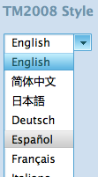

.. include:: <s5defs.txt>

==================================================================
5'->50h
==================================================================

～举例分析产品同技术的交流状态 (powered by rst2S5)

:Authors: `Zoom.Quiet <zoomquiet+sns@gmai.com>`__
:URL:    http://zoomquiet.org/res/s5/120918-lb-5m-50h-story/

.. This document has been placed in the CC domain.
.. _Docutils: http://docutils.sourceforge.net/
.. _reStructuredText: http://docutils.sourceforge.net/rst.html
.. _S5: http://meyerweb.com/eric/tools/s5/
.. _Firefox: http://www.mozilla.com/firefox/

.. _Zoom.Quiet:
    http://code.google.com/p/openbookproject/wiki/ZoomQuiet
.. _(CC)by-nc-sa:
    http://creativecommons.org/licenses/by-nc-sa/2.5/cn/
.. _FireFox:
    http://www.mozilla.com/firefox/
.. _S5介绍:
    http://zoomquiet.org/res/s5/100826-PyTDD/s5.html
.. _WYTIWYG:
    http://wiki.woodpecker.org.cn/moin/WyTiWyG

.. 图片定义区
.. |bullet| unicode:: U+02022
.. |mode| unicode:: U+00D8 .. capital o with stroke

.. |S5icon| image:: pix/S5icon.GIF
    :align: top
    :scale: 100 %
    :target: http://www.meyerweb.com/eric/tools/s5/
.. |LeoProse| image:: pix/LeoProse.gif
    :align: top
    :scale: 100 %
    :target: http://wiki.woodpecker.org.cn/moin/LeoEnvironment
.. |cc-byncsa31| image:: i/icon/cc-byncnd-88x31.png
   :alt: (CC)by-nc-sa 许可证
   :target: http://creativecommons.org/licenses/by-nc-sa/2.5/cn/
.. |cc-byncsa15| image:: i/icon/cc-byncnd-80x15.png
   :alt: (CC)by-nc-sa 许可证
   :target: http://creativecommons.org/licenses/by-nc-sa/2.5/cn/
.. |zqeye| image:: i/id/zoomquiet_1-1_outline.png
   :alt: 是也乎;-)
   :target: http://wiki.woodpecker.org.cn/moin/ZoomQuiet

.. |lr_s5| image:: i/levelradar_s5.png
    :scale: 100 %

.. footer:: 

   `Zoom.Quiet`_ v12.09.18 |cc-byncsa15| 推荐用 `FireFox`_ 获得最佳游览效果

<免责/>
=========

.. container:: handout

   山寨的，非业界公认的，个人体验为基础!
   |zqeye|

.. class:: takahashi1

    参考所有同好行为总结而得
        - 一切资料来自网络互动挖掘
        - 一切想法来自日常学习工作
        - 一切体悟来自各种沟通交流
        - 一切知识来自社区分享印证
        - 一切经验来自个人失败体验
    

高橋流!
=========

.. container:: handout

   `Takahashi-method 幻灯风格 <http://blog.derjohng.com/2006/04/12/takahashi-method-%E7%B0%A1%E5%A0%B1/>`__ 
   源自 Ruby 创始人高橋征義(Masayoshi Takahashi)

.. class:: center

    .. image:: pix/Takahashi-method.jpg
        :scale: 150 %
        :height: 300px
        :alt: 高橋流
        :align: center
        :target: http://blog.derjohng.com/2006/04/12/takahashi-method-%E7%B0%A1%E5%A0%B1/

文字
=========

.. container:: handout

   `Takahashi-method 幻灯风格 <http://blog.derjohng.com/2006/04/12/takahashi-method-%E7%B0%A1%E5%A0%B1/>`__ 
   源自 Ruby 创始人高橋征義(Masayoshi Takahashi)

.. class:: center takahashi9

    巨大

幻灯
=========

.. container:: handout

   `Takahashi-method 幻灯风格 <http://blog.derjohng.com/2006/04/12/takahashi-method-%E7%B0%A1%E5%A0%B1/>`__ 
   源自 Ruby 创始人高橋征義(Masayoshi Takahashi)

.. class:: center takahashi9

    很多

播放
=========

.. container:: handout

   `Takahashi-method 幻灯风格 <http://blog.derjohng.com/2006/04/12/takahashi-method-%E7%B0%A1%E5%A0%B1/>`__ 
   源自 Ruby 创始人高橋征義(Masayoshi Takahashi)

.. class:: center takahashi9

    快!

播放
=========

.. container:: handout

   `Takahashi-method 幻灯风格 <http://blog.derjohng.com/2006/04/12/takahashi-method-%E7%B0%A1%E5%A0%B1/>`__ 
   源自 Ruby 创始人高橋征義(Masayoshi Takahashi)

.. class:: center takahashi8

    很快!

播放
=========

.. container:: handout

   `Takahashi-method 幻灯风格 <http://blog.derjohng.com/2006/04/12/takahashi-method-%E7%B0%A1%E5%A0%B1/>`__ 
   源自 Ruby 创始人高橋征義(Masayoshi Takahashi)

.. class:: center takahashi7

    非常快!

所以:
=========

.. container:: handout

   `Takahashi-method 幻灯风格 <http://blog.derjohng.com/2006/04/12/takahashi-method-%E7%B0%A1%E5%A0%B1/>`__ 
   源自 Ruby 创始人高橋征義(Masayoshi Takahashi)

.. class:: center takahashi10

    :orange:`听`

<brief/>
=========

.. container:: handout

   简单想,简单试,简单用... |zqeye|

.. class:: takahashi

    - :orange:`5' 背景故事`
    - :silver:`10' 演变和解决`
    - :silver:`10' 再次革命`
    - :silver:`5'回顾,沟通`

.. container:: notes

   - 

Mouse Gesture
====================================

.. container:: handout

   誰在用?! |zqeye|

.. class:: takahashi9

    手势

.. container:: notes

   - 

原先
=========

.. container:: handout

   静态图片呢 |zqeye|

.. class:: takahashi8

    .. image:: i/snap/lb_mg_orig.PNG
        :align: center
        :target: #

.. container:: notes

   - 

改进!
=========

.. container:: handout

   高级用户! |zqeye|

.. class:: takahashi9

    定制
    
.. container:: notes

   - 

产品
=========

.. container:: handout

   设计示意 |zqeye|

.. class:: takahashi8

    .. image:: i/snap/lb_mg_design.png
        :align: center
        :target: #

.. container:: notes

   - 

记住!
=========

.. container:: handout

   开始状态! |zqeye|

.. class:: takahashi9

    当前
    
.. container:: notes

   - 

JS代码
=========

.. container:: handout

   开始状态, 14行 |zqeye|

.. code-block:: js

    cr.define('options', function() {
        const OptionsPage = options.OptionsPage;
        function MouseGestureOptions() {	
            OptionsPage.call(this, 'mousegesture',
                '选项 - 鼠标手势','mousegesturePage');
        };
        MouseGestureOptions.prototype = {
             __proto__: options.OptionsPage.prototype,  
            initializePage: function(){},
        };
        cr.addSingletonGetter(MouseGestureOptions);
        return {
            MouseGestureOptions: MouseGestureOptions
        };});
        

    
    
.. container:: notes

   - 

原始交互
=========

.. container:: handout

   纯静态 |zqeye|

.. class:: takahashi8

    .. image:: i/map/matter_sequence_Orig_wsd-omegapple.png
        :align: center
        :height: 350px
        :target: #

.. container:: notes

   - 

<brief/>
=========

.. container:: handout

   简单想,简单试,简单用... |zqeye|

.. class:: takahashi

    - :gray:`5' 背景故事`
    - :orange:`10' 演变和解决`
    - :silver:`10' 再次革命`
    - :silver:`5'回顾,沟通`

.. container:: notes

   - 

尝试
=========

.. container:: handout

   <select/> |zqeye|

.. class:: takahashi8

    下拉
    
    菜单

.. container:: notes

   - 

HTML
=========

.. container:: handout

   内置元素 |zqeye|

.. code-block:: html

    <ul><!-- 所有可配置手势 -->
        <li>
             <!-- 当前手势 -->
            <select> <!-- 下拉手势选择 -->
                <option>
                <option>
                ...
            </select>
        </li>
        ...
    </ul>

.. container:: notes

   - 

事务
=========

.. container:: handout

   同内核进行交互 |zqeye|

.. class:: takahashi8

    .. image:: i/map/matter_sequence_select_wsd-omegapple.png
        :align: center
        :target: http://www.websequencediagrams.com

.. container:: notes

   - 

原始交互
=========

.. container:: handout

   纯静态 |zqeye|

.. class:: takahashi8

    .. image:: i/map/matter_sequence_Orig_wsd-omegapple.png
        :align: center
        :height: 350px
        :target: #

.. container:: notes

   - 

还好
=========

.. container:: handout

   10小时 |zqeye|

.. class:: takahashi8

    快速
    
    完成

.. container:: notes

   - 

内核回调
=========

.. container:: handout

   内置元素 |zqeye|

.. code-block:: python

    chrome.send('getCustomMouseGestureRules', []); 
        <<< window.setCustomMouseGestureRules
            map:[ {"操作名":ID}
                ,"D":10002
                ,,,]
                无序...

.. container:: notes

   - 

唯一技巧
=========

.. container:: handout

   怎么记忆住? |zqeye|

.. class:: takahashi8

    上次
    
    选项
        
.. container:: notes

   - 

标准属性
=========

.. container:: handout

   <ul lang="zh"... |zqeye|

.. class:: takahashi8

    .. image:: i/snap/std_opt_lang.png
        :align: center
        :height: 350px
        :target: #

.. container:: notes

   - 

时间消耗:重构
==================

.. container:: handout

   集中力哪! |zqeye|

.. class:: takahashi

    .. class:: incremental

    - 0.5h 静态尝试
    - 2.5h 调试回调
    - 2.5h 动态展示
    - 4.5h 联调
    - ~ 10H
    - JS > 240行

.. container:: notes

   - 

太丑!
=========

.. container:: handout

   产品吼 |zqeye|

.. class:: takahashi9

    丑!

.. container:: notes

   - 

PS
=========

.. container:: handout

   永远伟大的... |zqeye|

.. class:: takahashi8

    5分钟

.. container:: notes

   - 

设计
=========

.. container:: handout

   用户喜欢美的 |zqeye|

.. class:: takahashi8

    .. image:: i/snap/lb_mg_design_ps.png
        :align: center
        :target: #

.. container:: notes

   - 

对比原先
=========

.. container:: handout

   静态图片呢 |zqeye|

.. class:: takahashi8

    .. image:: i/snap/lb_mg_orig.PNG
        :align: center
        :target: #

.. container:: notes

   - 

<brief/>
=========

.. container:: handout

   简单想,简单试,简单用... |zqeye|

.. class:: takahashi

    - :gray:`5' 背景故事`
    - :gray:`10' 演变和解决`
    - :orange:`10' 再次革命`
    - :silver:`5'回顾,沟通`

.. container:: notes

   - 

寻找
==================

.. container:: handout

   美的下拉菜单! |zqeye|

.. class:: takahashi9

    寻找

.. container:: notes

   - 

Select to CSS
==================

.. container:: handout

   http://utombox.com/ |zqeye|

.. list-table:: `多种效果 <http://www.onlyaa.com/examples/select2css/index.htm>`_
   :widths: 30 30 30
   :header-rows: 1

   * - U-Box 
     - TM2008
     - Mac 
   * - |select2css_style1|
     - |select2css_style2|
     - |select2css_style3|
   

.. container:: notes

   - 

DHTML
=========

.. container:: handout

   原理... |zqeye|

.. code-block:: html

    

        
 <!-- 当前选项模擬 -->
        < ul> <!-- 选择器模擬 -->
            < li>
            ...
        < /ul>
    

    <select> <!-- 原选择器 -->
        <option>
        ...
    </select>

.. container:: notes

   - 

多层事务
=========

.. container:: handout

   同内核以及html进行交互 |zqeye|

.. class:: takahashi8

    .. image:: i/map/matter_sequence_css_wsd-omegapple.png
        :align: center
        :height: 620px
        :target: http://www.websequencediagrams.com

.. container:: notes

   - 

事务
=========

.. container:: handout

   同内核进行交互 |zqeye|

.. class:: takahashi8

    .. image:: i/map/matter_sequence_select_wsd-omegapple.png
        :align: center
        :target: http://www.websequencediagrams.com

.. container:: notes

   - 

原始交互
=========

.. container:: handout

   纯静态 |zqeye|

.. class:: takahashi8

    .. image:: i/map/matter_sequence_Orig_wsd-omegapple.png
        :align: center
        :height: 350px
        :target: #

.. container:: notes

   - 

多层事务
=========

.. container:: handout

   同内核以及html进行交互 |zqeye|

.. class:: takahashi8

    .. image:: i/map/matter_sequence_css_wsd-omegapple.png
        :align: center
        :height: 620px
        :target: http://www.websequencediagrams.com

.. container:: notes

   - 

程序行为
=========

.. container:: handout

   思维图谱 |zqeye|

.. class:: takahashi8

    .. image:: i/map/ms_gesture4css.png
        :align: center
        :height: 420px
        :target: http://www.graphviz.org/About.php

.. container:: notes

   - leo_js_mg.png

文学化编程
===========================

.. container:: handout

   Leo. |zqeye|

.. class:: takahashi8

    .. image:: i/snap/leo_js_mg.png
        :align: center
        :target: http://webpages.charter.net/edreamleo/front.html

.. container:: notes

   - 

时间消耗:重构
==================

.. container:: handout

   集中力哪! |zqeye|

.. class:: takahashi

    .. class:: incremental

    - 3次重构
    - 平均每次 10H
    - 平均每次中断 2次
    - BUG修订 5H
    - 样式重构 5H
    - 总计 ~ 40H
    - JS> :orange:`1000` 行

.. container:: notes

   - 

<brief/>
=========

.. container:: handout

   简单想,简单试,简单用... |zqeye|

.. class:: takahashi

    - :gray:`5' 背景故事`
    - :gray:`10' 演变和解决`
    - :gray:`10' 再次革命`
    - :orange:`5'回顾,沟通`

.. container:: notes

   - 

总之
=========

.. container:: handout

   期望记住的~单位时间能记住的只有7+-2 个 |zqeye|

.. class:: incremental takahashi

    - 能用后才能求美
    - 能多美不是PS说了算的
    - 要多美应该全盘考虑
    - 技术可以作到一切,只是...

.. container:: notes

   - 

<discuss/>
==========

.. container:: handout

   |zqeye|

.. class:: takahashi8

    Q&A

.. class:: takahashi0

    ...

    http://zoomquiet.org/res/s5/120918-lb-5m-50h-story/

.. container:: notes

   - 

最后的最后...
==================

.. container:: handout

   好书推荐... |zqeye|

.. class:: takahashi

    .. image:: i/s4279952-zen4talk.jpg
        :align: center
        :scale: 100 %
        :alt: 讲演之禅
        :target: http://book.douban.com/subject/4760725/

.. container:: notes

   - 

<版本/>
=========

.. container:: handout

   |zqeye|

- 120918 创建幻灯
- 120828 准备思维图谱
- 120818 动念

:反馈:
    Zoom.Quiet@gmail.com
:查阅:
    http://zoomquiet.org/res/s5/120918-lb-5m-50h-story/

`S5 <http://www.meyerweb.com/eric/tools/s5/>`__
==============================================================================================

.. container:: handout

    纯HTML 幻灯撰写框架!... |lr_s5| 

- S\ :sup:`5`\ == a :orange:`S` imple :orange:`S` tandards-Based :orange:`S` lide :orange:`S` how :orange:`S` ystem 

 - 仅仅依靠 CSS+JS 的HTML格式幻灯演示框架

- 我的编辑环境: |LeoProse| ~ `文学化编辑器 <http://en.wikipedia.org/wiki/Literate_programming>`__

.. image:: pix/2010-01-18-230729_605x421_leo.png
    :align: center
    :scale: 100 %
    :target: http://wiki.woodpecker.org.cn/moin/LeoEnvironment

.. container:: notes

   - 

<Zoom.Quiet/>
==================

.. container:: handout

 本命+1,有娃没车,长年大妈  |zqeye|

.. class:: takahashi

    .. image:: i/foto/120826_niuniu.png
        :align: center
        :scale: 100 %
        :alt: 是也乎,是也乎

