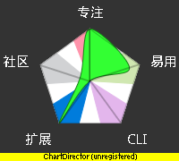

.. include:: <s5defs.txt>

==================================================================
乍组织活动?
==================================================================

～怎么折腾好一次欢乐的技术交流?! 

:Authors: `Zoom.Quiet <zoomquiet+s5@gmai.com>`__
:URL:    http://zoomquiet.org/res/s5/121020-how2make-tech-party/

.. This document has been placed in the CC domain.
.. _Docutils: http://docutils.sourceforge.net/
.. _reStructuredText: http://docutils.sourceforge.net/rst.html
.. _S5: http://meyerweb.com/eric/tools/s5/
.. _Firefox: http://www.mozilla.com/firefox/

.. _Zoom.Quiet:
    http://code.google.com/p/openbookproject/wiki/ZoomQuiet
.. _(CC)by-nc-sa:
    http://creativecommons.org/licenses/by-nc-sa/2.5/cn/
.. _FireFox:
    http://www.mozilla.com/firefox/
.. _S5介绍:
    http://zoomquiet.org/res/s5/100826-PyTDD/s5.html
.. _WYTIWYG:
    http://wiki.woodpecker.org.cn/moin/WyTiWyG

.. 图片定义区
.. |zqeye| image:: i/id/zoomquiet_1-1_outline.png
   :alt: 是也乎;-)
   :target: http://wiki.woodpecker.org.cn/moin/ZoomQuiet

.. |cc-byncsa31| image:: i/icon/cc-byncnd-88x31.png
   :alt: (CC)by-nc-sa 许可证
   :target: http://creativecommons.org/licenses/by-nc-sa/2.5/cn/
.. |cc-byncsa15| image:: i/icon/cc-byncnd-80x15.png
   :alt: (CC)by-nc-sa 许可证
   :target: http://creativecommons.org/licenses/by-nc-sa/2.5/cn/

.. |bullet| unicode:: U+02022
.. |mode| unicode:: U+00D8 .. capital o with stroke

.. |S5icon| image:: pix/S5icon.GIF
    :align: top
    :scale: 100 %
    :target: http://www.meyerweb.com/eric/tools/s5/
.. |LeoProse| image:: pix/LeoProse.gif
    :align: top
    :scale: 100 %
    :target: http://wiki.woodpecker.org.cn/moin/LeoEnvironment

.. footer:: 

   `Zoom.Quiet`_ v12.10.17 |cc-byncsa15| 推荐用 `FireFox`_ 获得最佳游览效果

<免责/>
=========

.. container:: handout

   山寨的，非业界公认的，个人体验为基础!
   |zqeye|

.. class:: takahashi1

    参考所有同好行为总结而得
        - 一切资料来自网络互动挖掘
        - 一切想法来自日常学习工作
        - 一切体悟来自各种沟通交流
        - 一切知识来自社区分享印证
        - 一切经验来自个人失败体验
    

高橋流!
=========

.. container:: handout

   `Takahashi-method 幻灯风格 <http://blog.derjohng.com/2006/04/12/takahashi-method-%E7%B0%A1%E5%A0%B1/>`__ 
   源自 Ruby 创始人高橋征義(Masayoshi Takahashi)

.. class:: center

    .. image:: pix/Takahashi-method.jpg
        :scale: 150 %
        :height: 300px
        :alt: 高橋流
        :align: center
        :target: http://blog.derjohng.com/2006/04/12/takahashi-method-%E7%B0%A1%E5%A0%B1/

文字
=========

.. container:: handout

   `Takahashi-method 幻灯风格 <http://blog.derjohng.com/2006/04/12/takahashi-method-%E7%B0%A1%E5%A0%B1/>`__ 
   源自 Ruby 创始人高橋征義(Masayoshi Takahashi)

.. class:: center takahashi9

    巨大

幻灯
=========

.. container:: handout

   `Takahashi-method 幻灯风格 <http://blog.derjohng.com/2006/04/12/takahashi-method-%E7%B0%A1%E5%A0%B1/>`__ 
   源自 Ruby 创始人高橋征義(Masayoshi Takahashi)

.. class:: center takahashi9

    很多

播放
=========

.. container:: handout

   `Takahashi-method 幻灯风格 <http://blog.derjohng.com/2006/04/12/takahashi-method-%E7%B0%A1%E5%A0%B1/>`__ 
   源自 Ruby 创始人高橋征義(Masayoshi Takahashi)

.. class:: center takahashi9

    快!

播放
=========

.. container:: handout

   `Takahashi-method 幻灯风格 <http://blog.derjohng.com/2006/04/12/takahashi-method-%E7%B0%A1%E5%A0%B1/>`__ 
   源自 Ruby 创始人高橋征義(Masayoshi Takahashi)

.. class:: center takahashi8

    很快!

播放
=========

.. container:: handout

   `Takahashi-method 幻灯风格 <http://blog.derjohng.com/2006/04/12/takahashi-method-%E7%B0%A1%E5%A0%B1/>`__ 
   源自 Ruby 创始人高橋征義(Masayoshi Takahashi)

.. class:: center takahashi7

    非常快!

所以:
=========

.. container:: handout

   `Takahashi-method 幻灯风格 <http://blog.derjohng.com/2006/04/12/takahashi-method-%E7%B0%A1%E5%A0%B1/>`__ 
   源自 Ruby 创始人高橋征義(Masayoshi Takahashi)

.. class:: center takahashi10

    :orange:`听`

问题s
=========

.. container:: handout

   |pycon|

.. class:: takahashi8

    为毛?

.. container:: notes

   - 

我们需要:
==================

.. container:: handout

   |pycon|

.. class:: takahashi8

    线下
    
    活动

.. container:: notes

   - 

原因俺猜:
==================
.. container:: handout

   |pycon|

.. class:: takahashi8

    求认同

.. container:: notes

   - 

原因俺猜:
==================
.. container:: handout

   |pycon|

.. class:: takahashi8

    求印证

.. container:: notes

   - 

原因俺猜:
==================
.. container:: handout

   |pycon|

.. class:: takahashi8

    求包养

.. container:: notes

   - 

动力?
==================
.. container:: handout

   |pycon|

.. class:: takahashi8

    社会性
    
    生物

.. container:: notes

   - 

动力?
==================
.. container:: handout

   |pycon|

.. class:: takahashi8

    表演欲

.. container:: notes

   - 

动力?
==================
.. container:: handout

   |pycon|

.. class:: takahashi8

    知识
    
    快感

.. container:: notes

   - 

动力?
==================
.. container:: handout

   |pycon|

.. class:: takahashi8

    及其它
    
    ...

.. container:: notes

   - 

社区动力!
==================
.. container:: handout

   |pycon|

.. class:: takahashi8

    扩大
    
    影响力

.. container:: notes

   - 

社区动力!
==================
.. container:: handout

   |pycon|

.. class:: takahashi8

    制造
    
    BUZZ

.. container:: notes

   - 

社区动力!
==================
.. container:: handout

   |pycon|

.. class:: takahashi8

    促进
    
    积累

.. container:: notes

   - 

怎么算欢乐?
===========================

.. container:: handout

   |pycon|

.. class:: takahashi8

    巴适
    
    安宜

.. container:: notes

   - 

指标:
==================

.. container:: handout

   |pycon|

.. class:: takahashi8

    所有人!

.. container:: notes

   - 

所有人:
==================

.. container:: handout

   |pycon|

.. class:: takahashi8

    分享者

.. container:: notes

   - 

所有人:
==================

.. container:: handout

   |pycon|

.. class:: takahashi8

    学习者

.. container:: notes

   - 

所有人:
==================

.. container:: handout

   |pycon|

.. class:: takahashi8

    支持者

.. container:: notes

   - 

所有人:
==================

.. container:: handout

   |pycon|

.. class:: takahashi8

    旁观者

.. container:: notes

   - 

都巴适!
==================

.. container:: handout

   |pycon|

.. class:: takahashi8

    所有人!

.. container:: notes

   - 

对于分享者:
==================

.. container:: handout

   |pycon|

.. class:: takahashi8

    尊重

.. container:: notes

   - 

对于学习者:
==================

.. container:: handout

   |pycon|

.. class:: takahashi8

    支持

.. container:: notes

   - 

对于支持者:
==================

.. container:: handout

   |pycon|

.. class:: takahashi8

    回报

.. container:: notes

   - 

对于旁观者:
==================

.. container:: handout

   |pycon|

.. class:: takahashi8

    方便

.. container:: notes

   - 

TIPs
=========

.. container:: handout

   |pycon|

.. class:: takahashi8

    乍整?

.. container:: notes

   - 

根本条件!
==================

.. container:: handout

   |pycon|

.. class:: takahashi8

    人

.. container:: notes

   - 

重要条件!
==================

.. container:: handout

   |pycon|

.. class:: takahashi9

    人

.. container:: notes

   - 

关键条件!
==================

.. container:: handout

   |pycon|

.. class:: takahashi10

    :orange:`人`

.. container:: notes

   - 

哪些人?
==================

.. container:: handout

   |pycon|

.. class:: takahashi8

    组织者

.. container:: notes

   - 

哪些人?
==================

.. container:: handout

   |pycon|

.. class:: takahashi8

    参与者

.. container:: notes

   - 

哪些人?
==================

.. container:: handout

   |pycon|

.. class:: takahashi8

    支持者

.. container:: notes

   - 

哪些人?
==================

.. container:: handout

   |pycon|

.. class:: takahashi8

    贡献者

.. container:: notes

   - 

哪些人?
==================

.. container:: handout

   |pycon|

.. class:: takahashi8

    扩散者

.. container:: notes

   - 

组织者哪儿来?
==================

.. container:: handout

   |pycon|

.. class:: takahashi8

    生长

.. container:: notes

   - 

参与者哪儿来?
==================

.. container:: handout

   |pycon|

.. class:: takahashi8

    积累

.. container:: notes

   - 

支持者哪儿来?
==================

.. container:: handout

   |pycon|

.. class:: takahashi8

    吸引

.. container:: notes

   - 

贡献者哪儿来?
==================

.. container:: handout

   |pycon|

.. class:: takahashi8

    :orange:`抓!`

.. container:: notes

   - 

扩散者哪儿来?
==================

.. container:: handout

   |pycon|

.. class:: takahashi8

    联合

.. container:: notes

   - 

假设都有了..
==================

.. container:: handout

   |pycon|

.. class:: takahashi8

    乍组织?

.. container:: notes

   - 

无它
==================

.. container:: handout

   |pycon|

.. class:: takahashi9

    熟尔

.. container:: notes

   - 

注意!
==================

.. container:: handout

   |pycon|

.. class:: takahashi8

    墨菲
    
    定律

.. container:: notes

   - 

只要...
==================

.. container:: handout

   |pycon|

.. class:: takahashi8

    不怕

.. container:: notes

   - 

以及...
==================

.. container:: handout

   |pycon|

.. class:: takahashi8

    乐于
    
    尝试

.. container:: notes

   - 

具体说:
==================

.. container:: handout

   |pycon|

.. class:: takahashi8

    经验点

.. container:: notes

   - 

经验点:
==================

.. container:: handout

   |pycon|

.. class:: takahashi8

    为他人
    
    着想

.. container:: notes

   - 

经验点:
==================

.. container:: handout

   |pycon|

.. class:: takahashi8

    多授权

.. container:: notes

   - 

经验点:
==================

.. container:: handout

   |pycon|

.. class:: takahashi8

    多检查

.. container:: notes

   - 

经验点:
==================

.. container:: handout

   |pycon|

.. class:: takahashi8

    快替换

.. container:: notes

   - 

经验点:
==================

.. container:: handout

   |pycon|

.. class:: takahashi8

    AKA

.. container:: notes

   - 

经验点:
==================

.. container:: handout

   |pycon|

.. class:: takahashi8

    要回顾

.. container:: notes

   - 

总之
=========

.. container:: handout

   期望可以记住的~单位时间可以记住的只有7+-2 个 |zqeye|

.. class:: incremental takahashi

    * 线下活动很必要/重要/好玩
    * 勇于承担就能折腾起来
    * 多尝试就会熟练自在
    * 兼顾所有人的感受
    * 分享才能收获!

.. container:: notes

   - 

<版本/>
=========

.. container:: handout

   |zqeye|

- 121017 增补细节
- 121010 结构决定
- 121001 动念

:反馈:
    zoomquiet+s5@gmail.com
:查阅:
    http://zoomquiet.org/res/s5/121020-how2make-tech-party/

`S5 <http://www.meyerweb.com/eric/tools/s5/>`__
==============================================================================================

.. container:: handout

    纯HTML 幻灯撰写框架!... |lr_s5| 

- S\ :sup:`5`\ == a :orange:`S` imple :orange:`S` tandards-Based :orange:`S` lide :orange:`S` how :orange:`S` ystem 

 - 仅仅依靠 CSS+JS 的HTML格式幻灯演示框架

- 我的编辑环境: |LeoProse| ~ `文学化编辑器 <http://en.wikipedia.org/wiki/Literate_programming>`__

.. image:: pix/2010-01-18-230729_605x421_leo.png
    :align: center
    :scale: 100 %
    :target: http://wiki.woodpecker.org.cn/moin/LeoEnvironment

.. container:: notes

   - 

<Zoom.Quiet/>
==================

.. container:: handout

 本命+2,有娃有房,长年大妈  |zqeye|

.. class:: takahashi

    .. image:: i/foto/120826_niuniu.png
        :align: center
        :target: http://weibo.com/zoomquiet

