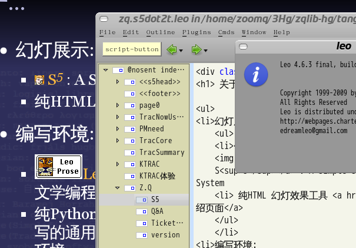

.. include:: <s5defs.txt>

==================================================================
科学的玩
==================================================================

～如何在珠海GDG里自在的折腾... 

:Authors: `Zoom.Quiet <zoomquiet+s5@gmai.com>`__
:URL:    http://zoomquiet.org/res/s5/130427-zhgdg2zhbit/

.. This document has been placed in the CC domain.
.. _Docutils: http://docutils.sourceforge.net/
.. _reStructuredText: http://docutils.sourceforge.net/rst.html
.. _S5: http://meyerweb.com/eric/tools/s5/
.. _Firefox: http://www.mozilla.com/firefox/

.. _Zoom.Quiet:
    http://code.google.com/p/openbookproject/wiki/ZoomQuiet
.. _(CC)by-nc-sa:
    http://creativecommons.org/licenses/by-nc-sa/2.5/cn/
.. _FireFox:
    http://www.mozilla.com/firefox/
.. _S5介绍:
    http://zoomquiet.org/res/s5/100826-PyTDD/s5.html
.. _WYTIWYG:
    http://wiki.woodpecker.org.cn/moin/WyTiWyG
.. _GSoC:
    http://www.google-melange.com/gsoc/homepage/google/gsoc2013

.. 图片定义区
.. |zqeye| image:: i/id/zoomquiet_1-1_outline.png
   :alt: 是也乎;-)
   :target: http://wiki.woodpecker.org.cn/moin/ZoomQuiet
.. |zhgdg| image:: i/id/ZH_GDG_Logo_SQ3-130405_50.png
   :target: http://www.chinagdg.com/thread-1650-1-1.html
.. |pycon| image:: i/logo/pycon2012china-lo​go-2-h80.png
   :target: http://cn.pycon.org

.. |cc-byncsa31| image:: i/icon/cc-byncnd-88x31.png
   :alt: (CC)by-nc-sa 许可证
   :target: http://creativecommons.org/licenses/by-nc-sa/2.5/cn/
.. |cc-byncsa15| image:: i/icon/cc-byncnd-80x15.png
   :alt: (CC)by-nc-sa 许可证
   :target: http://creativecommons.org/licenses/by-nc-sa/2.5/cn/
.. |lr_s5| image:: i/icon/levelradar_s5.png
    :scale: 100 %

.. |bullet| unicode:: U+02022
.. |mode| unicode:: U+00D8 .. capital o with stroke

.. |S5icon| image:: pix/S5icon.GIF
    :align: top
    :scale: 100 %
    :target: http://www.meyerweb.com/eric/tools/s5/
.. |LeoProse| image:: pix/LeoProse.gif
    :align: top
    :scale: 100 %
    :target: http://wiki.woodpecker.org.cn/moin/LeoEnvironment

.. footer:: 

   `Zoom.Quiet`_ v12.10.17 |cc-byncsa15| 推荐用 `FireFox`_ 获得最佳游览效果

<免责/>
=========

.. container:: handout

   山寨的，非业界公认的，个人体验为基础!
   |zqeye|

.. class:: takahashi1

    参考所有同好行为总结而得
        - 一切资料来自网络互动挖掘
        - 一切想法来自日常学习工作
        - 一切体悟来自各种沟通交流
        - 一切知识来自社区分享印证
        - 一切经验来自个人失败体验
    

高橋流!
=========

.. container:: handout

   `Takahashi-method 幻灯风格 <http://blog.derjohng.com/2006/04/12/takahashi-method-%E7%B0%A1%E5%A0%B1/>`__ 
   源自 Ruby 创始人高橋征義(Masayoshi Takahashi)

.. class:: center

    .. image:: pix/Takahashi-method.jpg
        :scale: 150 %
        :height: 300px
        :alt: 高橋流
        :align: center
        :target: http://blog.derjohng.com/2006/04/12/takahashi-method-%E7%B0%A1%E5%A0%B1/

文字
=========

.. container:: handout

   `Takahashi-method 幻灯风格 <http://blog.derjohng.com/2006/04/12/takahashi-method-%E7%B0%A1%E5%A0%B1/>`__ 
   源自 Ruby 创始人高橋征義(Masayoshi Takahashi)

.. class:: center takahashi9

    巨大

幻灯
=========

.. container:: handout

   `Takahashi-method 幻灯风格 <http://blog.derjohng.com/2006/04/12/takahashi-method-%E7%B0%A1%E5%A0%B1/>`__ 
   源自 Ruby 创始人高橋征義(Masayoshi Takahashi)

.. class:: center takahashi9

    很多

播放
=========

.. container:: handout

   `Takahashi-method 幻灯风格 <http://blog.derjohng.com/2006/04/12/takahashi-method-%E7%B0%A1%E5%A0%B1/>`__ 
   源自 Ruby 创始人高橋征義(Masayoshi Takahashi)

.. class:: center takahashi9

    快!

播放
=========

.. container:: handout

   `Takahashi-method 幻灯风格 <http://blog.derjohng.com/2006/04/12/takahashi-method-%E7%B0%A1%E5%A0%B1/>`__ 
   源自 Ruby 创始人高橋征義(Masayoshi Takahashi)

.. class:: center takahashi8

    很快!

播放
=========

.. container:: handout

   `Takahashi-method 幻灯风格 <http://blog.derjohng.com/2006/04/12/takahashi-method-%E7%B0%A1%E5%A0%B1/>`__ 
   源自 Ruby 创始人高橋征義(Masayoshi Takahashi)

.. class:: center takahashi7

    非常快!

所以:
=========

.. container:: handout

   `Takahashi-method 幻灯风格 <http://blog.derjohng.com/2006/04/12/takahashi-method-%E7%B0%A1%E5%A0%B1/>`__ 
   源自 Ruby 创始人高橋征義(Masayoshi Takahashi)

.. class:: center takahashi10

    :orange:`听`

<brief/>
=========

.. container:: handout

   最想跟同学们吼的... |zqeye|

.. class:: takahashi

    - :orange:`5' 有关ZQ`
    - :silver:`15' 怎么提问?!`
    - :silver:`15' 吖是蠎营`
    - :silver:`15' 珠海GDG有吖?`
    - :silver:`15'自由吐糟`

.. container:: notes

   - 

<Zoom.Quiet>
==================

.. container:: handout

   |zqeye|

.. class:: takahashi

    .. image:: i/id/100514-zq-eye.png
        :align: center
        :scale: 80 %
        :alt: 是也乎,是也乎

    .. image:: i/map/50ren-ZoomQuiet-s5-v800.png
        :align: center
        :scale: 100 %
        :alt: Zoom.Quiet
        :target: http://zoomquiet.org

.. container:: notes

   - 

是也乎
==================

.. container:: handout

    本命年+3 |zqeye|

.. class:: takahashi8

    奔四

.. container:: notes

   - 

广告@常州
==================

.. container:: handout

   大学时代入错行，浪费两年;-{ |zqeye|

.. class:: takahashi8

    1999

.. container:: notes

   - 

开发@上海
==================

.. container:: handout

   战上海:HTML->JS->PHP->XSL->Py |zqeye|

.. class:: takahashi8

    ~2004

.. container:: notes

   - 

`2003:CZUG.org <http://czug.org/>`__
======================================================

.. container:: handout

   learnning Zope/Plone... |zqeye|

.. class:: takahashi1

    - **C** hina
    - **Z** ope
    - **U** ser
    - **G** roup

    .. image:: i/logo/logo-czug.png
        :align: center
        :alt: http://czug.org

.. container:: notes

   - 

`2004:啄木鸟 <http://www.woodpecker.org.cn/>`__
=================================================

.. container:: handout

   admin. MoinMoin 1.2.4... |zqeye|

.. class:: center

    .. image:: i/logo/logo-wpwww_banner.png
        :align: center
        :alt: http://www.woodpecker.org.cn

    - |logo_wpwiki_banner| \ :sup:`MoinMoin 1.4.*`\    
    - |wiki_banner| \ :sup:`MoinMoin 1.7.*`\    
    - |wp_zoomq_scrot| \ :sup:`MoinMoin 1.9.*`\

.. |logo_wpwiki_banner| image:: i/logo/logo_wpwiki_banner.gif
    :align: bottom
    :alt: http://www.woodpecker.org.cn

.. |wiki_banner| image:: i/logo/logo_wp-wiki_banner.png
    :align: bottom
    :alt: http://wiki.woodpecker.org.cn

.. |wp_zoomq_scrot| image:: i/logo/logo_wiki-wp_zoomq_scrot.png
    :align: bottom
    :scale: 100 %
    :alt: http://wiki,woodpecker.org.cn

.. container:: notes

   - 

PI@北京
==================

.. container:: handout

   混北京:SINA->CPyUG->SLL |zqeye|

.. class:: takahashi8

    ~2007

.. container:: notes

   - 

2005:`CPyUG`__-> BPyUG
======================================================

__ http://wiki.woodpecker.org.cn/moin/BPUG/2005-07-30
.. container:: handout

   working with Python,in SINA.com |zqeye|

.. class:: takahashi1

    .. image:: i/logo/120201-CPyUG-logo-v2.png
        :align: center
        :height: 500px
        :alt: CPyUG
        :target: http://wiki.woodpecker.org.cn/moin/CPUG

.. container:: notes

   - BPUG-logo-v1.3.png

2005:`CPyUG`__-> BPyUG
======================================================

__ http://wiki.woodpecker.org.cn/moin/BPUG/2005-07-30
.. container:: handout

   working with Python,in SINA.com |zqeye|

.. class:: takahashi1

    .. image:: i/logo/BPUG-logo-v1.2.png
        :align: center
        :height: 400px
        :alt: BPUG
        :target: http://wiki.woodpecker.org.cn/moin/BPUG

.. container:: notes

   - BPUG-logo-v1.3.png

2007:`ZPyUG`__
======================================================

__ http://wiki.woodpecker.org.cn/moin/ZPyUG

.. container:: handout

    - 在北京,主持完成了25次技术分享
    - 进入金山,使用Python 进行了各种平台的构建~ `KTRAC`__
    - spreading Python everywhere to everyone... 

__ http://py.kingsoft.net/ktrac

.. class:: takahashi1

    - **珠** 三角
    - **P** ython
    - **U** ser
    - **G** roup

    .. image:: i/logo/logo_163_game.gif
        :align: center
    .. image:: i/logo/logo_sina_home.gif
        :align: center
    .. image:: i/logo/logo-ks.jpg
        :align: center

.. container:: notes

   - 

`ECUG.org`__
======================================================

__ http://ecug.org/
.. container:: handout

   spreading Python everywhere to everyone... |zqeye|

.. class:: takahashi1

    .. image:: i/logo/ecug-logo_67bw.jpg
        :align: center
        :scale: 100 %
        :alt: ECUG
        :target: http://code.google.com/p/ecug/wiki/FrontPage

.. container:: notes

   - 

2008:|SLL.org| "SLL.org"
======================================================

.. container:: handout

   spreading Pythonic everywhere to everyone... |zqeye|

.. class:: takahashi4

    教育大发现

.. class:: takahashi2 center

    http://sociallearnlab.org/

.. container:: notes

   - 

2009-09-01 出版
======================================================

.. container:: handout

   - 将多年的体验,集中到一本入门图书 "可爱的Python"
   - 并主持ZPyUG 近10次技术分享  |zqeye|

.. class:: takahashi1

    .. image:: i/090902-lovpy.jpg
        :align: center
        :alt: 可愛的Python
        :target: http://book.douban.com/subject/3884108/

.. container:: notes

   - snap4ZQMBP_apac2010.png

2010~
======================================================

.. container:: handout

   社区在不断发展... |zqeye|

.. class:: takahashi1

    .. image:: i/snap/cpug-ml-zoomq-2010-06-04-111017_628x701_scrot.png
        :align: center
        :height: 700px
        :alt: python-cn@googlegroups.com
        :target: http://groups-beta.google.com/group/python-cn

.. container:: notes

   - snap4ZQMBP_apac2010.png

亚太PyCon
======================================================

.. container:: handout

   首次出国... |zqeye|

.. class:: takahashi1

    .. image:: i/snap/snap4ZQMBP_apac2010.png
        :align: center
        :height: 600px
        :alt: python-cn@googlegroups.com
        :target: http://wiki.woodpecker.org.cn/moin/PyCon2010

.. container:: notes

   - snap4ZQMBP_apac2010.png

PyCon2011China
======================================================

.. container:: handout

   首次PyCon 落地中国... |zqeye|

.. class:: takahashi1

    .. image:: i/snap/snap4ZQMBP_pycon2011cn.png
        :align: center
        :alt: python-cn@googlegroups.com
        :target: http://cn.pycon.org/2011

.. container:: notes

   - snap4ZQMBP_pycon2011cn.png

~2012
======================================================

.. container:: handout

   社区在不断发展... |zqeye|

.. class:: takahashi1

    .. image:: i/snap/121023-python-cn-1kmailer.png
        :align: center
        :height: 600px
        :alt: python-cn@googlegroups.com
        :target: http://groups-beta.google.com/group/python-cn

.. container:: notes

   - snap4ZQMBP_pycon2011cn.png

PyCon2012ChinA
======================================================

.. container:: handout

   首次 PyCon中国双城市联办... |zqeye|

.. class:: takahashi1

    .. image:: i/snap/snap4ZQMBP_pycon2012cn.png
        :align: center
        :alt: python-cn@googlegroups.com
        :target: http://cn.pycon.org/2011

.. container:: notes

   - snap4ZQMBP_pycon2011cn.png

过一万人!
======================================================

.. container:: handout

   121024首次 Hackathon 前! |zqeye|

.. class:: takahashi1

    .. image:: i/snap/121024-python-cn-10000.png
        :align: center
        :height: 600px
        :alt: python-cn@googlegroups.com
        :target: http://groups-beta.google.com/group/python-cn

.. container:: notes

   - snap4ZQMBP_pycon2011cn.png

~2013
======================================================

.. container:: handout

   Groups也是... |zqeye|

.. class:: takahashi1

    .. image:: i/snap/snap4ZQMBP_130426_17.24.35.png
        :align: center
        :height: 500px
        :alt: python-cn@googlegroups.com
        :target: http://groups-beta.google.com/group/python-cn

.. container:: notes

   - 

~2013
======================================================

.. container:: handout

   不准的统计!... |zqeye|

.. class:: takahashi1

    .. image:: i/snap/snap4ZQMBP_130426_17.24.45.png
        :align: center
        :height: 500px
        :alt: python-cn@googlegroups.com
        :target: http://groups-beta.google.com/group/python-cn

.. container:: notes

   - 

综上...
==================

.. container:: handout

   基调是分享交流;-} |zqeye|

.. class:: takahashi

    俺就一

    `社区大妈`__

__ http://wiki.woodpecker.org.cn/moin/ZoomQuiet

.. container:: notes

   - 

`珠海GDG <http://www.chinagdg.com/thread-1329-1-1.html>`_
========================================================================

.. container:: handout

   Google Developer Group... |zqeye|

.. class:: takahashi1

    .. image:: i/logo/ZH_YiLaBao2_noICONs.jpg
        :align: center
        :height: 300px
        :alt: ZHGDG
        :target: http://www.chinagdg.com/forum-94-1.html

.. container:: notes

   - 

牛妞
==================

.. container:: handout

   \\ (^o^) / 596d

.. image:: i/foto/niuniu110105.jpeg
    :align: center
    :height: 700px
    :alt: 表情牛妞

.. container:: notes

   - 我的女儿刚刚一岁半,非常牛,,,脾气牛,头脑牛,虽然不会说话,但是已经能指挥我们干活了...
   - 120426-niuniu-表情帝

牛妞
==================

.. container:: handout

   \\ (^o^) / 1096d

.. image:: i/foto/120426-niuniu-表情帝.jpg
    :align: center
    :height: 700px
    :alt: 表情牛妞

.. container:: notes

   - 我的女儿刚刚一岁半,非常牛,,,脾气牛,头脑牛,虽然不会说话,但是已经能指挥我们干活了...
   - 120426-niuniu-表情帝

</Zoom.Quiet>
==================

.. container:: handout

    - 纯种Pythoner，自由软件原教旨主义者 
    - 关注社会化教育及知识管理；喜爱SF和摄影。 
    - 尝试使用Pythonic体验感化国人主动进入自由软件世界体验/学习/再创作

.. class:: takahashi8

   (^.^)

.. container:: notes

   - 

<brief/>
=========

.. container:: handout

   最想跟同学们吼的... |zhgdg|

.. class:: takahashi

    - :gray:`5' 有关ZQ`
    - :orange:`15' 怎么提问?!`
    - :silver:`15' 咩是蠎营`
    - :silver:`15' 珠海GDG有咩?`
    - :silver:`15'自由吐糟`

.. container:: notes

   - 

怎么提问是专门技能!
====================================

.. container:: handout

    144个月前就解决了... |zhgdg|

.. class:: takahashi5

    `提问的智慧 <http://wiki.woodpecker.org.cn/moin/AskForHelp>`_

.. container:: notes

   - 

笑话
====================================

.. container:: handout

    老师:... |zqeye|

.. class:: takahashi4

    为毛上课睡觉?

.. container:: notes

   - 

笑话
====================================

.. container:: handout

    学生:... |zqeye|

.. class:: takahashi5

    因为听不懂!

.. container:: notes

   - 

笑话
====================================

.. container:: handout

    老师:... |zqeye|

.. class:: takahashi5

    为毛听不懂!

.. container:: notes

   - 

笑话
====================================

.. container:: handout

    学生:... |zqeye|

.. class:: takahashi5

    因为我没听!

.. container:: notes

   - 

笑话
====================================

.. container:: handout

    老师:... |zqeye|

.. class:: takahashi5

    为毛不听!

.. container:: notes

   - 

笑话
====================================

.. container:: handout

    老师:... |zqeye|

.. class:: takahashi8

    囧rz

.. container:: notes

   - 

常见回答
====================================

.. container:: handout

    Orz... |zhgdg|

.. class:: takahashi8

    `RTFM <http://en.wikipedia.org/wiki/RTFM>`_

.. container:: notes

   - 想用pythonic的思想去写东西，但是完全体会不到，能给个实实在在的举例分享吗
   - 你自个儿的第42个Python 应用工具...  (4月24日 09:31)
   

常见回答
====================================

.. container:: handout

    Orz... |zhgdg|

.. class:: takahashi8

    STFW

.. container:: notes

   - 

常见回答
====================================

.. container:: handout

    Orz... |zhgdg|

.. class:: takahashi8

    GIYF

.. container:: notes

   - 

调侃只是因为...
====================================

.. container:: handout

    Orz... |zhgdg|

.. class:: incremental takahashi

    * 想用pythonic的思想去写东西
    * 但是完全体会不到
    * 能给个实实在在的举例吗?

.. container:: notes

   - 

最Pythonic 的...
====================================

.. container:: handout

    Orz... |zhgdg|

.. class:: takahashi

    * 你\ :orange:`自个儿`\ 的
    * 第\ :orange:`42`\ 个
    * Python 应用工具

.. container:: notes

   - 

其实
====================================

.. container:: handout

    Orz... |zhgdg|

.. class:: takahashi5

    好\ :orange:`问`\ 题
    
    胜过
    好\ :orange:`答案`

.. container:: notes

   - 

小学生学习方式
====================================

.. container:: handout

    最靠谱的... |zhgdg|

.. class:: takahashi7

    小考小玩

.. container:: notes

   - 

小学生学习方式
====================================

.. container:: handout

    最靠谱的... |zhgdg|

.. class:: takahashi7

    大考大玩

.. container:: notes

   - 

小学生学习方式
====================================

.. container:: handout

    最靠谱的... |zhgdg|

.. class:: takahashi7

    不考不玩

.. container:: notes

   - 

提问其实在考自己
====================================

.. container:: handout

    ... |zhgdg|

.. class:: takahashi5

    问对问题

.. container:: notes

   - http://wiki.woodpecker.org.cn/moin/5W1H

问对问题
====================================

.. container:: handout

    对的 |zhgdg|

.. class:: takahashi8

    形式

.. container:: notes

   - http://wiki.woodpecker.org.cn/moin/5W1H

问对问题
====================================

.. container:: handout

    对的 |zhgdg|

.. class:: takahashi8

    对象

.. container:: notes

   - http://wiki.woodpecker.org.cn/moin/5W1H

问对问题
====================================

.. container:: handout

    对的 |zhgdg|

.. class:: takahashi8

    时机

.. container:: notes

   - http://wiki.woodpecker.org.cn/moin/5W1H

问对问题
====================================

.. container:: handout

    对的 |zhgdg|

.. class:: takahashi8

    内容

.. container:: notes

   - http://wiki.woodpecker.org.cn/moin/5W1H

好招儿
====================================

.. container:: handout

    Orz... |zhgdg|

.. class:: takahashi5

    `五个为什么 <https://zh.wikipedia.org/zh/%E4%BA%94%E4%B8%AA%E4%B8%BA%E4%BB%80%E4%B9%88>`_

.. container:: notes

   - 又称为“五个为何”、“五问”或“五问法”，是一种提出问题的方法，用于探究造成特定问题的因果关系!这种方法最初是由豐田佐吉提出的；后来，丰田汽车公司在发展完善其制造方法学的过程之中也采用了这一方法。作为豐田生產方式的入门课程的组成部分，这种方法成为其中问题求解培训的一项关键内容。丰田生产系统的设计师大野耐一曾经将五问法描述为“……丰田科学方法的基础……重复五次，问题的本质及其解决办法随即显而易见”[1]。目前，该方法在丰田之外已经得到了广泛采用，并且现在持续改善法、精益生产法以及六西格玛法之中也得到了采用。

以及尽量描述齐全
====================================

.. container:: handout

    ... |zhgdg|

.. class:: takahashi8

    `5W1H <http://wiki.woodpecker.org.cn/moin/5W1H>`_

.. container:: notes

   - http://wiki.woodpecker.org.cn/moin/5W1H

以上都是面向
====================================

.. container:: handout

    在公司里，如何写好一封... |zhgdg|

.. class:: takahashi7

    `电子邮件 <http://focuzine.com/2013/04/how-to-write-a-good-email-in-your-company/>`_

.. container:: notes

   - http://wiki.woodpecker.org.cn/moin/5W1H

总之
=========

.. container:: handout

   以后最常见的线上提问多发生在 mailing list |zqeye|

.. class:: incremental takahashi

    * `致中国网民:为什么不应该使用QQ进行技术交流? <http://www.chinagdg.com/thread-1358-1-1.html>`_
    * `引文在上 vs. 引文在下 <http://apple4us.com/2010/05/email-etiquette-1-top-posting-bottom-posting.html>`_
    * `程序员必知必会之Email篇 <http://blog.csdn.net/lanphaday/article/details/850059>`_
    * `程序员必知必会之maillist篇 <http://blog.csdn.net/lanphaday/article/details/1669326>`_
    * `邮件列表的文化礼仪与使用指引 <http://skm.zoomquiet.org/data/20110417134205/index.html>`_
    * `珠海GDG邮件列表规约(v12.10.20) <http://www.chinagdg.com/thread-1410-1-1.html>`_
    
.. container:: notes

   - 

当然
=========

.. container:: handout

   现实中的提问也类似 |zqeye|

.. class:: incremental takahashi

    * `不会提问的中国学生 <http://news.ifeng.com/opinion/pingzhongping/detail_2011_04/25/5960913_0.shtml>`_
    * `中国大学生为什么不会提问 <http://news.sciencenet.cn/htmlnews/2012/5/264739.shtm>`_
    * `在quora提问题 <http://zoomq.qiniudn.com/ZQScrapBook/ZqSKM/data/20110217195247/index.html>`_
    * `Good Subjective, Bad Subjective – Stack Exchange <http://blog.stackoverflow.com/2010/09/good-subjective-bad-subjective/>`_
    
.. container:: notes

   - 

所以
====================================

.. container:: handout

    (^o^)... |zhgdg|

.. class:: takahashi5

    会问
    
    人生就对了!

.. container:: notes

   - http://wiki.woodpecker.org.cn/moin/5W1H

<brief/>
=========

.. container:: handout

   最想跟同学们吼的... |zhgdg|

.. class:: takahashi

    - :gray:`5' 有关ZQ`
    - :gray:`15' 怎么提问?!`
    - :orange:`15' 咩是蠎营`
    - :silver:`15' 珠海GDG有咩?`
    - :silver:`15'自由吐糟`

.. container:: notes

   - 

蠎营
========================================================================

.. container:: handout

    `Pythonic+ Camp <http://code.google.com/p/kcpycamp/wiki/PythoniCamp>`_  |zqeye|

.. class:: takahashi4

    :orange:`Py`\ thoni\ :orange:`C`\ amp

.. container:: notes

   - 100小时~2周全职工作时间
   - 期望持续的每天花一定时间在蟒营
   - 每天1小时,3个月,完成进化!

<Goal>
==================

.. container:: handout

    玩好学好,体验靠谱! |zqeye|

.. class:: takahashi10

   共赢

.. container:: notes

   - 

学生
==================

.. container:: handout

    获得真实的开发导引 |zqeye|

.. class:: takahashi8

   +引导

.. container:: notes

   - 

学校
==================

.. container:: handout

    获得免费的技术导师 |zqeye|

.. class:: takahashi8

   +导师

.. container:: notes

   - 

企業
==================

.. container:: handout

    获得高效的潜在员工鳞选 |zqeye|

.. class:: takahashi8

   +预训

.. container:: notes

   - 

社区
==================

.. container:: handout

    获得持续的沟通机会 |zqeye|

.. class:: takahashi8

   +交流

.. container:: notes

   - 

</Goal>
==================

.. container:: handout

    玩好学好,体验靠谱! |zqeye|

.. class:: takahashi8

   (^.^)

.. container:: notes

   - 

标准化流程
==================

.. container:: handout

   |zqeye|

.. class:: takahashi8

    <Flow>

开营
==================

.. container:: handout

   |zqeye|

.. class:: takahashi

    .. image:: i/map/pyicamp-flow-0_wsd-napkin.png
        :align: center
        :height: 400px
        :alt: 主动报名!

.. container:: notes

   - 

作品
==================

.. container:: handout

   |zqeye|

.. class:: takahashi

    .. image:: i/map/pyicamp-flow-1_wsd-napkin.png
        :align: center
        :height: 400px
        :alt: 承诺!

.. container:: notes

   - 

计划
==================

.. container:: handout

   |zqeye|

.. class:: takahashi

    .. image:: i/map/pyicamp-flow-2_wsd-napkin.png
        :align: center
        :height: 400px
        :alt: 合理

.. container:: notes

   - 

日常
==================

.. container:: handout

   |zqeye|

.. class:: takahashi

    .. image:: i/map/pyicamp-flow-3_wsd-napkin.png
        :align: center
        :alt: 节奏

.. container:: notes

   - 时间安排和沟通...

闭营
==================

.. container:: handout

   |zqeye|

.. class:: takahashi

    .. image:: i/map/pyicamp-flow-all_wsd-napkin.png
        :align: center
        :alt: 正式

.. container:: notes

   - 文档!仓库!

敏捷...
==================

.. container:: handout

   |zqeye|

.. class:: takahashi7

    </Flow>

必须要突破的
==================

.. container:: handout

    心理定式... |zqeye|

.. class:: takahashi

   <HOPE>

.. container:: notes

   - 

人类的摧生婆
==================

.. container:: handout

    能够限制你的只有你自个儿 |zqeye|

.. class:: takahashi9

   工具

.. container:: notes

   - 

最古老也是最高效的沟通方式
====================================

.. container:: handout

    怎么强调也不为过 |zqeye|

.. class:: takahashi10

   :orange:`邮件`

.. container:: notes

   - 

版本管理
==================

.. container:: handout

    最贴心的工具 |zqeye|

.. class:: takahashi

    .. image:: i/logo/logo-hg-200.png
        :align: center
        :height: 400px
        :alt: Hg
        :target: http://code.google.com/p/kcpycamp/wiki/HowtoScm

.. container:: notes

   - 

核心转变
==================

.. container:: handout

    为自己负责! |zqeye|

.. class:: takahashi10

    `态度 <http://wiki.woodpecker.org.cn/moin/KaoPulity>`__

.. container:: notes

   - 從此开始经营自个儿的社会信用!

重新认识自个儿
==================

.. container:: handout

    为自己负责! |zqeye|

.. class:: takahashi10

    视野

.. container:: notes

   - 從此开始经营自个儿的社会信用!

海宽天高!
==================

.. container:: handout

    能够限制你的只有你自个儿 |zqeye|

.. class:: takahashi

   </HOPE>

.. container:: notes

   - 

时限!
==================

.. container:: handout

    不能无限尝试! |zqeye|

.. class:: takahashi9

    :orange:`100h`

.. container:: notes

   - 100小时~2周全职工作时间
   - 期望持续的每天花一定时间在蟒营
   - 每天1小时,3个月,完成进化!

`蠎营 <http://code.google.com/p/kcpycamp/wiki/PythoniCamp>`_
================================================================================================================

.. container:: handout

    `Talk is cheap. Show me the code <https://lkml.org/lkml/2000/8/25/132>`_  |zqeye|

.. class:: takahashi

    作你要的!

.. container:: notes

   - 100小时~2周全职工作时间
   - 期望持续的每天花一定时间在蟒营
   - 每天1小时,3个月,完成进化!

<brief/>
=========

.. container:: handout

   最想跟同学们吼的... |zhgdg|

.. class:: takahashi

    - :gray:`5' 有关ZQ`
    - :gray:`15' 怎么提问?!`
    - :gray:`15' 咩是蠎营`
    - :orange:`15' 珠海GDG有咩?`
    - :silver:`15'自由吐糟`

.. container:: notes

   - 

珠海GDG ;-)
====================================

.. container:: handout

    `[3.30]#珠海GDG#成立大会胜利闭幕! <http://www.chinagdg.com/thread-1495-1-1.html>`_ |zhgdg|

.. class:: takahashi1

    .. image:: i/logo/ZH_YiLaBao2_noICONs.jpg
        :align: center
        :height: 300px
        :alt: GDG ZhuHai
        :target: http://www.chinagdg.com/forum-94-1.html

.. container:: notes

   - ZH_YiLaBao2_noICONs.jpg

邮件列表
====================================

.. container:: handout

     自由交流 |zhgdg|

.. class:: takahashi1

    .. image:: i/snap/snap4ZQMBP_groups.png
        :align: center
        :height: 500px
        :alt: gdg-zhuhai@googlegroups.com
        :target: https://groups.google.com/forum/#%21forum/gdg-zhuhai

.. container:: notes

   - 

G+ 信息页
====================================

.. container:: handout

     动态通告 |zhgdg|

.. class:: takahashi1

    .. image:: i/snap/snap4ZQMBP_GDG-zhuhai.png
        :align: center
        :height: 500px
        :alt: GDG ZhuHai
        :target: http://gplus.to/gdgzh

.. container:: notes

   - 

G+ 社群
====================================

.. container:: handout

     动态交互 |zhgdg|

.. class:: takahashi1

    .. image:: i/snap/snap4ZQMBP_ZhuHai-GDG.png
        :align: center
        :height: 500px
        :alt: GDG ZhuHai
        :target: http://gplus.to/zhGDG

.. container:: notes

   - 

weibo
====================================

.. container:: handout

     中国交互 |zhgdg|

.. class:: takahashi1

    .. image:: i/snap/snap4ZQMBP_weibo.png
        :align: center
        :height: 500px
        :alt: GDG ZhuHai
        :target: http://weibo.com/gdgzh

.. container:: notes

   - qrcode_for_gh_5e32c47b5b23_430.jpg

微信
====================================

.. container:: handout

     自制电刊 |zhgdg|

.. class:: takahashi1

    .. image:: i/snap/qrcode_for_gh_5e32c47b5b23_430.jpg
        :align: center
        :alt: GDG珠海
        

.. container:: notes

   - qrcode_for_gh_5e32c47b5b23_430.jpg

论坛
====================================

.. container:: handout

     中国交互 |zhgdg|

.. class:: takahashi1

    .. image:: i/snap/snap4ZQMBP_bbs.png
        :align: center
        :height: 500px
        :alt: GDG ZhuHai
        :target: http://www.chinagdg.com/forum-94-1.html

.. container:: notes

   - qrcode_for_gh_5e32c47b5b23_430.jpg

Trello
====================================

.. container:: handout

     Kanban |zhgdg|

.. class:: takahashi1

    .. image:: i/snap/snap4ZQMBP_trello.png
        :align: center
        :alt: GDG ZhuHai
        :target: https://trello.com/board/gdg/51231b62a1f34342720041e2

.. container:: notes

   - 

兄弟社区
====================================

.. container:: handout

     中国15城,全球100个国家380城市.. |zhgdg|

.. class:: takahashi1

    .. image:: i/snap/snap4ZQMBP_chinaGDGs.png
        :align: center
        :alt: GDG ZhuHai

.. container:: notes

   - 

PyCon2013CHina
====================================

.. container:: handout

     Python年会.. |zhgdg|

.. class:: takahashi1

    .. image:: i/logo/pyconchina.png
        :align: center
        :alt: PyCon2013CHina
        :target: https://cn.pycon.org

.. container:: notes

   - pyconchina.png

DevFest
====================================

.. container:: handout

     程序猿节日.. |zhgdg|

.. class:: takahashi1

    .. image:: i/logo/devfest-GDG_ZhuHai_h500.png
        :align: center
        :alt: devfest
        :height: 500px
        :target: #

.. container:: notes

   - pyconchina.png

DevFest\ :orange:`W`
====================================

.. container:: handout

     程序媛节日.. |zhgdg|

.. class:: takahashi1

    .. image:: i/logo/devfestw_logo.png
        :align: center
        :alt: devfest
        :height: 120px
        :target: #

.. container:: notes

   - pyconchina.png

#io2013extended
====================================

.. container:: handout

     I/O大会直播之夜.. |zhgdg|

.. class:: takahashi1

    .. image:: i/snap/snap4ZQMBP_io2013extended.png
        :align: center
        :alt: GDG ZhuHai

.. container:: notes

   - pyconchina.png

直播课程
==================

.. container:: handout

    原创中文课程 |zhgdg|

.. class:: takahashi7

    `GDL <https://developers.google.com/live/>`_

.. container:: notes

   - 

校园行
==================

.. container:: handout

    大学生自个儿的组织 |zhgdg|

.. class:: takahashi

    GDG\ :orange:`in`
    
    College

.. container:: notes

   - Py-super-black-v0.9.1-500.png

蠎营
==================

.. container:: handout

    原创GSoC |zhgdg|

.. class:: takahashi1

    .. image:: i/logo/Py-super-black-v0.9.1-500.png
        :align: center
        :alt: devfest
        :height: 320px
        :target: http://code.google.com/p/kcpycamp/wiki/PythoniCamp

.. container:: notes

   - Py-super-black-v0.9.1-500.png

C2F4
==================

.. container:: handout

    公开偷学 |zhgdg|

.. code-block:: python

    Code to Fun
            Friday
            Friend
            Foundation
        
.. class:: incremental takahashi

    * 每周五
    * 现场编程
    * 自由提问
    
.. container:: notes

   - Py-super-black-v0.9.1-500.png

`GSoC`_ 2013
====================================

.. container:: handout

     Google编程之夏.. |zhgdg|

.. class:: takahashi1

    .. image:: i/snap/gsoc2013.png
        :align: center
        :alt: GSoC
        :target: https://www.google-melange.com/gsoc/events/google/gsoc2013

.. container:: notes

   - 177

`GSoC`_
==================

.. container:: handout

    已经举办多年! |zhgdg|

.. class:: takahashi9

    8

.. container:: notes

   - 

`GSoC`_
==================

.. container:: handout

    全球数千名学生参加过! |zhgdg|

.. class:: takahashi9

    6k

.. container:: notes

   - 

`GSoC`_
==================

.. container:: handout

    数百项目参与! |zhgdg|

.. class:: takahashi9

    400+

.. container:: notes

   - 

`GSoC`_
==================

.. container:: handout

    奖金! |zhgdg|

.. class:: takahashi9

    5k

.. container:: notes

   - 

`GSoC`_
==================

.. container:: handout

    开源项目 |zhgdg|

.. class:: takahashi9

    177

.. container:: notes

   - 

`GSoC`_ :报名
==================

.. container:: handout

    2:00 前 |zhgdg|

.. class:: takahashi9

    5.4

.. container:: notes

   - Mentor

`GSoC`_ :Mentor
==================

.. container:: handout

    全程 |zhgdg|

.. class:: takahashi9

    导师

.. container:: notes

   - Mentor

`GSoC`_ :提交
==================

.. container:: handout

    死线 |zhgdg|

.. class:: takahashi9

    9.27

.. container:: notes

   - Mentor

我们都是
==================

.. container:: handout

    是也乎 |zhgdg|

.. class:: takahashi7

    不\ :orange:`折腾`\ 要死星人

.. container:: notes

   - Mentor

<brief/>
=========

.. container:: handout

   最想跟同学们吼的... |zhgdg|

.. class:: takahashi

    - :gray:`5' 有关ZQ`
    - :gray:`15' 怎么提问?!`
    - :gray:`15' 咩是蠎营`
    - :gray:`15' 珠海GDG有咩?`
    - :orange:`15'自由吐糟`

.. container:: notes

   - 

总之
=========

.. container:: handout

   期望可以记住的~单位时间可以记住的只有7+-2 个 |zqeye|

.. class:: incremental takahashi

    * 提问的智慧,一生的财富!
    * 蠎营是自个儿教自个儿
    * 珠海GDG想带大家教自个儿
    * #io13extended
    * GSoC2013

.. container:: notes

   - 

最后...
==================

.. container:: handout

   好书推荐... |zqeye|

.. class:: takahashi

    .. image:: i/s3958139-itbird.jpg
        :align: center
        :scale: 100 %
        :alt: IT小小鸟
        :target: http://book.douban.com/subject/4006425/

.. container:: notes

   - 

最后的最后...
==================

.. container:: handout

   好书推荐... |zqeye|

.. class:: takahashi

    .. image:: i/s4279952-zen4talk.jpg
        :align: center
        :scale: 100 %
        :alt: 讲演之禅
        :target: http://book.douban.com/subject/4760725/

.. container:: notes

   - 

<discuss/>
==========

.. container:: handout

   |zhgdg|

.. class:: takahashi8

    Q&A

.. class:: takahashi0

    .
    
    ..

    http://zoomquiet.org/res/s5/130427-zhgdg2zhbit/

.. container:: notes

   - 

`珠海GDG <http://www.chinagdg.com/thread-1329-1-1.html>`_
========================================================================

.. container:: handout

   Google Developer Group... |zhgdg|

.. class:: takahashi1

    .. image:: i/logo/ZH_GDG_Logo_SQ3-130405.png
        :align: center
        :height: 400px
        :alt: ZHGDG
        :target: http://www.chinagdg.com/forum-94-1.html

.. container:: notes

   - 

<版本/>
=========

.. container:: handout

   |zhgdg|

- 130426 增补细节
- 130415 结构决定
- 130330 动念

:反馈:
    zoomquiet+s5@gmail.com
:查阅:
    http://zoomquiet.org/res/s5/130427-zhgdg2zhbit/

`S5 <http://www.meyerweb.com/eric/tools/s5/>`__
==============================================================================================

.. container:: handout

    纯HTML 幻灯撰写框架!... |lr_s5| 

- S\ :sup:`5`\ == a :orange:`S` imple :orange:`S` tandards-Based :orange:`S` lide :orange:`S` how :orange:`S` ystem 

 - 仅仅依靠 CSS+JS 的HTML格式幻灯演示框架

- 我的编辑环境: |LeoProse| ~ `文学化编辑器 <http://en.wikipedia.org/wiki/Literate_programming>`__

.. container:: notes

   - 

<Zoom.Quiet/>
==================

.. container:: handout

 本命+3,有娃有房,专业大妈  |zqeye|

.. class:: takahashi

    .. image:: i/foto/120826_niuniu.png
        :align: center
        :target: http://weibo.com/zoomquiet

