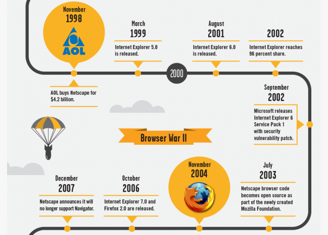
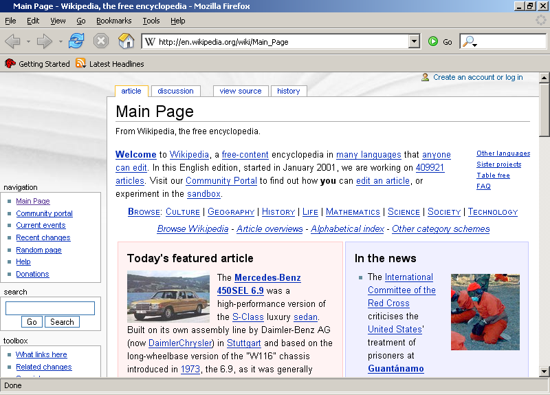
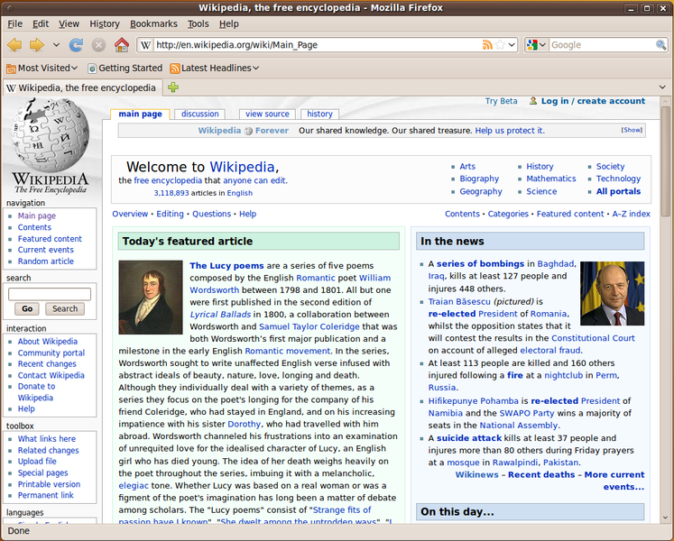
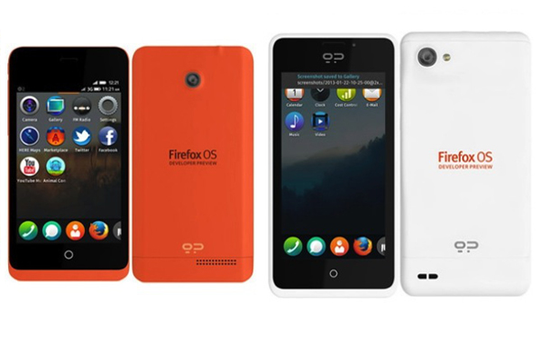

.. include:: <s5defs.txt>

==================================================================
浏览器战争
==================================================================

～浏览器是什么以及为什么...

:Authors: `Zoom.Quiet <zoomquiet+s5@gmail.com>`__
:URL:    http://zoomquiet.org/res/s5/130727-gdgzhgdl/

.. This document has been placed in the CC domain.
.. _Docutils: http://docutils.sourceforge.net/
.. _reStructuredText: http://docutils.sourceforge.net/rst.html
.. _S5: http://meyerweb.com/eric/tools/s5/
.. _Firefox: http://www.mozilla.com/firefox/

.. _Zoom.Quiet:
    http://code.google.com/p/openbookproject/wiki/ZoomQuiet
.. _(CC)by-nc-sa:
    http://creativecommons.org/licenses/by-nc-sa/2.5/cn/
.. _FireFox:
    http://www.mozilla.com/firefox/
.. _S5介绍:
    http://zoomquiet.org/res/s5/100826-PyTDD/s5.html
.. _WYTIWYG:
    http://wiki.woodpecker.org.cn/moin/WyTiWyG
.. _GSoC:
    http://www.google-melange.com/gsoc/homepage/google/gsoc2013

.. 图片定义区
.. |zqeye| image:: i/id/zoomquiet_1-1_outline.png
   :alt: 是也乎;-)
   :target: http://wiki.woodpecker.org.cn/moin/ZoomQuiet

.. |lbtc| image:: i/id/lb-logo.png
   :alt: 猎豹浏览器
   :target: http://skin.liebao.cn/

.. |zhgdg| image:: i/id/gdgzh_icon_v2_80x80.png
   :target: http://www.chinagdg.com/thread-1650-1-1.html
.. |pycon| image:: i/logo/pycon2012china-lo​go-2-h80.png
   :target: http://cn.pycon.org

.. |cc-byncsa31| image:: i/icon/cc-byncnd-88x31.png
   :alt: (CC)by-nc-sa 许可证
   :target: http://creativecommons.org/licenses/by-nc-sa/2.5/cn/
.. |cc-byncsa15| image:: i/icon/cc-byncnd-80x15.png
   :alt: (CC)by-nc-sa 许可证
   :target: http://creativecommons.org/licenses/by-nc-sa/2.5/cn/

.. |lr_s5| image:: pix/levelradar_s5.png
    :scale: 100%

.. |bullet| unicode:: U+02022
.. |mode| unicode:: U+00D8 .. capital o with stroke

.. |S5icon| image:: pix/S5icon.GIF
    :align: top
    :scale: 100%
    :target: http://www.meyerweb.com/eric/tools/s5/
.. |LeoProse| image:: pix/LeoProse.gif
    :align: top
    :scale: 100 %
    :target: http://wiki.woodpecker.org.cn/moin/LeoEnvironment

.. footer:: 

   `Zoom.Quiet`_ v13.10.01 |cc-byncsa15| 推荐用 `FireFox`_ 获得最佳游览效果

<免责/>
=========

.. container:: handout

   山寨的，非业界公认的，个人体验为基础!
   |zqeye|

.. class:: takahashi1

    参考所有同好行为总结而得
        - 一切资料来自网络互动挖掘
        - 一切想法来自日常学习工作
        - 一切体悟来自各种沟通交流
        - 一切知识来自社区分享印证
        - 一切经验来自个人失败体验
    

高橋流!
=========

.. container:: handout

   `Takahashi-method 幻灯风格 <http://blog.derjohng.com/2006/04/12/takahashi-method-%E7%B0%A1%E5%A0%B1/>`__ 
   源自 Ruby 创始人高橋征義(Masayoshi Takahashi)

.. class:: center

    .. image:: pix/Takahashi-method.jpg
        :scale: 150 %
        :height: 300px
        :alt: 高橋流
        :align: center
        :target: http://blog.derjohng.com/2006/04/12/takahashi-method-%E7%B0%A1%E5%A0%B1/

文字
=========

.. container:: handout

   `Takahashi-method 幻灯风格 <http://blog.derjohng.com/2006/04/12/takahashi-method-%E7%B0%A1%E5%A0%B1/>`__ 
   源自 Ruby 创始人高橋征義(Masayoshi Takahashi)

.. class:: center takahashi9

    巨大

幻灯
=========

.. container:: handout

   `Takahashi-method 幻灯风格 <http://blog.derjohng.com/2006/04/12/takahashi-method-%E7%B0%A1%E5%A0%B1/>`__ 
   源自 Ruby 创始人高橋征義(Masayoshi Takahashi)

.. class:: center takahashi9

    很多

播放
=========

.. container:: handout

   `Takahashi-method 幻灯风格 <http://blog.derjohng.com/2006/04/12/takahashi-method-%E7%B0%A1%E5%A0%B1/>`__ 
   源自 Ruby 创始人高橋征義(Masayoshi Takahashi)

.. class:: center takahashi9

    快!

播放
=========

.. container:: handout

   `Takahashi-method 幻灯风格 <http://blog.derjohng.com/2006/04/12/takahashi-method-%E7%B0%A1%E5%A0%B1/>`__ 
   源自 Ruby 创始人高橋征義(Masayoshi Takahashi)

.. class:: center takahashi8

    很快!

播放
=========

.. container:: handout

   `Takahashi-method 幻灯风格 <http://blog.derjohng.com/2006/04/12/takahashi-method-%E7%B0%A1%E5%A0%B1/>`__ 
   源自 Ruby 创始人高橋征義(Masayoshi Takahashi)

.. class:: center takahashi7

    非常快!

所以:
=========

.. container:: handout

   `Takahashi-method 幻灯风格 <http://blog.derjohng.com/2006/04/12/takahashi-method-%E7%B0%A1%E5%A0%B1/>`__ 
   源自 Ruby 创始人高橋征義(Masayoshi Takahashi)

.. class:: center takahashi10

    :orange:`听`

<brief/>
=========

.. container:: handout

   最想跟同学们吼的... |zqeye|

.. class:: takahashi

    - :orange:`5' 有关ZQ`
    - :silver:`15' 浏览器的过去`
    - :silver:`15' 浏览器的现在`
    - :silver:`15' 未来的浏览器`
    - :silver:`15' 自由吐糟`

.. container:: notes

   - 

<Zoom.Quiet>
==================

.. container:: handout

   |zqeye|

.. class:: takahashi

    .. image:: i/id/100514-zq-eye.png
        :align: center
        :scale: 80 %
        :alt: 是也乎,是也乎

    .. image:: i/map/50ren-ZoomQuiet-s5-v800.png
        :align: center
        :scale: 100 %
        :alt: Zoom.Quiet
        :target: http://zoomquiet.org

.. container:: notes

   - 

是也乎
==================

.. container:: handout

   |zqeye|

.. class:: takahashi8

    奔四

.. container:: notes

   - 

广告@常州
==================

.. container:: handout

   大学时代入错行，浪费两年;-{ |zqeye|

.. class:: takahashi8

    1999

.. container:: notes

   - 

开发@上海
==================

.. container:: handout

   战上海:HTML->JS->PHP->XSL->Py |zqeye|

.. class:: takahashi8

    ~2004

.. container:: notes

   - 

`2003:CZUG.org <http://czug.org/>`__
======================================================

.. container:: handout

   learnning Zope/Plone... |zqeye|

.. class:: takahashi1

    - **C** hina
    - **Z** ope
    - **U** ser
    - **G** roup

    .. image:: i/logo/logo-czug.png
        :align: center
        :alt: http://czug.org

.. container:: notes

   - 

`2004:啄木鸟 <http://www.woodpecker.org.cn/>`__
=================================================

.. container:: handout

   admin. MoinMoin 1.2.4... |zqeye|

.. class:: center

    .. image:: i/logo/logo-wpwww_banner.png
        :align: center
        :alt: http://www.woodpecker.org.cn

    - |logo_wpwiki_banner| \ :sup:`MoinMoin 1.4.*`\    
    - |wiki_banner| \ :sup:`MoinMoin 1.7.*`\    
    - |wp_zoomq_scrot| \ :sup:`MoinMoin 1.9.*`\

.. |logo_wpwiki_banner| image:: i/logo/logo_wpwiki_banner.gif
    :align: bottom
    :alt: http://www.woodpecker.org.cn

.. |wiki_banner| image:: i/logo/logo_wp-wiki_banner.png
    :align: bottom
    :alt: http://wiki.woodpecker.org.cn

.. |wp_zoomq_scrot| image:: i/logo/logo_wiki-wp_zoomq_scrot.png
    :align: bottom
    :scale: 100 %
    :alt: http://wiki,woodpecker.org.cn

.. container:: notes

   - 

PI@北京
==================

.. container:: handout

   混北京:SINA->CPyUG->SLL |zqeye|

.. class:: takahashi8

    ~2007

.. container:: notes

   - 

2005:`CPyUG`__-> BPyUG
======================================================

__ http://wiki.woodpecker.org.cn/moin/BPUG/2005-07-30
.. container:: handout

   working with Python,in SINA.com |zqeye|

.. class:: takahashi1

    .. image:: i/logo/120201-CPyUG-logo-v2.png
        :align: center
        :height: 500px
        :alt: CPyUG
        :target: http://wiki.woodpecker.org.cn/moin/CPUG

.. container:: notes

   - BPUG-logo-v1.3.png

2005:`CPyUG`__-> BPyUG
======================================================

__ http://wiki.woodpecker.org.cn/moin/BPUG/2005-07-30
.. container:: handout

   working with Python,in SINA.com |zqeye|

.. class:: takahashi1

    .. image:: i/logo/BPUG-logo-v1.2.png
        :align: center
        :height: 400px
        :alt: BPUG
        :target: http://wiki.woodpecker.org.cn/moin/BPUG

.. container:: notes

   - BPUG-logo-v1.3.png

2007:`ZPyUG`__
======================================================

__ http://wiki.woodpecker.org.cn/moin/ZPyUG

.. container:: handout

    - 在北京,主持完成了25次技术分享
    - 进入金山,使用Python 进行了各种平台的构建~ `KTRAC`__
    - spreading Python everywhere to everyone... 

__ http://py.kingsoft.net/ktrac

.. class:: takahashi1

    - **珠** 三角
    - **P** ython
    - **U** ser
    - **G** roup

    .. image:: i/logo/logo_163_game.gif
        :align: center
    .. image:: i/logo/logo_sina_home.gif
        :align: center
    .. image:: i/logo/logo-ks.jpg
        :align: center

.. container:: notes

   - 

`ECUG.org`__
======================================================

__ http://ecug.org/
.. container:: handout

   spreading Python everywhere to everyone... |zqeye|

.. class:: takahashi1

    .. image:: i/logo/ecug-logo_67bw.jpg
        :align: center
        :scale: 100 %
        :alt: ECUG
        :target: http://code.google.com/p/ecug/wiki/FrontPage

.. container:: notes

   - 

2008:|SLL.org| "SLL.org"
======================================================

.. container:: handout

   spreading Pythonic everywhere to everyone... |zqeye|

.. class:: takahashi4

    教育大发现

.. class:: takahashi2 center

    http://sociallearnlab.org/

.. |SLL.org| image:: i/logo/2018-gz-sll.png
    :scale: 100 %
    :alt: SLL
    :target: http://sociallearnlab.org/wiki/index.php?title=EduAnn2018&variant=zh-cn

.. container:: notes

   - 

2009-09-01 出版
======================================================

.. container:: handout

   - 将多年的体验,集中到一本入门图书 "可爱的Python"
   - 并主持ZPyUG 近10次技术分享  |zqeye|

.. class:: takahashi1

    .. image:: i/090902-lovpy.jpg
        :align: center
        :alt: 可愛的Python
        :target: http://book.douban.com/subject/3884108/

.. container:: notes

   - snap4ZQMBP_apac2010.png

2010~
======================================================

.. container:: handout

   社区在不断发展... |zqeye|

.. class:: takahashi1

    .. image:: i/snap/cpug-ml-zoomq-2010-06-04-111017_628x701_scrot.png
        :align: center
        :height: 700px
        :alt: python-cn@googlegroups.com
        :target: http://groups-beta.google.com/group/python-cn

.. container:: notes

   - snap4ZQMBP_apac2010.png

亚太PyCon
======================================================

.. container:: handout

   首次出国... |zqeye|

.. class:: takahashi1

    .. image:: i/snap/snap4ZQMBP_apac2010.png
        :align: center
        :height: 600px
        :alt: python-cn@googlegroups.com
        :target: http://wiki.woodpecker.org.cn/moin/PyCon2010

.. container:: notes

   - snap4ZQMBP_apac2010.png

PyCon2011China
======================================================

.. container:: handout

   首次PyCon 落地中国... |zqeye|

.. class:: takahashi1

    .. image:: i/snap/snap4ZQMBP_pycon2011cn.png
        :align: center
        :alt: python-cn@googlegroups.com
        :target: http://cn.pycon.org/2011

.. container:: notes

   - snap4ZQMBP_pycon2011cn.png

~2012
======================================================

.. container:: handout

   社区在不断发展... |zqeye|

.. class:: takahashi1

    .. image:: i/snap/121023-python-cn-1kmailer.png
        :align: center
        :height: 600px
        :alt: python-cn@googlegroups.com
        :target: http://groups-beta.google.com/group/python-cn

.. container:: notes

   - snap4ZQMBP_pycon2011cn.png

PyCon2012ChinA
======================================================

.. container:: handout

   首次 PyCon中国双城市联办... |zqeye|

.. class:: takahashi1

    .. image:: i/snap/snap4ZQMBP_pycon2012cn.png
        :align: center
        :alt: python-cn@googlegroups.com
        :target: http://cn.pycon.org/2011

.. container:: notes

   - snap4ZQMBP_pycon2011cn.png

过一万人!
======================================================

.. container:: handout

   121024首次 Hackathon 前! |zqeye|

.. class:: takahashi1

    .. image:: i/snap/121024-python-cn-10000.png
        :align: center
        :height: 600px
        :alt: python-cn@googlegroups.com
        :target: http://groups-beta.google.com/group/python-cn

.. container:: notes

   - snap4ZQMBP_pycon2011cn.png

~2013
======================================================

.. container:: handout

   Groups也是... |zqeye|

.. class:: takahashi1

    .. image:: i/snap/snap4ZQMBP_130426_17.24.35.png
        :align: center
        :height: 500px
        :alt: python-cn@googlegroups.com
        :target: http://groups-beta.google.com/group/python-cn

.. container:: notes

   - 

~2013
======================================================

.. container:: handout

   不准的统计!... |zqeye|

.. class:: takahashi1

    .. image:: i/snap/snap4ZQMBP_130426_17.24.45.png
        :align: center
        :height: 500px
        :alt: python-cn@googlegroups.com
        :target: http://groups-beta.google.com/group/python-cn

.. container:: notes

   - 

`珠海GDG <http://www.chinagdg.com/thread-1329-1-1.html>`_
========================================================================

.. container:: handout

   Google Developer Group... |zhgdg|

.. class:: takahashi1

    .. image:: i/logo/ZH_GDG_Logo_b_h100.png
        :align: center
        :height: 200px
        :alt: ECUG
        :target: http://code.google.com/p/ecug/wiki/FrontPage

.. container:: notes

   - 2013-09-14 13-03-12-MOTION.gif

`珠海GDG <http://www.chinagdg.com/thread-1329-1-1.html>`_
========================================================================

.. container:: handout

   DevFest2013 |zhgdg|

.. class:: takahashi1

    .. image:: i/2013-09-14_13-03-12-MOTION.gif
        :align: center
        :height: 500px
        :alt: GDG
        :target: http://gplus.to/gdgzh

.. container:: notes

   - 2013-09-14 13-03-12-MOTION.gif

综上...
==================

.. container:: handout

   基调是分享交流;-} |zqeye|

.. class:: takahashi

    俺就一

    `社区大妈`__

__ http://wiki.woodpecker.org.cn/moin/ZoomQuiet

.. container:: notes

   - 

综上...
==================

.. container:: handout

   ;-} |zqeye|

.. class:: takahashi8

    最大

    成就

.. container:: notes

   - 

牛妞
==================

.. container:: handout

   \\ (^o^) / 596d

.. image:: i/foto/110105nn596d.jpg
    :align: center
    :height: 600px
    :alt: 表情牛妞

.. container:: notes

   - 我的女儿刚刚一岁半,非常牛,,,脾气牛,头脑牛,虽然不会说话,但是已经能指挥我们干活了...
   - 120426-niuniu-表情帝

牛妞
==================

.. container:: handout

   \\ (^o^) / 1096d

.. image:: i/foto/120426nn1096d-表情帝.jpg
    :align: center
    :height: 600px
    :alt: 表情牛妞

.. container:: notes

   - 我的女儿刚刚一岁半,非常牛,,,脾气牛,头脑牛,虽然不会说话,但是已经能指挥我们干活了...
   - 131011_nn1595d-princess.jpg

牛妞
==================

.. container:: handout

   \\ (^o^) / 1595d

.. image:: i/foto/131011_nn1595d-princess.jpg
    :align: center
    :height: 700px
    :alt: 公主牛

.. container:: notes

   - 我的女儿刚刚一岁半,非常牛,,,脾气牛,头脑牛,虽然不会说话,但是已经能指挥我们干活了...
   - 131011_nn1595d-princess.jpg

</Zoom.Quiet>
==================

.. container:: handout

    - 纯种Pythoner，自由软件原教旨主义者 
    - 关注社会化教育及知识管理；喜爱SF和摄影。 
    - 尝试使用Pythonic体验感化国人主动进入自由软件世界体验/学习/再创作

.. class:: takahashi8

   (^.^)

.. container:: notes

   - 

<brief/>
=========

.. container:: handout

    最想跟同学们吼的... |zqeye|

.. class:: takahashi

    - :gray:`5' 有关ZQ`
    - :orange:`15' 浏览器的过去`
    - :silver:`15' 浏览器的现在`
    - :silver:`15' 未来的浏览器`
    - :silver:`15' 自由吐糟`

.. container:: notes

   - 

什么是浏览器?
==================

.. container:: handout

   `What Browser? – Google <http://www.whatbrowser.org/>`_  |lbtc|

.. image:: i/snap/snap4ZQMBP_131009_whatbrowser.png
    :align: center
    :height: 300px
    :alt: whatbrowser

.. container:: notes

   - Google 注意到大众已经完全不知道什么是浏览器了

`Browser wars`_
==================

.. _Browser wars: http://en.wikipedia.org/wiki/Browser_wars

.. container:: handout

    一切都不祥合... |lbtc|

.. class:: takahashi7

    浏览器
    
    战争

.. container:: notes

   - WorldWideWeb_FSF_GNU.png

战争之前
==================

.. container:: handout

    WorldWideWeb->Nexus 是的就是Jobs 领导下的 NeXTSTEP... |lbtc|

.. class:: takahashi7

.. image:: i/snap/WorldWideWeb_FSF_GNU.png
    :align: center
    :height: 500px
    :alt: WorldWideWeb
    
.. container:: notes

   - WorldWideWeb_FSF_GNU.png

战争之前
==================

.. container:: handout

    Lynx 猞猁 |lbtc|

.. class:: takahashi7

    
.. container:: notes

    Foteos Macrides and members of the lynx-dev list have developed and supported Lynx since release of v2.3 in May 1994.
    The Lynx2-3FM code set was released as v2.4 in June 1995.
    The Lynx2-4FM code set was released as v2.5 in May 1996.
    The Lynx2-5FM code set was released as v2.6 in September 1996.
    The Lynx2-6FM code set was released as v2.7 in February 1997.
    The v2-7FM code set was released as v2.7.1 in April 1997.
    The v2-7-1FM code set was released as v2.7.2 in January 1998.
    The 2.7.1 development set was released as v2.8 in March 1998.
    The 2.8 development set was released as v2.8.1 in October 1998.
    The 2.8.1 development set was released as v2.8.2 in June 1999.
    The 2.8.2 development set was released as v2.8.3 in April 2000.
    The 2.8.3 development set was released as v2.8.4 in July 2001.
    The 2.8.4 development set was released as v2.8.5 in February 2004.
    The 2.8.5 development set was released as v2.8.6 in October 2006.
    The 2.8.6 development set was released as v2.8.7 in July 2009.
    
战争之前
==================

.. container:: handout

    Mosaic->Netscape Navigator |lbtc|

.. class:: takahashi7

.. image:: i/snap/NCSA_Mosaic.PNG
    :align: center
    :height: 500px
    :alt: WorldWideWeb
    

.. container:: notes

   - WorldWideWeb_FSF_GNU.png

IE 3.0
==================

.. container:: handout

    v1.0 完全上不了台 |lbtc|

.. class:: takahashi7

.. image:: i/snap/Internet_Explorer_1.0.png
    :align: center
    :height: 500px
    :alt: WorldWideWeb
    
.. container:: notes

   - WorldWideWeb_FSF_GNU.png

Browser war I
==================

.. container:: handout

    1995~1998 |lbtc|

.. class:: takahashi7

.. container:: notes

   - WorldWideWeb_FSF_GNU.png

Mosaic 3
==================

.. container:: handout

    Mosaic->Netscape Navigator |lbtc|

.. class:: takahashi7

.. image:: i/snap/Mosaic-v3-screenshot.PNG
    :align: center
    :height: 500px
    :alt: WorldWideWeb
    

.. container:: notes

   - WorldWideWeb_FSF_GNU.png

Netscape Navigator
====================================

.. container:: handout

    Mosaic->伊利诺伊大学->Netscape Navigator |lbtc|

.. class:: takahashi7

.. image:: i/snap/Netscape_Navigator.png
    :align: center
    :height: 500px
    :alt: WorldWideWeb
    

.. container:: notes

   - Mosaic公司成立后，由于伊利诺伊大学拥有Mosaic的商标版权，开发团队必须彻底重新撰写浏览器代码，且浏览器名称更改为Netscape Navigator

IE 3.0
==================

.. container:: handout

    ... |lbtc|

.. class:: takahashi7

    
.. container:: notes

   - WorldWideWeb_FSF_GNU.png

浏览器战争
==================

.. container:: handout

    时间线 |lbtc|

.. class:: takahashi7

.. image:: i/snap/bwar-timeline-1.png
    :align: center
    :height: 500px
    :alt: WorldWideWeb
    
.. container:: notes

   - WorldWideWeb_FSF_GNU.png

IE 4.0
==================

.. container:: handout

    ... |lbtc|

.. class:: takahashi7

.. image:: i/snap/Internet_Explorer_4.png
    :align: center
    :height: 500px
    :alt: WorldWideWeb
    
.. container:: notes

   - WorldWideWeb_FSF_GNU.png

AOL收购Netscape
==================

.. container:: handout

    ... |lbtc|

.. class:: takahashi7

    
.. container:: notes

   - WorldWideWeb_FSF_GNU.png

Mozilla
==================

.. container:: handout

    ... |lbtc|

.. class:: takahashi7

    
.. container:: notes

   - WorldWideWeb_FSF_GNU.png

Mozilla 之书
==================

.. container:: handout

    1994年12月10日 |lbtc|

.. class:: takahashi7

    
.. container:: notes

   - WorldWideWeb_FSF_GNU.png

Mozilla 之书
==================

.. container:: handout

    1994年12月10日 |lbtc|

.. class:: takahashi7

    
.. container:: notes

   - WorldWideWeb_FSF_GNU.png

Browser war II
==================

.. container:: handout

    ... |lbtc|

.. class:: takahashi7

    

.. container:: notes

   - WorldWideWeb_FSF_GNU.png

Browser war 2006
==================

.. container:: handout

    ... |lbtc|

.. class:: takahashi7

    

.. container:: notes

   - WorldWideWeb_FSF_GNU.png

Browser war 2006
==================

.. container:: handout

    ... |lbtc|

.. class:: takahashi7

.. image:: i/snap/browser2006.jpg
    :align: center
    :height: 400px
    :alt: WorldWideWeb
    

.. container:: notes

   - WorldWideWeb_FSF_GNU.png

Firefox 1.0
==================

.. container:: handout

    ... |lbtc|

.. class:: takahashi7

    
.. container:: notes

   - WorldWideWeb_FSF_GNU.png

Firefox 1.0
==================

.. container:: handout

    ... |lbtc|

.. class:: takahashi7

.. image:: i/snap/Firefox_2.0.0.12.png
    :align: center
    :height: 500px
    :alt: WorldWideWeb
    
.. container:: notes

   - WorldWideWeb_FSF_GNU.png

Firefox 3.5
==================

.. container:: handout

    ... |lbtc|

.. class:: takahashi7

    
.. container:: notes

   - WorldWideWeb_FSF_GNU.png

Firefox 4
==================

.. container:: handout

    ... |lbtc|

.. class:: takahashi7

.. image:: i/snap/Firefox_4.png
    :align: center
    :height: 500px
    :alt: WorldWideWeb
    
.. container:: notes

   - WorldWideWeb_FSF_GNU.png

Firefox Logo
==================

.. container:: handout

    ... |lbtc|

.. class:: takahashi7

.. image:: i/snap/firefox_logo_historic.png
    :align: center
    :height: 500px
    :alt: WorldWideWeb
    
.. container:: notes

   - WorldWideWeb_FSF_GNU.png

IE 7.0
==================

.. container:: handout

    ... |lbtc|

.. class:: takahashi7

.. image:: i/snap/Internet_Explorer_7.png
    :align: center
    :height: 500px
    :alt: WorldWideWeb
    
.. container:: notes

   - WorldWideWeb_FSF_GNU.png

Browser war 2006
==================

.. container:: handout

    ... |lbtc|

.. class:: takahashi7

    

.. container:: notes

   - WorldWideWeb_FSF_GNU.png

Browser war 2008
==================

.. container:: handout

    ... |lbtc|

.. class:: takahashi7

    

.. container:: notes

   - WorldWideWeb_FSF_GNU.png

Browser war III
==================

.. container:: handout

    进入 |lbtc|

.. class:: takahashi7

    

.. container:: notes

   - WorldWideWeb_FSF_GNU.png

Chrome 2008
==================

.. container:: handout

    `Chrome Time Machine <http://www.google.com/intl/en/chrome/timemachine/>`_ |lbtc|

.. class:: takahashi7

    
.. container:: notes

   - WorldWideWeb_FSF_GNU.png

Chrome 2009
==================

.. container:: handout

    `Chrome Time Machine <http://www.google.com/intl/en/chrome/timemachine/>`_ |lbtc|

.. class:: takahashi7

.. image:: i/snap/chrome_2009.png
    :align: center
    :height: 500px
    :alt: WorldWideWeb
    
.. container:: notes

   - WorldWideWeb_FSF_GNU.png

Chrome 2010
==================

.. container:: handout

    `Chrome Time Machine <http://www.google.com/intl/en/chrome/timemachine/>`_ |lbtc|

.. class:: takahashi7

.. image:: i/snap/chrome_2010.png
    :align: center
    :height: 300px
    :alt: WorldWideWeb
    
.. container:: notes

   - WorldWideWeb_FSF_GNU.png

Chrome 2011
==================

.. container:: handout

    `Chrome Time Machine <http://www.google.com/intl/en/chrome/timemachine/>`_ |lbtc|

.. class:: takahashi7

    
.. container:: notes

   - WorldWideWeb_FSF_GNU.png

Chrome 2012
==================

.. container:: handout

    `Chrome Time Machine <http://www.google.com/intl/en/chrome/timemachine/>`_ |lbtc|

.. class:: takahashi7

.. image:: i/snap/chrome_2012.png
    :align: center
    :height: 500px
    :alt: WorldWideWeb
    
.. container:: notes

   - WorldWideWeb_FSF_GNU.png

Firefox 24
==================

.. container:: handout

    ... |lbtc|

.. class:: takahashi7

.. image:: i/snap/Firefox_24_mac_2013.PNG
    :align: center
    :height: 500px
    :alt: WorldWideWeb
    
.. container:: notes

   - WorldWideWeb_FSF_GNU.png

Browser war 2012
==================

.. container:: handout

    ... |lbtc|

.. class:: takahashi7

.. image:: i/snap/browser2012.jpg
    :align: center
    :height: 500px
    :alt: WorldWideWeb
    

.. container:: notes

   - browser_war_usage_tlines.png

Browser war 2013
==================

.. container:: handout

    ... |lbtc|

.. class:: takahashi7

    

.. container:: notes

   - browser_war_usage_tlines.png

IE 9.0
==================

.. container:: handout

    ... |lbtc|

.. class:: takahashi7

.. image:: i/snap/Internet_Explorer_9_zh-hk.png
    :align: center
    :height: 500px
    :alt: WorldWideWeb
    
.. container:: notes

   - ie_june_2013-730x528-665x480

IE 中国
==================

.. container:: handout

    ... |lbtc|

.. class:: takahashi7

.. image:: i/snap/ie_june_2013-730x528-665x480.png
    :align: center
    :height: 500px
    :alt: WorldWideWeb
    
.. container:: notes

   - ie_june_2013-730x528-665x480

内核之战
==================

.. container:: handout

    ... |lbtc|

.. class:: takahashi7

    渲染引擎
    
.. container:: notes

   - WorldWideWeb_FSF_GNU.png

IE及其小伙伴
==================

.. container:: handout

    ... |lbtc|

.. class:: takahashi7

    Trident
    
.. container:: notes

   - WorldWideWeb_FSF_GNU.png

Opera 自个儿
==================

.. container:: handout

    ... |lbtc|

.. class:: takahashi7

    Presto
    
.. container:: notes

   - WorldWideWeb_FSF_GNU.png

Firefox及其小伙伴
====================================

.. container:: handout

    - SeaMonkey
    - Galeon
    - Vimperator
    - ...

.. class:: takahashi7

    Gecko
    
.. container:: notes

   - WorldWideWeb_FSF_GNU.png

WebKit及其大波小伙伴
====================================

.. container:: handout

    - Safari
    - Konqueror
    - Epiphany
    - OmniWeb
    - Midori
    - ..

.. class:: takahashi7

    WebKit
    
.. container:: notes

   - WorldWideWeb_FSF_GNU.png

Chrome及其小伙伴
====================================

.. container:: handout

    - RockMelt
    - Opera
    - Comodo Dragon
    - ...

.. class:: takahashi7

    Blink
    
.. container:: notes

   - WorldWideWeb_FSF_GNU.png

双核
=========

.. container:: handout

   只有中国... |lbtc|

.. class:: incremental

    * 2004.11      Netscape0.56发布，这是首款支持双内核的浏览器
    * 2005  日本的Fenrir公司发布了Sleipnir2，以外挂型式支持双核
    * 2007           Firefox发布了IE Tab扩展（作者：洪任谕）
    * 2008           傲游率先提出双核浏览器概念
    * 2009.12      Google发布Chrome IE Tab扩展
    * 2010.4.8     搜狐公司发布了搜狗高速浏览器2.0正式版
    * 2010.4.23   傲游公司发布了Maxthon3.0.9.10 Beta
    * 2010.5.25   腾讯公司发布QQ浏览器5 preview1
    * 2010.9.15   奇虎360公司发布了360极速浏览器（4.0.1.500）

.. container:: notes

   - 

JS之战
==================

.. container:: handout

    ... |lbtc|

.. class:: takahashi7

    JavaScript
    
    引擎
    
.. container:: notes

   - WorldWideWeb_FSF_GNU.png

Mozilla 的改名游戏
==================

.. container:: handout

    - TraceMonkey 
    - JaegerMonkey
    - IonMonkey
    - OdinMonkey

.. class:: takahashi

    SpiderMonkey
    
.. container:: notes

   - WorldWideWeb_FSF_GNU.png

IE 自个儿
==================

.. container:: handout

    Chakra  |lbtc|

.. class:: takahashi7

    查克拉
    
.. container:: notes

   - WorldWideWeb_FSF_GNU.png

Opera 自个儿
====================================

.. container:: handout

    ... |lbtc|

.. class:: takahashi7

    Carakan
    
.. container:: notes

   - WorldWideWeb_FSF_GNU.png

Google 及其大波小伙伴
====================================

.. container:: handout

    催生出了 Node.js |lbtc|

.. class:: takahashi7

    :orange:`V8`
    
.. container:: notes

   - Chrome的成功也离不开它背后的天才——Lars Bak。Lars Bak的工作履历里绝大部分都是虚拟机相关的工作，在开发V8之前，他曾经在Sun公司工作，担任HotSpot团队的技术领导，主要致力开发高性能的Java虚拟机。再之前，他也曾为Self、Smalltalk语言开发过高性能虚拟机。这些无与伦比的经历让V8一出世就超越了当时的所有JavaScript虚拟机。

<brief/>
=========

.. container:: handout

    最想跟同学们吼的... |zqeye|

.. class:: takahashi

    - :gray:`5' 有关ZQ`
    - :gray:`15' 浏览器的过去`
    - :orange:`15' 浏览器的现在`
    - :silver:`15' 未来的浏览器`
    - :silver:`15' 自由吐糟`

.. container:: notes

   - 

什么是浏览器?
==================

.. container:: handout

   `What Browser? – Google <http://www.whatbrowser.org/>`_  |lbtc|

.. image:: i/snap/snap4ZQMBP_131009_whatbrowser.png
    :align: center
    :height: 300px
    :alt: whatbrowser

.. container:: notes

   - Google 注意到大众已经完全不知道什么是浏览器了

为毛
==================

.. container:: handout

    ... |lbtc|

.. class:: takahashi7

    战为何?!
    
.. container:: notes

   - ..

改变一切的技术
====================================

.. container:: handout

    Asynchronous JavaScript and XML（以及 DHTML 等）的缩写 |lbtc|

.. class:: takahashi7

    Ajax
    
.. container:: notes

   - 老技术，新技巧

网络世界
====================================

.. container:: handout

    原先很纯朴 |lbtc|

.. class:: takahashi7

    Ajax之前
    
.. container:: notes

   - 

WWW一点也不万维
====================================

.. container:: handout

    网页 |lbtc|

.. class:: takahashi7

    web
    
.. container:: notes

   - 

WWW一点也不万维
====================================

.. container:: handout

    网页只能 |lbtc|

.. class:: takahashi7

    截屏
    
.. container:: notes

   - 

WWW一点也不万维
====================================

.. container:: handout

    网页只能 |lbtc|

.. class:: takahashi7

    文章
    
.. container:: notes

   - 

WWW一点也不万维
====================================

.. container:: handout

    网页只能 |lbtc|

.. class:: takahashi7

    图片?
    
.. container:: notes

   - 

WWW一点也不万维
====================================

.. container:: handout

    网页只能 |lbtc|

.. class:: takahashi7

    BBS
    
.. container:: notes

   - 

曾经的尝试
====================================

.. container:: handout

    网页只能 |lbtc|

.. class:: takahashi

    JavaApplet
    
.. container:: notes

   - 

曾经的尝试
====================================

.. container:: handout

    网页只能 |lbtc|

.. class:: takahashi7

    Flash
    
.. container:: notes

   - 

Flash
====================================

.. container:: handout

    网页有限丰富 |lbtc|

.. class:: takahashi7

    小动画
    
.. container:: notes

   - 

Flash
====================================

.. container:: handout

    网页有限丰富 |lbtc|

.. class:: takahashi7

    小游戏
    
.. container:: notes

   - 

Flash
====================================

.. container:: handout

    尝试过全站Flash 的高度交互式网站 |lbtc|

.. class:: takahashi7

    交互式
    
    截屏
    
.. container:: notes

   - 

Flash灭!
====================================

.. container:: handout

    当然,还有你懂的原因... |lbtc|

.. class:: takahashi7

    慢!
    
.. container:: notes

   - 

网络世界
====================================

.. container:: handout

    复杂起来 |lbtc|

.. class:: takahashi7

    Ajax之后
    
.. container:: notes

   - 

WWW开始万维
====================================

.. container:: handout

    网页应用化 |lbtc|

.. class:: takahashi7

    :orange:`S`\ aa\ :orange:`S`
    
.. container:: notes

   - 

WWW开始万维
====================================

.. container:: handout

    网页可以 |lbtc|

.. class:: takahashi7

    邮件
    
.. container:: notes

   - 

WWW开始万维
====================================

.. container:: handout

    网页可以 |lbtc|

.. class:: takahashi7

    PS
    
.. container:: notes

   - 

WWW开始万维
====================================

.. container:: handout

    网页可以 |lbtc|

.. class:: takahashi7

    Office
    
.. container:: notes

   - 

WWW开始万维
====================================

.. container:: handout

    网页可以 |lbtc|

.. class:: takahashi7

    购物
    
.. container:: notes

   - 

WWW开始万维
====================================

.. container:: handout

    网页可以 |lbtc|

.. class:: takahashi7

    游戏
    
.. container:: notes

   - 

WWW开始万维
====================================

.. container:: handout

    网页可以 |lbtc|

.. class:: takahashi7

    视频
    
.. container:: notes

   - 

WWW开始万维
====================================

.. container:: handout

    网页可以 |lbtc|

.. class:: takahashi7

    etc\ :orange:`.`
    
.. container:: notes

   - 

大趋势
====================================

.. container:: handout

    网页/站 |lbtc|

.. class:: takahashi7

    软件化
    
.. container:: notes

   - 

Browser War III
====================================

.. container:: handout

    在移动端 |lbtc|

.. class:: takahashi7

    web\ :orange:`vs`\ app
    
.. container:: notes

   - 

app优势
====================================

.. container:: handout

    原生 |lbtc|

.. class:: takahashi7

    快
    
.. container:: notes

   - 

app问题
====================================

.. container:: handout

    复杂/兼容 |lbtc|

.. class:: takahashi7

    慢
    
.. container:: notes

   - 

web优势
====================================

.. container:: handout

    跨平台/无升级 |lbtc|

.. class:: takahashi7

    快
    
.. container:: notes

   - 

web问题
====================================

.. container:: handout

    平台兼容/网络 |lbtc|

.. class:: takahashi7

    慢
    
.. container:: notes

   - 

兼顾?!
====================================

.. container:: handout

    so Naive |lbtc|

.. class:: takahashi7

    混合
    
.. container:: notes

   - 

兼顾?!
====================================

.. container:: handout

    so Naive |lbtc|

.. class:: takahashi7

    所以
    
.. container:: notes

   - 

兼顾?!
==================

.. container:: handout

    `Chrome Time Machine <http://www.google.com/intl/en/chrome/timemachine/>`_ |lbtc|

.. class:: takahashi7

.. image:: i/snap/chrome_os_2012.png
    :align: center
    :height: 500px
    :alt: WorldWideWeb
    
.. container:: notes

   - WorldWideWeb_FSF_GNU.png

硬件!
====================================

.. container:: handout

    Chrome 的布局 |lbtc|

.. class:: takahashi7

.. image:: i/snap/chrome_book.png
    :align: center
    :height: 500px
    :alt: WorldWideWeb
        
.. container:: notes

   - chrome_book.png

兼顾?!
====================================

.. container:: handout

    2012.7.2 正式发布 |lbtc|

.. class:: takahashi7

                
.. container:: notes

   - 

硬件
====================================

.. container:: handout

    第一个Firefox OS设备将由TCL、Alcatal One Touch和中兴制造，使用高通的Snapdragon处理器 |lbtc|

.. class:: takahashi7

.. container:: notes

   - 

什么是浏览器?
==================

.. container:: handout

   `What Browser? – Google <http://www.whatbrowser.org/>`_  |lbtc|

.. image:: i/snap/snap4ZQMBP_131009_whatbrowser.png
    :align: center
    :height: 300px
    :alt: whatbrowser

.. container:: notes

   - Google 注意到大众已经完全不知道什么是浏览器了

未来是浏览器的!
==================

.. container:: handout

   `What Browser? – Google <http://www.whatbrowser.org/>`_  |lbtc|

.. class:: incremental

    * ①新设备和操作界面层出不穷，为每个系统单独开发一个APP，越来越不现实
    * ②大多数应用没必要调用系统API，比如天气预报
    * ③不必安装，升级瞬间完成
    * ④不断增加的各种功能，使得HTML5已接近原生软件的体验

.. container:: notes

   - 

<brief/>
=========

.. container:: handout

    最想跟同学们吼的... |zqeye|

.. class:: takahashi

    - :gray:`5' 有关ZQ`
    - :gray:`15' 浏览器的过去`
    - :gray:`15' 浏览器的现在`
    - :orange:`15' 未来的浏览器`
    - :silver:`15' 自由吐糟`

.. container:: notes

   - 

我们都是
==================

.. container:: handout

    是也乎 |lbtc|

.. class:: takahashi7

    不\ :orange:`折腾`\ 要死星人

.. container:: notes

   - 

可扩展
==================

.. container:: handout

    Chrome的扩展架构 |lbtc|

.. image:: i/snap/crx_working_flow.png
    :align: center
    :height: 400px
    :alt: whatbrowser
    
    
.. container:: notes

   - Mentor

可扩展
==================

.. container:: handout

    Chrome的扩展形态 |lbtc|

.. class:: takahashi7

    Plugin

.. container:: notes

   - Mentor

可扩展
==================

.. container:: handout

    Chrome的扩展形态 |lbtc|

.. class:: takahashi7

    script

.. container:: notes

   - Mentor

可扩展
==================

.. container:: handout

    也叫 Add-on |lbtc|

.. class:: takahashi7

    Extensions

.. container:: notes

   - Mentor

可扩展
==================

.. container:: handout

    Chrome的扩展形态 |lbtc|

.. class:: takahashi7

    Themes

.. container:: notes

   - Mentor

Extensions形式
==================

.. container:: handout

    Browser action |lbtc|

    
.. container:: notes

   - Mentor

Extensions形式
==================

.. container:: handout

    POP |lbtc|

    
.. container:: notes

   - Mentor

Extensions形式
==================

.. container:: handout

    Page action |lbtc|

    
.. container:: notes

   - Mentor

Extensions形式
==================

.. container:: handout

    Page action POP |lbtc|

    
.. container:: notes

   - Mentor

Extensions形式
==================

.. container:: handout

    Content script |lbtc|

    

.. container:: notes

   - Mentor

猎豹浏览器
==================

.. container:: handout

    我们的布局! |lbtc|

.. class:: takahashi7

    截屏

.. container:: notes

   - Mentor

猎豹浏览器
==================

.. container:: handout

    我们的布局! |lbtc|

.. class:: takahashi7

    手机截屏

.. container:: notes

   - Mentor

猎豹浏览器
==================

.. container:: handout

    我们的布局! |lbtc|

.. class:: takahashi7

    平板截屏

.. container:: notes

   - Mentor

是Chrome的伙伴
==================

.. container:: handout

    v26核 |lbtc|

.. class:: takahashi7

    Chromium

.. container:: notes

   - Mentor

猎豹浏览器皮肤
==================

.. container:: handout

    丰富的定制 |lbtc|

.. class:: takahashi7

    配置截屏

.. container:: notes

   - Mentor

猎豹浏览器皮肤
==================

.. container:: handout

    丰富的定制 |lbtc|

.. class:: takahashi7

    细节截屏

.. container:: notes

   - Mentor

猎豹浏览器皮肤
==================

.. container:: handout

    丰富的定制 |lbtc|

.. class:: takahashi7

    细节截屏2

.. container:: notes

   - Mentor

猎豹浏览器皮肤
==================

.. container:: handout

    丰富的定制 |lbtc|

.. class:: takahashi7

    细节截屏3

.. container:: notes

   - Mentor

Show出你的猎豹范儿
====================================

.. container:: handout

    丰富的定制 |lbtc|

.. class:: takahashi7

    皮肤大赛

.. container:: notes

   - Mentor

Show出你的猎豹范儿
====================================

.. container:: handout

    你的范儿! |lbtc|

.. class:: takahashi7

    求创意

.. container:: notes

   - Mentor

Show出你的猎豹范儿
====================================

.. container:: handout

    大奖励 |lbtc|

.. class:: takahashi7

    Smart照片

.. container:: notes

   - Mentor

Show出你的猎豹范儿
====================================

.. container:: handout

    专项奖品 |lbtc|

.. class:: takahashi7

    重学生

.. container:: notes

   - Mentor

<brief/>
=========

.. container:: handout

    最想跟同学们吼的... |zqeye|

.. class:: takahashi

    - :gray:`5' 有关ZQ`
    - :gray:`15' 浏览器的过去`
    - :gray:`15' 浏览器的现在`
    - :gray:`15' 未来的浏览器`
    - :orange:`15' 自由吐糟`

.. container:: notes

   - 

我们都是
==================

.. container:: handout

    是也乎 |lbtc|

.. class:: takahashi7

    不\ :orange:`折腾`\ 要死星人

.. container:: notes

   - 

Volunteer
==================

.. container:: handout

    社区的肉体! |lbtc|

.. class:: takahashi7

    :orange:`志愿`

.. container:: notes

   - Mentor

Volunteer: spreader
====================================

.. container:: handout

    线上/下 传播 |lbtc|

.. class:: takahashi7

    :orange:`宣传!`

.. container:: notes

   - Mentor

Volunteer: designer
====================================

.. container:: handout

    各种创意... |lbtc|

.. class:: takahashi7

    :orange:`设计!`

.. container:: notes

   - Mentor

总之
=========

.. container:: handout

   期望可以记住的~单位时间可以记住的只有7+-2 个 |zqeye|

.. class:: incremental takahashi

    * 浏览器由来久矣
    * 浏览器已经是互联网核心入口
    * 浏览器是移动应用的未来平台
    * 从皮肤扩展人手体验现代浏览器技术
    * 猎豹皮肤大赛你值得掺合!

.. container:: notes

   - 

<版本/>
=========

.. container:: handout

   |lbtc|

- 131001 构思

:反馈:
    zoomquiet+s5@gmail.com
:查阅:
    http://zoomquiet.org/res/s5/130727-gdgzhgdl

`S5 <http://www.meyerweb.com/eric/tools/s5/>`__
==============================================================================================

.. container:: handout

    纯HTML 幻灯撰写框架!... |lr_s5| 

- S\ :sup:`5`\ == a :orange:`S` imple :orange:`S` tandards-Based :orange:`S` lide :orange:`S` how :orange:`S` ystem 

 - 仅仅依靠 CSS+JS 的HTML格式幻灯演示框架

- 我的编辑环境: |LeoProse| ~ `文学化编辑器 <http://en.wikipedia.org/wiki/Literate_programming>`__

.. image:: pix/2010-01-18-230729_605x421_leo.png
    :align: center
    :scale: 100 %
    :target: http://wiki.woodpecker.org.cn/moin/LeoEnvironment

.. container:: notes

   - 

<Zoom.Quiet/>
==================

.. container:: handout

 本命+4,有娃有房,专业大妈  |zqeye|

.. class:: takahashi

    .. image:: i/foto/120826_niuniu.png
        :align: center
        :target: http://weibo.com/zoomquiet

