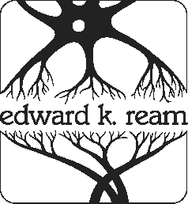
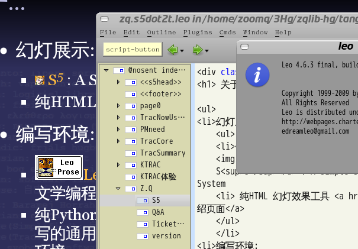
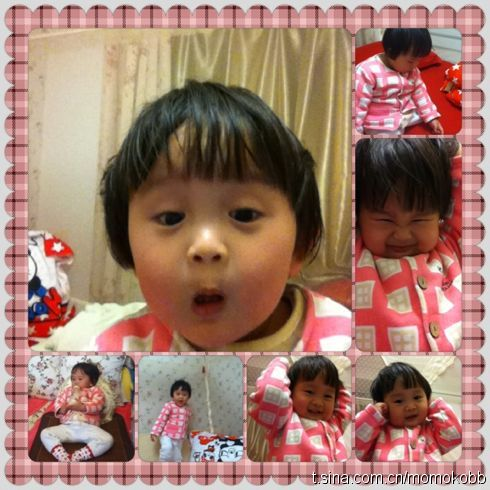
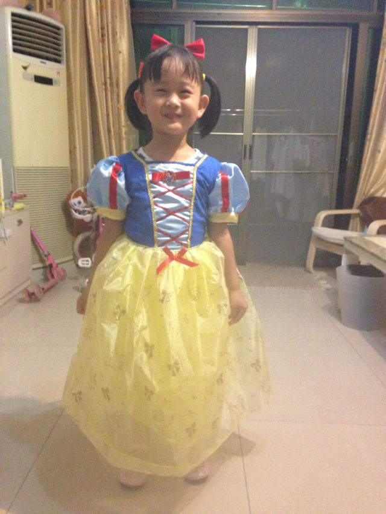

.. include:: <s5defs.txt>

==================================================================
Leo
==================================================================

～文学式编程体验

:Authors: `Zoom.Quiet <zoomquiet+s5@gmail.com>`__
:URL:    http://zoomquiet.org/res/s5/131101-leo-china/

.. This document has been placed in the CC domain.
.. _Docutils: http://docutils.sourceforge.net/
.. _reStructuredText: http://docutils.sourceforge.net/rst.html
.. _S5: http://meyerweb.com/eric/tools/s5/
.. _Firefox: http://www.mozilla.com/firefox/
.. _猎豹: http://liebao.cn

.. _EKR: http://leoeditor.com/ekr.html
.. _Leo: http://leoeditor.com
.. _Leonine: http://leoeditor.com/leonine-world.html

.. _Zoom.Quiet:
    http://code.google.com/p/openbookproject/wiki/ZoomQuiet
.. _(CC)by-nc-sa:
    http://creativecommons.org/licenses/by-nc-sa/2.5/cn/
.. _FireFox:
    http://www.mozilla.com/firefox/
.. _S5介绍:
    http://zoomquiet.org/res/s5/100826-PyTDD/s5.html
.. _WYTIWYG:
    http://wiki.woodpecker.org.cn/moin/WyTiWyG
.. _GSoC:
    http://www.google-melange.com/gsoc/homepage/google/gsoc2013

.. 图片定义区
.. |zqeye| image:: i/id/zoomquiet_1-1_outline.png
   :alt: 是也乎;-)
   :target: http://wiki.woodpecker.org.cn/moin/ZoomQuiet

.. |leo| image:: i/logo/leo4-80-border.jpg
   :alt: Leo
   :target: http://leoeditor.com/

.. |zhgdg| image:: i/id/gdgzh_icon_v2_80x80.png
   :target: http://www.chinagdg.com/thread-1650-1-1.html
.. |pycon| image:: i/logo/pycon2012china-lo​go-2-h80.png
   :target: http://cn.pycon.org

.. |cc-byncsa31| image:: i/icon/cc-byncnd-88x31.png
   :alt: (CC)by-nc-sa 许可证
   :target: http://creativecommons.org/licenses/by-nc-sa/2.5/cn/
.. |cc-byncsa15| image:: i/icon/cc-byncnd-80x15.png
   :alt: (CC)by-nc-sa 许可证
   :target: http://creativecommons.org/licenses/by-nc-sa/2.5/cn/

.. |lr_s5| image:: pix/levelradar_s5.png
    :scale: 100%

.. |bullet| unicode:: U+02022
.. |mode| unicode:: U+00D8 .. capital o with stroke

.. |S5icon| image:: pix/S5icon.GIF
    :align: top
    :scale: 100%
    :target: http://www.meyerweb.com/eric/tools/s5/
.. |LeoProse| image:: pix/LeoProse.gif
    :align: top
    :scale: 100 %
    :target: http://wiki.woodpecker.org.cn/moin/LeoEnvironment

.. footer:: 

   `Zoom.Quiet`_ v13.11.01 |cc-byncsa15| 推荐用 |lbicon| 获得最佳游览效果

<免责/>
=========

.. container:: handout

   山寨的，非业界公认的，个人体验为基础!
   |zqeye|

.. class:: takahashi1

    参考所有同好行为总结而得
        - 一切资料来自网络互动挖掘
        - 一切想法来自日常学习工作
        - 一切体悟来自各种沟通交流
        - 一切知识来自社区分享印证
        - 一切经验来自个人失败体验
    

高橋流!
=========

.. container:: handout

   `Takahashi-method 幻灯风格 <http://blog.derjohng.com/2006/04/12/takahashi-method-%E7%B0%A1%E5%A0%B1/>`__ 
   源自 Ruby 创始人高橋征義(Masayoshi Takahashi)

.. class:: center

    .. image:: pix/Takahashi-method.jpg
        :scale: 150 %
        :height: 300px
        :alt: 高橋流
        :align: center
        :target: http://blog.derjohng.com/2006/04/12/takahashi-method-%E7%B0%A1%E5%A0%B1/

文字
=========

.. container:: handout

   `Takahashi-method 幻灯风格 <http://blog.derjohng.com/2006/04/12/takahashi-method-%E7%B0%A1%E5%A0%B1/>`__ 
   源自 Ruby 创始人高橋征義(Masayoshi Takahashi)

.. class:: center takahashi9

    巨大

幻灯
=========

.. container:: handout

   `Takahashi-method 幻灯风格 <http://blog.derjohng.com/2006/04/12/takahashi-method-%E7%B0%A1%E5%A0%B1/>`__ 
   源自 Ruby 创始人高橋征義(Masayoshi Takahashi)

.. class:: center takahashi9

    很多

播放
=========

.. container:: handout

   `Takahashi-method 幻灯风格 <http://blog.derjohng.com/2006/04/12/takahashi-method-%E7%B0%A1%E5%A0%B1/>`__ 
   源自 Ruby 创始人高橋征義(Masayoshi Takahashi)

.. class:: center takahashi9

    快!

播放
=========

.. container:: handout

   `Takahashi-method 幻灯风格 <http://blog.derjohng.com/2006/04/12/takahashi-method-%E7%B0%A1%E5%A0%B1/>`__ 
   源自 Ruby 创始人高橋征義(Masayoshi Takahashi)

.. class:: center takahashi8

    很快!

播放
=========

.. container:: handout

   `Takahashi-method 幻灯风格 <http://blog.derjohng.com/2006/04/12/takahashi-method-%E7%B0%A1%E5%A0%B1/>`__ 
   源自 Ruby 创始人高橋征義(Masayoshi Takahashi)

.. class:: center takahashi7

    非常快!

所以:
=========

.. container:: handout

   `Takahashi-method 幻灯风格 <http://blog.derjohng.com/2006/04/12/takahashi-method-%E7%B0%A1%E5%A0%B1/>`__ 
   源自 Ruby 创始人高橋征義(Masayoshi Takahashi)

.. class:: center takahashi10

    :orange:`听`

<brief/>
=========

.. container:: handout

    最想跟同学们吼的... |zqeye|

.. class:: takahashi

    - :gray:`3' 有关`
    - :orange:`7'   Leo不是什么`
    - :silver:`3'   Leo 内什么的`
    - :silver:`15'  Leo 享受到的`
    - :silver:`7' 自由吐糟`

.. container:: notes

   - 

不完全是
==================

.. container:: handout

   相比 subl 什么的 |zqeye|

.. class:: takahashi8

    编辑器

.. container:: notes

   - 

支持不良
==================

.. container:: handout

   手工细细来... |zqeye|

.. class:: takahashi8

    配色

.. container:: notes

   - 

支持不良
==================

.. container:: handout

   行列式编辑... |zqeye|

.. class:: takahashi8

    块

.. container:: notes

   - 

支持不良
==================

.. container:: handout

   NO COOL... |zqeye|

.. class:: takahashi8

    略图

.. container:: notes

   - 

支持不良
==================

.. container:: handout

   NO COOL... |zqeye|

.. class:: takahashi8

    插件

.. container:: notes

   - 

:orange:`当然不`\ 是
=============================

.. container:: handout

   hate IDE |zqeye|

.. class:: takahashi8

    IDE

.. container:: notes

   - 

支持不良
==================

.. container:: handout

   NO COOL... |zqeye|

.. class:: takahashi8

    高亮

.. container:: notes

   - 

支持不良
==================

.. container:: handout

   NO COOL... |zqeye|

.. class:: takahashi8

    配对

.. container:: notes

   - 

支持不良
==================

.. container:: handout

   NO COOL... |zqeye|

.. class:: takahashi8

    补全

.. container:: notes

   - 

支持不良
==================

.. container:: handout

   NO COOL... |zqeye|

.. class:: takahashi8

    折叠

.. container:: notes

   - 

支持不良
==================

.. container:: handout

   NO COOL... |zqeye|

.. class:: takahashi8

    单步

.. container:: notes

   - 

支持不良
==================

.. container:: handout

   NO COOL... |zqeye|

.. class:: takahashi8

    重构

.. container:: notes

   - 

支持不良
==================

.. container:: handout

   NO COOL... |zqeye|

.. class:: takahashi8

    下钻

.. container:: notes

   - 

支持不良
==================

.. container:: handout

   VIM/Emacs... |zqeye|

.. class:: takahashi8

    快捷键

.. container:: notes

   - 

支持不良
==================

.. container:: handout

   嗯嗯嗯?! |zqeye|

.. class:: takahashi8

    etc.

.. container:: notes

   - 

那用个屁了!
==================

.. container:: handout

   图样儿图森破... |zqeye|

.. class:: takahashi8

    为毛?

.. container:: notes

   - 

<brief/>
=========

.. container:: handout

    最想跟同学们吼的... |zqeye|

.. class:: takahashi

    - :gray:`3' 有关ZQ`
    - :gray:`7'     Leo不是什么`
    - :orange:`3'   Leo 内什么的`
    - :silver:`15'  Leo 享受到的`
    - :silver:`7' 自由吐糟`

.. container:: notes

   - 

`Leo`_
===========================

.. container:: handout

    其实... |zqeye|

.. class:: takahashi

    .. image:: i/logo/leo4-80-border.jpg
        :align: center
        :height: 400px
        :target: http://leoeditor.com

.. container:: notes

   - leo4-80-border.jpg

`Leo`_
===========================

.. container:: handout

    其实... |zqeye|

.. class:: incremental takahashi

    * :orange:`L`\ eonine
    * :orange:`E`\ ditor with
    * :orange:`O`\ utlines

.. container:: notes

   - Leonine refers to Leo’s unique way of organizing data and programs. This has many implications:

`Leo`_
===========================

.. container:: handout

    俺感觉... |zqeye|

.. class:: incremental takahashi

    * :orange:`L`\ iterate
    * :orange:`E`\ ditor with
    * :orange:`O`\ utlines

.. container:: notes

   - 

.. _Literate programming: http://www.literateprogramming.com/

`Literate programming`_
===============================================================

.. container:: handout

     " `Literate Programming(1984) <http://sunburn.stanford.edu/~knuth/lp.html>`_ " ... |knuthzh|

.. class:: takahashi7

    |knuth|  

.. |knuth| image:: i/id/knuth_head.gif
    :align: top
    :height: 300px
    :target: http://www-cs-faculty.stanford.edu/~knuth/index.html

.. container:: notes

    - 

为毛折腾出文学化编程?
====================================

.. container:: handout

   想... |knuthzh|

.. class:: takahashi7

    Pulitzer 
    
    Prize

.. container:: notes

   - Pulitzer Prize

Edsger Wybe Dijkstra
====================================

.. container:: handout

   ALGOL 68; goto 有害 |knuthzh|

.. class:: takahashi7

    没结构

.. container:: notes

   - 

为毛折腾出文学化编程?
====================================

.. container:: handout

   goto 不一定有害 |knuthzh|

.. class:: takahashi7

    没文化

.. container:: notes

   - 

Donald E.Knuth
====================================

.. container:: handout

   英国先... |knuthzh|

.. class:: takahashi

    Computer 
    
    Journal

.. container:: notes

   - Stanford GraphBase

首个实现
==================

.. container:: handout

   1981发布;Pascal |knuthzh|

.. class:: takahashi8

    `WEB <http://www.literateprogramming.com/web.pdf>`_

.. container:: notes

   - 

.. _其它实现: http://www.literateprogramming.com/articles.html

`其它实现`_
===================================

.. container:: handout

   - FWEB
   - noweb
   - cnoweb
   - ...

.. class:: takahashi8

    `CWEB <http://sunburn.stanford.edu/~knuth/cweb.html>`_

.. container:: notes

   - 

用程序写书
====================================

.. container:: handout

   `A Platform for Combinatorial Computing  <http://www-cs-faculty.stanford.edu/~knuth/sgb.html>`_ ... |knuthzh|

.. class:: takahashi5

    Stanford 
    
    GraphBase

.. container:: notes

   - Stanford GraphBase

我们都是
==================

.. container:: handout

    是也乎 |lbtc|

.. class:: takahashi7

    不\ :orange:`折腾`\ 要死星人

.. container:: notes

   - 

`EKR`_
====================================

.. container:: handout

  令德华  |EKR|

.. class:: takahashi

    .. image:: i/id/EKR.jpg
        :align: center
        :height: 400px
        :alt: EKR
        :target: http://leoeditor.com/ekr.html

.. container:: notes

   - ...

`EKR`_
====================================

.. container:: handout

    IBM..威斯康星的麦迪逊..电脑店... |EKR|

.. class:: takahashi8

    1974

.. container:: notes

   - ...

`EKR`_
====================================
.. _Sherlock: https://sourceforge.net/projects/leo/files/Miscellaneous/Sherlock/

.. container:: handout

    1980...1986 TeXbook..WEB |EKR|

.. class:: takahashi7

    `Sherlock`_

.. container:: notes

   - ...

`EKR`_
====================================
.. _Sherlock: https://sourceforge.net/projects/leo/files/Miscellaneous/Sherlock/

.. container:: handout

    Leo 核心完成 |EKR|

.. class:: takahashi7

    1996

.. container:: notes

   - ...

`EKR`_
====================================

.. container:: handout

    C->C++ Borland Leo, 3.12 Final->11.17 Py |EKR|

.. class:: takahashi7

    2001

.. container:: notes

   - ...

`EKR`_
====================================

.. container:: handout

    `关静态类型检查 <https://groups.google.com/forum/#%21forum/python-static-type-checking>`_ |EKR|

.. class:: takahashi7

    Guido

.. container:: notes

   - ...

`EKR`_
====================================

.. container:: handout

  围棋, 钢琴  |EKR|

.. class:: takahashi7

    `令德华 <https://medium.com/i-m-h-o/9520fee0b59f>`_

.. container:: notes

   - ...

我们都是
==================

.. container:: handout

    是也乎 |lbtc|

.. class:: takahashi7

    不\ :orange:`折腾`\ 要死星人

.. container:: notes

   - 

`Leo`_
===========================

.. container:: handout

    其实... |zqeye|

.. class:: takahashi

    .. image:: i/snap/131101_leo4.10final_28percent_bycn.png
        :align: center
        :height: 420px
        :target: http://leoeditor.com

.. container:: notes

   - leo4-80-border.jpg

<brief/>
=========

.. container:: handout

    最想跟同学们吼的... |zqeye|

.. class:: takahashi

    - :gray:`3' 有关`
    - :gray:`7'     Leo不是什么`
    - :gray:`3'     Leo 内什么的`
    - :orange:`15'  Leo 享受到的`
    - :silver:`7' 自由吐糟`

.. container:: notes

   - 

俺用 `Leo`_
===========================

.. container:: handout

    4.3... |zqeye|

.. class:: takahashi7

    2005

.. container:: notes

   - Leonine refers to Leo’s unique way of organizing data and programs. This has many implications:

俺用 `Leo`_
===========================

.. container:: handout

    2003 server... |zqeye|

.. class:: takahashi7

    M$

.. container:: notes

   - Leonine refers to Leo’s unique way of organizing data and programs. This has many implications:

俺用 `Leo`_
===========================

.. container:: handout

    2003 server... |zqeye|

.. class:: takahashi7

    Tk

.. container:: notes

   - Leonine refers to Leo’s unique way of organizing data and programs. This has many implications:

俺用 `Leo`_
===========================

.. container:: handout

    2006~2011 |zqeye|

.. class:: takahashi7

    Ubuntu

.. container:: notes

   - Leonine refers to Leo’s unique way of organizing data and programs. This has many implications:

俺用 `Leo`_
===========================

.. container:: handout

    至今 |zqeye|

.. class:: takahashi7

    MAC

.. container:: notes

   - Leonine refers to Leo’s unique way of organizing data and programs. This has many implications:

俺用 `Leo`_
===========================

.. container:: handout

    现在 |zqeye|

.. class:: takahashi8

    Qt

.. container:: notes

   - Leonine refers to Leo’s unique way of organizing data and programs. This has many implications:

俺用 `Leo`_
===========================

.. container:: handout

    起初 |zqeye|

.. class:: takahashi7

    PIM

.. container:: notes

   - Leonine refers to Leo’s unique way of organizing data and programs. This has many implications:

俺用 `Leo`_
===========================

.. container:: handout

    然后 |zqeye|

.. class:: takahashi7

    半年

.. container:: notes

   - Leonine refers to Leo’s unique way of organizing data and programs. This has many implications:

俺用 `Leo`_
===========================

.. container:: handout

    享受至今 |zqeye|

.. class:: takahashi7

    编程

.. container:: notes

   - Leonine refers to Leo’s unique way of organizing data and programs. This has many implications:

俺爱 `Leo`_
===========================

.. container:: handout

    核在... |zqeye|

.. class:: takahashi7

    Literate

.. container:: notes

   - Leonine refers to Leo’s unique way of organizing data and programs. This has many implications:

俺爱 `Leo`_
===========================

.. container:: handout

    编程时什么... |zqeye|

.. class:: takahashi7

    :orange:`最`\ 重要?

.. container:: notes

   - Leonine refers to Leo’s unique way of organizing data and programs. This has many implications:

俺爱 `Leo`_
====================================

.. container:: handout

  代码?  |zqeye|

.. class:: takahashi

    .. image:: i/abt_leo_0-code.png
        :align: center
        :height: 520px
        :alt: Leo
        :target: http://leoeditor.com

.. container:: notes

   - ...

俺爱 `Leo`_
====================================

.. container:: handout

  语法?  |zqeye|

.. class:: takahashi

    .. image:: i/abt_leo_1-syntax.png
        :align: center
        :height: 520px
        :alt: Leo
        :target: http://leoeditor.com

.. container:: notes

   - ...

俺爱 `Leo`_
====================================

.. container:: handout

  思维?  |zqeye|

.. class:: takahashi

    .. image:: i/abt_leo_2-mind0.jpg
        :align: center
        :height: 420px
        :alt: Leo
        :target: http://leoeditor.com

.. container:: notes

   - ...

俺爱 `Leo`_
====================================

.. container:: handout

  流程?  |zqeye|

.. class:: takahashi

    .. image:: i/map/wsd_flow-napkin.png
        :align: center
        :height: 420px
        :alt: Leo
        :target: http://leoeditor.com

.. container:: notes

   - ...

俺爱 `Leo`_
====================================

.. container:: handout

  灵感?  |zqeye|

.. class:: takahashi

    .. image:: i/abt_leo_2-mind1.jpg
        :align: center
        :height: 420px
        :alt: Leo
        :target: http://leoeditor.com

.. container:: notes

   - ...

俺爱 `Leo`_
====================================

.. container:: handout

  提纲!  |zqeye|

.. class:: takahashi

    .. image:: i/abt_leo_3-lineout.png
        :align: center
        :height: 520px
        :alt: Leo
        :target: http://leoeditor.com

.. container:: notes

   - ...

俺爱 `Leo`_
====================================

.. container:: handout

  映射...  |zqeye|

.. class:: takahashi

    .. image:: i/abt_leo_4-relation.png
        :align: center
        :height: 520px
        :alt: Leo
        :target: http://leoeditor.com

.. container:: notes

   - ...

俺爱 `Leo`_
====================================

.. container:: handout

  双向绑定!  |zqeye|

.. class:: takahashi

    .. image:: i/abt_leo_5-subcode.png
        :align: center
        :height: 520px
        :alt: Leo
        :target: http://leoeditor.com

.. container:: notes

   - ...

俺爱 `Leo`_
====================================

.. container:: handout

  珠海GDG wecaht 应答系统!  |zqeye|

.. class:: takahashi

    .. image:: i/abt_leo_6-parent-nodes.png
        :align: center
        :height: 420px
        :alt: Leo
        :target: http://leoeditor.com

.. container:: notes

   - ...

俺爱 `Leo`_
====================================

.. container:: handout

  珠海GDG wecaht 应答系统!  |zqeye|

.. class:: takahashi

    .. image:: i/abt_leo_7-leaf-node.png
        :align: center
        :height: 420px
        :alt: Leo
        :target: http://leoeditor.com

.. container:: notes

   - ...

俺爱 `Leo`_
====================================

.. container:: handout

  不够编辑  |zqeye|

.. class:: takahashi

    .. image:: i/abt_leo_not-editor.png
        :align: center
        :height: 420px
        :alt: Leo
        :target: http://leoeditor.com

.. container:: notes

   - ...

俺爱 `Leo`_
====================================

.. container:: handout

  不怎么用的...  |zqeye|

.. class:: takahashi

    .. image:: i/abt_leo_can-cmd.png
        :align: center
        :height: 420px
        :alt: Leo
        :target: http://leoeditor.com

.. container:: notes

   - abt_leo_comm-everything.png

享受 `Leo`_
===========================

.. container:: handout

    设想... |zqeye|

.. class:: takahashi7

    自然

.. container:: notes

   - Leonine refers to Leo’s unique way of organizing data and programs. This has many implications:

自然编程:0
====================================

.. container:: handout

  启动!  |zqeye|

.. class:: takahashi7

    脚手架

.. container:: notes

   - ...

自然编程:1
====================================

.. container:: handout

  以往相似的代码  |zqeye|

.. class:: takahashi7

    复制

.. container:: notes

   - ...

自然编程:2
====================================

.. container:: handout

  先能用  |zqeye|

.. class:: takahashi7

    运行

.. container:: notes

   - ...

自然编程:3
====================================

.. container:: handout

  不断重构  |zqeye|

.. class:: takahashi7

    实用

.. container:: notes

   - ...

自然编程:0 <- `Leo`_
====================================

.. container:: handout

  8股式...  |zqeye|

.. class:: takahashi

    .. image:: i/abt_leo_comm-everything.png
        :align: center
        :height: 420px
        :alt: Leo
        :target: http://leoeditor.com

.. container:: notes

   - abt_leo_comm-everything.png

自然编程:1 <- `Leo`_
====================================

.. container:: handout

  复合式  |zqeye|

.. class:: takahashi7

    节点

.. container:: notes

   - ...

自然编程:2 <- `Leo`_
====================================

.. container:: handout

  先能用...大函式  |zqeye|

.. class:: takahashi7

    专注

.. container:: notes

   - ...

自然编程:3 <- `Leo`_
====================================

.. container:: handout

  不断重构  |zqeye|

.. class:: takahashi7

    思路
    
    :orange:`不变`

.. container:: notes

   - ...

`Leo`_
===========================

.. container:: handout

    其实... |zqeye|

.. class:: takahashi

    .. image:: i/logo/leo4-80-border.jpg
        :align: center
        :height: 400px
        :target: http://leoeditor.com

.. container:: notes

   - leo4-80-border.jpg

`Leo`_
===========================

.. container:: handout

    `Leonine`_ 狮样的... |zqeye|

.. class:: takahashi

    * :orange:`L`\ eonine
    * :orange:`E`\ ditor with
    * :orange:`O`\ utlines

.. container:: notes

   - Leonine refers to Leo’s unique way of organizing data and programs. This has many implications:

`享受Leo`_
====================================

.. _享受Leo: http://leoeditor.com/testimonials.html#leo-is-fun-even-addicting

.. container:: handout

  人的自然思维...反结构化的...  |zqeye|

.. class:: takahashi8

    :orange:`漫生`

.. container:: notes

   - ...

`享受Leo`_
====================================

.. container:: handout

  不是注释...  |zqeye|

.. class:: takahashi8

    :orange:`文学`\ 化

.. container:: notes

   - ...

`享受Leo`_
====================================

.. container:: handout

  不是注释...  |zqeye|

.. class:: takahashi7

    可\ :orange:`运行`

.. container:: notes

   - ...

`享受Leo`_
====================================

.. container:: handout

  一切程序都是提纲的变形 !...  |zqeye|

.. class:: takahashi7

    :orange:`提纲`

.. container:: notes

   - ← ↑ → ↓

`Leo`_ 的核心操作
====================================

.. container:: handout

  ...  |zqeye|

.. class:: takahashi7

    常用
    
    操作

.. container:: notes

   - 

`Leo`_ 的核心操作
====================================

.. container:: handout

  节点漫游...  |zqeye|

.. class:: takahashi7

    ⌥ +
    
    ← ↑ → ↓

.. container:: notes

   - 

`Leo`_ 的核心操作
====================================

.. container:: handout

  节点移动...  |zqeye|

.. class:: takahashi7

    ⌘+
    
    ← ↑ → ↓

.. container:: notes

   - 

`Leo`_ 的核心操作
====================================

.. container:: handout

  节点追加...  |zqeye|

.. class:: takahashi7

    ⌘+i

.. container:: notes

   - 

`Leo`_ 的核心操作
====================================

.. container:: handout

  节点删除...  |zqeye|

.. class:: takahashi7

    ⌘+\ :orange:`.`

.. container:: notes

   - 

`Leo`_ 的核心操作
====================================

.. container:: handout

  节点复用...  |zqeye|

.. class:: takahashi7

    ⌘+⇧
      
    [c|v]

.. container:: notes

   - 

`Leo`_ 的核心操作
====================================

.. container:: handout

  克隆节点...  |zqeye|

.. class:: takahashi7

    ⌘+\ :orange:`\``

.. container:: notes

   - 

`Leo`_ 的核心算子
====================================

.. container:: handout

  行为声明...  |zqeye|

.. class:: takahashi7

    :orange:`算子`

.. container:: notes

   - 

`Leo`_ 的核心算子
====================================

.. container:: handout

  路径声明...  |zqeye|

.. class:: takahashi7

    @path

.. container:: notes

   - 

`Leo`_ 的核心算子
====================================

.. container:: handout

  文件形式声明...  |zqeye|

.. class:: takahashi7

    @file

.. container:: notes

   - 

`Leo`_ 的核心算子
====================================

.. container:: handout

  文件形式声明...  |zqeye|

.. class:: takahashi7

    @nosent

.. container:: notes

   - 

`Leo`_ 的核心算子
====================================

.. container:: handout

  文件形式声明...  |zqeye|

.. class:: takahashi7

    @shadow

.. container:: notes

   - 

`Leo`_ 的核心算子
====================================

.. container:: handout

  文件形式声明...  |zqeye|

.. class:: takahashi

    @language

.. container:: notes

   - 

`Leo`_ 的核心算子
====================================

.. container:: handout

  文件形式声明...  |zqeye|

.. class:: takahashi

    @tabwidth

.. container:: notes

   - 

`Leo`_ 的核心算子
====================================

.. container:: handout

  节点声明...  |zqeye|

.. class:: takahashi7

    @\ others

.. container:: notes

   - 

`Leo`_ 的核心算子
====================================

.. container:: handout

  Essential section...  |zqeye|

.. class:: takahashi7

    <\ < 节 >\ >

.. container:: notes

   - abt_leo_usage-all.png

`Leo`_
===========================

.. container:: handout

    运用所有... |zqeye|

.. class:: takahashi

    .. image:: i/abt_leo_usage-all.png
        :align: center
        :height: 420px
        :target: http://leoeditor.com

.. container:: notes

   - leo4-80-border.jpg

<brief/>
=========

.. container:: handout

    最想跟同学们吼的... |zqeye|

.. class:: takahashi

    - :gray:`3' 有关`
    - :gray:`7'     Leo 不是什么`
    - :gray:`3'     Leo 内什么的`
    - :gray:`15'    Leo 享受到的`
    - :orange:`7' 自由吐糟`

.. container:: notes

   - 

总之
=========

.. container:: handout

   期望可以记住的~单位时间可以记住的只有7+-2 个 |zqeye|

.. class:: incremental takahashi

    * `Leo`_ 不是任何已知环境
    * `Leo`_ 解放的是代码的\ :orange:`生长过程`
    * `Leonine`_ 具有成瘾性!
    * `Leonine`_ 你值得体验;-)

.. container:: notes

   - 

<版本/>
=========

.. container:: handout

   |zqeye|

- 131113 精简! 为澳门 IT.汇
- 131101 重构为 rst2s5 格式
- 100611 首次亚太PyCon上LightTalk
- 060730 首次分享

:反馈:
    zoomquiet+s5@gmail.com
:查阅:
    http://zoomquiet.org/res/s5/131101-leo-china/

`S5 <http://www.meyerweb.com/eric/tools/s5/>`__
==============================================================================================

.. container:: handout

    纯HTML 幻灯撰写框架!... |lr_s5| 

- S\ :sup:`5`\ == a :orange:`S` imple :orange:`S` tandards-Based :orange:`S` lide :orange:`S` how :orange:`S` ystem 

 - 仅仅依靠 CSS+JS 的HTML格式幻灯演示框架

- 我的编辑环境: |LeoProse| ~ `文学化编辑器 <http://en.wikipedia.org/wiki/Literate_programming>`__

.. container:: notes

   - 

<Zoom.Quiet/>
==================

.. container:: handout

 本命+4,有娃有房,专业大妈  |zqeye|

.. class:: takahashi

    .. image:: i/foto/120826_niuniu.png
        :align: center
        :target: http://weibo.com/zoomquiet

<brief/>
=========

.. container:: handout

   最想跟同学们吼的... |zqeye|

.. class:: takahashi

    - :orange:`3' 有关`
    - :silver:`7'   Leo 不是什么`
    - :silver:`3'   Leo 内什么的`
    - :silver:`15'  Leo 享受到的`
    - :silver:`7' 自由吐糟`

.. container:: notes

   - 

<Zoom.Quiet>
==================

.. container:: handout

   |zqeye|

.. class:: takahashi

    .. image:: i/id/100514-zq-eye.png
        :align: center
        :scale: 80 %
        :alt: 是也乎,是也乎

    .. image:: i/map/50ren-ZoomQuiet-s5-v800.png
        :align: center
        :scale: 100 %
        :alt: Zoom.Quiet
        :target: http://zoomquiet.org

.. container:: notes

   - 

是也乎
==================

.. container:: handout

   |zqeye|

.. class:: takahashi8

    奔四

.. container:: notes

   - 

广告@常州
==================

.. container:: handout

   大学时代入错行，浪费两年;-{ |zqeye|

.. class:: takahashi8

    1999

.. container:: notes

   - 

开发@上海
==================

.. container:: handout

   战上海:HTML->JS->PHP->XSL->Py |zqeye|

.. class:: takahashi8

    ~2004

.. container:: notes

   - 

`2003:CZUG.org <http://czug.org/>`__
======================================================

.. container:: handout

   learnning Zope/Plone... |zqeye|

.. class:: takahashi1

    - **C** hina
    - **Z** ope
    - **U** ser
    - **G** roup

    .. image:: i/logo/logo-czug.png
        :align: center
        :alt: http://czug.org

.. container:: notes

   - 

`2004:啄木鸟 <http://www.woodpecker.org.cn/>`__
=================================================

.. container:: handout

   admin. MoinMoin 1.2.4... |zqeye|

.. class:: center

    .. image:: i/logo/logo-wpwww_banner.png
        :align: center
        :alt: http://www.woodpecker.org.cn

    - |logo_wpwiki_banner| \ :sup:`MoinMoin 1.4.*`\    
    - |wiki_banner| \ :sup:`MoinMoin 1.7.*`\    
    - |wp_zoomq_scrot| \ :sup:`MoinMoin 1.9.*`\

.. |wiki_banner| image:: i/logo/logo_wp-wiki_banner.png
    :align: bottom
    :alt: http://wiki.woodpecker.org.cn

.. |wp_zoomq_scrot| image:: i/logo/logo_wiki-wp_zoomq_scrot.png
    :align: bottom
    :scale: 100 %
    :alt: http://wiki,woodpecker.org.cn

.. container:: notes

   - 

PI@北京
==================

.. container:: handout

   混北京:SINA->CPyUG->SLL |zqeye|

.. class:: takahashi8

    ~2007

.. container:: notes

   - 

2005:`CPyUG`__-> BPyUG
======================================================

__ http://wiki.woodpecker.org.cn/moin/BPUG/2005-07-30
.. container:: handout

   working with Python,in SINA.com |zqeye|

.. class:: takahashi1

    .. image:: i/logo/120201-CPyUG-logo-v2.png
        :align: center
        :height: 500px
        :alt: CPyUG
        :target: http://wiki.woodpecker.org.cn/moin/CPUG

.. container:: notes

   - BPUG-logo-v1.3.png

2005:`CPyUG`__-> BPyUG
======================================================

__ http://wiki.woodpecker.org.cn/moin/BPUG/2005-07-30
.. container:: handout

   working with Python,in SINA.com |zqeye|

.. class:: takahashi1

    .. image:: i/logo/BPUG-logo-v1.2.png
        :align: center
        :height: 400px
        :alt: BPUG
        :target: http://wiki.woodpecker.org.cn/moin/BPUG

.. container:: notes

   - BPUG-logo-v1.3.png

2007:`ZPyUG`__
======================================================

__ http://wiki.woodpecker.org.cn/moin/ZPyUG

.. container:: handout

    - 在北京,主持完成了25次技术分享
    - 进入金山,使用Python 进行了各种平台的构建~ `KTRAC`__
    - spreading Python everywhere to everyone... 

__ http://py.kingsoft.net/ktrac

.. class:: takahashi1

    - **珠** 三角
    - **P** ython
    - **U** ser
    - **G** roup

    .. image:: i/logo/logo_163_game.gif
        :align: center
    .. image:: i/logo/logo_sina_home.gif
        :align: center
    .. image:: i/logo/logo-ks.jpg
        :align: center

.. container:: notes

   - 

`ECUG.org`__
======================================================

__ http://ecug.org/
.. container:: handout

   spreading Python everywhere to everyone... |zqeye|

.. class:: takahashi1

    .. image:: i/logo/ecug-logo_67bw.jpg
        :align: center
        :scale: 100 %
        :alt: ECUG
        :target: http://code.google.com/p/ecug/wiki/FrontPage

.. container:: notes

   - 

2009-09-01 出版
======================================================

.. container:: handout

   - 将多年的体验,集中到一本入门图书 "可爱的Python"
   - 并主持ZPyUG 近10次技术分享  |zqeye|

.. class:: takahashi1

    .. image:: i/090902-lovpy.jpg
        :align: center
        :alt: 可愛的Python
        :target: http://book.douban.com/subject/3884108/

.. container:: notes

   - snap4ZQMBP_apac2010.png

PyCon2011China
======================================================

.. container:: handout

   首次PyCon 落地中国... |zqeye|

.. class:: takahashi1

    .. image:: i/snap/snap4ZQMBP_pycon2011cn.png
        :align: center
        :alt: python-cn@googlegroups.com
        :target: http://cn.pycon.org/2011

.. container:: notes

   - snap4ZQMBP_pycon2011cn.png

PyCon2012ChinA
======================================================

.. container:: handout

   首次 PyCon中国双城市联办... |zqeye|

.. class:: takahashi1

    .. image:: i/snap/snap4ZQMBP_pycon2012cn.png
        :align: center
        :alt: python-cn@googlegroups.com
        :target: http://cn.pycon.org/2012

.. container:: notes

   - snap4ZQMBP_pycon2011cn.png

过一万人!
======================================================

.. container:: handout

   121024首次 Hackathon 前! |zqeye|

.. class:: takahashi1

    .. image:: i/snap/121024-python-cn-10000.png
        :align: center
        :height: 600px
        :alt: python-cn@googlegroups.com
        :target: http://groups-beta.google.com/group/python-cn

.. container:: notes

   - snap4ZQMBP_pycon2011cn.png

PyCon2013ChinA
======================================================

.. container:: handout

   今年3城联联办... |zqeye|

.. class:: takahashi1

    .. image:: i/snap/snap4ZQMBP_pycon2013cn.png
        :align: center
        :alt: python-cn@googlegroups.com
        :target: http://cn.pycon.org/2013

.. container:: notes

   - snap4ZQMBP_pycon2011cn.png

`珠海GDG <http://www.chinagdg.com/thread-1329-1-1.html>`_
========================================================================

.. container:: handout

   Google Developer Group... |zhgdg|

.. class:: takahashi1

    .. image:: i/logo/ZH_GDG_Logo_b_h100.png
        :align: center
        :height: 200px
        :alt: ECUG
        :target: http://code.google.com/p/ecug/wiki/FrontPage

.. container:: notes

   - 2013-09-14 13-03-12-MOTION.gif

`珠海GDG <http://www.chinagdg.com/thread-1329-1-1.html>`_
========================================================================

.. container:: handout

   DevFest2013 |zhgdg|

.. class:: takahashi1

    .. image:: i/2013-09-14_13-03-12-MOTION.gif
        :align: center
        :height: 500px
        :alt: GDG
        :target: http://gplus.to/gdgzh

.. container:: notes

   - 2013-09-14 13-03-12-MOTION.gif

综上...
==================

.. container:: handout

   基调是分享交流;-} |zqeye|

.. class:: takahashi

    俺就一

    `社区大妈`__

__ http://wiki.woodpecker.org.cn/moin/ZoomQuiet

.. container:: notes

   - 

综上...
==================

.. container:: handout

   ;-} |zqeye|

.. class:: takahashi8

    最大

    成就

.. container:: notes

   - 

牛妞
==================

.. container:: handout

   \\ (^o^) / 596d

.. container:: notes

   - 我的女儿刚刚一岁半,非常牛,,,脾气牛,头脑牛,虽然不会说话,但是已经能指挥我们干活了...
   - 120426-niuniu-表情帝

牛妞
==================

.. container:: handout

   \\ (^o^) / 1096d

.. image:: i/foto/120426nn1096d-表情帝.jpg
    :align: center
    :height: 600px
    :alt: 表情牛妞

.. container:: notes

   - 我的女儿刚刚一岁半,非常牛,,,脾气牛,头脑牛,虽然不会说话,但是已经能指挥我们干活了...
   - 131011_nn1595d-princess.jpg

牛妞
==================

.. container:: handout

   \\ (^o^) / 1595d

.. container:: notes

   - 我的女儿刚刚一岁半,非常牛,,,脾气牛,头脑牛,虽然不会说话,但是已经能指挥我们干活了...
   - 131011_nn1595d-princess.jpg

</Zoom.Quiet>
==================

.. container:: handout

    - 纯种Pythoner，自由软件原教旨主义者 
    - 关注社会化教育及知识管理；喜爱SF和摄影。 
    - 尝试使用Pythonic体验感化国人主动进入自由软件世界体验/学习/再创作

.. class:: takahashi8

   (^.^)

.. container:: notes

   - 

