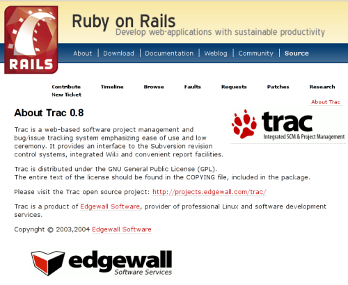
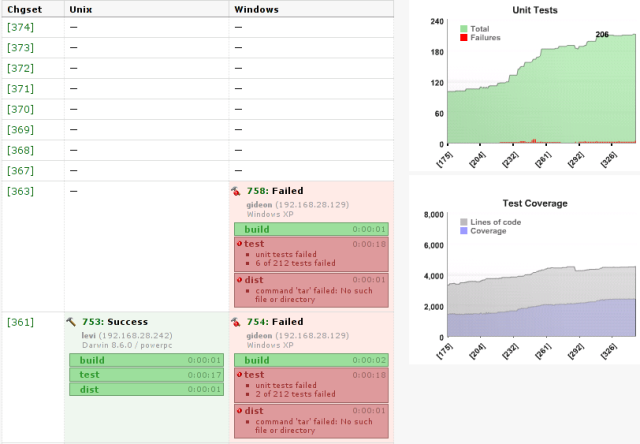

.. include:: <s5defs.txt>

==============================
Software Development With Trac
==============================

:Author: Matt Good
:Date:   $Date$

What is Trac?
=============

    Trac is an enhanced wiki and issue tracking system for software development
    projects. Trac uses a minimalistic approach to web-based software project
    management. Our mission is to help developers write great software while
    staying out of the way.

Who uses Trac?
==============

.. class:: incremental

   * Python web frameworks

     * Pylons
     * TurboGears
     * Django
     * Pyjamas
     * Twisted
     * CherryPy
     * web.py

Who uses Trac?
==============

.. class:: incremental

   * PHP web frameworks

     * CakePHP
     * Jelix
     * Symfony

   * Perl web framework

     * Catalyst

   * ColdFusion web framework

     * ColdBox

Who uses Trac?
==============

Who uses Trac?
==============

Next Python web framework?

Software project management
===========================

Common tools for managing software projects

* Bug tracker
* Version control
* Wiki

.. class:: incremental

   Problem: Information is scattered across different systems

Trac's Purpose
==============

Provide a consistent/integrated interface to this project information

* built-in Bug tracker
* built-in Wiki
* Version control integration

  * includes Subversion support
  * others available as plugins

* extensible through plugins

Integration: Timeline
=====================

* all events in one place
* RSS feed

.. image:: timeline.png

Consistency
===========

Wiki syntax used throughout Trac

* Wiki pages
* tickets (bugs/issues)
* version control commit messages
* milestone descriptions

Integration: Linking
====================

Wiki's key feature is linking

.. class:: incremental

   * WikiPageNames -> Wiki
   * #123 -> ticket
   * r123 -> revision
   * source:/filename -> source code
   * etc.

Linking example
===============

.. container:: animation

   .. image:: workflow/commit.png
      :class: hidden slide-display

   .. image:: workflow/close-ticket.png
      :class: incremental hidden slide-display

   .. image:: workflow/fixed.png
      :class: incremental hidden slide-display

   .. image:: workflow/fix-changeset.png
      :class: incremental hidden slide-display

   .. image:: workflow/annotate.png
      :class: incremental

Extending
=========

Different organizations have different needs

Write extensions in Python 

Macros
    Define function for use in the wiki

Plugins
    Extend current components or add new ones

Existing macros and plugins at http://trac-hacks.org

Macro Example
=============

Save as "plugins/whoami.py"

.. code-block:: python

    from trac.wiki.macros import WikiMacroBase

    class WhoAmIMacro(WikiMacroBase):
        """ Usage: `[[WhoAmI]]` """
        def render_macro(self, formatter,
                         name, content):
            user = formatter.req.authname
            return 'You are: ' + user

Plugins
=======

* administration
* spam filtering
* account management
* version control backends
* LDAP integration
* continuous integration

Plugins: Bitten
===============

Links
=====

* http://trac.edgewall.org
* http://trac-hacks.org
* http://bitten.cmlenz.net
* http://us.pycon.org/TX2007/TracSprint
